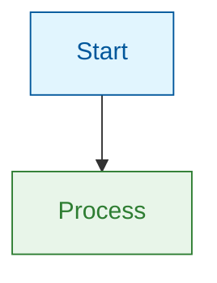

# Formatting Standards

MDX syntax, visual elements, and structure guidelines for marvinzhang.dev.

## MDX Syntax

### Frontmatter
```yaml
---
slug: article-slug
title: "Article Title"
authors: ["marvin"]
tags: ["tag1", "tag2"]
date: YYYY-MM-DD
unlisted: true  # Remove when ready to publish
---
```

### Comments & Markers
```markdown
{/* JSX comments, not HTML comments */}
{/* truncate */}  {/* Add after introduction */}
```

### Admonitions
```markdown
:::note Title
Content here
:::

:::tip
Helpful tip content
:::

:::warning
Warning content
:::
```

## Bold Formatting (Critical for Chinese)

Multiple bold sections on same line — add space before second `**`:
```markdown
✅ 这与 **语法属性（Syntactic Properties）** 形成对比
❌ 这与**语法属性（Syntactic Properties）**形成对比
```

Bold with quotes — add spaces inside bold markers:
```markdown
✅ ** "所有程序行为" ** 是一个语义属性
❌ **"所有程序行为"** 是一个语义属性
```

Validation: `pnpm run validate:zh-bold-source` before committing.

## Visual-First Approach

- **Mermaid diagrams**: For processes, flows, architectures
- **Tables**: For all comparisons and feature lists
- **Minimal code**: ≤10 lines only when syntax is the learning point

### Mermaid Theme-Aware Styling

Always style nodes explicitly for light/dark mode:



**Color semantics**:
| Purpose   | Fill      | Stroke    | Use For                       |
| --------- | --------- | --------- | ----------------------------- |
| Info      | `#e1f5fe` | `#01579b` | Starting points, inputs       |
| Success   | `#e8f5e9` | `#2e7d32` | Completion, positive outcomes |
| Warning   | `#fff3e0` | `#e65100` | Caution, processing           |
| Error     | `#ffebee` | `#c62828` | Failures, negative states     |
| Highlight | `#f3e5f5` | `#7b1fa2` | Key concepts, emphasis        |

## Section Structure

| Section Type | Words    | Purpose                  |
| ------------ | -------- | ------------------------ |
| Introduction | 300-500  | Hook + context + roadmap |
| Main Section | 600-1000 | One concept with depth   |
| Conclusion   | 250-400  | Summary + takeaways      |

Each main section: clear H2, opening hook, core concept (bolded), visual element, transition.

## File Locations

| Content   | Path                                                         |
| --------- | ------------------------------------------------------------ |
| English   | `blog/YYYY-MM-DD-slug.mdx`                                   |
| Chinese   | `i18n/zh/docusaurus-plugin-content-blog/YYYY-MM-DD-slug.mdx` |

## References

- [references/formatting.md](references/formatting.md) — Complete MDX, Mermaid, tables, code blocks guide
