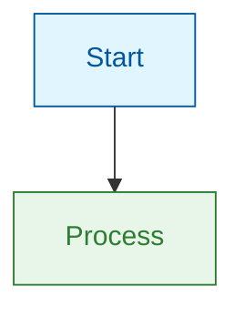

# Formatting Standards

MDX syntax, visual elements, and structure guidelines for marvinzhang.dev.

## MDX Syntax

### Frontmatter
```yaml
---
slug: article-slug
title: "Article Title"
authors: ["marvin"]
tags: ["tag1", "tag2"]
date: YYYY-MM-DD
unlisted: true  # Remove when ready to publish
---
```

### Comments & Markers
```markdown
{/* JSX comments, not HTML comments */}
{/* truncate */}  {/* Add after introduction */}
```

### Admonitions
```markdown
:::note Title
Content here
:::

:::tip
Helpful tip content
:::

:::warning
Warning content
:::
```

## Bold Formatting (Critical for Chinese)

Multiple bold sections on same line — add space before second `**`:
```markdown
✅ 这与 **语法属性（Syntactic Properties）** 形成对比
❌ 这与**语法属性（Syntactic Properties）**形成对比
```

Bold with quotes — add spaces inside bold markers:
```markdown
✅ ** "所有程序行为" ** 是一个语义属性
❌ **"所有程序行为"** 是一个语义属性
```

Validation: `pnpm run validate:zh-bold-source` before committing.

## Visual-First Approach

- **Mermaid diagrams**: For processes, flows, architectures
- **Tables**: For comparisons and feature lists — see the limit below
- **Rendered figures**: For anything the argument leans on
- **Minimal code**: ≤10 lines only when syntax is the learning point

### A table that carries the argument should be a figure

Learned 2026-08: an article's central 2×2 shipped as a bare markdown table and
the author's verdict was "太难看了". The rule that came out of it:

| The visual is… | Ship it as |
| -------------- | ---------- |
| A reference list the reader scans (options, versions, pros/cons) | Markdown table |
| A structure the argument depends on (2×2, quadrants, before/after, a position being claimed) | **Rendered figure** |

A markdown table can't show *where you are* in it. The moment the prose says
"you're in this cell and the way out is that one", the table is the wrong
medium — you need highlighting, a callout, an arrow. Build it in the house
figure style instead (860px canvas, semantic palette, bilingual variants,
HTML sources in `drafts/{slug}/figures/`, rendered by `render.mjs` into
`static/img/blog/{slug}/`).

Cheap check before shipping a table: **does any sentence near it point at a
specific cell?** If yes, it wants to be a figure.

### Size figure type for the phone, not for the canvas

A figure PNG has no width constraint, so `max-width: 100%` makes it fill the
article column. Measured on the built site: **738px on a wide desktop, 358px on
a 390px phone.** Against an 860px canvas that is a 0.42x multiplier, and 公众号
readers are all at the small end.

So the number in the CSS is not the number the reader sees:

```
effective = font-size × 358 / 860
```

Caught in review (2026-08): every one of the 60 figures in the repo put its
smallest text at **4.5–5.7px effective** (median 5.2px). Nobody wrote a 5px
font — they wrote 11.5px on a wide canvas and never checked the other end.

**Before rendering, compute the effective size of the smallest text.** Under
~7px, raise the type. The current figures sit at 17–25px on the 860px canvas,
which is 7–10px effective.

Two things follow, and the second is the one that gets skipped:

1. **Type goes up ~1.6x** from what looks right on a desktop canvas.
2. **Copy comes down to match.** Bigger type on the same layout makes the
   figure taller, and the layout is what the reader recognises. Recover the
   height by cutting words, not by shrinking type back: cells hold a label and
   an example, and the sentence explaining them belongs in the prose beside the
   figure, which is already saying it.

Check symmetry after resizing. A label that fit one line at 11.5px may wrap at
18px, and in a two-panel figure one side wrapping while the other doesn't
throws the panels' innards out of alignment. That misalignment is the usual
tell that type was scaled without re-reading the layout.

### Mermaid Theme-Aware Styling

Always style nodes explicitly for light/dark mode:


```mermaid
flowchart TD
    A[Start] --> B[Process]
    style A fill:#e1f5fe,stroke:#01579b,color:#01579b
    style B fill:#e8f5e9,stroke:#2e7d32,color:#2e7d32
```

**Color semantics**:
| Purpose   | Fill      | Stroke    | Use For                       |
| --------- | --------- | --------- | ----------------------------- |
| Info      | `#e1f5fe` | `#01579b` | Starting points, inputs       |
| Success   | `#e8f5e9` | `#2e7d32` | Completion, positive outcomes |
| Warning   | `#fff3e0` | `#e65100` | Caution, processing           |
| Error     | `#ffebee` | `#c62828` | Failures, negative states     |
| Highlight | `#f3e5f5` | `#7b1fa2` | Key concepts, emphasis        |

## Section Structure

| Section Type | Words    | Purpose                  |
| ------------ | -------- | ------------------------ |
| Introduction | 300-500  | Hook + context + roadmap |
| Main Section | 600-1000 | One concept with depth   |
| Conclusion   | 250-400  | Summary + takeaways      |

Each main section: clear H2, opening hook, core concept (bolded), visual element, transition.

## File Locations

| Content   | Path                                                         |
| --------- | ------------------------------------------------------------ |
| English   | `blog/YYYY-MM-DD-slug.mdx`                                   |
| Chinese   | `i18n/zh/docusaurus-plugin-content-blog/YYYY-MM-DD-slug.mdx` |

## References

- [references/formatting.md](references/formatting.md) — Complete MDX, Mermaid, tables, code blocks guide
