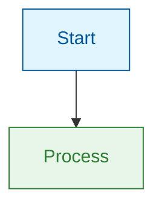

# Formatting Standards

MDX syntax, visual elements, and structure guidelines for marvinzhang.dev.

## MDX Syntax

### Frontmatter
```yaml
---
slug: article-slug
title: "Article Title"
authors: ["marvin"]
tags: ["tag1", "tag2"]
date: YYYY-MM-DD
unlisted: true  # Remove when ready to publish
---
```

### Comments & Markers
```markdown
{/* JSX comments, not HTML comments */}
{/* truncate */}  {/* Add after introduction */}
```

### Admonitions
```markdown
:::note Title
Content here
:::

:::tip
Helpful tip content
:::

:::warning
Warning content
:::
```

## Bold Formatting (Critical for Chinese)

Multiple bold sections on same line — add space before second `**`:
```markdown
✅ 这与 **语法属性（Syntactic Properties）** 形成对比
❌ 这与**语法属性（Syntactic Properties）**形成对比
```

Bold with quotes — add spaces inside bold markers:
```markdown
✅ ** "所有程序行为" ** 是一个语义属性
❌ **"所有程序行为"** 是一个语义属性
```

Validation: `pnpm run validate:zh-bold-source` before committing.

## Visual-First Approach

- **Mermaid diagrams**: For processes, flows, architectures
- **Tables**: For comparisons and feature lists — see the limit below
- **Rendered figures**: For anything the argument leans on
- **Minimal code**: ≤10 lines only when syntax is the learning point

### A table that carries the argument should be a figure

Learned 2026-08: an article's central 2×2 shipped as a bare markdown table and
the author's verdict was "太难看了". The rule that came out of it:

| The visual is… | Ship it as |
| -------------- | ---------- |
| A reference list the reader scans (options, versions, pros/cons) | Markdown table |
| A structure the argument depends on (2×2, quadrants, before/after, a position being claimed) | **Rendered figure** |

A markdown table can't show *where you are* in it. The moment the prose says
"you're in this cell and the way out is that one", the table is the wrong
medium — you need highlighting, a callout, an arrow. Build it in the house
figure style instead (860px canvas, semantic palette, bilingual variants,
HTML sources in `drafts/{slug}/figures/`, rendered by `render.mjs` into
`static/img/blog/{slug}/`).

Cheap check before shipping a table: **does any sentence near it point at a
specific cell?** If yes, it wants to be a figure.

### Figure type: check both ends, and size each element separately

A figure PNG has no width constraint, so `max-width: 100%` makes it fill the
article column. Measured on the built site, the same image is delivered at:

| | delivered width | vs 860px canvas |
| --- | --- | --- |
| Wide desktop | 738px | ×0.858 |
| 390px phone (and roughly 公众号) | 358px | ×0.416 |

**One image serves a 2.06× width range.** The number in the CSS is not the
number either reader sees:

```
phone   = font-size × 358 / 860
desktop = font-size × 738 / 860
```

**Compute both before rendering.** Checking one end is what produces the two
failure modes below, and this repo has now shipped both.

#### The two failures, in order

**Too small (2026-08, all 60 figures).** Smallest text at **4.5–5.7px
effective** on a phone, median 5.2px. Nobody wrote a 5px font; they wrote
11.5px on a wide canvas and never looked at the phone end.

**Too big (the fix for it, same week).** Every size was then scaled by a
uniform 1.6×. On desktop the figure title landed at 36px against 18px body
copy, and the figure shouted over the prose it sits in. The author's verdict:
"在 PC 上是个灾难."

The lesson is the one worth keeping: **only the small text had a problem.**
The title was already 30px on the canvas, i.e. 12.5px on a phone and perfectly
readable. Enlarging it bought nothing at the small end and cost everything at
the large end. A uniform multiplier cannot be right when only part of the range
is broken.

#### The rule

Size per element, against the desktop ceiling and the phone floor:

| element | canvas (860px) | phone | desktop |
| --- | --- | --- | --- |
| title | 32px | 13.3 | 27.5 |
| cell/panel title | 21px | 8.7 | 18.0 |
| body, notes | 20px | 8.3 | 17.2 |
| examples, eyebrow | 19px | 7.9 | 16.3 |
| footer, pins | 18px | 7.5 | 15.4 |

**Ceiling: nothing except the title exceeds 21px**, which is 18px on desktop —
no larger than body copy. A figure is a supporting element; it does not get to
out-typeset the prose.

**Floor: nothing below ~7.5px on the phone.** Under that it is decoration.

#### Three things that go with a resize

1. **Cut copy to pay for it.** Larger type on the same layout makes the figure
   taller, and the layout is what the reader recognises. Recover height by
   cutting words: cells hold a label and an example, and the sentence
   explaining them belongs in the prose beside the figure, which already says
   it.
2. **Cut the `min-height` too.** Notes trimmed to one line under a floor sized
   for three leave dead space at the bottom of every cell, which reads as
   inflated on top of whatever the type is doing. Missed on the first pass;
   132px → 108px fixed it.
3. **Re-check symmetry.** A label that fit one line at 11.5px may wrap at 21px,
   and in a two-panel figure one side wrapping while the other doesn't throws
   the panels' innards out of alignment. That misalignment is the usual tell
   that type was scaled without re-reading the layout.

Also: **SVG `font-size="11"` attributes are not CSS `font-size:`** and won't be
caught by a search-and-replace over the stylesheet. Same for text positioned by
a raw SVG `y` coordinate — it doesn't move when the font grows, so enlarged
labels collide with whatever they were sitting beside.

#### The residual tension is structural — don't re-litigate it

A single raster serving a 2.06× range cannot be optimal at both ends. The
values above are the compromise, chosen deliberately.

Capping the display width (`img[src*="/figure-"] { max-width: 560px }`) would
collapse the range to 1.56× and resolve it properly. **It was proposed twice
and declined twice** (2026-08) — the author wants figures at full column width
and the layout untouched. Do not propose it a third time; work within the
per-element rule instead.

### Mermaid Theme-Aware Styling

Always style nodes explicitly for light/dark mode:


```mermaid
flowchart TD
    A[Start] --> B[Process]
    style A fill:#e1f5fe,stroke:#01579b,color:#01579b
    style B fill:#e8f5e9,stroke:#2e7d32,color:#2e7d32
```

**Color semantics**:
| Purpose   | Fill      | Stroke    | Use For                       |
| --------- | --------- | --------- | ----------------------------- |
| Info      | `#e1f5fe` | `#01579b` | Starting points, inputs       |
| Success   | `#e8f5e9` | `#2e7d32` | Completion, positive outcomes |
| Warning   | `#fff3e0` | `#e65100` | Caution, processing           |
| Error     | `#ffebee` | `#c62828` | Failures, negative states     |
| Highlight | `#f3e5f5` | `#7b1fa2` | Key concepts, emphasis        |

## Section Structure

| Section Type | Words    | Purpose                  |
| ------------ | -------- | ------------------------ |
| Introduction | 300-500  | Hook + context + roadmap |
| Main Section | 600-1000 | One concept with depth   |
| Conclusion   | 250-400  | Summary + takeaways      |

Each main section: clear H2, opening hook, core concept (bolded), visual element, transition.

## File Locations

| Content   | Path                                                         |
| --------- | ------------------------------------------------------------ |
| English   | `blog/YYYY-MM-DD-slug.mdx`                                   |
| Chinese   | `i18n/zh/docusaurus-plugin-content-blog/YYYY-MM-DD-slug.mdx` |

## References

- [references/formatting.md](references/formatting.md) — Complete MDX, Mermaid, tables, code blocks guide
