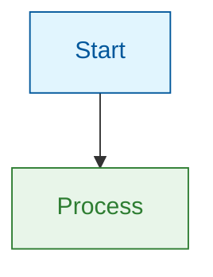

# Blog Common Guidelines

Shared standards for all marvinzhang.dev blog articles covering formatting, localization, quality, and style.

## 1. Formatting Standards

### Visual-First Approach
- **Mermaid diagrams**: For processes, flows, architectures
- **Tables**: For all comparisons and feature lists
- **Minimal code**: ≤10 lines only when syntax is the learning point
- **Admonitions**: Use `:::note`, `:::tip`, `:::warning` for callouts

### MDX Syntax
```markdown
---
slug: article-slug
title: "Article Title"
authors: ["marvin"]
tags: ["tag1", "tag2"]
date: YYYY-MM-DD
unlisted: true  # Remove when ready to publish
---

{/* JSX comments, not HTML comments */}
{/* truncate */}  {/* Add after introduction */}

:::note Title
Content here
:::
```

### Bold Formatting (Critical for Chinese)
When using multiple bold sections on same line in Chinese, add space before second `**`:
```markdown
✅ 这与 **语法属性（Syntactic Properties）** 形成对比
❌ 这与**语法属性（Syntactic Properties）**形成对比
```

With quotes, add spaces inside bold markers:
```markdown
✅ ** "所有程序行为" ** 是一个语义属性
❌ **"所有程序行为"** 是一个语义属性
```

Validation: `pnpm run validate:zh-bold-source` before committing

### Mermaid Theme-Aware Styling
Always style nodes explicitly for light/dark mode:



**Color semantics**: 
- Info/Start: `fill:#e1f5fe,stroke:#01579b`
- Success: `fill:#e8f5e9,stroke:#2e7d32`
- Warning: `fill:#fff3e0,stroke:#e65100`
- Error: `fill:#ffebee,stroke:#c62828`

[Complete formatting guide: references/formatting.md]

## 2. Localization Standards (EN ↔ ZH)

### Core Principle: 形不同而意同
Chinese translations must read naturally for native speakers, not word-for-word translations. Adapt sentence structures, expressions, and rhetoric to feel native while preserving technical accuracy.

### Required Annotations (Chinese only)

**Technical terms**: Add English at first mention
```markdown
可计算性理论（Computability Theory）
大型语言模型（Large Language Model，LLM）
```

**Notable people**: Include English names
```markdown
艾兹格·迪杰斯特拉（Edsger Dijkstra）
艾伦·图灵（Alan Turing）
```

**Chinese punctuation**: Use ，：。consistently (not , : .)

### Translation Patterns
Adapt expressions naturally:

| English | Literal (❌) | Natural (✅) |
|---------|-------------|--------------|
| "You might wonder..." | 你可能会想... | 也许你会好奇... |
| "Let's unpack this..." | 让我们解开... | 咱们来仔细看看... |
| "Here's the key insight..." | 这是关键洞察... | 关键在于... |

Break long sentences into shorter, punchier ones for Chinese. Transform rhetorical questions to Chinese patterns.

[Complete localization guide: references/localization.md]

## 3. Quality Standards

### Content Structure
- **Introduction**: 300-500 words (hook + context + roadmap)
- **Main sections**: 600-1000 words each
- **Conclusion**: 250-400 words (synthesis + takeaways)
- **Visual element**: In each main section (diagram or table)

### Technical Precision
- Specific numbers: "3x faster" not "significantly faster"
- Named technologies: "React 18" not "modern framework"
- Time-stamped claims: "As of 2026" or "In Python 3.12"
- Inline links: To official docs at first mention
- Core concepts: Bolded/highlighted at first mention
- Source everything: Link to primary sources for claims

### Validation Commands
```bash
# Chinese formatting check
pnpm run validate:zh-bold-source
pnpm run validate:zh-bold-source:fix

# Build verification
pnpm run build
pnpm dev

# Export for distribution
pnpm wechat <slug> --zh -o
pnpm medium <slug> --en -o
```

### Pre-Commit Checklist
- [ ] Build succeeds without errors
- [ ] Both EN and ZH files have matching slug and metadata
- [ ] Visual element (diagram/table) in each main section
- [ ] All claims sourced with inline links
- [ ] Chinese bold formatting validated
- [ ] No broken internal or external links
- [ ] Core concepts highlighted with callouts
- [ ] Code blocks ≤10 lines (unless exceptional)

[Complete quality checklist: references/quality-standards.md]

## 4. Writing Style (Economist-Inspired)

### Five Core Principles

**1. Clarity**: 
- Lead with core idea in first paragraph
- One idea per sentence
- Define technical terms at first use
- Break up text density with subheadings and lists

**2. Precision**: 
- Use specific numbers and measurements
- Name technologies with versions
- Time-stamp all claims
- Cut weasel words ("very," "quite," "rather")

**3. Active Voice**: 
- "React renders" not "Components are rendered"
- "The API returns JSON" not "JSON is returned"
- Aim for 80%+ active voice
- Passive acceptable when actor is unknown or irrelevant

**4. Concrete Examples**: 
- Real-world scenarios over abstract theory
- Familiar analogies for complex concepts
- Actual measurements and benchmarks
- Visual aids (diagrams, tables, flowcharts)

**5. Data-Driven**: 
- Back claims with evidence
- Include statistics and measurements
- Link to primary sources (official docs, research papers)
- Show trade-offs honestly

### Tone & Voice
- **Professional yet accessible**: Expert knowledge without condescension
- **Conversational**: Use "you" and rhetorical questions
- **Authoritative but humble**: Share expertise while encouraging learning
- **Signature transitions**: "因此", "而", "不过", "其实", "接下来"

### Sentence Variety
Mix sentence lengths for rhythm:
- **Short**: Punch. Emphasis. Drama.
- **Medium**: Standard informational delivery.
- **Long**: When showing relationships between concepts.

[Complete style guide: references/economist-principles.md]

## File Locations

**Planning artifacts**: `specs/{spec-number}-{slug}/`
- research.md (if needed)
- outline.md
- progress.md
- questionnaire.md (for announcement style)

**Draft content** (visible in preview):
- `blog/YYYY-MM-DD-slug.mdx` (with `unlisted: true`)
- `i18n/zh/docusaurus-plugin-content-blog/YYYY-MM-DD-slug.mdx`

**After publication**: 
- Remove `unlisted: true` from frontmatter
- Move spec folder to `specs/archived/` (optional)

## References

Load these for detailed guidelines:
- [references/formatting.md](references/formatting.md) - Complete MDX, Mermaid, tables guide
- [references/localization.md](references/localization.md) - Bilingual translation patterns
- [references/quality-standards.md](references/quality-standards.md) - Full validation checklist
- [references/economist-principles.md](references/economist-principles.md) - Detailed style principles

## Quick Reference

**Date Requirement**: Always get current date programmatically before creating articles:
```bash
date +%Y-%m-%d
```

**Section-by-Section Writing**: Write one complete section per interaction directly to final MDX files to avoid response limits.

**Quality Gates at Every Stage**: Validate formatting, check links, run builds incrementally.
