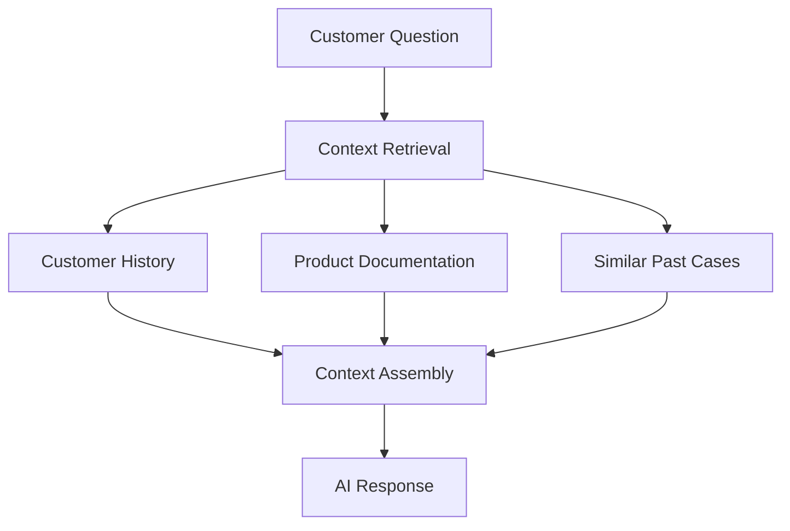
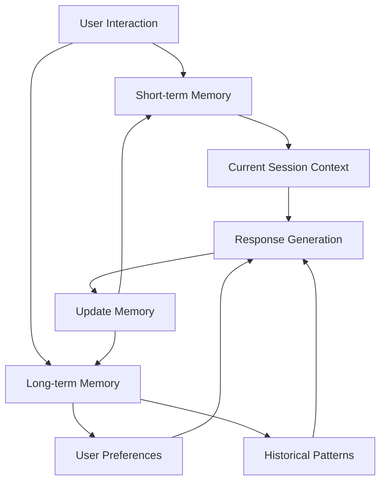
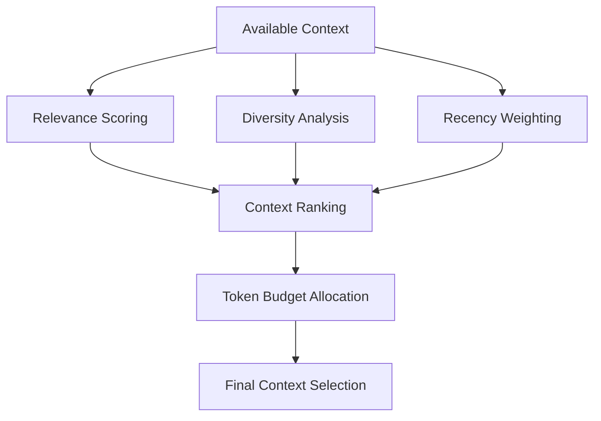

> "Context engineering is the delicate art and science of filling the context window with just the right information for the next step." — Andrej Karpathy

If you've been building with AI for a while, you've probably hit the wall where simple prompts just aren't enough anymore. Your carefully crafted prompts fail on edge cases, your AI assistant gets confused with complex tasks, and your applications struggle to maintain coherent conversations. These frustrations aren't accidental—they reveal a fundamental shift happening in AI development.

Companies like OpenAI, Anthropic, Notion, and GitHub aren't just building better models; they're pioneering entirely new approaches to how information flows into AI systems. The secret isn't in the models themselves, but in how we select, organize, and present information to them. This is the essence of context engineering.

{/* truncate */}

Unlike traditional prompt engineering, which treats AI interaction as a simple input-output process, context engineering recognizes that modern AI applications are complex information systems. Consider GitHub Copilot: it doesn't just look at your current line of code. It considers your entire codebase, your project structure, your coding patterns, and even the broader context of what you're trying to accomplish. This holistic approach to information selection is what makes it genuinely useful rather than just impressive.

Context engineering isn't about writing better prompts—it's about building smarter information architectures. It's the discipline of dynamically selecting, organizing, and presenting the most relevant information to AI systems within the constraints of context windows, processing time, and computational costs.

## From Simple Prompts to Smart Context

The limitations of traditional prompting become clear when you try to build anything beyond simple demos. Imagine you're building an AI-powered customer support system. With basic prompt engineering, you might write something like:

```
You are a helpful customer support agent. Answer the following question:
[Customer question]
```

This approach immediately runs into problems:
- **Limited context**: You can't include all product documentation, past conversations, or customer history
- **Static information**: The prompt can't adapt to new products, policies, or seasonal changes  
- **No learning**: Each interaction starts from scratch with no memory of previous conversations

Modern companies have moved beyond this limitation by implementing what we now call context engineering. Instead of static prompts, they build dynamic information systems that can:



This shift represents a fundamental change in how we think about AI interactions. Rather than trying to cram everything into a single prompt, context engineering treats information selection as a separate, specialized process. The AI receives curated, relevant context rather than generic instructions.

Companies like Notion demonstrate this beautifully. When you ask Notion AI about your workspace, it doesn't just process your query in isolation. It dynamically retrieves relevant pages, considers your recent activity, and factors in the structure of your workspace to provide contextually aware responses.

The key insight is that **context quality matters more than prompt cleverness**. A well-selected context with a simple prompt will outperform a sophisticated prompt with poor context every time.

## The RAG Revolution: Dynamic Context Retrieval

The breakthrough that enabled modern context engineering is Retrieval-Augmented Generation (RAG). While the name sounds academic, RAG is actually a straightforward concept that's become the backbone of most practical AI applications.

RAG works by splitting the AI interaction into two phases:

1. **Retrieval Phase**: Find the most relevant information for the current query
2. **Generation Phase**: Use that information to generate a response

Here's how the process flows:


This pattern has become ubiquitous because it solves the fundamental problem of AI applications: how to make them aware of information that wasn't in their training data. Customer support systems use RAG to access current product documentation. Code assistants use it to understand your specific codebase. Documentation chatbots use it to provide up-to-date answers.

The magic of RAG lies in vector search and semantic similarity. Instead of keyword matching, modern RAG systems understand the meaning behind queries. When you ask "How do I cancel my subscription?", the system doesn't just look for the word "cancel"—it finds semantically related content about subscription management, billing changes, and account modifications.

Companies implement RAG using tools like:
- **LangChain** for orchestration and workflow management
- **Chroma** or **Pinecone** for vector storage and retrieval
- **OpenAI embeddings** for converting text to semantic vectors
- **Vercel AI SDK** for streamlined integration

The beauty of RAG is its modularity. You can start with a simple implementation and progressively add sophistication:

- **Basic RAG**: Simple document retrieval and insertion
- **Advanced RAG**: Query expansion, re-ranking, and context fusion
- **Agentic RAG**: Dynamic tool selection and multi-step reasoning

What makes RAG revolutionary isn't just its technical capabilities, but its practical impact. It transforms AI applications from static knowledge repositories into dynamic, learning systems that can stay current and contextually relevant.

## Memory and Persistent Context

While RAG solves the problem of accessing external information, modern AI applications also need to remember and learn from interactions. This is where memory systems and persistent context become crucial.

Consider how ChatGPT handles conversations. It doesn't just respond to individual messages—it maintains awareness of the entire conversation history, your preferences, and the evolving context of your discussion. This persistent context is what makes AI interactions feel natural and coherent.

There are several patterns for implementing memory in context engineering:



**Short-term memory** handles the immediate conversation context. This includes recent messages, current task state, and temporary preferences. It's typically stored in the current session and discarded afterward.

**Long-term memory** captures persistent information about users, their preferences, successful interaction patterns, and learned behaviors. This is usually stored in vector databases or structured storage systems.

GitHub Copilot exemplifies sophisticated memory usage. It remembers your coding style, frequently used patterns, and project-specific conventions. Over time, its suggestions become increasingly tailored to your specific development approach.

The technical implementation of memory systems often involves:

- **Vector storage** for semantic similarity search across historical interactions
- **Structured databases** for explicit facts and preferences  
- **Embedding strategies** that capture both content and context
- **Retrieval strategies** that balance recency, relevance, and diversity

Memory systems face unique challenges around privacy, accuracy, and computational efficiency. Companies like Anthropic have pioneered techniques for constitutional AI that can maintain helpful memory while respecting user privacy and safety constraints.

The key insight is that memory transforms AI from a tool you use to a system that adapts to you. Instead of repeating context in every interaction, sophisticated memory systems learn what information is consistently relevant and surface it automatically.

## Context Optimization in Practice

Building effective context engineering systems requires careful attention to the balance between quality, performance, and cost. In production environments, these constraints become critical factors that determine the success of AI applications.

**Context Selection Strategies** determine which information to include when you have more relevant content than your context window can accommodate. Simple approaches might use recency or keyword matching, but sophisticated systems employ:

- **Relevance scoring** that considers semantic similarity, user preferences, and task requirements
- **Diversity balancing** to avoid redundant information while maintaining comprehensiveness
- **Dynamic prioritization** that adapts to the current conversation state and user goals



**Performance optimization** becomes crucial when dealing with real-time applications. Users expect responsive AI interactions, which requires careful attention to:

- **Caching strategies** for frequently accessed context
- **Parallel retrieval** for multiple information sources
- **Progressive loading** that provides fast initial responses while gathering additional context
- **Precomputation** of embeddings and similarity scores

**Cost optimization** matters because context engineering involves significant computational expenses. Embedding generation, vector storage, and retrieval operations add up quickly at scale. Successful companies implement strategies like:

- **Context reuse** across similar queries and users
- **Intelligent chunking** that balances granularity with retrieval efficiency
- **Hybrid approaches** that combine fast keyword search with expensive semantic search
- **Budget allocation** that prioritizes context quality for high-value interactions

**Quality evaluation** requires moving beyond simple output metrics to assess the effectiveness of context selection itself. Teams measure:

- **Context relevance**: How well does the retrieved information address the query?
- **Context completeness**: Is enough information provided for accurate responses?  
- **Context efficiency**: Is the information density optimized for the token budget?
- **Context freshness**: How current and accurate is the retrieved information?

The most successful implementations treat context optimization as an ongoing process rather than a one-time setup. They implement monitoring systems that track context quality metrics and continuously refine their selection and ranking algorithms based on user feedback and system performance.

## The Future of Information Selection

Context engineering represents a fundamental shift in how we build AI applications. We're moving from prompt-driven interactions to sophisticated information architectures that can dynamically adapt to user needs and task requirements.

The implications extend far beyond current applications. As AI systems become more capable, the quality of context engineering will increasingly determine the difference between impressive demos and genuinely useful products. Companies that master context selection, memory management, and information optimization will build AI applications that feel intelligent and helpful rather than just powerful.

For developers, this means that understanding context engineering is becoming as important as understanding traditional software architecture. The patterns and principles we've explored—RAG for dynamic retrieval, memory systems for persistence, and optimization techniques for production deployment—are becoming fundamental skills for AI application development.

The tools and frameworks are rapidly maturing. LangChain, Chroma, Pinecone, and others are making sophisticated context engineering accessible to individual developers and small teams. What once required significant research and development investment is becoming standard practice.

As you start your own context engineering journey, remember that the goal isn't to build the most sophisticated system possible, but to build the system that best serves your users' needs. Start with simple RAG implementations, add memory capabilities as your application grows, and optimize for the specific constraints and requirements of your use case.

The art of information selection is ultimately about understanding what matters most in each moment and ensuring that your AI systems have access to that information. In a world of infinite data and limited attention, this skill becomes increasingly valuable—for both humans and the AI systems we build.