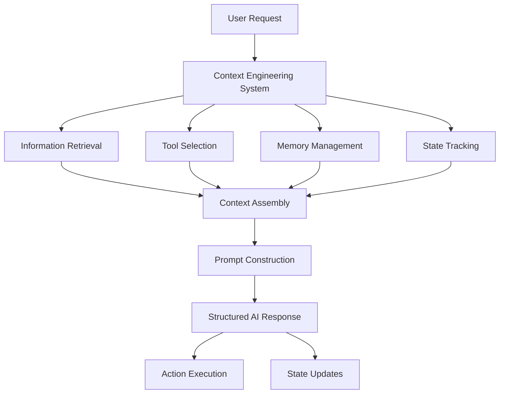
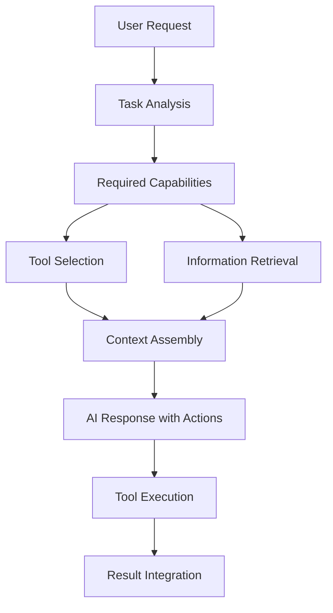
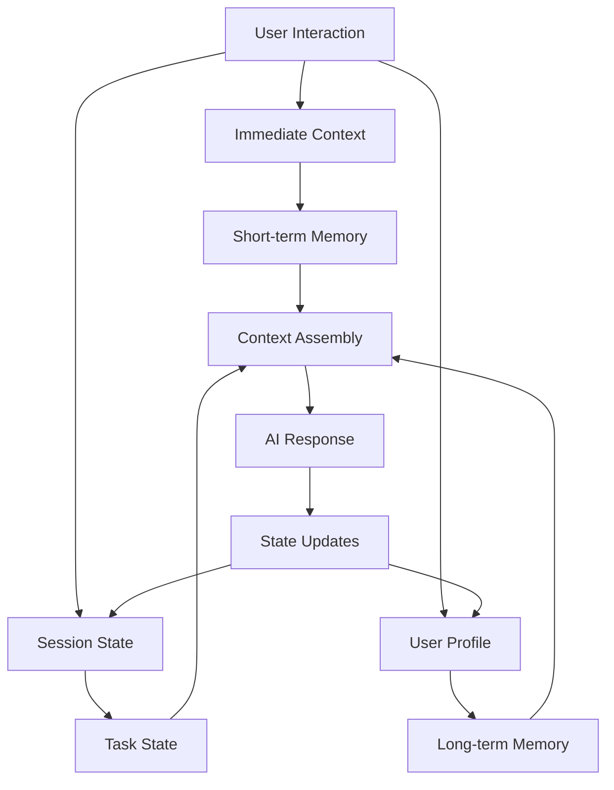
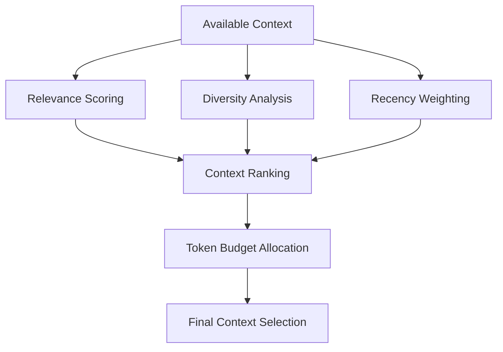

> **"Context engineering is building dynamic systems to provide the right information and tools in the right format such that the LLM can plausibly accomplish the task."** — [LangChain](https://blog.langchain.com/the-rise-of-context-engineering/)

If you've been building with AI for a while, you've probably hit the wall where simple prompts just aren't enough anymore. Your carefully crafted prompts fail on edge cases, your AI assistant gets confused with complex tasks, and your applications struggle to maintain coherent conversations. These frustrations aren't accidental—they reveal a **fundamental shift happening in AI development**.

Companies like OpenAI, Anthropic, Notion, and GitHub aren't just building better models; they're pioneering entirely new approaches to how information, tools, and structure flow into AI systems. This is the essence of context engineering.

{/* truncate */}

**Context engineering represents a paradigm shift** from simple prompt crafting to building sophisticated systems that dynamically provide AI models with everything they need to accomplish tasks effectively. Unlike traditional **prompt engineering**, which focuses on clever wording, **context engineering** encompasses the entire **information architecture**: what data to retrieve, which tools to provide, how to structure outputs, what state to maintain, and how to format everything optimally.

**Context engineering isn't about writing better prompts**—it's about building dynamic systems that can consistently provide AI models with the right information, tools, and structure to succeed. It encompasses retrieval systems, memory management, tool selection, output formatting, state tracking, and yes, prompt engineering too—all working together as a cohesive system.

## From Prompt Engineering to Context Systems

The evolution from traditional **prompt engineering** to **context engineering** represents a fundamental shift in how we think about AI applications. Early AI development focused on crafting clever prompts to coax better responses from models. But as [LangChain points out](https://blog.langchain.com/the-rise-of-context-engineering/), **prompt engineering** is actually a subset of the broader discipline of **context engineering**.

The limitations of pure prompt engineering become clear when you try to build anything beyond simple demos. Imagine you're building an AI-powered customer support system. With basic prompt engineering, you might write something like:

```
You are a helpful customer support agent. Answer the following question:
[Customer question]
```

This approach immediately runs into problems:
- **Limited context**: You can't include all product documentation, past conversations, or customer history
- **Static information**: The prompt can't adapt to new products, policies, or seasonal changes  
- **No learning**: Each interaction starts from scratch with no memory of previous conversations
- **No tools**: The AI can only respond with text, not take actions or retrieve real-time data
- **Poor structure**: Both inputs and outputs lack the formatting needed for system integration

Modern companies have moved beyond this limitation by implementing comprehensive context engineering systems. Instead of static prompts, they build dynamic information orchestration that includes:



**Prompt engineering remains important** within this broader framework, but its role becomes more focused and systematic. Rather than trying to encode all context and instructions into static prompts, modern prompt engineering focuses on:

- **Dynamic prompt construction** that assembles the right context for each specific interaction
- **Clear instruction formatting** that helps AI models parse and utilize the provided context effectively  
- **Consistent communication patterns** that work reliably across different types of retrieved information
- **Output structure specification** that ensures AI responses integrate properly with downstream systems

Companies like Notion demonstrate this beautifully. When you ask Notion AI about your workspace, the system doesn't rely on a single clever prompt. It dynamically retrieves relevant pages, considers your recent activity, factors in workspace structure, selects appropriate tools for any needed actions, and then constructs a context-rich prompt that enables accurate, actionable responses.

The key insight is that **context quality and system design matter more than prompt cleverness**. **A well-engineered context system with straightforward prompts will outperform sophisticated prompts with poor context every time**. As [LangChain emphasizes](https://blog.langchain.com/the-rise-of-context-engineering/), the question isn't whether you can write a perfect prompt, but whether you can build a system that provides AI models with everything they need to plausibly accomplish the task.

## The RAG Revolution: Dynamic Context Retrieval

The breakthrough that enabled modern **context engineering** is [**Retrieval-Augmented Generation (RAG)**](https://arxiv.org/abs/2005.11401). While the name sounds academic, **RAG** is actually a straightforward concept that's become the backbone of most practical AI applications.

**RAG** works by splitting the AI interaction into two phases:

1. **Retrieval Phase**: Find the most relevant information for the current query
2. **Generation Phase**: Use that information to generate a response

Here's how the process flows:


This pattern has become ubiquitous because it solves the fundamental problem of AI applications: how to make them aware of information that wasn't in their training data. Customer support systems use RAG to access current product documentation. Code assistants use it to understand your specific codebase. Documentation chatbots use it to provide up-to-date answers.

The magic of **RAG** lies in **vector search** and **semantic similarity**. Instead of keyword matching, modern **RAG systems** understand the meaning behind queries. When you ask "How do I cancel my subscription?", the system doesn't just look for the word "cancel"—it finds semantically related content about subscription management, billing changes, and account modifications.

Companies implement RAG using tools like:
- **[LangChain](https://python.langchain.com/docs/)** for orchestration and workflow management
- **[Chroma](https://docs.trychroma.com/)** or **[Pinecone](https://docs.pinecone.io/)** for vector storage and retrieval
- **[OpenAI embeddings](https://platform.openai.com/docs/guides/embeddings)** for converting text to semantic vectors
- **[Vercel AI SDK](https://sdk.vercel.ai/docs)** for streamlined integration

The beauty of RAG is its modularity. You can start with a simple implementation and progressively add sophistication:

- **Basic RAG**: Simple document retrieval and insertion
- **Advanced RAG**: Query expansion, re-ranking, and context fusion
- **Agentic RAG**: Dynamic tool selection and multi-step reasoning

What makes RAG revolutionary isn't just its technical capabilities, but **its practical impact**. It **transforms AI applications from static knowledge repositories into dynamic, learning systems** that can stay current and contextually relevant.

## Structure and Format: The Silent Context Engineers

While much attention focuses on what information to provide AI systems, how that information is structured and formatted can be equally crucial. Poor formatting can render even perfect information useless, while well-structured inputs and outputs can dramatically improve AI performance.

**Input Structure** affects how well AI models can parse and utilize the information you provide. Consider these two approaches to providing product documentation:

```
// Poor structure - wall of text
Here is our product documentation: Product A costs $50 and does X, Y, Z. Product B costs $75 and does A, B, C. Product C costs $100 and does M, N, O. Our return policy is 30 days...

// Better structure - organized and labeled
## Products
- **Product A**: $50 | Features: X, Y, Z
- **Product B**: $75 | Features: A, B, C  
- **Product C**: $100 | Features: M, N, O

## Policies
- **Returns**: 30-day policy
- **Shipping**: 3-5 business days
```

**Output Structure** is equally important. Modern AI applications don't just generate text—they need to produce structured outputs that integrate with existing systems. This includes:

- **JSON schemas** for API integrations and data processing
- **Function calling** with properly defined parameters and return types
- **Structured data extraction** from unstructured inputs
- **Multi-modal outputs** combining text, code, and other formats

```typescript
// Example: Structured output for customer support
interface SupportResponse {
  classification: "technical" | "billing" | "general";
  urgency: "low" | "medium" | "high";
  suggestedActions: string[];
  requiresEscalation: boolean;
  followUpRequired: boolean;
}
```

**Format Consistency** across all context elements creates a cohesive experience. When retrieval results, memory summaries, and tool outputs all follow consistent formatting patterns, AI models can process information more effectively and users can better understand system behavior.

The key insight is that **communication format matters as much as communication content**. **A short, descriptive error message will be far more useful than a massive JSON blob**. Clear, consistent formatting reduces cognitive load for both AI models and human users, leading to better outcomes across the entire system.

## Tools and Capabilities: Extending AI Beyond Information

Context engineering extends far beyond information retrieval to include the tools and capabilities that AI systems need to accomplish tasks. As [LangChain emphasizes](https://blog.langchain.com/the-rise-of-context-engineering/), providing the right tools is just as important as providing the right information.

**Tool Selection** becomes a critical aspect of **context engineering**. AI models can't accomplish complex tasks through information alone—they need the ability to take actions, retrieve additional data, and interact with external systems. The **context engineering** challenge is determining which tools to make available for each specific task or conversation.



**Function Calling** has emerged as a fundamental pattern in modern AI applications. Rather than asking AI to generate code or instructions, systems provide **structured function interfaces** that models can invoke directly:

```typescript
// Example: E-commerce assistant with structured tools
const tools = [
  {
    name: "search_products",
    description: "Search for products in the catalog",
    parameters: {
      type: "object",
      properties: {
        query: { type: "string", description: "Search terms" },
        category: { type: "string", enum: ["electronics", "clothing", "books"] },
        price_range: { type: "object", properties: { min: { type: "number" }, max: { type: "number" } }}
      }
    }
  },
  {
    name: "get_order_status", 
    description: "Check the status of an existing order",
    parameters: {
      type: "object",
      properties: {
        order_id: { type: "string", description: "The order ID to check" }
      }
    }
  }
];
```

**Tool Format Design** significantly impacts AI performance. Well-designed tool interfaces with clear descriptions, appropriate parameter types, and intuitive naming conventions enable AI models to use them effectively. Poor tool design leads to misuse, errors, and frustrated users.

**Dynamic Tool Availability** allows context engineering systems to provide different tools based on user context, conversation state, or task requirements. A customer support AI might have access to refund tools for verified customers but not for anonymous users. A development assistant might provide debugging tools only when working with code.

The crucial insight is that **tools transform AI from information processors into action-taking agents**. **Context engineering must consider not just what information to provide, but what capabilities the AI needs** to successfully complete the user's actual goals.

## Memory and State: The Evolution of Context

While **RAG** solves the problem of accessing external information and tools enable action-taking, modern AI applications also need sophisticated **memory** and **state management** to maintain coherent, evolving conversations and task progression. This represents one of the most complex aspects of **context engineering**.

**Conversation State Management** goes beyond simple message history to track the evolving context of user interactions. Consider a technical support conversation that spans multiple issues, solution attempts, and follow-up questions. Effective state management captures not just what was said, but what was attempted, what worked, what failed, and what still needs attention.



**Short-term memory** handles the immediate conversation context, including recent messages, current task state, user preferences expressed in the session, and temporary variables. This information is typically session-scoped and designed to maintain conversational flow and task continuity.

**Long-term memory** captures persistent information about users, their preferences, successful interaction patterns, learned behaviors, and historical context that transcends individual conversations. This creates personalized experiences that improve over time.

**Multi-layered State Tracking** becomes essential in complex applications. Different types of state require different management strategies:

- **Conversation flow**: What topics have been discussed, what questions answered
- **Task progression**: Steps completed, pending actions, blockers encountered  
- **User context**: Preferences, expertise level, previous successful patterns
- **System state**: Available tools, active integrations, operational constraints

GitHub Copilot exemplifies sophisticated state management. It maintains awareness of your current file, project structure, recent changes, coding patterns, and even your broader development goals. This multi-layered context awareness enables increasingly relevant suggestions as your coding session progresses.

**State Compression and Summarization** becomes necessary as conversations grow longer and context accumulates. Rather than maintaining full conversation histories, advanced systems create intelligent summaries that preserve essential context while managing token budgets:

```typescript
interface ConversationSummary {
  userGoals: string[];
  keyDecisions: string[];
  remainingTasks: string[];
  userPreferences: Record<string, any>;
  contextualFacts: string[];
  lastInteractionSummary: string;
}
```

**Cross-session Continuity** allows AI systems to maintain context across separate interactions. When a user returns to continue a project or resume a conversation, effective context engineering can restore relevant state and continue where the previous session ended.

The technical implementation involves sophisticated orchestration between multiple storage systems, retrieval strategies, and state update mechanisms. Companies use combinations of vector databases for semantic memory, structured databases for explicit facts, and caching systems for performance optimization.

The key insight is that **memory transforms AI from tools you use into systems that evolve with you**. Instead of starting fresh each time, sophisticated memory systems learn what information is consistently relevant and automatically surface it, creating AI interactions that feel truly intelligent and adaptive.

## Context Optimization in Practice

Building effective context engineering systems requires careful attention to the balance between quality, performance, and cost. In production environments, these constraints become critical factors that determine the success of AI applications.

**Context Selection Strategies** determine which information to include when you have more relevant content than your **context window** can accommodate. Simple approaches might use recency or keyword matching, but sophisticated systems employ:

- **Relevance scoring** that considers **semantic similarity**, user preferences, and task requirements
- **Diversity balancing** to avoid redundant information while maintaining comprehensiveness
- **Dynamic prioritization** that adapts to the current conversation state and user goals



**Performance optimization** becomes crucial when dealing with real-time applications. Users expect responsive AI interactions, which requires careful attention to:

- **Caching strategies** for frequently accessed context
- **Parallel retrieval** for multiple information sources
- **Progressive loading** that provides fast initial responses while gathering additional context
- **Precomputation** of embeddings and similarity scores

**Cost optimization** matters because context engineering involves significant computational expenses. Embedding generation, vector storage, and retrieval operations add up quickly at scale. Successful companies implement strategies like:

- **Context reuse** across similar queries and users
- **Intelligent chunking** that balances granularity with retrieval efficiency
- **Hybrid approaches** that combine fast keyword search with expensive semantic search
- **Budget allocation** that prioritizes context quality for high-value interactions

**Quality evaluation** requires moving beyond simple output metrics to assess the effectiveness of context selection itself. Teams measure:

- **Context relevance**: How well does the retrieved information address the query?
- **Context completeness**: Is enough information provided for accurate responses?  
- **Context efficiency**: Is the information density optimized for the token budget?
- **Context freshness**: How current and accurate is the retrieved information?

The most successful implementations treat context optimization as an ongoing process rather than a one-time setup. They implement monitoring systems that track context quality metrics and continuously refine their selection and ranking algorithms based on user feedback and system performance.

## The Future of Information Selection

Context engineering represents a fundamental shift in how we build AI applications. As AI systems become more capable, the quality of context engineering will increasingly determine the difference between impressive demos and genuinely useful products.

**The Emerging Discipline**: What started as an informal practice is crystallizing into a recognized engineering discipline. The [LangChain team](https://blog.langchain.com/the-rise-of-context-engineering/) and practitioners like [Dex Horthy](https://github.com/humanlayer/12-factor-agents) are formalizing patterns and principles that guide how we think about context systems.

**Tools and Accessibility**: The tooling ecosystem is rapidly maturing. [LangChain](https://python.langchain.com/docs/) and [LangGraph](https://github.com/langchain-ai/langgraph) for orchestration, [Chroma](https://docs.trychroma.com/) and [Pinecone](https://docs.pinecone.io/) for vector operations, frameworks like [Vercel AI SDK](https://sdk.vercel.ai/docs) for integration—what once required significant research investment is becoming accessible to individual developers and small teams.

As you start your own context engineering journey, remember that the goal isn't to build the most sophisticated system possible, but to build the system that best serves your users' needs. Start with simple RAG implementations, add memory capabilities as your application grows, incorporate appropriate tools for your domain, and optimize for your specific use case.

The art of information selection is ultimately about understanding what matters most in each moment and ensuring that your AI systems have access to that information, the tools to act on it, and the structure to communicate effectively. This holistic approach to context is what separates truly useful AI applications from impressive demos.