# Spec-Driven Development: A Systematic Approach to Complex Features

## Introduction: The Challenge of Complex Feature Development

Every developer knows the feeling of staring at a complex requirement and wondering where to begin. Modern software development increasingly involves building systems that integrate multiple services, handle diverse data formats, and coordinate across different APIs. What appears straightforward in initial specifications often evolves into intricate webs of interdependent components, each with their own constraints and edge cases.

This complexity manifests in several common development challenges that teams face regardless of their experience level or technology stack. Projects frequently suffer from scope creep as requirements evolve during implementation. Developers spend significant time explaining context to AI assistants or team members, often repeating the same architectural constraints across multiple conversations. Technical debt accumulates as developers make hasty decisions under pressure, leading to systems that become increasingly difficult to maintain and extend.

{/* truncate */}

### The Traditional Development Approach

Most development workflows follow a reactive pattern: receive a feature request, create some initial notes, and begin coding. When problems arise—which they inevitably do—developers address them ad-hoc, often with assistance from AI tools or through consultation with colleagues. While this approach works for simple tasks, it breaks down when dealing with complex, multi-faceted features.

The result is a predictable cycle of inefficiency:
- **Scope Evolution**: Requirements change during implementation because they weren't thoroughly understood upfront
- **Context Repetition**: Repeatedly explaining the same architectural constraints and business logic to different people or tools
- **Reactive Problem-Solving**: Making critical architectural decisions under time pressure without full consideration of alternatives
- **Technical Debt Accumulation**: Implementing quick fixes that create long-term maintenance burdens

Industry research validates these observations. The Standish Group's CHAOS Report consistently shows that 60-70% of software projects experience scope creep. Microsoft's developer productivity research indicates that developers spend up to 30% of their time on communication and coordination rather than implementation work.

### Introducing Spec-Driven Development

There is an alternative approach through **Spec-Driven Development (SDD)**, a methodology that addresses these challenges through systematic upfront planning. Unlike traditional ad-hoc development patterns, SDD follows a structured three-phase process designed to frontload the complexity management that typically happens reactively during implementation.

SDD isn't revolutionary—it builds on decades of software engineering research from Requirements Engineering and Design-by-Contract methodologies. However, it adapts these formal approaches specifically for modern, AI-assisted development environments where clear specifications can dramatically improve tool effectiveness.

The methodology addresses three critical pain points:

1. **Feature Complexity Management**: Breaking overwhelming requirements into manageable, incremental work
2. **Requirements Stability**: Preventing scope creep through upfront specification and validation
3. **Communication Efficiency**: Providing structured context that improves interactions with AI tools and team members

### A Systematic Alternative

Research from organizations like the IEEE Computer Society demonstrates that upfront specification work reduces defects by 40-60% and significantly improves project success rates. SDD brings this systematic thinking to contemporary development workflows, particularly those that leverage AI assistance for implementation.

The following sections provide an objective examination of how Spec-Driven Development methodology works in practice, its concrete benefits for development teams, and honest assessment of its limitations and appropriate use cases. This analysis aims to help developers make informed decisions about whether and when to adopt structured development approaches like SDD.

Rather than promising universal solutions, this overview focuses on understanding what SDD offers, where it provides value, and what trade-offs developers should consider when evaluating systematic development methodologies for their specific contexts and project requirements.

---

## Understanding Spec-Driven Development

When most developers encounter a new feature request, the typical workflow looks something like this: read the requirement, maybe create a quick task list, fire up the IDE, and start coding. If problems arise—which they inevitably do—we Google solutions, ask ChatGPT for help, or dive into documentation. It's a reactive approach that feels natural and immediate, but it often leads to the exact problems that make complex development feel chaotic and unpredictable.

**Spec-Driven Development** takes a fundamentally different approach. Instead of jumping directly into implementation, SDD insists on a structured specification phase that frontloads the thinking work. This isn't about creating heavyweight documentation or following rigid corporate processes—it's about applying systematic thinking to complex problems before they become complex code.

### The Three-Phase SDD Methodology

SDD organizes development work into three distinct phases, each with clear objectives and deliverables:

#### Phase 1: Requirements Engineering

The first phase focuses on transforming vague feature requests into precise, actionable requirements. This isn't just about writing down what the feature should do—it's about identifying edge cases, defining success criteria, and establishing the boundaries of what you're building.

SDD employs structured formats like **EARS (Easy Approach to Requirements Syntax)** to create unambiguous requirements:

```markdown
🔄 WHEN a user selects multiple publishing platforms 
✅ THEN the system SHALL publish to all selected platforms within 60 seconds

⚠️ IF a platform publish fails 
🔄 THEN the system SHALL retry up to 3 times and log the error details

🎯 WHEN publishing completes 
📊 THEN the system SHALL display success/failure status for each platform
```

:::tip EARS Syntax Components
- **WHEN/IF**: Trigger conditions that define when behavior occurs
- **THEN**: Expected system response with specific, measurable outcomes
- **SHALL**: Mandatory requirements (vs. SHOULD for preferences)
- **Specific metrics**: "60 seconds", "3 times" instead of "quickly", "several times"
:::

This format forces specificity. Instead of "the system should handle errors gracefully," you get concrete behavioral definitions that can be tested and validated. The result is a shared understanding of exactly what success looks like.

#### Phase 2: Technical Design

With clear requirements in hand, the design phase addresses the "how" of implementation. This includes system architecture, data models, API contracts, and integration patterns. The key insight is that design decisions made with complete requirements context are significantly better than those made reactively during coding.

For a multi-platform publishing system, the design phase might produce:

- **Architecture**: Publisher abstraction layer with platform-specific adapters
- **Data Models**: Content representation that supports multiple output formats
- **Error Handling**: Retry logic, circuit breakers, and user feedback mechanisms
- **Integration Patterns**: Authentication management across different platform APIs

The design isn't meant to be perfect or complete—it's meant to be **thoughtful**. By considering architecture upfront, you identify potential problems while they're still easy to solve.

#### Phase 3: Implementation Planning

The final specification phase breaks down the design into discrete, implementable tasks. Each task is sized appropriately (typically 2-4 hours of work), has clear acceptance criteria, and builds incrementally toward the complete feature.

Instead of a single overwhelming task like "implement multi-platform publishing," SDD might produce:

1. **Task 1.1**: Create platform adapter interface and authentication contracts
2. **Task 1.2**: Implement content transformation service with format conversion
3. **Task 2.1**: Build platform-specific adapters for primary platforms
4. **Task 2.2**: Add retry logic and error handling to publisher service
5. **Task 3.1**: Create user interface for platform selection and status display

Each task references specific requirements and design decisions, creating traceability from implementation back to original intentions.


:::info Task Sizing Principles
- **2-4 hour chunks**: Each task completable in a focused work session
- **Clear dependencies**: Sequential tasks build on previous foundations  
- **Incremental value**: Each completion moves toward working feature
- **Testable outcomes**: Specific acceptance criteria for each task
:::



```mermaid
flowchart TD
    A["📋 Feature Request"] --> B["🔍 Phase 1: Requirements Engineering"]
    B --> B1["📝 EARS Requirements"]
    B --> B2["🎯 Success Criteria"]
    B --> B3["⚠️ Edge Cases"]
    B1 --> C["🏗️ Phase 2: Technical Design"]
    B2 --> C
    B3 --> C
    C --> C1["🏛️ System Architecture"]
    C --> C2["📊 Data Models"]
    C --> C3["🔌 API Contracts"]
    C --> C4["⚡ Integration Patterns"]
    C1 --> D["📅 Phase 3: Implementation Planning"]
    C2 --> D
    C3 --> D
    C4 --> D
    D --> D1["✅ Task 1.1 (2-4h)"]
    D --> D2["✅ Task 1.2 (2-4h)"]
    D --> D3["✅ Task 2.1 (2-4h)"]
    D --> D4["✅ Task 2.2 (2-4h)"]
    D1 --> E["🚀 Incremental Implementation"]
    D2 --> E
    D3 --> E
    D4 --> E
    E --> F["✨ Complete Feature"]

    style B fill:#e1f5fe
    style C fill:#f3e5f5
    style D fill:#e8f5e8
    style E fill:#fff3e0
```

### How SDD Differs from Traditional Approaches

The contrast with traditional development becomes clear when you examine what happens when problems arise:

**Traditional Approach:**
- Encounter unexpected complexity during coding
- Stop development to research solutions
- Make architectural decisions under pressure
- Refactor existing code to accommodate new requirements
- Explain context to team members or AI tools repeatedly

**SDD Approach:**
- Identify complexity during requirements and design phases
- Research solutions before committing to implementation approach
- Make architectural decisions with full context and time to consider alternatives
- Implement incremental tasks that build on stable foundation
- Reference existing specifications for context instead of re-explaining

The difference isn't just about planning—it's about **when** decisions get made. SDD pushes the hard thinking to the beginning when you have maximum flexibility and minimum code to change.

```mermaid
flowchart LR
    subgraph Traditional ["🔄 Traditional Reactive Development"]
        T1["📋 Feature Request"] --> T2["💻 Start Coding"]
        T2 --> T3["❌ Hit Problem"]
        T3 --> T4["🔍 Research Solution"]
        T4 --> T5["🏗️ Make Architecture Decision"]
        T5 --> T6["♻️ Refactor Existing Code"]
        T6 --> T7["🔄 Repeat Cycle"]
        T7 --> T3
    end

    subgraph SDD ["📐 Spec-Driven Development"]
        S1["📋 Feature Request"] --> S2["📝 Requirements Phase"]
        S2 --> S3["🏗️ Design Phase"]
        S3 --> S4["📅 Planning Phase"]
        S4 --> S5["⚡ Implementation"]
        S5 --> S6["✅ Complete Feature"]
    end

    style Traditional fill:#ffebee
    style SDD fill:#e8f5e8
```



### Addressing Common SDD Misconceptions

Before diving into specific benefits, it's worth addressing some common concerns about specification-driven approaches:

**"It's too much overhead for small features"**: SDD scales to the complexity of what you're building. A simple bug fix might need only basic requirements clarification, while a complex integration benefits from full specification. The methodology adapts to the problem size.

**"Requirements always change anyway"**: SDD doesn't eliminate requirements changes—it makes them manageable. When requirements do evolve, having structured documentation makes it clear what needs to change and why. Updates are surgical rather than chaotic.

**"It slows down development"**: Upfront specification work does take time, but it's an investment. IEEE research consistently shows 40-60% defect reduction with comprehensive planning. Time spent in specification saves significantly more time in implementation and maintenance.

**"AI tools make planning obsolete"**: This is perhaps the most dangerous misconception. AI tools are incredibly powerful, but they're only as good as the context they receive. SDD doesn't replace AI assistance—it amplifies it by providing the structured context that enables more targeted, effective interactions.

### SDD in the AI-Assisted Development Era

What makes SDD particularly relevant today is how it transforms interactions with AI development tools. Traditional AI conversations often look like this:

**Developer**: "I need to build a system that publishes articles to multiple platforms."  
**AI**: "I can help! Would you like me to show you how to make HTTP requests?"  
**Developer**: "No, it's more complex. Each platform has different authentication..."  
**AI**: "I see. Here's an OAuth implementation example."  
**Developer**: "That's not quite right either. Let me explain the full context..."

This pattern repeats endlessly because the AI lacks the systematic context to understand what you're really building.

With SDD, the conversation becomes dramatically more focused:

**Developer**: "Based on the requirements and design specifications in the project documentation, implement Task 2.1: Platform-specific adapters for Juejin and CSDN platforms."  
**AI**: "I understand. Based on the adapter interface defined in the design and the authentication requirements specified, I'll implement both adapters with the error handling patterns you've established."

The AI can focus on implementation because the thinking work has already been done systematically.

Now that we understand what SDD is and how it differs from reactive development, let's explore how this methodology delivers three transformative benefits in practice. These benefits address the core pain points that make complex development feel overwhelming and inefficient.

---

## Honest Assessment: Limitations and Trade-offs

While Spec-Driven Development offers significant benefits for complex feature development and AI tool enhancement, it's important to understand where this approach faces limitations and what trade-offs developers should consider. No methodology works universally, and SDD is most effective when applied thoughtfully to appropriate scenarios.

### Key Limitations

#### Learning Curve and Adoption Friction

SDD requires developers to learn structured specification techniques and change established workflows. Writing effective EARS requirements, creating comprehensive design documents, and breaking down features systematically are skills that take time to develop. Teams transitioning from ad-hoc development approaches often experience initial productivity decreases as they adapt to more structured planning.

The methodology also requires discipline to complete specification phases before implementation begins. Developers accustomed to immediate coding may find the upfront planning phase frustrating, especially when requirements seem clear and the implementation path appears obvious.

#### Overhead for Simple Tasks

SDD's three-phase approach can be counterproductive for straightforward features that don't warrant extensive specification. Creating detailed requirements documents for simple bug fixes or minor UI adjustments often costs more time than the implementation itself.

Consider these examples where SDD overhead isn't justified:

- **Simple Bug Fixes**: Correcting a calculation error or fixing a broken link doesn't require comprehensive requirements analysis
- **Minor UI Updates**: Changing button colors or adjusting spacing rarely benefits from formal design documentation
- **Experimental Features**: Rapid prototyping and proof-of-concept development often requires flexibility that structured specifications can inhibit
- **Well-Understood Patterns**: Implementing standard CRUD operations using established architectural patterns may not need detailed specification

#### Limited Visual Requirements Support

A significant limitation of current SDD implementations is the lack of support for visual requirements documentation. Modern software development frequently involves requirements that are difficult to express clearly in text-only formats:

**User Interface Design**: Wireframes, mockups, and interactive prototypes communicate layout and interaction requirements more effectively than textual descriptions. Complex responsive behavior or animation requirements are particularly challenging to specify without visual aids.

**System Architecture**: Component diagrams, sequence diagrams, and deployment architecture are often essential for understanding complex system interactions. While these can be described textually, visual representations provide clearer communication of architectural relationships.

**Business Process Flows**: Workflow diagrams and process maps help stakeholders understand business logic requirements. Text-based descriptions of complex conditional logic or multi-step processes can become difficult to follow.

**Data Relationships**: Entity relationship diagrams and data flow visualizations are standard tools for communicating database design and information architecture requirements.

This limitation makes SDD less suitable for:
- **Frontend-heavy Projects**: Applications where visual design and user experience are primary concerns
- **Complex System Integration**: Projects requiring extensive architectural documentation
- **Stakeholder Communication**: Requirements gathering involving non-technical participants who communicate better through visual formats

#### Tool Selection and Implementation Constraints

Adopting SDD requires selecting appropriate tools and methodologies. Teams must consider several factors:

**Tool Dependency**: Project specifications and workflows become tied to specific tool formats and features. Migrating to alternative tools may require significant rework of existing documentation.

**Team Training**: All team members must understand SDD principles and chosen implementation tools. This creates onboarding requirements for new developers and potential resistance from team members comfortable with existing workflows.

**Integration Considerations**: SDD tools may not integrate seamlessly with all existing development tools, project management systems, or organizational processes.

### When SDD Works Well

Despite these limitations, SDD provides significant value in specific contexts:

**Complex Feature Development**: Multi-component features with significant integration requirements benefit from systematic planning. Examples include payment processing systems, reporting platforms, or multi-service architectures.

**Team Collaboration**: Projects involving multiple developers benefit from shared specifications that provide common understanding and reduce miscommunication.

**Scope-Prone Features**: Requirements with high business visibility or stakeholder involvement often experience scope creep that structured specifications help control.

**AI-Heavy Development**: Teams that rely extensively on AI assistance see substantial productivity improvements from providing structured context to AI tools.

**Compliance Requirements**: Features subject to regulatory requirements or security standards benefit from systematic specification and documentation.

### When to Skip SDD

Conversely, SDD may not be appropriate for:

**Simple Implementations**: Straightforward features with clear requirements and established patterns may not justify specification overhead.

**Rapid Prototyping**: Exploratory development where requirements are intentionally unclear benefits from flexible, iterative approaches.

**Individual Development**: Solo developers working on personal projects may find SDD's collaborative benefits less valuable.

**Visual-Heavy Requirements**: Projects where design and user experience are primary concerns may require visual specification tools that SDD doesn't currently support.

**Time-Constrained Work**: Emergency fixes or urgent features may not allow time for comprehensive specification.

### Decision Framework

To evaluate whether SDD is appropriate for a specific project or feature, consider these factors:

**Complexity Assessment**: How many systems, services, or integration points are involved? More complexity generally favors structured approaches.

**Team Size**: Larger teams benefit more from shared specifications and structured communication.

**Stakeholder Involvement**: High business visibility or frequent requirements changes favor formal specification approaches.

**Timeline Considerations**: Does the project timeline allow for upfront specification work? Rush projects may require more flexible approaches.

**Visual Requirements**: How much of the feature requires visual specification? Heavy UI/UX components may need supplementary tools.

**AI Tool Usage**: Teams that rely heavily on AI assistance typically see greater benefits from structured specifications.

### Balanced Perspective

SDD represents one approach among many in the developer toolkit. It's particularly effective for complex, collaborative development scenarios but isn't universally applicable. The key is understanding when systematic specification provides value and when other approaches might be more appropriate.

Teams considering SDD adoption should start with moderately complex features rather than attempting to apply the methodology universally. This allows evaluation of benefits and costs in realistic scenarios before making broader workflow changes.

Understanding both the strengths and limitations of Spec-Driven Development enables developers to make informed decisions about when this methodology will improve their development experience and when alternative approaches might be more suitable.

---

## Getting Started with Systematic Development

Spec-Driven Development offers a systematic approach to managing complexity in modern software development. Through structured requirements, comprehensive design, and incremental planning, SDD addresses common challenges like feature overwhelm, scope creep, and inefficient AI interactions.

### Key Takeaways

**SDD works best for complex, collaborative scenarios** but can be counterproductive for simple tasks. The methodology shines when features involve multiple systems, significant integration requirements, or heavy AI assistance. However, text-only approaches limit applicability for UI-heavy projects requiring visual specifications.

**Structured context dramatically improves AI effectiveness**. AI tools perform significantly better with comprehensive specifications rather than ad-hoc explanations. This benefit compounds as AI becomes more central to development workflows.

### Getting Started

For developers interested in trying SDD:

1. **Start small**: Begin with a single moderately complex feature prone to scope creep
2. **Experiment with EARS requirements**: Try the structured format for your next feature
3. **Evaluate the trade-offs**: Track time spent on specification vs. benefits gained
4. **Select appropriate tools**: Choose SDD implementation tools that fit your team's workflow

### Final Thoughts

SDD is not a universal solution—its value depends on project characteristics and team dynamics. The key is understanding when systematic specification provides benefits and when simpler approaches are more appropriate.

For developers dealing with complex features or inefficient AI interactions, exploring SDD through small experiments can provide valuable insights into whether this methodology fits their specific development context.