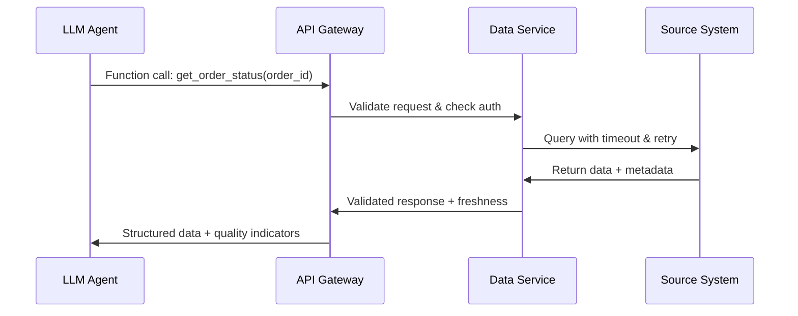
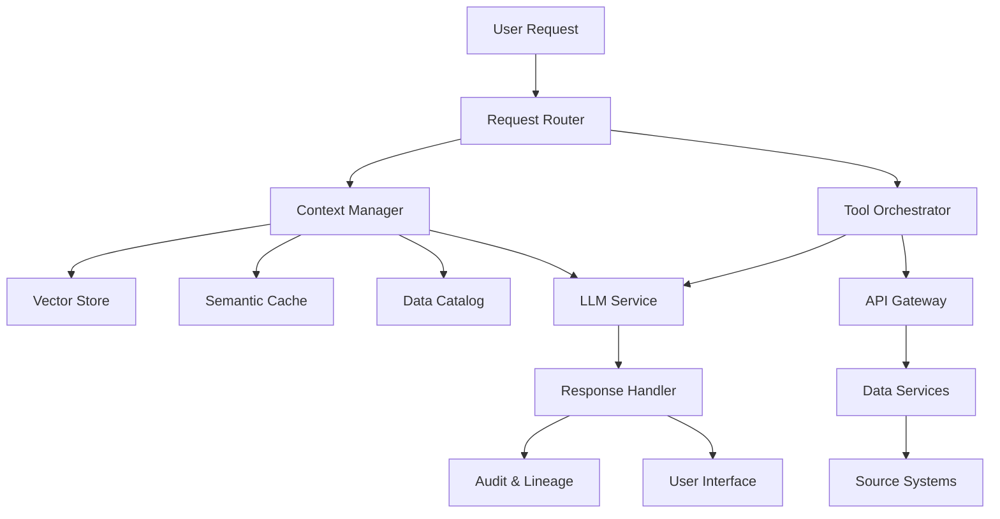

# From Chatbots to Agents: Building Enterprise-Grade LLM Applications

Picture this: It's 9 AM on a Monday, and you're sitting in yet another meeting about why your company's LLM application hasn't moved beyond the impressive demo stage. Your team has built a sophisticated AI agent powered by GPT-4o that can handle complex customer inquiries, coordinate with internal systems through function calls, and even manage multi-step workflows with remarkable intelligence. The leadership is excited. The budget is approved. But six months later, you're still stuck in what industry veterans call "demo purgatory" — endless cycles of promising LLM applications that never quite make it to reliable production deployment.

If this scenario sounds familiar, you're not alone. Whether organizations are building with hosted APIs like GPT-4o, Claude Sonnet 4, and Gemini 2.5 Pro, or deploying self-hosted models like DeepSeek-R1, QwQ, Gemma 3, and Phi 4, the vast majority struggle to move beyond experimental pilots. The culprit isn't the sophistication of your LLM integration, the choice between hosted versus self-hosted models, or the talent of your AI development team. It's something far more fundamental: the data foundation upon which your LLM applications are built.

:::note Core concept — Data foundation first
Whether using GPT-4o APIs or self-hosted DeepSeek-R1, LLM application success depends on data infrastructure, not model choice.
:::

{/* truncate */}

The harsh truth is that enterprise LLM application success—whether you're building autonomous agents, context-aware chatbots, or tool-using AI systems—isn't primarily about finding the perfect model or designing the most sophisticated prompts. It's about building robust, well-governed data infrastructure that can reliably feed your LLM applications with high-quality, accessible, and trustworthy data for context, tool use, and decision-making. While the industry obsesses over function calling capabilities and multi-agent frameworks, the real competitive advantage lies in something far less glamorous but infinitely more valuable: your data platform.

Think about it from a different perspective. Your LLM agents are only as good as the data they can access and act upon through tool calls and context retrieval, and in most enterprises, that data is scattered across dozens of systems, trapped in departmental silos, and plagued by inconsistencies that would make any AI system unreliable. You might have the most sophisticated agent framework in the world, but if your agents are consuming data from seventeen different databases with conflicting schemas and no central governance, you're essentially building a Ferrari with square wheels.

This article argues for a fundamental shift in how we approach enterprise LLM applications: from a model-centric to a data-centric architecture. Instead of starting with "What LLM should we use?" or "Should we self-host or use APIs?", the first question should be "Do we have the data infrastructure foundation to support reliable LLM applications at scale?" This isn't just about having a data warehouse or vector database — it's about treating data as a first-class product designed specifically for LLM consumption patterns.

**Core concept: Treat data as a product with explicit contracts, SLAs, and ownership optimized for LLM access patterns.**

In the following sections, we'll explore the unique data challenges that LLM applications face, from context management to tool use infrastructure. We'll examine how proper data foundations enable reliable function calling, semantic retrieval, and multi-agent coordination. We'll discuss governance patterns specific to LLM applications, and finally, we'll provide concrete implementation strategies for building production-ready LLM applications on solid data foundations. The goal isn't to diminish the importance of good models or sophisticated agent architectures — they matter enormously. Rather, it's to recognize that in the enterprise context, your data infrastructure is the force multiplier that determines whether those LLM capabilities will ever see the light of production.

## The Data Reality Behind LLM Applications

:::warning Core concept — Context determines capability
LLM applications fail when they can't access or trust enterprise data, regardless of model sophistication.
:::

Before we can build effective LLM applications—whether using GPT-4o APIs or self-hosted DeepSeek-R1—we need to understand why so many promising implementations fail when they encounter real enterprise data. The pattern is remarkably consistent: an impressive proof of concept that works beautifully with curated test scenarios, followed by months of struggle to make it work reliably with actual business systems and real-world data complexity.

Consider this scenario: Your team has built an intelligent customer service agent using Claude Sonnet 4 that demonstrates remarkable capabilities in demos. It can understand complex customer inquiries, retrieve relevant information from knowledge bases, call functions to check order status, and even escalate issues appropriately. In controlled testing with clean, curated data, the system achieves 94% customer satisfaction ratings.

However, when deployed to production, the system's performance degrades dramatically within weeks. Customers complain about inconsistent responses, function calls fail with cryptic errors, and the context retrieved from knowledge bases becomes increasingly irrelevant. The agent sometimes provides outdated information, fails to access critical customer data, or makes decisions based on incomplete context.

The problem isn't the LLM or the agent framework—it's the data infrastructure reality that enterprise LLM applications must navigate.

### Context Window vs. Enterprise Knowledge

Modern LLMs, whether hosted APIs like GPT-4o (128k context) or self-hosted models like DeepSeek-R1 (potentially unlimited with sliding window attention), face a fundamental constraint: they can only work with the data that's provided in their context window or through tool calls. Even with massive context windows, you can't simply dump your entire enterprise knowledge base into every prompt.

The challenge isn't technical—it's organizational and architectural. Your customer service agent needs access to:
- Customer profiles with purchase history, preferences, and service interactions
- Real-time order status from inventory and fulfillment systems  
- Product information with current pricing and availability
- Historical case resolutions for similar issues
- Company policies that might change based on customer tier or region
- Escalation rules that depend on issue complexity and customer value

This information is scattered across CRM systems, e-commerce platforms, inventory databases, knowledge management systems, and operational tools. Each system has different data models, update frequencies, and access patterns. The result is that your LLM agent, no matter how sophisticated, is making decisions based on incomplete, inconsistent, or stale context.

:::note Core concept — Context quality over quantity
Reliable context retrieval beats massive context windows for production LLM applications.
:::

### Tool Integration Reality: Function Calls That Break

One of the most powerful capabilities of modern LLMs is function calling—the ability to use tools and APIs to access live data and perform actions. Whether you're using GPT-4o's function calling or implementing tool use with self-hosted models like QwQ, the success of these integrations depends entirely on the reliability and consistency of the underlying data systems.

Here's what happens in practice: Your LLM agent needs to check a customer's order status. The function call succeeds, but the data returned is inconsistent with what the customer sees in their email confirmation because the order management system hasn't synchronized with the email notification service. The agent provides information that's technically correct but practically wrong from the customer's perspective.

Or consider this scenario: Your agent calls a function to check product availability, but the inventory system returns cached data that's 30 minutes old. By the time the customer tries to place an order based on the agent's recommendation, the product is out of stock. The function call worked perfectly from a technical perspective, but the data infrastructure failed to provide the current, accurate information that LLM applications require.

### The RAG Data Quality Problem

Retrieval-Augmented Generation (RAG) has become the standard approach for giving LLM applications access to enterprise knowledge. The concept is elegant: embed your documents, index them in a vector database, and retrieve relevant chunks to provide context for LLM responses. In practice, RAG systems often fail because they're built on top of data that was never designed for semantic retrieval.

Your knowledge base contains documents with inconsistent formats, outdated information, conflicting versions of the same policy, and content that's optimized for human navigation rather than AI consumption. When your RAG system retrieves "relevant" chunks, it might surface contradictory information, outdated procedures, or context that's syntactically similar but semantically irrelevant to the user's actual query.

The fundamental issue is that RAG assumes high-quality, well-structured, consistently maintained source data. But enterprise knowledge bases are typically organically grown collections of documents, wikis, and databases that reflect the historical evolution of business processes rather than the structured information architecture that effective RAG requires.

**Key takeaway**: LLM capabilities are constrained by data infrastructure quality, not model sophistication. Whether you're using the most advanced hosted APIs or the latest self-hosted models, success depends on solving the fundamental data access, quality, and integration challenges that enable reliable context, effective tool use, and accurate retrieval.

The solution isn't better prompts, bigger models, or more sophisticated agent frameworks—it's building data infrastructure that's specifically designed to serve the unique requirements of LLM applications. In the next section, we'll explore what this looks like in practice.

## Data Infrastructure for LLM Tool Use and Context

:::note Core concept — Infrastructure enables intelligence
LLM agents need data infrastructure designed for programmatic access, not just human consumption.
:::

Having diagnosed the data challenges that LLM applications face, let's explore how proper data infrastructure enables reliable tool use, context management, and multi-agent coordination. Whether you're building with GPT-4o APIs or self-hosted DeepSeek-R1, the patterns remain consistent—success depends on data systems that can serve the unique access patterns and reliability requirements of intelligent applications.

Modern LLM applications have fundamentally different data requirements than traditional business intelligence or analytics workloads. They need real-time access to current business state, semantic search across diverse content types, reliable APIs for function calling, and consistent data formats that support autonomous decision-making. Building this capability requires thinking about data infrastructure from the ground up with LLM consumption patterns in mind.

### Reliable Tool APIs: Data Contracts for Function Calling

The foundation of successful LLM tool use is reliable, well-designed APIs that provide consistent access to business data and operations. Whether your LLM is hosted (GPT-4o, Claude Sonnet 4) or self-hosted (DeepSeek-R1, QwQ), function calling success depends on the quality and reliability of the underlying data services.

This means establishing clear data contracts that specify not just what data is available, but how it behaves under different conditions. Your customer service agent calls a function to check order status—what happens when the order system is temporarily unavailable? How does the API communicate data freshness? What validation occurs to ensure the returned data is consistent with other systems?



Effective tool APIs for LLM applications include several key characteristics:

**Consistent Error Handling**: Rather than generic HTTP errors, APIs should return structured error responses that LLMs can understand and act upon. When an order lookup fails, the API should indicate whether it's a temporary system issue, invalid order ID, or authorization problem.

**Data Freshness Indicators**: APIs should communicate when data was last updated, allowing LLM agents to qualify their responses appropriately. A customer service agent can tell a customer "Based on information from 5 minutes ago, your order appears to be in transit."

**Graceful Degradation**: When primary data sources are unavailable, APIs should have fallback mechanisms that provide partial information rather than complete failure. An inventory check might return cached availability with a freshness warning rather than no information at all.

### Context Store Architecture: Vector Databases and Semantic Caching

Traditional databases excel at structured queries, but LLM applications need semantic search capabilities that can find relevant information based on meaning rather than exact matches. This requires specialized infrastructure for embedding generation, vector storage, and intelligent caching that reduces latency for common context patterns.

Modern context stores for LLM applications typically combine several technologies:

**Vector Databases**: For semantic search across documents, customer interactions, and knowledge bases. See [FAISS](https://github.com/facebookresearch/faiss) for open-source vector search or managed services like [Pinecone](https://www.pinecone.io/) for production deployments.

**Embedding Management**: Consistent embedding generation and updates as source content changes. This includes monitoring for embedding drift and maintaining embedding quality over time.

**Semantic Caching**: Intelligent caching that recognizes when similar queries can reuse previous context retrieval results, reducing both cost and latency for LLM applications.

The architecture challenge is balancing retrieval quality with performance. Your customer service agent needs to quickly find relevant context from millions of previous interactions, product documentation, and policy updates. The system must return contextually relevant information within milliseconds while maintaining high retrieval precision.

### Unified Data Access: MCP and Integration Patterns

One of the most promising developments for LLM data access is the emergence of standards like [Model Context Protocol (MCP)](https://modelcontextprotocol.io/), which provides a unified way for LLM applications to access diverse data sources through a consistent interface. MCP and similar standards address a key challenge: LLM applications need to access data from many different systems, but each integration shouldn't require custom development.

The value of unified data access patterns becomes clear when you consider the complexity of enterprise LLM applications. Your AI agent might need to:
- Query customer data from your CRM
- Check real-time inventory from your e-commerce platform  
- Retrieve relevant documentation from your knowledge base
- Access historical interaction data for context
- Pull real-time operational metrics for decision-making

Without unified access patterns, each of these integrations requires custom development, authentication handling, error management, and ongoing maintenance. With standards like MCP, LLM applications can access diverse data sources through consistent interfaces that handle authentication, rate limiting, and data formatting automatically.

| Traditional Integration | MCP-style Integration |
| --- | --- |
| Custom API client for each system | Single protocol for multiple data sources |
| System-specific authentication | Unified authentication and access control |
| Manual error handling per integration | Standardized error responses and retry logic |
| Different data formats per source | Consistent data schemas across sources |

**Key takeaway**: Successful tool use depends on data infrastructure reliability, regardless of whether you use GPT-4o or self-hosted DeepSeek-R1. The pattern holds across all LLM deployment models—robust data foundations enable sophisticated agent capabilities.

Building this infrastructure transforms how LLM applications interact with enterprise data. Instead of brittle, custom integrations that break when systems change, you get consistent, reliable data access that enables sophisticated agent behaviors. But data infrastructure alone isn't enough—you also need governance frameworks that ensure production reliability while enabling innovation. Let's explore that next.

## Production-Ready Data Governance for LLM Applications

:::warning Core concept — LLM-specific risks need specialized governance
LLM applications require governance frameworks that account for their unique access patterns and risk profiles.
:::

As LLM applications move from experimental prototypes to production systems handling real business operations, they introduce unique governance challenges that traditional data governance frameworks weren't designed to address. Whether you're deploying GPT-4o-powered agents or self-hosted DeepSeek-R1 systems, production LLM applications require specialized governance that balances innovation velocity with risk management.

The stakes are different for LLM applications. Traditional analytics might produce incorrect reports that humans can catch and correct, but LLM agents make autonomous decisions, interact directly with customers, and can impact business operations in real-time. This reality demands governance frameworks specifically designed for the unique characteristics of intelligent systems.

### LLM-Specific Data Lineage: Tracking Context Sources and Decision Trails

Traditional data lineage tracks how data flows through ETL pipelines and analytics workflows, but LLM applications require tracking context assembly, tool invocations, and decision reasoning. When your customer service agent makes a recommendation or takes an action, you need to understand not just what data was accessed, but how it was combined, weighted, and interpreted in the context of the specific interaction.

LLM-specific lineage tracking includes several key dimensions:

**Context Assembly Tracking**: Which documents, database records, and API responses were retrieved and included in the LLM's context? This matters for both debugging incorrect responses and ensuring compliance with data access policies.

**Tool Invocation Trails**: What functions were called, with what parameters, and what data was returned? When an agent's decision seems incorrect, you need to trace through the entire sequence of tool calls to identify where the issue occurred.

**Decision Reasoning**: How did the LLM weigh different pieces of information in reaching its conclusion? While we can't fully explain LLM reasoning, we can track which context was marked as most relevant and how confidence scores influenced the final response.

This lineage information serves multiple purposes: debugging when LLM applications behave unexpectedly, compliance auditing when regulatory requirements demand decision transparency, and continuous improvement as you identify patterns in successful versus unsuccessful agent interactions.

### Privacy-Preserving Context: Techniques for Protecting Sensitive Data

LLM applications often need access to sensitive information to provide valuable services, but this creates privacy and security challenges that require specialized techniques. The challenge is particularly acute with hosted LLM APIs where sensitive data might be processed by external services, but it also applies to self-hosted models where context data might be logged or cached inappropriately.

Several techniques help balance utility with privacy protection:

**Dynamic Data Masking**: Automatically replacing sensitive information with synthetic alternatives that preserve the semantic structure needed for LLM processing while protecting actual sensitive values. Customer account numbers become consistent synthetic identifiers, personal names become placeholder values that maintain gender and cultural context.

**Context Filtering**: Intelligent filtering that removes or redacts sensitive information based on the specific LLM task and user authorization level. A customer service agent might access order history without seeing payment details, while a fraud detection system might see transaction patterns without customer identity.

**Differential Privacy**: Adding controlled noise to aggregated data that LLM applications use for context while maintaining overall utility for AI decision-making.

Here's a minimal example of privacy-aware context filtering:

```python
def filter_customer_context(context, user_role, sensitivity_level):
    if user_role == "support_agent":
        return context.exclude(['payment_methods', 'ssn', 'full_address'])
    elif sensitivity_level == "public":
        return context.include_only(['product_preferences', 'service_tier'])
    return context.apply_differential_privacy(epsilon=1.0)
```

The key insight is that different LLM applications need different levels of access to sensitive data, and governance frameworks should support this granularity while maintaining consistent protection standards.

### Data Freshness and Consistency: Ensuring LLM Applications Work with Current Information

LLM applications can make autonomous decisions based on the data they access, which makes data freshness and consistency critical for operational reliability. When your inventory management agent makes stocking recommendations based on outdated sales data, or your customer service agent quotes prices that changed an hour ago, the business impact can be immediate and significant.

Governance frameworks for LLM applications must address several freshness and consistency challenges:

| Governance Requirement | Hosted APIs (GPT-4o, Claude) | Self-hosted (DeepSeek-R1, QwQ) | 
| --- | --- | --- |
| Data Residency | Limited control, check provider policies | Full control over data location and processing |
| Context Logging | Provider-dependent, may require special agreements | Complete control over logging and retention |
| Access Auditing | API-level tracking, limited internal visibility | Full audit trails and custom compliance reporting |
| Data Freshness SLAs | Must rely on external data, harder to guarantee | Direct control over data pipelines and freshness |

**Real-time Data Validation**: Implementing checks that verify data consistency across related systems before providing context to LLM applications. If customer data in your CRM doesn't match billing information, the validation system can flag this inconsistency for resolution rather than providing potentially conflicting context.

**Time-bounded Context**: Explicitly tracking and communicating the age of different pieces of information in LLM context, allowing agents to qualify their responses appropriately and users to understand the currency of the information they're receiving.

**Cross-system Consistency Monitoring**: Automated monitoring that identifies when related data across different systems becomes inconsistent, triggering alerts before LLM applications start making decisions based on contradictory information.

**Key takeaway**: Governance frameworks must address LLM-specific risks like context leakage and decision traceability while enabling the data access patterns that make intelligent applications valuable.

Effective governance for LLM applications isn't about preventing innovation—it's about creating the frameworks that allow sophisticated agent capabilities to operate reliably in production environments. This governance foundation, combined with proper data infrastructure, creates the conditions where LLM applications can deliver real business value. In our final section, we'll explore the practical implementation patterns that bring these concepts together.

## Implementation Patterns: Building LLM Applications on Solid Data Foundations

:::note Core concept — Architecture patterns over technology choices
Successful LLM applications are built on data infrastructure patterns, not just clever prompting.
:::

Having explored the data challenges, infrastructure requirements, and governance patterns for enterprise LLM applications, let's examine how these concepts come together in practical implementation patterns. Whether you're building with hosted APIs like GPT-4o or deploying self-hosted models like DeepSeek-R1, the fundamental architecture patterns remain consistent—success comes from treating data as the foundation rather than an afterthought.

The implementation patterns we'll explore represent battle-tested approaches for moving LLM applications from impressive demos to reliable production systems. These patterns work across different LLM deployment models because they address the underlying data and infrastructure challenges rather than model-specific details.

### LLM Application Architecture: Components, Data Flows, and System Boundaries

Production LLM applications require different architectural thinking than traditional software systems. They need to coordinate between multiple data sources, maintain conversation state, handle function calls reliably, and provide explainable decision-making—all while maintaining the responsiveness that users expect from intelligent systems.



This architecture separates several key concerns:

**Request Routing**: Determines the appropriate processing path based on request type, user authorization, and system availability. Simple queries might use cached responses, while complex requests require full context assembly and tool orchestration.

**Context Management**: Assembles relevant information from multiple sources, handling semantic search, data freshness validation, and privacy filtering. This component ensures LLM applications have access to current, relevant, and appropriately filtered information.

**Tool Orchestration**: Manages function calls, API integrations, and data access with proper error handling, retry logic, and result validation. This layer abstracts the complexity of enterprise system integration from the LLM application logic.

**LLM Service Abstraction**: Provides a consistent interface regardless of whether you're using hosted APIs or self-hosted models, handling prompt construction, response parsing, and model-specific optimizations.

The key architectural insight is that data concerns—context assembly, tool orchestration, and result validation—should be handled by specialized components rather than embedded in LLM prompts or application logic.

### Technology Selection: Choosing the Right Tools for Context Stores, Tool Execution, and Data Integration

The technology landscape for LLM applications includes both established enterprise data tools and newer AI-specific platforms. Making the right choices requires understanding how different technologies serve the unique requirements of intelligent applications.

| Component | Technology Options | Key Considerations |
| --- | --- | --- |
| Vector Storage | [Pinecone](https://www.pinecone.io/), [Weaviate](https://weaviate.io/), [FAISS](https://github.com/facebookresearch/faiss) | Scale requirements, managed vs. self-hosted, integration complexity |
| Context Management | Custom development, [LangChain](https://langchain.com/), [LlamaIndex](https://www.llamaindex.ai/) | Flexibility vs. speed of development, vendor lock-in considerations |
| Tool Orchestration | [Zapier](https://zapier.com/), custom API gateway, [MCP](https://modelcontextprotocol.io/) implementations | Integration ecosystem, customization needs, reliability requirements |
| Data Governance | [DataHub](https://www.datahubproject.io/), [OpenMetadata](https://open-metadata.org/), enterprise data catalogs | Existing infrastructure, compliance requirements, team capabilities |

The selection process should prioritize integration capabilities over feature richness. The best technology choices are those that work well with your existing data infrastructure and can evolve as your LLM application requirements mature.

**Technology Selection Framework**:
1. **Integration First**: Choose technologies that integrate well with your existing data infrastructure rather than requiring wholesale replacement.
2. **Standards Support**: Prefer technologies that support emerging standards like MCP for data access and OpenLineage for governance.
3. **Operational Maturity**: Evaluate monitoring, debugging, and maintenance capabilities, not just development features.
4. **Scaling Patterns**: Consider how each technology choice will scale with increased usage and data complexity.

### Migration Strategies: Moving from Prototype LLM Applications to Production-Ready Systems

The journey from LLM prototype to production system involves more than just scaling up infrastructure—it requires fundamental changes in how you approach data access, error handling, and system reliability. Most organizations underestimate this transition, leading to the "demo purgatory" problem we discussed earlier.

**Phase 1: Data Foundation Assessment (1-2 months)**
Before investing in production LLM infrastructure, assess whether your data foundation can support intelligent applications. This includes cataloging data sources that LLM applications need, evaluating data quality and freshness, testing API reliability under load, and identifying governance gaps that could create compliance risks.

**Phase 2: Infrastructure Hardening (3-4 months)**
Transform proof-of-concept integrations into production-ready data infrastructure. Replace direct database connections with API-based access, implement proper error handling and retry logic, add monitoring and alerting for data quality issues, and establish data lineage tracking for LLM decision auditing.

**Phase 3: Context and Tool Optimization (2-3 months)**
Optimize context retrieval and tool use for production scale and reliability. This includes implementing semantic caching to reduce latency and costs, optimizing vector search for your specific use cases, building tool orchestration with proper error recovery, and adding context quality monitoring and improvement.

**Phase 4: Production Deployment and Monitoring (ongoing)**
Deploy LLM applications with comprehensive monitoring, gradual rollout strategies, and continuous improvement processes. This includes A/B testing for context and tool effectiveness, monitoring business impact and user satisfaction, iterating on data quality and freshness, and scaling infrastructure based on usage patterns.

Here's a minimal example of tool execution with proper error handling:

```python
async def execute_tool_with_recovery(tool_name, parameters, max_retries=3):
    for attempt in range(max_retries):
        try:
            result = await tool_registry.execute(tool_name, parameters)
            if result.is_valid():
                return result.with_metadata(freshness=result.timestamp)
            else:
                raise DataQualityError(f"Invalid result: {result.errors}")
        except (NetworkError, TimeoutError) as e:
            if attempt == max_retries - 1:
                return ErrorResult(f"Tool unavailable after {max_retries} attempts")
            await asyncio.sleep(2 ** attempt)  # Exponential backoff
```

**Key takeaway**: Architecture patterns remain consistent whether using GPT-4o APIs or self-hosted DeepSeek-R1—the data foundation matters most. The specific LLM deployment model affects implementation details, but the fundamental patterns for data access, context management, and tool orchestration remain the same.

Success in enterprise LLM applications comes from recognizing that the challenge isn't primarily about choosing the right model or crafting the perfect prompts—it's about building the data infrastructure that enables sophisticated agent capabilities to operate reliably at scale. Organizations that understand this distinction will be the ones that successfully move beyond demos to production systems that deliver real business value.

## Conclusion

In our exploration of enterprise LLM applications, we've covered significant ground—from diagnosing why promising demos fail in production to designing data-centric architectures that support reliable agent capabilities. Whether you're building with GPT-4o, Claude Sonnet 4, Gemini 2.5 Pro, or deploying self-hosted models like DeepSeek-R1, QwQ, Gemma 3, or Phi 4, the fundamental lesson remains consistent: LLM application success depends far more on data infrastructure quality than on model choice or hosting approach.

The transformation we've outlined represents the maturation of enterprise LLM applications from experimental curiosities to business-critical systems. We've seen how data accessibility challenges constrain even the most sophisticated models, how proper infrastructure enables reliable function calling and context management, how governance frameworks must evolve for LLM-specific risks, and how proven implementation patterns can guide the journey from prototype to production.

The strategic imperative is clear: organizations that build LLM applications on solid data foundations will consistently deliver more reliable, scalable, and valuable intelligent systems than those that focus primarily on model capabilities or agent frameworks.

**Key insights from our analysis**:
- LLM applications are constrained by data accessibility and quality, not model capabilities or hosting choice
- Tool use, context management, and RAG all depend on robust data infrastructure designed for programmatic access
- Production LLM applications require governance frameworks that account for their unique access patterns and risk profiles  
- Success comes from treating data as a product that serves both humans and AI systems with appropriate contracts, quality standards, and ownership models

Looking toward the future, the evolution of enterprise LLM applications will be shaped by continued advancement in unified data access protocols (like MCP), semantic data layers optimized for AI consumption, and governance frameworks that balance innovation with risk management. The organizations that invest now in these data foundations will be positioned to take advantage of rapid improvements in model capabilities without being constrained by data access limitations.

**Actionable next steps for building your LLM-ready foundation**:
- **Assess current data infrastructure** against LLM application requirements for context assembly, tool integration, and real-time data access
- **Start with pilot projects** that establish data product discipline for 2-3 critical datasets your LLM applications depend on
- **Implement unified data discovery** that makes it easy for both human developers and LLM systems to find and access relevant information
- **Build governance frameworks** that address LLM-specific risks while enabling the data access patterns intelligent applications require

As a software engineer building LLM applications, recognize that your competitive advantage lies not in accessing the latest model capabilities—those are increasingly commoditized—but in building the data infrastructure that enables those capabilities to operate reliably in your specific enterprise context. The technical challenge is significant, but so is the opportunity for organizations that approach it systematically.

The future belongs to teams that understand this fundamental truth: in enterprise LLM applications, data infrastructure is not a supporting component—it's the primary determinant of success. Whether you're building your first intelligent agent or scaling existing LLM applications, start with the data foundation. Everything else builds from there.

What data infrastructure challenges are you facing in your LLM application development? The patterns we've discussed provide a roadmap, but every enterprise context has unique constraints and opportunities. The key is to begin building toward these patterns incrementally, proving value at each step while working toward the comprehensive data infrastructure that enables truly sophisticated LLM applications.
