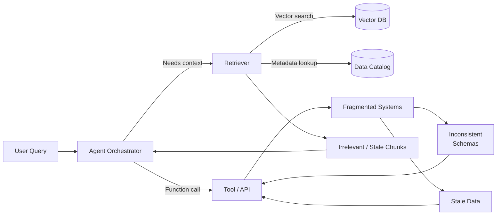
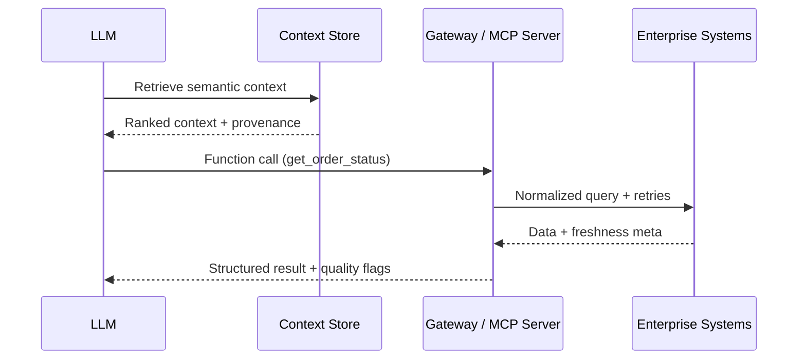
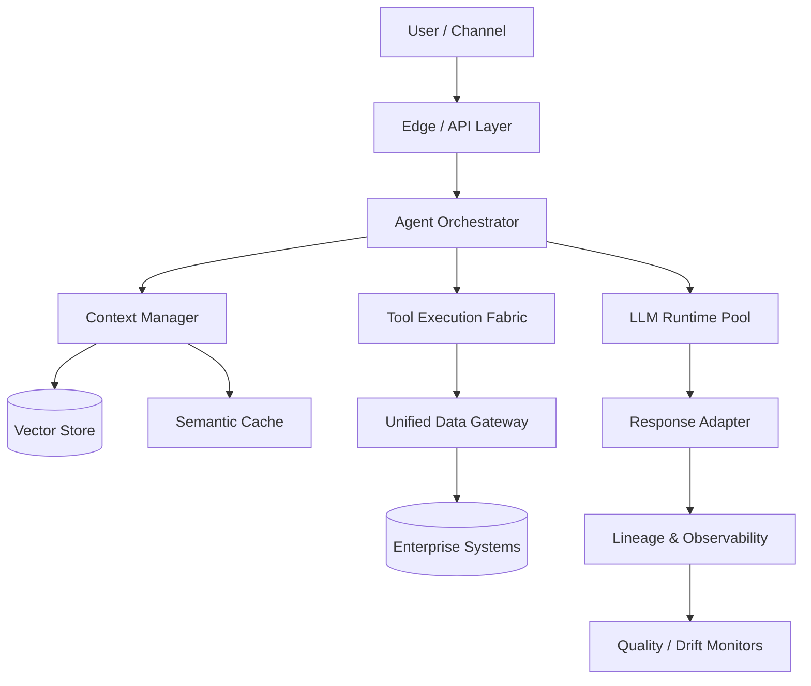

# From Chatbots to Agents: Building Enterprise-Grade LLM Applications

{/* INTRODUCTION (Target: 400-500 words) */}
Here's the uncomfortable truth about enterprise AI: **Your sophisticated GPT-4o agent is only as intelligent as your data infrastructure allows it to be.**

You've seen the demos. Your team built an impressive LLM application that handles customer inquiries, makes function calls, and manages complex workflows. Leadership is excited. Budget approved. Six months later? Still stuck in "demo purgatory"—that frustrating cycle where AI applications work beautifully in controlled environments but fail in production.

**The culprit isn't your AI model. It's your data foundation.** Whether you're experimenting with hosted APIs like GPT-4o, Claude Sonnet 4, Gemini 2.5 Pro—or self-hosting DeepSeek-R1, QwQ, Gemma 3, Phi 4—the recurring failure mode is identical: the model cannot reliably access the right enterprise data at the right time with the right guarantees.

If you've ever tried to turn an impressive AI demo into a production system only to hit a wall of fragmented systems, inconsistent APIs, missing lineage, and unreliable retrieval—you are not alone. This article makes a simple argument: production LLM applications succeed or fail based on data accessibility, quality, governance, and delivery—not clever prompting, not chain orchestration complexity, and not which frontier model you picked last quarter.

In this piece you'll learn: (1) why context, tool reliability, and retrieval quality collapse without data foundations, (2) the infrastructure patterns enabling multi-agent and function-calling systems, (3) governance models required for traceability, privacy, and freshness, and (4) concrete implementation and migration strategies to evolve from prototypes to durable enterprise platforms.

:::note Core concept
**Data accessibility determines LLM application success more than model choice.**
:::

_Next: We start with the uncomfortable production reality—why seemingly capable LLM systems crumble when pointed at real enterprise data._

---

## 1. The Data Reality Behind LLM Applications (700-900 words)

{/* Section 1 Aim: Diagnose failure patterns when LLM apps (hosted & self-hosted) cannot access or trust enterprise data */}

### 1.1 Context Window vs. Enterprise Knowledge
TODO: Elaborate concrete failed deployment scenario; illustrate limits of stuffing context vs building dynamic retrieval; highlight both GPT-4o & DeepSeek-R1 constraints.

### 1.2 Tool Integration Reality
TODO: Provide minimal (≤10 lines) failed function call example due to inconsistent API response / schema drift. Discuss dependency on stable data contracts.

### 1.3 The RAG Data Quality Problem
TODO: Show retrieval returning stale/conflicting chunks; emphasize that retrieval precision ≠ answer reliability without upstream curation.

:::note Core concept
**LLM capabilities are constrained by data infrastructure quality, not model sophistication.**
:::

**Key Takeaway**: Without curated, fresh, contract-governed data surfaces, advanced tool use and retrieval pipelines degrade into brittle guesswork.

_Transition: The solution isn't bigger models or more prompt engineering—it's building deliberate data foundations for programmatic access._

---

Think about what happens when your customer service agent needs to help a user:

1. **Fetch customer profile** from your CRM
2. **Check order status** from fulfillment systems  
3. **Access product details** with current pricing
4. **Retrieve past interactions** for context
5. **Apply business rules** based on customer tier

In most enterprises, this data lives in 10+ systems with different schemas, update frequencies, and reliability patterns. Your LLM agent makes decisions based on whatever fragments it can gather—often incomplete, inconsistent, or stale.

**This is exactly why data infrastructure determines AI success more than model choice.**

:::note The core insight
A GPT-4o agent with broken data connections performs worse than a simpler model with reliable data access.
:::

## 2. Data Infrastructure for LLM Tool Use and Context (800-1000 words)

{/* Section 2 Aim: Show enabling patterns: reliable tool APIs, context store architecture, unified access (MCP/GraphQL) */}

### 2.1 Reliable Tool APIs
TODO: Discuss data contracts (shape, freshness SLA, error taxonomy). Add ≤10 line robust function calling snippet with validation & retries.

### 2.2 Context Store Architecture
TODO: Vector DB + semantic cache + structured session memory pattern; trade-offs; when to pre-compute embeddings vs on-demand.

### 2.3 Unified Data Access (MCP / GraphQL / Gateways)
TODO: Contrast ad-hoc integrations vs protocol-based unification (MCP) for hosted and self-hosted models alike.

| Deployment Model | Data Access Pattern | Strengths | Risks / Gaps |
| ---------------- | ------------------ | --------- | ------------ |
| Hosted API (GPT-4o, Claude) | External tool calls via gateway | Faster iteration, managed scaling | Data egress, latency, privacy constraints |
| Self-hosted (DeepSeek-R1, QwQ) | In-cluster tool adapters | Lower latency, tighter control | Higher infra + ops burden |
| Hybrid | Mixed orchestrator routing | Flexibility, workload shaping | Complexity in consistency + governance |

:::note Core concept
**LLM agents need data infrastructure designed for programmatic access, not human consumption.**
:::

**Key Takeaway**: Successful tool use depends on deterministic data surfaces with explicit freshness, schema stability, and graceful degradation paths.

_Transition: Infrastructure enables capability—but governance ensures reliability and safety in production._

---

## 3. Production-Ready Data Governance for LLM Applications (700-900 words)

{/* Section 3 Aim: Governance, lineage, privacy, freshness across hosted & self-hosted contexts */}

### 3.1 LLM-Specific Data Lineage
TODO: Describe tracing context assembly, tool invocation chain, decision artifacts; link to audit & RCA.

### 3.2 Privacy-Preserving Context
TODO: Techniques: dynamic masking, redaction tiers, synthetic substitution; contrast hosted vs self-hosted control surfaces. Include ≤10 line masking snippet.

### 3.3 Data Freshness & Consistency Assurance
TODO: SLA tagging, stale detection, cross-system drift monitors; governance table (hosted vs self-hosted obligations).

| Governance Dimension | Hosted API | Self-hosted Model | Hybrid Consideration |
| -------------------- | ---------- | ----------------- | -------------------- |
| Data Residency | Provider-dependent | Full control | Partition critical sets |
| Auditability | Limited internal trace | Full pipeline introspection | Dual audit layers |
| Context Retention | Provider policy bound | Configurable | Harmonize retention policies |
| PII Handling | Pre-send filtering critical | In-process control | Multi-layer enforcement |
| Freshness Guarantees | Indirect (via APIs) | Direct (own pipelines) | Mixed verification paths |

:::note Core concept
**LLM applications require specialized data governance aligned to autonomous access + transformation patterns.**
:::

**Key Takeaway**: Governance must operationalize lineage, privacy, and freshness to prevent silent degradation and regulatory risk.

_Transition: With governance reinforcing infrastructure, we can compose resilient end-to-end architectures._

---
Your LLM needs rich, current context to be useful, but enterprise data is scattered. When your agent tries to help a customer, it might get:
- Customer data from CRM that hasn't synced with billing
- Product information that's 2 hours behind inventory updates  
- Support history missing recent interactions

Result: Technically correct responses that are practically wrong.

## 4. Implementation Patterns: Building on Solid Data Foundations (800-1000 words)

{/* Section 4 Aim: Concrete architecture & migration strategies */}

### 4.1 LLM Application Architecture
TODO: Decompose orchestrator, context manager, tool fabric, governance plane. Include full-system Mermaid diagram.

### 4.2 Technology Selection
TODO: Evaluation matrix (vector DB, cache, queue, lineage, gateway). Stress interoperability, lifecycle maturity.

### 4.3 Migration Strategies
TODO: Prototype → Foundation → Optimization → Scale phases; include ≤10 line resilient tool execution snippet.

:::note Core concept
**Successful LLM applications are architecture patterns + disciplined data operations—not just prompting tricks.**
:::

**Key Takeaway**: Model hosting choice changes deployment mechanics, not foundational data + orchestration patterns.

_Transition: We close by synthesizing principles and offering actionable next steps._

---
Modern LLMs excel at function calling—until the functions return inconsistent data:
- `check_inventory()` returns cached data that's 30 minutes old
- Order status differs between what your API shows and what the customer sees
- Price checks pull from systems that aren't synchronized

Result: Users lose trust when AI agents provide conflicting information.

## Conclusion (300-400 words)

TODO: Summarize constraints (data over model), reinforce infrastructure + governance interplay, outline future (MCP, semantic data layers, AI-native contracts), provide actionable checklist.

**Planned Recap Bullets**:
- Data accessibility & quality > model sophistication
- Tool reliability = data contract strength + observability
- Governance (lineage, privacy, freshness) is an enabler, not friction
- Architecture patterns remain stable across hosting models

**Actionable Next Steps (Draft Placeholder)**:
1. Run data readiness assessment (coverage, freshness, contracts)
2. Establish MVP unified access layer (start with 2-3 critical domains)
3. Add context quality + tool success observability
4. Formalize lineage + masking policies early
5. Plan migration phases with explicit exit criteria

---

*What data challenges are blocking your AI applications from reaching production? (Comment: solicit examples for future case study section once draft fleshed out.)*
