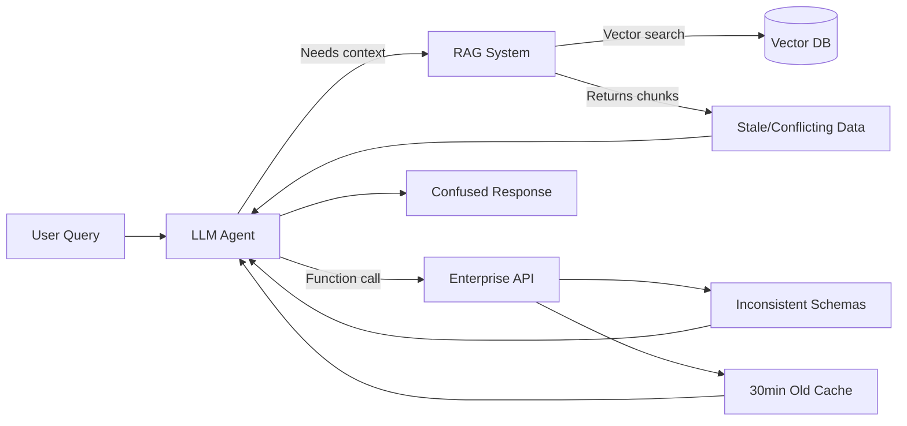
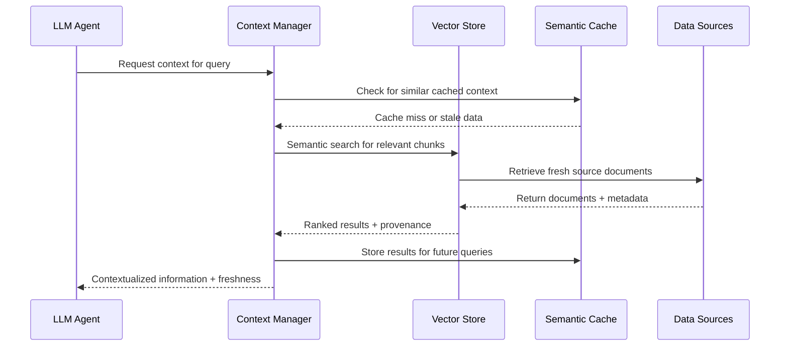
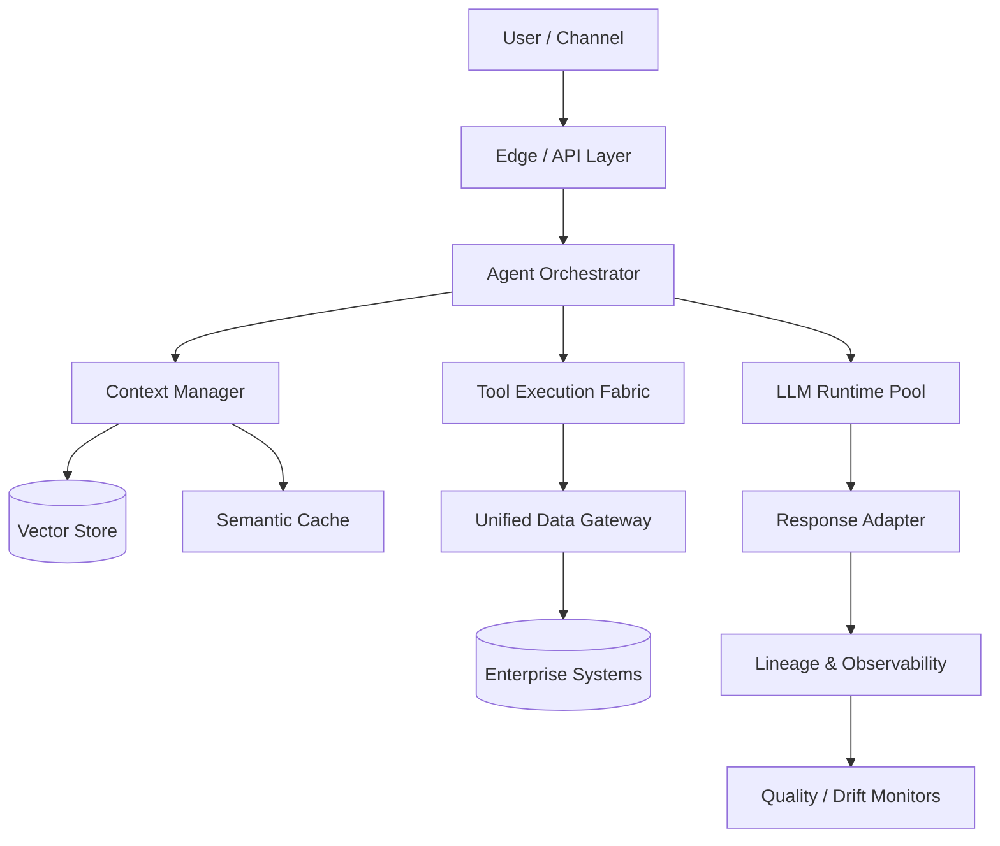

# From Chatbots to Agents: Building Enterprise-Grade LLM Applications

Picture this: It's Monday morning, and you're sitting in yet another meeting about why your company's LLM application can't seem to move beyond the demo stage. Your team has built a sophisticated GPT-4o-powered agent that handles complex customer inquiries, orchestrates with internal systems through function calls, and even manages multi-step workflows with impressive intelligence. Leadership is excited, budget approved. But six months later, you're still trapped in what industry veterans call "demo purgatory"—that endless cycle of promising LLM applications that never quite achieve reliable production deployment.

If this scenario sounds familiar, you're not alone. Whether organizations are building with hosted APIs like GPT-4o, Claude Sonnet 4, and Gemini 2.5 Pro, or deploying self-hosted models like DeepSeek-R1, QwQ, Gemma 3, and Phi 4, the vast majority struggle to move beyond experimental pilots. Recent research shows that [AI's productivity benefits are highly contextual](/blog/ai-productivity), with structured approaches significantly outperforming ad-hoc usage. The bottleneck isn't the sophistication of your LLM integration, the choice between hosted versus self-hosted models, or the talent of your AI development team. It's something more fundamental: the data foundation underlying your LLM applications.

**The uncomfortable truth is this: Whether you're using GPT-4o APIs or self-hosted DeepSeek-R1, the real challenge isn't model selection—it's feeding these models the right data at the right time.** Your sophisticated AI agent is only as intelligent as your data infrastructure allows it to be.

If you've ever tried to transform an impressive AI demo into a production system only to hit a wall of fragmented systems, inconsistent APIs, missing lineage, and unreliable retrieval—this article is for you. We argue that successful enterprise LLM applications are built on robust data infrastructure, not just clever prompting or agent frameworks.

Here's what we'll cover: how data accessibility challenges constrain even the most capable models, the infrastructure patterns that enable reliable tool use and context management, governance frameworks designed for LLM-specific risks, and concrete implementation strategies for building production-ready systems that scale.

The solution isn't better prompts or bigger models—it's better data foundations. Let's start with why.

{/* truncate */}

## 1. The Data Reality Behind LLM Applications

Consider this scenario: Your team deployed a Claude Sonnet 4-powered customer service agent that demonstrated remarkable capabilities during testing. It understood complex customer inquiries, retrieved relevant information from your knowledge base, called functions to check order status, and even escalated issues appropriately. In controlled tests with clean, curated data, the system achieved 94% customer satisfaction ratings.

But when deployed to production, the system's performance degraded rapidly within weeks. Customers complained about inconsistent responses, function calls started failing mysteriously, and the context retrieved from your knowledge base became increasingly irrelevant. The agent sometimes provided outdated information, couldn't access critical customer data, or made decisions based on incomplete context.

The problem wasn't the LLM or the agent framework—it was the data infrastructure reality that enterprise LLM applications must navigate.

:::info Related Reading
For a deeper exploration of how complexity emerges and accumulates in software projects, particularly in enterprise environments, see my previous analysis: [Why Do We Need to Consider Complexity in Software Projects?](/blog/software-project-complexity)
:::

### Context Window vs. Enterprise Knowledge

Modern LLMs, whether hosted APIs like GPT-4o (128k context) or self-hosted models like DeepSeek-R1 (potentially unlimited through sliding window attention), face a fundamental constraint: they can only work with data provided in their context window or accessed through tool calls. Even with massive context windows, you can't simply dump your entire enterprise knowledge base into every prompt.

The challenge isn't technical—it's organizational and architectural. Your customer service agent needs access to:
- Customer profiles with purchase history, preferences, and service interactions
- Real-time order status from inventory and fulfillment systems
- Product information with current pricing and availability
- Historical case resolutions for similar issues
- Company policies that may vary by customer tier or region
- Escalation rules that depend on issue complexity and customer value

This information is scattered across CRM systems, e-commerce platforms, inventory databases, knowledge management systems, and operational tools. Each system has different data models, update frequencies, and access patterns. The result is that your LLM agent, no matter how sophisticated, is making decisions based on incomplete, inconsistent, or stale context.

### Tool Integration Reality: Function Calls That Break

One of the most powerful capabilities of modern LLMs is function calling—the ability to use tools and APIs to access real-time data and perform actions. Whether you're using GPT-4o's function calling or implementing tool use with self-hosted models like QwQ, the success of these integrations depends entirely on the reliability and consistency of the underlying data systems.

Here's what happens in practice: Your LLM agent needs to check a customer's order status. The function call succeeds, but the data returned is inconsistent with what the customer sees in their email confirmation because the order management system hasn't synced with the email notification service. The agent provides information that's technically correct but practically wrong from the customer's perspective.

Or consider this scenario: Your agent calls a function to check product availability, but the inventory system returns cached data that's 30 minutes old. When the customer tries to place an order based on the agent's recommendation, the product is out of stock. Technically, the function call worked perfectly, but the data infrastructure failed to provide the current, accurate information that LLM applications require.

### The RAG Data Quality Problem

Retrieval-Augmented Generation (RAG) has become the standard approach for giving LLM applications access to enterprise knowledge. The concept is elegant: embed your documents, index them in a vector database, and retrieve relevant chunks to provide context for LLM responses. In practice, RAG systems often fail because they're built on top of data that was never designed for semantic retrieval.

Your knowledge base contains documents with inconsistent formatting, outdated information, conflicting versions of the same policy, and content optimized for human navigation rather than AI consumption. When your RAG system retrieves "relevant" chunks, it might surface contradictory information, outdated procedures, or context that's syntactically similar but semantically irrelevant to the user's actual query.



The fundamental issue is that RAG assumes high-quality, well-structured, consistently maintained source data. But enterprise knowledge bases are typically organic collections of documents, wikis, and databases that reflect the historical evolution of business processes rather than the structured information architecture that effective RAG requires.

**Key Takeaway**: Without curated, fresh, contract-governed data surfaces, advanced tool use and retrieval pipelines degrade into brittle guesswork. Whether you're using the most advanced hosted API or the latest self-hosted model, success depends on solving fundamental data access, quality, and integration challenges that enable reliable context, effective tool use, and accurate retrieval.

The solution isn't better prompts, bigger models, or more sophisticated agent frameworks—it's building data infrastructure specifically designed to meet the unique needs of LLM applications.

## 2. Data Infrastructure for LLM Tool Use and Context

After diagnosing the data challenges that LLM applications face, let's explore how proper data infrastructure enables reliable tool use, context management, and multi-agent coordination. Whether you're building with GPT-4o APIs or self-hosted DeepSeek-R1, the patterns remain consistent—success depends on data systems that can serve the unique access patterns and reliability requirements of intelligent applications.

Modern LLM applications have fundamentally different data needs than traditional business intelligence or analytics workloads. They need real-time access to current business state, semantic search across diverse content types, reliable APIs for function calling, and consistent data formats that support autonomous decision-making. Building this capability requires thinking about data infrastructure from the ground up, with LLM consumption patterns as the starting point.

### Reliable Tool APIs: Data Contracts for Function Calling

The foundation of successful LLM tool use is reliable, well-designed APIs that provide consistent access to business data and operations. Whether your LLM is hosted (GPT-4o, Claude Sonnet 4) or self-hosted (DeepSeek-R1, QwQ), the success of function calling depends on the quality and reliability of the underlying data services.

This means establishing clear data contracts that specify not just what data is available, but how it behaves under different conditions. Your customer service agent calls a function to check order status—what happens when the order system is temporarily unavailable? How does the API communicate data freshness? What validation is performed to ensure the returned data is consistent with other systems?

```python
async def get_order_status(order_id: str) -> OrderStatus:
    try:
        # Validate input and check cache first
        if not order_id or len(order_id) < 8:
            return OrderStatus.error("Invalid order ID format")
        
        # Attempt primary system with timeout
        result = await order_service.get_status(order_id, timeout=5)
        
        # Validate data freshness and consistency
        if result.last_updated < datetime.now() - timedelta(minutes=10):
            result.add_warning("Data may be stale")
            
        return result.with_metadata(freshness=result.last_updated)
        
    except TimeoutError:
        # Graceful degradation to cached data
        cached = await cache.get_order_status(order_id)
        return cached.with_warning("Using cached data due to system timeout")
```

Effective tool APIs for LLM applications include several key characteristics:

**Consistent Error Handling**: APIs should return structured error responses that LLMs can understand and act upon, rather than generic HTTP errors. When an order lookup fails, the API should indicate whether this is a temporary system issue, an invalid order ID, or an authorization problem.

**Data Freshness Indicators**: APIs should communicate when data was last updated, allowing LLM agents to appropriately qualify their responses. A customer service agent can tell a customer "Based on information from 5 minutes ago, your order appears to be in transit."

**Graceful Degradation**: When primary data sources are unavailable, APIs should have fallback mechanisms that provide partial information rather than complete failure. An inventory check might return cached availability with a freshness warning rather than no information at all.

### Context Store Architecture: Vector Databases and Semantic Caching

Traditional databases excel at structured queries, but LLM applications need semantic search capabilities that can find relevant information based on meaning rather than exact matches. This requires specialized infrastructure for embedding generation, vector storage, and intelligent caching that reduces latency for common context patterns.

A modern context store for LLM applications typically combines several technologies:

**Vector Databases**: For semantic search across documents, customer interactions, and knowledge bases. Options range from open-source vector search like [FAISS](https://github.com/facebookresearch/faiss) to managed services like [Pinecone](https://www.pinecone.io/) for production deployments.

**Embedding Management**: Consistent embedding generation and updates as source content changes. This includes monitoring for embedding drift and maintaining embedding quality over time.

**Semantic Caching**: Intelligent caching that recognizes when similar queries can reuse previous context retrieval results, reducing both cost and latency for LLM applications.



The architectural challenge is balancing retrieval quality with performance. Your customer service agent needs to quickly find relevant context from millions of previous interactions, product documents, and policy updates. The system must return contextually relevant information within milliseconds while maintaining high retrieval precision.

For a comprehensive exploration of how information architecture affects AI system performance, see [Context Engineering: The Art of Information Selection in AI Systems](/blog/context-engineering).

### Unified Data Access: MCP and Integration Patterns

One of the most promising developments in LLM data access is the emergence of standards like the [Model Context Protocol (MCP)](https://modelcontextprotocol.io/), which provides a unified way for LLM applications to access diverse data sources through consistent interfaces. MCP and similar standards address a key challenge: LLM applications need to access data from many different systems, but each integration shouldn't require custom development.

The value of unified data access patterns becomes clear when you consider the complexity of enterprise LLM applications. Your AI agent might need to:
- Query customer data from your CRM
- Check real-time inventory from your e-commerce platform
- Retrieve relevant documents from your knowledge base
- Access historical interaction data for context
- Pull real-time operational metrics for decision-making

Without unified access patterns, each of these integrations requires custom development, authentication handling, error management, and ongoing maintenance. With standards like MCP, LLM applications can access diverse data sources through consistent interfaces that automatically handle authentication, rate limiting, and data formatting.

| Deployment Model | Data Access Pattern | Strengths | Considerations |
| ---------------- | ------------------ | --------- | -------------- |
| Hosted API (GPT-4o, Claude) | External tool calls via gateway | Faster iteration, managed scaling | Data egress, latency, privacy constraints |
| Self-hosted (DeepSeek-R1, QwQ) | In-cluster tool adapters | Lower latency, tighter control | Higher infrastructure and ops burden |
| Hybrid | Mixed orchestrator routing | Flexibility, workload optimization | Complexity in consistency and governance |

The key insight is that different LLM applications need different levels of access to sensitive data, and governance frameworks should support this granularity while maintaining consistent protection standards.

**Key Takeaway**: Successful tool use depends on data infrastructure reliability, whether you're using GPT-4o or self-hosted DeepSeek-R1. The patterns remain consistent across different LLM deployment models—robust data foundations enable sophisticated agent capabilities.

Building this infrastructure transforms how LLM applications interact with enterprise data. Instead of fragile custom integrations that break when systems change, you get consistent, reliable data access that enables sophisticated agent behaviors. But data infrastructure alone isn't enough—you also need governance frameworks that ensure production reliability while enabling innovation.

---

## 3. Production-Ready Data Governance for LLM Applications

As LLM applications evolve from experimental prototypes to production systems handling real business operations, they introduce unique governance challenges that traditional data governance frameworks weren't designed to address. Whether you're deploying GPT-4o-powered agents or self-hosted DeepSeek-R1 systems, production LLM applications require specialized governance that balances innovation velocity with risk management.

The risks are different with LLM applications. Traditional analytics might produce incorrect reports that humans can spot and correct, but LLM agents make autonomous decisions, interact directly with customers, and can impact business operations in real-time. This reality demands governance frameworks designed specifically for the unique characteristics of intelligent systems.

### LLM-Specific Data Lineage: Tracing Context Sources and Decision Trails

Traditional data lineage tracks how data flows through ETL pipelines and analytics workflows, but LLM applications need to trace context assembly, tool invocations, and decision reasoning. When your customer service agent makes a recommendation or takes an action, you need to understand not just what data was accessed, but how it was combined, weighted, and interpreted within the context of that specific interaction.

LLM-specific lineage tracking includes several key dimensions:

**Context Assembly Tracking**: Which documents, database records, and API responses were retrieved and included in the LLM's context? This is important both for debugging incorrect responses and ensuring compliance with data access policies.

**Tool Invocation Trails**: What functions were called, with what parameters, and what data was returned? When an agent's decision seems incorrect, you need to trace the entire sequence of tool calls to identify where the problem occurred.

**Decision Reasoning**: How did the LLM weight different pieces of information when reaching its conclusion? While we can't fully explain LLM reasoning, we can track which context was flagged as most relevant and how confidence scores influenced the final response.

This lineage information serves multiple purposes: debugging when LLM applications behave unexpectedly, compliance auditing when regulations require decision transparency, and continuous improvement as you identify patterns in successful versus unsuccessful agent interactions.

### Privacy-Preserving Context: Protecting Sensitive Data While Enabling Intelligence

LLM applications often need access to sensitive information to provide valuable services, but this creates privacy and security challenges that require specialized techniques. For hosted LLM APIs where sensitive data might be processed by external services, this challenge is particularly acute, but it also applies to self-hosted models where context data might be inappropriately logged or cached.

Several techniques help balance utility with privacy protection:

**Dynamic Data Masking**: Automatically replacing sensitive information with synthetic substitutes that preserve the semantic structure needed for LLM processing while protecting actual sensitive values. Customer account numbers become consistent synthetic identifiers, personal names become placeholder values that maintain gender and cultural context.

**Context Filtering**: Intelligently filtering out or redacting sensitive information based on the specific LLM task and user authorization levels. A customer service agent might access order history without seeing payment details, while a fraud detection system might see transaction patterns without customer identities.

```python
def filter_customer_context(context, user_role, sensitivity_level):
    """Apply privacy filters based on role and data sensitivity"""
    if user_role == "support_agent":
        # Remove payment methods and full addresses
        return context.exclude(['payment_methods', 'ssn', 'full_address'])
    elif sensitivity_level == "public":
        # Only include non-sensitive preference data
        return context.include_only(['product_preferences', 'service_tier'])
    elif user_role == "fraud_analyst":
        # Mask identities but preserve transaction patterns
        return context.apply_synthetic_ids().include(['transaction_history'])
    
    return context.apply_differential_privacy(epsilon=1.0)
```

**Differential Privacy**: Adding controlled noise to aggregated data used by LLM applications for context while maintaining overall utility for AI decision-making.

The key insight is that different LLM applications need different levels of access to sensitive data, and governance frameworks should support this granularity while maintaining consistent protection standards.

### Data Freshness and Consistency: Ensuring LLM Applications Work with Current Information

LLM applications can make autonomous decisions based on the data they access, making data freshness and consistency critical to operational reliability. When your inventory management agent makes stocking recommendations based on outdated sales data, or your customer service agent quotes prices that changed an hour ago, the business impact can be immediate and significant.

Governance frameworks for LLM applications must address several freshness and consistency challenges:

**Real-time Data Validation**: Implementing checks that verify data consistency across related systems before providing context to LLM applications. If customer data in your CRM doesn't match billing information, validation systems can flag this inconsistency for resolution rather than providing potentially conflicting context.

**Temporal Context Boundaries**: Explicitly tracking and communicating the age of different pieces of information in LLM context, allowing agents to appropriately qualify their responses and users to understand the timeliness of information they receive.

**Cross-system Consistency Monitoring**: Automated monitoring that identifies when related data across different systems becomes inconsistent, triggering alerts before LLM applications start making decisions based on contradictory information.

| Governance Dimension | Hosted API (GPT-4o, Claude) | Self-hosted (DeepSeek-R1, QwQ) | Hybrid Considerations |
| -------------------- | ---------------------------- | ------------------------------- | --------------------- |
| Data Residency | Limited control, check provider policies | Full control over data location and processing | Partition sensitive datasets appropriately |
| Context Logging | Provider-dependent, may require special agreements | Complete control over logging and retention | Harmonize retention policies across deployment models |
| Access Auditing | API-level tracking, limited internal visibility | Full audit trails and custom compliance reporting | Dual audit layers for comprehensive coverage |
| Data Freshness SLAs | Must rely on external data, harder to guarantee | Direct control over data pipelines and freshness | Mixed verification paths require careful coordination |

:::note Core concept
**LLM applications require specialized data governance that accounts for their unique access patterns and risk profiles.**
:::

**Key Takeaway**: Governance frameworks must address LLM-specific risks like context leakage and decision traceability while enabling the data access patterns that make intelligent applications valuable.

Effective governance for LLM applications isn't about preventing innovation—it's about creating frameworks that allow sophisticated agent capabilities to operate reliably in production environments. This governance foundation, combined with proper data infrastructure, creates the conditions where LLM applications can deliver genuine business value.

## 4. Implementation Patterns: Building on Solid Data Foundations

After exploring the data challenges, infrastructure requirements, and governance patterns for enterprise LLM applications, let's examine how these concepts come together in practical implementation patterns. Whether you're building with hosted APIs like GPT-4o or deploying self-hosted models like DeepSeek-R1, the fundamental architecture patterns remain consistent—success comes from treating data as a foundation rather than an afterthought.

The implementation patterns we'll explore represent battle-tested approaches for moving LLM applications from impressive demos to reliable production systems. These patterns work across different LLM deployment models because they address the underlying data and infrastructure challenges rather than model-specific details.

### LLM Application Architecture: Components, Data Flows, and System Boundaries

Production LLM applications require different architectural thinking than traditional software systems. They need to coordinate across multiple data sources, maintain conversational state, handle function calls reliably, and provide explainable decision-making—all while maintaining the responsiveness that users expect from intelligent systems.


This architecture separates several key concerns:

**Request Routing**: Determines the appropriate processing path based on request type, user authorization, and system availability. Simple queries might use cached responses, while complex requests require full context assembly and tool orchestration.

**Context Management**: Assembles relevant information from multiple sources, handling semantic search, data freshness validation, and privacy filtering. This component ensures LLM applications have access to current, relevant, and appropriately filtered information.

**Tool Orchestration**: Manages function calls, API integrations, and data access with appropriate error handling, retry logic, and result validation. This layer abstracts the complexity of enterprise system integration from LLM application logic.

**LLM Service Abstraction**: Provides a consistent interface whether you're using hosted APIs or self-hosted models, handling prompt construction, response parsing, and model-specific optimizations.

The key architectural insight is that data concerns—context assembly, tool orchestration, and result validation—should be handled by specialized components rather than embedded in LLM prompts or application logic.

### Technology Selection: Choosing the Right Tools for Context Stores, Tool Execution, and Data Integration

The technology landscape for LLM applications includes both established enterprise data tools and newer AI-specific platforms. Making the right choices requires understanding how different technologies serve the unique needs of intelligent applications.

| Component | Technology Options | Key Considerations |
| --------- | ------------------ | ------------------ |
| Vector Storage | [Pinecone](https://www.pinecone.io/), [Weaviate](https://weaviate.io/), [FAISS](https://github.com/facebookresearch/faiss) | Scale requirements, managed vs self-hosted, integration complexity |
| Context Management | Custom development, [LangChain](https://langchain.com/), [LlamaIndex](https://www.llamaindex.ai/) | Flexibility vs development speed, vendor lock-in considerations |
| Tool Orchestration | [Zapier](https://zapier.com/), custom API gateway, [MCP](https://modelcontextprotocol.io/) implementations | Integration ecosystem, customization needs, reliability requirements |
| Data Governance | [DataHub](https://www.datahubproject.io/), [OpenMetadata](https://open-metadata.org/), enterprise data catalogs | Existing infrastructure, compliance requirements, team capabilities |

The selection process should prioritize integration capabilities over feature richness. The best technology choices are those that integrate well with your existing data infrastructure and can evolve as your LLM application needs mature.

**Technology Selection Framework**:
1. **Integration First**: Choose technologies that integrate well with your existing data infrastructure rather than requiring wholesale replacement.
2. **Standards Support**: Prioritize technologies that support emerging standards like MCP for data access and OpenLineage for governance.
3. **Operational Maturity**: Evaluate monitoring, debugging, and maintenance capabilities, not just development features.
4. **Scaling Patterns**: Consider how each technology choice scales with increased usage and data complexity.

### Migration Strategies: From Prototype LLM Applications to Production-Ready Systems

The journey from LLM prototype to production system involves more than just scaling infrastructure—it requires fundamental changes in how you approach data access, error handling, and system reliability. Most organizations underestimate this transformation, leading to the "demo purgatory" problem we discussed earlier.

**Phase 1: Data Foundation Assessment (1-2 months)**
Before investing in production LLM infrastructure, assess whether your data foundation can support intelligent applications. This includes cataloging data sources your LLM applications need, evaluating data quality and freshness, testing API reliability under load, and identifying governance gaps that might create compliance risks.

**Phase 2: Infrastructure Hardening (3-4 months)**
Transform proof-of-concept integrations into production-ready data infrastructure. Replace direct database connections with API-based access, implement proper error handling and retry logic, add monitoring and alerting for data quality issues, and establish data lineage tracking for LLM decision auditing.

**Phase 3: Context and Tool Optimization (2-3 months)**
Optimize context retrieval and tool use for production scale and reliability. This includes implementing semantic caching to reduce latency and costs, optimizing vector search for your specific use cases, building tool orchestration with appropriate error recovery, and adding context quality monitoring and improvement.

**Phase 4: Production Deployment and Monitoring (Ongoing)**
Deploy LLM applications with comprehensive monitoring, gradual rollout strategies, and continuous improvement processes. This includes A/B testing context and tool effectiveness, monitoring business impact and user satisfaction, iterating on data quality and freshness, and scaling infrastructure based on usage patterns.

```python
async def execute_tool_with_recovery(tool_name, parameters, max_retries=3):
    """Execute tool with proper error handling and recovery"""
    for attempt in range(max_retries):
        try:
            result = await tool_registry.execute(tool_name, parameters)
            if result.is_valid():
                return result.with_metadata(freshness=result.timestamp)
            else:
                raise DataQualityError(f"Invalid result: {result.errors}")
        except (NetworkError, TimeoutError) as e:
            if attempt == max_retries - 1:
                return ErrorResult(f"Tool unavailable after {max_retries} attempts")
            await asyncio.sleep(2 ** attempt)  # Exponential backoff
```



**Key Takeaway**: Architecture patterns remain consistent whether using GPT-4o APIs or self-hosted DeepSeek-R1—the data foundation matters most. The specific LLM deployment model affects implementation details, but the fundamental patterns of data access, context management, and tool orchestration remain the same.

Enterprise LLM application success comes from recognizing that the challenge is primarily not about choosing the right model or crafting perfect prompts—it's about building data infrastructure that enables sophisticated agent capabilities to operate reliably at scale. Organizations that understand this distinction will be the ones that successfully move from demos to production systems that deliver genuine business value.

**Technology Selection Framework**:
1. **Integration First**: Choose technologies that integrate well with your existing data infrastructure rather than requiring wholesale replacement.
2. **Standards Support**: Prioritize technologies that support emerging standards like MCP for data access and OpenLineage for governance.
3. **Operational Maturity**: Evaluate monitoring, debugging, and maintenance capabilities, not just development features.
4. **Scaling Patterns**: Consider how each technology choice scales with increased usage and data complexity.

### Migration Strategies: From Prototype LLM Applications to Production-Ready Systems

The journey from LLM prototype to production system involves more than just scaling infrastructure—it requires fundamental changes in how you approach data access, error handling, and system reliability. Most organizations underestimate this transformation, leading to the "demo purgatory" problem we discussed earlier.

**Phase 1: Data Foundation Assessment (1-2 months)**
Before investing in production LLM infrastructure, assess whether your data foundation can support intelligent applications. This includes cataloging data sources your LLM applications need, evaluating data quality and freshness, testing API reliability under load, and identifying governance gaps that might create compliance risks.

**Phase 2: Infrastructure Hardening (3-4 months)**
Transform proof-of-concept integrations into production-ready data infrastructure. Replace direct database connections with API-based access, implement proper error handling and retry logic, add monitoring and alerting for data quality issues, and establish data lineage tracking for LLM decision auditing.

**Phase 3: Context and Tool Optimization (2-3 months)**
Optimize context retrieval and tool use for production scale and reliability. This includes implementing semantic caching to reduce latency and costs, optimizing vector search for your specific use cases, building tool orchestration with appropriate error recovery, and adding context quality monitoring and improvement.

**Phase 4: Production Deployment and Monitoring (Ongoing)**
Deploy LLM applications with comprehensive monitoring, gradual rollout strategies, and continuous improvement processes. This includes A/B testing context and tool effectiveness, monitoring business impact and user satisfaction, iterating on data quality and freshness, and scaling infrastructure based on usage patterns.

```python
async def execute_tool_with_recovery(tool_name, parameters, max_retries=3):
    """Execute tool with proper error handling and recovery"""
    for attempt in range(max_retries):
        try:
            result = await tool_registry.execute(tool_name, parameters)
            if result.is_valid():
                return result.with_metadata(freshness=result.timestamp)
            else:
                raise DataQualityError(f"Invalid result: {result.errors}")
        except (NetworkError, TimeoutError) as e:
            if attempt == max_retries - 1:
                return ErrorResult(f"Tool unavailable after {max_retries} attempts")
            await asyncio.sleep(2 ** attempt)  # Exponential backoff
```


:::note Core concept
**Successful LLM applications are built on data infrastructure patterns, not just clever prompting.**
:::

**Key Takeaway**: Architecture patterns remain consistent whether using GPT-4o APIs or self-hosted DeepSeek-R1—the data foundation matters most. The specific LLM deployment model affects implementation details, but the fundamental patterns of data access, context management, and tool orchestration remain the same.

Enterprise LLM application success comes from recognizing that the challenge is primarily not about choosing the right model or crafting perfect prompts—it's about building data infrastructure that enables sophisticated agent capabilities to operate reliably at scale. Organizations that understand this distinction will be the ones that successfully move from demos to production systems that deliver genuine business value.

## Conclusion

In our exploration of enterprise LLM applications, we've covered significant ground—from diagnosing why promising demos fail in production, to designing data-centric architectures that support reliable agent capabilities. Whether you're building with GPT-4o, Claude Sonnet 4, Gemini 2.5 Pro, or deploying self-hosted models like DeepSeek-R1, QwQ, Gemma 3, or Phi 4, the fundamental lesson remains consistent: LLM application success depends far more on data infrastructure quality than on model choice or hosting approach.

The transformation we've outlined represents the maturation of enterprise LLM applications from experimental curiosities to business-critical systems. We've seen how data accessibility challenges constrain even the most sophisticated models, how proper infrastructure enables reliable function calling and context management, how governance frameworks must evolve for LLM-specific risks, and how proven implementation patterns can guide the journey from prototype to production.

**The strategic imperative is clear**: Organizations that build LLM applications on solid data foundations will consistently deliver more reliable, scalable, and valuable intelligent systems than those focused primarily on model capabilities or agent frameworks. As Stanford research demonstrates in [my analysis of AI productivity patterns](/blog/ai-productivity), the most significant improvements occur when AI capabilities are properly supported by structured, high-quality data infrastructure.

**Key insights from our analysis**:
- LLM applications are constrained by data accessibility and quality, not model capabilities or hosting choice
- Tool use, context management, and RAG all depend on robust data infrastructure designed for programmatic access
- Production LLM applications require governance frameworks that account for their unique access patterns and risk profiles
- Success comes from treating data as a product that serves both humans and AI systems, with appropriate contracts, quality standards, and ownership models

Looking forward, the evolution of enterprise LLM applications will be shaped by continued advances in unified data access protocols like MCP, semantic data layers optimized for AI consumption, and governance frameworks that balance innovation with risk management. Organizations that invest in these data foundations now will be positioned to leverage rapid improvements in model capabilities without being constrained by data access limitations.

**Actionable next steps for building your LLM-ready foundation**:
- **Assess current data infrastructure** against LLM application needs for context assembly, tool integration, and real-time data access
- **Start with pilot projects** that establish data product discipline for 2-3 critical datasets your LLM applications depend on
- **Implement unified data discovery** that makes it easy for both human developers and LLM systems to find and access relevant information
- **Build governance frameworks** that address LLM-specific risks while enabling the data access patterns intelligent applications require

As software engineers building LLM applications, recognize that your competitive advantage doesn't lie in access to the latest model capabilities—those are increasingly commoditized—but in building the data infrastructure that enables those capabilities to operate reliably in your specific enterprise context. The technical challenges are significant, but so are the opportunities for organizations that approach them systematically.

The future belongs to teams that understand this fundamental truth: in enterprise LLM applications, data infrastructure isn't a supporting component—it's the primary determinant of success. Whether you're building your first intelligent agent or scaling existing LLM applications, start with the data foundation. Everything else builds from there.

*What data infrastructure challenges are you facing in your LLM application development? The patterns we've discussed provide a roadmap, but every enterprise context has unique constraints and opportunities. The key is to start building incrementally toward these patterns, proving value at each step while working toward the comprehensive data infrastructure that enables truly sophisticated LLM applications.*
