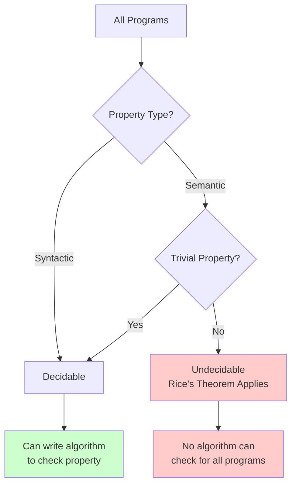
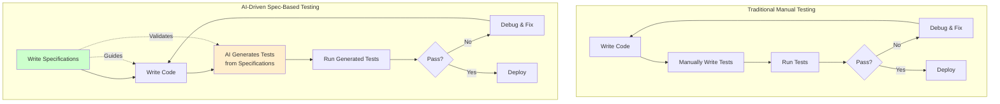

<!-- 
IMPORTANT: Date consistency check
- Filename: 2025-10-02-rices-theorem-why-automated-testing-will-fail.mdx
- Frontmatter date: 2025-10-02
- These MUST match exactly for proper blog functionality
- AI agents: Always verify date alignment when editing
-->

<!-- Write section-by-section. Keep this file as the authoritative English draft. -->

# Rice's Theorem: Why automated testing will fail

## Introduction: The Impossible Dream of Perfect Testing

"Testing shows the presence, not the absence of bugs." When Dutch computer scientist Edsger Dijkstra made this observation in 1970, he was articulating a fundamental truth about software testing that remains relevant today. Yet despite this wisdom, the software industry continues to pursue an elusive goal: comprehensive automated testing that can guarantee software correctness.

If you're a developer who has ever wondered why achieving 100% test coverage still doesn't guarantee bug-free code, or why your carefully crafted test suite occasionally misses critical issues, you're confronting a deeper reality. **The limitations of automated testing aren't merely engineering challenges to be overcome with better tools or techniques—they're rooted in fundamental mathematical impossibilities.**

The current wave of AI-powered testing tools promises to revolutionize quality assurance. Marketing materials tout intelligent test generation, autonomous bug detection, and unprecedented coverage. While these tools offer genuine improvements, they cannot escape a theoretical constraint established over seventy years ago by mathematician Henry Gordon Rice. His theorem proves that certain questions about program behavior simply cannot be answered algorithmically, regardless of computational power or ingenuity.

This isn't a pessimistic view—it's a realistic one. **Understanding why complete test automation is mathematically impossible helps us make better decisions about where to invest testing efforts and how to leverage modern tools effectively.** Rather than chasing an unattainable goal of perfect automation, we can adopt pragmatic approaches that acknowledge these limits while maximizing practical effectiveness.

This article explores Rice's Theorem and its profound implications for software testing. We'll examine what this mathematical result actually proves, understand how it constrains automated testing, and discover how combining formal specifications with AI-driven test generation offers a practical path forward. You'll learn why knowing the boundaries of what's possible makes you a more effective engineer, not a defeated one.

The journey ahead takes us from theoretical computer science to everyday development practices, showing how deep principles inform better engineering. Whether you're writing unit tests, designing test strategies, or evaluating new testing tools, understanding these fundamentals will sharpen your judgment and improve your results.

<!-- truncate -->

---

## Understanding Rice's Theorem: The Mathematics of Impossibility

To understand why automated testing faces fundamental limits, we must first grasp a remarkable result from computability theory. **[Rice's Theorem](https://en.wikipedia.org/wiki/Rice%27s_theorem), proven by Henry Gordon Rice in 1951, states that all non-trivial semantic properties of programs are undecidable.** This means no algorithm can determine whether an arbitrary program possesses any interesting behavioral characteristic.

Let's unpack this statement carefully, as it contains several crucial concepts that directly impact how we think about testing.

### What Does "Undecidable" Mean?

In computer science, a problem is **undecidable** when no algorithm exists that can correctly answer the question for all possible inputs. This isn't about current technological limitations—it's a mathematical proof that no such algorithm can ever exist, regardless of computational resources or algorithmic cleverness.

The most famous undecidable problem is the [halting problem](https://plato.stanford.edu/entries/turing-machine/), proven by Alan Turing in 1936. The halting problem asks: "Given an arbitrary program and its input, will the program eventually halt or run forever?" Turing proved that no general algorithm can answer this question for all programs. Rice's Theorem generalizes this result to encompass a vast class of questions about program behavior.

### Semantic vs. Syntactic Properties: A Critical Distinction

Rice's Theorem applies specifically to **semantic properties**—characteristics that depend on what a program actually computes or how it behaves when executed. This contrasts with **syntactic properties**, which concern only how the program is written.

| Property Type | Depends On | Decidable? | Examples |
|--------------|------------|------------|----------|
| **Syntactic** | Program text/structure | Yes | Contains a loop, uses recursion, has 100+ lines, includes specific keyword |
| **Semantic** | Program behavior | No* | Always returns positive numbers, terminates for all inputs, computes prime numbers, is equivalent to another program |

*Non-trivial semantic properties are undecidable per Rice's Theorem

You can easily write a program to check if code contains a `while` loop—that's syntactic analysis. But you cannot write a general program to determine if a `while` loop will ever terminate—that's a semantic question governed by undecidability.

### Rice's Theorem: The Formal Statement

Here's Rice's Theorem in accessible terms:

:::note Core Concept: Rice's Theorem
For any non-trivial property of the function computed by a program, there is no general algorithm that can decide whether an arbitrary program has that property.

"Non-trivial" means the property is true for some programs and false for others (excluding trivially true or false properties). "Semantic property" means the property depends on the program's behavior, not its source code structure.
:::

Consider these questions about programs:
- Does this program always return the correct result?
- Will this program ever crash?
- Does this program contain an infinite loop on some input?
- Is this program equivalent to that program?

Rice's Theorem proves that **no general algorithmic approach can answer these questions for all programs.** Each of these is a semantic property—they depend on program behavior—and none is trivial.

### Visualizing the Undecidability Boundary

The following diagram illustrates how Rice's Theorem creates a boundary between what we can and cannot determine about programs:

This diagram shows that Rice's Theorem draws a sharp line: once we ask semantic questions about program behavior that aren't trivially answered, we enter the realm of undecidability. No amount of engineering effort or computational power changes this boundary—it's a mathematical certainty.

### Why This Matters for Software Engineering

You might wonder: "Why should I care about abstract mathematical theorems when I'm just trying to write reliable software?" The answer is profound: **Rice's Theorem explains why certain software engineering goals are fundamentally unattainable, not merely difficult.**

When tool vendors promise "complete automated verification" or "guaranteed bug detection," they're either claiming to solve undecidable problems (impossible) or carefully constraining the problem scope in ways that may not be immediately obvious. Understanding Rice's Theorem helps you evaluate these claims critically and set realistic expectations for testing strategies.

The theorem doesn't make testing futile—far from it. Instead, it clarifies that testing is fundamentally a heuristic activity: we sample program behavior, check specific cases, and build confidence without ever achieving mathematical certainty. This understanding shifts our focus from pursuing impossible guarantees to maximizing practical effectiveness within theoretical constraints.

**Core concept: Rice's Theorem proves that asking whether any program has any interesting behavioral property is mathematically undecidable—this is the theoretical foundation for why complete automated testing is impossible.**

Next, let's examine precisely how these theoretical limits manifest in real-world testing practices and what they mean for your daily work as a developer.

---

## What Rice's Theorem Means for Automated Testing

Now that we understand Rice's Theorem establishes fundamental limits on what we can determine about program behavior, let's connect this abstract result to practical testing challenges. **The implications are direct and sobering: automated testing cannot provide complete assurance of program correctness because the very questions we want testing to answer are mathematically undecidable.**

### What Testing Actually Accomplishes

When you write a test suite, what are you really doing? You're checking that your program behaves correctly for a specific set of inputs and conditions. Each test case exercises a particular execution path and verifies expected outcomes. This is valuable work—but it's fundamentally sampling, not proving.

Consider a simple function that accepts an integer and returns a boolean. Even this modest function has over 4 billion possible inputs (assuming 32-bit integers). Testing all of them is impractical. Testing a representative sample is pragmatic. But here's the crucial insight: **no amount of sampling proves the function works correctly for all inputs, because "works correctly for all inputs" is a semantic property governed by Rice's Theorem.**

:::tip Testing Reality Check
Testing demonstrates that your program behaves correctly for the cases you tested. It cannot prove your program behaves correctly for cases you haven't tested. This isn't a failure of testing methodology—it's a consequence of mathematical reality.
:::

Traditional testing methodologies acknowledge this limitation implicitly. We use techniques like boundary value analysis, equivalence partitioning, and code coverage to make our sampling strategy more effective. These are heuristics—educated guesses about which samples will reveal the most issues. They work remarkably well in practice, but they remain heuristics constrained by undecidability.

### The Limits of Different Testing Approaches

Let's examine how Rice's Theorem constrains various testing methodologies:

| Testing Approach | What It Checks | Constrained By Rice's Theorem? | Practical Value |
|-----------------|----------------|-------------------------------|----------------|
| **Unit Testing** | Individual functions with specific inputs | Yes - can't verify all inputs | High - finds many implementation bugs |
| **Integration Testing** | Component interactions | Yes - can't test all interaction scenarios | High - catches interface mismatches |
| **Property-Based Testing** | Properties across generated inputs | Yes - can't exhaust input space | Very High - discovers edge cases |
| **Formal Verification** | Mathematical proof of correctness | Partially* - requires complete specification | Very High - proves within specification |
| **Static Analysis** | Code patterns and structures | No - mostly syntactic | Medium - catches common patterns |

*Formal verification can prove correctness with respect to a formal specification, but Rice's Theorem still applies: determining if the specification correctly captures intended behavior is itself undecidable.

Each approach has value, but none can escape the fundamental constraint: **semantic properties of program behavior remain undecidable in the general case.**

### Why "Complete" Test Automation Fails

The promise of complete test automation typically means: "Let's automatically generate tests that verify all program behaviors." Rice's Theorem immediately reveals why this goal is impossible:

1. **"All program behaviors"** is a semantic property
2. **Semantic properties are undecidable** per Rice's Theorem  
3. **Therefore, no algorithm can verify all behaviors**

AI-powered test generation tools may seem to challenge this conclusion. They can generate impressive test suites by analyzing code structure, learning from existing tests, and predicting likely edge cases. However, these tools fundamentally perform sophisticated heuristic sampling—they don't (and can't) provide mathematical guarantees of completeness.

Consider what truly comprehensive automated testing would require:
- Determining all possible execution paths (undecidable for arbitrary programs)
- Identifying all boundary conditions and edge cases (requires understanding semantic behavior)
- Verifying correctness for infinite or extremely large input spaces (impossible through enumeration)
- Ensuring the test suite catches all possible bugs (equivalent to proving correctness)

Each requirement hits an undecidability barrier established by Rice's Theorem.

### What We CAN Automate

Understanding the limits helps us focus on what's genuinely achievable:

**Decidable (Automatable) Testing Activities:**
- Checking code style and formatting (syntactic)
- Detecting certain vulnerability patterns (known syntactic patterns)
- Running regression tests with fixed inputs
- Verifying behavior for explicitly tested scenarios
- Measuring code coverage metrics
- Generating tests based on code structure analysis

**Undecidable (Non-Automatable) Testing Goals:**
- Proving program correctness for all inputs
- Guaranteeing absence of all bugs
- Determining if a program satisfies informal requirements
- Verifying a program matches user intent
- Finding all possible edge cases

The distinction is clear: we can automate checking of specific cases and syntactic properties, but we cannot automate complete verification of semantic correctness.

### A Pragmatic Perspective

Does Rice's Theorem mean testing is hopeless? Absolutely not. It means testing is **pragmatic**—we work with effective heuristics rather than absolute certainties. This realization is liberating, not defeating.

**Core concept: Testing can never prove program correctness for all inputs, but understanding this limitation helps us focus testing efforts strategically rather than chasing impossible guarantees of completeness.**

Instead of pursuing the impossible goal of complete automation, we should ask: "How can we make our necessarily incomplete testing as effective as possible?" This question leads us toward a promising direction: combining human-provided specifications with AI-driven test generation to maximize practical coverage within theoretical constraints.

Let's explore how this approach offers a path forward that respects Rice's Theorem while leveraging modern tooling effectively.

---

## AI-Driven Spec-Based Testing: A Practical Path Forward

Understanding that complete test automation is mathematically impossible doesn't leave us helpless—it guides us toward more effective strategies. **The key insight is that we can dramatically improve testing effectiveness by combining formal specifications with AI-driven test generation.** This approach acknowledges Rice's Theorem's constraints while maximizing practical coverage.

### Why Specifications Change the Game

Rice's Theorem proves we cannot algorithmically determine whether a program has arbitrary semantic properties. However, when humans provide explicit specifications that define what "correct" means, we transform an undecidable general problem into tractable specific problems.

Think about the difference:
- **Undecidable question**: "Does this program do what the user wants?" (requires understanding undefined intent)
- **Tractable question**: "Does this program satisfy these explicit specifications?" (checking defined requirements)

Specifications don't "solve" undecidability—they constrain the problem space to checkable assertions. The specification itself must be correct (which Rice's Theorem says we can't verify automatically), but once we have a specification, we can systematically test against it.

:::info Related Reading
For a deeper exploration of how structured specifications improve development outcomes, see my previous analysis: [Spec-Driven Development: A Systematic Approach to Complex Features](/blog/spec-driven-development). The same principles that make specifications valuable for development also make them powerful foundations for testing.
:::

### How AI Amplifies Spec-Based Testing

Traditional spec-based testing has been valuable but labor-intensive: humans write specifications, then manually create tests to verify them. Large language models (LLMs) change this equation by automating the test generation step while respecting the theoretical constraints.

Here's how AI-driven spec-based testing works within Rice's Theorem's limits:

1. **Human expertise**: Developers write formal specifications defining expected behavior (using formats like [EARS requirements](https://alistairmavin.com/ears/))
2. **AI generation**: LLMs analyze specifications and generate comprehensive test cases covering specified scenarios
3. **Automated execution**: Generated tests run automatically, providing rapid feedback
4. **Iterative refinement**: Results inform specification improvements and additional test generation

**The human provides the semantic understanding (what "correct" means), while AI provides the scale (generating many test cases).** This division of labor respects what each party does well while working within mathematical constraints.

### Comparing Testing Workflows

The following diagram contrasts traditional manual testing with AI-driven spec-based testing:

The key difference: specifications become the source of truth that guides both implementation and testing. AI doesn't replace human judgment—it amplifies it by generating comprehensive test suites from human-provided specifications.

### Practical Benefits and Limitations

Let's be honest about what this approach offers and where it still faces constraints:

| Aspect | Benefit | Limitation |
|--------|---------|------------|
| **Test Coverage** | AI generates many diverse test cases from specs | Cannot guarantee complete coverage (Rice's Theorem still applies) |
| **Efficiency** | Dramatically faster than manual test writing | Requires upfront specification effort |
| **Consistency** | Tests directly reflect specifications | Specifications themselves must be correct |
| **Edge Cases** | AI discovers scenarios humans might miss | AI is still heuristic, not exhaustive |
| **Maintenance** | Regenerate tests as specs evolve | Specification changes cascade to tests |

The approach doesn't overcome Rice's Theorem—it works effectively within its constraints by making the human-provided specifications the semantic foundation that AI amplifies into comprehensive test suites.

### Real-World Application

How might you apply this in practice? Consider a typical development scenario:

**Without spec-based AI testing:**
- Write code based on informal requirements
- Manually create unit tests for obvious cases
- Hope integration testing catches interactions
- Discover edge cases in production

**With spec-based AI testing:**
- Write formal specifications using EARS or similar format
- Implement code guided by clear specifications
- Use LLM to generate comprehensive test suite from specifications
- AI explores edge cases derived from spec combinations
- High confidence that implementation matches specifications

Recent research from Stanford University analyzing nearly 100,000 developers shows that [AI's productivity benefits are highly contextual](/blog/ai-productivity), with structured approaches significantly outperforming ad-hoc usage. Specification-based testing exemplifies this principle: AI works best when provided with clear, structured context about what to test.

### Why This Approach Respects Rice's Theorem

It's crucial to understand why AI-driven spec-based testing doesn't contradict Rice's Theorem:

1. **Specifications provide the semantic grounding**: Humans define what "correct" means, making verification tractable
2. **AI performs heuristic generation**: LLMs don't claim to generate all possible tests—they generate likely valuable tests
3. **Testing remains sampling**: We test extensively but not exhaustively, acknowledging incompleteness
4. **No claims of completeness**: The approach aims for practical effectiveness, not mathematical proof

This is pragmatic engineering: using powerful tools to maximize effectiveness while respecting fundamental constraints. We achieve better outcomes not by denying limits but by working intelligently within them.

**Core concept: AI doesn't solve undecidability, but it makes working within theoretical limits more effective by generating comprehensive tests from clear specifications—combining human semantic understanding with machine scale.**

The marriage of human-provided specifications and AI-driven test generation represents a mature response to Rice's Theorem: acknowledging what's impossible while maximizing what's achievable.

---

## Conclusion: Embracing Limits, Maximizing Effectiveness

Rice's Theorem teaches us humility about the limits of automation, but it also points toward more effective practices. The theorem's proof that all non-trivial semantic properties of programs are undecidable isn't a counsel of despair—it's an invitation to work smarter within fundamental constraints.

**The central insights from our exploration:**

First, **complete automated testing is mathematically impossible, not merely difficult.** Rice's Theorem proves that no algorithm can verify all semantic properties of programs. Tools promising comprehensive automated verification either constrain their scope significantly or make claims they cannot fulfill. Understanding this helps you evaluate testing tools critically and set realistic expectations.

Second, **testing is fundamentally heuristic sampling, not mathematical proof.** This isn't testing's weakness—it's testing's nature. We check specific cases, analyze patterns, and build confidence without ever achieving certainty. Effective testing maximizes the value of our necessarily incomplete sampling by focusing on high-probability failure modes and critical paths.

Third, **AI-driven spec-based testing offers a practical path forward.** By combining human-provided specifications (semantic grounding) with AI-generated test cases (scale and comprehensiveness), we achieve better coverage than manual approaches while respecting theoretical limits. The specifications define what "correct" means, making verification tractable; AI generates diverse test cases we might not consider manually.

### The Future of Testing

As AI testing tools continue to evolve, understanding Rice's Theorem becomes increasingly valuable. These tools will grow more sophisticated at generating test cases, identifying patterns, and suggesting improvements. But they will never escape the fundamental constraint: semantic properties remain undecidable.

The most effective testing strategies will combine:
- Clear specifications that define expected behavior explicitly
- AI-driven generation of comprehensive test suites from those specifications  
- Human judgment about which properties matter most
- Pragmatic acceptance that testing builds confidence, not certainty

Organizations already moving toward specification-driven development are positioning themselves to leverage AI testing tools most effectively. The infrastructure of clear requirements and formal specifications provides the context that makes AI-generated tests both comprehensive and meaningful.

### Taking Action

How can you apply these insights to your work?

**Immediately actionable steps:**
1. **Audit your testing assumptions**: Are you pursuing impossible goals like "complete coverage" or realistic goals like "comprehensive sampling of critical paths"?
2. **Experiment with specification-based testing**: Try writing formal specifications for your next feature using structured formats like EARS requirements
3. **Explore AI test generation tools**: But evaluate them understanding they perform sophisticated heuristic sampling, not exhaustive verification
4. **Share this understanding with your team**: Align expectations around what testing can and cannot achieve

**Longer-term strategies:**
- Adopt specification-driven development practices that create the foundation for effective AI-assisted testing
- Build institutional knowledge about testing's theoretical limits and practical effectiveness
- Evaluate testing tools based on how well they work within constraints, not claims to transcend them

### Final Thoughts

Understanding Rice's Theorem doesn't make you a worse engineer—it makes you a better one. **Knowledge of fundamental limits guides you toward effective strategies rather than impossible goals.** You waste less time chasing perfect automation and invest more effort in pragmatic approaches that maximize practical value.

The software industry sometimes suffers from insufficient appreciation of theoretical foundations. Practitioners who understand why certain goals are unattainable make better technical decisions, evaluate tools more critically, and set more realistic expectations. This isn't pessimism—it's engineering maturity.

Rice's Theorem has stood for over seventy years as a fundamental result in computer science. It will remain true regardless of how AI advances or how computing evolves. Our response shouldn't be to ignore it or hope to overcome it, but to respect it while building increasingly effective practices within its constraints.

As you continue your work as a software engineer, let Rice's Theorem inform your testing philosophy: test comprehensively but pragmatically, leverage AI where it amplifies human judgment, ground testing in clear specifications, and remember that building confidence through thorough sampling is valuable even if mathematical certainty remains unattainable.

The limits are real. The opportunities within those limits are vast. Understanding both makes you more effective.