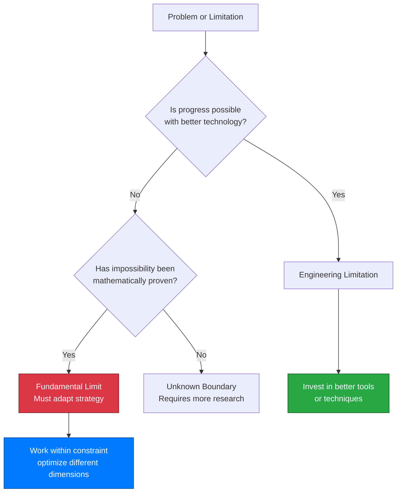
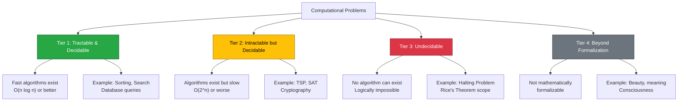

# The Physics of Code: Understanding Fundamental Limits in Computing

## Introduction: The Universal Speed Limit of Code

In 1905, Albert Einstein proved something revolutionary: nothing can travel faster than the speed of light. This isn't an engineering constraint that better technology might overcome—it's a fundamental property of spacetime itself, encoded in the structure of reality. Three decades later, in 1936, Alan Turing proved an equally profound result for computing: no algorithm can determine whether an arbitrary program will halt. Like Einstein's light speed barrier, this isn't a limitation of current computers or programming languages. **It's a mathematical certainty that will remain true forever, regardless of how powerful our machines become or how clever our algorithms get.**

Modern software engineering operates in the shadow of these fundamental limits, though most engineers encounter them as frustrating tool limitations rather than mathematical certainties. You've likely experienced this: a static analysis tool that misses obvious bugs, a testing framework that can't guarantee correctness despite 100% coverage, an AI assistant that generates code requiring careful human review. When marketing materials promise "complete automated verification" or "guaranteed bug detection," you might sense something's wrong—these claims feel too good to be true.

They are. **The limitations you encounter aren't temporary engineering challenges awaiting better tools—they're manifestations of fundamental mathematical impossibilities, as immutable as the speed of light or absolute zero.** Understanding these limits transforms from constraint into competitive advantage: knowing what's impossible focuses your energy on what's achievable, much as physicists leveraging relativity enabled GPS satellites and particle physics rather than wasting resources trying to exceed light speed.

If you're a developer who has wondered why certain problems persist despite decades of tool development, or a technical leader evaluating claims about revolutionary testing or verification technologies, this article offers crucial context. **Understanding computational limits isn't defeatist—it's the foundation of engineering maturity.** The best engineers don't ignore these boundaries; they understand them deeply and work brilliantly within them.

This journey explores how computational limits mirror physical laws, why "hard" problems differ fundamentally from "impossible" ones, and how this knowledge empowers better engineering decisions. We'll traverse from comfortable physical analogies to abstract computational theory, then back to practical frameworks you can apply tomorrow. Along the way, you'll discover why knowing the rules of the game makes you more effective at playing it, and how every breakthrough innovation in computing history emerged not by ignoring limits, but by deeply understanding them.

{/* truncate */}

---

## Section 1: The Nature of Fundamental Limits

Not all limitations are created equal. When your laptop runs slowly, that's an engineering limitation—upgrade the hardware and it improves. When a sorting algorithm takes O(n log n) time, that's a complexity bound—better algorithms might exist, but we've proven mathematical lower bounds. But when we say "no algorithm can solve the halting problem," we're describing something qualitatively different: a **fundamental limit**, a boundary that no amount of engineering effort, computational power, or algorithmic cleverness can ever cross.

Understanding this distinction is crucial for software engineering. **Engineering limitations are temporary constraints imposed by current technology, budget, or knowledge—they can be overcome with better tools, more resources, or clever solutions.** Fundamental limits, by contrast, are mathematically proven impossibilities that will remain true forever, embedded in the logical structure of computation itself, like physical laws embedded in the fabric of reality.

### The Landscape of Immutable Boundaries

Fundamental limits appear across multiple domains, and examining them reveals striking parallels. In physics, the speed of light (c ≈ 3×10⁸ m/s) isn't just "really fast"—it's the maximum speed at which causality can propagate through spacetime. Einstein's special relativity proved this is woven into the geometry of the universe. No matter how powerful your engine, you cannot exceed c; the universe's mathematics forbids it.

Similarly, absolute zero (0 Kelvin, or -273.15°C) isn't just "really cold"—it's the temperature at which a system reaches its minimum possible energy state. Quantum mechanics proves this temperature is unreachable; you can approach it asymptotically but never attain it. Scientists have achieved temperatures within billionths of a degree above absolute zero, yet that final gap remains forever unbridgeable.

| Domain | Fundamental Limit | Why It's Fundamental | Practical Impact |
|--------|------------------|---------------------|------------------|
| **Physics** | Speed of light (c ≈ 3×10⁸ m/s) | Structure of spacetime itself | GPS time corrections, particle accelerators, communication delays across space |
| **Thermodynamics** | Absolute zero (0 K) | Quantum uncertainty principle | Achievable: nanokelvin temperatures, superconductivity, quantum computing |
| **Quantum Mechanics** | Heisenberg uncertainty (ΔxΔp ≥ ℏ/2) | Wave-particle duality | Limits measurement precision, enables quantum encryption |
| **Mathematics** | Gödel's incompleteness | Self-referential paradoxes | Any formal system has unprovable truths, limits automated reasoning |
| **Computing** | Halting problem | Diagonal argument, self-reference | Cannot build universal program verifiers, testing is sampling not proof |
| **Computing** | Rice's theorem | Generalizes halting to semantic properties | All interesting program behaviors are algorithmically undecidable |

This table reveals a pattern: fundamental limits emerge from deep structural properties—spacetime geometry, quantum uncertainty, logical self-reference—not from current technological constraints. They're discovered through mathematical proof, not observed as practical difficulties.

### Why These Limits Cannot Be Overcome

The crucial insight is that fundamental limits are **proven mathematically impossible**, not merely very difficult. Turing's proof of the halting problem's undecidability (1936) uses a diagonal argument showing that any claimed "halt checker" can be used to construct a program that contradicts itself—a logical impossibility, not an engineering challenge.

Consider this contrast:
- **Engineering limit**: "Current testing tools miss 5% of bugs" → Better tools reduce this percentage
- **Fundamental limit**: "No testing tool can guarantee finding all bugs in arbitrary programs" → Rice's theorem proves this mathematically

The first invites optimization; the second demands strategic adaptation. Attempting to overcome a fundamental limit is like trying to build a perpetual motion machine or exceed light speed—you're not failing due to insufficient cleverness, but because you're attempting something the universe's logic forbids.

This diagram clarifies the decision tree: if something has been proven mathematically impossible, you've crossed from "difficult engineering problem" into "must change strategy entirely." The engineering maturity lies in recognizing which category your problem occupies.

### The Empowering Reality of Immutable Laws

Here's the counter-intuitive truth: **understanding that certain limits are fundamental is empowering, not restrictive.** When physicists accepted that c is a hard limit, they stopped wasting effort on impossible "faster-than-light" engines and instead developed:
- GPS systems that account for relativistic time dilation
- Particle accelerators that approach but never exceed c
- Fiber optic communications using light itself at maximum speed
- Nuclear energy from E=mc²

The limit didn't constrain innovation—it focused it. Similarly, understanding that complete automated verification is mathematically impossible doesn't make you a worse engineer; it makes you a better one who invests effort wisely rather than chasing impossible goals.

:::note Core Concept: Fundamental vs. Engineering Limits
**Fundamental limits** are mathematically proven impossibilities that will never be overcome, like the speed of light or the halting problem. **Engineering limitations** are temporary constraints of current technology, budget, or knowledge that can improve over time. Distinguishing between them is essential for setting realistic goals and making strategic decisions.
:::

The practical implication for software engineers is clear: when evaluating a tool, framework, or approach, ask "Is this claim working within fundamental limits, or promising to overcome them?" Claims of "complete automated verification" or "guaranteed bug-free code" are red flags—they're promising to solve undecidable problems. Realistic tools acknowledge their scope limitations explicitly.

**These limits aren't challenges to overcome—they're the rules of the game we must play within.** The next question becomes: what does the landscape of computational complexity actually look like, and where do these sharp boundaries lie?

---

## Section 2: The Hierarchy of Computational Complexity

Understanding that fundamental limits exist is one thing; navigating the landscape of what's possible, what's hard, and what's impossible is another. **Computational problems don't simply divide into "solvable" and "unsolvable"—they occupy a rich hierarchy with mathematically sharp boundaries.** This hierarchy has profound implications for software engineering: knowing which tier your problem occupies determines whether you should optimize algorithms, accept probabilistic approaches, or embrace human judgment.

Let's explore this landscape through a four-tier framework that progresses from the trivially computable to the fundamentally unformalizable.

### Tier 1: Mechanically Computable (Decidable & Tractable)

At the foundation lie problems that are not only solvable but solvable efficiently. These are **decidable problems with polynomial time complexity** (typically O(1), O(log n), O(n), or O(n log n)). For these problems, algorithms exist that always terminate and run quickly even for large inputs.

**Examples**:
- Arithmetic operations (2+2=4, multiplication, division)
- Boolean logic evaluation
- Searching sorted arrays (binary search: O(log n))
- Sorting algorithms (merge sort, quicksort: O(n log n))
- Many graph algorithms (shortest path in sparse graphs)
- Database queries with proper indexing

**Characteristics**:
- Fast even for large inputs (millions or billions of elements)
- Deterministic correct answers
- Fully automatable without human judgment
- Can be implemented in production systems without approximation

**Real-world impact**: This tier represents the backbone of reliable software. When you query a database, compile code, or sort a list, you're leveraging Tier 1 problems. The predictability and speed make these problems suitable for complete automation.

### Tier 2: Computationally Hard but Decidable

Moving up the hierarchy, we encounter problems that are theoretically solvable—an algorithm exists that always gives the correct answer—but the algorithm requires exponential or factorial time. **These problems are decidable but intractable** for large inputs.

**Examples**:
- Traveling Salesman Problem (TSP): Finding optimal route through N cities
- Boolean Satisfiability (SAT): Determining if a logical formula can be true
- Protein folding simulations
- Chess optimal strategy (for arbitrary positions)
- Many NP-complete problems (over 3,000 identified)

**Complexity classes**: NP-complete, EXPTIME, NEXP

**Characteristics**:
- Algorithms exist and always terminate with correct answer
- Time requirements grow exponentially: O(2ⁿ), O(n!), or worse
- Solving a 100-element instance might take longer than the universe's lifetime
- Often admit good approximations or heuristics
- Cryptography relies on this tier's difficulty (factoring large primes)

**The P vs NP question**: One of the deepest open problems in mathematics asks whether P=NP (millennium prize: $1 million). If P=NP, many Tier 2 problems drop to Tier 1. Most computer scientists believe P≠NP, meaning this tier is fundamentally distinct.

**Real-world impact**: These problems require heuristics, approximations, or constraint relaxation. Exact solutions work only for small inputs; production systems use "good enough" approaches. The hardness of these problems enables modern cryptography—we rely on factoring being exponentially difficult.

### Tier 3: Undecidable Problems

Here we cross a qualitative boundary. **Undecidable problems are those for which no algorithm can exist that correctly answers the question for all possible inputs.** This isn't about time complexity—it's about logical impossibility.

**Examples**:
- The Halting Problem: "Does this program terminate on this input?"
- Program Equivalence: "Do these two programs compute the same function?"
- Rice's Theorem scope: Any non-trivial semantic property of programs
- Determining if a program is virus-free (general case)
- Checking if code always produces correct output

**Characteristics**:
- No algorithm exists for the general case—proven mathematically impossible
- Can solve specific instances but not universal problem
- Time complexity: infinite (algorithm never terminates correctly for all cases)
- Core reason: Self-reference creates logical contradictions

**The crucial distinction**: You can verify that a specific program halts by running it (if it terminates, you know). You can even prove some programs never halt using formal methods. But you cannot build a single algorithm that decides halting for all programs—Turing proved this creates a logical contradiction.

**Real-world impact**: Complete automated program verification is impossible. Testing samples behavior rather than proving correctness. Human judgment becomes essential for semantic properties. This is why no tool can "guarantee" finding all bugs.

### Tier 4: Beyond Formalization

Finally, we encounter questions that may not even be formalizable as computational problems. **These are problems where we lack a precise mathematical specification of what "correct" means, making algorithmic solution impossible in principle.**

**Examples**:
- Aesthetic judgment: "Is this code beautiful?"
- Consciousness and understanding: "Does this AI truly understand?"
- Meaning and significance: "What is the meaning of life?"
- "Good" translation (beyond grammatical correctness)
- Ethical decisions: "Is this algorithm fair?"

**Characteristics**:
- No clear mathematical definition of problem
- Answer may be inherently subjective or cultural
- Not clear if these are "computational" in nature
- Multiple valid perspectives may coexist

**Real-world impact**: Human expertise remains irreplaceable. AI can provide options or suggestions, but judgment calls require humans. Design, ethics, and meaning-making occupy this tier.

### The Hierarchy Visualized

### The Qualitative Boundary: Why Tier 2→3 Matters Most

The transition from Tier 2 to Tier 3 is fundamentally different from Tier 1 to Tier 2. Between Tiers 1 and 2, the difference is quantitative: faster versus slower, but both solvable. **Between Tiers 2 and 3, the difference is qualitative: solvable versus impossible.**

No amount of computational power, cleverness, or time moves a Tier 3 problem into Tier 2. Quantum computers, for instance, can solve some Tier 2 problems faster (Shor's algorithm factors integers in polynomial time on quantum hardware), but they cannot solve Tier 3 problems—undecidability is hardware-independent.

| Comparison Aspect | Tier 1 → Tier 2 Boundary | Tier 2 → Tier 3 Boundary |
|------------------|--------------------------|--------------------------|
| **Nature** | Quantitative (speed) | Qualitative (possibility) |
| **With more compute** | Tier 2 problems take longer but complete | Tier 3 problems remain unsolvable |
| **Better algorithms** | Can move problems between tiers | Cannot cross this boundary |
| **Practical approach** | Optimize, approximate, or accept slowness | Accept sampling, require human judgment |
| **Mathematical basis** | Complexity theory (P, NP, EXPTIME) | Computability theory (Church-Turing, Gödel) |

:::note Core Concept: The Tier 2-3 Boundary
The boundary between **computationally hard** (Tier 2) and **undecidable** (Tier 3) is qualitative, not quantitative. No amount of computing power, better algorithms, or technological advancement can move an undecidable problem into the decidable realm. This boundary is eternal and mathematically proven.
:::

### Practical Implications of the Hierarchy

Understanding which tier your problem occupies guides strategy:

**Tier 1 problems**: Fully automate. Optimize algorithms. Build reliable production systems with deterministic behavior.

**Tier 2 problems**: Use heuristics, approximations, or constraint relaxation. Accept "good enough" solutions. For cryptography, rely on the difficulty. Consider probabilistic methods.

**Tier 3 problems**: Accept that complete automation is impossible. Use sampling approaches (like testing). Combine automation for specific cases with human judgment for semantic properties. Build confidence through multiple approaches rather than proof.

**Tier 4 problems**: Reserve human expertise. Use AI as a tool to surface options, not make final decisions. Accept multiple valid perspectives.

**Understanding which tier your problem occupies guides strategy: optimize algorithms for Tier 1-2, accept sampling for Tier 3, embrace human judgment for Tier 4.** This hierarchy isn't a constraint—it's a strategic map that clarifies where to invest effort and what outcomes to expect.

Having established this landscape, a natural question emerges: can we measure complexity mathematically, giving precise meaning to "how hard" a problem is?

