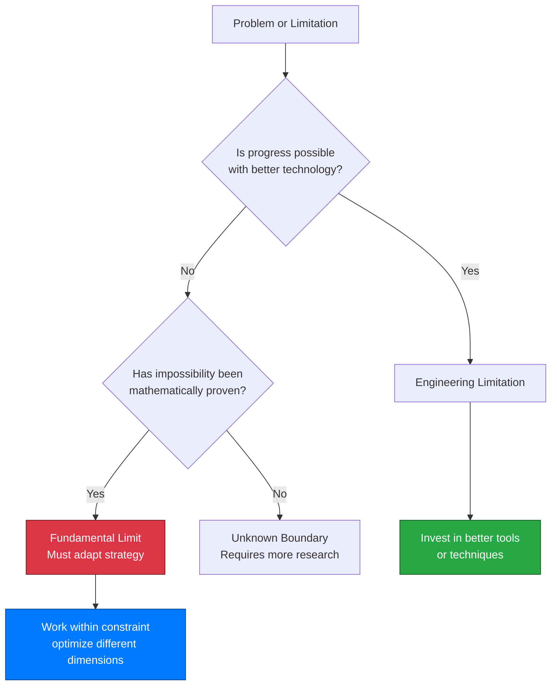
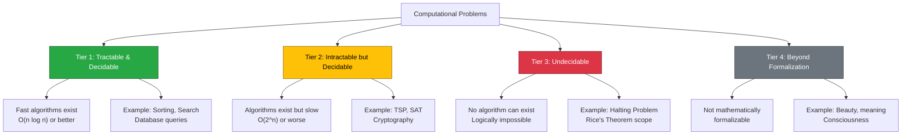
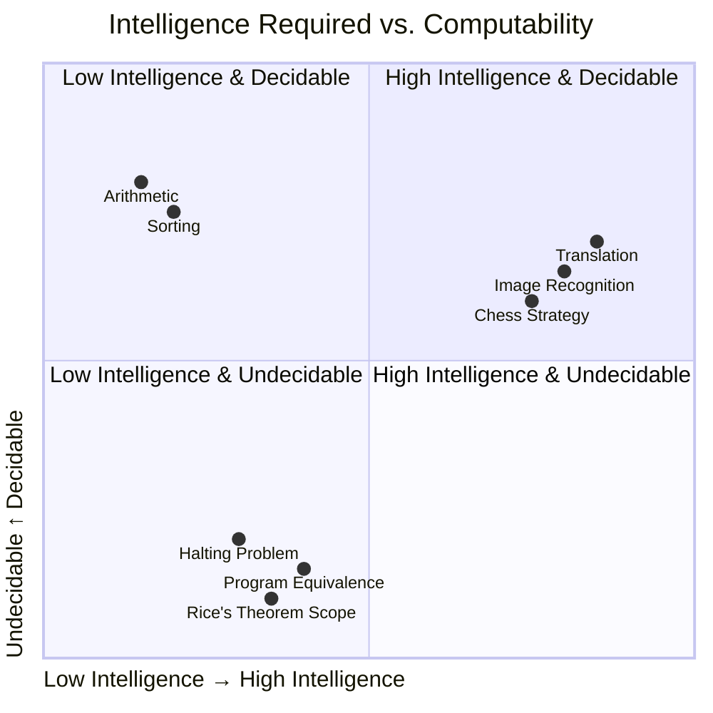
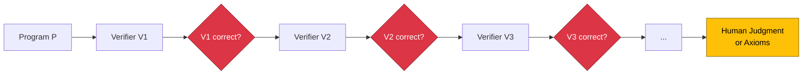

# The Physics of Code: Understanding Fundamental Limits in Computing

## Introduction: The Universal Speed Limit of Code

In 1905, Albert Einstein proved something revolutionary: nothing can travel faster than the speed of light. This isn't an engineering constraint that better technology might overcome—it's a fundamental property of spacetime itself, encoded in the structure of reality. Three decades later, in 1936, Alan Turing proved an equally profound result for computing: no algorithm can determine whether an arbitrary program will halt. Like Einstein's light speed barrier, this isn't a limitation of current computers or programming languages. **It's a mathematical certainty that will remain true forever, regardless of how powerful our machines become or how clever our algorithms get.**

Modern software engineering operates in the shadow of these fundamental limits, though most engineers encounter them as frustrating tool limitations rather than mathematical certainties. You've likely experienced this: a static analysis tool that misses obvious bugs, a testing framework that can't guarantee correctness despite 100% coverage, an AI assistant that generates code requiring careful human review. When marketing materials promise "complete automated verification" or "guaranteed bug detection," you might sense something's wrong—these claims feel too good to be true.

They are. **The limitations you encounter aren't temporary engineering challenges awaiting better tools—they're manifestations of fundamental mathematical impossibilities, as immutable as the speed of light or absolute zero.** Understanding these limits transforms from constraint into competitive advantage: knowing what's impossible focuses your energy on what's achievable, much as physicists leveraging relativity enabled GPS satellites and particle physics rather than wasting resources trying to exceed light speed.

If you're a developer who has wondered why certain problems persist despite decades of tool development, or a technical leader evaluating claims about revolutionary testing or verification technologies, this article offers crucial context. **Understanding computational limits isn't defeatist—it's the foundation of engineering maturity.** The best engineers don't ignore these boundaries; they understand them deeply and work brilliantly within them.

This journey explores how computational limits mirror physical laws, why "hard" problems differ fundamentally from "impossible" ones, and how this knowledge empowers better engineering decisions. We'll traverse from comfortable physical analogies to abstract computational theory, then back to practical frameworks you can apply tomorrow. Along the way, you'll discover why knowing the rules of the game makes you more effective at playing it, and how every breakthrough innovation in computing history emerged not by ignoring limits, but by deeply understanding them.

{/* truncate */}

---

## Section 1: The Nature of Fundamental Limits

Not all limitations are created equal. When your laptop runs slowly, that's an engineering limitation—upgrade the hardware and it improves. When a sorting algorithm takes O(n log n) time, that's a complexity bound—better algorithms might exist, but we've proven mathematical lower bounds. But when we say "no algorithm can solve the halting problem," we're describing something qualitatively different: a **fundamental limit**, a boundary that no amount of engineering effort, computational power, or algorithmic cleverness can ever cross.

Understanding this distinction is crucial for software engineering. **Engineering limitations are temporary constraints imposed by current technology, budget, or knowledge—they can be overcome with better tools, more resources, or clever solutions.** Fundamental limits, by contrast, are mathematically proven impossibilities that will remain true forever, embedded in the logical structure of computation itself, like physical laws embedded in the fabric of reality.

### The Landscape of Immutable Boundaries

Fundamental limits appear across multiple domains, and examining them reveals striking parallels. In physics, the speed of light (c ≈ 3×10⁸ m/s) isn't just "really fast"—it's the maximum speed at which causality can propagate through spacetime. Einstein's special relativity proved this is woven into the geometry of the universe. No matter how powerful your engine, you cannot exceed c; the universe's mathematics forbids it.

Similarly, absolute zero (0 Kelvin, or -273.15°C) isn't just "really cold"—it's the temperature at which a system reaches its minimum possible energy state. Quantum mechanics proves this temperature is unreachable; you can approach it asymptotically but never attain it. Scientists have achieved temperatures within billionths of a degree above absolute zero, yet that final gap remains forever unbridgeable.

| Domain | Fundamental Limit | Why It's Fundamental | Practical Impact |
|--------|------------------|---------------------|------------------|
| **Physics** | Speed of light (c ≈ 3×10⁸ m/s) | Structure of spacetime itself | GPS time corrections, particle accelerators, communication delays across space |
| **Thermodynamics** | Absolute zero (0 K) | Quantum uncertainty principle | Achievable: nanokelvin temperatures, superconductivity, quantum computing |
| **Quantum Mechanics** | Heisenberg uncertainty (ΔxΔp ≥ ℏ/2) | Wave-particle duality | Limits measurement precision, enables quantum encryption |
| **Mathematics** | Gödel's incompleteness | Self-referential paradoxes | Any formal system has unprovable truths, limits automated reasoning |
| **Computing** | Halting problem | Diagonal argument, self-reference | Cannot build universal program verifiers, testing is sampling not proof |
| **Computing** | Rice's theorem | Generalizes halting to semantic properties | All interesting program behaviors are algorithmically undecidable |

This table reveals a pattern: fundamental limits emerge from deep structural properties—spacetime geometry, quantum uncertainty, logical self-reference—not from current technological constraints. They're discovered through mathematical proof, not observed as practical difficulties.

### Why These Limits Cannot Be Overcome

The crucial insight is that fundamental limits are **proven mathematically impossible**, not merely very difficult. Turing's proof of the halting problem's undecidability (1936) uses a diagonal argument showing that any claimed "halt checker" can be used to construct a program that contradicts itself—a logical impossibility, not an engineering challenge.

Consider this contrast:
- **Engineering limit**: "Current testing tools miss 5% of bugs" → Better tools reduce this percentage
- **Fundamental limit**: "No testing tool can guarantee finding all bugs in arbitrary programs" → Rice's theorem proves this mathematically

The first invites optimization; the second demands strategic adaptation. Attempting to overcome a fundamental limit is like trying to build a perpetual motion machine or exceed light speed—you're not failing due to insufficient cleverness, but because you're attempting something the universe's logic forbids.



This diagram clarifies the decision tree: if something has been proven mathematically impossible, you've crossed from "difficult engineering problem" into "must change strategy entirely." The engineering maturity lies in recognizing which category your problem occupies.

### The Empowering Reality of Immutable Laws

Here's the counter-intuitive truth: **understanding that certain limits are fundamental is empowering, not restrictive.** When physicists accepted that c is a hard limit, they stopped wasting effort on impossible "faster-than-light" engines and instead developed:
- GPS systems that account for relativistic time dilation
- Particle accelerators that approach but never exceed c
- Fiber optic communications using light itself at maximum speed
- Nuclear energy from E=mc²

The limit didn't constrain innovation—it focused it. Similarly, understanding that complete automated verification is mathematically impossible doesn't make you a worse engineer; it makes you a better one who invests effort wisely rather than chasing impossible goals.

:::note Core Concept: Fundamental vs. Engineering Limits
**Fundamental limits** are mathematically proven impossibilities that will never be overcome, like the speed of light or the halting problem. **Engineering limitations** are temporary constraints of current technology, budget, or knowledge that can improve over time. Distinguishing between them is essential for setting realistic goals and making strategic decisions.
:::

The practical implication for software engineers is clear: when evaluating a tool, framework, or approach, ask "Is this claim working within fundamental limits, or promising to overcome them?" Claims of "complete automated verification" or "guaranteed bug-free code" are red flags—they're promising to solve undecidable problems. Realistic tools acknowledge their scope limitations explicitly.

**These limits aren't challenges to overcome—they're the rules of the game we must play within.** The next question becomes: what does the landscape of computational complexity actually look like, and where do these sharp boundaries lie?

---

## Section 2: The Hierarchy of Computational Complexity

Understanding that fundamental limits exist is one thing; navigating the landscape of what's possible, what's hard, and what's impossible is another. **Computational problems don't simply divide into "solvable" and "unsolvable"—they occupy a rich hierarchy with mathematically sharp boundaries.** This hierarchy has profound implications for software engineering: knowing which tier your problem occupies determines whether you should optimize algorithms, accept probabilistic approaches, or embrace human judgment.

Let's explore this landscape through a four-tier framework that progresses from the trivially computable to the fundamentally unformalizable.

### Tier 1: Mechanically Computable (Decidable & Tractable)

At the foundation lie problems that are not only solvable but solvable efficiently. These are **decidable problems with polynomial time complexity** (typically O(1), O(log n), O(n), or O(n log n)). For these problems, algorithms exist that always terminate and run quickly even for large inputs.

**Examples**:
- Arithmetic operations (2+2=4, multiplication, division)
- Boolean logic evaluation
- Searching sorted arrays (binary search: O(log n))
- Sorting algorithms (merge sort, quicksort: O(n log n))
- Many graph algorithms (shortest path in sparse graphs)
- Database queries with proper indexing

**Characteristics**:
- Fast even for large inputs (millions or billions of elements)
- Deterministic correct answers
- Fully automatable without human judgment
- Can be implemented in production systems without approximation

**Real-world impact**: This tier represents the backbone of reliable software. When you query a database, compile code, or sort a list, you're leveraging Tier 1 problems. The predictability and speed make these problems suitable for complete automation.

### Tier 2: Computationally Hard but Decidable

Moving up the hierarchy, we encounter problems that are theoretically solvable—an algorithm exists that always gives the correct answer—but the algorithm requires exponential or factorial time. **These problems are decidable but intractable** for large inputs.

**Examples**:
- Traveling Salesman Problem (TSP): Finding optimal route through N cities
- Boolean Satisfiability (SAT): Determining if a logical formula can be true
- Protein folding simulations
- Chess optimal strategy (for arbitrary positions)
- Many NP-complete problems (over 3,000 identified)

**Complexity classes**: NP-complete, EXPTIME, NEXP

**Characteristics**:
- Algorithms exist and always terminate with correct answer
- Time requirements grow exponentially: O(2ⁿ), O(n!), or worse
- Solving a 100-element instance might take longer than the universe's lifetime
- Often admit good approximations or heuristics
- Cryptography relies on this tier's difficulty (factoring large primes)

**The P vs NP question**: One of the deepest open problems in mathematics asks whether P=NP (millennium prize: $1 million). If P=NP, many Tier 2 problems drop to Tier 1. Most computer scientists believe P≠NP, meaning this tier is fundamentally distinct.

**Real-world impact**: These problems require heuristics, approximations, or constraint relaxation. Exact solutions work only for small inputs; production systems use "good enough" approaches. The hardness of these problems enables modern cryptography—we rely on factoring being exponentially difficult.

### Tier 3: Undecidable Problems

Here we cross a qualitative boundary. **Undecidable problems are those for which no algorithm can exist that correctly answers the question for all possible inputs.** This isn't about time complexity—it's about logical impossibility.

**Examples**:
- The Halting Problem: "Does this program terminate on this input?"
- Program Equivalence: "Do these two programs compute the same function?"
- Rice's Theorem scope: Any non-trivial semantic property of programs
- Determining if a program is virus-free (general case)
- Checking if code always produces correct output

**Characteristics**:
- No algorithm exists for the general case—proven mathematically impossible
- Can solve specific instances but not universal problem
- Time complexity: infinite (algorithm never terminates correctly for all cases)
- Core reason: Self-reference creates logical contradictions

**The crucial distinction**: You can verify that a specific program halts by running it (if it terminates, you know). You can even prove some programs never halt using formal methods. But you cannot build a single algorithm that decides halting for all programs—Turing proved this creates a logical contradiction.

**Real-world impact**: Complete automated program verification is impossible. Testing samples behavior rather than proving correctness. Human judgment becomes essential for semantic properties. This is why no tool can "guarantee" finding all bugs.

### Tier 4: Beyond Formalization

Finally, we encounter questions that may not even be formalizable as computational problems. **These are problems where we lack a precise mathematical specification of what "correct" means, making algorithmic solution impossible in principle.**

**Examples**:
- Aesthetic judgment: "Is this code beautiful?"
- Consciousness and understanding: "Does this AI truly understand?"
- Meaning and significance: "What is the meaning of life?"
- "Good" translation (beyond grammatical correctness)
- Ethical decisions: "Is this algorithm fair?"

**Characteristics**:
- No clear mathematical definition of problem
- Answer may be inherently subjective or cultural
- Not clear if these are "computational" in nature
- Multiple valid perspectives may coexist

**Real-world impact**: Human expertise remains irreplaceable. AI can provide options or suggestions, but judgment calls require humans. Design, ethics, and meaning-making occupy this tier.

### The Hierarchy Visualized



### The Qualitative Boundary: Why Tier 2→3 Matters Most

The transition from Tier 2 to Tier 3 is fundamentally different from Tier 1 to Tier 2. Between Tiers 1 and 2, the difference is quantitative: faster versus slower, but both solvable. **Between Tiers 2 and 3, the difference is qualitative: solvable versus impossible.**

No amount of computational power, cleverness, or time moves a Tier 3 problem into Tier 2. Quantum computers, for instance, can solve some Tier 2 problems faster (Shor's algorithm factors integers in polynomial time on quantum hardware), but they cannot solve Tier 3 problems—undecidability is hardware-independent.

| Comparison Aspect | Tier 1 → Tier 2 Boundary | Tier 2 → Tier 3 Boundary |
|------------------|--------------------------|--------------------------|
| **Nature** | Quantitative (speed) | Qualitative (possibility) |
| **With more compute** | Tier 2 problems take longer but complete | Tier 3 problems remain unsolvable |
| **Better algorithms** | Can move problems between tiers | Cannot cross this boundary |
| **Practical approach** | Optimize, approximate, or accept slowness | Accept sampling, require human judgment |
| **Mathematical basis** | Complexity theory (P, NP, EXPTIME) | Computability theory (Church-Turing, Gödel) |

:::note Core Concept: The Tier 2-3 Boundary
The boundary between **computationally hard** (Tier 2) and **undecidable** (Tier 3) is qualitative, not quantitative. No amount of computing power, better algorithms, or technological advancement can move an undecidable problem into the decidable realm. This boundary is eternal and mathematically proven.
:::

### Practical Implications of the Hierarchy

Understanding which tier your problem occupies guides strategy:

**Tier 1 problems**: Fully automate. Optimize algorithms. Build reliable production systems with deterministic behavior.

**Tier 2 problems**: Use heuristics, approximations, or constraint relaxation. Accept "good enough" solutions. For cryptography, rely on the difficulty. Consider probabilistic methods.

**Tier 3 problems**: Accept that complete automation is impossible. Use sampling approaches (like testing). Combine automation for specific cases with human judgment for semantic properties. Build confidence through multiple approaches rather than proof.

**Tier 4 problems**: Reserve human expertise. Use AI as a tool to surface options, not make final decisions. Accept multiple valid perspectives.

**Understanding which tier your problem occupies guides strategy: optimize algorithms for Tier 1-2, accept sampling for Tier 3, embrace human judgment for Tier 4.** This hierarchy isn't a constraint—it's a strategic map that clarifies where to invest effort and what outcomes to expect.

Having established this landscape, a natural question emerges: can we measure complexity mathematically, giving precise meaning to "how hard" a problem is?

---

## Section 3: Quantifying Complexity: Formal Measures

The hierarchy we've explored provides a qualitative understanding of computational difficulty, but computer science has developed rigorous mathematical frameworks to quantify complexity precisely. **These formal measures transform intuitions about "hard" and "impossible" into theorems and proofs.** Remarkably, some of these measures themselves encounter fundamental limits—we can prove that measuring complexity is sometimes impossible, revealing meta-computational boundaries.

### Computational Complexity Theory: The Study of Resource Requirements

The most widely applied framework is **[computational complexity theory](https://en.wikipedia.org/wiki/Computational_complexity_theory)**, which classifies problems based on the resources (primarily time and space) required to solve them as input size grows. This framework has given us the famous complexity classes that organize the computational universe.

**Key complexity classes**:

- **P (Polynomial time)**: Problems solvable in polynomial time O(nᵏ). These are generally considered "tractable." Examples: sorting, searching, shortest path in graphs. These problems scale well to large inputs.

- **NP (Nondeterministic Polynomial)**: Problems where solutions can be verified in polynomial time, even if finding them takes longer. Includes all P problems plus potentially harder ones. Example: Given a claimed solution to a Sudoku puzzle, you can quickly verify it's correct—but finding the solution might be harder.

- **NP-complete**: The "hardest" problems in NP. If any NP-complete problem has a polynomial solution, then all NP problems do (P=NP). Examples: TSP, Boolean satisfiability (SAT), graph coloring. Over 3,000 problems have been proven NP-complete.

- **PSPACE (Polynomial space)**: Problems solvable using polynomial memory, regardless of time. Includes P and NP. Example: Determining optimal strategy for certain games.

- **EXPTIME (Exponential time)**: Problems requiring exponential time O(2ⁿ). Provably harder than P. Example: Generalized chess on n×n boards.

**The P vs NP question**, one of the seven [Millennium Prize Problems](http://www.claymath.org/millennium-problems) worth $1 million, asks whether P=NP. Most computer scientists conjecture P≠NP, meaning some problems are verifiably harder than others—but this remains unproven after 50+ years.

**Practical value**: Complexity classes let us reason about algorithm performance rigorously. When you recognize a problem as NP-complete, you know seeking an efficient exact algorithm is likely futile—focus on approximations or heuristics instead.

### Kolmogorov Complexity: The Information Content of Data

A radically different measure is **[Kolmogorov complexity](https://en.wikipedia.org/wiki/Kolmogorov_complexity)**, introduced by Andrey Kolmogorov in 1963. Instead of measuring computation time, it measures the **descriptive complexity** of data: the length of the shortest program that produces a given output.

**Definition**: The Kolmogorov complexity K(x) of a string x is the length of the shortest program (in some fixed universal programming language) that outputs x and then halts.

**Examples**:
- The string "0000000000000000" has low Kolmogorov complexity: a short program like "print '0' 16 times" generates it. K(x) ≈ 20 characters.
- A truly random string "8f3a9b2e1c7d4f0a" has high Kolmogorov complexity approaching its own length: no shorter description exists than "print '8f3a9b2e1c7d4f0a'". K(x) ≈ length(x).
- The first million digits of π have relatively low complexity despite appearing random: "compute π to 1 million digits" is a short program.

**The paradox of uncomputability**: Here's where meta-limits emerge. **Kolmogorov complexity itself is uncomputable!** There is no algorithm that, given an arbitrary string x, can determine K(x). The proof uses a variant of Berry's paradox: "the smallest number not describable in fewer than twenty words" describes such a number in fewer than twenty words—a contradiction.

This means you cannot algorithmically determine if data is truly random or just appears random. Compression algorithms approximate Kolmogorov complexity but can never compute it exactly.

**Practical value**: Kolmogorov complexity provides the theoretical foundation for:
- Information theory and data compression (ZIP, gzip approximate minimal description length)
- Randomness testing (incompressible data is random)
- Machine learning (simpler models that fit data have lower description length—Occam's razor formalized)

### Logical Depth: Beyond Description to Derivation

Charles Bennett introduced **logical depth** in 1988 to distinguish between "trivial" and "meaningful" complexity. A string might have low Kolmogorov complexity (short description) but high logical depth if deriving it requires significant computation.

**Definition**: The logical depth of a string x is the minimum computation time needed to generate x from its shortest description.

**Examples**:
- A string of zeros: low Kolmogorov complexity (short program) AND low logical depth (program runs instantly)
- A crystal structure: low Kolmogorov complexity (regular lattice rules) BUT high logical depth (crystal formation took geological time)
- A random string: high Kolmogorov complexity (no compression) AND low logical depth (minimal derivation needed)
- A million digits of π: low Kolmogorov complexity (short algorithm) BUT high logical depth (computation takes time)

**The insight**: Logical depth captures "organized complexity"—systems that are both simple to describe yet take time to evolve. This relates to concepts of:
- Meaning and significance (deep vs shallow patterns)
- Natural vs artificial (evolved systems often have high depth)
- Computational irreducibility (some systems must be simulated to predict)

**Practical value**: Logical depth helps explain why some simple rules generate complex behavior (cellular automata, evolutionary systems) and why shortcuts don't always exist—sometimes you must run the simulation to know the outcome.

### Comparing the Measures

| Measure | What It Captures | Computable? | Primary Use |
|---------|------------------|-------------|-------------|
| **Computational Complexity** | Time/space to solve problem | Yes (for known algorithms) | Algorithm design, feasibility assessment |
| **Kolmogorov Complexity** | Shortest description length | No (proven uncomputable) | Information theory, randomness, compression |
| **Logical Depth** | Computation time from description | Partially (depends on halting) | Understanding organized complexity, meaning |

:::note Core Concept: Meta-Computational Limits
We can mathematically prove problem difficulty, but **measuring complexity itself can be impossible**. Kolmogorov complexity is uncomputable—we've discovered limits on our ability to analyze limits. These meta-computational boundaries reveal that undecidability permeates even the tools we use to study decidability.
:::

The existence of these formal measures demonstrates that "difficulty" is not subjective—it's mathematically quantifiable. Yet the uncomputability of Kolmogorov complexity shows that even our measurement tools encounter fundamental limits. This reveals a deep truth: **the boundaries of computation apply to analyzing computation itself.**

With formal measures established, we can now address a puzzling asymmetry: why do some problems that seem to require intelligence (like translation) turn out to be decidable, while seemingly simple problems (like halting) are provably impossible?

---

## Section 4: The Intelligence vs Computability Paradox

One of the most counterintuitive aspects of computational limits is this: **problems that appear to require sophisticated intelligence are often decidable, while problems that seem simple turn out to be mathematically impossible.** Machine translation feels complex—it requires understanding context, culture, and nuance. Yet translation is decidable: given input text, a translation algorithm always produces output and terminates. By contrast, checking whether a program halts seems straightforward: "Does it stop? Yes or no?" Yet this is undecidable—no algorithm can answer correctly for all programs.

This paradox reveals that **what makes a problem "hard" for human intelligence is orthogonal to what makes it computationally decidable or undecidable.** Intelligence and computability measure fundamentally different dimensions of difficulty.

### The Seeming Contradiction

Consider these two problems:

**Machine Translation** (English to Chinese):
- Requires understanding: Grammar, idioms, cultural context, ambiguity resolution
- Seems to need: Human-level intelligence, world knowledge, nuanced judgment
- Complexity perception: "This is really hard and nuanced"
- **Actual status**: Decidable—algorithms terminate with output (even if imperfect)

**Halting Problem** (Does program P halt on input I?):
- Requires checking: Does this program stop running, or loop forever?
- Seems to need: Just running the program and watching
- Complexity perception: "This seems straightforward to check"
- **Actual status**: Undecidable—no algorithm can answer correctly for all cases

The asymmetry is striking. The "intelligent" problem is solvable; the "simple" problem is impossible. Why?

### Understanding the Distinction

The key lies in what "correct answer" means for each type of problem:

| Aspect | Translation (Decidable) | Halting (Undecidable) |
|--------|------------------------|---------------------|
| **Correct answer** | No single "correct" translation exists | Objectively true/false answer exists for each case |
| **Challenge type** | Capturing meaning and context | Logical impossibility from self-reference |
| **AI approach** | Heuristics work ("good enough" solutions) | Cannot solve in principle—not a matter of "good enough" |
| **Improvement path** | Better models → better quality translations | More compute/cleverness → no progress on general case |
| **Why decidable/undecidable** | Always produces output, even if imperfect | Self-referential contradiction makes general solution impossible |

**Translation is decidable** because there's no unique "correct" answer—many valid translations exist. An algorithm can always produce *some* translation (even if poor), and "better" is subjective. The problem is well-defined: input text → output text, always terminating.

**Halting is undecidable** because an objectively correct answer exists (the program either halts or doesn't), but determining it creates a logical paradox. Turing's proof constructs a program that asks "Does the halt checker say I halt?" and then does the opposite—a self-referential contradiction proving no universal halt checker can exist.

### Intelligence vs. Computability as Orthogonal Dimensions

This leads to a profound insight: **intelligence** (pattern recognition, context understanding, heuristic judgment) and **computability** (whether an algorithm can give provably correct answers for all inputs) are orthogonal—independent dimensions of problem difficulty.



**Quadrant 1** (High intelligence, Decidable): Machine translation, image recognition, chess—problems requiring intelligence but algorithmically solvable.

**Quadrant 2** (Low intelligence, Decidable): Arithmetic, sorting, search—straightforward problems that computers solve effortlessly.

**Quadrant 3** (Low intelligence, Undecidable): Halting problem, program equivalence—problems that seem simple but are logically impossible.

**Quadrant 4** (High intelligence, Undecidable): Philosophical problems like "Is this code meaningful?" or "Does this system understand?"—both requiring intelligence AND lacking algorithmic solutions.

### Why This Matters for AI and Engineering

This distinction has profound implications:

**For AI development**: Progress in AI solves Quadrant 1 problems (decidable but intelligence-requiring) through pattern recognition and machine learning. But AI cannot cross into Quadrant 3—no amount of training data or model sophistication solves undecidable problems. An AI can become superhuman at translation (decidable) but cannot solve the halting problem (undecidable).

**For software engineering**: This explains why certain tools work while others cannot:
- **Static analysis tools** can find syntactic patterns (decidable) but cannot guarantee finding all semantic bugs (Rice's theorem—undecidable)
- **AI code generators** can produce "good enough" code (decidable, heuristic) but cannot generate provably correct code for arbitrary specifications (undecidable)
- **Testing frameworks** can sample behavior (decidable for specific cases) but cannot prove correctness for all inputs (undecidable in general)

**For evaluation**: When someone claims an AI or tool will "solve testing" or "guarantee correctness," ask: "Are they conflating intelligence with computability?" Intelligence improvements can tackle Quadrant 1 better, but no intelligence—artificial or human—overcomes Quadrant 3's logical impossibilities.

:::info The Penrose Argument
Philosopher Roger Penrose argues that this intelligence-computability distinction suggests human understanding may transcend computation. If we can "see" the truth of statements that formal systems cannot prove (Gödel's theorems), perhaps consciousness involves non-computational processes. This remains highly controversial, but it illustrates how computational limits raise profound questions about mind and machine.
:::

**What makes a problem "hard" for intelligence differs fundamentally from what makes it mathematically impossible for algorithms.** Intelligence navigates context and ambiguity; computability navigates logical consistency. These are distinct challenges requiring different approaches.

This brings us to a related question that often confuses engineers: if we can verify simple programs like "2+2=4," why can't we build tools that verify all programs?

---

## Section 5: Specific Instances vs Universal Algorithms

Engineers often encounter this apparent paradox: "I can verify that 2+2=4 is correct. I can test this specific function works. Yet you claim complete automated verification is impossible?" **The resolution lies in understanding the crucial distinction between verifying specific instances and building universal verification algorithms.** This distinction, often misunderstood, is central to why testing samples behavior rather than proves correctness.

### The Apparent Contradiction

The confusion is natural:
1. **Observation**: "2+2=4 is definitely correct" ✓
2. **Extension**: "I can verify this simple program returns 4" ✓
3. **Generalization**: "Therefore computers can verify program correctness" ✗

The error occurs in step 3—confusing "can verify THIS program" with "can verify ALL programs."

### What IS Possible: Specific Verification

For any specific program instance, verification approaches exist:

**Direct execution**: Run the program and check output. For terminating programs with finite inputs, this works perfectly.

**Formal proof**: Prove properties of specific programs using mathematical logic. Tools like Coq, Isabelle, and TLA+ enable this for carefully specified systems.

**Testing**: Execute program with sample inputs, verify outputs match expectations. Works for specific test cases.

**Type checking**: Verify syntactic properties (program structure) deterministically. This is why type systems are so valuable—they check decidable properties.

All these approaches work for **specific instances**—individual programs or finite sets of test cases. The verification is bounded and concrete.

### What is NOT Possible: Universal Verification

Rice's Theorem proves that no algorithm can verify arbitrary semantic properties for **all programs**:

**Universal correctness checker**: Cannot exist—would need to determine if arbitrary programs meet arbitrary specifications.

**Complete bug detector**: Cannot exist—would need to identify all possible semantic errors in arbitrary code.

**General halt checker**: Cannot exist (Turing's original proof)—would create self-referential contradiction.

**Program equivalence verifier**: Cannot exist—checking if two arbitrary programs compute the same function is undecidable.

The distinction is profound:

| Specific Instance Verification | Universal Algorithm Verification |
|-------------------------------|----------------------------------|
| Verify THIS program returns 4 | Verify ALL similar programs return correct results |
| Test THESE 1,000 inputs | Test ALL possible inputs |
| Check THIS loop terminates | Check ALL loops terminate |
| Prove THIS function meets spec | Prove ALL functions meet their specs |
| **Decidable for specific cases** | **Undecidable in general** |

:::info Connection to Rice's Theorem
As explored in my previous article, [Rice's Theorem](/blog/rices-theorem-why-automated-testing-will-fail) proves that all non-trivial semantic properties of programs are undecidable. This means ANY interesting behavioral property (correctness, termination, security) cannot be algorithmically verified for arbitrary programs.
:::

### The Infinite Regress Problem

Why can't we just verify the verifier? This leads to an infinite regress:

1. Write program P to solve your problem
2. Write verifier V₁ to check P is correct
3. How do you know V₁ is correct? Write verifier V₂ to check V₁
4. How do you know V₂ is correct? Write verifier V₃ to check V₂
5. This continues infinitely...

**Rice's Theorem says this chain cannot terminate with algorithmic certainty.** Eventually, you must ground verification in:
- Human judgment about specifications
- Axioms you accept without proof
- Testing that samples rather than proves



This isn't a weakness—it's the reality of verification. All formal systems ultimately rest on axioms accepted without proof (Gödel's incompleteness).

### Practical Implications

Understanding this distinction transforms engineering practice:

**Testing**: Embrace that testing samples behavior, providing confidence but not proof. Design test strategies that maximize coverage of likely failure modes, accepting you cannot test "everything."

**Formal verification**: Use for critical systems, but understand you're proving "program matches specification"—you cannot algorithmically verify the specification itself is what you want.

**Type systems**: Value them because they check decidable syntactic properties. They cannot verify semantic correctness but provide guarantees about program structure.

**Code review**: Essential because humans provide semantic judgment that tools cannot. Reviewers check "does this do what we actually want?"—a question tools cannot answer universally.

**AI-assisted development**: AI can verify specific patterns and suggest improvements, but cannot guarantee arbitrary programs meet arbitrary requirements. Use AI to augment judgment, not replace it.

**The difference between "this works" and "everything like this works" is the difference between possible and impossible.** Specific verification is practical and valuable; universal verification is mathematically impossible. Mature engineering acknowledges this boundary and works effectively within it.

With this understanding of specific versus universal, we can now explore how these theoretical limits manifest in daily software engineering practice.

---

## Section 6: Practical Engineering Implications & Historical Lessons

Understanding fundamental limits transforms from abstract theory into competitive advantage when applied to daily engineering decisions. **History shows that accepting limits doesn't constrain innovation—it focuses it toward breakthrough solutions.** Let's examine both the practical implications for modern engineering and the historical pattern of innovation emerging from constraint.

### Modern Engineering Applications

**Testing Strategy**: Embrace testing as confidence-building through strategic sampling, not proof. Design test suites that maximize coverage of likely failure modes. Combine unit tests (specific instances), property-based testing (random sampling), and human judgment about edge cases. Accept that 100% coverage ≠ 100% correctness.

**Code Review**: Value human review for semantic correctness while automating syntactic checks. Tools excel at finding style violations, known patterns, and structural issues (all decidable). Humans excel at asking "Does this solve the right problem?" and "Are these requirements correct?"—questions that involve undecidable semantic properties.

**AI-Assisted Development**: Use AI to amplify human judgment, not replace it. AI excels at pattern matching, code completion, and generating options (all decidable tasks with "good enough" solutions). But AI cannot guarantee correctness or verify arbitrary specifications—these remain undecidable. Think of AI as a highly skilled assistant that requires supervision.

**Formal Verification**: Apply to critical systems (spacecraft, medical devices, financial transactions) but understand the scope. You're proving "code matches formal specification"—but the specification itself requires human judgment to ensure it captures true requirements. This is valuable but bounded.

**Tool Evaluation Red Flags**: Be skeptical of claims like "complete automated verification," "guaranteed bug-free," or "100% security assurance." These promise to solve undecidable problems. Realistic tools explicitly state their scope: "finds common memory errors" or "detects SQL injection vulnerabilities" (specific, bounded problems).

| Immature Engineering Mindset | Mature Engineering Mindset |
|------------------------------|----------------------------|
| "We need tools for 100% correctness" | "We need strategies for maximum confidence within constraints" |
| "This AI will solve testing forever" | "This AI improves testing within its decidable scope" |
| "Automate everything" | "Automate decidable tasks, apply judgment to undecidable" |
| "Pursue mathematical certainty" | "Build practical confidence through multiple approaches" |
| Frustrated by tool limitations | Understands which limitations are fundamental vs improvable |

### Historical Pattern: Limits Leading to Innovation

This pattern repeats across domains: understanding a fundamental limit catalyzes breakthrough innovation.

**Physics: The Light Speed Barrier**

- **Pre-1905**: Engineers pursued "faster than light" communication and travel
- **Einstein (1905)**: Proved c is fundamental—part of spacetime geometry
- **Result**: Instead of frustration, revolutionary innovations:
  - GPS satellites (accounting for relativistic time dilation—microseconds matter!)
  - Particle accelerators (approaching but never exceeding c, enabling particle physics)
  - Fiber optics (using light itself at maximum speed)
  - Nuclear energy (understanding E=mc²)
  - Modern cosmology (understanding universe expansion)

**Thermodynamics: Absolute Zero**

- **Pre-1900s**: Pursuit of reaching 0 K
- **Quantum mechanics**: Proved 0 K is asymptotically unreachable
- **Result**: Innovative applications emerge:
  - Achieved nanokelvin temperatures (billionths of degree above 0 K)
  - Discovered superconductivity (zero electrical resistance)
  - Enabled quantum computing (requires near-absolute-zero conditions)
  - Developed Bose-Einstein condensates (new states of matter)

**Computing: Undecidability**

- **Pre-1936**: Assumption that all clear problems are algorithmically solvable
- **Turing (1936), Rice (1951)**: Proved halt problem and semantic properties undecidable
- **Result**: Pragmatic innovations within constraints:
  - Type systems (decidable syntactic guarantees)
  - Unit testing frameworks (pragmatic sampling approaches)
  - Formal methods (proof relative to specifications)
  - Static analysis (sound approximations for specific properties)
  - Specification-driven development (human-grounded semantics)

**The Pattern**:

| Phase | Behavior | Outcome |
|-------|----------|---------|
| **Before understanding limit** | Waste resources trying impossible | Frustration, slow progress |
| **Denial phase** | Claim breakthroughs that violate limits | Disappointment, credibility loss |
| **Acceptance phase** | Work creatively within constraints | Innovation explosion, real breakthroughs |

:::note Core Insight
**Every time humanity has understood a fundamental limit, it has led to an explosion of innovation within that limit—not stagnation.** Constraints focus effort on achievable goals, paradoxically unleashing creativity rather than constraining it.
:::

### Decision Framework for Daily Engineering

Here's a practical framework for applying this understanding:

```
1. Can the property be checked syntactically?
   Yes → Automate fully (type checking, linters, formatters)
   
2. Is it a semantic property with bounded scope?
   Yes → Formal methods + comprehensive testing
   
3. Is it a general semantic property?
   Yes → Accept sampling approaches + human judgment
   
4. Is it beyond formalization (aesthetics, meaning)?
   Yes → Require human expertise, use AI to surface options
```

**Project Planning**: When scoping projects, classify tasks by tier. Automate Tier 1 fully. For Tier 2, budget for heuristics and "good enough." For Tier 3, include human review cycles. For Tier 4, ensure expert involvement throughout.

**Architecture Decisions**: Design systems acknowledging that complete verification is impossible. Build in redundancy, graceful degradation, monitoring, and human oversight for critical paths. Don't architect as if perfect automated verification is achievable.

**Team Building**: Value engineers who understand limits—they set realistic goals, evaluate tools critically, and deliver on promises rather than overpromising. This is a sign of professional maturity.

**Understanding what's impossible frees you to focus energy on what's achievable and valuable.** The next question: how do these computational limits connect to deeper philosophical questions about logic, mathematics, and consciousness?

---

## Section 7: Philosophical Foundations and Practical Empowerment

The computational limits we've explored aren't arbitrary technical constraints—they emerge from the deepest questions in logic, mathematics, and the nature of computation itself. **Understanding these philosophical foundations reveals why limits are eternal and how they paradoxically empower rather than constrain engineering.**

### The Philosophical Bedrock

**Gödel's Incompleteness Theorems (1931)**: Kurt Gödel proved that any consistent formal system strong enough to express arithmetic contains true statements it cannot prove. His second theorem shows no consistent system can prove its own consistency. This applies to all mathematical systems—even mathematics has unprovable truths.

**Connection to computing**: Gödel's result predates modern computing but applies directly. Just as formal systems cannot prove all truths, algorithms cannot decide all properties. The self-referential techniques Gödel used (constructing statements that refer to themselves) parallel Turing's diagonal argument for the halting problem.

**Church-Turing Thesis (1936)**: Alonzo Church and Alan Turing independently defined "effective computability" as what Turing machines can compute. This isn't a theorem but a definition that has held for 90 years across all proposed models of computation. It defines what "algorithm" means.

**Implication**: Even quantum computers don't exceed Turing computability—they solve some problems faster but cannot solve undecidable problems. The Church-Turing boundary appears to be a fundamental property of computation itself.

**The Self-Reference Theme**: All these limits involve self-reference creating logical impossibility:
- **Gödel**: "This statement is unprovable in this system"
- **Turing/Halting**: "Does this program that checks halting say I halt?"
- **Rice's Theorem**: "Does this algorithm correctly identify program properties?"

Self-reference creates paradoxes that cannot be resolved algorithmically, revealing the boundaries of formal systems.

### From Theory to Empowerment

Here's the counter-intuitive truth: **knowing what's impossible is liberating, not limiting**. Understanding boundaries focuses effort on achievable goals, yielding greater effectiveness than chasing impossible ones.

**The Empowerment Pattern**:

1. **Clarity of focus**: Stop wasting resources on mathematically impossible goals
2. **Strategic allocation**: Invest in approaches that can work within proven constraints
3. **Realistic expectations**: Set achievable goals, build trust by delivering
4. **Creative solutions**: Working within constraints drives innovation
5. **Competitive advantage**: Understanding limits others don't gives strategic edge

**Real-world examples across domains**:

- **Cannot exceed light speed** → GPS (relativistic corrections), fiber optics (using light itself), particle physics (approaching c)
- **Cannot reach absolute zero** → Achieved nanokelvin temperatures, superconductivity, quantum computing
- **Cannot solve halting problem** → Type systems, testing frameworks, formal methods, pragmatic verification

**Professional maturity indicator**:
- **Junior mindset**: "This tool should do X" (without understanding if X is possible)
- **Senior mindset**: "This tool does Y within scope Z; X is fundamentally impossible because [mathematical reason]"

### A Practical Classification Framework

To make all this actionable, here's a multi-dimensional framework for classifying any computational problem you encounter:

**Framework Dimensions**:
1. **Formalizability** (0.0-1.0): Can we define it precisely?
2. **Decidability** (Yes/No/Unknown): Does an algorithm exist?
3. **Time Complexity** (O(n), O(2ⁿ), ∞): How long does it take?
4. **Answer Objectivity** (0.0-1.0): Is there a unique correct answer?
5. **Automation Potential** (0.0-1.0): How much can be automated?

**Example classifications**:

| Problem | Formalizable | Decidable | Complexity | Objective | Automation | Strategy |
|---------|--------------|-----------|------------|-----------|------------|----------|
| **Arithmetic (2+2)** | 1.0 | Yes | O(1) | 1.0 | 1.0 | Fully automate |
| **Sorting** | 1.0 | Yes | O(n log n) | 1.0 | 1.0 | Fully automate |
| **TSP (exact)** | 1.0 | Yes | O(2ⁿ) | 1.0 | 0.5 | Use heuristics |
| **Translation** | 0.7 | Yes | O(n) | 0.4 | 0.6 | AI + human review |
| **Halting problem** | 1.0 | No | ∞ | 1.0 | 0.0 | Sample specific cases |
| **Code beauty** | 0.2 | No | N/A | 0.1 | 0.1 | Require human judgment |

**Using the framework**:

```
Step 1: Can you formalize it precisely?
  No → Tier 4: Human expertise required

Step 2: Is it decidable?
  No → Tier 3: Sampling + human judgment

Step 3: What's the time complexity?
  Polynomial → Tier 1: Fully automate
  Exponential → Tier 2: Heuristics or accept limits

Step 4: How objective is the answer?
  Low objectivity → Require human judgment even if decidable
  High objectivity → Can automate if complexity allows
```

**Practical applications**:
- **Project planning**: Classify tasks → set realistic timelines
- **Tool evaluation**: Match tool capabilities to problem tiers
- **Team allocation**: Experts for high-judgment problems, automation for decidable ones
- **Architecture**: Design acknowledging which components need human oversight

**This framework turns abstract theory into practical decision-making guidance—know your problem's profile to choose the right strategy.**

---

## Conclusion: Engineering Maturity in the Face of Immutable Laws

We began with a parallel: Einstein proved you cannot exceed the speed of light; Turing proved you cannot solve the halting problem. Both are eternal mathematical truths embedded in the structure of reality and computation. **These aren't temporary engineering challenges awaiting better tools—they're fundamental laws as immutable as physical constants.**

Through this journey, we've seen that computational problems occupy a rich hierarchy from the trivially computable to the fundamentally unformalizable, with mathematically sharp boundaries between tiers. We've explored how "hard for intelligence" differs from "impossible for algorithms," why we can verify specific instances but not build universal verifiers, and how Kolmogorov complexity itself encounters uncomputability—meta-limits on our ability to analyze limits.

The practical implications are profound. Understanding these boundaries transforms tool evaluation, testing strategy, code review practices, and architectural decisions. When vendors promise "complete automated verification," you now recognize this as claiming to solve undecidable problems—a mathematical impossibility, not merely a difficult engineering challenge.

**But here's the empowering reality**: every time humanity has understood a fundamental limit, innovation has exploded rather than stagnated. Physicists accepting the light speed barrier gave us GPS, fiber optics, and particle physics. Engineers accepting undecidability gave us type systems, pragmatic testing frameworks, and specification-driven development. **Constraints don't limit innovation—they focus it.**

History teaches a clear pattern: those who deny limits waste resources on impossible goals; those who understand limits work brilliantly within them, achieving breakthroughs that ignorance could never find. The best engineers aren't those who ignore boundaries—they're those who understand them deeply and leverage that understanding for competitive advantage.

### Your Path Forward

Here's what understanding fundamental limits enables:

**Audit your assumptions**: Review what you believe is "possible" versus "just hard." Question claims of complete automation or guaranteed correctness—they're often conflating decidable with undecidable problems.

**Evaluate tools realistically**: Ask "Does this tool work within fundamental limits?" Tools claiming to overcome Rice's theorem are selling impossibility. Realistic tools explicitly state their scope and limitations.

**Build strategic confidence**: Accept that testing samples, verification proves relative to specifications, and human judgment remains essential for semantic properties. Build confidence through multiple complementary approaches rather than seeking single algorithmic proof.

**Share understanding**: Educate teams about fundamental versus engineering limits. This shared knowledge prevents overpromising, sets realistic goals, and builds institutional maturity.

**Focus energy wisely**: Invest in what's achievable within mathematical constraints. Automate decidable tasks fully. Use heuristics for intractable problems. Accept sampling for undecidable properties. Reserve human expertise for meaning and judgment.

The framework, patterns, and distinctions you've gained aren't academic curiosities—they're practical tools for better engineering. When you encounter a problem, classify it: Which tier? Decidable or undecidable? What's the right strategy? This clarity alone makes you more effective.

**The boundaries of computation aren't arbitrary technical limitations—they're fundamental properties of logic itself, connecting to the deepest questions about mathematics, meaning, and mind.** Understanding them doesn't make you a limited engineer; it makes you a mature one who delivers results rather than chasing impossible dreams.

As you return to your code, your architecture decisions, your team discussions—carry this understanding: **The best engineers aren't those who ignore limits. They're those who understand them deeply and work brilliantly within them.** In that understanding lies not constraint, but profound empowerment.

The physics of code is as real as the physics of matter. The speed of light isn't a challenge to overcome—it's a law to understand and work within. So too with computational limits. In accepting them, we find not defeat, but the focused clarity that enables true mastery.

