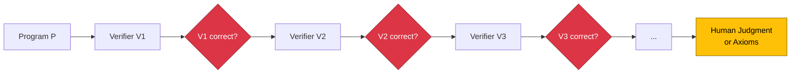

# The Physics of Code: Understanding Fundamental Limits in Computing (Part 2)

## Introduction: From Theory to Practice

In [Part 1 of this series](/blog/fundamental-limits-in-computing), we established the foundational concepts of computational limits: the distinction between fundamental and engineering limits, the four-tier computational hierarchy, formal complexity measures, and the intelligence-computability paradox. We explored why some problems that seem simple (like the halting problem) are mathematically impossible, while problems that seem to require sophisticated intelligence (like machine translation) are decidable.

**Now, in Part 2, we move from abstract theory to practical application.** This article explores how these fundamental limits manifest in daily engineering decisions, examines historical patterns showing that understanding constraints unleashes innovation, and connects computational limits to profound philosophical questions about logic, mathematics, and consciousness. We'll conclude with a practical framework you can use immediately to classify problems and make better engineering decisions.

:::info Article Series
This is **Part 2** of a two-part series. [Part 1](/blog/fundamental-limits-in-computing) covered the nature of limits, the computational hierarchy, complexity measures, and the intelligence-computability paradox. Part 2 explores practical applications, historical lessons, and philosophical foundations.
:::

{/* truncate */}

---

## Section 5: Specific Instances vs Universal Algorithms

Engineers often encounter this apparent paradox: "I can verify that 2+2=4 is correct. I can test this specific function works. Yet you claim complete automated verification is impossible?" **The resolution lies in understanding the crucial distinction between verifying specific instances and building universal verification algorithms.** This distinction, often misunderstood, is central to why testing samples behavior rather than proves correctness.

### The Apparent Contradiction

The confusion is natural:
1. **Observation**: "2+2=4 is definitely correct" ✓
2. **Extension**: "I can verify this simple program returns 4" ✓
3. **Generalization**: "Therefore computers can verify program correctness" ✗

The error occurs in step 3—confusing "can verify THIS program" with "can verify ALL programs."

### What IS Possible: Specific Verification

For any specific program instance, verification approaches exist:

**Direct execution**: Run the program and check output. For terminating programs with finite inputs, this works perfectly.

**Formal proof**: Prove properties of specific programs using mathematical logic. Tools like [Coq](https://coq.inria.fr/), [Isabelle](https://isabelle.in.tum.de/), and [TLA+](https://lamport.azurewebsites.net/tla/tla.html) enable this for carefully specified systems.

**Testing**: Execute program with sample inputs, verify outputs match expectations. Works for specific test cases.

**Type checking**: Verify syntactic properties (program structure) deterministically. This is why [type systems](https://en.wikipedia.org/wiki/Type_system) are so valuable—they check decidable properties.

All these approaches work for **specific instances**—individual programs or finite sets of test cases. The verification is bounded and concrete.

### What is NOT Possible: Universal Verification

[Rice's Theorem](https://en.wikipedia.org/wiki/Rice%27s_theorem) proves that no algorithm can verify arbitrary semantic properties for **all programs**:

**Universal correctness checker**: Cannot exist—would need to determine if arbitrary programs meet arbitrary specifications.

**Complete bug detector**: Cannot exist—would need to identify all possible semantic errors in arbitrary code.

**General halt checker**: Cannot exist (Turing's original proof)—would create self-referential contradiction.

**Program equivalence verifier**: Cannot exist—checking if two arbitrary programs compute the same function is undecidable.

The distinction is profound:

| Specific Instance Verification | Universal Algorithm Verification |
|-------------------------------|----------------------------------|
| Verify THIS program returns 4 | Verify ALL similar programs return correct results |
| Test THESE 1,000 inputs | Test ALL possible inputs |
| Check THIS loop terminates | Check ALL loops terminate |
| Prove THIS function meets spec | Prove ALL functions meet their specs |
| **Decidable for specific cases** | **Undecidable in general** |

:::info Connection to Rice's Theorem
As explored in my previous article, [Rice's Theorem](/blog/rices-theorem-why-automated-testing-will-fail) proves that all non-trivial [semantic properties](https://en.wikipedia.org/wiki/Semantics_(computer_science)) of programs are undecidable. This means ANY interesting behavioral property (correctness, termination, security) cannot be algorithmically verified for arbitrary programs.
:::

### The Infinite Regress Problem

Why can't we just verify the verifier? This leads to an infinite regress:

1. Write program P to solve your problem
2. Write verifier V₁ to check P is correct
3. How do you know V₁ is correct? Write verifier V₂ to check V₁
4. How do you know V₂ is correct? Write verifier V₃ to check V₂
5. This continues infinitely...

**Rice's Theorem says this chain cannot terminate with algorithmic certainty.** Eventually, you must ground verification in:
- Human judgment about specifications
- Axioms you accept without proof
- Testing that samples rather than proves



This isn't a weakness—it's the reality of verification. All formal systems ultimately rest on axioms accepted without proof ([Gödel's incompleteness](https://en.wikipedia.org/wiki/G%C3%B6del%27s_incompleteness_theorems)).

### Practical Implications

Understanding this distinction transforms engineering practice:

**Testing**: Embrace that testing samples behavior, providing confidence but not proof. Design test strategies that maximize coverage of likely failure modes, accepting you cannot test "everything."

**Formal verification**: Use for critical systems, but understand you're proving "program matches specification"—you cannot algorithmically verify the specification itself is what you want.

**Type systems**: Value them because they check decidable syntactic properties. They cannot verify semantic correctness but provide guarantees about program structure.

**Code review**: Essential because humans provide semantic judgment that tools cannot. Reviewers check "does this do what we actually want?"—a question tools cannot answer universally.

**AI-assisted development**: AI can verify specific patterns and suggest improvements, but cannot guarantee arbitrary programs meet arbitrary requirements. Use AI to augment judgment, not replace it.

**The difference between "this works" and "everything like this works" is the difference between possible and impossible.** Specific verification is practical and valuable; universal verification is mathematically impossible. Mature engineering acknowledges this boundary and works effectively within it.

---

## Section 6: Practical Engineering Implications & Historical Lessons

Understanding fundamental limits transforms from abstract theory into competitive advantage when applied to daily engineering decisions. **History shows that accepting limits doesn't constrain innovation—it focuses it toward breakthrough solutions.** Let's examine both the practical implications for modern engineering and the historical pattern of innovation emerging from constraint.

### Modern Engineering Applications

**Testing Strategy**: Embrace testing as confidence-building through strategic sampling, not proof. Design test suites that maximize coverage of likely failure modes. Combine unit tests (specific instances), property-based testing (random sampling), and human judgment about edge cases. Accept that 100% coverage ≠ 100% correctness.

**Code Review**: Value human review for semantic correctness while automating syntactic checks. Tools excel at finding style violations, known patterns, and structural issues (all decidable). Humans excel at asking "Does this solve the right problem?" and "Are these requirements correct?"—questions that involve undecidable semantic properties.

**AI-Assisted Development**: Use [AI coding assistants](https://github.com/features/copilot) to amplify human judgment, not replace it. AI excels at pattern matching, code completion, and generating options (all decidable tasks with "good enough" solutions). But AI cannot guarantee correctness or verify arbitrary specifications—these remain undecidable. Think of AI as a highly skilled assistant that requires supervision.

**Formal Verification**: Apply to critical systems (spacecraft, medical devices, financial transactions) but understand the scope. You're proving "code matches formal specification"—but the specification itself requires human judgment to ensure it captures true requirements. This is valuable but bounded.

**Tool Evaluation Red Flags**: Be skeptical of claims like "complete automated verification," "guaranteed bug-free," or "100% security assurance." These promise to solve undecidable problems. Realistic tools explicitly state their scope: "finds common memory errors" or "detects SQL injection vulnerabilities" (specific, bounded problems).

| Immature Engineering Mindset | Mature Engineering Mindset |
|------------------------------|----------------------------|
| "We need tools for 100% correctness" | "We need strategies for maximum confidence within constraints" |
| "This AI will solve testing forever" | "This AI improves testing within its decidable scope" |
| "Automate everything" | "Automate decidable tasks, apply judgment to undecidable" |
| "Pursue mathematical certainty" | "Build practical confidence through multiple approaches" |
| Frustrated by tool limitations | Understands which limitations are fundamental vs improvable |

### Historical Pattern: Limits Leading to Innovation

This pattern repeats across domains: understanding a fundamental limit catalyzes breakthrough innovation.

**Physics: The Light Speed Barrier**

- **Pre-1905**: Engineers pursued "faster than light" communication and travel
- **Einstein (1905)**: Proved c is fundamental—part of spacetime geometry
- **Result**: Instead of frustration, revolutionary innovations:
  - [GPS satellites](https://en.wikipedia.org/wiki/Global_Positioning_System) (accounting for relativistic time dilation—microseconds matter!)
  - Particle accelerators (approaching but never exceeding c, enabling particle physics)
  - Fiber optics (using light itself at maximum speed)
  - Nuclear energy (understanding E=mc²)
  - Modern cosmology (understanding universe expansion)

**Thermodynamics: Absolute Zero**

- **Pre-1900s**: Pursuit of reaching 0 K
- **Quantum mechanics**: Proved 0 K is asymptotically unreachable
- **Result**: Innovative applications emerge:
  - Achieved nanokelvin temperatures (billionths of degree above 0 K)
  - Discovered [superconductivity](https://en.wikipedia.org/wiki/Superconductivity) (zero electrical resistance)
  - Enabled [quantum computing](https://en.wikipedia.org/wiki/Quantum_computing) (requires near-absolute-zero conditions)
  - Developed Bose-Einstein condensates (new states of matter)

**Computing: Undecidability**

- **Pre-1936**: Assumption that all clear problems are algorithmically solvable
- **Turing (1936), Rice (1951)**: Proved halting problem and semantic properties undecidable
- **Result**: Pragmatic innovations within constraints:
  - [Type systems](https://en.wikipedia.org/wiki/Type_system) (decidable syntactic guarantees)
  - Unit testing frameworks (pragmatic sampling approaches)
  - [Formal methods](https://en.wikipedia.org/wiki/Formal_methods) (proof relative to specifications)
  - [Static analysis](https://en.wikipedia.org/wiki/Static_program_analysis) (sound approximations for specific properties)
  - Specification-driven development (human-grounded semantics)

**The Pattern**:

| Phase | Behavior | Outcome |
|-------|----------|---------|
| **Before understanding limit** | Waste resources trying impossible | Frustration, slow progress |
| **Denial phase** | Claim breakthroughs that violate limits | Disappointment, credibility loss |
| **Acceptance phase** | Work creatively within constraints | Innovation explosion, real breakthroughs |

:::note Core Insight
**Every time humanity has understood a fundamental limit, it has led to an explosion of innovation within that limit—not stagnation.** Constraints focus effort on achievable goals, paradoxically unleashing creativity rather than constraining it.
:::

### Decision Framework for Daily Engineering

Here's a practical framework for applying this understanding:

```
1. Can the property be checked syntactically?
   Yes → Automate fully (type checking, linters, formatters)
   
2. Is it a semantic property with bounded scope?
   Yes → Formal methods + comprehensive testing
   
3. Is it a general semantic property?
   Yes → Accept sampling approaches + human judgment
   
4. Is it beyond formalization (aesthetics, meaning)?
   Yes → Require human expertise, use AI to surface options
```

**Project Planning**: When scoping projects, classify tasks by tier. Automate Tier 1 fully. For Tier 2, budget for heuristics and "good enough." For Tier 3, include human review cycles. For Tier 4, ensure expert involvement throughout.

**Architecture Decisions**: Design systems acknowledging that complete verification is impossible. Build in redundancy, graceful degradation, monitoring, and human oversight for critical paths. Don't architect as if perfect automated verification is achievable.

**Team Building**: Value engineers who understand limits—they set realistic goals, evaluate tools critically, and deliver on promises rather than overpromising. This is a sign of professional maturity.

**Understanding what's impossible frees you to focus energy on what's achievable and valuable.**

---

## Section 7: Philosophical Foundations and Practical Empowerment

The computational limits we've explored aren't arbitrary technical constraints—they emerge from the deepest questions in logic, mathematics, and the nature of computation itself. **Understanding these philosophical foundations reveals why limits are eternal and how they paradoxically empower rather than constrain engineering.**

### The Philosophical Bedrock

**[Gödel's Incompleteness Theorems](https://en.wikipedia.org/wiki/G%C3%B6del%27s_incompleteness_theorems) (1931)**: Kurt Gödel proved that any consistent formal system strong enough to express arithmetic contains true statements it cannot prove. His second theorem shows no consistent system can prove its own consistency. This applies to all mathematical systems—even mathematics has unprovable truths.

**Connection to computing**: Gödel's result predates modern computing but applies directly. Just as formal systems cannot prove all truths, algorithms cannot decide all properties. The self-referential techniques Gödel used (constructing statements that refer to themselves) parallel Turing's diagonal argument for the halting problem.

**[Church-Turing Thesis](https://en.wikipedia.org/wiki/Church%E2%80%93Turing_thesis) (1936)**: Alonzo Church and Alan Turing independently defined "effective computability" as what [Turing machines](https://en.wikipedia.org/wiki/Turing_machine) can compute. This isn't a theorem but a definition that has held for 90 years across all proposed models of computation. It defines what "algorithm" means.

**Implication**: Even quantum computers don't exceed Turing computability—they solve some problems faster but cannot solve undecidable problems. The Church-Turing boundary appears to be a fundamental property of computation itself.

**The Self-Reference Theme**: All these limits involve self-reference creating logical impossibility:
- **Gödel**: "This statement is unprovable in this system"
- **Turing/Halting**: "Does this program that checks halting say I halt?"
- **Rice's Theorem**: "Does this algorithm correctly identify program properties?"

Self-reference creates paradoxes that cannot be resolved algorithmically, revealing the boundaries of formal systems.

### From Theory to Empowerment

Here's the counter-intuitive truth: **knowing what's impossible is liberating, not limiting**. Understanding boundaries focuses effort on achievable goals, yielding greater effectiveness than chasing impossible ones.

**The Empowerment Pattern**:

1. **Clarity of focus**: Stop wasting resources on mathematically impossible goals
2. **Strategic allocation**: Invest in approaches that can work within proven constraints
3. **Realistic expectations**: Set achievable goals, build trust by delivering
4. **Creative solutions**: Working within constraints drives innovation
5. **Competitive advantage**: Understanding limits others don't gives strategic edge

**Real-world examples across domains**:

- **Cannot exceed light speed** → GPS (relativistic corrections), fiber optics (using light itself), particle physics (approaching c)
- **Cannot reach absolute zero** → Achieved nanokelvin temperatures, superconductivity, quantum computing
- **Cannot solve halting problem** → Type systems, testing frameworks, formal methods, pragmatic verification

**Professional maturity indicator**:
- **Junior mindset**: "This tool should do X" (without understanding if X is possible)
- **Senior mindset**: "This tool does Y within scope Z; X is fundamentally impossible because [mathematical reason]"

### A Practical Classification Framework

To make all this actionable, here's a multi-dimensional framework for classifying any computational problem you encounter:

**Framework Dimensions**:
1. **Formalizability** (0.0-1.0): Can we define it precisely?
2. **Decidability** (Yes/No/Unknown): Does an algorithm exist?
3. **Time Complexity** (O(n), O(2ⁿ), ∞): How long does it take?
4. **Answer Objectivity** (0.0-1.0): Is there a unique correct answer?
5. **Automation Potential** (0.0-1.0): How much can be automated?

**Example classifications**:

| Problem | Formalizable | Decidable | Complexity | Objective | Automation | Strategy |
|---------|--------------|-----------|------------|-----------|------------|----------|
| **Arithmetic (2+2)** | 1.0 | Yes | O(1) | 1.0 | 1.0 | Fully automate |
| **Sorting** | 1.0 | Yes | O(n log n) | 1.0 | 1.0 | Fully automate |
| **TSP (exact)** | 1.0 | Yes | O(2ⁿ) | 1.0 | 0.5 | Use heuristics |
| **Translation** | 0.7 | Yes | O(n) | 0.4 | 0.6 | AI + human review |
| **Halting problem** | 1.0 | No | ∞ | 1.0 | 0.0 | Sample specific cases |
| **Code beauty** | 0.2 | No | N/A | 0.1 | 0.1 | Require human judgment |

**Using the framework**:

```
Step 1: Can you formalize it precisely?
  No → Tier 4: Human expertise required

Step 2: Is it decidable?
  No → Tier 3: Sampling + human judgment

Step 3: What's the time complexity?
  Polynomial → Tier 1: Fully automate
  Exponential → Tier 2: Heuristics or accept limits

Step 4: How objective is the answer?
  Low objectivity → Require human judgment even if decidable
  High objectivity → Can automate if complexity allows
```

**Practical applications**:
- **Project planning**: Classify tasks → set realistic timelines
- **Tool evaluation**: Match tool capabilities to problem tiers
- **Team allocation**: Experts for high-judgment problems, automation for decidable ones
- **Architecture**: Design acknowledging which components need human oversight

**This framework turns abstract theory into practical decision-making guidance—know your problem's profile to choose the right strategy.**

---

## Conclusion: Engineering Maturity in the Face of Immutable Laws

We began with a parallel: Einstein proved you cannot exceed the speed of light; Turing proved you cannot solve the halting problem. Both are eternal mathematical truths embedded in the structure of reality and computation. **These aren't temporary engineering challenges awaiting better tools—they're fundamental laws as immutable as physical constants.**

Through this two-part journey, we've seen that computational problems occupy a rich hierarchy from the trivially computable to the fundamentally unformalizable, with mathematically sharp boundaries between tiers. We've explored how "hard for intelligence" differs from "impossible for algorithms," why we can verify specific instances but not build universal verifiers, and how understanding these limits transforms daily engineering decisions.

The practical implications are profound. Understanding these boundaries transforms tool evaluation, testing strategy, code review practices, and architectural decisions. When vendors promise "complete automated verification," you now recognize this as claiming to solve undecidable problems—a mathematical impossibility, not merely a difficult engineering challenge.

**But here's the empowering reality**: every time humanity has understood a fundamental limit, innovation has exploded rather than stagnated. Physicists accepting the light speed barrier gave us GPS, fiber optics, and particle physics. Engineers accepting undecidability gave us type systems, pragmatic testing frameworks, and specification-driven development. **Constraints don't limit innovation—they focus it.**

History teaches a clear pattern: those who deny limits waste resources on impossible goals; those who understand limits work brilliantly within them, achieving breakthroughs that ignorance could never find. The best engineers aren't those who ignore boundaries—they're those who understand them deeply and leverage that understanding for competitive advantage.

### Your Path Forward

Here's what understanding fundamental limits enables:

**Audit your assumptions**: Review what you believe is "possible" versus "just hard." Question claims of complete automation or guaranteed correctness—they're often conflating decidable with undecidable problems.

**Evaluate tools realistically**: Ask "Does this tool work within fundamental limits?" Tools claiming to overcome Rice's theorem are selling impossibility. Realistic tools explicitly state their scope and limitations.

**Build strategic confidence**: Accept that testing samples, verification proves relative to specifications, and human judgment remains essential for semantic properties. Build confidence through multiple complementary approaches rather than seeking single algorithmic proof.

**Share understanding**: Educate teams about fundamental versus engineering limits. This shared knowledge prevents overpromising, sets realistic goals, and builds institutional maturity.

**Focus energy wisely**: Invest in what's achievable within mathematical constraints. Automate decidable tasks fully. Use heuristics for intractable problems. Accept sampling for undecidable properties. Reserve human expertise for meaning and judgment.

The framework, patterns, and distinctions you've gained aren't academic curiosities—they're practical tools for better engineering. When you encounter a problem, classify it: Which tier? Decidable or undecidable? What's the right strategy? This clarity alone makes you more effective.

**The boundaries of computation aren't arbitrary technical limitations—they're fundamental properties of logic itself, connecting to the deepest questions about mathematics, meaning, and mind.** Understanding them doesn't make you a limited engineer; it makes you a mature one who delivers results rather than chasing impossible dreams.

As you return to your code, your architecture decisions, your team discussions—carry this understanding: **The best engineers aren't those who ignore limits. They're those who understand them deeply and work brilliantly within them.** In that understanding lies not constraint, but profound empowerment.

The physics of code is as real as the physics of matter. The speed of light isn't a challenge to overcome—it's a law to understand and work within. So too with computational limits. In accepting them, we find not defeat, but the focused clarity that enables true mastery.

---

**← Read [Part 1: Foundations and Theory](/blog/fundamental-limits-in-computing)** | **Series Complete**
