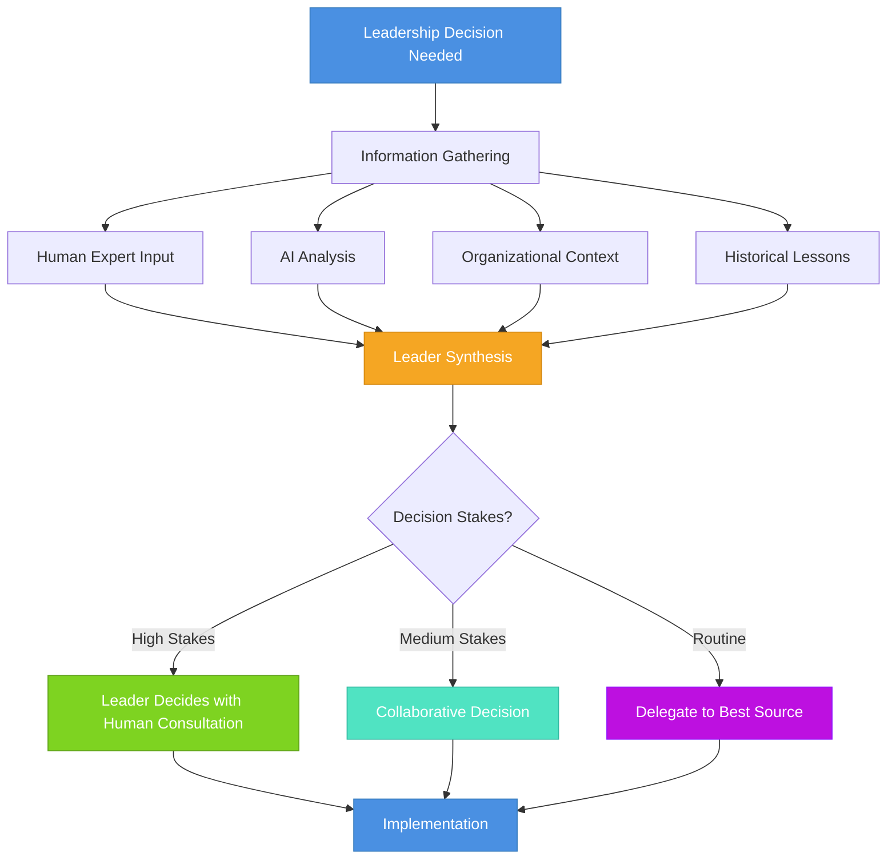

<!-- 
IMPORTANT: Date consistency check
- Filename: 2025-10-09-ai-leadership-from-tool-to-collaborative-partner.mdx
- Frontmatter date: 2025-10-09
- These MUST match exactly for proper blog functionality
- AI agents: Always verify date alignment when editing
-->

The first time an AI system disagreed with my architectural decision and turned out to be right, I realized something fundamental had changed—not about AI, but about what leadership means. This wasn't a story about better technology; it was about how my role as a leader needed to evolve. The skills that made me effective in leading human teams weren't suddenly obsolete, but they required significant adaptation when AI became part of the equation.

If you're a tech leader today, you've likely felt this tension. As [research shows](/blog/ai-productivity), AI's impact on productivity is real but nuanced—it's not a silver bullet that solves all problems automatically. You know the traditional leadership skills that matter: [technical depth, business domain knowledge, interpersonal skills, and political navigation](/blog/architect-essential-skills). These haven't disappeared. But **AI introduces a new dimension where these skills must expand and adapt**. You're no longer just leading people or directing tools; you're orchestrating a hybrid environment where human judgment, traditional management wisdom, and AI capabilities need to work in harmony.

{/* truncate */}

The question isn't "how do I use AI tools?" but rather "how do my leadership skills need to evolve when my team includes both humans and AI systems?" This is fundamentally about leadership adaptation, not technical transformation. While understanding [how AI systems work](/blog/context-engineering) helps, the core challenge is applying timeless leadership principles in a new context where AI systems participate alongside your human team members.

In this article, we'll explore how classic leadership skills translate and evolve in the AI era. We'll examine what remains constant, what needs adaptation, and what new capabilities leaders must develop—always keeping humans at the center. Whether you're a CTO navigating organizational change, an engineering manager building cohesive teams, or a tech lead figuring out daily collaboration patterns, understanding this evolution will make you more effective in leading people in AI-augmented environments.

Let's start by understanding how traditional leadership skills map to today's challenges.

## Traditional Leadership Skills That Endure

Before exploring what changes, let's ground ourselves in what remains essential. Several core leadership capabilities endure regardless of AI:

**Technical Depth and Breadth**: Leaders still need strong technical foundations. You must understand your domain deeply enough to make sound decisions, evaluate trade-offs, and earn your team's respect. AI doesn't replace this—if anything, it makes technical judgment more critical because you're now evaluating both human and AI contributions.

**Business Domain Knowledge**: Understanding what your organization does, why it matters, and how technology serves business goals remains paramount. AI tools don't possess this organizational context; leaders must provide it. Your ability to translate between business needs and technical solutions is even more valuable when AI systems need proper framing.

**Interpersonal Skills**: The human elements of leadership—building trust, communicating clearly, resolving conflicts, motivating teams—are unchanged by AI. In fact, they become more important. When introducing AI into team workflows, you need strong interpersonal skills to address concerns, build confidence, and maintain team cohesion.

**Political Navigation**: Understanding organizational dynamics, managing stakeholder relationships, and navigating competing interests remain essential leadership skills. AI adoption often creates political tensions (resource allocation, job security concerns, power dynamics), making this skill even more critical.

These traditional skills form your foundation. But AI doesn't just add new tools—it creates a new context where these skills must be applied differently.

## How Leadership Skills Must Adapt

The core leadership skills endure, but their application evolves significantly in AI-augmented environments. Let's examine how each traditional capability must adapt:

### Technical Leadership: From Pure Expertise to Capability Orchestration

**Traditional approach**: Technical leaders demonstrated deep expertise in specific domains. You were the go-to expert who could solve the hardest problems, review the most complex code, and make definitive technical decisions. Your authority came from being the most knowledgeable person in the room.

**AI-era evolution**: Technical leadership becomes about **orchestrating diverse capabilities**—human expertise, AI analysis, and hybrid approaches. You're not trying to outperform AI at pattern matching or outthink your senior engineers at system design. Instead, you're deciding when to leverage AI's pattern recognition, when to trust human intuition, and how to synthesize both effectively.

| Aspect | Traditional Technical Leadership | AI-Era Technical Leadership |
|--------|----------------------------------|------------------------------|
| **Authority Source** | Deepest technical knowledge | Judgment about capability deployment |
| **Decision Making** | Expert makes final call | Orchestrates input sources appropriately |
| **Problem Solving** | Leader solves hardest problems | Leader routes problems to best solver (human or AI) |
| **Value Add** | Technical expertise | Integration and synthesis of diverse inputs |
| **Team Dynamic** | Leader as technical authority | Leader as capability coordinator |

This doesn't diminish the need for technical skills—it elevates the importance of judgment about when and how to apply them. As explored in [my analysis of agile team practices](/blog/agile-team-practices), effective leadership has always been about knowing when to step in vs. delegate. AI just expands your delegation options.

### Communication: From Clarity to Multi-Audience Adaptation

**Traditional approach**: Effective leaders communicate clearly with humans—adapting message, tone, and detail for different audiences (executives vs. engineers, technical vs. non-technical). You mastered the soft skill of explaining complex technical concepts to non-technical stakeholders.

**AI-era evolution**: Communication now requires **multi-audience adaptation** where some of your "audience" is AI systems that need structured input, while most is still humans needing empathy and context. You're explaining technical decisions to executives, motivating your human team, AND providing clear parameters to AI systems—all requiring different communication approaches.

The interpersonal skills that made you effective with humans remain critical—perhaps more so. When your team feels uncertain about AI's role, your ability to listen, empathize, and address concerns becomes paramount. When AI makes a recommendation, your human communication skills help the team understand and evaluate it appropriately.

### Decision Making: From Authority to Synthesis

**Traditional approach**: Leaders gathered input, applied judgment, and made decisions. You were accountable for outcomes, and your team looked to you for direction. The decision-making process was relatively straightforward: collect information, analyze options, decide, communicate.

**AI-era evolution**: Decision making becomes an exercise in **synthesis across different input types**. You're still accountable (that never changes), but now you're integrating:
- Human expertise and intuition
- Historical patterns and lessons learned (human memory)
- AI-generated analysis and recommendations
- Organizational context that only humans understand
- Stakeholder concerns and political realities

Your leadership judgment determines which inputs to weight more heavily in different contexts. For architectural decisions with long-term implications, organizational context and human judgment may dominate. For code style consistency, AI pattern matching might be definitive. The skill is knowing the difference.

### Trust Building: From Interpersonal to Multi-Source Calibration

**Traditional approach**: Building trust meant being reliable, transparent, and competent in human relationships. Your team trusted you because you demonstrated consistency, admitted mistakes, and had their backs. Trust was fundamentally interpersonal—between you and your team members.

**AI-era evolution**: Trust building now includes **calibrating trust across different sources**. You still need strong interpersonal trust with your human team (that's non-negotiable). But you also need to develop and communicate frameworks for when to trust AI recommendations, when to be skeptical, and how to verify. This isn't about trusting AI like you trust a person—it's about having clear, explicit criteria for reliability in different contexts.

| Decision Type | Primary Trust Source | Verification Approach | Reasoning |
|---------------|---------------------|----------------------|-----------|
| **Architectural Strategy** | Human expertise | AI for blind spots | Requires deep organizational context |
| **Code Quality Patterns** | AI analysis | Human review for edge cases | AI excels at consistency checking |
| **Team Dynamics** | Human judgment | N/A | Fundamentally human domain |
| **Performance Optimization** | AI initial analysis | Human strategic decisions | AI finds issues, humans prioritize |
| **Requirements Interpretation** | Human understanding | AI for completeness check | Requires stakeholder empathy |
| **Security Concerns** | Human accountability | AI for pattern detection | High stakes require human ownership |

Your interpersonal skills help your team navigate this trust calibration. When someone questions an AI recommendation, your response shapes team culture. Do you shut down the concern or use it as a teaching moment about appropriate trust calibration?

## New Leadership Capabilities for the AI Era

Beyond adapting traditional skills, AI-augmented leadership requires developing some genuinely new capabilities—all focused on leading humans more effectively in this new context:

### Capability Pattern Recognition

Leaders need to develop intuition about **when different capabilities (human or AI) fit different problems**. This isn't about technical AI knowledge—it's about leadership judgment applied to a broader set of resources.

- Recognize when a problem needs human empathy, creativity, or organizational context
- Identify when AI pattern matching or analysis adds value
- Understand when hybrid approaches (humans + AI) outperform either alone
- Know your team members' strengths relative to AI capabilities

This is fundamentally a human leadership skill—knowing your people, understanding problems deeply, and making good matches. AI just expands the range of capabilities you're matching against.

### Transparent Decision Frameworks

In traditional leadership, decision-making processes could remain somewhat implicit—experienced leaders developed intuition that team members learned to trust. With AI in the mix, **explicit decision frameworks** become essential.

Your team needs clarity on:
- When and why you rely on AI analysis vs. human judgment
- How you weight different inputs in various situations
- What verification you require before acting on AI recommendations
- How accountability works when AI is involved

This transparency isn't just about AI—it's about good leadership. Making your thinking visible helps your team learn, builds trust, and creates consistency. It's the same principle that applies to explaining technical decisions to non-technical stakeholders, but now extended to explaining your decision-making process to your entire team.

### Adaptive Team Structuring

Traditional team structures assumed relatively stable roles and responsibilities. AI introduces **dynamic capability requirements** that make rigid structures less effective.

Instead of static assignments ("Alice owns frontend, Bob owns backend, AI reviews PRs"), effective leaders create fluid structures where:
- Humans take lead on problems requiring creativity, empathy, or deep organizational context
- AI augments human work on pattern-heavy, consistency-focused tasks  
- The team collaborates to determine optimal approaches for new challenges
- Roles adapt based on problem characteristics, not just job titles

This requires strong interpersonal skills to build psychological safety. Team members need to feel comfortable saying "AI might be better at this part" without feeling diminished, or "I don't trust this AI recommendation because..." without feeling behind the times.

### Continuous Learning Culture

The pace of AI capability evolution means **what worked yesterday might not be optimal tomorrow**. Leaders must foster cultures where:
- The team experiments with AI assistance and shares learnings
- Failures with AI integration are treated as learning opportunities
- Success patterns are documented and propagated
- Everyone (including you) maintains a learning mindset

This isn't new—good leaders have always fostered learning cultures. But the pace and stakes are higher with AI. As explored in [recent analysis of AI's transformative potential](/blog/llms-industrial-revolution), we're potentially at an inflection point where AI could reshape entire industries. Your interpersonal skills and ability to create psychological safety become even more critical in helping your team navigate this rapid change.

## Putting It Together: Leadership in Practice

Let's ground this in a concrete scenario. Imagine your team is debating a database schema decision for a new microservice:

**Traditional leadership approach**: You'd gather your senior engineers, discuss trade-offs, perhaps make the decision yourself or delegate to your database expert, then communicate the decision and rationale.

**AI-augmented leadership approach**: 
1. **Frame the problem** for both humans and AI: clearly articulate business requirements, technical constraints, and success criteria
2. **Leverage diverse capabilities**: 
   - AI analyzes existing codebase patterns and identifies consistency issues
   - Senior engineers evaluate architectural implications and maintenance concerns
   - Team members who'll implement it assess practical usability
3. **Facilitate synthesis**: Help the team understand what AI found (and didn't find), integrate human expertise about organizational context, and discuss trade-offs openly
4. **Make the decision** based on appropriate weighting: maybe AI's consistency analysis is definitive for some aspects, but human judgment about team capability and maintenance burden dominates the final call
5. **Document the reasoning**: Be explicit about what inputs you weighted heavily and why, creating a learning artifact for future decisions

Notice what matters here: **Your traditional leadership skills are essential throughout**. Technical depth lets you understand the trade-offs. Interpersonal skills enable effective discussion. Political awareness helps you consider organizational implications. Business knowledge frames the decision properly.

AI doesn't replace any of this—it adds another input to synthesize. Your leadership judgment determines how to integrate it effectively while keeping humans at the center.

## The Human Center Remains

Despite all this discussion of AI, let's be crystal clear: **leadership remains fundamentally about people**. The skills that matter most are still the ones that make you effective with humans:

- **Building trust** through reliability, transparency, and having your team's back
- **Communicating effectively** by adapting to your audience and listening actively  
- **Making sound decisions** by understanding context and accepting accountability
- **Navigating complexity** through technical depth and organizational awareness
- **Fostering growth** by creating learning opportunities and psychological safety

These haven't changed. AI just creates a new context where you apply them.

Your team looks to you not to be an AI expert, but to be an effective leader who helps them succeed in an AI-augmented world. That means:
- Protecting them from AI hype and unrealistic expectations
- Creating clarity about roles and responsibilities
- Building confidence in navigating this transition
- Demonstrating that their human judgment, creativity, and expertise remain valuable
- Making them more effective, not replaced

The most important leadership skills are often non-technical—the ability to build relationships, communicate vision, and create environments where people thrive. The same holds for AI-era leadership: the most important adaptations are in how you apply your human leadership skills, not in becoming more technical about AI.

## Practical Next Steps

If you're a leader navigating this transition, here's where to focus:

**Strengthen your foundation**: Ensure you're solid on core leadership skills—technical depth, business knowledge, interpersonal effectiveness, and political navigation. These matter more than ever in an AI-augmented environment.

**Build transparency**: Start making your decision-making process more explicit with your team. When you rely on AI analysis, explain why and how you verified it. When you override AI recommendations, share your reasoning. This builds trust and helps your team learn.

**Create space for honest dialogue**: Use your interpersonal skills to foster conversations about AI's role. Let team members express concerns, excitement, or confusion. Your openness shapes team culture around this transition.

**Learn from experience**: As [research shows](/blog/ai-productivity), AI's benefits are highly contextual and depend on how teams integrate it into their workflows. Frame AI adoption as a team learning journey, not a top-down mandate. Try approaches, review outcomes, adjust. Your willingness to learn alongside your team strengthens trust and psychological safety.

**Keep humans central**: Remind yourself and your team that this is about making people more effective, not replacing them. Your leadership should amplify human capabilities, not diminish human confidence.

The leaders who thrive in this transition won't be the most technical about AI or the quickest to adopt every new tool. They'll be those who apply timeless leadership skills—technical judgment, clear communication, trust building, and political awareness—to a new context while keeping humans at the center of everything they do.

As we navigate this evolution together, remember: **leadership is still about people**. AI is just another variable in the complex equation of building effective teams, making sound decisions, and delivering value. Your core responsibility hasn't changed—help your people succeed. The skills that made you effective before are still your foundation; they just need thoughtful adaptation for today's reality.

## The Paradigm Shift: From Tool to Partner

To understand why AI requires a fundamental leadership transformation, we need to first recognize how traditional tool adoption works—and why AI breaks that model entirely.

**Traditional tool adoption follows a predictable pattern**: Leaders evaluate tools, make procurement decisions, teams learn to operate them, and work processes adapt around the tool's capabilities. The tool augments human capabilities but doesn't participate in decision-making. A code editor makes you faster at writing code, but it doesn't suggest architectural patterns. Version control manages code history, but it doesn't review your pull request logic. CI/CD automates deployment, but it doesn't decide release strategy. The human remains firmly in control, using the tool to amplify their own judgment and execution.
