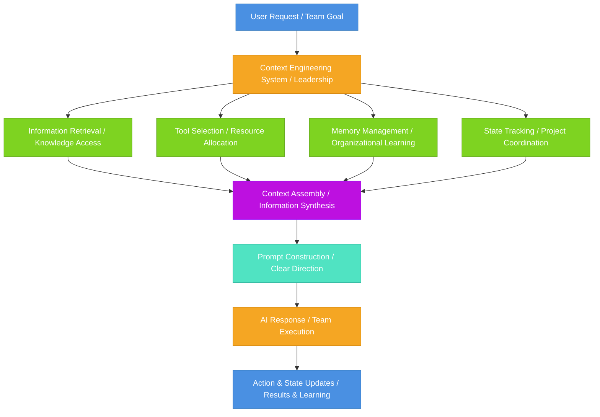
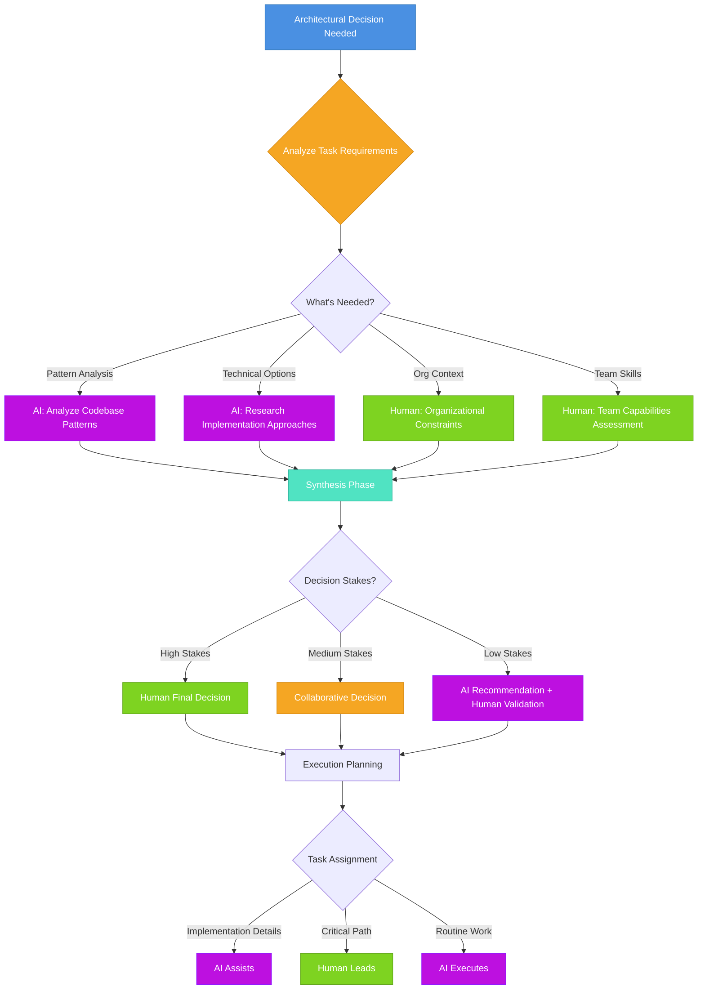

<!-- 
IMPORTANT: Date consistency check
- Filename: 2025-10-09-ai-leadership-from-tool-to-collaborative-partner.mdx
- Frontmatter date: 2025-10-09
- These MUST match exactly for proper blog functionality
- AI agents: Always verify date alignment when editing
-->

The first time an AI system disagreed with my architectural decision and turned out to be right, I realized I wasn't managing a tool anymore—I was collaborating with a partner. The recommendation came from an AI agent analyzing our codebase patterns, and it suggested a different approach to our database schema that I initially dismissed. But when I dug deeper, the AI had identified subtle consistency issues across our services that I'd missed. That moment crystallized something I'd been feeling but couldn't quite articulate: **AI has fundamentally shifted from being a tool we use to a partner we collaborate with**.

If you're a tech leader today, you've likely felt this tension. AI is clearly transformative—[GitHub Copilot](https://github.com/features/copilot) reports show significant productivity gains, [Notion AI](https://www.notion.so/product/ai) reshapes how teams work, and ChatGPT has become ubiquitous in software development. But existing management frameworks built for human-only teams don't quite fit anymore. You know you should "embrace AI," but what does that actually mean for how you lead? How do you make decisions when AI is participating in the conversation? How do you build trust with systems that evolve and learn? How do you structure teams that include both human and AI capabilities?

{/* truncate */}

The challenge isn't just learning new AI tools—it's that **traditional leadership paradigms break down when AI becomes a collaborative partner**. Command-and-control approaches that worked for tools fail when AI systems have their own decision-making logic. Delegation strategies designed for human team members don't translate directly to AI capabilities. Communication patterns optimized for human understanding may not work well for AI collaboration. The shift from "learning to use AI tools" to "learning to collaborate with AI systems" requires fundamentally rethinking leadership approaches.

Here's what makes this transformation different from previous technology adoptions: **AI doesn't just augment our capabilities—it changes how we think, decide, and collaborate**. When you integrate an IDE or version control system, your leadership approach stays largely the same. But when AI participates in architectural decisions, code reviews, and strategic planning, leadership itself transforms. You're no longer just directing humans using tools; you're orchestrating a hybrid team where AI and humans each bring different strengths, constraints, and ways of working.

The key insight is that **understanding how AI systems actually work isn't optional technical knowledge anymore—it's fundamental to effective leadership**. Concepts like [context engineering](/blog/context-engineering), prompt orchestration, memory management, and retrieval-augmented generation aren't just implementation details for engineers. They're operational frameworks that directly inform how you should structure information flow, manage team knowledge, calibrate trust, and make collaborative decisions. As [LangChain points out](https://blog.langchain.com/the-rise-of-context-engineering/), context engineering represents building dynamic systems to provide the right information and tools at the right time—and that's exactly what leadership is about too.

In this article, we'll explore how technical AI concepts directly inform leadership practices. We'll examine the fundamental paradigm shift from tool to partner, bridge core technical concepts like context engineering and prompt orchestration to concrete leadership applications, and provide practical frameworks for trust calibration, communication patterns, and decision-making in AI-augmented teams. Whether you're a CTO navigating organizational AI adoption, an engineering manager building hybrid teams, or a tech lead figuring out how to work effectively with AI, understanding these connections will transform how you lead.

Let's start by understanding what makes AI partnership fundamentally different from tool adoption—and why it matters for leadership.

## The Paradigm Shift: From Tool to Partner

To understand why AI requires a fundamental leadership transformation, we need to first recognize how traditional tool adoption works—and why AI breaks that model entirely.

**Traditional tool adoption follows a predictable pattern**: Leaders evaluate tools, make procurement decisions, teams learn to operate them, and work processes adapt around the tool's capabilities. The tool augments human capabilities but doesn't participate in decision-making. A code editor makes you faster at writing code, but it doesn't suggest architectural patterns. Version control manages code history, but it doesn't review your pull request logic. CI/CD automates deployment, but it doesn't decide release strategy. The human remains firmly in control, using the tool to amplify their own judgment and execution.

This model worked for decades because tools were fundamentally passive instruments. As explored in [my analysis of agile team practices](/blog/agile-team-practices), traditional leadership focused on coordinating human effort, managing information flow, and making decisions based on team input. Tools existed in the background, supporting but not participating in the core work of thinking, deciding, and collaborating.

**AI fundamentally breaks this model because it participates in decision-making, not just execution**. When GitHub Copilot suggests a code implementation, it's not just autocompleting text—it's proposing architectural choices based on learned patterns. When an AI system reviews your database schema, it's not just checking syntax—it's evaluating design consistency against patterns it's learned from thousands of projects. When Notion AI helps plan a project, it's not just organizing information—it's actively shaping strategy based on context and learned best practices.

Here's the fundamental difference visualized:

```mermaid
graph TD
    subgraph "Traditional Tool Model"
        A1[Leader Decision] --> B1[Team Execution]
        B1 --> C1[Tool Augmentation]
        C1 --> D1[Output]
        style A1 fill:#4A90E2,stroke:#357ABD,color:#fff
        style B1 fill:#7ED321,stroke:#5FA319,color:#fff
        style C1 fill:#F5A623,stroke:#D68910,color:#fff
        style D1 fill:#50E3C2,stroke:#35B9A2,color:#fff
    end
    
    subgraph "AI Partnership Model"
        A2[Leader Context] --> B2[AI Analysis]
        A2 --> C2[Team Input]
        B2 --> D2[Collaborative Decision]
        C2 --> D2
        D2 --> E2[AI Execution]
        D2 --> F2[Human Execution]
        E2 --> G2[Enhanced Output]
        F2 --> G2
        style A2 fill:#4A90E2,stroke:#357ABD,color:#fff
        style B2 fill:#BD10E0,stroke:#9012FE,color:#fff
        style C2 fill:#7ED321,stroke:#5FA319,color:#fff
        style D2 fill:#F5A623,stroke:#D68910,color:#fff
        style E2 fill:#BD10E0,stroke:#9012FE,color:#fff
        style F2 fill:#7ED321,stroke:#5FA319,color:#fff
        style G2 fill:#50E3C2,stroke:#35B9A2,color:#fff
    end
```

Notice how the information flow transforms. In the traditional model, it's linear: leader decides, team executes, tool amplifies. In the AI partnership model, it's collaborative: leader provides context, AI analyzes alongside human input, decisions emerge from synthesis, and both AI and humans execute their respective strengths.

**This paradigm shift requires fundamental changes in leadership approach**:

| Dimension | Tool Mindset | Partner Mindset |
|-----------|-------------|-----------------|
| **Decision-Making** | Leader decides, tool executes | Leader and AI collaborate on decisions, each bringing different perspectives |
| **Information Flow** | One-way: leader → team → tool | Bidirectional: leader ↔ AI ↔ team with shared context |
| **Trust Model** | Binary: tool works or doesn't | Graduated: trust calibrated based on domain, stakes, validation needs |
| **Communication** | Human-optimized only | Structured for both human understanding and AI interpretation |
| **Failure Mode** | Tool breaks, switch to manual | AI makes imperfect decisions, require judgment about when/how to trust |
| **Skill Requirements** | Learn tool operation | Understand AI capabilities, constraints, and collaboration patterns |
| **Evolution** | Static: tool behavior predictable | Dynamic: AI systems learn and improve, requiring ongoing calibration |

The tool mindset treats AI as something you direct completely. The partner mindset recognizes AI as a system with its own decision-making logic that you collaborate with. This isn't just semantic—it has profound implications for daily leadership.

Consider a practical scenario: Your team is debating a microservices architecture decision. In the tool mindset, you might ask AI to "generate service diagram options" and then you decide. In the partner mindset, you provide AI with your constraints and requirements, let it analyze your existing codebase patterns, consider its recommendations alongside team expertise, discuss trade-offs collaboratively, and make informed decisions that synthesize AI insights with human judgment about organizational context.

**The partnership paradigm changes what "effective leadership" means**. You can't just tell AI what to do and expect optimal results—you need to understand how it thinks, what context it needs, when its recommendations are reliable, and how to calibrate trust appropriately. As highlighted in [my exploration of context engineering](/blog/context-engineering), "memory transforms AI from tools you use into systems that evolve with you." This isn't metaphorical—it's operational reality that leaders must understand and work with.

The leaders who thrive in AI-augmented environments won't be those who simply "use AI tools more." They'll be those who fundamentally reconceive leadership as orchestrating hybrid human-AI capabilities, who understand enough about how AI systems work to collaborate effectively, and who build explicit frameworks for trust, communication, and decision-making in partnership contexts.

But what does that actually mean in practice? To answer that, we need to understand the technical foundations of how AI systems work—and why that understanding transforms leadership.

## Technical Foundations That Transform Leadership

The most effective AI-augmented leaders aren't necessarily the most technical—but they understand core AI concepts at sufficient depth to apply them as leadership frameworks. These aren't just metaphors; they're operational principles that directly inform how you should structure information, manage context, calibrate trust, and make decisions.

**Context Engineering: The Art of Information Orchestration**

At its core, [context engineering](/blog/context-engineering) is about building dynamic systems to provide the right information and tools in the right format so AI can effectively accomplish tasks. As [LangChain emphasizes](https://blog.langchain.com/the-rise-of-context-engineering/), "context engineering represents a paradigm shift from simple prompt crafting to building sophisticated systems that dynamically provide AI models with everything they need."

Here's why this matters for leadership: **Just as AI systems need carefully orchestrated context to perform well, teams need structured information flow to work effectively**. The principles that make AI systems successful directly parallel what makes teams successful.

Consider what this means practically. When an AI system has a limited context window (say, 128K tokens), it forces explicit decisions about what information matters most. As a leader, you face similar constraints—your team's cognitive capacity, meeting time, communication bandwidth. Understanding context window limitations teaches you to be ruthlessly explicit about what context actually matters for decisions.

:::tip Context-Aware Leadership
The principle of **context-aware leadership** means explicitly managing what information your team has access to, when they have it, and in what format—just as context engineering manages information flow to AI systems. Don't assume shared understanding; build systems to ensure critical context reaches the right people at the right time.
:::

**RAG: Dynamic Knowledge Access**

[Retrieval-Augmented Generation (RAG)](/blog/context-engineering) revolutionized AI by enabling systems to dynamically retrieve relevant information rather than relying solely on training data. Instead of trying to encode everything into the model, RAG systems retrieve what's needed when it's needed.

The leadership parallel is profound. Traditional leadership often assumes leaders must "know everything" or maintain all organizational knowledge in their heads. **RAG patterns teach us that effective leadership is about building systems for dynamic knowledge access**, not personal knowledge hoarding.

| AI Concept | Leadership Application |
|------------|------------------------|
| **Vector Search** | Semantic search across organizational knowledge—finding relevant context by meaning, not just keywords |
| **Retrieval Ranking** | Prioritizing what information surfaces to decision-makers based on relevance, recency, and reliability |
| **Context Injection** | Providing decision-makers with synthesized, relevant background exactly when needed |
| **Source Attribution** | Maintaining clear lineage of where information comes from for trust calibration |
| **Adaptive Retrieval** | Adjusting what knowledge gets surfaced based on evolving project context and team needs |

When you understand RAG, you stop trying to be the bottleneck for all organizational knowledge. Instead, you build systems—documentation, knowledge bases, communication patterns—that enable team members to retrieve what they need dynamically. As explored in [software project complexity](/blog/software-project-complexity), information management is core to handling complexity, and RAG principles show how to do this systematically.

**Memory and State: Short-Term vs. Long-Term Context**

AI systems distinguish between short-term memory (current conversation context) and long-term memory (persistent information across sessions). This distinction transforms how leaders should think about team knowledge management.

**Short-term memory** in leadership means managing immediate project context: current sprint goals, active discussions, today's decisions, temporary constraints. This information is session-scoped—highly relevant now, less important later.

**Long-term memory** means capturing persistent organizational knowledge: successful patterns, learned lessons, team preferences, strategic decisions that should inform future work. This information transcends individual projects and should be accessible across time.

Many leaders conflate these, either treating everything as equally important or losing valuable context by not distinguishing what should persist. Understanding AI memory patterns teaches explicit state management:

- What context needs to be actively maintained vs. archived?
- How do you compress completed project context into useful organizational knowledge?
- When should you "load" historical context into current discussions?
- What patterns from past projects should inform current decisions?

**Prompt Engineering: Structured Communication**

As I explored in [my analysis of POML](/blog/poml), prompt engineering has evolved from an art to a structured discipline. Modern approaches like Microsoft's POML bring modularity, consistency, and clear structure to AI communication.

The leadership lesson is straightforward: **Structured, explicit communication dramatically improves outcomes**. Just as good prompts clarify roles, tasks, constraints, and expected outputs, good leadership communication should be equally structured:

| Prompt Engineering Principle | Leadership Communication Application |
|-------------------------------|--------------------------------------|
| **Clear Role Definition** | Explicitly state who is responsible for what in decisions and execution |
| **Explicit Task Description** | Define success criteria and constraints upfront, not through iterative clarification |
| **Context Provision** | Provide relevant background explicitly rather than assuming shared understanding |
| **Output Format Specification** | Clarify what form decisions, updates, or deliverables should take |
| **Consistency** | Use predictable communication patterns so teams know what to expect |
| **Modularity** | Break complex direction into clear, composable components |

Poor leadership communication often assumes too much shared context, remains vague about expectations, and lacks consistent patterns. Understanding prompt engineering principles makes these gaps obvious and provides frameworks to fix them.

**Tool Orchestration: Dynamic Capability Routing**

Modern AI systems don't just process information—they select and orchestrate tools dynamically based on task requirements. An AI agent might choose between a calculator for math, a code interpreter for analysis, or a web search for current information.

This is exactly what effective leadership in hybrid teams requires: **Dynamic orchestration of human and AI capabilities based on strengths, constraints, and context**. Not "AI does X, humans do Y" as static rules, but intelligent routing of work to whoever (human or AI) is best suited for each specific task.

Consider a code review scenario. AI excels at checking style consistency, identifying common bug patterns, and suggesting idiomatic improvements. Humans excel at evaluating business logic alignment, understanding organizational context, and making judgment calls about trade-offs. Effective leadership routes different aspects of the review to appropriate capabilities rather than forcing all-human or all-AI approaches.

:::note Key Insight
**Technical understanding enables better leadership decisions**. You don't need to implement RAG systems or train AI models, but understanding these concepts fundamentally changes how you structure information flow, manage knowledge, communicate direction, and orchestrate capabilities in your teams.
:::

The leaders who understand these technical foundations recognize them as operational frameworks, not just interesting concepts. They see the parallel between context engineering and information management, between RAG patterns and knowledge access, between memory systems and organizational learning, between prompt structure and communication clarity.

Now that we understand these technical foundations, the question becomes: How do you actually apply them in daily leadership practice? What specific frameworks help navigate AI-augmented team dynamics?

## Practical Frameworks for AI-Augmented Leadership

Understanding technical concepts is valuable, but effective leadership requires translating that understanding into practical action. Here are concrete frameworks for trust calibration, communication patterns, delegation, and decision-making in AI-augmented teams.

**Trust Calibration: Know When to Trust What**

The most critical skill in AI-augmented leadership is **trust calibration**—knowing when to trust AI recommendations, when to trust human judgment, and when to require validation. This isn't about blanket trust or distrust; it's about building explicit frameworks for graduated trust based on context.

Consider this decision framework:

| Decision Context | Primary Authority | Validation Needed | Reasoning |
|------------------|------------------|-------------------|-----------|
| **Code style consistency** | AI (high trust) | Human review for edge cases | AI excels at pattern matching; human catches context-specific exceptions |
| **Bug pattern detection** | AI (high trust) | Human confirmation before action | AI identifies patterns well; human confirms severity and fixes |
| **Architectural trade-offs** | Human (high trust) | AI analysis for blind spots | Requires organizational context, long-term vision AI lacks |
| **Library selection** | Collaborative | Both contribute analysis | AI knows technical capabilities; human knows team constraints |
| **API design** | Collaborative | Iterative refinement | AI suggests patterns; human evaluates usability and maintainability |
| **Business logic** | Human (high trust) | AI for consistency checks | Requires deep domain knowledge and stakeholder context |
| **Performance optimization** | AI initial analysis | Human strategic decisions | AI identifies bottlenecks; human decides priority and approach |
| **Security concerns** | Human (high trust) | AI for pattern detection | High stakes require human accountability; AI assists with detection |

The key principle: **Trust should be calibrated based on stakes, AI capability match, and availability of validation mechanisms**. High-stakes decisions with organizational impact require human leadership; pattern-matching and consistency checking leverage AI strengths; collaborative approaches work best when both human and AI perspectives add value.

Building this calibration into your team requires explicit discussion. Don't leave it implicit—create shared understanding about when you trust AI recommendations directly vs. when they're inputs to human decisions vs. when they require validation.

**Structured Communication: From Vague Direction to Clear Orchestration**

Applying prompt engineering principles to leadership communication means moving from vague, context-dependent direction to structured, explicit clarity. Here's what this looks like in practice:

**Before (Vague Direction)**:
"We need to improve the API performance. Can someone look into it?"

**After (Structured Communication)**:
"**Role**: Performance optimization lead for User API
**Task**: Analyze and improve p95 latency (currently 450ms, target under 200ms)
**Context**: Customer complaints about slow dashboard loading; affects premium tier users primarily
**Constraints**: No breaking changes; must maintain backwards compatibility
**Resources**: Production metrics dashboard, staging environment for testing
**Output**: Optimization plan with estimated impact by Friday; implementation plan by next sprint
**Success**: p95 latency under 200ms with maintained functionality"

Notice how structured communication eliminates ambiguity, provides necessary context explicitly, and clarifies expectations upfront. This works equally well whether you're directing a human, collaborating with AI, or coordinating both.

:::tip Communication Framework
Structure leadership direction like effective prompts: **Role** (who), **Task** (what), **Context** (why and background), **Constraints** (boundaries), **Resources** (available tools/information), **Output** (expected result format), **Success** (how you'll know it worked).
:::

**Dynamic Delegation: Orchestrating Hybrid Capabilities**

Traditional delegation assumes relatively stable capability assignments: "Alice handles frontend, Bob handles backend." AI partnership requires **dynamic orchestration based on task-specific capability matching**.

Here's a practical orchestration flow for an architectural decision:

This isn't static assignment—it's dynamic routing based on what each task requires. AI handles pattern analysis and research; humans provide organizational context and team assessment; decisions route based on stakes; execution splits based on strengths.

The leadership skill isn't deciding "AI does X, humans do Y" once and forever. It's continuously evaluating task requirements and routing work to whoever—human or AI—is best positioned to handle each specific aspect.

**Decision-Making Protocols: Frameworks for Collaborative Decisions**

When AI participates in decisions, you need explicit protocols for synthesis. Here's a practical framework that works across different decision types:

**Phase 1: Context Setting**
- Define decision scope, stakes, and constraints clearly
- Identify what information is needed (leverage RAG principles)
- Determine who needs to participate (human and AI roles)

**Phase 2: Analysis**
- AI provides: Data analysis, pattern recognition, option generation, consistency checking
- Humans provide: Organizational context, strategic alignment, risk assessment, stakeholder considerations
- Both contribute: Trade-off analysis, feasibility evaluation

**Phase 3: Synthesis**
- Explicitly discuss where AI and human analyses agree vs. disagree
- Investigate disagreements—often reveal blind spots or missing context
- Weigh inputs based on capability match (trust calibration)
- Make decision with clear rationale for why certain inputs weighted more

**Phase 4: Validation**
- Define validation approach before implementing
- Set checkpoints for course correction
- Establish clear ownership (even for AI-informed decisions, humans own outcomes)

The critical element is **making the process explicit rather than implicit**. Don't just "consider AI input"—have structured ways to incorporate it, weigh it appropriately, and learn from outcomes.

**Building Team Capability**

These frameworks only work if your team understands and adopts them. This requires:

1. **Shared mental models**: Ensure team understands AI capabilities and constraints (not implementation details, but operational characteristics)
2. **Explicit norms**: Document when to trust AI, how to structure communication, how to route decisions
3. **Iterative refinement**: Review decisions regularly, identify where frameworks work vs. need adjustment
4. **Psychological safety**: Create space to question AI recommendations without fear of being "anti-progress"

The goal isn't perfection—it's explicit, improvable frameworks that teams can actually use. Start with one framework (perhaps trust calibration), apply it consistently, learn from outcomes, and expand to others as team capability grows.

:::note Leadership Evolution
**AI-augmented leadership is about orchestration, not control**. You're building systems for effective human-AI collaboration, not trying to direct every decision. The leaders who thrive will be those who treat these frameworks as living tools, continuously refined based on team experience and evolving AI capabilities.
:::

These practical frameworks bridge from technical understanding to operational leadership. But stepping back, what does all this mean for the future of tech leadership?

## The Leadership Transformation Is Already Here

We started with a moment of recognition—when AI stopped being just a tool and became a collaborative partner. Through this exploration, we've seen how that shift requires fundamental transformation in how we lead: from directive control to collaborative orchestration, from implicit assumptions to explicit frameworks, from treating AI as an implementation detail to understanding it as an operational paradigm.

The core insights that emerged:

1. **AI partnership requires paradigm shift, not just skill upgrade**. Traditional tool adoption frameworks fail because AI participates in decision-making, evolves with use, and requires collaboration rather than just operation. Leadership must transform from command-and-control to orchestration.

2. **Technical concepts directly inform leadership practices**. Context engineering teaches information orchestration; RAG patterns improve knowledge access; memory systems shape organizational learning; prompt structure clarifies communication. These aren't metaphors—they're operational frameworks that effective leaders apply daily.

3. **Explicit frameworks become essential**. Trust calibration, structured communication, dynamic delegation, and collaborative decision protocols aren't nice-to-haves. They're how you navigate the complexity of hybrid human-AI teams effectively.

4. **Bidirectional learning accelerates both**. Understanding AI systems improves leadership approaches, and leadership principles inform better AI system design. The synthesis creates capabilities neither achieves alone.

**The future is already emerging**. Technical understanding of AI systems is rapidly becoming baseline leadership competency, not specialty knowledge. Organizations are restructuring around AI-augmented workflows, not just "adding AI tools." New leadership patterns are crystallizing—those who recognize and adopt them early will have significant advantage over those who wait for established playbooks.

This transformation accelerates because AI capabilities themselves accelerate. Today's advanced features become tomorrow's table stakes. The leadership frameworks that work with current AI will need continuous refinement as capabilities expand. Leaders who view this as a one-time adaptation will continuously fall behind; those who build muscle for ongoing evolution will thrive.

**Where to go from here**: If this resonates with you, start practical application immediately. Explore [context engineering concepts](/blog/context-engineering) deeply to understand information orchestration principles. Experiment with [structured communication approaches](/blog/poml) in your team interactions. Build explicit trust calibration frameworks for your specific domain. Most importantly, start treating AI as a collaborative partner in actual decision-making—learn through doing, not just reading.

The question isn't whether tech leadership will fundamentally change—it already has. The question is whether you'll adapt quickly enough to lead effectively in this new paradigm. Those who embrace the transformation early, who build capability in human-AI collaboration, who understand enough about how AI works to partner effectively—they're not preparing for the future. They're shaping it.

As tech leaders, continuous learning has always been essential. But now it's not just about keeping up with technology—it's about fundamentally reconceiving how we lead. The leaders who thrive will be those who see AI not as a challenge to overcome but as an opportunity to evolve leadership itself into something more powerful, more effective, and ultimately more human in its ability to accomplish what neither humans nor AI could achieve alone.