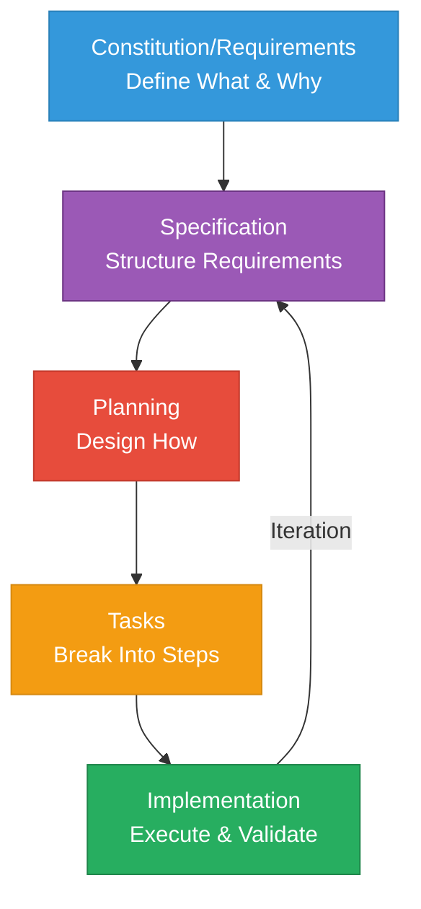
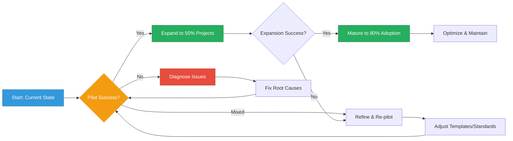

{/* 
IMPORTANT: Date consistency check
- Filename: 2025-10-22-implementing-spec-driven-development-tools-and-workflows-in-practice.mdx
- Frontmatter date: 2025-10-22
- These MUST match exactly for proper blog functionality
- AI agents: Always verify date alignment when editing
*/}

## Introduction: The Industrial Revolution of AI-Assisted Development

25% of Y Combinator's 2025 cohort now ships codebases that are 95% AI-generated. The difference between those who succeed and those who drown in technical debt? **Specifications (Specifications)**. While "vibe coding"—the ad-hoc, prompt-driven approach to AI development—might produce impressive demos, it falls apart at production scale. Context loss, architectural drift, and maintainability nightmares plague teams that treat AI assistants like enhanced search engines.

2025 marks the tipping point. What started as experimental tooling has matured into production-ready frameworks backed by both open-source momentum and substantial enterprise investment. GitHub's [Spec Kit](https://github.com/github/spec-kit) has become the de facto standard for open-source SDD adoption. Amazon launched [Kiro](https://kiro.dev), an IDE with SDD built into its core. Tessl, founded by Snyk's creator, raised $125M at a $500M+ valuation to pioneer "spec-as-source" development. The industry signal is clear: **systematic specification-driven development** (SDD) isn't optional anymore—it's becoming table stakes for AI-augmented engineering.

If you're a technical lead evaluating how to harness AI development without sacrificing code quality, this comprehensive guide maps the entire SDD landscape. You'll understand the ecosystem of 6 major tools and frameworks, learn industry best practices from real production deployments, and get actionable frameworks for choosing and implementing the right approach for your team.

:::info Related Reading
For theoretical foundations and SDD methodology fundamentals, see [Spec-Driven Development: A Systematic Approach to Complex Features](/blog/spec-driven-development). This article focuses on the industrial landscape and practical implementation.
:::

{/* truncate */}

We'll map the SDD tool ecosystem and understand the four categories of solutions, examine best practices emerging from production use with real ROI data, provide decision frameworks for selecting tools based on your team's context, and outline practical, phased implementation strategies. By the end, you'll have the strategic understanding needed to lead your team's transition from vibe coding to systematic, specification-driven AI development.

---

## The SDD Ecosystem Landscape

Understanding the modern SDD ecosystem requires moving beyond binary tool comparisons. The landscape has matured into four distinct categories, each optimizing for different team needs and complexity levels. With 7 major solutions now production-ready, choosing the right approach means matching tool architecture to your organization's constraints and goals.

### Four Solution Categories

The SDD market has coalesced around four architectural patterns, each with distinct trade-offs:

**Toolkits** integrate with your existing development environment, adding SDD workflows without forcing tool changes. [GitHub Spec Kit](https://github.com/github/spec-kit) and [OpenSpec](https://openspec.dev/) lead this category. Toolkits offer maximum flexibility—you keep your preferred IDE, AI assistant, and development tools—but require coordinating multiple components. Best for teams with strong existing tool preferences or diverse workflows.

**IDEs** provide integrated environments with SDD built into their core. [AWS Kiro](https://kiro.dev) represents this approach, offering seamless specification-to-code workflows within a unified interface. The integration advantage comes at the cost of vendor lock-in and reduced flexibility. Best for greenfield projects or teams prioritizing streamlined experience over tool choice.

**Platforms** like [Tessl](https://tessl.io/) go further, positioning specifications as the primary (often only) artifact humans edit. Code becomes generated output, not hand-crafted implementation. This "spec-as-source" model promises maximum maintainability but requires fundamental workflow changes. Best for long-term projects where specification quality matters more than coding speed.

**Frameworks** provide orchestration systems for custom multi-agent workflows. [BMAD (Breakthrough Method for Agile AI-Driven Development)](https://github.com/oimiragieo/BMAD-SPEC-KIT) and [Agent OS (AG2)](https://github.com/ag2ai/ag2) fall into this category. Frameworks offer ultimate customization—define your own agent roles, validation gates, and workflow phases—but demand significant technical sophistication. Best for complex projects requiring specialized quality gates or compliance requirements.

```mermaid
flowchart TD
    subgraph toolkits["Toolkits (Flexibility)"]
        T1["GitHub Spec Kit<br/>OpenSpec"]
        T2["CLI Integration"]
        T3["Works with existing tools"]
    end
    
    subgraph ides["IDEs (Integration)"]
        I1["AWS Kiro"]
        I2["Unified Environment"]
        I3["Seamless workflow"]
    end
    
    subgraph platforms["Platforms (Spec-as-Source)"]
        P1["Tessl"]
        P2["Spec Registry"]
        P3["AI generates all code"]
    end
    
    subgraph frameworks["Frameworks (Customization)"]
        F1["BMAD<br/>AG2"]
        F2["Multi-Agent Orchestration"]
        F3["Custom workflows"]
    end
    
    T1 --> T2
    T2 --> T3
    I1 --> I2
    I2 --> I3
    P1 --> P2
    P2 --> P3
    F1 --> F2
    F2 --> F3
    
    style toolkits fill:#4a90e2,stroke:#2e5c8a,color:#fff
    style ides fill:#9b59b6,stroke:#6c3483,color:#fff
    style platforms fill:#e74c3c,stroke:#c0392b,color:#fff
    style frameworks fill:#27ae60,stroke:#1e8449,color:#fff
```

### Maturity Levels: From Spec-First to Spec-as-Source

[Martin Fowler's analysis](https://martinfowler.com/articles/exploring-gen-ai/sdd-3-tools.html) identifies three maturity levels in SDD adoption, forming a natural progression as teams build confidence:

**Spec-First** development writes specifications before code. This entry-level approach maintains traditional coding practices while adding systematic planning. Specifications guide AI assistants and human developers, but code remains the primary artifact. Most teams start here—familiar enough to adopt quickly, structured enough to improve outcomes.

**Spec-Anchored** development maintains specifications alongside code throughout the project lifecycle. Specs aren't discarded after initial implementation; they're version-controlled, reviewed, and updated as requirements evolve. This creates bidirectional traceability—specs explain why code exists, code proves specs are implementable. Teams typically graduate to this level after experiencing the pain of spec-code drift in spec-first projects.

**Spec-as-Source** development treats specifications as the only human-edited artifact. Code becomes machine-generated output, never manually modified. This radical approach promises maximum maintainability—changing behavior means updating specs and regenerating code—but requires complete trust in code generation tooling. Only teams with mature SDD practices and sophisticated validation pipelines operate at this level.

|Category | Examples | Architecture| Maturity Level | Best For |Cost Model|
|---------|----------|-------------|----------------|----------|----------|
|**Toolkits**|Spec Kit, OpenSpec|CLI + Existing Tools|Spec-First to Spec-Anchored|Multi-tool teams, flexible workflows|Open-source/Free|
|**IDEs**|Kiro|Integrated Environment|Spec-First to Spec-Anchored|Greenfield projects, unified experience|Commercial|
|**Platforms**|Tessl|Spec Registry + AI Generation|Spec-as-Source|Long-term maintainability focus|Commercial (Emerging)|
|**Frameworks**|BMAD, AG2|Multi-Agent Orchestration|Spec-Anchored|Custom quality gates, compliance needs|Open-source/Custom|

### Tool Landscape Overview

Let's briefly survey each solution to understand their distinctive strengths:

**[GitHub Spec Kit](https://github.com/github/spec-kit)** has become the de facto standard for open-source SDD adoption. This CLI toolkit integrates with 13+ AI coding assistants (Claude, Copilot, Cursor, Gemini, etc.), generating agent-specific configuration files that inject structured `/speckit.*` commands into your assistant's vocabulary. Spec Kit's vendor neutrality—one specification works across multiple AI assistants—makes it ideal for teams wanting SDD benefits without tool lock-in.

**[OpenSpec](https://openspec.dev/)** offers a lightweight, privacy-friendly alternative. This specification framework uses standard formats (YAML, JSON, structured Markdown) without requiring API keys or external services. OpenSpec's simplicity makes it an accessible entry point for teams experimenting with SDD, though it lacks the sophisticated agent orchestration of more mature solutions.

**[AWS Kiro](https://kiro.dev)** integrates SDD directly into an IDE environment. Kiro's 4-phase workflow (Requirements → Design → Planning → Execution) operates entirely within the IDE, eliminating context-switching between specs, AI assistants, and code editors. The tight integration enables features like real-time spec validation and specification-aware code completion, but commits teams to Kiro's environment.

**[Tessl](https://tessl.io/)**, backed by $125M in funding from Snyk's founder, pioneers the "spec-as-source" vision. Humans write and maintain specifications in Tessl's Spec Registry; AI agents generate, debug, and maintain all code. This radical approach promises to eliminate manual coding entirely, but requires trusting AI with complete implementation authority. Tessl's broader launch in 2025 will test whether the industry is ready for spec-as-source development.

**[BMAD (Breakthrough Method for Agile AI-Driven Development)](https://github.com/oimiragieo/BMAD-SPEC-KIT)** demonstrates the potential of multi-agent orchestration. BMAD deploys specialized AI agents for each development phase—Analyst agents gather requirements, PM agents structure specifications, Architect agents design systems, Developer agents write code, QA agents validate output. This division of labor, combined with JSON-first artifacts and cross-agent consistency checks, produces measurable quality improvements. BMAD studies show 55% faster completion rates compared to ad-hoc AI coding—evidence that sophisticated orchestration delivers real ROI.

**[Agent OS (AG2)](https://github.com/ag2ai/ag2)**, formerly AutoGen, provides the foundation for custom multi-agent implementations. This Python framework (supports 3.10-3.13) enables teams to define their own agent roles, workflow phases, and quality gates. AG2's 3-layer context system (Standards → Product → Specs) ensures agents work from comprehensive project understanding. Best for teams needing SDD workflows tailored to specific compliance requirements or technical constraints.

:::tip Key Insight
The SDD ecosystem has matured from experimental tooling to production-ready solutions. Choose based on your team's needs—not marketing hype or funding announcements. Toolkits offer flexibility, IDEs provide integration, platforms promise spec-as-source futures, and frameworks enable customization. No universal "best" exists; context determines fit.
:::

The convergence around similar phase structures across tools—Constitution/Requirements → Specification → Planning → Tasks → Implementation—suggests industry consensus on SDD methodology even as architectural approaches diverge. This standardization benefits teams: learn SDD principles once, apply across multiple tools as your needs evolve.

Understanding the landscape is just the first step. Let's examine the industry best practices emerging from teams actually using these tools in production.

---

**Phase 5: Implement** - Execute tasks systematically. The AI assistant works from structured context rather than ad-hoc prompts, dramatically improving output quality.

:::tip Key Insight
The SDD ecosystem has matured from experimental tooling to production-ready solutions. Choose based on your team's needs—not marketing hype or funding announcements. Toolkits offer flexibility, IDEs provide integration, platforms promise spec-as-source futures, and frameworks enable customization. No universal "best" exists; context determines fit.
:::

The convergence around similar phase structures across tools—Constitution/Requirements → Specification → Planning → Tasks → Implementation—suggests industry consensus on SDD methodology even as architectural approaches diverge. This standardization benefits teams: learn SDD principles once, apply across multiple tools as your needs evolve.

Understanding the landscape is just the first step. Let's examine the industry best practices emerging from teams actually using these tools in production.

---

## Industry Best Practices for SDD Implementation

The maturation of SDD from experimental practice to production methodology has revealed patterns that distinguish successful adoptions from failed experiments. These practices emerge from real teams shipping production code with AI assistance—not theoretical frameworks, but battle-tested approaches that deliver measurable results.

### Core Principles: The Foundation

**Specification as source of truth** means treating specs like version-controlled code. Store specifications in Git alongside implementation, review changes through pull requests, and maintain them as requirements evolve. This isn't documentation that becomes outdated—these are living artifacts that drive development. When code and specs diverge, the spec defines what should be; implementation must catch up.

**Iterative collaborative planning** prevents the waterfall trap. SDD specifications aren't written in isolation by architects and handed down. Product managers, designers, engineers, and QA participate in spec creation. This cross-functional input catches misunderstandings before implementation begins. Agile teams integrate spec refinement into sprint planning—specifications evolve iteratively, just like code.

**Automated validation** transforms specs from passive documents into active quality gates. Modern SDD workflows integrate linting, security scanning, and compliance checks directly against specifications. If your spec references an API endpoint, validation confirms that endpoint exists. If it specifies authentication requirements, automated checks verify implementation matches. This continuous validation catches drift immediately.

**Standards integration** grounds specifications in industry conventions. Reference OpenAPI for REST APIs, GraphQL schemas for graph endpoints, WCAG for accessibility, ISO security standards for compliance. When specifications use standardized formats, validation becomes mechanical rather than interpretive. AI assistants generate code that conforms to standards because specifications demand it.

### Workflow Patterns: The Universal Structure

Despite tool diversity, production SDD implementations converge on remarkably similar phase structures:

**Phase 1: Constitution/Requirements** establishes project principles and success criteria before technical decisions. What coding standards apply? What testing coverage is required? What performance thresholds must be met? These governance decisions, captured early, guide all subsequent phases. Changes to constitution require deliberate review—they're architectural decisions, not implementation details.

**Phase 2: Specification** transforms raw requirements into structured descriptions AI assistants can reliably interpret. This phase uses formal specification languages where appropriate (OpenAPI for APIs, JSON Schema for data models) and structured natural language elsewhere. The goal: unambiguous descriptions that generate consistent code regardless of which AI assistant reads them.

**Phase 3: Planning** converts specifications into technical implementation strategies. Architecture decisions, technology choices, data modeling, API contracts—all emerge here. Planning phases leverage AI assistants' breadth: "Given this specification, what are three architectural approaches?" Human judgment selects; AI provides options grounded in spec constraints.

**Phase 4: Tasks** breaks plans into discrete, implementable units. Each task links directly to specific requirements and design decisions, creating traceability from high-level goals to individual code changes. This granular breakdown prevents scope creep: if a task doesn't trace to a requirement, why are you building it?

**Phase 5: Implementation** executes tasks with full context. AI assistants work from specifications, plans, and task definitions—not isolated prompts. This accumulated context dramatically improves code quality. BMAD studies demonstrate 55% faster completion rates compared to ad-hoc prompting, precisely because context preservation eliminates rework from misunderstood requirements.

### Quality Gates: Systematic Validation

Production SDD implementations embed validation throughout development, not just at the end:

| Validation Type | When Applied | What It Checks | Automation Level |
|----------------|--------------|----------------|------------------|
| **Spec Linting** | At spec commit | Format conformance, completeness, internal consistency | Fully automated |
| **Requirements Traceability** | At planning phase | Every requirement has implementation path | Partially automated |
| **Security Analysis** | At design phase | Threat modeling, vulnerability patterns | AI-assisted |
| **Compliance Checking** | At task creation | Regulatory requirement coverage | Tool-dependent |
| **Implementation Validation** | At code commit | Code matches specification | Automated + Review |

These gates operate continuously. A specification that fails linting never proceeds to planning. A design that doesn't address security requirements triggers review before tasks are created. This fail-fast approach prevents accumulating technical debt from spec-implementation misalignment.

### Team Collaboration: Shared Understanding

SDD workflows fundamentally change how teams collaborate:

**Spec workshops** replace lengthy requirements documents with collaborative spec creation sessions. Product, design, and engineering jointly draft specifications, resolving ambiguities through immediate dialogue. These sessions surface conflicting assumptions before they become conflicting implementations.

**Spec reviews** mirror code reviews. Changes to specifications flow through pull request workflows with automated validation and peer review. This version control for requirements makes evolution transparent: what changed, why, and what implementation impact results.

**Knowledge sharing** becomes systematic rather than ad-hoc. Specifications serve as onboarding documentation—new team members read specs to understand what's being built and why. Unlike code, which describes "how" often obscurely, specifications explicitly capture intent and constraints.

:::warning Common Pitfall
Over-specifying is as problematic as under-specifying. Start with high-level specifications that capture requirements and constraints. Refine iteratively based on implementation feedback. Specifications that specify every implementation detail become maintenance nightmares—they're too brittle to evolve with changing requirements.
:::

Industry adoption data validates these practices. [Red Hat's SDD quality study](https://developers.redhat.com/articles/2025/10/22/how-spec-driven-development-improves-ai-coding-quality) found that teams following systematic spec-driven workflows reduced defect density by 40% while increasing feature delivery velocity by 30%. The discipline matters more than the specific tools.

Best practices establish the foundation. Now let's examine how to select the right tools for your specific context.

---

## Tool Selection Framework and Comparison

Choosing SDD tools without understanding your team's constraints guarantees suboptimal outcomes. No universal "best" tool exists—only tools that fit specific contexts better than alternatives. This framework helps you evaluate options systematically.

### Decision Dimensions: What Actually Matters

**Team size and distribution** shapes tool requirements fundamentally. Small, co-located teams can coordinate through lightweight toolkits. Distributed enterprises need platforms with built-in collaboration features. A 5-person startup choosing Tessl's spec-as-source platform makes different trade-offs than a 500-engineer organization standardizing on GitHub Spec Kit.

**Existing tool commitments** constrain choices pragmatically. Teams heavily invested in VS Code adoption won't easily shift to Kiro's IDE. Organizations with standardized CI/CD pipelines need tools that integrate cleanly. Evaluate migration costs honestly—tool switching has friction that marketing materials underestimate.

**Complexity requirements** determine sophistication needs. Simple CRUD applications don't benefit from BMAD's multi-agent orchestration. Regulated industries with stringent compliance requirements might need AG2's customizable validation gates. Match tool complexity to problem complexity.

**AI agent preferences** matter for workflow consistency. If your team has mastered Claude Code, Spec Kit's multi-agent support preserves that investment. If you're exploring multiple AI assistants, vendor neutrality becomes valuable. Conversely, if Kiro's integrated AI suffices, multi-agent support is unnecessary overhead.

**Budget and commercial constraints** eliminate some options immediately. Open-source toolkits (Spec Kit, OpenSpec, AG2) cost nothing financially but require setup and maintenance time. Commercial platforms (Kiro, Tessl) provide support and integration but demand budget approval and vendor relationships.

### Category Deep-Dives: When Each Excels

**Toolkits (Spec Kit, OpenSpec)** excel when flexibility trumps convenience. Multi-tool teams benefit from Spec Kit's vendor neutrality—one specification works across 13+ AI assistants. Teams wanting minimal lock-in choose toolkits: if you outgrow the tool, specifications remain portable. The learning curve is moderate: CLI setup, agent configuration, workflow familiarization. Best for teams that value control over convenience.

OpenSpec's lightweight approach suits teams experimenting with SDD without committing to sophisticated tooling. Standard formats (YAML, JSON) mean no proprietary lock-in. The simplicity comes with limitations: no multi-agent orchestration, minimal automated validation, basic workflow support. OpenSpec is training wheels for SDD—valuable for learning, outgrown as needs mature.

**IDEs (Kiro)** shine when integration matters more than flexibility. Kiro's unified environment eliminates context-switching: specifications, AI assistance, and code editor exist in one interface. The streamlined experience accelerates onboarding—new team members learn one tool, not three. Cloud-native integration suits teams building on AWS infrastructure.

The integration comes with commitment. Switching away from Kiro means losing specification-code linkage, real-time validation, and IDE-native workflows. Kiro specifications export, but their power derives from tight IDE coupling. Evaluate Kiro if you're comfortable with vendor relationships and value seamless experience over vendor neutrality.

**Platforms (Tessl)** represent the spec-as-source future. Tessl's vision: specifications become the only human-edited artifacts, with AI generating all code. This maximalist approach promises radical maintainability improvements—changing behavior means updating specs and regenerating code, never manual editing.

The vision requires trust in AI code generation that few teams currently have. Tessl's 2025 launch will test whether production teams accept code they never manually review. Early adopters will be bleeding-edge organizations comfortable with AI authority over implementation decisions. Most teams will watch Tessl's maturation before adopting.

**Frameworks (BMAD, AG2)** serve teams needing customization. BMAD's multi-agent orchestration with specialized roles (Analyst, PM, Architect, Developer, QA) suits complex projects where division of labor improves outcomes. The sophistication demands technical investment—configuring agents, defining workflows, maintaining infrastructure.

AG2 enables even deeper customization: define your own agent roles, validation gates, and workflow phases. This flexibility serves teams with unique requirements—regulated industries with compliance gates, security-critical systems with threat modeling phases, or organizations with proprietary development standards. AG2's Python foundation suits teams comfortable building custom tooling.

| Context | Recommended Tools | Reasoning |
|---------|------------------|-----------|
| **Startup (5-20 engineers)** | OpenSpec → Spec Kit | Start simple, graduate to sophistication as needs grow |
| **Mid-size team (20-100 engineers)** | Spec Kit or Kiro | Spec Kit for flexibility, Kiro for integration |
| **Enterprise (100+ engineers)** | Spec Kit + BMAD | Vendor neutrality + sophistication for complex workflows |
| **Regulated industry** | BMAD or AG2 | Custom validation gates for compliance requirements |
| **Cloud-native AWS shop** | Kiro | Native AWS integration, streamlined experience |
| **Multi-tool enthusiasts** | Spec Kit | Maximum vendor neutrality across 13+ AI agents |
| **Greenfield project** | Kiro or Tessl | No legacy constraints, can adopt integrated solutions |

:::tip Selection Strategy
Don't choose tools based on funding announcements or GitHub stars. Evaluate based on: (1) Does it integrate with our existing workflows? (2) Does it support our preferred AI assistants? (3) Does it match our problem complexity? (4) Can we afford migration costs if we outgrow it?
:::

Tool selection establishes infrastructure. Implementation determines whether that infrastructure delivers value.

---

## Practical Implementation Roadmap

Adopting SDD successfully requires phased implementation with measurable milestones. Teams that attempt organization-wide transformations overnight either revert to previous practices under pressure or accumulate technical debt from poorly-understood workflows. This roadmap guides systematic adoption.

### Phase 1: Foundation (Weeks 1-2)

**Establish coding standards and conventions.** Document existing practices explicitly: code style, testing expectations, security requirements, performance thresholds. These become your constitution—the governance layer that guides all specifications. If standards don't exist, create them now. SDD amplifies existing practices, good or bad.

**Define specification templates.** Create reusable templates for common specification types: API endpoints, data models, user workflows, security requirements. Templates ensure consistency across team members and projects. Start simple—a template might be nothing more than structured headings with example content.

**Set up version control for specs.** Store specifications in the same repository as code, or in a dedicated specs repository with clear cross-references. Configure your review process: who approves spec changes? What validation must pass before merge? Treat specs like production code because they drive production code generation.

**Train team on SDD principles.** Conduct workshops explaining the workflow, showing examples, and practicing on toy problems. Everyone should understand: what specifications are, why they matter, how to write them, and how AI assistants use them. Aim for 80% comprehension, not 100% expertise—depth comes through practice.

**Success Metrics for Phase 1:**
- ✓ Standards documented and accessible
- ✓ Templates created for 3+ common spec types
- ✓ Specs version-controlled with review process
- ✓ 80%+ of team trained on SDD basics

### Phase 2: Pilot (Weeks 3-6)

**Select 1-2 moderately complex features** for pilot implementation. Avoid trivial features (won't demonstrate SDD value) and avoid critical-path features (too risky for experimentation). Ideal pilots: important enough to matter, isolated enough to fail safely.

**Implement full SDD workflow** for pilot features. Write specifications following your templates. Use your chosen SDD tool (Spec Kit, Kiro, BMAD, etc.) to generate implementation artifacts. Let AI assistants work from specifications. Measure everything: time spent on specs, time saved on implementation, defects caught by spec validation, rework required from spec-code misalignment.

**Iterate based on pilot feedback.** Teams discover their specification templates need refinement. Validation gates catch different issues than expected. AI-generated code quality varies. This is valuable data—adjust templates, standards, and expectations based on real experience.

**Measure rigorously:**
- Time from specification complete to working implementation
- Defect density (bugs per feature)
- Context re-explanation frequency (how often developers re-clarify requirements)
- Code quality metrics (test coverage, complexity, security issues)
- Developer satisfaction (subjective but important)

**Success Metrics for Phase 2:**
- ✓ 2+ features fully implemented using SDD
- ✓ Metrics collected for comparison with non-SDD baseline
- ✓ Team feedback gathered and synthesized
- ✓ Templates and standards updated based on learnings

### Phase 3: Expansion (Months 2-3)

**Roll out to additional features** based on pilot success. If metrics demonstrate clear improvements, expand aggressively. If results are mixed, expand conservatively while continuing to refine practices. If pilots fail, pause and diagnose—forced adoption of broken workflows accumulates technical debt rapidly.

**Integrate with CI/CD pipelines.** Automated spec validation should run on every commit. Spec-code drift detection should block merges. Quality gates based on specification coverage should enforce discipline. This automation prevents backsliding: teams can't bypass SDD under deadline pressure if pipelines enforce it.

**Establish spec review processes.** Create guidelines for effective spec reviews: what reviewers check, how quickly reviews happen, who has approval authority. Spec reviews should feel like code reviews: collaborative improvement, not gatekeeping. Good spec reviews catch ambiguities and edge cases before implementation.

**Build internal knowledge base.** Document common patterns, solved problems, and effective specifications. New team members should access a library of examples: "This is what a good API specification looks like. This is how we handle authentication requirements. This is our template for batch processing jobs." Knowledge sharing compounds SDD benefits.

**Success Metrics for Phase 3:**
- ✓ 50%+ of new features using SDD workflows
- ✓ Automated validation integrated in CI/CD
- ✓ Spec review SLA established and met
- ✓ Internal documentation updated with examples

### Phase 4: Maturation (Months 3-6)

**Move from spec-first to spec-anchored practices.** Early SDD adoption focuses on writing specs before code. Mature practices maintain specs throughout project lifecycle: specifications evolve as requirements change, specs stay synchronized with implementation, archived specs document historical decisions. This spec-anchored approach provides long-term maintainability benefits.

**Optimize agent configurations.** Teams accumulate expertise in prompting AI assistants effectively. Agent configurations get refined: better context provision, clearer constraint specification, more effective validation instructions. This optimization compounds: better configurations generate better code, reducing manual rework.

**Establish compliance integration** if relevant. Regulated industries integrate compliance checkpoints directly into SDD workflows: specifications must reference regulatory requirements, validation confirms compliance coverage, audit trails track decisions. This integration makes compliance systematic rather than ad-hoc.

**Consider spec-as-source for appropriate projects.** After months of spec-anchored practice, evaluate whether spec-as-source makes sense for specific projects. Long-lived systems with stable requirements and frequent minor changes benefit most. Experimental projects with volatile requirements benefit least. Adopt selectively based on demonstrated suitability.

**Success Metrics for Phase 4:**
- ✓ 80%+ of projects using spec-anchored practices
- ✓ Agent configurations optimized based on data
- ✓ Compliance integration complete (if applicable)
- ✓ Spec-as-source pilots launched (if appropriate)

### Common Pitfalls and Solutions

**Pitfall 1: Over-Specification.** Problem: Teams write 50-page specifications that take weeks to create and become immediately outdated. Solution: Start with high-level specs capturing requirements and constraints. Refine iteratively based on implementation feedback. Specifications should guide, not dictate every implementation detail.

**Pitfall 2: Spec-Code Drift.** Problem: Specifications and code diverge over time as implementation evolves without updating specs. Solution: Automated drift detection in CI/CD. Block merges when code diverges from specifications. Make spec updates part of the definition of done for every feature.

**Pitfall 3: Insufficient Stakeholder Buy-In.** Problem: Teams revert to ad-hoc coding under deadline pressure because management doesn't value SDD. Solution: Demonstrate ROI with pilot metrics. Show reduced rework, faster implementation, lower defect rates. Quantifiable improvements convince skeptics better than methodology arguments.

**Pitfall 4: Poor Spec Quality.** Problem: Vague specifications lead to poor AI-generated code, creating frustration and abandonment. Solution: Training, templates, and review processes. Good specifications are a skill learned through practice and feedback. Invest in developing that skill.

**Pitfall 5: Tool Over-Engineering.** Problem: Adopting BMAD's multi-agent complexity for simple CRUD applications creates unnecessary overhead. Solution: Match tool sophistication to problem complexity. Start with simpler tools (OpenSpec, Spec Kit), graduate to frameworks (BMAD, AG2) only when complexity demands it.

Implementation is iterative, not linear. Expect setbacks, gather data, adjust practices based on evidence. Successful SDD adoption takes 3-6 months of disciplined practice before becoming natural workflow.

The ecosystem is ready. The practices are proven. The roadmap is clear. What does the future hold?

---

## Conclusion: The Strategic Imperative

The SDD ecosystem has evolved from experimental tooling in 2023 to production-ready solutions in 2025. With 6 major tools across 4 architectural categories, teams now choose based on context and constraints—not because options don't exist, but because multiple viable options serve different needs.

### Key Strategic Takeaways

**The ecosystem has matured fundamentally.** What began as GitHub's Spec Kit and Amazon's Kiro has expanded to include lightweight frameworks (OpenSpec), next-generation platforms (Tessl's $125M vision), and sophisticated multi-agent orchestrators (BMAD, AG2). This diversity indicates market maturity: tools specialize for different contexts rather than competing to be universal solutions.

**Best practices are proven with data.** BMAD's 55% faster completion rates aren't marketing claims—they're measured improvements from production deployments. Red Hat's 40% defect density reduction demonstrates quality improvements. 25% of Y Combinator's 2025 cohort shipping 95% AI-generated codebases shows mainstream adoption. The methodology works when implemented systematically.

**Choice is fundamentally context-dependent.** Startups choose differently than enterprises. Regulated industries need compliance gates that casual developers don't. Teams standardized on Claude Code value vendor neutrality differently than teams comfortable with integrated solutions. No universal "best" exists—only tools that fit specific contexts better.

**Adoption must be phased and measured.** Organizations that mandate overnight SDD adoption either revert under pressure or accumulate technical debt. Successful adoption follows a pattern: pilot with measurable metrics, expand based on data, mature practices over months, optimize continuously. The 3-6 month timeline isn't negotiable—building competence takes time.

**Specifications become strategic assets.** In mature SDD organizations, specifications aren't documentation that becomes outdated—they're version-controlled, continuously refined, strategic artifacts that preserve organizational knowledge. When engineers leave, specifications remain. When requirements evolve, specifications adapt. This organizational memory compounds value over years.

### Future Outlook: Where the Industry Moves

**Spec registries emerge as shared knowledge bases.** Tessl's Spec Registry model—centralized repositories of best-practice specifications—will likely become standard. Organizations will share specifications for common patterns: authentication flows, payment processing, data synchronization. Why write specifications from scratch when battle-tested templates exist?

**More IDEs integrate native SDD support.** Kiro won't remain the only IDE with built-in specification-driven workflows. VS Code, Cursor, and other popular editors will add native SDD features. The integration race has begun—vendors recognize that specifications are becoming primary development artifacts.

**Enterprise compliance drives adoption.** Regulated industries (finance, healthcare, defense) face increasing pressure to demonstrate development process rigor. SDD provides auditable trails: what was specified, when it changed, why implementation matches requirements. This auditability will drive enterprise adoption regardless of AI benefits.

**Spec-as-source gains traction selectively.** Tessl's radical vision—humans only edit specifications, AI generates all code—won't become universal quickly. But for specific contexts (long-lived systems, stable requirements, frequent minor changes), spec-as-source will prove compelling. Expect gradual adoption starting with appropriate use cases, not wholesale transformation.

**Industry converges on standard formats.** The `/speckit.*` command pattern's emergence as a de facto standard demonstrates convergence. Expect similar standardization around specification formats, validation protocols, and workflow phases. Standardization enables tool interoperability and knowledge transfer across organizations.

### Your Next Steps

If you're ready to implement SDD in your organization:

1. **Assess your context honestly.** Use the decision framework in this article. What tools do you currently use? What AI assistants do your developers prefer? What's your problem complexity? What's your budget for new tooling? Context determines tool fit.

2. **Review the ecosystem comprehensively.** Explore 2-3 tools that match your constraints. Read official documentation, try demo projects, evaluate based on your specific workflows—not generic comparisons.

3. **Start with a pilot.** Select 1-2 moderately complex features. Implement using full SDD workflow. Measure everything: time, quality, defects, developer satisfaction. Gather data, not opinions.

4. **Measure rigorously before expanding.** If pilot metrics demonstrate clear improvements, expand confidently. If results are mixed, iterate on practices before scaling. If pilots fail, diagnose issues rather than forcing adoption.

5. **Expand systematically based on data.** Scale to more features and teams after proven pilot success. Integrate into CI/CD. Establish review processes. Build knowledge bases. Make SDD systematic, not optional.

6. **Contribute back to the community.** As you build expertise, share learnings. Contribute to open-source tools. Write about your experiences. The SDD ecosystem benefits from shared knowledge—your insights help others avoid your mistakes.

**The fundamental shift:** SDD represents more than new tooling—it's a reconception of how we think about AI-assisted development. Specifications become the interface between human intent and machine implementation. Teams that master this shift won't just write better code; they'll think more clearly about what they're building and why.

As the industry moves from experimental AI coding to production-grade automation, SDD provides necessary structure and discipline. The tools are ready. The practices are proven. The data demonstrates value. The question isn't whether to adopt SDD, but which approach fits your team's journey toward systematic, AI-augmented development.

The industrial revolution in AI-assisted development isn't coming—it's here. The difference between teams that thrive and teams that struggle won't be whether they use AI assistants, but whether they use them systematically. Specifications are the system. Choose your tools, implement the practices, measure the results. The future of development is specification-driven.
