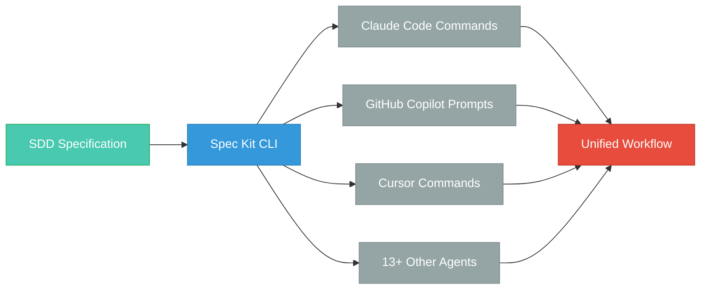
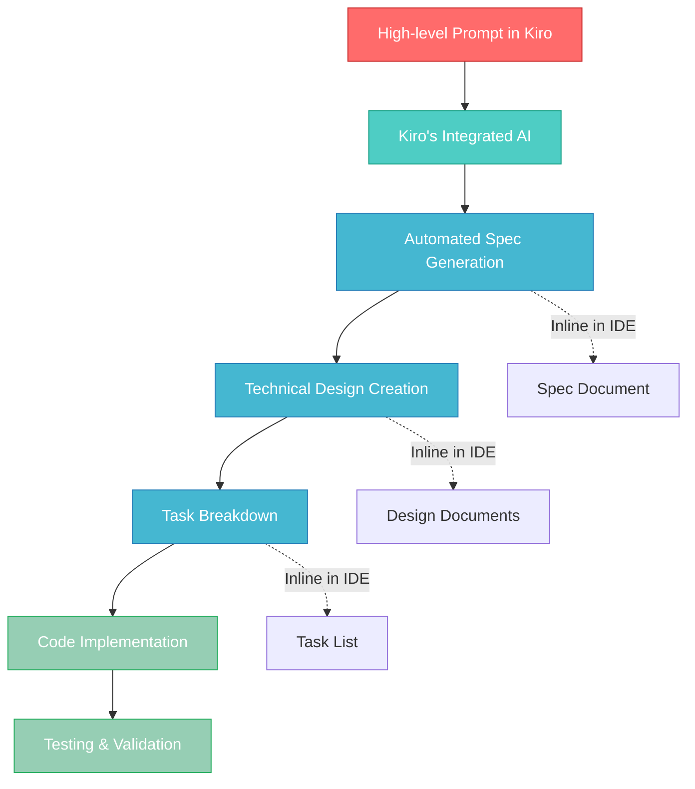

{/* 
IMPORTANT: Date consistency check
- Filename: 2025-10-22-implementing-spec-driven-development-tools-and-workflows-in-practice.mdx
- Frontmatter date: 2025-10-22
- These MUST match exactly for proper blog functionality
- AI agents: Always verify date alignment when editing
*/}

## Introduction: The Industrial Revolution of AI-Assisted Development

25% of Y Combinator's 2025 cohort now ships codebases that are 95% AI-generated. The difference between those who succeed and those who drown in technical debt? **Specifications (Specifications)**. While "vibe coding"—the ad-hoc, prompt-driven approach to AI development—might produce impressive demos, it falls apart at production scale. Context loss, architectural drift, and maintainability nightmares plague teams that treat AI assistants like enhanced search engines.

2025 marks the tipping point. What started as experimental tooling has matured into production-ready frameworks backed by both open-source momentum and substantial enterprise investment. GitHub's [Spec Kit](https://github.com/github/spec-kit) has become the de facto standard for open-source SDD adoption. Amazon launched [Kiro](https://kiro.dev), an IDE with SDD built into its core. Tessl, founded by Snyk's creator, raised $125M at a $500M+ valuation to pioneer "spec-as-source" development. The industry signal is clear: **systematic specification-driven development** (SDD) isn't optional anymore—it's becoming table stakes for AI-augmented engineering.

If you're a technical lead evaluating how to harness AI development without sacrificing code quality, this comprehensive guide maps the entire SDD landscape. You'll understand the ecosystem of 6 major tools and frameworks, learn industry best practices from real production deployments, and get actionable frameworks for choosing and implementing the right approach for your team.

:::info Related Reading
For theoretical foundations and SDD methodology fundamentals, see [Spec-Driven Development: A Systematic Approach to Complex Features](/blog/spec-driven-development). This article focuses on the industrial landscape and practical implementation.
:::

{/* truncate */}

We'll map the SDD tool ecosystem and understand the four categories of solutions, examine best practices emerging from production use with real ROI data, provide decision frameworks for selecting tools based on your team's context, and outline practical, phased implementation strategies. By the end, you'll have the strategic understanding needed to lead your team's transition from vibe coding to systematic, specification-driven AI development.

---

## The SDD Ecosystem Landscape

Understanding the modern SDD ecosystem requires moving beyond binary tool comparisons. The landscape has matured into four distinct categories, each optimizing for different team needs and complexity levels. With 7 major solutions now production-ready, choosing the right approach means matching tool architecture to your organization's constraints and goals.

### Four Solution Categories

The SDD market has coalesced around four architectural patterns, each with distinct trade-offs:

**Toolkits** integrate with your existing development environment, adding SDD workflows without forcing tool changes. [GitHub Spec Kit](https://github.com/github/spec-kit) and [OpenSpec](https://openspec.dev/) lead this category. Toolkits offer maximum flexibility—you keep your preferred IDE, AI assistant, and development tools—but require coordinating multiple components. Best for teams with strong existing tool preferences or diverse workflows.

**IDEs** provide integrated environments with SDD built into their core. [AWS Kiro](https://kiro.dev) represents this approach, offering seamless specification-to-code workflows within a unified interface. The integration advantage comes at the cost of vendor lock-in and reduced flexibility. Best for greenfield projects or teams prioritizing streamlined experience over tool choice.

**Platforms** like [Tessl](https://tessl.io/) go further, positioning specifications as the primary (often only) artifact humans edit. Code becomes generated output, not hand-crafted implementation. This "spec-as-source" model promises maximum maintainability but requires fundamental workflow changes. Best for long-term projects where specification quality matters more than coding speed.

**Frameworks** provide orchestration systems for custom multi-agent workflows. [BMAD (Breakthrough Method for Agile AI-Driven Development)](https://github.com/oimiragieo/BMAD-SPEC-KIT) and [Agent OS (AG2)](https://github.com/ag2ai/ag2) fall into this category. Frameworks offer ultimate customization—define your own agent roles, validation gates, and workflow phases—but demand significant technical sophistication. Best for complex projects requiring specialized quality gates or compliance requirements.

```mermaid
flowchart TD
    subgraph toolkits["Toolkits (Flexibility)"]
        T1["GitHub Spec Kit<br/>OpenSpec"]
        T2["CLI Integration"]
        T3["Works with existing tools"]
    end
    
    subgraph ides["IDEs (Integration)"]
        I1["AWS Kiro"]
        I2["Unified Environment"]
        I3["Seamless workflow"]
    end
    
    subgraph platforms["Platforms (Spec-as-Source)"]
        P1["Tessl"]
        P2["Spec Registry"]
        P3["AI generates all code"]
    end
    
    subgraph frameworks["Frameworks (Customization)"]
        F1["BMAD<br/>AG2"]
        F2["Multi-Agent Orchestration"]
        F3["Custom workflows"]
    end
    
    T1 --> T2
    T2 --> T3
    I1 --> I2
    I2 --> I3
    P1 --> P2
    P2 --> P3
    F1 --> F2
    F2 --> F3
    
    style toolkits fill:#4a90e2,stroke:#2e5c8a,color:#fff
    style ides fill:#9b59b6,stroke:#6c3483,color:#fff
    style platforms fill:#e74c3c,stroke:#c0392b,color:#fff
    style frameworks fill:#27ae60,stroke:#1e8449,color:#fff
```



### Maturity Levels: From Spec-First to Spec-as-Source

[Martin Fowler's analysis](https://martinfowler.com/articles/exploring-gen-ai/sdd-3-tools.html) identifies three maturity levels in SDD adoption, forming a natural progression as teams build confidence:

**Spec-First** development writes specifications before code. This entry-level approach maintains traditional coding practices while adding systematic planning. Specifications guide AI assistants and human developers, but code remains the primary artifact. Most teams start here—familiar enough to adopt quickly, structured enough to improve outcomes.

**Spec-Anchored** development maintains specifications alongside code throughout the project lifecycle. Specs aren't discarded after initial implementation; they're version-controlled, reviewed, and updated as requirements evolve. This creates bidirectional traceability—specs explain why code exists, code proves specs are implementable. Teams typically graduate to this level after experiencing the pain of spec-code drift in spec-first projects.

**Spec-as-Source** development treats specifications as the only human-edited artifact. Code becomes machine-generated output, never manually modified. This radical approach promises maximum maintainability—changing behavior means updating specs and regenerating code—but requires complete trust in code generation tooling. Only teams with mature SDD practices and sophisticated validation pipelines operate at this level.

|Category | Examples | Architecture| Maturity Level | Best For |Cost Model|
|---------|----------|-------------|----------------|----------|----------|
|**Toolkits**|Spec Kit, OpenSpec|CLI + Existing Tools|Spec-First to Spec-Anchored|Multi-tool teams, flexible workflows|Open-source/Free|
|**IDEs**|Kiro|Integrated Environment|Spec-First to Spec-Anchored|Greenfield projects, unified experience|Commercial|
|**Platforms**|Tessl|Spec Registry + AI Generation|Spec-as-Source|Long-term maintainability focus|Commercial (Emerging)|
|**Frameworks**|BMAD, AG2|Multi-Agent Orchestration|Spec-Anchored|Custom quality gates, compliance needs|Open-source/Custom|

### Tool Landscape Overview

Let's briefly survey each solution to understand their distinctive strengths:

**[GitHub Spec Kit](https://github.com/github/spec-kit)** has become the de facto standard for open-source SDD adoption. This CLI toolkit integrates with 13+ AI coding assistants (Claude, Copilot, Cursor, Gemini, etc.), generating agent-specific configuration files that inject structured `/speckit.*` commands into your assistant's vocabulary. Spec Kit's vendor neutrality—one specification works across multiple AI assistants—makes it ideal for teams wanting SDD benefits without tool lock-in.

**[OpenSpec](https://openspec.dev/)** offers a lightweight, privacy-friendly alternative. This specification framework uses standard formats (YAML, JSON, structured Markdown) without requiring API keys or external services. OpenSpec's simplicity makes it an accessible entry point for teams experimenting with SDD, though it lacks the sophisticated agent orchestration of more mature solutions.

**[AWS Kiro](https://kiro.dev)** integrates SDD directly into an IDE environment. Kiro's 4-phase workflow (Requirements → Design → Planning → Execution) operates entirely within the IDE, eliminating context-switching between specs, AI assistants, and code editors. The tight integration enables features like real-time spec validation and specification-aware code completion, but commits teams to Kiro's environment.

**[Tessl](https://tessl.io/)**, backed by $125M in funding from Snyk's founder, pioneers the "spec-as-source" vision. Humans write and maintain specifications in Tessl's Spec Registry; AI agents generate, debug, and maintain all code. This radical approach promises to eliminate manual coding entirely, but requires trusting AI with complete implementation authority. Tessl's broader launch in 2025 will test whether the industry is ready for spec-as-source development.

**[BMAD (Breakthrough Method for Agile AI-Driven Development)](https://github.com/oimiragieo/BMAD-SPEC-KIT)** demonstrates the potential of multi-agent orchestration. BMAD deploys specialized AI agents for each development phase—Analyst agents gather requirements, PM agents structure specifications, Architect agents design systems, Developer agents write code, QA agents validate output. This division of labor, combined with JSON-first artifacts and cross-agent consistency checks, produces measurable quality improvements. BMAD studies show 55% faster completion rates compared to ad-hoc AI coding—evidence that sophisticated orchestration delivers real ROI.

**[Agent OS (AG2)](https://github.com/ag2ai/ag2)**, formerly AutoGen, provides the foundation for custom multi-agent implementations. This Python framework (supports 3.10-3.13) enables teams to define their own agent roles, workflow phases, and quality gates. AG2's 3-layer context system (Standards → Product → Specs) ensures agents work from comprehensive project understanding. Best for teams needing SDD workflows tailored to specific compliance requirements or technical constraints.

:::tip Key Insight
The SDD ecosystem has matured from experimental tooling to production-ready solutions. Choose based on your team's needs—not marketing hype or funding announcements. Toolkits offer flexibility, IDEs provide integration, platforms promise spec-as-source futures, and frameworks enable customization. No universal "best" exists; context determines fit.
:::

The convergence around similar phase structures across tools—Constitution/Requirements → Specification → Planning → Tasks → Implementation—suggests industry consensus on SDD methodology even as architectural approaches diverge. This standardization benefits teams: learn SDD principles once, apply across multiple tools as your needs evolve.

Understanding the landscape is just the first step. Let's examine the industry best practices emerging from teams actually using these tools in production.

---

**Phase 5: Implement** - Execute tasks systematically. The AI assistant works from structured context rather than ad-hoc prompts, dramatically improving output quality.

This standardization matters. The `/speckit.*` command pattern that Spec Kit popularized is becoming an industry standard, with multiple AI coding assistants adopting similar conventions. When SDD tools use consistent workflows, developers can transfer knowledge between tools and projects more easily.

:::tip Core Insight
SDD tools aren't about replacing developer judgment—they're about preserving context across development phases. The structured approach ensures your AI assistant has the accumulated understanding needed to generate relevant, contextually appropriate code.
:::

The choice between Spec Kit and Kiro depends on your team's context: existing tool commitments, workflow preferences, and integration needs. Neither is universally "better"—they optimize for different scenarios. Let's start with GitHub Spec Kit, the open source toolkit approach that works with your existing development environment.

---

## GitHub Spec Kit: The Toolkit Approach

GitHub Spec Kit brings SDD to your existing development workflow without requiring you to abandon familiar tools. It's a CLI toolkit that generates configuration files and commands for your chosen AI coding assistant, then orchestrates structured workflows through standardized phases.

### Installation and Setup

Spec Kit requires [uv](https://docs.astral.sh/uv/), a modern Python package manager that handles installation and updates. The installation process is straightforward:

```bash
# Install Spec Kit globally
uv tool install specify-cli --from git+https://github.com/github/spec-kit.git

# Initialize a new project
specify init my-project --ai claude

# Or initialize in current directory
specify init . --ai copilot
```

The `--ai` parameter selects your AI coding assistant. Spec Kit generates agent-specific configuration files that integrate SDD commands into your assistant's workflow. This design choice—generating agent-specific files rather than running a persistent service—means Spec Kit adds zero runtime overhead to your development environment.

After initialization, your project contains a `.specify` directory with templates, scripts, and agent configurations. The specific structure depends on your AI agent choice, but the core concept remains consistent: Spec Kit has injected structured SDD workflows into your assistant's capabilities.

### Multi-Agent Architecture

One of Spec Kit's distinctive strengths is **multi-agent compatibility**. The same specification works with different AI assistants because Spec Kit generates agent-specific command files that map to a common underlying workflow.



This vendor neutrality matters for teams that use multiple AI assistants or want to avoid lock-in. Your specifications remain portable—switching from Claude to Copilot requires regenerating configuration files, not rewriting specifications.

| AI Agent | Support Level | Installation Required | Notes |
|----------|--------------|----------------------|-------|
| [Claude Code](https://www.anthropic.com/claude-code) | ✅ Full | Yes (CLI) | Original development target |
| [GitHub Copilot](https://code.visualstudio.com/) | ✅ Full | No (IDE-based) | Works in VS Code |
| Cursor | ✅ Full | Yes (CLI) | Requires `cursor-agent` CLI |
| Gemini CLI | ✅ Full | Yes (CLI) | Google's AI assistant |
| Windsurf | ✅ Full | No (IDE-based) | IDE-integrated agent |
| Qwen Code | ✅ Full | Yes (CLI) | Alibaba's offering |
| Amazon Q Developer | ⚠️ Partial | Yes (CLI) | Limited argument support |
| 6+ Additional Agents | ✅ Full | Varies | See official docs for complete list |

### The Command Set

Spec Kit injects `/speckit.*` commands into your AI assistant's vocabulary. These aren't magic—they're structured prompts that guide your assistant through specific SDD phases:

| Command | Purpose | Output | When to Use |
|---------|---------|--------|-------------|
| `/speckit.constitution` | Define project principles and governance | `constitution.md` with project guidelines | First step in any new project |
| `/speckit.specify` | Create functional specifications | `spec.md` with requirements and user stories | After constitution is established |
| `/speckit.clarify` | Identify underspecified areas | Additions to `spec.md` | Before creating technical plan |
| `/speckit.plan` | Generate technical implementation plan | `plan.md`, `data-model.md`, API specs | After specifications are clear |
| `/speckit.tasks` | Break plan into actionable tasks | `tasks.md` with ordered task list | After plan is validated |
| `/speckit.implement` | Execute task list systematically | Working code implementation | Final implementation phase |

The **phase separation** design is deliberate. Each command builds on previous phases, maintaining context while preventing scope creep. You can't accidentally skip the specification phase and jump straight to implementation—the commands enforce workflow discipline.

### A Simple Walkthrough

Let's walk through creating a specification for a simple feature. After installing Spec Kit and initializing your project, you'd interact with your AI assistant like this:

```text
/speckit.constitution Create principles focused on code quality, 
testing standards, and maintainability. Emphasize simplicity 
over clever solutions.
```

Your AI assistant generates a `constitution.md` file with structured principles:

```markdown
# Project Constitution

## Code Quality
- Prioritize readability over brevity
- Every function has a single, clear purpose
- Complex logic requires explanatory comments

## Testing Standards
- Unit tests for all business logic
- Integration tests for API endpoints
- 80% code coverage minimum

[... additional principles ...]
```

Next, you'd create the specification:

```text
/speckit.specify Build a user notification system that supports 
email and in-app notifications. Users can set preferences for 
notification types and frequency.
```

The AI assistant generates a structured specification with requirements, user stories, and acceptance criteria. This specification becomes the authoritative description of what you're building—subsequent phases reference it rather than requiring you to re-explain requirements.

The technical plan phase brings your technology choices:

```text
/speckit.plan Use Node.js with Express for the backend, 
PostgreSQL for persistence, and SendGrid for email delivery.
```

This generates detailed technical documents: data models, API contracts, and implementation strategies. The AI assistant can now reason about architectural decisions in context of both requirements (from specify) and principles (from constitution).

:::note Key Insight
Spec Kit's power comes from accumulated context. Each phase adds structure that subsequent phases leverage. Your AI assistant isn't working from isolated prompts—it's working from a comprehensive project understanding preserved in specification documents.
:::

Spec Kit is a CLI that orchestrates your chosen AI assistant, generating structured artifacts that guide implementation. The toolkit approach preserves your existing development workflows while adding systematic specification management. While Spec Kit brings SDD to existing tools, Kiro takes a different approach by integrating SDD directly into the IDE.

---

## Kiro: The Integrated IDE Approach

[Kiro](https://kiro.dev), developed by Amazon, represents a fundamentally different SDD implementation: an IDE with specification-driven development built into its core rather than layered on top. Where Spec Kit asks "how do we add SDD to existing tools?", Kiro asks "what would an IDE designed for SDD look like from the ground up?"

### Kiro's Integrated Workflow

The integration advantage becomes apparent immediately. In Spec Kit, you work across multiple contexts: your IDE for coding, your terminal for Spec Kit commands, and your AI assistant's interface for structured prompts. Kiro consolidates these into a unified environment where specifications, AI assistance, and code implementation happen in the same interface.

When you open Kiro, you're not just launching an editor—you're entering an **IDE-native SDD** environment. Creating specifications doesn't require external CLI tools or configuring AI assistant integrations. The workflow is embedded in the IDE itself, which means Kiro can provide contextual assistance that external tools cannot: inline specification references, real-time validation, and seamless transitions between SDD phases.



This tight integration enables features that toolkit approaches struggle with. Kiro can track which specifications relate to which code files, highlight incomplete implementations against requirements, and provide specification-aware code completion. The IDE understands not just your code, but the specifications that code implements.

### Natural Language Specifications

Kiro's specification creation leans heavily into natural language. You describe what you want to build conversationally, and Kiro's integrated AI transforms that description into structured requirements. The IDE interface provides immediate feedback—you see your specification taking shape as you describe it, with the AI suggesting clarifications or identifying ambiguities in real time.

This interactive refinement process is smoother in an integrated environment. Where Spec Kit requires you to review generated specifications in separate files, Kiro presents them inline with interactive elements. You can click to expand requirements, add clarifications, or mark sections for AI review—all without leaving the specification view.

The AI assistant isn't a separate tool you invoke with commands—it's a persistent presence in the IDE that understands your entire project context. When you ask for design suggestions or implementation approaches, the AI references your specifications automatically. There's no context-switching penalty.

### Automated Design Generation

Kiro's technical design phase demonstrates the benefits of deep IDE integration. Based on your specifications, Kiro generates comprehensive technical designs: data flow diagrams, API definitions, database schemas, and architectural decisions. These aren't static documents—they're interactive IDE artifacts.

Click on a database table in the design view, and Kiro shows you which specifications require that table. Select an API endpoint, and Kiro highlights the user stories it fulfills. This bidirectional traceability—from requirements through design to implementation—is considerably easier when everything exists in a unified environment.

The IDE can also validate designs against specifications automatically. If your technical design doesn't address a requirement, Kiro flags it. If a specification change would impact existing designs, Kiro identifies the affected areas. This continuous validation helps prevent the specification-implementation drift that plagues many projects.

### When to Choose Kiro

Kiro's integrated approach offers clear advantages in specific scenarios:

**Greenfield Projects**: When starting fresh without existing tool commitments, Kiro's unified environment eliminates integration complexity. You're not managing Spec Kit configurations, AI assistant setups, and IDE extensions—you install Kiro and begin.

**Team Standardization**: Organizations wanting consistent development environments across teams benefit from Kiro's all-in-one approach. Everyone uses the same IDE with the same SDD workflow, eliminating "works on my machine" problems that span tool configurations.

**Specification-Heavy Domains**: Projects with complex requirements—enterprise software with compliance needs, regulated industries with documentation requirements—benefit from Kiro's tight coupling between specifications and code. The traceability and validation features become increasingly valuable as specification complexity grows.

However, the integrated approach has trade-offs:

:::warning Key Trade-offs
**Vendor Lock-in**: Kiro's specifications, while exportable, work best within Kiro. Migrating to another IDE means losing specification-code integration features.

**Tool Commitment**: Teams using Kiro must adopt the entire IDE. You can't use VS Code for some developers and Kiro for others without losing workflow consistency.

**Flexibility Sacrifice**: The streamlined experience comes from Kiro's opinionated choices about workflows and AI integration. Teams wanting different AI assistants or custom SDD phases have limited options.
:::

| Factor | Favor Spec Kit | Favor Kiro |
|--------|---------------|------------|
| **Existing Tool Investment** | Strong IDE/AI preferences | Open to new tools |
| **Team Tool Diversity** | Multiple preferences | Standardization desired |
| **AI Assistant Choice** | Vendor neutrality important | Integrated AI sufficient |
| **SDD Customization** | Custom workflows needed | Standard workflow acceptable |
| **Project Complexity** | Simple to moderate | High specification complexity |

Kiro offers a streamlined experience for teams comfortable with integrated tooling, while Spec Kit provides flexibility for multi-tool workflows. The **"single-vendor vs multi-agent"** trade-off is fundamental: Kiro optimizes for cohesion, Spec Kit for choice.

Both tools follow similar SDD phase structures, suggesting industry consensus on methodology even as implementation approaches diverge. Your choice depends less on which tool is "better" and more on which trade-offs align with your team's context, existing investments, and workflow preferences.

---

## Choosing Your SDD Approach

Implementing Spec-Driven Development in your projects doesn't require perfect tool selection—it requires understanding which trade-offs matter for your specific context. Both GitHub Spec Kit and Kiro enable systematic specification-driven workflows, but they optimize for different scenarios.

### Key Takeaways

**Specifications become executable** when structured properly. SDD tools transform requirements documents from passive artifacts into active drivers of development workflow. Your AI assistant works from accumulated project context rather than isolated prompts, dramatically improving output relevance and reducing context re-explanation overhead.

**Two valid approaches exist** for implementing SDD. The toolkit approach (Spec Kit) adds structured workflows to your existing development environment, preserving tool flexibility and vendor neutrality. The IDE approach (Kiro) integrates SDD deeply into a unified environment, offering streamlined experience at the cost of tool lock-in.

**Multi-agent compatibility matters** differently depending on your context. Teams committed to specific AI assistants or wanting vendor neutrality benefit from Spec Kit's support for 13+ agents. Teams prioritizing integration smoothness over assistant choice find Kiro's unified approach sufficient.

**Start small and scale systematically**. Don't attempt to implement SDD across your entire organization immediately. Begin with a single moderately complex feature prone to scope creep or context loss. Evaluate whether structured specifications improve your development experience, then expand to additional projects as benefits become clear.

### Future Outlook

The `/speckit.*` command pattern is becoming an industry standard, with multiple AI coding assistants adopting similar conventions. This convergence suggests SDD methodology has reached a maturity point where implementation patterns are stabilizing rather than fragmenting. Expect more IDEs to adopt native SDD support following Kiro's model, while toolkit approaches like Spec Kit continue serving teams with diverse tool ecosystems.

Enterprise adoption will drive continued tooling maturity. Organizations require auditable development processes, specification traceability, and consistent workflows across distributed teams—requirements that SDD naturally addresses. As enterprise use cases expand, tools will likely add features around compliance documentation, requirement validation, and team collaboration.

### Next Steps

If you're ready to implement SDD:

1. **Review the methodology**: If you haven't already, read the [foundational SDD article](/blog/spec-driven-development) to understand the theoretical basis for structured specifications.

2. **Evaluate your context**: Consider your team's existing tool commitments, AI assistant preferences, and workflow flexibility needs. Use the comparison tables in this article to assess whether toolkit or IDE approaches better fit your situation.

3. **Start with a pilot project**: Choose a single feature with moderate complexity—significant enough to benefit from structured specifications, but not so complex that tool learning curves overwhelm the benefits.

4. **Measure and iterate**: Track metrics like context re-explanation frequency, AI-generated code relevance, and time from specification to working implementation. These concrete measurements help evaluate whether SDD delivers value for your specific development patterns.

5. **Expand systematically**: As you build confidence with SDD workflows, expand to additional projects and team members. The benefits compound as more of your development follows structured specification patterns.

Like any methodology, SDD's value compounds over time. The upfront investment in creating structured specifications pays dividends across a project's lifecycle through reduced context loss, improved AI assistance quality, and clearer requirement traceability. The tools covered in this article—GitHub Spec Kit and Kiro—provide the infrastructure to make specification-driven development practical and sustainable for modern AI-assisted development workflows.