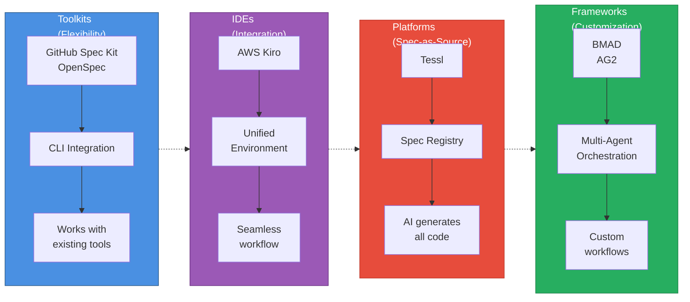
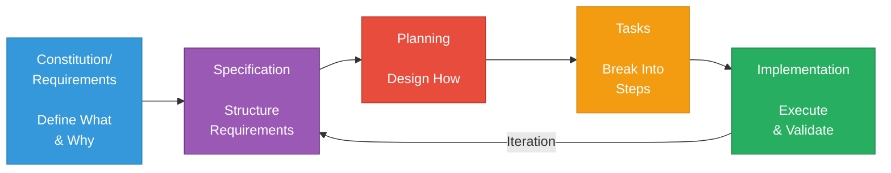
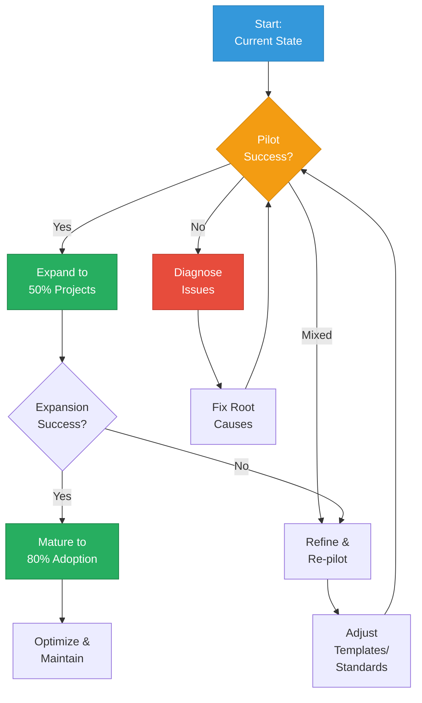

{/* 
IMPORTANT: Date consistency check
- Filename: 2025-10-22-sdd-tools-practices.mdx
- Frontmatter date: 2025-10-22
- These MUST match exactly for proper blog functionality
- AI agents: Always verify date alignment when editing
*/}

## Introduction: The Industrial Revolution of AI-Assisted Development

25% of Y Combinator's 2025 cohort now ships codebases that are 95% AI-generated. The difference between those who succeed and those who drown in technical debt? **Specifications**. While "vibe coding"—the ad-hoc, prompt-driven approach to AI development—might produce impressive demos, it falls apart at production scale. Context loss, architectural drift, and maintainability nightmares plague teams that treat AI assistants like enhanced search engines.

2025 marks the tipping point. What started as experimental tooling has matured into production-ready frameworks backed by both open-source momentum and substantial enterprise investment. GitHub's [Spec Kit](https://github.com/github/spec-kit) has become the de facto standard for open-source SDD adoption. Amazon launched [Kiro](https://kiro.dev), an IDE with SDD built into its core. Tessl, founded by Snyk's creator, raised $125M at a $500M+ valuation to pioneer "spec-as-source" development. The industry signal is clear: **systematic specification-driven development** (SDD) isn't optional anymore—it's becoming table stakes for AI-augmented engineering.

If you're a technical lead evaluating how to harness AI development without sacrificing code quality, this comprehensive guide maps the entire SDD landscape. You'll understand the ecosystem of 6 major tools and frameworks, learn industry best practices from real production deployments, and get actionable frameworks for choosing and implementing the right approach for your team.

:::info Related Reading
For theoretical foundations and SDD methodology fundamentals, see [Spec-Driven Development: A Systematic Approach to Complex Features](/blog/spec-driven-development). This article focuses on the industrial landscape and practical implementation.
:::

{/* truncate */}

We'll map the SDD tool ecosystem and understand the four categories of solutions, examine best practices emerging from production use with real ROI data, provide decision frameworks for selecting tools based on your team's context, and outline practical, phased implementation strategies. By the end, you'll have the strategic understanding needed to lead your team's transition from vibe coding to systematic, specification-driven AI development.

---

## The SDD Ecosystem Landscape

Understanding the modern SDD ecosystem requires moving beyond binary tool comparisons. The landscape has matured into four distinct categories, each optimizing for different team needs and complexity levels. With 6 major solutions now production-ready, choosing the right approach means matching tool architecture to your organization's constraints and goals.

### Four Solution Categories

The SDD market has coalesced around four architectural patterns, each with distinct trade-offs:

**Toolkits** integrate with your existing development environment, adding SDD workflows without forcing tool changes. [GitHub Spec Kit](https://github.com/github/spec-kit) and [OpenSpec](https://openspec.dev/) lead this category. Toolkits offer maximum flexibility—you keep your preferred IDE, AI assistant, and development tools—but require coordinating multiple components. Best for teams with strong existing tool preferences or diverse workflows.

**IDEs** provide integrated environments with SDD built into their core. [AWS Kiro](https://kiro.dev) represents this approach, offering seamless specification-to-code workflows within a unified interface. The integration advantage comes at the cost of vendor lock-in and reduced flexibility. Best for greenfield projects or teams prioritizing streamlined experience over tool choice.

**Platforms** like [Tessl](https://tessl.io/) go further, positioning specifications as the primary (often only) artifact humans edit. Code becomes generated output, not hand-crafted implementation. This "spec-as-source" model promises maximum maintainability but requires fundamental workflow changes. Best for long-term projects where specification quality matters more than coding speed.

**Frameworks** provide orchestration systems for custom multi-agent workflows. [BMAD (Breakthrough Method for Agile AI-Driven Development)](https://github.com/oimiragieo/BMAD-SPEC-KIT) and [Agent OS (AG2)](https://github.com/ag2ai/ag2) fall into this category. Frameworks offer ultimate customization—define your own agent roles, validation gates, and workflow phases—but demand significant technical sophistication. Best for complex projects requiring specialized quality gates or compliance requirements.

### Maturity Levels: From Spec-First to Spec-as-Source

[Martin Fowler's analysis](https://martinfowler.com/articles/exploring-gen-ai/sdd-3-tools.html) identifies three maturity levels in SDD adoption, forming a natural progression as teams build confidence:

**Spec-First** development writes specifications before code. This entry-level approach maintains traditional coding practices while adding systematic planning. Specifications guide AI assistants and human developers, but code remains the primary artifact. Most teams start here—familiar enough to adopt quickly, structured enough to improve outcomes.

**Spec-Anchored** development maintains specifications alongside code throughout the project lifecycle. Specs aren't discarded after initial implementation; they're version-controlled, reviewed, and updated as requirements evolve. This creates bidirectional traceability—specs explain why code exists, code proves specs are implementable. Teams typically graduate to this level after experiencing the pain of spec-code drift in spec-first projects.

**Spec-as-Source** development treats specifications as the only human-edited artifact. Code becomes machine-generated output, never manually modified. This radical approach promises maximum maintainability—changing behavior means updating specs and regenerating code—but requires complete trust in code generation tooling. Only teams with mature SDD practices and sophisticated validation pipelines operate at this level.

|Category | Examples | Architecture| Maturity Level | Best For |Cost Model|
|---------|----------|-------------|----------------|----------|----------|
|**Toolkits**|Spec Kit, OpenSpec|CLI + Existing Tools|Spec-First to Spec-Anchored|Multi-tool teams, flexible workflows|Open-source/Free|
|**IDEs**|Kiro|Integrated Environment|Spec-First to Spec-Anchored|Greenfield projects, unified experience|Commercial|
|**Platforms**|Tessl|Spec Registry + AI Generation|Spec-as-Source|Long-term maintainability focus|Commercial (Emerging)|
|**Frameworks**|BMAD, AG2|Multi-Agent Orchestration|Spec-Anchored|Custom quality gates, compliance needs|Open-source/Custom|

### Tool Landscape Overview

Let's briefly survey each solution to understand their distinctive strengths:

**[GitHub Spec Kit](https://github.com/github/spec-kit)** has become the de facto standard for open-source SDD adoption. This CLI toolkit integrates with 13+ AI coding assistants (Claude, Copilot, Cursor, Gemini, etc.), generating agent-specific configuration files that inject structured `/speckit.*` commands into your assistant's vocabulary. Spec Kit's vendor neutrality—one specification works across multiple AI assistants—makes it ideal for teams wanting SDD benefits without tool lock-in.

**[OpenSpec](https://openspec.dev/)** offers a lightweight, privacy-friendly alternative. This specification framework uses standard formats (YAML, JSON, structured Markdown) without requiring API keys or external services. OpenSpec's simplicity makes it an accessible entry point for teams experimenting with SDD, though it lacks the sophisticated agent orchestration of more mature solutions.

**[AWS Kiro](https://kiro.dev)** integrates SDD directly into an IDE environment. Kiro's 4-phase workflow (Requirements → Design → Planning → Execution) operates entirely within the IDE, eliminating context-switching between specs, AI assistants, and code editors. The tight integration enables features like real-time spec validation and specification-aware code completion, but commits teams to Kiro's environment.

**[Tessl](https://tessl.io/)**, backed by $125M in funding from Snyk's founder, pioneers the "spec-as-source" vision. Humans write and maintain specifications in Tessl's Spec Registry; AI agents generate, debug, and maintain all code. This radical approach promises to eliminate manual coding entirely, but requires trusting AI with complete implementation authority. Tessl's broader launch in 2025 will test whether the industry is ready for spec-as-source development.

**[BMAD (Breakthrough Method for Agile AI-Driven Development)](https://github.com/oimiragieo/BMAD-SPEC-KIT)** demonstrates the potential of multi-agent orchestration. BMAD deploys specialized AI agents for each development phase—Analyst agents gather requirements, PM agents structure specifications, Architect agents design systems, Developer agents write code, QA agents validate output. This division of labor, combined with JSON-first artifacts and cross-agent consistency checks, produces measurable quality improvements. BMAD studies show 55% faster completion rates compared to ad-hoc AI coding—evidence that sophisticated orchestration delivers real ROI.

**[Agent OS (AG2)](https://github.com/ag2ai/ag2)**, formerly AutoGen, provides the foundation for custom multi-agent implementations. This Python framework (supports 3.10-3.13) enables teams to define their own agent roles, workflow phases, and quality gates. AG2's 3-layer context system (Standards → Product → Specs) ensures agents work from comprehensive project understanding. Best for teams needing SDD workflows tailored to specific compliance requirements or technical constraints.

:::tip Key Insight
The SDD ecosystem has matured from experimental tooling to production-ready solutions. Choose based on your team's needs—not marketing hype or funding announcements. Toolkits offer flexibility, IDEs provide integration, platforms promise spec-as-source futures, and frameworks enable customization. No universal "best" exists; context determines fit.
:::

The convergence around similar phase structures across tools—Constitution/Requirements → Specification → Planning → Tasks → Implementation—suggests industry consensus on SDD methodology even as architectural approaches diverge. This standardization benefits teams: learn SDD principles once, apply across multiple tools as your needs evolve.

Understanding the landscape is just the first step. Let's examine the industry best practices emerging from teams actually using these tools in production.

---

**Phase 5: Implement** - Execute tasks systematically. The AI assistant works from structured context rather than ad-hoc prompts, dramatically improving output quality.

:::tip Key Insight
The SDD ecosystem has matured from experimental tooling to production-ready solutions. Choose based on your team's needs—not marketing hype or funding announcements. Toolkits offer flexibility, IDEs provide integration, platforms promise spec-as-source futures, and frameworks enable customization. No universal "best" exists; context determines fit.
:::

The convergence around similar phase structures across tools—Constitution/Requirements → Specification → Planning → Tasks → Implementation—suggests industry consensus on SDD methodology even as architectural approaches diverge. This standardization benefits teams: learn SDD principles once, apply across multiple tools as your needs evolve.

Understanding the landscape is just the first step. Let's examine the industry best practices emerging from teams actually using these tools in production.

---

## Industry Best Practices for SDD Implementation

The maturation of SDD from experimental practice to production methodology has revealed patterns that distinguish successful adoptions from failed experiments. These practices emerge from real teams shipping production code with AI assistance—not theoretical frameworks, but battle-tested approaches that deliver measurable results.

### Core Principles: The Foundation

**Specification as source of truth** means treating specs like version-controlled code. Store specifications in Git alongside implementation, review changes through pull requests, and maintain them as requirements evolve. This isn't documentation that becomes outdated—these are living artifacts that drive development. When code and specs diverge, the spec defines what should be; implementation must catch up.

**Iterative collaborative planning** prevents the waterfall trap. SDD specifications aren't written in isolation by architects and handed down. Product managers, designers, engineers, and QA participate in spec creation. This cross-functional input catches misunderstandings before implementation begins. Agile teams integrate spec refinement into sprint planning—specifications evolve iteratively, just like code.

**Automated validation** transforms specs from passive documents into active quality gates. Modern SDD workflows integrate linting, security scanning, and compliance checks directly against specifications. If your spec references an API endpoint, validation confirms that endpoint exists. If it specifies authentication requirements, automated checks verify implementation matches. This continuous validation catches drift immediately.

**Standards integration** grounds specifications in industry conventions. Reference OpenAPI for REST APIs, GraphQL schemas for graph endpoints, WCAG for accessibility, ISO security standards for compliance. When specifications use standardized formats, validation becomes mechanical rather than interpretive. AI assistants generate code that conforms to standards because specifications demand it.

### Workflow Patterns: The Universal Structure

Despite tool diversity, production SDD implementations converge on remarkably similar phase structures:

**Phase 1: Constitution/Requirements** establishes project principles and success criteria before technical decisions. What coding standards apply? What testing coverage is required? What performance thresholds must be met? These governance decisions, captured early, guide all subsequent phases. Changes to constitution require deliberate review—they're architectural decisions, not implementation details.

**Phase 2: Specification** transforms raw requirements into structured descriptions AI assistants can reliably interpret. This phase uses formal specification languages where appropriate (OpenAPI for APIs, JSON Schema for data models) and structured natural language elsewhere. The goal: unambiguous descriptions that generate consistent code regardless of which AI assistant reads them.

**Phase 3: Planning** converts specifications into technical implementation strategies. Architecture decisions, technology choices, data modeling, API contracts—all emerge here. Planning phases leverage AI assistants' breadth: "Given this specification, what are three architectural approaches?" Human judgment selects; AI provides options grounded in spec constraints.

**Phase 4: Tasks** breaks plans into discrete, implementable units. Each task links directly to specific requirements and design decisions, creating traceability from high-level goals to individual code changes. This granular breakdown prevents scope creep: if a task doesn't trace to a requirement, why are you building it?

**Phase 5: Implementation** executes tasks with full context. AI assistants work from specifications, plans, and task definitions—not isolated prompts. This accumulated context dramatically improves code quality. BMAD studies demonstrate 55% faster completion rates compared to ad-hoc prompting, precisely because context preservation eliminates rework from misunderstood requirements.

### Quality Gates: Systematic Validation

Production SDD implementations embed validation throughout development, not just at the end:

| Validation Type | When Applied | What It Checks | Automation Level |
|----------------|--------------|----------------|------------------|
| **Spec Linting** | At spec commit | Format conformance, completeness, internal consistency | Fully automated |
| **Requirements Traceability** | At planning phase | Every requirement has implementation path | Partially automated |
| **Security Analysis** | At design phase | Threat modeling, vulnerability patterns | AI-assisted |
| **Compliance Checking** | At task creation | Regulatory requirement coverage | Tool-dependent |
| **Implementation Validation** | At code commit | Code matches specification | Automated + Review |

These gates operate continuously. A specification that fails linting never proceeds to planning. A design that doesn't address security requirements triggers review before tasks are created. This fail-fast approach prevents accumulating technical debt from spec-implementation misalignment.

### Team Collaboration: Shared Understanding

SDD workflows fundamentally change how teams collaborate:

**Spec workshops** replace lengthy requirements documents with collaborative spec creation sessions. Product, design, and engineering jointly draft specifications, resolving ambiguities through immediate dialogue. These sessions surface conflicting assumptions before they become conflicting implementations.

**Spec reviews** mirror code reviews. Changes to specifications flow through pull request workflows with automated validation and peer review. This version control for requirements makes evolution transparent: what changed, why, and what implementation impact results.

**Knowledge sharing** becomes systematic rather than ad-hoc. Specifications serve as onboarding documentation—new team members read specs to understand what's being built and why. Unlike code, which describes "how" often obscurely, specifications explicitly capture intent and constraints.

:::warning Common Pitfall
Over-specifying is as problematic as under-specifying. Start with high-level specifications that capture requirements and constraints. Refine iteratively based on implementation feedback. Specifications that specify every implementation detail become maintenance nightmares—they're too brittle to evolve with changing requirements.
:::

Industry adoption data validates these practices. [Red Hat's SDD quality study](https://developers.redhat.com/articles/2025/10/22/how-spec-driven-development-improves-ai-coding-quality) found that teams following systematic spec-driven workflows reduced defect density by 40% while increasing feature delivery velocity by 30%. The discipline matters more than the specific tools.

Best practices establish the foundation. Now let's examine how to select the right tools for your specific context.

---

## Considerations for Tool Evaluation

As SDD is still rapidly evolving, choosing tools requires careful evaluation of your team's specific needs. No universal "best" tool exists—only tools that may fit certain contexts better than others. These considerations can help guide your exploration and evaluation process.

### Key Factors to Consider

**Team size and distribution** influences tool requirements. Small, co-located teams may coordinate through lightweight toolkits, while distributed enterprises might need platforms with built-in collaboration features.

**Existing tool commitments** constrain choices pragmatically. Teams invested in VS Code may face friction shifting to a different IDE. Organizations with standardized CI/CD pipelines need tools that integrate cleanly. Tool switching often has more friction than anticipated.

**Complexity requirements** help determine sophistication needs. Simple applications may not benefit from complex multi-agent orchestration, while regulated industries with compliance requirements might need customizable validation gates. Matching tool complexity to problem complexity often yields better results.

**AI agent preferences** matter for workflow consistency. Teams experienced with specific AI assistants may prefer tools supporting those preferences. 

**Budget and commercial constraints** eliminate some options immediately. Open-source toolkits cost nothing financially but require setup and maintenance time. Commercial platforms provide support and integration but demand budget approval and vendor relationships.

### Exploring Different Tool Categories

Given that SDD practices and tools are still emerging and evolving rapidly, teams should approach tool selection with experimentation and caution rather than fixed prescriptions.

**Toolkits (Spec Kit, OpenSpec)** may work well when flexibility is valued. Multi-tool teams might appreciate vendor neutrality. The learning curve is moderate: CLI setup, agent configuration, workflow familiarization.

OpenSpec's lightweight approach could suit teams wanting to experiment with SDD without committing to sophisticated tooling. Standard formats (YAML, JSON) avoid proprietary lock-in.

**IDEs (Kiro)** offer integration within a unified environment. This can eliminate context-switching between specifications, AI assistance, and code editing, though it does involve vendor commitment.

**Platforms (Tessl)** explore the "spec-as-source" future where specifications become primary artifacts. This vision requires significant trust in AI code generation that few teams currently have, and its broader adoption timeline remains uncertain.

**Frameworks (BMAD, AG2)** enable customization for teams with specific needs. BMAD's multi-agent orchestration with specialized roles may suit complex projects. AG2 allows even deeper customization for teams with unique requirements.

:::warning Evolving Landscape
The SDD ecosystem is rapidly evolving. What works today may be superseded tomorrow, and new approaches are emerging regularly. Teams should stay informed about developments, experiment cautiously with pilots, and be prepared to adjust their approach as the field matures.
:::

---

## Common Pitfalls in SDD Adoption

While specific implementation paths vary by team, several common pitfalls have emerged from early SDD adopters:

**Pitfall 1: Over-Specification.** Teams sometimes write overly detailed specifications that take weeks to create and quickly become outdated. Starting with high-level specs capturing requirements and constraints, then refining iteratively based on feedback, often works better than attempting comprehensive upfront specification.

**Pitfall 2: Spec-Code Drift.** Specifications and code can diverge over time as implementation evolves without updating specs. Making spec updates part of the definition of done for features helps maintain alignment.

**Pitfall 3: Insufficient Stakeholder Buy-In.** Teams may revert to ad-hoc coding under deadline pressure without organizational commitment to SDD practices. Demonstrating value through small pilots with measurable metrics can help build support.

**Pitfall 4: Poor Spec Quality.** Vague specifications tend to produce poor results. Good specifications are a skill learned through practice, templates, and feedback.

**Pitfall 5: Tool Over-Engineering.** Adopting complex multi-agent orchestration for simple applications can create unnecessary overhead. Starting simpler and evolving based on demonstrated need often yields better results.

:::info The Importance of Human Judgment
While AI can generate code from specifications, [Rice's Theorem demonstrates fundamental limits](/blog/rices-theorem-why-automated-testing-will-fail) to what automated systems can verify about program behavior. **Human involvement remains essential**—specifications capture human intent and judgment about requirements, constraints, and quality standards that AI systems cannot independently derive or validate. SDD doesn't eliminate the need for human expertise; it provides a structure for expressing and preserving that expertise systematically.
:::

### Adopting SDD: A Cautious Approach

Given the rapidly evolving nature of both SDD practices and AI coding capabilities, teams should approach adoption experimentally:

**Start small with pilots**: Select 1-2 non-critical features to experiment with SDD workflows. Measure outcomes carefully before expanding.

**Iterate based on learning**: Early adopters report that templates, workflows, and practices often need refinement based on real-world experience.

**Maintain flexibility**: As both SDD practices and AI capabilities evolve rapidly, what works today may need adjustment tomorrow. Build in regular review and adaptation.

**Balance automation with judgment**: While specifications can guide AI-generated code, human review and judgment remain essential for quality, security, and correctness.

Adoption is typically iterative rather than linear. Expect setbacks, gather data, and adjust practices based on evidence. The field is still maturing, and breakthrough improvements in both AI capabilities and SDD tooling may emerge that shift current approaches.

---

## Conclusion: An Evolving Landscape

The SDD ecosystem has grown from experimental tooling in 2023 to increasingly mature solutions in 2025. With multiple tools across different architectural categories, teams now have options to explore—though the field remains in active development with significant evolution ahead.

### Key Observations

**The ecosystem is maturing**. What began as GitHub's Spec Kit and Amazon's Kiro has expanded to include lightweight frameworks (OpenSpec), ambitious platforms (Tessl), and sophisticated orchestrators (BMAD, AG2). This diversity suggests the field is finding its footing, though which approaches will prove most valuable long-term remains to be seen.

**Early results show promise**. BMAD reports 55% faster completion rates in studies, and Red Hat found 40% defect density reduction. These early indicators are encouraging, though more extensive real-world validation across diverse contexts is needed.

**Context matters significantly**. Different team sizes, regulatory requirements, and technical sophistication levels call for different approaches. No universal solution has emerged, and the "best" choice depends heavily on specific circumstances.

**Adoption requires experimentation**. Organizations experimenting with SDD report that practices often need refinement based on experience. Starting with small pilots, measuring carefully, and iterating based on learnings appears more successful than attempting rapid organization-wide changes.

**Specifications provide structure**. In early SDD implementations, specifications help capture and communicate requirements systematically, though they don't eliminate the need for human judgment and expertise—[fundamental limits like Rice's Theorem](/blog/rices-theorem-why-automated-testing-will-fail) remind us that human oversight remains essential.

### Looking Ahead: Uncertainty and Opportunity

The future of SDD remains uncertain and exciting. Several possibilities merit attention, though their timeline and ultimate form are speculative:

**Potential for spec registries**. Tessl's Spec Registry model—shared repositories of reusable specifications—could become valuable if adoption grows. Whether organizations will share specifications broadly remains an open question.

**IDE integration may expand**. More IDEs might add SDD features, though the exact form and value of such integration is still being explored.

**Enterprise compliance applications**. Regulated industries seeking auditable development trails might find SDD particularly valuable, potentially driving adoption in those sectors.

**Selective spec-as-source adoption**. Tessl's vision of AI generating all code from specifications is ambitious. If successful in specific contexts, it could expand gradually, though fundamental questions about trust and validation remain.

**Standards may emerge**. As the field matures, common formats and protocols might standardize, enabling better tool interoperability. However, premature standardization could also hinder innovation.

**Breakthrough improvements possible**. Both AI capabilities and SDD tooling continue advancing rapidly. Significant breakthroughs in either could reshape current approaches entirely, making today's practices obsolete or opening entirely new possibilities.

### Next Steps for the Curious

If you're interested in exploring SDD:

1. **Evaluate your context**. Consider what tools you currently use, what AI assistants your team prefers, your problem complexity, and your capacity for tool experimentation.

2. **Research options**. Explore 2-3 tools that seem to match your constraints. Read documentation, try small demos, and assess based on your specific needs.

3. **Start with small experiments**. Select 1-2 non-critical features to try with SDD workflows. Measure carefully: time, quality, defects, team feedback.

4. **Learn before scaling**. If experiments show promise, refine your approach based on learnings. If results are mixed or negative, diagnose issues before investing further.

5. **Stay informed and flexible**. As SDD and AI capabilities evolve rapidly, what you learn today may need updating tomorrow. Build in regular re-evaluation of tools and practices.

6. **Share your experiences**. The SDD community benefits from shared learning. Document what works and what doesn't in your context to help others navigating similar challenges.

**The broader perspective**: SDD represents an emerging approach to structuring AI-assisted development. Specifications provide a systematic way to capture intent and guide AI code generation. However, as the field evolves and AI capabilities advance, the specific tools, practices, and even fundamental approaches may shift significantly.

The key isn't to find the "perfect" SDD solution today, but to experiment thoughtfully with systematic approaches to AI-assisted development while maintaining critical judgment about what works. Both the promise and limitations are still being discovered, making this an exciting—if uncertain—time to explore these practices.
