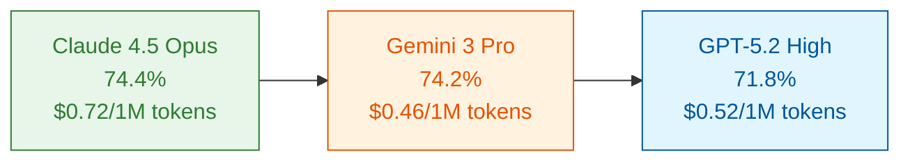

import Tabs from '@theme/Tabs';
import TabItem from '@theme/TabItem';

When [SWE-bench](https://www.swebench.com/) scores improved 50% in just 14 months—from Claude 3.5 Sonnet's 49% in October 2024 to [Claude 4.5 Opus's 74.4%](https://www.swebench.com/) in January 2026—you'd think AI agents had conquered software engineering. Yet companies deploying these agents at scale tell a different story. Triple Whale's CEO described their production journey: "GPT-5.2 unlocked a complete architecture shift for us. We collapsed a fragile, multi-agent system into a single mega-agent with 20+ tools... The mega-agent is faster, smarter, and **100x easier to maintain**."

{/* truncate */}

The gap between benchmark performance and production readiness reveals a fundamental truth about AI agents: **intelligence isn't enough**. Despite breakthrough models like [GPT-5.2](https://openai.com/index/introducing-gpt-5-2/), Claude 4.5, and Gemini 3 Pro achieving 70%+ on coding benchmarks, enterprise deployments consistently struggle with hallucination, context rot, and degraded performance over long-horizon tasks. The 2025 AI agent adoption wave exposed what academic benchmarks masked—without robust architectural patterns, even the most capable models fail in production.

This article examines the 2025-2026 inflection point where AI agent development pivoted from chasing raw model capability (speed, scale, autonomy) to valuing architectural reliability (quality, robustness, coordination). Drawing from real-world deployments—JetBrains' multi-agent IDE, Remote's LangGraph onboarding system, Intercom's 86% resolution rates—we'll explore four emerging architectural patterns that address fundamental LLM limitations:

- **Sub-agent systems** isolate context to prevent bloat
- **Spec-driven development** maintains goal alignment across sessions
- **Agent skills** enable progressive disclosure of knowledge
- **Agent blackboards** coordinate progress through shared memory

The evidence suggests that successfully deploying enterprise AI agents requires shifting from "model superiority" to "architectural reliability." Production success stories consistently demonstrate that engineering discipline—understanding constraints, applying patterns, building robust architectures—matters more than raw model capability.

## The Quality Crisis in AI Agents

The 2025 AI adoption wave created an unexpected paradox. While model capabilities soared—Claude 4.5 Opus reached 74.4% on SWE-bench, Gemini 3 Pro hit 74.2%, and GPT-5.2 achieved 71.8% with high reasoning mode—enterprise deployments revealed systematic quality issues that benchmarks couldn't capture. The problem wasn't model intelligence but architectural resilience.

### The Adoption-Quality Gap

Consider the trajectory of just 14 months: Claude 3.5 Sonnet launched in October 2024 at 49% on SWE-bench Verified. By January 2026, top models clustered around 70-75%. A **50% improvement** should have made AI agents production-ready. Yet companies building real systems consistently needed custom architectural patterns beyond base model capabilities.

Triple Whale's experience illustrates the challenge. Despite having access to state-of-the-art models, their initial multi-agent system proved "fragile" in production. The breakthrough came not from a better model but from an architecture shift—collapsing complexity into a single mega-agent with 20+ specialized tools. [JetBrains](https://claude.com/customers) built multi-agent IDE orchestration, [Remote](https://blog.langchain.com/customers-remote/) developed LangGraph-based customer onboarding, [Intercom](https://claude.com/customers) achieved 86% resolution rates—all required architectural patterns the models themselves couldn't provide.

Recent research identified the root cause. The January 2026 paper ["Agentic Uncertainty Quantification"](https://arxiv.org/abs/2601.15703) describes a **"Spiral of Hallucination"** where early epistemic errors propagate irreversibly through multi-step reasoning chains. A companion paper on ["Agentic Confidence Calibration"](https://arxiv.org/abs/2601.15778) found that **"overconfidence in failure remains a fundamental barrier to deployment in high-stakes settings."** Models don't just make mistakes—they confidently deliver wrong answers that block production deployment.

### Root Cause: Context Limitations

The quality crisis stems from fundamental LLM architecture constraints. As conversations extend over hours or days, several failure modes emerge:

| Failure Mode | Manifestation | Production Impact |
|--------------|---------------|-------------------|
| **Context bloat** | Verbose tool calls, conversation history accumulation | Long coding sessions degrade, original goals lost |
| **Hallucination spirals** | Early errors compound through reasoning chains | Multi-step workflows produce confidently wrong results |
| **Goal divergence** | Design decisions drift from original requirements | Technical debt from misaligned implementations |
| **Edge case brittleness** | Unusual scenarios trigger unpredictable behavior | Reliability issues despite high average performance |

Long-running agents—multi-hour coding sessions, complex research tasks, iterative design workflows—hit context limits that short benchmark tests never exercise. A model scoring 74% on isolated coding problems might degrade to 40% effective accuracy over a 3-hour debugging session as context fills with dead-end attempts and intermediate state.

### The Performance Plateau

Cost-performance analysis reveals why architectural patterns matter more than raw model capability. The top three models on SWE-bench Verified cluster within 5 percentage points:

Claude 4.5 Opus costs **2.7x more** than GPT-5.2 high reasoning mode for just a **7.8% performance gain** (74.4% vs 71.8%). This diminishing returns curve suggests we've hit architectural bottlenecks—not model limitations. OpenAI's marketing acknowledges this reality: GPT-5.2 is explicitly positioned as an "advanced frontier model **for professional work and long-running agents**," recognizing that architectural support matters for production deployment.

Similarly, the [OSWorld](https://os-world.github.io/) computer use benchmark shows dramatic 14-month progress—Claude 3.5 Sonnet launched at 14.9% in October 2024, while Claude Sonnet 4.5 now leads at 62.9%—yet still trails human performance of 72.36%. The persistent gap despite 4x improvement highlights that agent reliability requires more than raw model intelligence.

### Diverse Failure Modes

Production deployments exposed failure patterns that benchmarks miss:

**Coding agents**: Design-goal divergence accumulates over multi-file refactors. An agent might successfully implement individual components while drifting from the original architectural requirements, creating technically correct but systemically misaligned code.

**Research agents**: Information retrieval drifts as context fills. Early research directions bias later synthesis, and contradictory findings get reconciled through hallucination rather than acknowledging uncertainty.

**UI automation**: Navigation becomes brittle under context-dependent conditions. [Anthropic's initial assessment](https://www.anthropic.com/news/developing-computer-use) of Claude 3.5's computer use noted: "Even though it's the current state of the art, Claude's computer use remains **slow and often error-prone**."

**Multi-agent systems**: Coordination overhead compounds as agents maintain separate context. Shared goals fragment, agents repeat completed work, and conflicting objectives emerge from divergent understanding of project state.

The industry response acknowledges these systematic issues. Anthropic frames computer use capability as teaching ["general computer skills—allowing it to use a wide range of standard tools"](https://www.anthropic.com/news/3-5-models-and-computer-use) rather than task-specific optimization. But even this paradigm shift requires architectural patterns to handle the reliability gap between benchmark performance and production requirements.

## Architectural Patterns for Agent Quality

Four architectural patterns emerged from production deployments as essential quality mitigations. Each addresses specific LLM limitations, and successful systems typically combine multiple patterns rather than relying on any single approach.

### Pattern 1: Sub-Agent Systems (Context Isolation)

**The problem**: Master agent context bloats during multi-step workflows. Semantic search across large codebases returns thousands of code snippets. Multi-file research accumulates verbose documentation. Complex debugging sessions generate dead-end explorations. Each operation fills precious context with information that only matters for that specific subtask.

**The solution**: Isolate verbose operations in separate agent sessions with bounded context. The parent agent spawns a sub-agent, provides a focused task description, and receives back a summarized result. The sub-agent's context—with all its tool call verbosity and intermediate reasoning—gets discarded after returning its findings.

[VS Code's `runSubagent` tool](https://code.visualstudio.com/docs/copilot/chat/chat-tools) demonstrates the pattern. Each sub-agent invocation runs in an isolated context with stateless execution. The parent agent might ask a sub-agent to "search the codebase for authentication implementations" without polluting its own context with hundreds of code search results. The sub-agent explores, synthesizes findings, and returns a concise summary like "Found 3 authentication patterns: OAuth2 in `auth/oauth.ts`, JWT in `auth/jwt.ts`, session-based in `auth/session.ts`." The parent's context stays clean.

[LangChain DeepAgents](https://docs.langchain.com/oss/python/deepagents/overview) provides a `task` tool for spawning specialized sub-agents. [Amazon Bedrock](https://aws.amazon.com/bedrock/agents/) uses a supervisor pattern where a coordinator agent delegates to specialized agents for coding, research, and planning—each maintaining separate context. [SWE-agent](https://github.com/SWE-agent/SWE-agent) achieves 65% on SWE-bench Verified through mini-agent decomposition, breaking complex coding tasks into focused subtasks.

**Use cases**: Codebase exploration without context pollution, parallel research branches maintaining separate investigation threads, isolated testing workflows that don't bloat the main development session.

**Benefit**: Context stays fresh across long sessions. Memory usage stays bounded. Parallel execution becomes possible—spawn multiple sub-agents for independent research threads without cross-contamination.

### Pattern 2: Spec-Driven Development (Context Persistence)

**The problem**: Long-horizon tasks lose original goals. A multi-day feature development starts with clear requirements but accumulates design decisions, workarounds, and compromises without documenting why. When the agent resumes after interruption—or when context rotates to accommodate new information—the original intent gets lost. Design-goal divergence creates technically correct implementations that miss the actual requirements.

**The solution**: Create persistent specification documents before implementation. Agents reference specs throughout execution to validate alignment. The spec lives in the file system—outside agent context—providing a stable reference point that survives session restarts and context rotations.

[Claude Code's Plan mode](https://code.claude.com/docs/en/common-workflows#use-plan-mode-for-safe-code-analysis) exemplifies this pattern. The agent operates in read-only mode, using the `AskUserQuestion` tool to gather requirements and clarify goals before proposing any implementation plan. Consider a complex authentication refactor: Plan mode analyzes the current codebase, asks clarifying questions about backward compatibility and database migration requirements, then generates a comprehensive execution plan. The plan gets reviewed and refined through iterative questions before any code changes begin. This catches misalignments during the planning phase—when fixes cost minutes, not hours of debugging.

[Amazon Kiro](https://aws.amazon.com/bedrock/agents/) provides project-level planning with dependency tracking. [LeanSpec](https://leanspec.dev/) offers lightweight spec management integrated with git for technical teams. [OpenSpec](https://github.com/openspec-dev/openspec) brings spec-driven workflows to open-source projects. All share the core pattern: persistent documents that outlive any single conversation context.

**Use cases**: Feature development maintaining coherent design across multiple sessions, API design coordinating between frontend and backend teams, system refactors preserving architectural requirements, cross-team coordination with shared specifications.

**Benefit**: Goal alignment persists across sessions and restarts. Early divergence detection catches misalignment during planning phase when fixes cost minutes, not hours. Human review checkpoints inject domain expertise at critical decision points. The spec becomes project documentation—capturing not just what was built, but why.

### Pattern 3: Agent Skills (Progressive Disclosure)

**The problem**: Loading all documentation, capabilities, and guidelines upfront wastes context. A polyglot codebase might have Python, TypeScript, Rust, and Go style guides totaling thousands of tokens. Security guidelines for authentication code don't help when writing CSS. Framework-specific patterns clutter context when working on vanilla JavaScript. Irrelevant information creates noise and crowds out task-relevant details.

**The solution**: Dynamically load knowledge based on detected task requirements. The system monitors what the agent is working on and injects just-in-time context. Editing authentication code? Load security guidelines. Working on React components? Inject React 19 best practices. Opening a Rust file? Provide Rust idioms.

The [agentskills.io format](https://agentskills.io/) standardizes this pattern. Compatible with Claude, Cursor, GitHub Copilot, and VS Code, it defines skill bundles that load conditionally. A repository might have separate skills for frontend, backend, security, deployment—each activated only when relevant to the current task.

Conditional instruction loading triggers domain-specific rules based on context. File path patterns determine which guidelines apply: `src/auth/**` loads security policies, `src/ui/**` loads accessibility standards. Tool discovery exposes capabilities incrementally—database tools appear when editing migration files, not when writing UI components.

**Use cases**: Polyglot codebases loading language-specific linting rules on demand, compliance requirements applying security guidelines only for sensitive code paths, framework-specific patterns avoiding React context pollution when writing Vue components.

**Benefit**: Efficient context usage—every token serves the immediate task. Reduced cognitive load—agents focus on relevant information without filtering global noise. Better specificity—domain guidelines apply precisely where needed rather than diluted across all work.

### Pattern 4: Agent Blackboard (Shared Memory)

**The problem**: Multi-call workflows lose track of progress. An agent starts implementing a feature, makes three tool calls to read files, then forgets which components still need updating. Agents repeat completed work. Goals set at conversation start fade from memory as context fills with implementation details. When sessions restart, there's no record of what was accomplished.

**The solution**: Shared memory structure accessible to all agents in a workflow. Todo lists track pending work. Progress trackers record completed steps. Decision logs capture why certain approaches were chosen. All agents can read and update this shared state, maintaining coordination across tool calls and session boundaries.

[LangChain DeepAgents](https://docs.langchain.com/oss/python/deepagents/overview) includes a built-in `write_todos` tool for planning and progress tracking. The agent writes its plan, checks off completed items, adds new tasks as requirements evolve. VS Code, Cursor, and Claude Code all implement `Todos` tools—persistent task lists that survive session restarts. [Amazon Bedrock](https://aws.amazon.com/bedrock/agents/) uses shared state where a supervisor agent coordinates sub-agents through centralized memory. LangGraph Store provides cross-thread memory persistence for agents working on related tasks across different conversations.

**Use cases**: Multi-step coding projects maintaining implementation checklists, iterative research tracking which sources have been examined, coordinated multi-agent teams sharing discovered blockers, long-running sessions resuming work after interruption with full context.

**Benefit**: All agents stay aligned on goals—no divergent understanding of objectives. No redundant work—completed tasks are marked and skipped. Clear progress visibility—humans can inspect the blackboard to understand current state. Resilient to interruption—resume from where work stopped without reconstructing mental state.

### Integration Matters

Successful deployments rarely use just one pattern. [LangChain DeepAgents](https://docs.langchain.com/oss/python/deepagents/overview) integrates all four: `write_todos` for blackboard coordination, file system tools (`read_file`, `write_file`, `edit_file`) for spec-driven persistence, `task` tool for sub-agent spawning, and LangGraph Store for cross-session memory. This architecture—inspired by Claude Code, Deep Research, and Manus—demonstrates that production resilience requires combining techniques.

The pattern combination creates emergent robustness. Sub-agents prevent context bloat during research. Specs maintain goal alignment when sub-agents return. Skills ensure each sub-agent loads only relevant knowledge. Blackboards coordinate progress across all agents. The whole exceeds the sum of its parts.

Academic research validates this multi-pattern approach. January 2026 papers on ["Agentic Confidence Calibration"](https://arxiv.org/abs/2601.15778) and ["Agentic Uncertainty Quantification"](https://arxiv.org/abs/2601.15703) recognize that systematic quality requires architectural safeguards, not just model improvements. The research community increasingly focuses on reliability patterns that complement model capabilities.

| Pattern | Problem Addressed | Key Tools | Maturity | Best For |
|---------|------------------|-----------|----------|----------|
| **Sub-agents** | Context bloat from verbose operations | VS Code runSubagent, LangChain task, Bedrock supervisor | Production | Research, codebase exploration, parallel tasks |
| **Spec-driven** | Goal divergence in long-horizon work | Claude Plan mode, LeanSpec, Amazon Kiro, OpenSpec | Production | Feature development, API design, refactors |
| **Skills** | Irrelevant information cluttering context | agentskills.io, conditional instructions | Production | Polyglot codebases, domain-specific rules |
| **Blackboards** | Lost progress in multi-step workflows | LangChain write_todos, VS Code Todos, LangGraph Store | Production | Iterative projects, multi-agent coordination |

## Engineering Over Intelligence

The architectural patterns contradict several common assumptions about AI agent deployment. Examining these counterarguments reveals why engineering discipline matters more than raw model capability.

### Addressing Counterarguments

**"Better models will solve this"**: The 50% SWE-bench improvement in 14 months (49% to 74.4%) seems to validate model-centric thinking. But top models cluster at 70-75% with diminishing returns—Claude 4.5 Opus costs **2.7x more** than GPT-5.2 high reasoning mode for just **7.8% performance gain**. Triple Whale's CEO explicitly states: ["GPT-5.2 unlocked a complete architecture shift for us"](https://openai.com/index/introducing-gpt-5-2/)—not model superiority, but architecture enabled by sufficient capability. OSWorld shows similar patterns: Claude improved **4x** to 62.9%, yet human performance at 72.36% stays ahead. The persistent gap suggests architectural solutions matter more than model upgrades.

**"RAG is sufficient"**: Retrieval-augmented generation addresses knowledge gaps but doesn't prevent production quality issues. Context still bloats as conversations extend—RAG adds information to context, worsening the problem. Hallucination spirals still occur—RAG provides facts but doesn't validate multi-step reasoning. The January 2026 research on ["Agentic Uncertainty Quantification"](https://arxiv.org/abs/2601.15703) shows epistemic errors propagate irreversibly regardless of knowledge access. RAG solves information retrieval, not architectural resilience.

**"Agents aren't production-ready"**: Production deployments prove feasibility with proper architecture. Triple Whale runs mega-agent infrastructure. [JetBrains](https://claude.com/customers) delivered multi-agent IDE experiences to thousands. [Intercom](https://claude.com/customers) achieves **86% resolution rates**. [Fastweb and Vodafone](https://blog.langchain.com/customers-vodafone-italy/) transformed customer service with LangGraph agents. The pattern: production success requires architectural patterns, not just capable models.

**"Too complex for most teams"**: Triple Whale found their mega-agent "100x easier to maintain" than fragile multi-agent systems. Complexity shifted from coordination overhead to tool design—a more tractable problem. Frameworks lower adoption barriers: [LangChain DeepAgents](https://docs.langchain.com/oss/python/deepagents/overview) provides integrated patterns, [LangGraph](https://langchain-ai.github.io/langgraph/) makes sub-agent coordination accessible, [LeanSpec](https://leanspec.dev/) offers lightweight spec-driven development. Teams can adopt patterns without building from scratch.

### The Architecture Mindset

Architecture-centric thinking has always been fundamental to software engineering—the AI era extends this discipline rather than replacing it. Pre-AI engineers designed microservices for resilience, implemented circuit breakers for fault tolerance, built message queues for decoupling. The best systems combined efficient algorithms with robust architectures. Sorting speed mattered little if the system couldn't handle failures gracefully.

**AI era patterns parallel traditional architectural concerns**: Managing context windows resembles managing memory constraints. Preventing hallucination cascades mirrors preventing error propagation. Maintaining goal alignment across sessions parallels maintaining state consistency in distributed systems. The specific patterns change—sub-agents instead of microservices, specs instead of API contracts—but the underlying principle remains constant: **production reliability requires architectural discipline that addresses system-level failure modes**.

Successful deployments combine multiple techniques. Triple Whale's mega-agent uses 20+ specialized tools. VS Code combines sub-agents with todo management. LangChain DeepAgents integrates all four patterns. This reflects timeless wisdom: reliability requires layered mitigations addressing different failure modes—not model capability alone.

### Industry Signals

Platform vendors acknowledge architectural requirements in their positioning. OpenAI markets GPT-5.2 explicitly "for professional work and **long-running agents**"—recognizing that extended sessions need architectural support beyond base model capability. The messaging implicitly admits that raw model intelligence isn't enough for production deployment.

Anthropic emphasizes making "models fit tools, not tools fit models"—but even this paradigm shift requires architectural patterns. [Computer use capability](https://www.anthropic.com/news/3-5-models-and-computer-use) teaches agents "general computer skills," yet Anthropic notes Claude 3.5's implementation remains "slow and often error-prone." The gap between capability and reliability demands the architectural patterns this article describes.

Safety considerations drive architectural focus. Prompt injection, misinformation generation, and capability misuse require safeguards beyond model-level fixes. Anthropic's safety assessment states they ["judge that it's likely better to introduce computer use now, while models still only need AI Safety Level 2 safeguards"](https://www.anthropic.com/news/developing-computer-use)—implicitly acknowledging that without architectural constraints, more capable models pose greater risks.

### Implications for Engineers

The architectural imperative creates new requirements for AI engineers:

**Study quality enhancement techniques**: Don't treat AI development as simple RAG demos. Understand sub-agent patterns, spec-driven workflows, progressive disclosure, blackboard coordination. These patterns are becoming as fundamental as knowing REST APIs or database transactions in traditional software engineering.

**Reduce human supervision through reliability**: The goal isn't agents that can do anything, but agents that reliably do specific things without constant oversight. Architectural patterns enable this by preventing common failure modes rather than requiring humans to catch and correct errors.

**Continuous learning remains essential**: The field evolves rapidly. January 2026 brought new research on confidence calibration and uncertainty quantification. Production frameworks iterate monthly. Successful engineers track emerging patterns and adapt architectures as best practices evolve.

The shift from "building RAG demos" to "engineering reliable agent systems" mirrors historical transitions. Web development matured from perl scripts to frameworks like React and Next.js. Mobile development evolved from basic apps to sophisticated SDKs. AI engineering is maturing from proof-of-concept experiments to production-grade systems with established patterns and proven practices.

## Conclusion

The 2025-2026 period marks an inflection point in AI agent development. The industry pivoted from chasing model capability—speed, scale, autonomy—to valuing architectural reliability—quality, robustness, coordination. This shift emerged from hard-won production experience. Benchmark improvements of 50% in 14 months created excitement, but enterprise deployments revealed that intelligence alone doesn't ensure reliability.

Three data points crystallize the insight. First, top models cluster at 70-75% on SWE-bench with diminishing returns—2.7x price difference between Claude 4.5 Opus and GPT-5.2 high reasoning for just 7.8% performance gain. Second, OSWorld shows dramatic model improvement (14.9% to 62.9%) yet a persistent gap to human performance (72.36%). Third, successful production deployments—Triple Whale, JetBrains, Remote, Intercom—consistently required custom architectural patterns beyond base model capabilities. The performance plateau and cost-performance analysis reveal a fundamental constraint: **engineering, not model superiority, determines production success**.

Context limitations are fundamental physics of current LLM architectures. No model escapes the constraints of attention mechanisms and memory bounds. As conversations extend over hours or days, context bloats with conversation history, verbose tool calls, and intermediate state. Multi-step reasoning chains propagate early errors. Design goals drift from original requirements. These failure modes manifest regardless of model capability, requiring architectural mitigations.

The four architectural patterns address these fundamental constraints. Sub-agent systems isolate verbose operations to prevent context bloat. Spec-driven development maintains goal alignment across session restarts through persistent documents. Agent skills enable just-in-time knowledge delivery instead of upfront context loading. Agent blackboards coordinate progress through shared memory accessible across agents and sessions. Most critically, successful deployments combine multiple patterns—LangChain DeepAgents integrates all four, demonstrating that production resilience requires layered mitigations.

Industry convergence validates the architectural imperative. VS Code implements `runSubagent` for context isolation. LangChain provides DeepAgents with integrated planning, file systems, sub-agents, and persistent memory. Amazon Bedrock offers multi-agent collaboration with supervisor coordination. Claude Code adds Plan mode for spec-driven workflows. Major platforms independently arrived at similar architectural patterns, suggesting these solutions address fundamental rather than incidental challenges.

**Engineers should**: Learn emerging patterns and understand when to apply sub-agents, spec-driven development, skills, or blackboards. Experiment with integrated approaches like LangChain DeepAgents or build custom multi-agent systems adapted to specific domains. Contribute to the ecosystem through open-source tools, documented best practices, and research participation. Most importantly, shift mindset from "building RAG demos" to "engineering reliable agent systems."

The 1-3 year outlook suggests several developments. Architectural literacy will become as critical as prompt engineering became in 2023 or RAG in 2024. Pattern standardization will continue—frameworks will abstract complexity and lower adoption barriers. A new tooling category will emerge around "agent reliability infrastructure" encompassing observability, testing frameworks, and coordination platforms. Success metrics will evolve from capability demonstrations to reliability guarantees. Integration with traditional software engineering will deepen through CI/CD for agents, agent testing frameworks, and production monitoring adapted from DevOps practices.

AI agents are maturing from impressive demos to production systems. The transition requires discipline. Understanding constraints. Applying patterns. Building robust architectures. These engineering fundamentals determine which teams successfully deploy at scale. The constraint limiting AI agent adoption isn't model capability—GPT-5.2, Claude 4.5, and Gemini 3 Pro provide sufficient intelligence. The constraint is architectural reliability. **Intelligence is abundant; reliability is scarce**. Engineers who master architectural patterns for agent quality will define the next generation of AI-powered systems.

