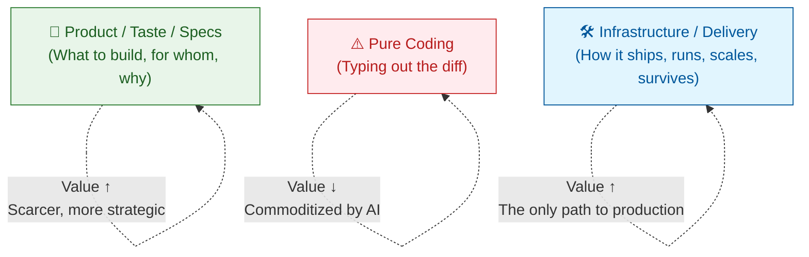
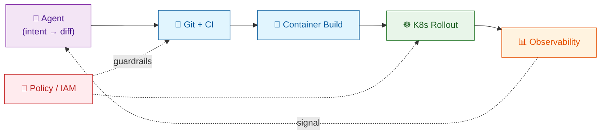

Every AI keynote in 2026 opens with the same three slides: a bigger model, a faster chip, a smarter agent. The fourth slide — the one about how any of that actually reaches a user in production — is usually missing. That missing slide is where the next decade of value will be created, and it will not be created by another round of model fine-tuning. It will be created by the most unglamorous layer in our stack: **infrastructure**.

The numbers back the hunch. [MIT's 2025 "State of AI in Business" report found that 95% of generative-AI pilots fail to reach production](https://thenewstack.io/in-2026-ai-is-merging-with-platform-engineering-are-you-ready/). [Gartner found that only 15% of IT application leaders are even piloting fully autonomous agents](https://www.gartner.com/en/newsroom/press-releases/2025-09-30-gartner-survey-finds-just-15-percent-of-it-application-leaders-are-considering-piloting-or-deploying-fully-autonomous-ai-agents), despite the agent market projected to grow from $7.8B in 2025 to $52.6B by 2030. The bottleneck is not intelligence. Frontier models [cluster around 70–75% on SWE-bench Verified](/blog/ai-agents-engineering). The bottleneck is everything between a model that can write code and an organization that can ship it — and that everything is infrastructure.

Here is the hot take, stated plainly: as coding gets cheap, **infrastructure gets scarce**. The DevOps, CI/CD, container, Kubernetes, and cloud-architecture knowledge that the AI narrative treats as "solved plumbing" is about to become the single biggest lever for turning AI capability into shipped product. The reason is simple. Agents can now write code. They cannot, by themselves, run a build, own a deploy, route a rollback, or provision a region. They need a substrate that does those things for them — and that substrate is the accumulated, low-cost, battle-tested output of two decades of DevOps work.

{/* truncate */}

This article argues that **the last mile of AI is infrastructure, not intelligence** — and that the people and teams who compound infra knowledge will out-deliver those who compound prompting tricks. We will look at where economic value migrates when coding commoditizes, why DevOps happens to be the ideal zero-cost automation substrate for AI agents, where the counter-argument (that AI will also absorb Infra) is partly right and mostly wrong, and what all of this means for what you should actually learn next.

## When Coding Gets Cheap, What Gets Expensive?

The premise is no longer controversial. [Stanford's 2025 productivity study of nearly 100,000 developers](/blog/ai-productivity) found net gains from AI of roughly 15–20% once rework is accounted for — impressive, but far from the "10x engineer" narrative. [METR's randomized controlled trial of experienced open-source developers was harsher still](https://metr.org/blog/2025-07-10-early-2025-ai-experienced-os-dev-study/): developers using AI took 19% *longer* to complete tasks, while estimating they were 20% faster — a 39-point perception gap. [A 2026 follow-up with a larger cohort softened the result to roughly −4%](https://metr.org/blog/2026-02-24-uplift-update/), but the underlying lesson held: **typing speed is not shipping speed**.

None of this proves "coding is over." It does prove that the *marginal cost of producing a correct diff* is collapsing toward zero — and that the gap between "a correct diff" and "a shipped feature" is wider, and more expensive, than the AI narrative admits. That gap is where the new value lives.

Economics has a well-worn rule for what happens when one input becomes cheap: **the complements get more valuable**. Cheap steel made skyscrapers, but it also made elevators, HVAC, and structural engineers more valuable. Cheap compute made software, but it also made databases, networking, and — yes — DevOps more valuable. The same re-pricing is now happening inside software engineering. Two layers benefit; one gets squeezed.

The **top** — product sense, specification, architectural judgment — gets more valuable because someone still has to decide what the cheap coder should build. This is the argument behind [spec-driven development](/blog/spec-driven-development) and the rise of [LeanSpec](/blog/introducing-leanspec): specs become the source of truth because code becomes a derivative asset. It is also why [AI leadership increasingly looks like curating collaborators rather than swinging a bigger hammer](/blog/ai-leadership-from-tool-to-collaborative-partner).

The **bottom** — infrastructure — gets more valuable for a different reason. A diff is not a product. A merged PR is not a product. A product is a piece of code running, safely, for real users, with observable behavior and a path back when it breaks. Everything between "agent wrote the code" and "user sees the feature" is infrastructure. And while coding has gotten 10x cheaper, **the cost of getting code from a laptop to a user has not**. The gap between those two costs is where value now concentrates.

The squeezed middle is pure coding — the typing part. That work does not disappear; it becomes table stakes. A senior engineer in 2026 who is excellent at writing functions but indifferent to how those functions get built, deployed, monitored, and rolled back is increasingly interchangeable with an agent plus a junior reviewer. A senior engineer who owns the path from idea to production is not. [We have been writing about this shape of seniority since 2022](/blog/architect-essential-skills); AI just accelerates the trajectory.

## Infrastructure as AI's Zero-Cost Automation Substrate

Here is the part of the argument that rarely gets made: AI agents do not need new infrastructure. They need the infrastructure we already built. The last fifteen years of DevOps work produced something remarkable — **a globally deployed, API-driven, declaratively configured automation fabric** — and it is sitting right there, essentially free, waiting for the right caller. That caller turned out to be agents.

The evidence is already in the surveys. The [2025 DORA State of AI-Assisted Software Development Report](https://cloud.google.com/resources/content/2025-dora-ai-assisted-software-development-report), built on nearly 5,000 practitioner responses, found that **90% of organizations have adopted at least one internal platform**, and that there is a "direct correlation between a high quality internal platform and an organization's ability to unlock the value of AI." [The New Stack's January 2026 analysis was blunter](https://thenewstack.io/in-2026-ai-is-merging-with-platform-engineering-are-you-ready/): "Platform engineering and AI are merging into one and the same, as the first emerges as the gold standard for properly, safely and efficiently deploying the second." Meanwhile the [2025 CNCF Annual Survey recorded 82% of container users running Kubernetes in production](https://www.cncf.io/announcements/2026/01/20/kubernetes-established-as-the-de-facto-operating-system-for-ai-as-production-use-hits-82-in-2025-cncf-annual-cloud-native-survey/) — up from 66% in 2023 — and declared Kubernetes "the de facto operating system for AI."

Think about what DevOps actually produced, stripped of jargon:

| Traditional Infra | What It Actually Is | Why an Agent Loves It |
| --- | --- | --- |
| **Git + CI/CD** | A deterministic way to turn a diff into a deployment | Agents emit diffs natively; pipelines turn diffs into reality |
| **Containers / OCI** | A portable, reproducible execution unit | Agents can build and run one anywhere without environment drift |
| **Kubernetes** | A declarative control loop for workloads | An agent declares desired state; K8s reconciles it |
| **IaC (Terraform, Pulumi)** | Infrastructure as a diff | Agents already speak "diff" — cloud becomes a library call |
| **Observability (OTel, Prom, logs)** | Feedback signal for running systems | Agents need evidence to close the loop; this is the evidence |
| **Secrets / IAM / policy** | Typed, auditable permission boundaries | The only safe way to let an autonomous process act |

Every row in this table is **declarative, idempotent, and API-accessible**. That is not a coincidence. DevOps spent fifteen years converting operational knowledge into YAML, HCL, and HTTP endpoints — precisely the interface an LLM-driven agent can actually use. We did not build this substrate for AI. We built it to stop paging humans at 3am. The fact that it also happens to be the ideal tool surface for autonomous agents is one of the great accidental gifts of the cloud era — [arguably a second industrial revolution sitting on top of the first](/blog/llms-industrial-revolution).

The implication is concrete. **"AI-native" does not mean rewriting your stack around vector databases.** It means wiring agents into the automation substrate you already have — the same substrate whose shape we sketched at Layer 5 of the [2026 agent landscape](/blog/agent-landscape).

A concrete example. In the old loop, a developer debugs, commits, opens a PR, waits for CI, waits for review, merges, watches a deploy, reads dashboards, and rolls back if something goes wrong. That loop took hours to days, and it burned human attention end to end. [We described the scale of this machinery in 2022 while wiring up GitHub Actions for large projects](/blog/github-actions-large-projects); none of it was invented for AI. In the emerging loop, the human describes intent, an agent produces the diff, **CI/CD is the runtime**, containers are the portability layer, Kubernetes is the scheduler, observability is the feedback channel, and policy is the guardrail. Human time collapses to intent in and approval out. Everything between is infra.

Notice what is *not* new in that picture. MCP, A2A, agent harnesses — these matter, but they are thin layers on top of a stack that was already there. The expensive, hard-won part is the boring part below. Teams without that boring part cannot ship agents to production no matter how good their prompts are; this is what the [MIT 95%-failure figure is really measuring](https://thenewstack.io/in-2026-ai-is-merging-with-platform-engineering-are-you-ready/).

:::note The core claim
Agents do not scale on intelligence. They scale on **how many deterministic, declarative, API-driven systems you can point them at**. That surface area is exactly what DevOps built.
:::

## Why Infra Knowledge Survives — And Compounds — Under AI

The obvious counter-argument is that AI will eat infrastructure too. Operators will become self-healing. Agents will write Terraform. Kubernetes will become an implementation detail that no one sees. All of this is partly true. None of it invalidates the thesis. Three reasons.

**First, infra is stateful, and state is where LLMs are weakest.** Writing a function is a stateless problem: inputs in, outputs out, tested in isolation. Running a system is a stateful problem: a given action's correctness depends on the current state of the cluster, the current load, the current version, the current incident, the current week of the billing cycle. LLMs hallucinate confidently on stateful problems because their training distribution is code, not running systems — a failure mode we [analyzed at length in the AI Agents Engineering piece](/blog/ai-agents-engineering). The [2025 DORA report puts the same point numerically](https://www.infoq.com/news/2026/03/ai-dora-report/): AI adoption correlates positively with throughput but *also* with "higher instability, leading to more change failures, increased rework, and longer cycle times to resolve issues." Typing faster is easy; staying stable is not. Humans who understand state will remain in the loop longer than humans who understand syntax.

**Second, infra failure has blast radius.** A bad function in a PR is caught by a test — though even that is [less certain than we like to pretend](/blog/rices-theorem-why-automated-testing-will-fail). A bad Helm chart in production is a paged incident, a customer apology, and sometimes a board call. Systems with large blast radius get human oversight for structural reasons, not sentimental ones. [Gartner's 2025 survey of 360 IT application leaders](https://www.gartner.com/en/newsroom/press-releases/2025-09-30-gartner-survey-finds-just-15-percent-of-it-application-leaders-are-considering-piloting-or-deploying-fully-autonomous-ai-agents) found just 15% considering fully autonomous agents, with "governance, maturity and agent sprawl" named as the top blockers. As agents take on more of the typing, the remaining human value moves toward exactly the decisions whose cost of being wrong is highest — which is almost always an infra decision: what to deploy, where, with what guarantees, and how to unwind it. That work does not get automated away; it gets *concentrated* in fewer, higher-leverage people.

**Third, infra is glue, and glue is where context lives.** A working production system is the intersection of networking, identity, data, secrets, compliance, cost, and latency. No layer makes sense in isolation; this is exactly the kind of [irreducible complexity we wrote about in 2022](/blog/software-project-complexity). The skill of holding all of those in your head at once — the skill [we previously described as the architect's essential skill](/blog/architect-essential-skills) — is exactly the skill an agent cannot borrow from its training set, because your system's particular intersection does not exist in the training set. Agents can generate plausible Terraform. They cannot know that your company's compliance team already rejected that exact VPC peering shape last quarter. This is the same reason [building enterprise-grade AI applications requires architectural judgment that models alone cannot supply](/blog/enterprise-ai-application-architecture).

What *does* change is how infra skill expresses itself. It stops being measured in "can you type `kubectl`" and starts being measured in "can you design a surface an agent can safely act on." The SRE of 2026 writes fewer runbooks and more **policies, contracts, and guardrails**. Less `kubectl rollout`, more admission controllers and OPA rules. Less manual triage, more auto-remediation with human approval gates. The skill migrates up the stack — from operation to architecture — but it does not go away. It becomes *more leveraged*.

There is a historical echo here. Cloud did not eliminate sysadmins; it reshaped them into SREs, who are more valuable than sysadmins ever were. AI will not eliminate SREs; it will reshape them into **agent platform engineers**, who will be more valuable still. The market is already pricing this in: the [2025 DevOps Job Market Report clocks a $177,500 median salary for DevOps roles](https://devopsprojectshq.com/role/devops-market-h2-2025/), and platform-engineering roles command specialization premiums as companies scale past the generic "DevOps engineer" title. Each transition compressed the manual labor of the prior generation and raised the ceiling on what a single well-equipped engineer could deliver.

## What This Means for What You Actually Learn Next

If the thesis holds, the career advice is uncomfortable and specific. "Learn to prompt" is not the answer. "Learn to code faster with AI" is not the answer. The answer is to invest, deliberately, in the skills that make you the person who owns the path from an agent's diff to a user's screen.

[Gartner projects that 40% of enterprise applications will feature task-specific AI agents by the end of 2026, up from less than 5% in 2025](https://www.gartner.com/en/newsroom/press-releases/2025-08-26-gartner-predicts-40-percent-of-enterprise-apps-will-feature-task-specific-ai-agents-by-2026-up-from-less-than-5-percent-in-2025). That is an 8x jump in agent surface area in twelve months, against a backdrop where [77% of engineering leaders already identify AI integration in apps as a major challenge](https://www.gartner.com/en/newsroom/press-releases/2025-05-22-gartner-survey-finds-77-percent-of-engineering-leaders-identify-ai-integration-in-apps-as-a-major-challenge). The people who can absorb that curve are the people who speak infra.

A short, ranked list of what compounds:

1. **CI/CD fluency.** Not "I can write a GitHub Action." More like: "I can design a pipeline that an agent pushes to 40 times a day, with policy gates, cached builds, preview environments, and automatic rollback." Every serious agent deployment in 2026 is bottlenecked here. [The GitHub Actions series from 2022](/blog/github-actions) and the [large-project follow-up](/blog/github-actions-large-projects) are a decent starting shape for that skill.
2. **Infrastructure as Code.** Terraform, Pulumi, Crossplane. Not because you will write more of it by hand, but because agents will write tons of it and someone has to own the *design* — the module boundaries, the state layout, the drift policy, the blast radius budget.
3. **Kubernetes and the control-loop model.** Less about memorizing resources, more about internalizing how declarative reconciliation works. With [82% of container users now running Kubernetes in production](https://www.cncf.io/announcements/2026/01/20/kubernetes-established-as-the-de-facto-operating-system-for-ai-as-production-use-hits-82-in-2025-cncf-annual-cloud-native-survey/), the control loop is the mental model agents will increasingly inhabit. If you understand it, you can design agent workflows that compose with it instead of fighting it.
4. **Observability.** Logs, metrics, traces, OpenTelemetry. Agents need feedback. You design the feedback. Teams that skip this end up with confidently wrong agents, because the agent never sees that its last fix made latency worse.
5. **Policy, identity, and secrets.** The only way autonomous agents become safe is typed permission. Learn IAM, OPA, Kyverno, and the secret-management patterns that make "agent has write access to prod" a survivable sentence.
6. **Cost and performance.** Someone has to know what a million agent calls actually cost, and why the cheapest deploy is not always the fastest one. This used to be a FinOps specialty. In an agent world, it is everyone's problem.

Notice what is missing from that list: another framework, another language, another IDE. Not because those are unimportant, but because their half-life is shrinking while the items above keep compounding. A Kubernetes insight from 2020 is still useful in 2026. A prompt trick from 2024 is already obsolete.

:::tip For teams
If you are asking "how do we become AI-native?", the wrong first move is to buy a model or hire prompt engineers. The right first move is to **audit your delivery substrate**. Can an agent open a PR? Can it trigger CI? Can it get a preview environment? Can it read production metrics, safely, scoped to one service? Can it roll back without paging a human? If any of those is a "no," your agent strategy is capped at that ceiling. Fix the substrate first. The [DORA 2025 report's central finding](https://cloud.google.com/blog/products/ai-machine-learning/announcing-the-2025-dora-report) — "AI is an amplifier; it makes strong teams stronger and struggling teams more chaotic" — is really a statement about substrate quality.
:::

## The Boring Stack Wins

The easy prediction in 2026 is that models get bigger, chips get faster, and agents get smarter. That prediction is correct, and it is not where the money is. The money is in the least glamorous layer of the stack — the pipelines, the clusters, the policies, the dashboards — because that is the layer that converts model capability into delivered product. Intelligence without infrastructure is a demo. Intelligence plus infrastructure is a business.

The hot take, restated: **coding is commoditizing; infrastructure is not.** DevOps did not become less relevant when AI learned to write Python. It became the substrate on which autonomous software delivery will actually happen. The pipelines built to stop 3am pages are now the same pipelines that let a single engineer ship what used to take a team. The declarative APIs built for humans who hated clicking through cloud consoles are now the action surface for agents that cannot click at all. The observability stack built to explain yesterday's outage is now the feedback loop that keeps tomorrow's agents honest.

Every major 2025 data point lands on the same bottom line. [95% of genAI pilots fail to reach production](https://thenewstack.io/in-2026-ai-is-merging-with-platform-engineering-are-you-ready/). [90% of high-performing teams run an internal platform](https://cloud.google.com/resources/content/2025-dora-ai-assisted-software-development-report). [82% of container workloads are on Kubernetes](https://www.cncf.io/announcements/2026/01/20/kubernetes-established-as-the-de-facto-operating-system-for-ai-as-production-use-hits-82-in-2025-cncf-annual-cloud-native-survey/). [15% of enterprises feel ready for autonomous agents](https://www.gartner.com/en/newsroom/press-releases/2025-09-30-gartner-survey-finds-just-15-percent-of-it-application-leaders-are-considering-piloting-or-deploying-fully-autonomous-ai-agents). These numbers do not describe an intelligence problem. They describe a plumbing problem — and plumbing is infrastructure.

None of this makes for a good keynote slide. It will not go viral on X. It will, however, quietly decide which companies turn 2026's model capability into 2027's shipped products — and which ones are still writing prompts into a chat window, wondering why nothing ever reaches production.

AI's last mile is not a smarter model. It is a better pipeline.
