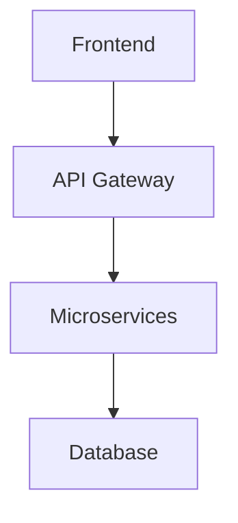
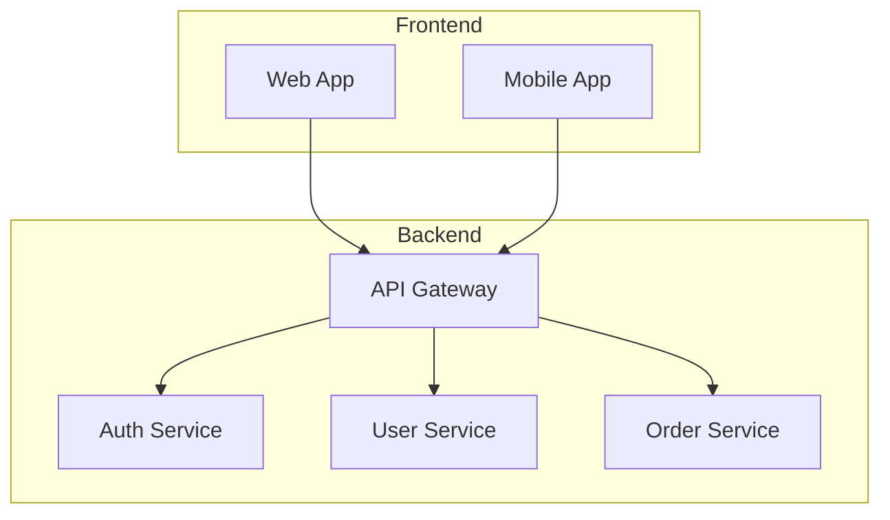
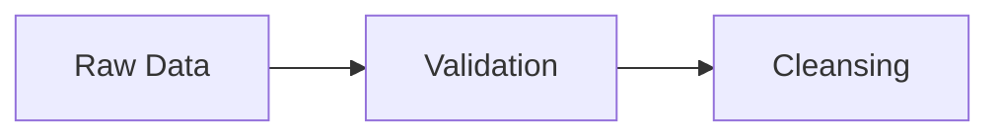
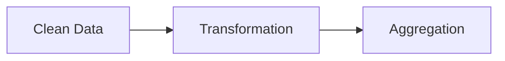

# Mermaid Workflow for Blog & WeChat Publishing

This workflow allows you to write blog posts with embedded Mermaid diagrams and automatically convert them for WeChat publishing.

## Overview

1. **Write blog posts** with Mermaid diagrams using `@docusaurus/theme-mermaid`
2. **Extract diagrams** from blog articles to temporary files
3. **Generate WeChat-ready markdown** with diagrams converted to images

## Setup

The following packages are configured:
- `@docusaurus/theme-mermaid` - For interactive diagrams in Docusaurus
- `@mermaid-js/mermaid-cli` - For converting diagrams to static images

## Blog Writing

In your blog posts (`.md` or `.mdx` files), embed Mermaid diagrams using:

```markdown
## My Architecture



This will render as an interactive diagram on your Docusaurus site.
```

## WeChat Publishing Workflow

### 1. Extract Diagrams from Blog Articles

```bash
npm run wechat:extract
```

This script:
- Scans `blog/` and `i18n/zh/docusaurus-plugin-content-blog/` directories
- Finds all Mermaid code blocks in your blog posts
- Extracts them to `.temp/mermaid/*.mmd` files
- Creates metadata files with source information

### 2. Process for WeChat

```bash
npm run wechat:process
```

This script:
- Converts all extracted `.mmd` files to PNG images (white background for WeChat)
- Creates WeChat-ready markdown files in `.temp/wechat/`
- Replaces Mermaid code blocks with image references
- Preserves all frontmatter and other content

### 3. Complete Workflow

```bash
npm run wechat:build
```

Runs both extraction and processing in sequence.

### 4. Process Single File

```bash
npm run wechat:single -- path/to/your-blog-post.md
```

Process only a specific blog post.

## Directory Structure

```
.temp/
├── mermaid/                    # Extracted .mmd files
│   ├── post-name-en-1.mmd     # Individual diagrams
│   ├── post-name-zh-1.mmd
│   ├── post-name-en.meta.json # Metadata
│   └── extraction-index.json  # Summary
└── wechat/                     # WeChat-ready output
    ├── images/                 # Generated PNG images
    │   ├── post-name-en-1.png
    │   └── post-name-zh-1.png
    ├── post-name-en-wechat.md  # WeChat markdown
    ├── post-name-zh-wechat.md
    └── processing-summary.json # Summary
```

## Usage Examples

### Example 1: Technical Architecture Post

**Original blog post:**
```markdown
---
title: "Microservices Architecture"
slug: microservices-architecture
---

# Microservices Architecture

Here's our system design:



The architecture follows...
```

**After WeChat processing:**
```markdown
---
title: "Microservices Architecture"
slug: microservices-architecture
---

# Microservices Architecture

Here's our system design:


The architecture follows...
```

### Example 2: Data Flow Post

**Original with multiple diagrams:**
```markdown
# Data Processing Pipeline

## Input Stage


## Processing Stage

```

**After processing:**
```markdown
# Data Processing Pipeline

## Input Stage


## Processing Stage

```

## Benefits

1. **Single Source of Truth**: Write diagrams once in your blog
2. **Dual Publishing**: Interactive diagrams for web, static images for WeChat
3. **Automated Workflow**: No manual diagram conversion
4. **Bilingual Support**: Handles both English and Chinese content
5. **Preserves Context**: Maintains all metadata and formatting

## Tips

1. **Use descriptive titles** in Mermaid diagrams for better accessibility
2. **Keep diagrams simple** for better WeChat readability
3. **Test locally** with `npm run dev` before publishing
4. **Review generated images** in `.temp/wechat/images/` before WeChat upload

## Troubleshooting

### No diagrams extracted
- Ensure Mermaid blocks use exactly `````mermaid` (3 backticks)
- Check that blog files are in `blog/` or `i18n/zh/docusaurus-plugin-content-blog/`

### Image generation fails
- Verify `@mermaid-js/mermaid-cli` is installed: `npm list @mermaid-js/mermaid-cli`
- Check Mermaid syntax is valid
- Ensure sufficient system memory for rendering

### WeChat images too small/large
- Modify the script to add `--width` or `--height` parameters to `mmdc` command
- Consider using PNG format with white background for better WeChat compatibility