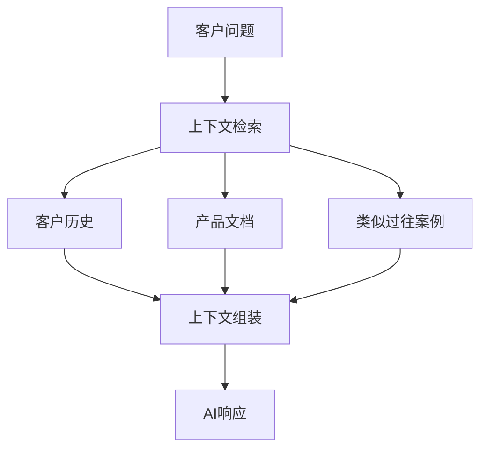
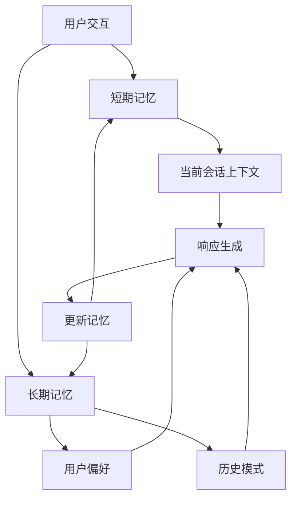
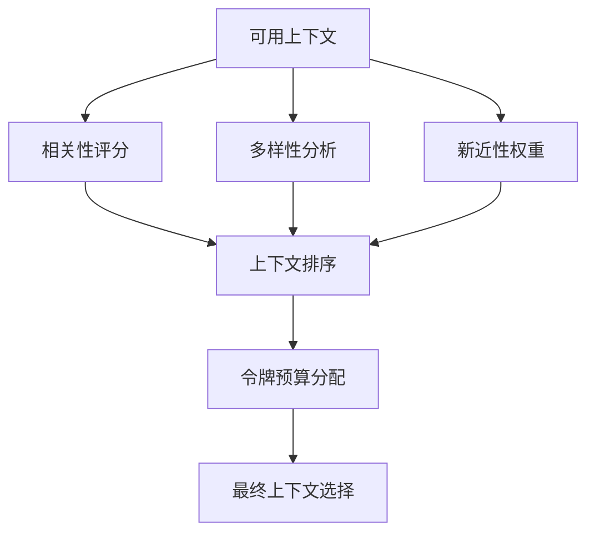

> "上下文工程是将恰当信息填入上下文窗口的精妙艺术与科学。" — [Andrej Karpathy](https://twitter.com/karpathy)

如果你使用AI开发应用有一段时间了，你可能已经遇到了简单提示词不再足够的瓶颈。你精心制作的提示在边缘情况下失效，你的AI助手在处理复杂任务时变得混乱，你的应用程序难以维持连贯的对话。这些挫折并非偶然——它们揭示了AI开发中正在发生的根本性转变。

像OpenAI、Anthropic、Notion和GitHub这样的公司不仅在构建更好的模型，他们还在开创全新的信息流向AI系统的方法。秘诀不在于模型本身，而在于我们如何选择、组织并向它们呈现信息。这就是上下文工程的本质。

{/* truncate */}

与传统的提示工程将AI交互视为简单的输入输出过程不同，上下文工程认识到现代AI应用是复杂的信息系统。以GitHub Copilot为例：它不仅仅看你当前的代码行，还会考虑你的整个代码库、项目结构、编码模式，甚至你试图完成的更广泛目标。这种信息选择的整体性方法使其真正有用，而不仅仅是令人印象深刻。

上下文工程不是关于编写更好的提示词——而是构建更智能的信息架构。它是在上下文窗口、处理时间和计算成本约束内，动态选择、组织并向AI系统呈现最相关信息的学科。

## 从简单提示到智能上下文

当你试图构建超越简单演示的任何东西时，传统提示的局限性就会变得明显。想象你正在构建一个AI驱动的客户支持系统。使用基础提示工程，你可能会写这样的内容：

```
你是一个有用的客户支持代理。回答以下问题：
[客户问题]
```

这种方法立即遇到问题：
- **有限的上下文**：你无法包含所有产品文档、过去的对话或客户历史
- **静态信息**：提示无法适应新产品、政策或季节性变化
- **无学习能力**：每次交互都从零开始，没有对以前对话的记忆

现代公司通过实施我们现在称为上下文工程的方法超越了这一限制。他们不使用静态提示，而是构建能够：



这种转变代表了我们思考AI交互方式的根本变化。上下文工程不是试图将所有内容塞入单个提示中，而是将信息选择视为一个独立的、专门的过程。AI接收经过策划的、相关的上下文，而不是通用指令。

像Notion这样的公司完美地展示了这一点。当你向Notion AI询问你的工作空间时，它不只是孤立地处理你的查询。它动态检索相关页面，考虑你最近的活动，并考虑你工作空间的结构来提供上下文感知的响应。

关键见解是**上下文质量比提示巧妙性更重要**。选择良好的上下文配合简单提示，每次都会胜过复杂提示配合糟糕上下文。

## RAG革命：动态上下文检索

使现代上下文工程成为可能的突破是[检索增强生成（RAG）](https://arxiv.org/abs/2005.11401)。虽然这个名字听起来很学术，但RAG实际上是一个直观的概念，已成为大多数实用AI应用的基础。

RAG通过将AI交互分为两个阶段来工作：

1. **检索阶段**：为当前查询找到最相关的信息
2. **生成阶段**：使用该信息生成响应

流程如下：


这种模式变得无处不在，因为它解决了AI应用的根本问题：如何让它们了解不在其训练数据中的信息。客户支持系统使用RAG访问当前产品文档。代码助手使用它来理解你的特定代码库。文档聊天机器人使用它提供最新答案。

RAG的魔力在于向量搜索和语义相似性。现代RAG系统不是关键词匹配，而是理解查询背后的含义。当你问"我如何取消订阅？"时，系统不只是寻找"取消"这个词——它找到语义相关的订阅管理、账单更改和账户修改内容。

公司使用以下工具实现RAG：
- **[LangChain](https://python.langchain.com/docs/)** 用于编排和工作流管理
- **[Chroma](https://docs.trychroma.com/)** 或 **[Pinecone](https://docs.pinecone.io/)** 用于向量存储和检索
- **[OpenAI embeddings](https://platform.openai.com/docs/guides/embeddings)** 用于将文本转换为语义向量
- **[Vercel AI SDK](https://sdk.vercel.ai/docs)** 用于简化集成

RAG的美妙之处在于其模块化。你可以从简单实现开始，逐步添加复杂性：

- **基础RAG**：简单文档检索和插入
- **高级RAG**：查询扩展、重新排序和上下文融合
- **代理RAG**：动态工具选择和多步推理

使RAG革命性的不仅仅是其技术能力，还有其实际影响。它将AI应用从静态知识库转变为能够保持当前和上下文相关的动态学习系统。

## 记忆和持久上下文

虽然RAG解决了访问外部信息的问题，现代AI应用还需要记住并从交互中学习。这就是记忆系统和持久上下文变得至关重要的地方。

考虑ChatGPT如何处理对话。它不只是回应单个消息——它保持对整个对话历史、你的偏好和你讨论的不断发展的上下文的意识。这种持久上下文使AI交互感觉自然和连贯。

在上下文工程中实现记忆有几种模式：



**短期记忆**处理即时对话上下文。这包括最近的消息、当前任务状态和临时偏好。它通常存储在当前会话中，之后被丢弃。

**长期记忆**捕获关于用户、他们的偏好、成功交互模式和学习行为的持久信息。这通常存储在向量数据库或结构化存储系统中。

GitHub Copilot体现了复杂的记忆使用。它记住你的编码风格、经常使用的模式和项目特定的约定。随着时间的推移，其建议变得越来越符合你的特定开发方法。

记忆系统的技术实现通常涉及：

- **向量存储**用于跨历史交互的语义相似性搜索
- **结构化数据库**用于显式事实和偏好
- **嵌入策略**捕获内容和上下文
- **检索策略**平衡新近性、相关性和多样性

记忆系统面临隐私、准确性和计算效率方面的独特挑战。像[Anthropic](https://www.anthropic.com/)这样的公司已经开创了[宪法AI技术](https://arxiv.org/abs/2212.08073)，可以在保持有用记忆的同时尊重用户隐私和安全约束。

关键见解是记忆将AI从你使用的工具转变为适应你的系统。与其在每次交互中重复上下文，复杂的记忆系统学习哪些信息始终相关并自动显示。

## 实践中的上下文优化

构建有效的上下文工程系统需要仔细平衡质量、性能和成本。在生产环境中，这些约束成为决定AI应用成功的关键因素。

**上下文选择策略**决定当你拥有比上下文窗口能容纳的更多相关内容时要包含哪些信息。简单方法可能使用新近性或关键词匹配，但复杂系统采用：

- **相关性评分**考虑语义相似性、用户偏好和任务要求
- **多样性平衡**避免冗余信息同时保持全面性
- **动态优先级**适应当前对话状态和用户目标



**性能优化**在处理实时应用时变得至关重要。用户期望响应迅速的AI交互，这需要仔细关注：

- **缓存策略**用于频繁访问的上下文
- **并行检索**用于多个信息源
- **渐进加载**在收集额外上下文的同时提供快速初始响应
- **预计算**嵌入和相似性分数

**成本优化**很重要，因为上下文工程涉及大量计算费用。嵌入生成、向量存储和检索操作在规模上会快速累积。成功的公司实施策略如：

- **上下文重用**跨相似查询和用户
- **智能分块**平衡粒度与检索效率
- **混合方法**结合快速关键词搜索与昂贵语义搜索
- **预算分配**为高价值交互优先考虑上下文质量

**质量评估**需要超越简单输出指标来评估上下文选择本身的有效性。团队测量：

- **上下文相关性**：检索的信息多好地解决查询？
- **上下文完整性**：为准确响应提供了足够信息吗？
- **上下文效率**：信息密度为令牌预算优化了吗？
- **上下文新鲜度**：检索的信息多当前和准确？

最成功的实现将上下文优化视为持续过程而不是一次性设置。他们实施监控系统跟踪上下文质量指标，并基于用户反馈和系统性能持续完善其选择和排序算法。

## 信息选择的未来

上下文工程代表了我们构建AI应用方式的根本转变。我们正在从提示驱动的交互转向能够动态适应用户需求和任务要求的复杂信息架构。

其影响远超当前应用。随着AI系统变得更有能力，上下文工程的质量将越来越多地决定令人印象深刻的演示和真正有用产品之间的差异。掌握上下文选择、记忆管理和信息优化的公司将构建感觉智能和有用而不仅仅是强大的AI应用。

对于开发者来说，这意味着理解上下文工程正在变得与理解传统软件架构一样重要。我们探索的模式和原则——用于动态检索的RAG、用于持久性的记忆系统，以及用于生产部署的优化技术——正在成为AI应用开发的基本技能。

工具和框架正在快速成熟。[LangChain](https://python.langchain.com/docs/)、[Chroma](https://docs.trychroma.com/)、[Pinecone](https://docs.pinecone.io/)等正在使复杂的上下文工程对个人开发者和小团队变得可及。像[FlashAttention](https://arxiv.org/abs/2205.14135)和[Mamba](https://arxiv.org/abs/2312.00752)这样的先进架构正在推动长上下文处理的可能性边界。曾经需要大量研究和开发投资的东西正在成为标准实践。

当你开始自己的上下文工程之旅时，记住目标不是构建可能的最复杂系统，而是构建最好服务用户需求的系统。从简单的RAG实现开始，随着应用增长添加记忆功能，并针对你的用例的特定约束和要求进行优化。

信息选择的艺术最终是关于理解每个时刻什么最重要，并确保你的AI系统能够访问该信息。在无限数据和有限注意力的世界中，这种技能变得越来越有价值——对人类和我们构建的AI系统都是如此。