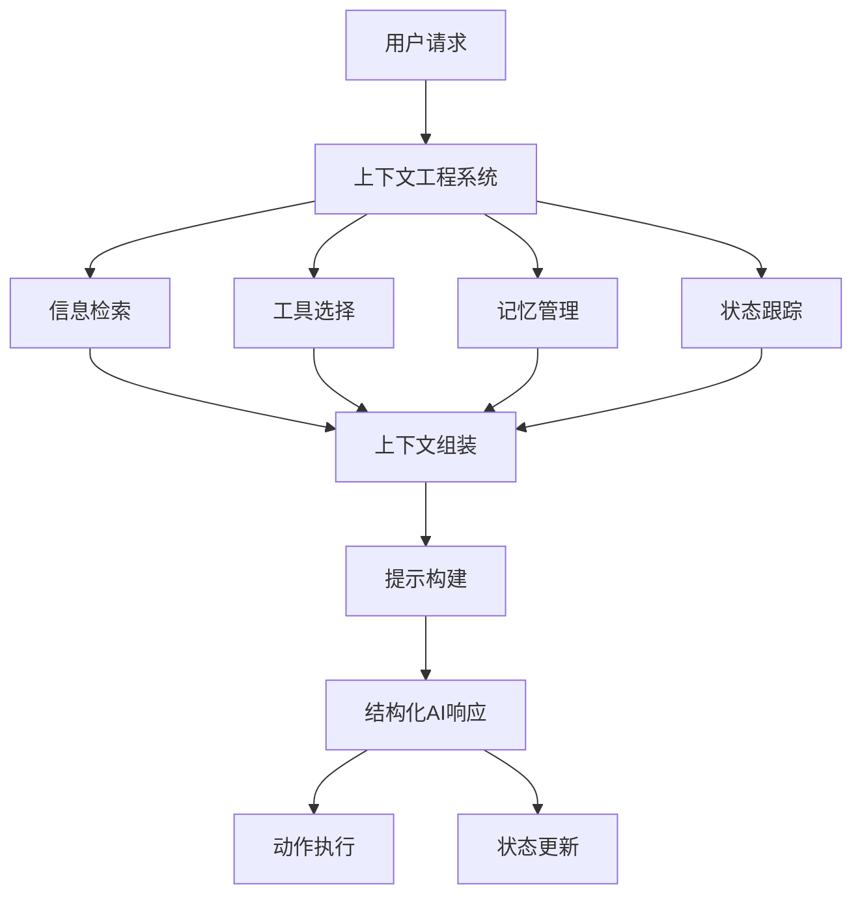
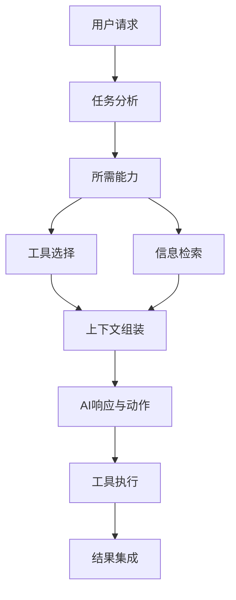
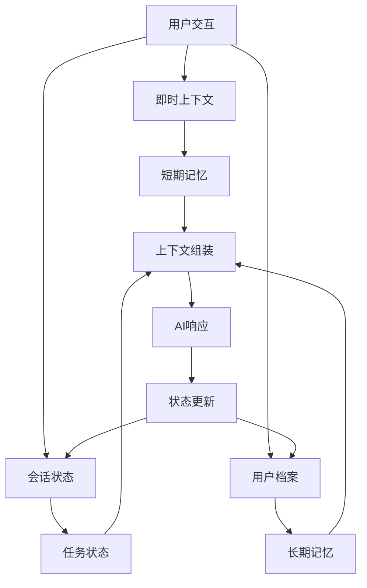
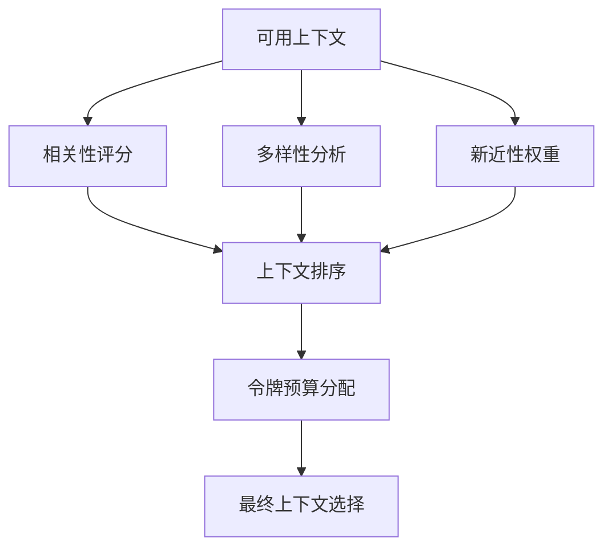

> **"上下文工程是构建动态系统，以正确格式提供正确信息和工具，使LLM能够合理完成任务的方法。"** — [LangChain](https://blog.langchain.com/the-rise-of-context-engineering/)

如果你使用AI开发应用有一段时间了，你可能已经遇到了简单提示词不再足够的瓶颈。你精心制作的提示在边缘情况下失效，你的AI助手在处理复杂任务时变得混乱，你的应用程序难以维持连贯的对话。这些挫折并非偶然——它们揭示了**AI开发中正在发生的根本性转变**。

像OpenAI、Anthropic、Notion和GitHub这样的公司不仅在构建更好的模型，他们还在开创全新的信息、工具和结构流向AI系统的方法。秘诀不在于模型本身，而在于我们如何设计能够让AI成功的完整上下文。这就是上下文工程的本质。

{/* truncate */}

**上下文工程代表了从简单提示词制作到构建复杂系统的范式转变**，这些系统可以动态地为AI模型提供有效完成任务所需的一切。与专注于巧妙措辞的传统**提示工程**不同，**上下文工程**涵盖了整个**信息架构**：检索什么数据、提供哪些工具、如何构建输出、维护什么状态，以及如何优化格式化所有内容。

以GitHub Copilot为例：它不只是看你当前的代码行，还会分析你的整个代码库，理解你的项目结构，识别你的编码模式，提供相关工具和功能，并以与你的开发工作流程无缝集成的格式构建建议。这种上下文协调的整体性方法使其真正有用，而不仅仅是令人印象深刻。

**上下文工程不是关于编写更好的提示词**——而是构建能够持续为AI模型提供正确信息、工具和结构以获得成功的动态系统。它包括检索系统、记忆管理、工具选择、输出格式化、状态跟踪，当然还有提示工程——所有这些都作为一个连贯的系统协同工作。

## 从提示工程到上下文系统

从传统**提示工程**演进到**上下文工程**代表了我们思考AI应用方式的根本转变。早期AI开发专注于制作巧妙的提示来诱导模型产生更好的响应。但正如[LangChain指出的](https://blog.langchain.com/the-rise-of-context-engineering/)，**提示工程**实际上是更广泛的**上下文工程**学科的一个子集。

当你试图构建超越简单演示的任何东西时，纯提示工程的局限性就会变得明显。想象你正在构建一个AI驱动的客户支持系统。使用基础提示工程，你可能会写这样的内容：

```
你是一个有用的客户支持代理。回答以下问题：
[客户问题]
```

这种方法立即遇到问题：
- **有限的上下文**：你无法包含所有产品文档、过去的对话或客户历史
- **静态信息**：提示无法适应新产品、政策或季节性变化
- **无学习能力**：每次交互都从零开始，没有对以前对话的记忆
- **无工具**：AI只能用文本回应，无法采取行动或检索实时数据
- **结构糟糕**：输入和输出都缺乏系统集成所需的格式

现代公司通过实施综合的上下文工程系统超越了这一限制。他们不使用静态提示，而是构建动态信息协调，包括：



**提示工程在这个更广泛的框架内仍然重要**，但其角色变得更加集中和系统化。现代提示工程不再试图将所有上下文和指令编码到静态提示中，而是专注于：

- **动态提示构建**，为每个特定交互组装正确的上下文
- **清晰的指令格式化**，帮助AI模型有效解析和利用提供的上下文
- **一致的通信模式**，在不同类型的检索信息中可靠工作
- **输出结构规范**，确保AI响应与下游系统正确集成

像Notion这样的公司完美地展示了这一点。当你向Notion AI询问你的工作空间时，系统不依赖单个巧妙的提示。它动态检索相关页面，考虑你最近的活动，考虑工作空间结构，为任何所需动作选择适当工具，然后构建一个富含上下文的提示，能够产生准确、可操作的响应。

关键见解是**上下文质量和系统设计比提示巧妙性更重要**。一个设计良好的上下文系统配合直接的提示，每次都会胜过复杂提示配合糟糕上下文。正如[LangChain强调的](https://blog.langchain.com/the-rise-of-context-engineering/)，问题不是你是否能写出完美的提示，而是你是否能构建一个为AI模型提供合理完成任务所需一切的系统。

## RAG革命：动态上下文检索

使现代**上下文工程**成为可能的突破是[**检索增强生成（RAG）**](https://arxiv.org/abs/2005.11401)。虽然这个名字听起来很学术，但**RAG**实际上是一个直观的概念，已成为大多数实用AI应用的基础。

**RAG**通过将AI交互分为两个阶段来工作：

1. **检索阶段**：为当前查询找到最相关的信息
2. **生成阶段**：使用该信息生成响应

流程如下：


这种模式变得无处不在，因为它解决了AI应用的根本问题：如何让它们了解不在其训练数据中的信息。客户支持系统使用RAG访问当前产品文档。代码助手使用它来理解你的特定代码库。文档聊天机器人使用它提供最新答案。

**RAG**的魔力在于**向量搜索**和**语义相似性**。现代**RAG系统**不是关键词匹配，而是理解查询背后的含义。当你问"我如何取消订阅？"时，系统不只是寻找"取消"这个词——它找到语义相关的订阅管理、账单更改和账户修改内容。

公司使用以下工具实现RAG：
- **[LangChain](https://python.langchain.com/docs/)** 用于编排和工作流管理
- **[Chroma](https://docs.trychroma.com/)** 或 **[Pinecone](https://docs.pinecone.io/)** 用于向量存储和检索
- **[OpenAI embeddings](https://platform.openai.com/docs/guides/embeddings)** 用于将文本转换为语义向量
- **[Vercel AI SDK](https://sdk.vercel.ai/docs)** 用于简化集成

RAG的美妙之处在于其模块化。你可以从简单实现开始，逐步添加复杂性：

- **基础RAG**：简单文档检索和插入
- **高级RAG**：查询扩展、重新排序和上下文融合
- **代理RAG**：动态工具选择和多步推理

使RAG革命性的不仅仅是其技术能力，还有其实际影响。它将AI应用从静态知识库转变为能够保持当前和上下文相关的动态学习系统。

## 结构与格式：无声的上下文工程师

虽然大部分注意力集中在向AI系统提供什么信息上，但信息如何结构化和格式化同样至关重要。糟糕的格式化会使即使是完美的信息也变得无用，而良好的结构化输入和输出可以显著提高AI性能。

**输入结构**影响AI模型解析和利用你提供信息的效果。考虑这两种提供产品文档的方法：

```
// 糟糕的结构 - 文字墙
以下是我们的产品文档：产品A售价50美元，功能包括X、Y、Z。产品B售价75美元，功能包括A、B、C。产品C售价100美元，功能包括M、N、O。我们的退货政策是30天...

// 更好的结构 - 有组织且有标签
## 产品
- **产品A**：$50 | 功能：X、Y、Z
- **产品B**：$75 | 功能：A、B、C  
- **产品C**：$100 | 功能：M、N、O

## 政策
- **退货**：30天政策
- **配送**：3-5个工作日
```

**输出结构**同样重要。现代AI应用不只是生成文本——它们需要产生与现有系统集成的结构化输出。这包括：

- 用于API集成和数据处理的**JSON模式**
- 具有正确定义参数和返回类型的**函数调用**
- 从非结构化输入进行**结构化数据提取**
- 结合文本、代码和其他格式的**多模态输出**

```typescript
// 示例：客户支持的结构化输出
interface SupportResponse {
  classification: "technical" | "billing" | "general";
  urgency: "low" | "medium" | "high";
  suggestedActions: string[];
  requiresEscalation: boolean;
  followUpRequired: boolean;
}
```

**格式一致性**在所有上下文元素中创造连贯的体验。当检索结果、记忆摘要和工具输出都遵循一致的格式化模式时，AI模型可以更有效地处理信息，用户可以更好地理解系统行为。

关键见解是**通信格式和通信内容一样重要**。简短、描述性的错误消息比巨大的JSON数据块更有用。清晰、一致的格式化减少了AI模型和人类用户的认知负担，从而在整个系统中带来更好的结果。

## 工具与能力：扩展AI超越信息

上下文工程远远超出信息检索，还包括AI系统完成任务所需的工具和能力。正如[LangChain强调的](https://blog.langchain.com/the-rise-of-context-engineering/)，提供正确的工具和提供正确的信息一样重要。

**工具选择**成为**上下文工程**的关键方面。AI模型仅凭信息无法完成复杂任务——它们需要采取行动、检索额外数据并与外部系统交互的能力。**上下文工程**的挑战是确定为每个特定任务或对话提供哪些工具。



**函数调用**已成为现代AI应用的基本模式。系统不是要求AI生成代码或指令，而是提供模型可以直接调用的**结构化函数接口**：

```typescript
// 示例：具有结构化工具的电商助手
const tools = [
  {
    name: "search_products",
    description: "在目录中搜索产品",
    parameters: {
      type: "object",
      properties: {
        query: { type: "string", description: "搜索词" },
        category: { type: "string", enum: ["electronics", "clothing", "books"] },
        price_range: { type: "object", properties: { min: { type: "number" }, max: { type: "number" } }}
      }
    }
  },
  {
    name: "get_order_status", 
    description: "检查现有订单的状态",
    parameters: {
      type: "object",
      properties: {
        order_id: { type: "string", description: "要检查的订单ID" }
      }
    }
  }
];
```

**工具格式设计**显著影响AI性能。设计良好的工具接口具有清晰的描述、适当的参数类型和直观的命名约定，使AI模型能够有效使用它们。糟糕的工具设计导致误用、错误和用户挫折。

**动态工具可用性**允许上下文工程系统根据用户上下文、对话状态或任务要求提供不同的工具。客户支持AI可能为已验证客户提供退款工具，但不为匿名用户提供。开发助手可能只在处理代码时提供调试工具。

关键见解是**工具将AI从信息处理器转变为采取行动的代理**。上下文工程必须考虑不仅要提供什么信息，还要考虑AI需要什么能力来成功完成用户的实际目标。

## 记忆与状态：上下文的演进

虽然**RAG**解决了访问外部信息的问题，工具使能够采取行动，现代AI应用还需要复杂的**记忆**和**状态管理**来维持连贯、演进的对话和任务进程。这代表了**上下文工程**最复杂的方面之一。

**对话状态管理**超越简单的消息历史，跟踪用户交互的演进上下文。考虑一个技术支持对话，涉及多个问题、解决方案尝试和后续问题。有效的状态管理不仅捕获说了什么，还包括尝试了什么、什么有效、什么失败，以及还需要关注什么。



**短期记忆**处理即时对话上下文，包括最近的消息、当前任务状态、会话中表达的用户偏好和临时变量。这些信息通常限定在会话范围内，设计用于维持对话流程和任务连续性。

**长期记忆**捕获关于用户、他们的偏好、成功交互模式、学习行为和超越个别对话的历史上下文的持久信息。这创造了随时间改善的个性化体验。

**多层状态跟踪**在复杂应用中变得至关重要。不同类型的状态需要不同的管理策略：

- **对话流程**：讨论了哪些主题，回答了哪些问题
- **任务进程**：完成的步骤，待执行的动作，遇到的阻碍
- **用户上下文**：偏好、专业水平、之前的成功模式
- **系统状态**：可用工具、活跃集成、操作约束

GitHub Copilot体现了复杂的状态管理。它维持对你当前文件、项目结构、最近更改、编码模式，甚至你更广泛开发目标的意识。这种多层上下文意识使其能够在你的编码会话进行过程中提供越来越相关的建议。

**状态压缩和摘要**随着对话变长和上下文积累而变得必要。先进系统不是维持完整的对话历史，而是创建智能摘要，在管理令牌预算的同时保留必要上下文：

```typescript
interface ConversationSummary {
  userGoals: string[];
  keyDecisions: string[];
  remainingTasks: string[];
  userPreferences: Record<string, any>;
  contextualFacts: string[];
  lastInteractionSummary: string;
}
```

**跨会话连续性**允许AI系统在单独的交互中维持上下文。当用户返回继续项目或恢复对话时，有效的上下文工程可以恢复相关状态并从上次会话结束的地方继续。

技术实现涉及多个存储系统、检索策略和状态更新机制之间的复杂协调。公司使用向量数据库进行语义记忆、结构化数据库存储显式事实，以及缓存系统进行性能优化的组合。

关键见解是**记忆将AI从你使用的工具转变为与你一起演进的系统**。复杂的记忆系统不是每次都重新开始，而是学习哪些信息始终相关并自动显示，创造真正智能和适应性的AI交互。

## 实践中的上下文优化

构建有效的上下文工程系统需要仔细平衡质量、性能和成本。在生产环境中，这些约束成为决定AI应用成功的关键因素。

**上下文选择策略**决定当你拥有比上下文窗口能容纳的更多相关内容时要包含哪些信息。简单方法可能使用新近性或关键词匹配，但复杂系统采用：

- **相关性评分**考虑语义相似性、用户偏好和任务要求
- **多样性平衡**避免冗余信息同时保持全面性
- **动态优先级**适应当前对话状态和用户目标



**性能优化**在处理实时应用时变得至关重要。用户期望响应迅速的AI交互，这需要仔细关注：

- **缓存策略**用于频繁访问的上下文
- **并行检索**用于多个信息源
- **渐进加载**在收集额外上下文的同时提供快速初始响应
- **预计算**嵌入和相似性分数

**成本优化**很重要，因为上下文工程涉及大量计算费用。嵌入生成、向量存储和检索操作在规模上会快速累积。成功的公司实施策略如：

- **上下文重用**跨相似查询和用户
- **智能分块**平衡粒度与检索效率
- **混合方法**结合快速关键词搜索与昂贵语义搜索
- **预算分配**为高价值交互优先考虑上下文质量

**质量评估**需要超越简单输出指标来评估上下文选择本身的有效性。团队测量：

- **上下文相关性**：检索的信息多好地解决查询？
- **上下文完整性**：为准确响应提供了足够信息吗？
- **上下文效率**：信息密度为令牌预算优化了吗？
- **上下文新鲜度**：检索的信息多当前和准确？

最成功的实现将上下文优化视为持续过程而不是一次性设置。他们实施监控系统跟踪上下文质量指标，并基于用户反馈和系统性能持续完善其选择和排序算法。

## 信息选择的未来

上下文工程代表了我们构建AI应用方式的根本转变。我们正在从提示驱动的交互转向能够动态适应用户需求和任务要求的复杂信息架构。

其影响远超当前应用。随着AI系统变得更有能力，上下文工程的质量将越来越多地决定令人印象深刻的演示和真正有用产品之间的差异。掌握上下文选择、记忆管理、工具协调和信息优化的公司将构建感觉智能和有用而不仅仅是强大的AI应用。

**新兴学科**：起初是非正式实践的东西正在结晶为一个被认可的工程学科。[LangChain团队](https://blog.langchain.com/the-rise-of-context-engineering/)和像[Dex Horthy](https://github.com/humanlayer/12-factor-agents)这样的从业者正在形式化指导我们思考上下文系统的模式和原则。这不仅仅是构建更好的AI应用——而是为新类别的软件工程建立基础实践。

**超越当前应用**：我们探索的模式——动态检索、结构化输出、工具选择、记忆管理和状态跟踪——正在成为AI应用开发的基本技能。随着模型变得更有能力，瓶颈从模型限制转向上下文工程有效性。

**工具和可及性**：工具生态系统正在快速成熟。用于编排的[LangChain](https://python.langchain.com/docs/)和[LangGraph](https://github.com/langchain-ai/langgraph)，用于向量操作的[Chroma](https://docs.trychroma.com/)和[Pinecone](https://docs.pinecone.io/)，用于集成的[Vercel AI SDK](https://sdk.vercel.ai/docs)等框架——曾经需要大量研究投资的东西正在变得对个人开发者和小团队可及。

**人的因素**：最终，上下文工程是关于理解人类在每个时刻需要什么，并确保AI系统拥有提供它所需的上下文。在无限数据和有限注意力的世界中，策划、结构化和协调信息的能力变得越来越有价值——对人类和我们构建的AI系统都是如此。

当你开始自己的上下文工程之旅时，记住目标不是构建可能的最复杂系统，而是构建最好服务用户需求的系统。从简单的RAG实现开始，随着应用增长添加记忆功能，为你的领域集成适当工具，并针对你的用例的特定约束和要求进行优化。

信息选择的艺术最终是关于理解每个时刻什么最重要，并确保你的AI系统能够访问该信息、对其采取行动的工具，以及有效沟通的结构。这种对上下文的整体方法是真正有用的AI应用与令人印象深刻演示之间的区别。