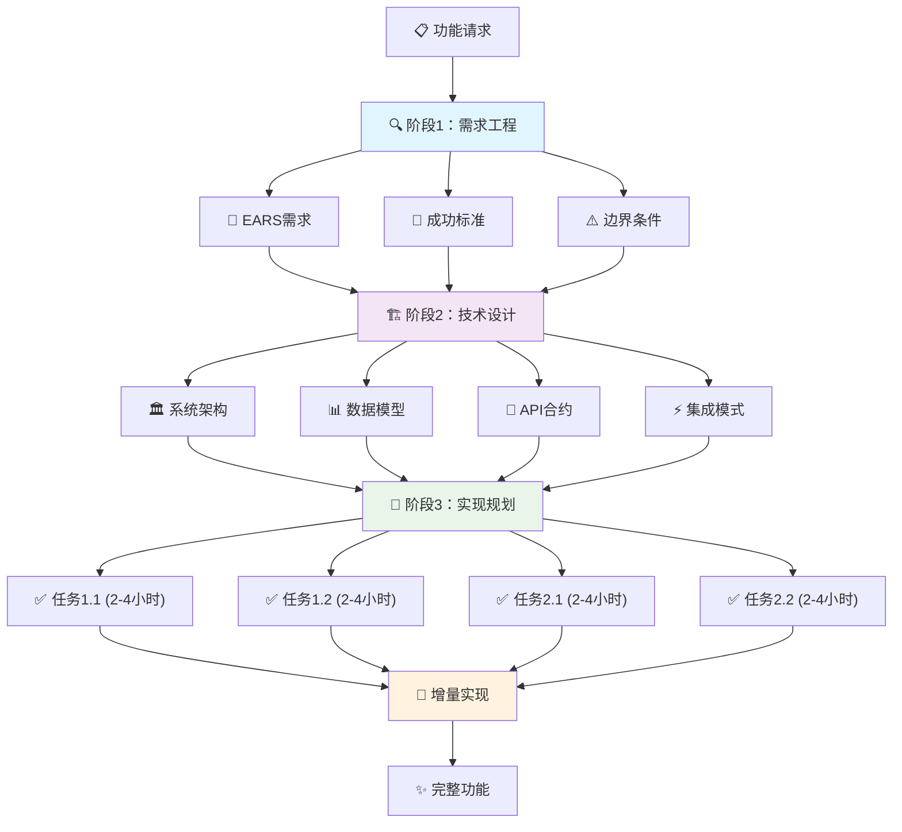
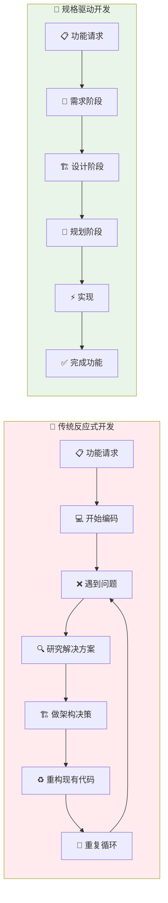
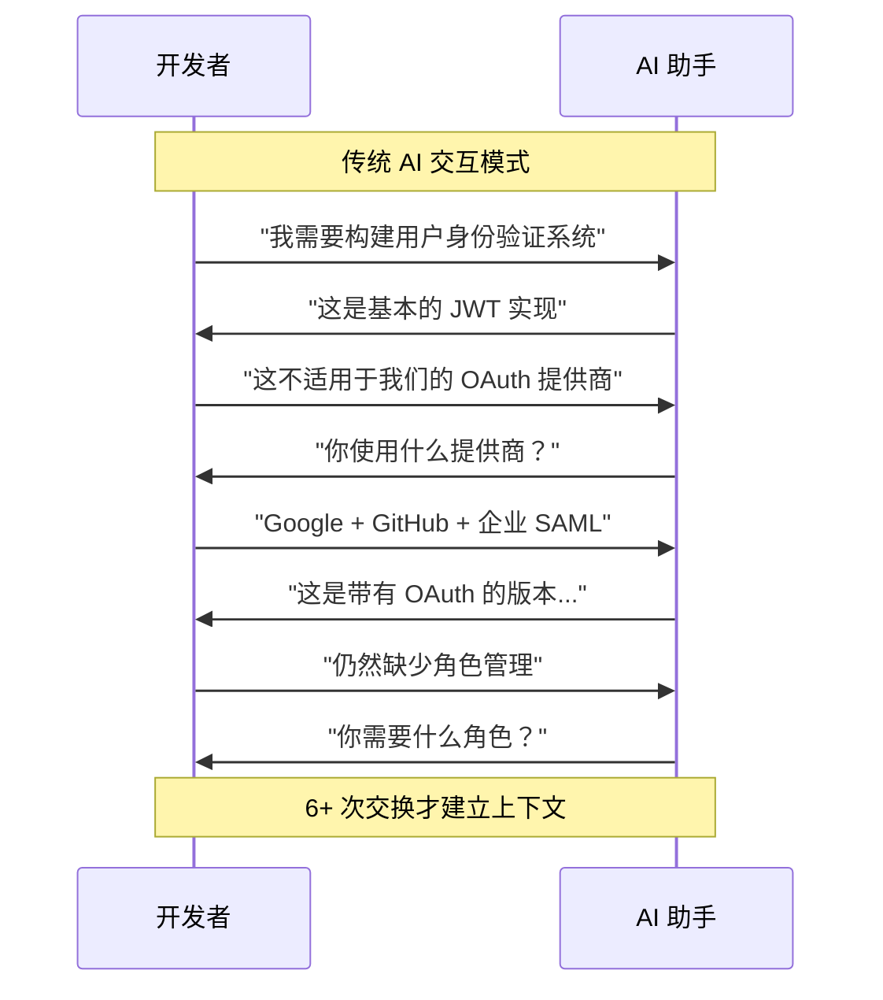
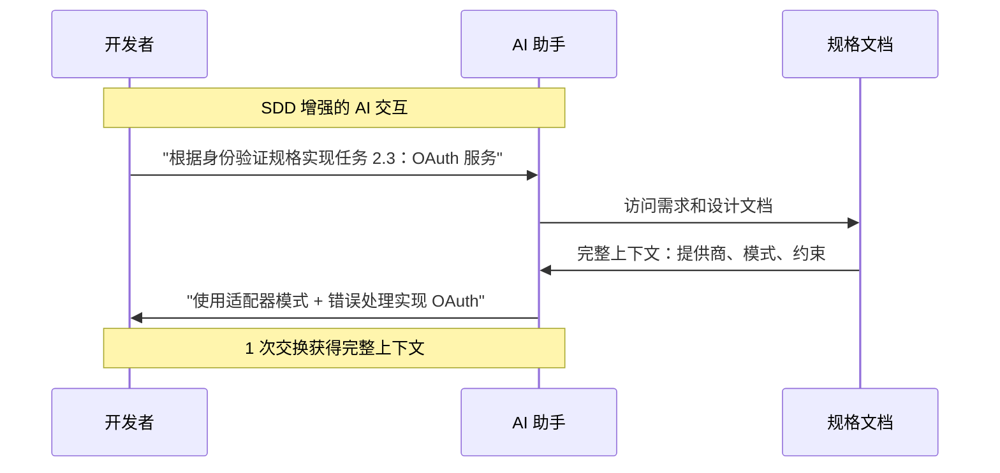
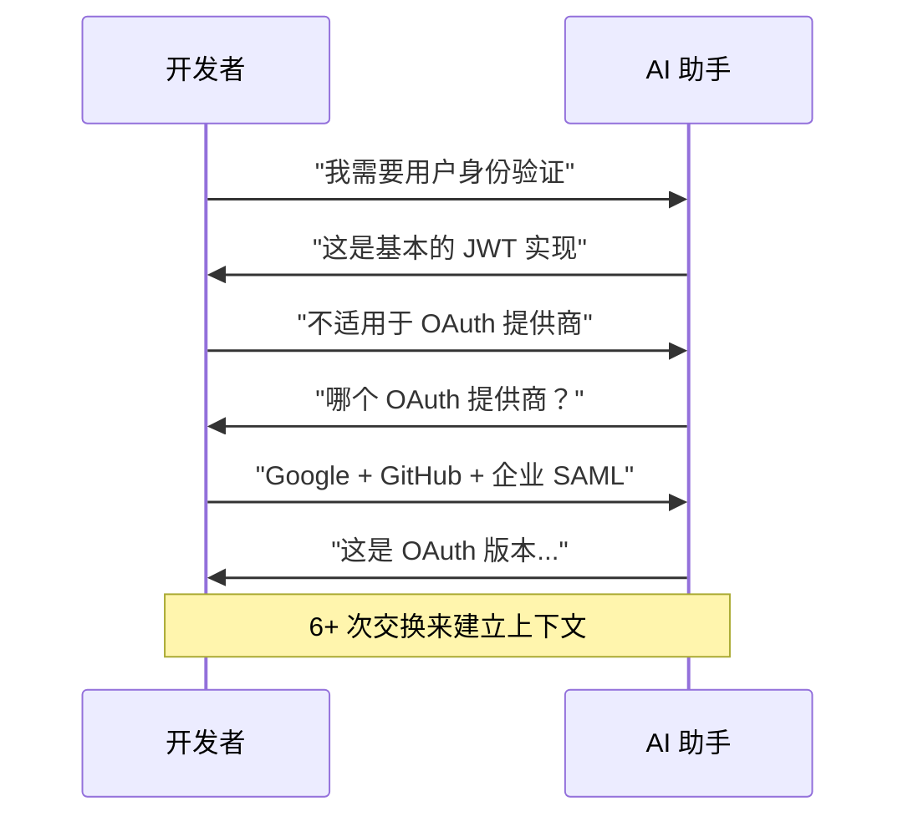
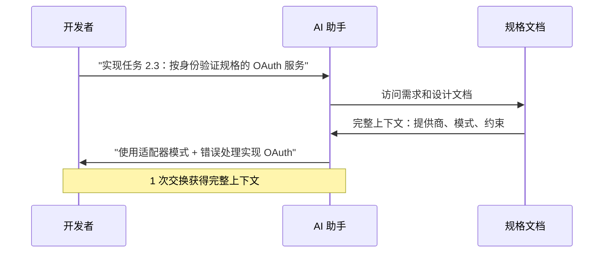

# 理解 Kiro：开发者的规格驱动开发指南

## 引言：复杂功能开发的挑战

每个开发者都知道那种盯着复杂需求而不知从何开始的感觉。现代软件开发越来越多地涉及构建整合多个服务、处理不同数据格式、协调各种 API 的系统。在初始规格中看似简单的东西，往往会演变成复杂的相互依赖组件网络，每个组件都有自己的约束和边界条件。

这种复杂性在几个常见的开发挑战中显现出来，无论团队的经验水平或技术栈如何，都会面临这些挑战。项目经常因为需求在实现过程中的演变而遭受范围蔓延。开发者花费大量时间向 AI 助手或团队成员解释上下文，经常重复相同的架构约束。技术债务在开发者因压力做出仓促决定时累积，导致系统变得越来越难以维护和扩展。

{/* truncate */}

### 传统开发方法

大多数开发工作流遵循反应性模式：接收功能请求，创建一些初始笔记，然后开始编码。当问题出现时——它们不可避免地会出现——开发者临时处理它们，通常借助 AI 工具或通过与同事协商。虽然这种方法适用于简单任务，但在处理复杂的多面功能时就会失效。

结果是可预测的低效循环：
- **范围演变**：需求在实现过程中发生变化，因为前期没有充分理解
- **上下文重复**：反复向不同的人或工具解释相同的架构约束和业务逻辑
- **反应性问题解决**：在时间压力下做出关键架构决策，没有充分考虑替代方案
- **技术债务累积**：实施快速修复，造成长期维护负担

行业研究验证了这些观察。Standish Group 的 CHAOS 报告一致显示，60-70% 的软件项目经历范围蔓延。微软的开发者生产力研究表明，开发者将多达 30% 的时间花在沟通和协调上，而不是实施工作上。

### 介绍规格驱动开发

**Kiro** 通过 **规格驱动开发（SDD）** 提供了一种替代方法，这是一种通过系统性前期规划来解决这些挑战的方法论。与传统的临时开发模式不同，SDD 遵循结构化的三阶段过程，旨在前置通常在实现过程中反应性发生的复杂性管理。

SDD 并非革命性的——它建立在需求工程和契约式设计方法论等数十年的软件工程研究基础上。然而，它专门为现代 AI 辅助开发环境调整了这些正式方法，在这种环境中，清晰的规格可以显著提高工具效率。

该方法论解决三个关键痛点：

1. **功能复杂性管理**：将压倒性的需求分解为可管理的增量工作
2. **需求稳定性**：通过前期规格和验证防止范围蔓延
3. **沟通效率**：提供改善与 AI 工具和团队成员交互的结构化上下文

### 系统性替代方案

IEEE 计算机学会等组织的研究表明，前期规格工作可减少 40-60% 的缺陷，并显著提高项目成功率。SDD 将这种系统性思维引入现代开发工作流，特别是那些利用 AI 辅助实现的工作流。

以下部分提供了对 Kiro 的规格驱动开发方法论在实践中如何工作、对开发团队的具体好处以及对其局限性和适用用例的诚实评估的客观检查。这个分析旨在帮助开发者就是否以及何时采用像 SDD 这样的结构化开发方法做出明智决定。

这个概述专注于理解 Kiro 提供什么、在哪里提供价值，以及开发者在评估针对其特定上下文和项目需求的系统性开发方法论时应该考虑哪些权衡，而不是承诺通用解决方案。

---

## 理解规格驱动开发

当大多数开发者遇到新的功能请求时，典型的工作流是这样的：阅读需求，也许创建一个快速任务列表，启动 IDE，然后开始编码。当问题出现时——它们不可避免地会出现——我们谷歌搜索解决方案，向 ChatGPT 寻求帮助，或者深入文档。这是一种感觉自然且直接的反应性方法，但它经常导致使复杂开发感觉混乱和不可预测的确切问题。

**规格驱动开发** 采用了根本不同的方法。SDD 不是直接跳入实现，而是坚持结构化的规格阶段，前置思考工作。这不是关于创建重量级文档或遵循严格的企业流程——而是关于在复杂问题变成复杂代码之前对其应用系统性思维。

### 三阶段 SDD 方法论

SDD 将开发工作组织成三个不同的阶段，每个阶段都有明确的目标和可交付成果：

#### 阶段 1：需求工程

第一阶段专注于将模糊的功能请求转换为精确、可操作的需求。这不仅仅是写下功能应该做什么——而是关于识别边界条件、定义成功标准，以及建立你正在构建什么的边界。

SDD 采用结构化格式，如 **EARS（简易需求语法方法）** 来创建明确的需求：

```markdown
🔄 当用户选择多个发布平台时
✅ 系统应在 60 秒内发布到所有选定平台

⚠️ 如果平台发布失败
🔄 系统应重试最多 3 次并记录错误详细信息

🎯 当发布完成时
📊 系统应显示每个平台的成功/失败状态
```

:::tip EARS 语法组件
- **当/如果**: 定义行为发生时机的触发条件
- **应**: 具有特定可测量结果的预期系统响应
- **应(强制性)**: 强制性需求（相对于"应该"的偏好性需求）
- **具体指标**: "60秒"、"3次"而不是"快速"、"几次"
:::

这种格式强制具体性。不是"系统应该优雅地处理错误"，而是得到可以测试和验证的具体行为定义。结果是对成功到底是什么样子的共同理解。

#### 阶段 2：技术设计

有了明确的需求，设计阶段解决实现的"如何"问题。这包括系统架构、数据模型、API 合约和集成模式。关键洞察是，在完整需求上下文中做出的设计决策显著优于在编码过程中反应性做出的决策。

对于多平台发布系统，设计阶段可能产生：

- **架构**：具有平台特定适配器的发布者抽象层
- **数据模型**：支持多种输出格式的内容表示
- **错误处理**：重试逻辑、断路器和用户反馈机制
- **集成模式**：跨不同平台 API 的身份验证管理

设计不需要完美或完整——它需要是 **深思熟虑的**。通过提前考虑架构，你在问题仍然容易解决时识别潜在问题。

#### 阶段 3：实现规划

最终规格阶段将设计分解为离散的、可实现的任务。每个任务都有适当的大小（通常是 2-4 小时的工作），有明确的验收标准，并朝着完整功能增量构建。

不是像"实现多平台发布"这样的单一压倒性任务，SDD 可能产生：

1. **任务 1.1**：创建平台适配器接口和身份验证合约
2. **任务 1.2**：实现内容转换服务与格式转换
3. **任务 2.1**：为主要平台构建平台特定适配器
4. **任务 2.2**：向发布者服务添加重试逻辑和错误处理
5. **任务 3.1**：创建平台选择和状态显示的用户界面

每个任务都引用特定的需求和设计决策，创建从实现回到原始意图的可追溯性。

```mermaid
gantt
    title SDD 任务分解：多平台发布系统
    dateFormat X
    axisFormat %s

    section 阶段1：基础设施
    平台适配器接口    :task1, 0, 3h
    内容转换服务     :task2, after task1, 4h

    section 阶段2：核心功能  
    平台适配器      :task3, after task2, 4h
    重试和错误处理   :task4, after task3, 3h

    section 阶段3：用户界面
    平台选择界面    :task5, after task4, 4h
    状态显示       :task6, after task5, 3h
```



:::info 任务大小原则
- **2-4小时块**：每个任务都可以在专注的工作会话中完成
- **明确依赖关系**：顺序任务建立在之前的基础上
- **增量价值**：每次完成都朝着工作功能前进
- **可测试结果**：每个任务都有具体的验收标准
:::



### SDD 与传统方法的不同

当你检查问题出现时会发生什么时，与传统开发的对比变得清晰：

**传统方法：**
- 在编码过程中遇到意外复杂性
- 停止开发来研究解决方案
- 在压力下做出架构决策
- 重构现有代码以适应新需求
- 反复向团队成员或 AI 工具解释上下文

**SDD 方法：**
- 在需求和设计阶段识别复杂性
- 在承诺实现方法之前研究解决方案
- 在完整上下文和有时间考虑替代方案时做出架构决策
- 实现建立在稳定基础上的增量任务
- 引用现有规格获取上下文，而不是重新解释

区别不仅仅在于规划——而在于决策 **何时** 做出。SDD 将艰难的思考推到开始，当你有最大灵活性和最少需要更改的代码时。



### 解决常见的 SDD 误解

在深入具体好处之前，值得解决一些关于规格驱动方法的常见担忧：

**"对小功能来说开销太大"**：SDD 根据你构建的复杂性进行扩展。简单的错误修复可能只需要基本的需求澄清，而复杂的集成则受益于完整的规格。方法论适应问题大小。

**"需求总是会改变"**：SDD 不会消除需求变更——它使其变得可管理。当需求确实演变时，拥有结构化文档使得清楚需要改变什么以及为什么。更新是外科手术式的而不是混乱的。

**"它减慢了开发速度"**：前期规格工作确实需要时间，但这是一项投资。IEEE 研究一致显示，综合规划可减少 40-60% 的缺陷。在规格上花费的时间在实现和维护中节省了更多时间。

**"AI 工具使规划过时"**：这也许是最危险的误解。AI 工具非常强大，但它们只与接收到的上下文一样好。SDD 不会取代 AI 辅助——它通过提供启用更有针对性、有效交互的结构化上下文来放大它。

### AI 辅助开发时代的 SDD

使 SDD 在今天特别相关的是它如何转换与 AI 开发工具的交互。传统的 AI 对话经常是这样的：

**开发者**："我需要构建一个向多个平台发布文章的系统。"  
**AI**："我可以帮助！你想让我展示如何发出 HTTP 请求吗？"  
**开发者**："不，这更复杂。每个平台都有不同的身份验证..."  
**AI**："我明白了。这是一个 OAuth 实现示例。"  
**开发者**："那也不太对。让我解释完整上下文..."

这种模式无休止地重复，因为 AI 缺乏系统性上下文来理解你真正在构建什么。



使用 SDD，对话变得显著更加专注：

**开发者**："基于项目文档中的需求和设计规格，实现任务 2.1：掘金和 CSDN 平台的平台特定适配器。"  
**AI**："我理解。基于设计中定义的适配器接口和指定的身份验证需求，我将实现两个适配器，包括你建立的错误处理模式。"

AI 可以专注于实现，因为思考工作已经系统性地完成了。



现在我们理解了 SDD 是什么以及它与反应性开发的不同，让我们探索这种方法论在实践中如何提供三个变革性好处。这些好处解决了使复杂开发感觉压倒性和低效的核心痛点。

---

## 系统性规划和增强的 AI 协作

每个开发者都知道当一个"简单"功能请求暴露出意外复杂性时的那种沉重感觉。看似"添加多平台发布支持"的需求，逐渐暴露出身份验证方法、内容转换需求、错误处理策略和用户体验考虑等复杂层次，这些在前期并不明显。

传统开发反应性地处理这种复杂性——投入实现并在问题出现时解决它们。这导致在压力下做出的架构决策、频繁的范围调整，以及使复杂功能感觉压倒性的那种开发混乱。

Kiro 的规格驱动开发方法论通过前置复杂性管理和通过结构化上下文显著提高 AI 工具效率来转换这种体验。

### 问题：反应性混乱和低效的 AI 交互

在采用 SDD 原则之前，我对复杂功能的方法遵循可预测的低效模式：

**功能压倒**：范围感觉不可能大。我在实现身份验证、内容转换和 UI 之间跳跃，没有明确方向。每个组件似乎都需要理解其他每个组件，造成分析瘫痪。

**隐藏依赖关系**：实现揭示了需要昂贵架构更改的意外连接。我的初始身份验证系统假设所有平台都使用 OAuth，但一些 API 使用 API 密钥。错误处理选择与已建立的 UX 模式冲突。

**范围蔓延**：当基本功能出现时，明显缺失的功能变得明显。"用户需要内容预览。""我们应该支持调度。""草稿同步怎么办？"每个添加都需要重新处理现有代码。

**AI 沟通摩擦**：与 AI 工具的对话遵循熟悉但低效的模式：

**开发者**："我需要多平台发布。"  
**AI**："这是一个基本的 HTTP 请求示例。"  
**开发者**："不，这更复杂。每个平台都有不同的身份验证..."  
**AI**："我明白了。这是一个 OAuth 实现。"  
**开发者**："那也不太对。让我解释完整上下文..."

这种模式无休止地重复，因为 AI 缺乏系统性上下文来理解你实际在构建什么。

### SDD 的系统性解决方案

当我开始为后续功能使用 Kiro 时，转换是立即的。以下是 SDD 如何改变我构建内容分析系统的方法：

#### 结构化需求发现

不是跳入实现，我开始使用 EARS 格式的需求：

```markdown
当用户向任何平台发布文章时
系统应在 24 小时内开始跟踪参与度指标

如果平台的 API 不可用
系统应继续跟踪可用平台并每 30 分钟重试失败的连接

当收集参与度数据时
系统应显示带有指示数据新鲜度时间戳的指标
```

这种结构化方法强制提前考虑边界条件。API 不可用需求揭示了对强大重试系统的需要。数据新鲜度需求突出了用户反馈需求。

#### 实现前的综合设计

有了明确需求，我设计了技术架构：
- **数据标准化**：跨平台标准化指标（浏览量、点赞、评论）
- **收集策略**：轮询 vs. webhooks vs. 混合方法
- **错误处理**：速率限制、临时失败、API 更改
- **缓存方法**：性能优化和缓存失效

这揭示了后来更改会很昂贵的架构决策，比如不同平台以不同粒度（每小时 vs. 每天）报告指标。

#### 增量任务分解

SDD 将"构建分析系统"转换为可管理的任务：

1. **任务 1.1**：创建带有错误处理合约的指标收集接口（3 小时）
2. **任务 1.2**：实现带有平台适配器的数据标准化服务（4 小时）
3. **任务 2.1**：构建带有指数退避的重试机制（3 小时）
4. **任务 2.2**：创建带有加载状态的分析仪表板 UI（4 小时）
5. **任务 3.1**：添加带有数据新鲜度指示器的指标比较（3 小时）

每个任务都有明确的验收标准和适当的大小——可在专注的工作会话中完成，有可见的进展。

### 通过结构化上下文增强 AI 协作

最戏剧性的改进来自 AI 交互。不是探索性对话，我可以从综合上下文开始：

**传统 AI 交互**：


**SDD 增强的 AI 交互**：


#### 实际 AI 效率示例

**数据库设计**：  
- 传统："帮我设计电子商务模式。"  
- SDD："从第 3.2 节实现产品目录模式，包括多态产品类型和搜索索引策略。"

**API 开发**：  
- 传统："为订单创建 REST 端点。"  
- SDD："按 API 规格实现订单管理端点，包括第 4.1 节的验证规则和设计文档的错误格式。"

**前端组件**：  
- 传统："构建用户配置文件表单。"  
- SDD："按 UI 规格第 2.4 节创建 ProfileEditForm，实现设计系统验证模式和可访问性需求。"

### 具体结果

系统性方法提供了可测量的改进：

**减少开发时间**：分析系统在 20 小时专注工作中完成 vs. 几周迭代开发。系统性规划消除了错误开始和架构返工。

**可预测进展**：明确的任务定义使准确的进展跟踪和时间线估计成为可能。利益相关者问题基于剩余任务得到具体答案。

**范围控制**：当需求改变时（"我们能跟踪社交媒体提及吗？"），基于现有规格的影响评估为额外工作提供了现实估计。

**AI 生产力**：丰富上下文的交互消除了数小时的解释。AI 工具生成适合现有模式的针对性解决方案，而不是需要修改的通用实现。

**代码质量**：在完整上下文中做出的架构决策产生了更清洁、更可维护的代码，与现有系统顺利集成。

### 何时这种方法提供最大价值

SDD 的系统性规划和 AI 增强好处对以下情况最显著：

**复杂集成需求**：协调多个系统或外部 API 的功能。分析系统与六个平台 API 的集成，每个都有独特的身份验证和数据格式。

**团队协作**：多开发者项目，其中共享规格消除误沟通并提供一致的 AI 工具交互。

**技术风险和不确定性**：涉及不熟悉技术的功能，其中设计阶段研究防止昂贵的轴心决策。

**AI 重度开发**：大量使用 AI 辅助的团队从结构化上下文中看到实质性的生产力改进。

然而，SDD 并非总是合适的。简单错误修复、充分理解的功能和快速原型设计经常从更直接的实现中受益。关键是认识到何时复杂性证明前期规划投资的合理性。

### 需要考虑的限制

虽然 SDD 显著改善了规划和 AI 交互，但存在重要限制：

**学习曲线**：团队需要时间发展结构化规格技能并适应工作流。

**简单任务开销**：为直接功能创建详细规格可能比实现花费更多时间。

**规格质量依赖性**：AI 辅助只与底层规格一样好。糟糕的需求仍然导致次优交互。

**视觉需求差距**：当前纯文本方法限制了对需要线框图、模型和交互原型的 UI 重度项目的适用性。

SDD 提供的结构化上下文转换了开发规划和 AI 协作，将压倒性复杂性转换为可管理、可预测的工作，同时将 AI 工具从通用助手转换为理解你特定项目上下文的专业协作者。

---

## 诚实评估：限制和权衡

虽然规格驱动开发为复杂功能开发和 AI 工具增强提供了显著好处，但理解这种方法面临限制的地方以及开发者应该考虑什么权衡是重要的。没有方法论是通用有效的，SDD 在深思熟虑地应用于适当场景时最有效。

### 关键限制

#### 学习曲线和采用摩擦

SDD 要求开发者学习结构化规格技术并改变已建立的工作流。编写有效的 EARS 需求、创建综合设计文档以及系统性地分解功能是需要时间发展的技能。从临时开发方法转换的团队在适应更结构化的规划时经常经历初始生产力下降。

方法论还要求在开始实现之前完成规格阶段的纪律。习惯于立即编码的开发者可能发现前期规划阶段令人沮丧，特别是当需求看起来清楚且实现路径显而易见时。

#### 简单任务的开销

SDD 的三阶段方法对于不需要广泛规格的直接功能可能是适得其反的。为简单错误修复或轻微 UI 调整创建详细需求文档经常比实现本身花费更多时间。

考虑这些 SDD 开销不合理的示例：

- **简单错误修复**：纠正计算错误或修复断开的链接不需要综合需求分析
- **轻微 UI 更新**：更改按钮颜色或调整间距很少从正式设计文档中受益
- **实验性功能**：快速原型设计和概念验证开发经常需要结构化规格可能抑制的灵活性
- **充分理解的模式**：使用已建立架构模式实现标准 CRUD 操作可能不需要详细规格

#### 有限的视觉需求支持

Kiro 当前实现的一个重要限制是缺乏对视觉需求文档的支持。现代软件开发经常涉及难以在纯文本格式中清楚表达的需求：

**用户界面设计**：线框图、模型和交互原型比文本描述更有效地沟通布局和交互需求。复杂的响应行为或动画需求在没有视觉辅助的情况下特别难以指定。

**系统架构**：组件图、序列图和部署架构对于理解复杂系统交互经常是必要的。虽然这些可以用文字描述，但视觉表示提供了架构关系的更清晰沟通。

**业务流程流**：工作流图和流程映射帮助利益相关者理解业务逻辑需求。复杂条件逻辑或多步流程的基于文本的描述可能变得难以遵循。

**数据关系**：实体关系图和数据流可视化是沟通数据库设计和信息架构需求的标准工具。

这个限制使 SDD 不太适合：
- **前端重度项目**：视觉设计和用户体验是主要关注点的应用
- **复杂系统集成**：需要广泛架构文档的项目
- **利益相关者沟通**：涉及通过视觉格式更好沟通的非技术参与者的需求收集

#### 工具依赖和生态系统约束

采用 Kiro 创建对特定工具集和方法论的依赖。团队必须考虑几个因素：

**供应商锁定**：项目规格和工作流变得与 Kiro 的特定格式和功能绑定。迁移到替代工具可能需要现有文档的重大返工。

**团队培训**：所有团队成员必须理解 SDD 原则和 Kiro 的实现。这为新开发者创建了入职需求，并且来自舒适现有工作流的团队成员可能存在潜在阻力。

**集成限制**：Kiro 可能不与所有现有开发工具、项目管理系统或组织流程无缝集成。

### 当 SDD 工作良好时

尽管有这些限制，SDD 在特定上下文中提供显著价值：

**复杂功能开发**：具有重要集成需求的多组件功能从系统性规划中受益。示例包括支付处理系统、报告平台或多服务架构。

**团队协作**：涉及多个开发者的项目从提供共同理解并减少误沟通的共享规格中受益。

**范围倾向功能**：具有高业务可见性或利益相关者参与的需求经常经历结构化规格帮助控制的范围蔓延。

**AI 重度开发**：广泛依赖 AI 辅助的团队从向 AI 工具提供结构化上下文中看到实质性的生产力改进。

**合规需求**：受监管需求或安全标准约束的功能从系统性规格和文档中受益。

### 何时跳过 SDD

相反，SDD 可能不适合：

**简单实现**：具有清楚需求和已建立模式的直接功能可能不证明规格开销的合理性。

**快速原型设计**：需求有意不清楚的探索性开发从灵活、迭代方法中受益。

**个人开发**：在个人项目上工作的独立开发者可能发现 SDD 的协作好处不太有价值。

**视觉重度需求**：设计和用户体验是主要关注点的项目可能需要 SDD 当前不支持的视觉规格工具。

**时间约束工作**：紧急修复或紧急功能可能不允许综合规格的时间。

### 决策框架

为了评估 SDD 是否适合特定项目或功能，考虑这些因素：

**复杂性评估**：涉及多少系统、服务或集成点？更多复杂性通常有利于结构化方法。

**团队规模**：更大的团队更多地从共享规格和结构化沟通中受益。

**利益相关者参与**：高业务可见性或频繁需求变更有利于正式规格方法。

**时间线考虑**：项目时间线是否允许前期规格工作？匆忙项目可能需要更灵活的方法。

**视觉需求**：功能有多少需要视觉规格？重度 UI/UX 组件可能需要补充工具。

**AI 工具使用**：严重依赖 AI 辅助的团队通常从结构化规格中看到更大好处。

### 平衡视角

SDD 代表开发者工具包中的众多方法之一。它对复杂、协作开发场景特别有效，但不是通用适用的。关键是理解何时系统性规格提供价值，何时其他方法可能更合适。

考虑 SDD 采用的团队应该从适度复杂的功能开始，而不是尝试普遍应用方法论。这允许在做出更广泛的工作流更改之前在现实场景中评估好处和成本。

理解规格驱动开发的优势和限制使开发者能够就何时这种方法论将改进他们的开发体验以及何时替代方法可能更合适做出明智决定。

---

## 开始系统性开发

规格驱动开发为管理现代软件开发复杂性提供了系统性方法。通过结构化需求、综合设计和增量规划，SDD 解决了功能压倒、范围蔓延和低效 AI 交互等常见挑战。

### 关键要点

**SDD 最适合复杂、协作场景**，但对简单任务可能适得其反。当功能涉及多个系统、重要集成需求或大量 AI 辅助时，该方法论表现出色。然而，其纯文本方法限制了对需要视觉规格的 UI 重度项目的适用性。

**结构化上下文显著提高 AI 效率**。AI 工具在提供综合规格而不是临时解释时表现显著更好。随着 AI 成为开发工作流的更中心，这种好处会复合增长。

### 开始使用

对于有兴趣尝试 SDD 的开发者：

1. **从小开始**：从容易范围蔓延的单个适度复杂功能开始
2. **实验 EARS 需求**：为下一个功能尝试结构化格式
3. **评估权衡**：跟踪规格时间与获得好处的对比
4. **考虑替代方案**：SDD 原则可以与其他工具结合以获得综合覆盖

### 最终思考

SDD 不是通用解决方案——其价值取决于项目特征和团队动态。关键是理解何时系统性规格提供好处，何时更简单的方法更合适。

对于处理复杂功能或低效 AI 交互的开发者，通过小实验探索 SDD 可以提供有价值的洞察，了解这种方法论是否适合他们的特定开发上下文。