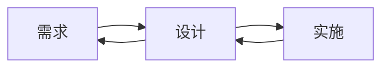

我曾经害怕开始复杂功能的开发。你知道那种感觉——盯着一个模糊的需求，比如"构建多平台发布系统"，不知道从哪里开始。应该从网络爬虫逻辑开始吗？用户界面？数据库架构？没有清晰的路线图，我总是会以半成品功能、范围蔓延和那种遗漏了重要内容的不安感而告终。

这个挑战在我开发 [ArtiPub](https://github.com/crawlab-team/artipub)（一个开源多平台文章发布工具）时变得特别明显。该项目需要集成多个平台（掘金、CSDN、知乎、SegmentFault），处理不同的内容格式，管理跨平台用户认证，并构建一个强大的网络爬虫系统。没有适当的规划，这样的复杂性很容易失控。

最近，我通过 Kiro 发现了**规格驱动开发（SDD）**，它从根本上改变了我处理功能开发的方式。SDD 不仅仅是另一种方法论——它是一种系统化的方法，解决现代软件开发中的三个关键痛点：**混乱的任务管理**、**需求偏差**和**低效的开发沟通**。

{/* truncate */}

## 什么是规格驱动开发？

传统开发通常遵循临时模式：收到功能请求，也许写一些粗略的笔记，然后直接开始编码。这种方法适用于简单任务，但在复杂功能上很快就会崩溃。你最终会遇到：

- **范围蔓延**，因为需求在实施过程中不断演变
- **技术债务**，来自匆忙的架构决策
- **沟通不畅**，利益相关者对实际构建的内容存在分歧
- **不完整的功能**，遗漏边缘情况或用户需求

规格驱动开发颠覆了这种方法。SDD 不是代码优先的开发，而是遵循结构化的三阶段方法论：

**阶段 1：需求收集** - 使用结构化格式（如 EARS - 需求语法简易方法）将模糊的功能想法转化为精确、可测试的需求。每个需求都包括用户故事和具体的验收标准。

**阶段 2：设计文档** - 创建涵盖架构、数据模型、接口和错误处理的全面技术设计。这个阶段结合研究，确保所有需求在技术上可行。

**阶段 3：实施规划** - 将设计分解为离散的、可管理的编码任务。每个任务都在之前的工作基础上递增构建，并包含对需求的具体引用。

Kiro 的 SDD 与其他 AI 编程助手的不同之处在于这种系统化方法。虽然 GitHub Copilot 或 ChatGPT 等工具擅长生成代码片段，但它们缺乏指导你完成复杂功能开发的结构化方法论。Cursor 提供出色的代码补全，但不能帮助需求分析或设计规划。

Kiro 将功能开发视为工程学科，而不仅仅是编码练习。结果是更周到的软件，真正解决用户问题。

## 三个改变游戏规则的好处

### 1. 真正有效的可管理任务分解

Kiro 方法让我印象深刻的第一件事是它如何将压倒性的功能转化为可消化的任务。不再是盯着"构建用户认证"而不知道从哪里开始，SDD 系统地分解它。

传统方法可能是这样的：
- "实现用户登录"
- "添加密码重置"
- "创建用户配置文件"

而 Kiro 的 SDD 分解：
- **任务 1.1**：创建带验证的用户数据模型
- **任务 1.2**：实现带 JWT 令牌的认证服务
- **任务 1.3**：构建带错误处理的登录 API 端点
- **任务 2.1**：创建密码重置令牌生成
- **任务 2.2**：实现安全的密码重置流程
- **任务 3.1**：设计用户配置文件数据结构
- **任务 3.2**：构建配置文件管理 API

每个任务都包含具体的需求引用、明确的目标，并在之前的工作基础上递增构建。不再疑惑"我下一步应该做什么？"或"我是否忘记了什么重要的事情？"

心理影响是巨大的。不再被庞大的功能压倒，你可以获得完成具体、明确定义任务的满足感。进度变得可见和可衡量。项目经理喜欢它，因为他们可以实际跟踪有意义的进度，而不仅仅是"仍在处理认证"。

我特别欣赏的是 SDD 如何防止孤立构建的常见陷阱。每个任务都明确连接到用户需求，所以你永远不会忘记为什么要构建某些东西。递增方法也意味着你可以早期验证核心功能，在问题变得昂贵修复之前捕获它们。

### 2. 在问题发生之前消除需求偏差

第二个主要好处在最近一个项目中让我印象深刻，利益相关者在看到实施后不断说"这不是我们的意思"。听起来熟悉吗？

传统开发经常遭受电话游戏效应。产品经理有一个想法，向开发人员解释，开发人员通过他们的技术视角解释它，构建一些东西，然后每个人都发现了脱节。到那时，你已经在错误的方向上投入了大量时间。

SDD 的结构化需求阶段强制提前对齐。不再是像"用户应该能够管理他们的数据"这样的模糊陈述，Kiro 引导你创建具体、可测试的需求：

**SDD 之前：**
> "用户应该能够管理他们的数据"

**SDD 之后：**
> **用户故事：** 作为注册用户，我想编辑我的配置文件信息，以便我可以保持我的账户详细信息最新。
> 
> **验收标准：**
> 1. 当用户点击"编辑配置文件"时，系统应显示带有当前信息的可编辑表单
> 2. 当用户提交有效更改时，系统应更新配置文件并显示成功消息
> 3. 当用户提交无效数据时，系统应显示具体的验证错误

这种具体程度使偏差几乎不可能。利益相关者可以审查需求文档并说"是的，这正是我们需要的"或"不，我们还需要 X 和 Y"。设计阶段然后在编写任何代码之前确保技术可行性。

我发现在需求上多花一个小时可以节省后来几天的返工。SDD 内置的迭代审查过程意味着每个人——产品经理、设计师、开发人员和用户——在实施开始之前对正在构建的内容有清晰、共同的理解。

### 3. 用激光聚焦的沟通切断 AI 聊天噪音

这是 Kiro 相比其他 AI 编程工具真正闪耀的地方。如果你使用过 ChatGPT 或 Claude 进行开发，你知道冗长、漫无目的的对话的挫败感，这些对话似乎永远无法切中要点。

**典型的 AI 编程对话：**
> **你：** "帮我构建用户认证"
> 
> **AI：** "我很乐意帮你构建用户认证！我们可以采取几种方法。首先，让我们考虑你是想使用 JWT 令牌还是基于会话的认证。JWT 令牌是无状态的，适用于 API，而会话更传统。我们还应该考虑密码哈希 - bcrypt 是一个流行的选择，尽管 argon2 更现代。对于数据库，你需要一个用户表，包含电子邮件、密码哈希、创建时间等字段... [继续 500 多个单词]"

**与 Kiro 的 SDD 对话：**
> **你：** "执行任务 1.2：实现带 JWT 令牌的认证服务"
> 
> **Kiro：** "开始任务 1.2。基于需求和设计文档，我将创建带有指定令牌过期和刷新逻辑的 JWT 认证服务。"
> 
> [Kiro 实现所需的确切功能，不多不少]

差别是天壤之别。因为 Kiro 拥有来自你的需求和设计文档的完整上下文，它不需要询问澄清问题或提供通用建议。它确切地知道你在构建什么，可以专注于实施。

这种效率随着时间的推移而复合。不再在每次对话中花费 20 分钟解释上下文，你花费 2 分钟执行具体任务。不再筛选段落的通用建议，你得到适合你确切用例的有针对性的解决方案。

结构化方法还消除了 AI 工具建议不适合你架构的解决方案的常见问题。Kiro 理解你的设计决策和约束，所以它的建议总是在上下文上合适的。

## 真实世界示例：构建文档协作功能

让我展示这在实践中是如何发挥作用的。最近，我需要构建一个文档协作功能——想想 Google Docs 风格的实时编辑，带有评论和版本历史。

**传统方法（SDD 之前）：**
我会从研究 WebSocket 库开始，也许构建一个基本的实时文本编辑器，然后意识到我需要处理冲突，然后想出评论，然后发现我没有考虑权限... 三周后，我会有一个半工作的原型，遗漏了几个关键需求。

**与 Kiro 的 SDD 方法：**

**第 1 周 - 需求和设计：** Kiro 引导我创建详细的需求，涵盖实时编辑、冲突解决、评论线程、版本历史和权限。设计阶段提前识别了技术挑战，并选择了合适的技术（WebSockets、操作变换、事件溯源）。

**第 2-3 周 - 系统化实施：** 不是随机构建，我遵循任务分解：
- 任务 1：文档数据模型和验证
- 任务 2：带版本跟踪的基本 CRUD 操作
- 任务 3：实时更新的 WebSocket 基础设施
- 任务 4：冲突解决的操作变换算法
- 任务 5：带线程的评论系统
- 任务 6：权限管理集成

**结果：** 一个功能齐全的协作系统，处理了我会遗漏的边缘情况，具有清晰的架构，使添加功能变得简单。更重要的是，利益相关者确切地知道他们会得到什么，因为他们已经提前批准了详细的需求。

时间投资是相似的，但结果显著更好。不是一个"大部分工作"的原型，我交付了一个解决真实用户需求的生产就绪功能。

## 为什么 SDD 改变一切

规格驱动开发不仅仅是一种方法论——它是一种思维转变，改变了你处理软件开发的方式。我强调的三个好处——可管理的任务分解、减少需求偏差和高效的 AI 沟通——复合创造了大于其各部分总和的东西。

你不再害怕复杂功能，因为你有系统化的方法来处理它们。利益相关者对话变得富有成效，因为每个人都有共同的理解。AI 交互变得激光聚焦，因为上下文已经建立。

最重要的是，你开始构建真正解决问题的软件，而不仅仅是实现功能。在需求和设计上的前期投资在整个开发生命周期中都会带来回报。

如果你厌倦了范围蔓延、沟通不畅和无处可去的冗长 AI 对话，试试 Kiro 的规格驱动开发方法。从一个小功能开始，遵循三阶段过程，体验系统化开发带来的差异。

你未来的自己——和你的利益相关者——会感谢你的。