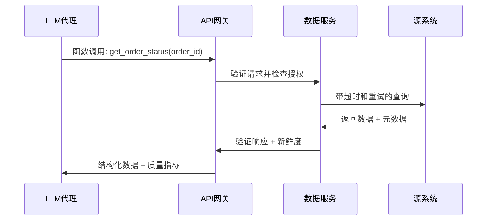
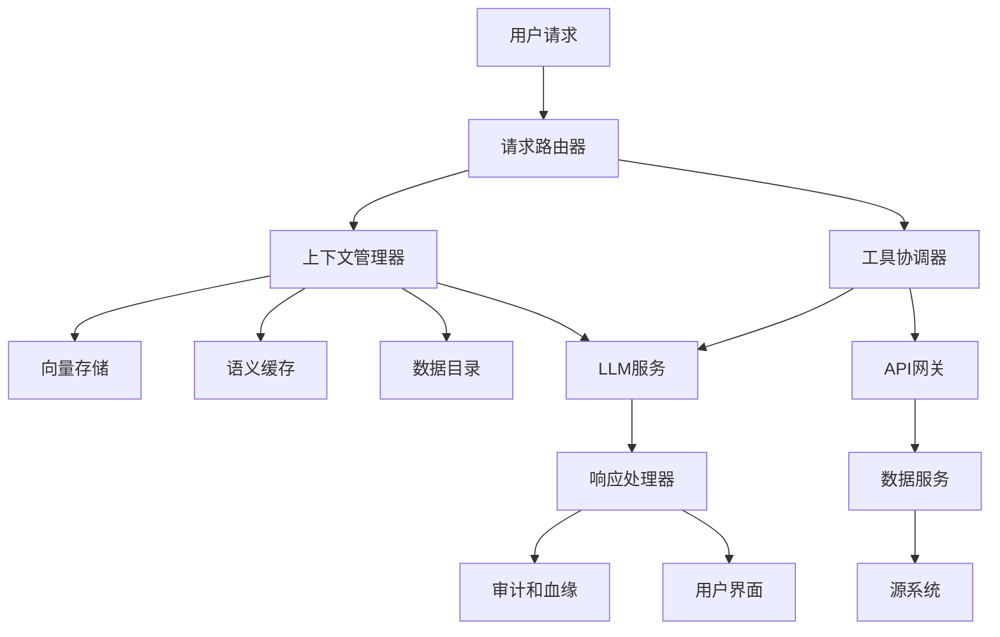

# 从聊天机器人到代理：构建企业级LLM应用

想象一下这样的场景：周一上午9点，你坐在又一个关于为什么公司的LLM应用无法超越展示阶段的会议中。你的团队已经构建了一个由GPT-4o驱动的复杂AI代理，能够处理复杂的客户询问，通过函数调用与内部系统协调，甚至能以惊人的智能管理多步骤工作流。领导层很兴奋，预算也获得批准。但六个月后，你仍然困在行业老手们称之为"演示炼狱"的状态中——无休止的循环，充满了有前景的LLM应用，但从未真正实现可靠的生产部署。

如果这个场景听起来很熟悉，你并不孤单。无论组织是使用GPT-4o、Claude Sonnet 4和Gemini 2.5 Pro等托管API构建，还是部署DeepSeek-R1、QwQ、Gemma 3和Phi 4等自托管模型，绝大多数都难以超越实验性试点阶段。症结不在于你的LLM集成的复杂性、托管与自托管模型之间的选择，或AI开发团队的才能。而是更根本的问题：构建LLM应用的数据基础。

:::note 核心概念 — 数据基础优先
无论使用GPT-4o API还是自托管DeepSeek-R1，LLM应用的成功取决于数据基础设施，而非模型选择。
:::

{/* truncate */}

残酷的事实是，企业LLM应用的成功——无论你是在构建自主代理、上下文感知聊天机器人，还是工具使用AI系统——主要不在于找到完美的模型或设计最复杂的提示。而在于构建强大的、治理良好的数据基础设施，能够可靠地为你的LLM应用提供高质量、可访问和可信赖的数据，用于上下文、工具使用和决策制定。当行业迷恋于函数调用能力和多代理框架时，真正的竞争优势在于一些远不那么炫目但无限更有价值的东西：你的数据平台。

从不同的角度思考一下。你的LLM代理只能和它们通过工具调用和上下文检索能够访问和操作的数据一样好，而在大多数企业中，这些数据分散在几十个系统中，被困在部门孤岛里，被不一致性困扰，这会让任何AI系统变得不可靠。你可能拥有世界上最复杂的代理框架，但如果你的代理从17个不同的数据库中消费数据，这些数据库有冲突的模式且没有中央治理，你本质上是在用方形轮子制造法拉利。

本文主张企业LLM应用方法的根本转变：从以模型为中心到以数据为中心的架构。不是从"我们应该使用什么LLM？"或"我们应该自托管还是使用API？"开始，第一个问题应该是"我们是否有数据基础设施基础来支持规模化的可靠LLM应用？"这不仅仅是拥有数据仓库或向量数据库——而是将数据作为专门为LLM消费模式设计的一流产品来对待。

**核心概念：将数据视为产品，具有明确的契约、SLA和为LLM访问模式优化的所有权。**

在接下来的章节中，我们将探索LLM应用面临的独特数据挑战，从上下文管理到工具使用基础设施。我们将研究适当的数据基础如何启用可靠的函数调用、语义检索和多代理协调。我们将讨论特定于LLM应用的治理模式，最后，我们将提供在坚实数据基础上构建生产就绪LLM应用的具体实施策略。目标不是贬低好的模型或复杂代理架构的重要性——它们非常重要。相反，是要认识到在企业环境中，你的数据基础设施是决定这些LLM能力是否能看到生产之光的力量倍增器。

## LLM应用背后的数据现实

:::warning 核心概念 — 上下文决定能力
LLM应用在无法访问或信任企业数据时失败，无论模型多么复杂。
:::

在我们能够构建有效的LLM应用之前——无论是使用GPT-4o API还是自托管DeepSeek-R1——我们需要理解为什么这么多有前景的实现在遇到真实企业数据时会失败。模式惊人地一致：一个在精心策划的测试场景中运行良好的令人印象深刻的概念验证，然后是数月的努力来使其在实际业务系统和现实世界数据复杂性中可靠工作。

考虑这个场景：你的团队使用Claude Sonnet 4构建了一个智能客户服务代理，在演示中展现了卓越能力。它能理解复杂的客户询问，从知识库检索相关信息，调用函数检查订单状态，甚至适当升级问题。在使用干净、策划数据的受控测试中，系统达到了94%的客户满意度评级。

然而，当部署到生产环境时，系统的性能在数周内急剧下降。客户抱怨响应不一致，函数调用出现神秘错误，从知识库检索的上下文变得越来越不相关。代理有时提供过时信息，无法访问关键客户数据，或基于不完整上下文做出决策。

问题不在于LLM或代理框架——而在于企业LLM应用必须应对的数据基础设施现实。

### 上下文窗口vs企业知识

现代LLM，无论是像GPT-4o（128k上下文）这样的托管API，还是像DeepSeek-R1（通过滑动窗口注意力可能无限）这样的自托管模型，都面临一个基本约束：它们只能处理在其上下文窗口中提供的数据或通过工具调用获得的数据。即使有大规模上下文窗口，你也不能简单地将整个企业知识库转储到每个提示中。

挑战不是技术性的——而是组织和架构性的。你的客户服务代理需要访问：
- 客户档案，包含购买历史、偏好和服务交互
- 来自库存和履行系统的实时订单状态
- 具有当前定价和可用性的产品信息
- 类似问题的历史案例解决方案
- 可能根据客户层级或地区变化的公司政策
- 依赖问题复杂性和客户价值的升级规则

这些信息分散在CRM系统、电商平台、库存数据库、知识管理系统和运营工具中。每个系统都有不同的数据模型、更新频率和访问模式。结果是你的LLM代理，无论多么复杂，都在基于不完整、不一致或陈旧的上下文做决策。

:::note 核心概念 — 上下文质量胜过数量
可靠的上下文检索胜过生产LLM应用的大规模上下文窗口。
:::

### 工具集成现实：会失败的函数调用

现代LLM最强大的能力之一是函数调用——使用工具和API访问实时数据并执行操作的能力。无论你使用GPT-4o的函数调用还是使用QwQ等自托管模型实现工具使用，这些集成的成功完全取决于底层数据系统的可靠性和一致性。

实际情况是这样的：你的LLM代理需要检查客户的订单状态。函数调用成功了，但返回的数据与客户在其电子邮件确认中看到的不一致，因为订单管理系统没有与电子邮件通知服务同步。代理提供的信息在技术上是正确的，但从客户的角度来看实际上是错误的。

或者考虑这个场景：你的代理调用函数检查产品可用性，但库存系统返回的是30分钟前的缓存数据。当客户根据代理的建议尝试下订单时，产品已售罄。从技术角度来看，函数调用工作得完美，但数据基础设施未能提供LLM应用所需的当前准确信息。

### RAG数据质量问题

检索增强生成（RAG）已成为为LLM应用提供企业知识访问的标准方法。概念很优雅：嵌入你的文档，在向量数据库中索引它们，并检索相关块来为LLM响应提供上下文。实际上，RAG系统经常失败，因为它们建立在从未为语义检索设计的数据之上。

你的知识库包含格式不一致的文档、过时信息、同一政策的冲突版本，以及为人类导航而不是AI消费优化的内容。当你的RAG系统检索"相关"块时，它可能会浮现矛盾信息、过时程序，或在语法上相似但在语义上与用户实际查询无关的上下文。

根本问题是RAG假设高质量、结构良好、一致维护的源数据。但企业知识库通常是有机增长的文档、wiki和数据库集合，反映业务流程的历史演变，而不是有效RAG所需的结构化信息架构。

**关键要点**：LLM能力受到数据基础设施质量的约束，而不是模型复杂性。无论你使用最先进的托管API还是最新的自托管模型，成功都取决于解决基本的数据访问、质量和集成挑战，这些挑战能够实现可靠的上下文、有效的工具使用和准确的检索。

解决方案不是更好的提示、更大的模型或更复杂的代理框架——而是构建专门为满足LLM应用独特需求而设计的数据基础设施。在下一节中，我们将探索这在实践中是什么样子的。

## LLM工具使用和上下文的数据基础设施

:::note 核心概念 — 基础设施启用智能
LLM代理需要为程序化访问设计的数据基础设施，而不仅仅是人类消费。
:::

在诊断了LLM应用面临的数据挑战后，让我们探索适当的数据基础设施如何启用可靠的工具使用、上下文管理和多代理协调。无论你是使用GPT-4o API还是自托管DeepSeek-R1构建，模式保持一致——成功依赖于能够服务智能应用独特访问模式和可靠性要求的数据系统。

现代LLM应用与传统商业智能或分析工作负载有根本不同的数据需求。它们需要对当前业务状态的实时访问、跨不同内容类型的语义搜索、用于函数调用的可靠API，以及支持自主决策的一致数据格式。构建这种能力需要从头开始考虑数据基础设施，以LLM消费模式为出发点。

### 可靠的工具API：函数调用的数据契约

成功LLM工具使用的基础是可靠的、设计良好的API，提供对业务数据和操作的一致访问。无论你的LLM是托管的（GPT-4o、Claude Sonnet 4）还是自托管的（DeepSeek-R1、QwQ），函数调用的成功都取决于底层数据服务的质量和可靠性。

这意味着建立明确的数据契约，不仅指定什么数据可用，还指定它在不同条件下如何表现。你的客户服务代理调用函数检查订单状态——当订单系统临时不可用时会发生什么？API如何传达数据新鲜度？进行什么验证来确保返回的数据与其他系统一致？



LLM应用的有效工具API包括几个关键特征：

**一致的错误处理**：API应该返回LLM能够理解和操作的结构化错误响应，而不是通用HTTP错误。当订单查找失败时，API应该指示这是临时系统问题、无效订单ID还是授权问题。

**数据新鲜度指标**：API应该传达数据最后更新的时间，允许LLM代理适当地限定其响应。客户服务代理可以告诉客户"基于5分钟前的信息，您的订单似乎在运输中。"

**优雅降级**：当主要数据源不可用时，API应该有后备机制，提供部分信息而不是完全失败。库存检查可能返回带有新鲜度警告的缓存可用性，而不是没有信息。

### 上下文存储架构：向量数据库和语义缓存

传统数据库擅长结构化查询，但LLM应用需要语义搜索能力，能够基于含义而不是精确匹配找到相关信息。这需要专门的基础设施来进行嵌入生成、向量存储和智能缓存，以减少常见上下文模式的延迟。

LLM应用的现代上下文存储通常结合几种技术：

**向量数据库**：用于跨文档、客户交互和知识库的语义搜索。参见开源向量搜索的[FAISS](https://github.com/facebookresearch/faiss)或生产部署的托管服务如[Pinecone](https://www.pinecone.io/)。

**嵌入管理**：随着源内容变化的一致嵌入生成和更新。这包括监控嵌入漂移和维护嵌入质量。

**语义缓存**：智能缓存，识别何时相似查询可以重用以前的上下文检索结果，减少LLM应用的成本和延迟。

架构挑战是平衡检索质量与性能。你的客户服务代理需要快速从数百万以前的交互、产品文档和政策更新中找到相关上下文。系统必须在毫秒内返回上下文相关信息，同时保持高检索精度。

### 统一数据访问：MCP和集成模式

LLM数据访问最有希望的发展之一是[模型上下文协议(MCP)](https://modelcontextprotocol.io/)等标准的出现，它提供了LLM应用通过一致接口访问不同数据源的统一方式。MCP和类似标准解决了一个关键挑战：LLM应用需要从许多不同系统访问数据，但每个集成不应该需要自定义开发。

当你考虑企业LLM应用的复杂性时，统一数据访问模式的价值变得清晰。你的AI代理可能需要：
- 从你的CRM查询客户数据
- 从你的电商平台检查实时库存
- 从你的知识库检索相关文档
- 访问用于上下文的历史交互数据
- 为决策制定提取实时运营指标

没有统一访问模式，每个这些集成都需要自定义开发、认证处理、错误管理和持续维护。使用MCP等标准，LLM应用可以通过自动处理认证、速率限制和数据格式化的一致接口访问不同数据源。

| 传统集成 | MCP式集成 |
| --- | --- |
| 每个系统的自定义API客户端 | 多个数据源的单一协议 |
| 系统特定认证 | 统一认证和访问控制 |
| 每个集成的手动错误处理 | 标准化错误响应和重试逻辑 |
| 每个源的不同数据格式 | 跨源的一致数据模式 |

**关键要点**：成功的工具使用依赖于数据基础设施的可靠性，无论你使用GPT-4o还是自托管DeepSeek-R1。该模式在所有LLM部署模型中都成立——强大的数据基础启用复杂的代理能力。

构建这种基础设施改变了LLM应用与企业数据交互的方式。你不再有系统变化时会破坏的脆弱的自定义集成，而是获得一致、可靠的数据访问，启用复杂的代理行为。但仅有数据基础设施是不够的——你还需要在启用创新的同时确保生产可靠性的治理框架。让我们接下来探索这个问题。

## 生产就绪的LLM应用数据治理

:::warning 核心概念 — LLM特定风险需要专门治理
LLM应用需要考虑其独特访问模式和风险概况的治理框架。
:::

随着LLM应用从实验原型转向处理真实业务运营的生产系统，它们引入了传统数据治理框架未设计来解决的独特治理挑战。无论你部署GPT-4o驱动的代理还是自托管DeepSeek-R1系统，生产LLM应用都需要平衡创新速度与风险管理的专门治理。

LLM应用的风险是不同的。传统分析可能产生人类可以发现和纠正的错误报告，但LLM代理做出自主决策，直接与客户交互，并且可以实时影响业务运营。这种现实需要专门为智能系统独特特征设计的治理框架。

### LLM特定数据血缘：跟踪上下文源和决策轨迹

传统数据血缘跟踪数据如何流经ETL管道和分析工作流，但LLM应用需要跟踪上下文组装、工具调用和决策推理。当你的客户服务代理做出推荐或采取行动时，你需要理解的不仅是访问了什么数据，还有它如何在特定交互的上下文中被组合、加权和解释。

LLM特定血缘跟踪包括几个关键维度：

**上下文组装跟踪**：哪些文档、数据库记录和API响应被检索并包含在LLM的上下文中？这对于调试错误响应和确保符合数据访问政策都很重要。

**工具调用轨迹**：调用了什么函数，使用什么参数，返回了什么数据？当代理的决策似乎不正确时，你需要追踪整个工具调用序列来识别问题发生的位置。

**决策推理**：LLM如何在达成结论时权衡不同信息片段？虽然我们无法完全解释LLM推理，但我们可以跟踪哪些上下文被标记为最相关，以及置信度分数如何影响最终响应。

这种血缘信息服务多个目的：当LLM应用行为异常时进行调试，当法规要求决策透明度时进行合规审计，以及在你识别成功与不成功代理交互模式时进行持续改进。

### 隐私保护上下文：保护敏感数据的技术

LLM应用经常需要访问敏感信息来提供有价值的服务，但这创造了需要专门技术的隐私和安全挑战。对于可能由外部服务处理敏感数据的托管LLM API，这个挑战特别严重，但也适用于上下文数据可能被不当记录或缓存的自托管模型。

几种技术帮助平衡效用与隐私保护：

**动态数据屏蔽**：自动用保持LLM处理所需语义结构同时保护实际敏感值的合成替代品替换敏感信息。客户账号变成一致的合成标识符，个人姓名变成保持性别和文化背景的占位符值。

**上下文过滤**：基于特定LLM任务和用户授权级别智能过滤移除或编辑敏感信息。客户服务代理可能访问订单历史而不看到支付详情，而欺诈检测系统可能看到交易模式而不看到客户身份。

**差分隐私**：向LLM应用用于上下文的聚合数据添加受控噪声，同时保持AI决策制定的整体效用。

这里是隐私感知上下文过滤的最小示例：

```python
def filter_customer_context(context, user_role, sensitivity_level):
    if user_role == "support_agent":
        return context.exclude(['payment_methods', 'ssn', 'full_address'])
    elif sensitivity_level == "public":
        return context.include_only(['product_preferences', 'service_tier'])
    return context.apply_differential_privacy(epsilon=1.0)
```

关键洞察是不同的LLM应用需要对敏感数据的不同访问级别，治理框架应该支持这种粒度，同时保持一致的保护标准。

### 数据新鲜度和一致性：确保LLM应用使用当前信息

LLM应用可以基于它们访问的数据做出自主决策，这使得数据新鲜度和一致性对运营可靠性至关重要。当你的库存管理代理基于过时销售数据做出库存建议，或你的客户服务代理报出一小时前已经改变的价格时，业务影响可能是立即和重大的。

LLM应用的治理框架必须解决几个新鲜度和一致性挑战：

| 治理要求 | 托管API（GPT-4o、Claude） | 自托管（DeepSeek-R1、QwQ） | 
| --- | --- | --- |
| 数据驻留 | 控制有限，检查提供商政策 | 完全控制数据位置和处理 |
| 上下文记录 | 依赖提供商，可能需要特殊协议 | 完全控制记录和保留 |
| 访问审计 | API级跟踪，内部可见性有限 | 完整审计轨迹和自定义合规报告 |
| 数据新鲜度SLA | 必须依赖外部数据，更难保证 | 直接控制数据管道和新鲜度 |

**实时数据验证**：在向LLM应用提供上下文之前，实施验证相关系统间数据一致性的检查。如果你的CRM中的客户数据与计费信息不匹配，验证系统可以标记这种不一致性进行解决，而不是提供潜在冲突的上下文。

**时间界限上下文**：明确跟踪和传达LLM上下文中不同信息片段的年龄，允许代理适当限定其响应，用户理解他们接收信息的时效性。

**跨系统一致性监控**：自动监控识别不同系统间相关数据何时变得不一致，在LLM应用开始基于矛盾信息做决策之前触发警报。

**关键要点**：治理框架必须解决LLM特定风险，如上下文泄漏和决策可追溯性，同时启用使智能应用有价值的数据访问模式。

LLM应用的有效治理不是关于阻止创新——而是关于创建允许复杂代理能力在生产环境中可靠运行的框架。这个治理基础，结合适当的数据基础设施，创造了LLM应用能够提供真正业务价值的条件。在我们的最后一节中，我们将探索将这些概念汇集在一起的实际实施模式。

## 实施模式：在坚实数据基础上构建LLM应用

:::note 核心概念 — 架构模式胜过技术选择
成功的LLM应用建立在数据基础设施模式之上，而不仅仅是巧妙的提示。
:::

在探索了企业LLM应用的数据挑战、基础设施需求和治理模式后，让我们研究这些概念如何在实际实施模式中汇集在一起。无论你是使用GPT-4o等托管API构建还是部署DeepSeek-R1等自托管模型，基本架构模式保持一致——成功来自将数据作为基础而不是事后想法来对待。

我们将探索的实施模式代表了将LLM应用从令人印象深刻的演示转移到可靠生产系统的经过实战检验的方法。这些模式在不同LLM部署模型中都有效，因为它们解决的是底层数据和基础设施挑战，而不是模型特定的细节。

### LLM应用架构：组件、数据流和系统边界

生产LLM应用需要与传统软件系统不同的架构思维。它们需要在多个数据源之间协调，维护对话状态，可靠处理函数调用，并提供可解释的决策制定——所有这些都要保持用户对智能系统期望的响应性。



这种架构分离了几个关键关注点：

**请求路由**：基于请求类型、用户授权和系统可用性确定适当的处理路径。简单查询可能使用缓存响应，而复杂请求需要完整的上下文组装和工具协调。

**上下文管理**：从多个源组装相关信息，处理语义搜索、数据新鲜度验证和隐私过滤。这个组件确保LLM应用能够访问当前、相关和适当过滤的信息。

**工具协调**：管理函数调用、API集成和数据访问，具有适当的错误处理、重试逻辑和结果验证。这一层从LLM应用逻辑中抽象出企业系统集成的复杂性。

**LLM服务抽象**：提供一致的接口，无论你使用托管API还是自托管模型，处理提示构造、响应解析和模型特定优化。

关键架构洞察是数据关注点——上下文组装、工具协调和结果验证——应该由专门组件处理，而不是嵌入在LLM提示或应用逻辑中。

### 技术选择：为上下文存储、工具执行和数据集成选择正确工具

LLM应用的技术景观包括既有的企业数据工具和较新的AI特定平台。做出正确选择需要理解不同技术如何服务智能应用的独特需求。

| 组件 | 技术选项 | 关键考虑因素 |
| --- | --- | --- |
| 向量存储 | [Pinecone](https://www.pinecone.io/)、[Weaviate](https://weaviate.io/)、[FAISS](https://github.com/facebookresearch/faiss) | 规模要求、托管vs自托管、集成复杂性 |
| 上下文管理 | 自定义开发、[LangChain](https://langchain.com/)、[LlamaIndex](https://www.llamaindex.ai/) | 灵活性vs开发速度、供应商锁定考虑 |
| 工具协调 | [Zapier](https://zapier.com/)、自定义API网关、[MCP](https://modelcontextprotocol.io/)实现 | 集成生态系统、自定义需求、可靠性要求 |
| 数据治理 | [DataHub](https://www.datahubproject.io/)、[OpenMetadata](https://open-metadata.org/)、企业数据目录 | 现有基础设施、合规要求、团队能力 |

选择过程应该优先考虑集成能力而不是特性丰富性。最佳技术选择是那些与你现有数据基础设施良好集成且能随你的LLM应用需求成熟而演化的。

**技术选择框架**：
1. **集成优先**：选择与你现有数据基础设施良好集成的技术，而不是需要彻底更换的技术。
2. **标准支持**：优先选择支持MCP等数据访问新兴标准和OpenLineage等治理标准的技术。
3. **运营成熟度**：评估监控、调试和维护能力，不仅仅是开发特性。
4. **扩展模式**：考虑每个技术选择如何随着增加的使用量和数据复杂性扩展。

### 迁移策略：从原型LLM应用转向生产就绪系统

从LLM原型到生产系统的旅程不仅涉及扩展基础设施——它需要在如何处理数据访问、错误处理和系统可靠性方面的根本改变。大多数组织低估了这种转换，导致我们前面讨论的"演示炼狱"问题。

**阶段1：数据基础评估（1-2个月）**
在投资生产LLM基础设施之前，评估你的数据基础是否能支持智能应用。这包括编录LLM应用需要的数据源，评估数据质量和新鲜度，在负载下测试API可靠性，以及识别可能创建合规风险的治理差距。

**阶段2：基础设施加固（3-4个月）**
将概念验证集成转换为生产就绪的数据基础设施。用基于API的访问替换直接数据库连接，实施适当的错误处理和重试逻辑，为数据质量问题添加监控和警报，以及为LLM决策审计建立数据血缘跟踪。

**阶段3：上下文和工具优化（2-3个月）**
为生产规模和可靠性优化上下文检索和工具使用。这包括实施语义缓存以减少延迟和成本，为你的特定用例优化向量搜索，构建具有适当错误恢复的工具协调，以及添加上下文质量监控和改进。

**阶段4：生产部署和监控（持续）**
使用全面监控、渐进推出策略和持续改进流程部署LLM应用。这包括上下文和工具有效性的A/B测试，监控业务影响和用户满意度，迭代数据质量和新鲜度，以及基于使用模式扩展基础设施。

这里是具有适当错误处理的工具执行的最小示例：

```python
async def execute_tool_with_recovery(tool_name, parameters, max_retries=3):
    for attempt in range(max_retries):
        try:
            result = await tool_registry.execute(tool_name, parameters)
            if result.is_valid():
                return result.with_metadata(freshness=result.timestamp)
            else:
                raise DataQualityError(f"无效结果: {result.errors}")
        except (NetworkError, TimeoutError) as e:
            if attempt == max_retries - 1:
                return ErrorResult(f"工具在{max_retries}次尝试后不可用")
            await asyncio.sleep(2 ** attempt)  # 指数退避
```

**关键要点**：架构模式无论使用GPT-4o API还是自托管DeepSeek-R1都保持一致——数据基础最重要。特定的LLM部署模型影响实施细节，但数据访问、上下文管理和工具协调的基本模式保持不变。

企业LLM应用的成功来自认识到挑战主要不在于选择正确的模型或制作完美的提示——而在于构建能够使复杂代理能力在规模上可靠运行的数据基础设施。理解这种区别的组织将是那些成功从演示转向提供真正业务价值的生产系统的组织。

## 结论

在我们对企业LLM应用的探索中，我们涵盖了重要内容——从诊断为什么有前景的演示在生产中失败，到设计支持可靠代理能力的以数据为中心的架构。无论你是使用GPT-4o、Claude Sonnet 4、Gemini 2.5 Pro构建，还是部署DeepSeek-R1、QwQ、Gemma 3或Phi 4等自托管模型，根本教训保持一致：LLM应用的成功远比模型选择或托管方法更依赖于数据基础设施质量。

我们概述的转型代表了企业LLM应用从实验奇观到业务关键系统的成熟。我们已经看到数据可访问性挑战如何约束甚至最复杂的模型，适当的基础设施如何启用可靠的函数调用和上下文管理，治理框架如何必须为LLM特定风险演化，以及经过验证的实施模式如何能够指导从原型到生产的旅程。

战略要求是明确的：在坚实数据基础上构建LLM应用的组织将比那些主要专注于模型能力或代理框架的组织持续交付更可靠、可扩展和有价值的智能系统。

**我们分析的关键洞察**：
- LLM应用受到数据可访问性和质量的约束，而不是模型能力或托管选择
- 工具使用、上下文管理和RAG都依赖于为程序化访问设计的强大数据基础设施
- 生产LLM应用需要考虑其独特访问模式和风险概况的治理框架
- 成功来自将数据视为服务人类和AI系统的产品，具有适当的契约、质量标准和所有权模型

展望未来，企业LLM应用的演化将受到统一数据访问协议（如MCP）的持续进步、为AI消费优化的语义数据层，以及平衡创新与风险管理的治理框架的塑造。现在投资于这些数据基础的组织将能够利用模型能力的快速改进，而不会受到数据访问限制的约束。

**构建你的LLM就绪基础的可操作后续步骤**：
- **评估当前数据基础设施**：针对上下文组装、工具集成和实时数据访问的LLM应用需求
- **从试点项目开始**：为你的LLM应用依赖的2-3个关键数据集建立数据产品纪律
- **实施统一数据发现**：使人类开发者和LLM系统都能轻松找到和访问相关信息
- **构建治理框架**：解决LLM特定风险，同时启用智能应用所需的数据访问模式

作为构建LLM应用的软件工程师，认识到你的竞争优势不在于访问最新模型能力——这些越来越商品化——而在于构建使这些能力能够在你特定企业环境中可靠运行的数据基础设施。技术挑战很重大，但对于系统性处理它的组织来说机会也是如此。

未来属于理解这个基本真理的团队：在企业LLM应用中，数据基础设施不是支持组件——它是成功的主要决定因素。无论你是构建你的第一个智能代理还是扩展现有LLM应用，都要从数据基础开始。其他一切都从那里构建。

你在LLM应用开发中面临什么数据基础设施挑战？我们讨论的模式提供了路线图，但每个企业环境都有独特的约束和机会。关键是开始增量式地构建向这些模式，在每一步证明价值，同时朝着能够真正复杂LLM应用的全面数据基础设施努力。
