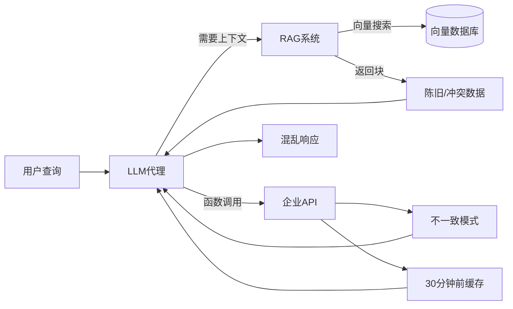
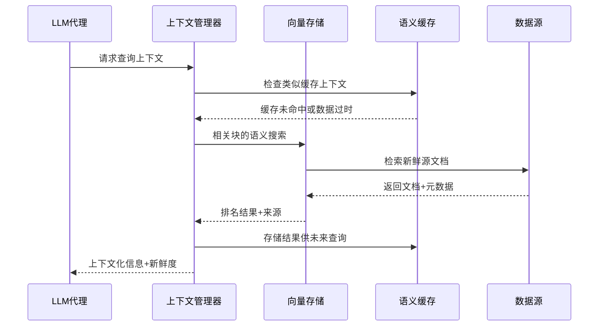
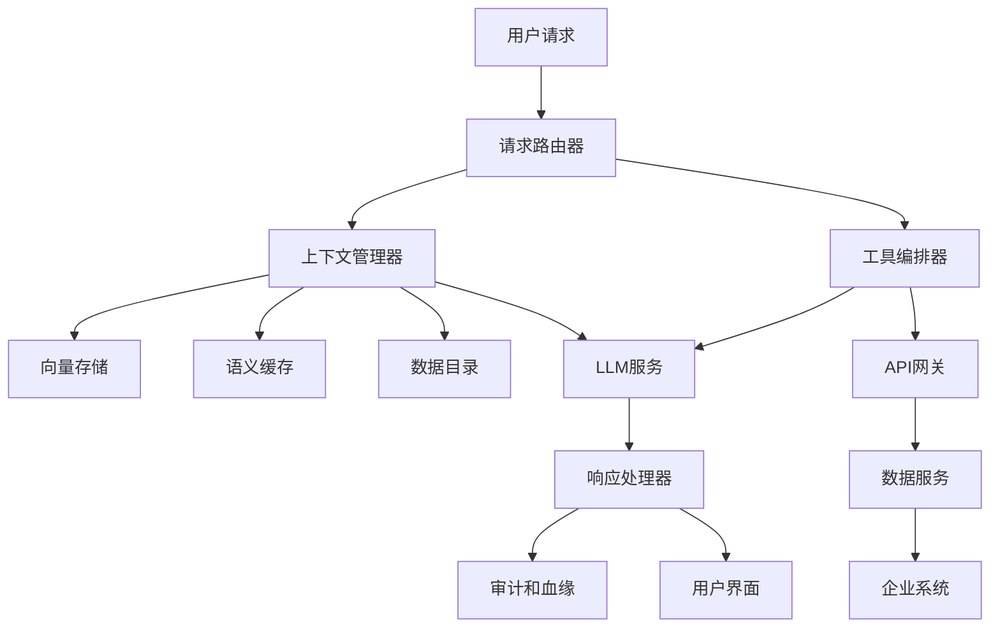
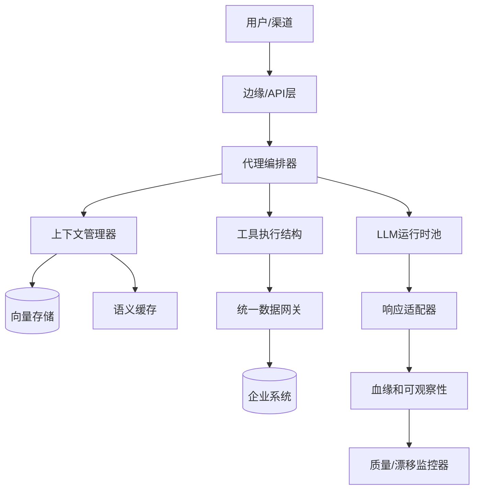

# 从聊天机器人到智能代理：构建企业级LLM应用

想象一个再熟悉不过的场景：周一上午，你又坐在会议室里复盘，为什么公司的 LLM 应用始终冲不出展示环境。团队已经搭了一个看起来很“聪明”的、由 GPT-4o 驱动的智能代理：能理解复杂客户咨询、通过函数调用串起内部系统，甚至还能看似自主地编排多步骤流程。领导层曾经热血、预算批了、Roadmap 写得很漂亮。可六个月过去，项目仍困在资深从业者口中的 demo hell（“演示炼狱”）——永远在演示，始终不上真正可承压的生产。

如果你瞬间代入，这不是偶然共鸣——而是当今企业的常态。如果这个场景听起来很熟悉，你并不孤单。无论组织是使用托管API（如GPT-4o、Claude Sonnet 4和Gemini 2.5 Pro）构建，还是部署自托管模型（如DeepSeek-R1、QwQ、Gemma 3和Phi 4），绝大多数都难以超越实验性试点项目。正如我在[AI生产力研究分析](/blog/ai-productivity)中探讨的，AI的生产力效益高度依赖于具体情境，结构化方法显著优于临时性使用。瓶颈不在于你的LLM集成的复杂性、托管与自托管模型的选择，或者你的AI开发团队的才能。而在于更根本的东西：LLM应用底层的数据基础。

**真正卡住企业级 LLM 应用的，不是“模型选哪个”，而是：能不能在对的时间，把对的数据，以可追溯、可度量、可治理的方式送到模型面前。** 你的“智能”代理，其上限只等于你数据基础设施的下限。

如果你尝试把一个惊艳的演示推向生产，结果被碎片化系统、不一致 API、缺失血缘、检索漂移、缓存陈旧这些细碎又顽固的阻力磨掉耐心——这篇文章就是写给你的。我们的基本立场很直接：企业级 LLM 应用的成功，不取决于提示技巧或代理框架炫不炫，而取决于是否有一套为“程序化智能消费”而设计的数据底座。

接下来我们会按层拆开：数据可访问性如何悄悄钳制模型表现；哪些数据与上下文管理模式让工具调用真正可靠；面向 LLM 特有风险的治理如何设计；以及如何把这些理念落成可以扩展、可演进的生产体系。

答案从来不是“多写几个高阶提示”或者“再换个更大模型”——而是重建数据基础。下面先从问题底层结构讲起。

{/* truncate */}

## 1. LLM 应用背后的数据现实

再看一个典型实例：团队部署了一个由 Claude Sonnet 4 驱动的客服代理，在测试阶段表现“堪称完美”——能听懂复杂咨询、从知识库里抓出高相关上下文、调用函数查订单、该升级时毫不犹豫。在干净、抽取良好、刻意维护的数据沙箱里，满意度一度冲到 94%。

可一旦进到真实生产，性能开始“漂移”——短短几周，用户反馈：回答不稳定、函数调用偶发失败、检索上下文越来越离题。代理会引用过期信息、拿不到关键客户字段，或者在上下文残缺时仍然“自信地”给出结论。

问题不在于LLM或代理框架——而是企业LLM应用必须导航的数据基础设施现实。

### 上下文窗口 vs. 企业知识

现代 LLM（不管是托管 API，如 GPT-4o 的 128k 窗口，还是自托管模型，例如通过滑动窗口注意力扩展上下文的 DeepSeek-R1）都有一个不变的硬约束：它只认你“塞进去”或通过工具调回来的那部分数据。上下文再大，也不代表可以把整座企业知识库“平铺直塞”进每次对话里。

这里的难题本质上不是单纯“模型技术问题”，而是组织与架构层面的：你的客服代理需要访问：
- 包含购买历史、偏好和服务交互的客户档案
- 来自库存和履行系统的实时订单状态
- 包含当前定价和可用性的产品信息
- 类似问题的历史案例解决方案
- 可能因客户层级或地区而异的公司政策
- 依赖于问题复杂性和客户价值的升级规则

这些信息分别躺在 CRM、交易/电商平台、库存数据库、知识库系统以及一堆运营工具里；每块又各自有不同模型、刷新节奏、访问模式。结果就是：再复杂的 LLM 代理，也只能在“缺片、冲突、滞后”的上下文拼图上被迫决策。

### 工具集成现实：会失败的函数调用

函数调用（工具使用）是现代 LLM 的“放大器”——用来拉实时数据、执行操作。无论是 GPT-4o 的函数调用还是自托管 QwQ 的工具插件，本质成败系于下面那层数据系统是否可靠、一致、延迟可控。

典型翻车现场：代理要查订单状态，函数调用成功，却返回一个与客户邮件确认不一致的状态——因为订单管理系统与通知服务同步延迟。技术上“调用成功+语法正确”，语义上对用户却是错的。

```python
# 看似工作但返回不一致数据的函数调用
def get_order_status(order_id):
    # 返回落后30分钟的缓存数据
    # 客户在邮件中看到"已发货"，但这里返回"处理中"
    return order_system.query(order_id)  # 陈旧缓存命中
```

再比如：代理调用库存查询接口，结果命中 30 分钟前的缓存；用户按建议去下单——发现缺货。调用链“全绿”，体验却“全红”。根因仍然是：数据底座没提供“当前且可信”的视图。

### RAG数据质量问题

检索增强生成（RAG）成了给 LLM 应用“接企业知识”的默认姿势：嵌入 → 向量索引 → 相关块检索 → 拼装上下文。理念优雅，落地常翻车，因为下面那堆原始数据本来就不是为“语义检索”设计或维护的。

知识库里：格式漂移的文档、过期页面、互相打架的多版本政策、为“人类浏览”而非“机器摄取”组织的段落。于是 RAG 系统检回来的“相关”块，常常语义冲突、时间过期，或者只是“字面相似却业务无关”。



根因在于：RAG 方案隐含一个前提——源数据高质量、结构稳定、持续维护；而真实企业知识库存量往往是历史演化层层沉积出的"文档 + Wiki + 临时表"拼装体，远非面向语义检索的"信息架构产品"。

关于信息架构如何影响AI系统性能的全面探讨，请参阅[上下文工程：AI系统中信息选择的艺术](/blog/context-engineering)。

**关键要点**：没有精心策划、新鲜、合同治理的数据表面，先进的工具使用和检索管道会退化为脆弱的猜测。无论你使用最先进的托管API还是最新的自托管模型，成功都取决于解决基本的数据访问、质量和集成挑战，这些挑战能够实现可靠的上下文、有效的工具使用和准确的检索。

解决方案不是更好的提示、更大的模型或更复杂的代理框架——而是构建专门设计来满足LLM应用独特需求的数据基础设施。

## 2. 支撑 LLM 工具使用与上下文的数据基础设施

在识别这些数据层面的真实掣肘之后，下一步就是：一套怎样的数据基础设施，才能让工具调用稳定、上下文组装可信、多代理协同不失控。无论是用 GPT-4o API 还是自托管 DeepSeek-R1，底层模式并没有变——决定成败的仍是：是否具备支撑 LLM 应用特有访问模式与可靠性需求的数据系统。

现代 LLM 应用和传统 BI/分析在数据模式上的“断层”极大：需要实时（或准实时）业务状态、跨多模内容的语义检索、可恢复的函数/工具调用 API、以及支撑“自主式”决策的一致结构化/半结构化格式。这要求我们自底向上按“供智能程序消费”重新设计数据栈。

### 可靠的工具API：函数调用的数据合同

成功的 LLM 工具（函数）调用建立在一组可靠、契约清晰的 API 之上——它们对数据与操作的访问行为可预测、边界明确、异常可区分。无论托管还是自托管，工具调用成功率的“地板”就是这些数据服务的工程质量。

这意味着要有“数据合同”意识：不仅说明“字段有哪些”，更要定义“在超时 / 降级 / 缓存 / 偏差校验失败”等场景的行为向量。一个订单状态查询：主系统超时怎么办？新鲜度如何编码进响应？跨系统一致性偏差阈值多少触发 Warning？

```python
async def get_order_status(order_id: str) -> OrderStatus:
    try:
        # 验证输入并首先检查缓存
        if not order_id or len(order_id) < 8:
            return OrderStatus.error("无效的订单ID格式")
        
        # 尝试主系统并设置超时
        result = await order_service.get_status(order_id, timeout=5)
        
        # 验证数据新鲜度和一致性
        if result.last_updated < datetime.now() - timedelta(minutes=10):
            result.add_warning("数据可能已过时")
            
        return result.with_metadata(freshness=result.last_updated)
        
    except TimeoutError:
        # 优雅降级到缓存数据
        cached = await cache.get_order_status(order_id)
        return cached.with_warning("由于系统超时使用缓存数据")
```

一套面向 LLM 消费的工具 API 至少应具备：

**一致的错误语义**：返回结构化、可模式匹配的错误对象（而非只能读文案的 500）。例如订单查不到：区分“临时不可用”“ID 无效”“权限不足”。

**数据新鲜度指示器**：显式时间戳或新鲜度等级，允许代理限定回答：“基于 5 分钟前状态，订单仍在运输途中…”。

**可控降级策略**：主源失败时有可解释回退（缓存 / 次级源 / 聚合估值），并贴上“新鲜度/可信度”标签，而不是“一刀切失败”。

### 上下文存储架构：向量数据库和语义缓存

传统数据库擅长结构化谓词过滤；LLM 应用则需要“按语义邻近”找信息。这迫使我们引入：嵌入批处理/增量更新、向量存储、以及带语义归并能力的缓存层，来控制延迟与成本。

LLM应用的现代上下文存储通常结合几种技术：

**向量数据库**：用于跨文档、客户交互和知识库的语义搜索。选项从开源向量搜索（如[FAISS](https://github.com/facebookresearch/faiss)）到生产部署的托管服务（如[Pinecone](https://www.pinecone.io/)）。

**嵌入管理**：随着源内容变化的一致嵌入生成和更新。这包括监控嵌入漂移和随时间维护嵌入质量。

**语义缓存**：智能缓存，识别何时类似查询可以重用先前的上下文检索结果，减少LLM应用的成本和延迟。



架构挑战是平衡检索质量与性能。你的客户服务代理需要从数百万次先前交互、产品文档和政策更新中快速找到相关上下文。系统必须在毫秒内返回上下文相关的信息，同时保持高检索精度。

### 统一数据访问：MCP和集成模式

LLM数据访问中最有前景的发展之一是像[模型上下文协议（MCP）](https://modelcontextprotocol.io/)这样的标准的出现，它为LLM应用通过一致接口访问不同数据源提供了统一方式。MCP和类似标准解决了一个关键挑战：LLM应用需要从许多不同系统访问数据，但每个集成不应该需要自定义开发。

当你考虑企业LLM应用的复杂性时，统一数据访问模式的价值变得清晰。你的AI代理可能需要：
- 从CRM查询客户数据
- 从电子商务平台检查实时库存
- 从知识库检索相关文档
- 访问历史交互数据以获取上下文
- 拉取实时操作指标进行决策

没有统一的访问模式，每个集成都需要自定义开发、身份验证处理、错误管理和持续维护。使用像MCP这样的标准，LLM应用可以通过自动处理身份验证、速率限制和数据格式化的一致接口访问不同的数据源。

| 部署模型 | 数据访问模式 | 优势 | 考虑因素 |
| -------- | ------------ | ---- | -------- |
| 托管API（GPT-4o、Claude） | 通过网关的外部工具调用 | 更快迭代，托管扩展 | 数据出口，延迟，隐私约束 |
| 自托管（DeepSeek-R1、QwQ） | 集群内工具适配器 | 更低延迟，更严格控制 | 更高基础设施和运维负担 |
| 混合 | 混合编排器路由 | 灵活性，工作负载优化 | 一致性和治理的复杂性 |

关键洞察是不同的LLM应用需要对敏感数据的不同级别访问，治理框架应该支持这种粒度，同时保持一致的保护标准。

**关键要点**：成功的工具使用取决于数据基础设施的可靠性，无论你使用GPT-4o还是自托管的DeepSeek-R1。模式在不同LLM部署模型中保持一致——强大的数据基础使复杂的代理能力成为可能。

构建这种基础设施改变了LLM应用与企业数据交互的方式。你不再有在系统变化时会破坏的脆弱自定义集成，而是获得一致、可靠的数据访问，使复杂的代理行为成为可能。但仅有数据基础设施是不够的——你还需要确保生产可靠性同时支持创新的治理框架。

---

## 3. LLM 应用的生产级数据治理

当 LLM 应用从“实验室里的惊艳演示”走向“接入真实业务流量”，原有面向报表/分析的治理框架就开始失灵——它们并未为“实时交互 + 自主决策 + 工具调用”组合风险而生。无论是 GPT-4o 驱动的托管代理还是自托管 DeepSeek-R1 集群，生产阶段都必须在“创新速度”与“可控风险”之间建立一套针对性治理结构。

LLM 应用的风险画像与传统分析截然不同：报表出错可以随后纠正；代理错误却可能即时影响订单、客户体验与合规敞口。于是我们需要“面向智能系统交互链路”而不是“面向离线数据管道”的治理思路。

### 面向 LLM 的数据血缘：追踪上下文来源与决策轨迹

传统数据血缘关注“数据在 ETL/分析链路的流动”；而 LLM 场景多了三条关键维度：上下文组装、工具调用序列、响应生成时的引用与权重。一个客服代理给出建议，你不仅要知道“查了哪些表/文档”，还需要复原“哪些片段被送入上下文、经过怎样的裁剪/排序、又触发了哪些工具调用”。

LLM 场景的血缘追踪至少覆盖：

**上下文组装链**：具体哪些文档片段 / 记录 / API 响应被检索、截断、拼接进最终上下文；调试错误回答与审计访问合规都依赖它。

**工具调用轨迹**：调用了哪些函数（顺序 / 参数 / 重试 / 回退）、返回了怎样的数据形态；定位“逻辑滑点”或数据不一致根因。

**决策引用视图**：可观测哪些上下文块被模型判为“高相关”、哪些被忽略；即便不能完全解释内部权重变化，也要有可回溯的引用与置信信号。

这些血缘结构支撑三类核心用例：异常交互复盘、合规/取证审计、持续优化（成功/失败模式挖掘）。

### 隐私保护型上下文：保护敏感同时不阉割智能

LLM 应用天然要“看见”一部分敏感数据才能保持业务价值，这与最小暴露、合规隔离产生张力。托管 API 模式下，外部处理链路放大数据外泄与越权风险；自托管也会在上下文落盘/日志/缓存层面埋下隐患。

几种常用手段帮助在“效用 / 隐私”之间取得工程可行平衡：

**动态掩码 / 合成替换**：实时将敏感实体替换为保持语义/关系结构的合成标识（账号、姓名、地理标签等），既保留推理必要结构，又避免暴露原值。

**上下文裁剪 / 授权感知过滤**：按任务类型 + 用户权限动态过滤字段；客服看到订单/偏好，不见完整支付；风控看到行为序列，不见身份主键。

```python
def filter_customer_context(context, user_role, sensitivity_level):
    """基于角色和数据敏感性应用隐私过滤器"""
    if user_role == "support_agent":
        # 移除付款方式和完整地址
        return context.exclude(['payment_methods', 'ssn', 'full_address'])
    elif sensitivity_level == "public":
        # 只包含非敏感偏好数据
        return context.include_only(['product_preferences', 'service_tier'])
    elif user_role == "fraud_analyst":
        # 掩码身份但保留交易模式
        return context.apply_synthetic_ids().include(['transaction_history'])
    
    return context.apply_differential_privacy(epsilon=1.0)
```

**差分隐私层**：对聚合型上下文（统计、分布特征）注入受控噪声，换取群体层面洞察与个体隐私隔离的折中。

核心观点：不同 LLM 用例对敏感数据颗粒需求不同，治理框架要原生支持这种“按用例分层授权”，而不是用一把全局开关。

### 数据新鲜度与一致性：避免“正确逻辑 + 过期事实”

当代理开始“自主”做判断，任何数据新鲜度 / 跨系统一致性滑坡都会被放大；一个基于 1 小时前价格、昨天库存、延迟到账订单状态给出的建议，往往形成“逻辑链漂移”。

因此治理必须显式把“新鲜度与一致性”建模成可观测指标：

**实时一致性校验**：在上下文装配前比对关键字段（如 CRM vs 账单系统客户状态），发现偏差→标记 / 降级 / 拒绝进入上下文。

**时间边界标记**：对上下文片段附带“年龄戳 / 新鲜度等级”，允许模型（或上层策略）决定是否需要刷新或加免责声明。

**跨系统漂移监控**：持续对关联实体做字段对账（订单状态、库存数量、客户标签），提前发现“即将劣化为矛盾”而不是事后复盘。

| 治理维度 | 托管API（GPT-4o、Claude） | 自托管（DeepSeek-R1、QwQ） | 混合考虑 |
| -------- | ------------------------- | --------------------------- | -------- |
| 数据驻留 | 有限控制，检查提供商政策 | 完全控制数据位置和处理 | 适当分区敏感数据集 |
| 上下文记录 | 依赖提供商，可能需要特殊协议 | 完全控制记录和保留 | 跨部署模型协调保留政策 |
| 访问审计 | API级别追踪，有限内部可见性 | 完整审计轨迹和自定义合规报告 | 双重审计层以实现全面覆盖 |
| 数据新鲜度SLA | 必须依赖外部数据，难以保证 | 直接控制数据管道和新鲜度 | 混合验证路径需要仔细协调 |

**关键要点**：治理既要防“上下文泄漏 / 权限越界 / 推理不可追溯”，又不能把数据访问钳死；目标是“风险弹性 + 可进化访问能力”。

有效治理的目的从来不是设“减速带”，而是铺“高速路的护栏”——让更复杂代理能力可以在可控红线内持续上线、演进、验证。

## 4. 实施模式：在坚实的数据基础上构建

在探索了企业LLM应用的数据挑战、基础设施要求和治理模式后，让我们检查这些概念如何在实际实施模式中结合在一起。无论你是使用托管API（如GPT-4o）构建还是部署自托管模型（如DeepSeek-R1），基本架构模式保持一致——成功来自于将数据视为基础而不是事后考虑。

我们将探索的实施模式代表了将LLM应用从令人印象深刻的演示转移到可靠生产系统的经过实战检验的方法。这些模式适用于不同的LLM部署模型，因为它们解决了底层数据和基础设施挑战，而不是模型特定的细节。

### LLM应用架构：组件、数据流和系统边界

生产LLM应用需要与传统软件系统不同的架构思维。它们需要跨多个数据源协调，维护对话状态，可靠地处理函数调用，并提供可解释的决策——所有这些都要保持用户期望的智能系统的响应性。



这种架构分离了几个关键关注点：

**请求路由**：基于请求类型、用户授权和系统可用性确定适当的处理路径。简单查询可能使用缓存响应，而复杂请求需要完整的上下文组装和工具编排。

**上下文管理**：从多个源组装相关信息，处理语义搜索、数据新鲜度验证和隐私过滤。此组件确保LLM应用能够访问当前、相关和适当过滤的信息。

**工具编排**：管理函数调用、API集成和数据访问，具有适当的错误处理、重试逻辑和结果验证。此层从LLM应用逻辑中抽象企业系统集成的复杂性。

**LLM服务抽象**：无论你使用托管API还是自托管模型，都提供一致的接口，处理提示构造、响应解析和模型特定优化。

关键架构洞察是数据关注点——上下文组装、工具编排和结果验证——应该由专门组件处理，而不是嵌入在LLM提示或应用逻辑中。

### 技术选择：为上下文存储、工具执行和数据集成选择正确的工具

LLM应用的技术景观包括既有的企业数据工具和较新的AI特定平台。做出正确选择需要理解不同技术如何服务于智能应用的独特需求。

| 组件 | 技术选项 | 关键考虑因素 |
| ---- | -------- | ------------ |
| 向量存储 | [Pinecone](https://www.pinecone.io/)、[Weaviate](https://weaviate.io/)、[FAISS](https://github.com/facebookresearch/faiss) | 规模要求，托管vs自托管，集成复杂性 |
| 上下文管理 | 自定义开发、[LangChain](https://langchain.com/)、[LlamaIndex](https://www.llamaindex.ai/) | 灵活性vs开发速度，供应商锁定考虑 |
| 工具编排 | [Zapier](https://zapier.com/)、自定义API网关、[MCP](https://modelcontextprotocol.io/)实现 | 集成生态系统，定制需求，可靠性要求 |
| 数据治理 | [DataHub](https://www.datahubproject.io/)、[OpenMetadata](https://open-metadata.org/)、企业数据目录 | 现有基础设施，合规要求，团队能力 |

选择过程应该优先考虑集成能力而不是功能丰富性。最佳技术选择是那些与你现有数据基础设施集成良好并能随着LLM应用需求成熟而发展的选择。

**技术选择框架**：
1. **集成优先**：选择与你现有数据基础设施集成良好的技术，而不是需要全面替换的技术。
2. **标准支持**：优先考虑支持新兴标准的技术，如用于数据访问的MCP和用于治理的OpenLineage。
3. **操作成熟度**：评估监控、调试和维护能力，而不仅仅是开发功能。
4. **扩展模式**：考虑每个技术选择如何随着使用量增加和数据复杂性而扩展。

### 迁移策略：从原型LLM应用到生产就绪系统

从LLM原型到生产系统的旅程涉及的不仅仅是扩展基础设施——它需要在如何处理数据访问、错误处理和系统可靠性方面的根本变化。大多数组织低估了这种转变，导致我们之前讨论的"演示炼狱"问题。

**阶段1：数据基础评估（1-2个月）**
在投资生产LLM基础设施之前，评估你的数据基础是否能够支持智能应用。这包括编目LLM应用需要的数据源，评估数据质量和新鲜度，在负载下测试API可靠性，以及识别可能创建合规风险的治理差距。

**阶段2：基础设施加固（3-4个月）**
将概念验证集成转换为生产就绪的数据基础设施。用基于API的访问替换直接数据库连接，实施适当的错误处理和重试逻辑，为数据质量问题添加监控和警报，以及为LLM决策审计建立数据血缘追踪。

**阶段3：上下文和工具优化（2-3个月）**
为生产规模和可靠性优化上下文检索和工具使用。这包括实施语义缓存以减少延迟和成本，为你的特定用例优化向量搜索，构建具有适当错误恢复的工具编排，以及添加上下文质量监控和改进。

**阶段4：生产部署和监控（持续）**
使用全面监控、渐进推出策略和持续改进流程部署LLM应用。这包括A/B测试上下文和工具有效性，监控业务影响和用户满意度，迭代数据质量和新鲜度，以及基于使用模式扩展基础设施。

```python
async def execute_tool_with_recovery(tool_name, parameters, max_retries=3):
    """使用适当的错误处理和恢复执行工具"""
    for attempt in range(max_retries):
        try:
            result = await tool_registry.execute(tool_name, parameters)
            if result.is_valid():
                return result.with_metadata(freshness=result.timestamp)
            else:
                raise DataQualityError(f"无效结果: {result.errors}")
        except (NetworkError, TimeoutError) as e:
            if attempt == max_retries - 1:
                return ErrorResult(f"工具在{max_retries}次尝试后不可用")
            await asyncio.sleep(2 ** attempt)  # 指数退避
```



**关键要点**：无论使用GPT-4o API还是自托管的DeepSeek-R1，架构模式都保持一致——数据基础最重要。特定的LLM部署模型影响实施细节，但数据访问、上下文管理和工具编排的基本模式保持不变。

企业LLM应用的成功来自于认识到挑战主要不是选择正确的模型或制作完美的提示——而是构建能够使复杂代理能力在规模上可靠运行的数据基础设施。理解这种区别的组织将是那些成功从演示转向提供真正业务价值的生产系统的组织。

## 结论

这篇文章从“为什么演示上天、生产塌陷”出发，拆解了企业级 LLM 应用的真实约束：不是“再加一个更大模型”，而是数据底座未能支撑可靠的上下文、工具调用与演进式治理。无论是 GPT-4o、Claude、Gemini 还是自托管 DeepSeek-R1 / QwQ / Gemma / Phi，结论一致：模型能力差异正在趋同，决定天花板的是数据基础设施的工程成熟度与治理弹性。

我们沿路看到：访问缺口会让“逻辑正确”沦为“事实错误”；不稳定的函数 / 工具调用让自主行为碎裂；无血缘的上下文组装不可调试；缺新鲜度标记的数据让决策慢性漂移；治理缺位则把“智能”转化为不可控风险放大器。

**战略要务已经非常清晰**：先让数据底座"可编排、可观测、可治理"，再谈更复杂的代理拓展。正如斯坦福研究在[我的AI生产力模式分析](/blog/ai-productivity)中所证明的，当AI能力得到结构化、高质量数据基础设施的适当支持时，最显著的改进就会出现。否则就是在技术债与不可追溯风险上叠加"智能幻觉"。

**关键洞察回顾**：
- 上限由数据可访问性 + 质量 + 新鲜度决定，而非单纯模型指标
- 工具调用 / 上下文管理 / RAG 共享同一前提：结构化、契约化、可追溯的数据层
- 生产演进需要让“上下文—调用—决策”三条链路可观测与可审计
- 把数据当成“供人和智能系统共同消费的产品”，而不是临时素材库

展望 12–24 个月：统一上下文访问协议（如 MCP）、语义数据层抽象、细粒度数据契约与策略化治理（策略即代码）会成为“默认基建”。现在投入搭建这些层的团队，将在后续模型迭代周期里获得结构性速度优势。

**行动起点（四步循环）**：
1. 盘点 & 评级：列出应用关键上下文来源，标注新鲜度 / 质量 / 权限 / 血缘可见度评分
2. 契约化 & 抽象：为 2–3 条高价值数据流定义数据/错误/新鲜度契约，替换直接 DB 读为 API/服务层
3. 观测 & 演进：接入血缘 + 上下文检索日志 + 工具调用轨迹，建立“失效模式”预警面板
4. 迭代 & 扩展：抽取通用模式（上下文裁剪、语义缓存策略、降级矩阵）复用到下一批用例

竞争优势将越来越少来自“Access to 模型本身”，而是来自“更快把模型接入可信上下文 + 更低风险推进迭代”的能力。前者在市场均衡；后者是内生能力曲线。

未来属于这样一种团队：像经营生产系统一样经营数据契约，像管理 SLO 一样管理上下文质量，像运维网络安全边界一样运维隐私与血缘。做到这些，“智能”不再是不可控的魔术，而是有约束的工程资产。

*你现在遇到的最大数据底座阻力是什么？挑一个切口，跑完上述四步小循环，让第一条链路真正“可观测”，再去复制。体系是演化出来的，不是一次性“重构”出来的。*