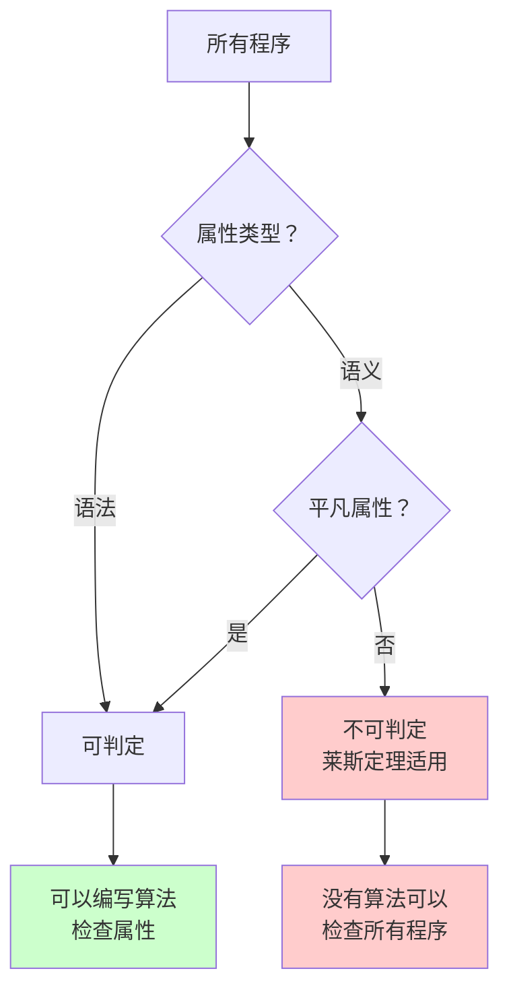
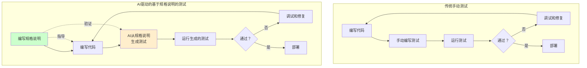

# 莱斯定理：为什么自动化测试注定失败

## 引言：完美测试的不可能之梦

"测试只能证明错误的存在，而不能证明错误的不存在。"荷兰计算机科学家艾兹格·迪杰斯特拉在1970年提出这一观点时，他阐明了软件测试的一个基本真理，这个真理至今依然适用。然而尽管有这样的智慧，软件行业仍在追求一个难以实现的目标：能够保证软件正确性的全面自动化测试。

如果你是一名开发者，曾经疑惑为什么达到100%的测试覆盖率仍然无法保证代码无bug，或者为什么精心设计的测试套件偶尔还是会漏掉关键问题，那么你正在面对一个更深层的现实。**自动化测试的局限性不仅仅是工程挑战，它根植于数学上的不可能性**。

当前的AI驱动测试工具浪潮承诺将彻底改变质量保证。营销材料宣传智能测试生成、自主bug检测和前所未有的覆盖率。虽然这些工具确实带来了真正的改进，但它们无法逃脱七十多年前数学家亨利·戈登·莱斯建立的理论约束。他的定理证明，关于程序行为的某些问题根本无法通过算法来回答，无论计算能力或独创性如何。

这不是悲观的观点，而是现实的观点。**理解为什么完全的测试自动化在数学上不可能，有助于我们更好地决策测试投入的方向，以及如何有效利用现代工具**。与其追求无法实现的完美自动化目标，我们可以采用务实的方法，在承认这些限制的同时最大化实际效果。

本文探讨莱斯定理及其对软件测试的深远影响。我们将探究这个数学结果究竟证明了什么，理解它如何约束自动化测试，并发现如何将形式化规格说明（Formal Specification）与AI驱动的测试生成结合起来，提供一条实用的前进道路。你将了解为什么知道可能性的边界能让你成为更有效的工程师，而不是被击败的工程师。

前方的旅程将我们从理论计算机科学带到日常开发实践，展示深层原理如何指导更好的工程实践。无论你是在编写单元测试、设计测试策略，还是评估新的测试工具，理解这些基础知识都将提升你的判断力并改善你的成果。

{/* truncate */}

---

## 理解莱斯定理：不可能性的数学

要理解为什么自动化测试面临根本性限制，我们必须首先掌握可计算性理论（Computability Theory）的一个显著结果。**[莱斯定理](https://en.wikipedia.org/wiki/Rice%27s_theorem)（Rice's Theorem）由亨利·戈登·莱斯于1951年证明，它指出：所有关于程序的非平凡语义属性（Non-trivial Semantic Properties）都是不可判定的（Undecidable）**。这意味着没有算法能够确定任意程序是否具有任何有趣的行为特征。

让我们仔细分析这个陈述，因为它包含了几个直接影响我们如何思考测试的关键概念。

### "不可判定"是什么意思？

在计算机科学中，当不存在能够对所有可能输入正确回答问题的算法时，一个问题就是**不可判定的（Undecidable）**。这不是关于当前技术限制的问题——这是一个数学证明，表明无论计算资源或算法巧妙性如何，这样的算法永远不可能存在。

最著名的不可判定问题是[停机问题](https://plato.stanford.edu/entries/turing-machine/)（Halting Problem），由艾伦·图灵在1936年证明。停机问题询问："给定一个任意程序及其输入，程序最终会停止还是永远运行？"图灵证明了没有通用算法能够对所有程序回答这个问题。莱斯定理将这一结果推广到涵盖关于程序行为的广泛问题类别。

### 语义属性 vs 语法属性：关键区别

莱斯定理特别适用于**语义属性（Semantic Properties）**——依赖于程序实际计算什么或执行时如何行为的特征。这与**语法属性（Syntactic Properties）**形成对比，后者只关注程序是如何编写的。

| 属性类型 | 依赖于 | 可判定？ | 示例 |
|---------|-------|---------|------|
| **语法** | 程序文本/结构 | 是 | 包含循环、使用递归、超过100行、包含特定关键字 |
| **语义** | 程序行为 | 否* | 总是返回正数、对所有输入都终止、计算质数、等价于另一个程序 |

*根据莱斯定理，非平凡语义属性是不可判定的

你可以轻松编写一个程序来检查代码是否包含`while`循环——这是语法分析。但你不能编写一个通用程序来确定`while`循环是否会终止——这是一个受不可判定性约束的语义问题。

### 莱斯定理：形式化表述

以下是莱斯定理的易懂表述：

:::note 核心概念：莱斯定理
对于程序所计算函数的任何非平凡属性，都不存在能够判定任意程序是否具有该属性的通用算法。

"非平凡"意味着该属性对某些程序为真，对其他程序为假（排除平凡真或平凡假的属性）。"语义属性"意味着该属性依赖于程序的行为，而不是其源代码结构。
:::

考虑以下关于程序的问题：
- 这个程序总是返回正确的结果吗？
- 这个程序会崩溃吗？
- 这个程序在某些输入上包含无限循环吗？
- 这个程序等价于那个程序吗？

莱斯定理证明，**没有通用的算法方法能够对所有程序回答这些问题**。每一个都是语义属性——它们依赖于程序行为——而且没有一个是平凡的。

### 可视化不可判定边界

下图展示了莱斯定理如何在我们可以和不可以确定的程序属性之间创建边界：

这个图表显示莱斯定理划出了一条清晰的界线：一旦我们询问关于程序行为的语义问题，而这些问题不是平凡回答的，我们就进入了不可判定的领域。无论工程努力或计算能力如何，都无法改变这个边界——这是数学确定性。

### 为什么这对软件工程很重要

你可能会想："当我只是想编写可靠的软件时，为什么我要关心抽象的数学定理？"答案是深刻的：**莱斯定理解释了为什么某些软件工程目标是根本无法实现的，而不仅仅是困难的**。

当工具供应商承诺"完全自动化验证"或"保证bug检测"时，他们要么声称解决了不可判定的问题（不可能），要么仔细限制了问题范围，而这种限制可能并不立即明显。理解莱斯定理帮助你批判性地评估这些声明，并为测试策略设定现实的期望。

这个定理并没有使测试变得徒劳——恰恰相反。相反，它阐明了测试从根本上是一种启发式活动：我们对程序行为进行采样、检查特定情况，并建立信心，而永远无法实现数学确定性。这种理解将我们的关注点从追求不可能的保证转移到在理论约束内最大化实际效果。

**核心概念：莱斯定理证明，询问任何程序是否具有任何有趣的行为属性在数学上是不可判定的——这是完全自动化测试不可能的理论基础**。

接下来，让我们准确探讨这些理论限制如何在实际测试实践中表现出来，以及它们对你作为开发者的日常工作意味着什么。

---

## 莱斯定理对自动化测试的意义

既然我们理解了莱斯定理建立了关于我们可以确定程序行为的基本限制，让我们将这个抽象结果与实际测试挑战联系起来。**影响是直接而严峻的：自动化测试无法提供程序正确性的完全保证，因为我们希望测试回答的问题在数学上是不可判定的**。

### 测试实际完成了什么

当你编写测试套件时，你实际上在做什么？你在检查程序对于一组特定输入和条件的行为是否正确。每个测试用例（Test Case）执行一条特定的执行路径并验证预期结果。这是有价值的工作——但它本质上是采样（Sampling），而不是证明。

考虑一个接受整数并返回布尔值的简单函数。即使这个简单的函数也有超过40亿个可能的输入（假设32位整数）。测试所有输入是不切实际的。测试代表性样本是务实的。但这里有一个关键洞察：**无论采样多少次，都无法证明函数对所有输入都正确工作，因为"对所有输入都正确工作"是受莱斯定理约束的语义属性**。

:::tip 测试现实检查
测试证明你的程序对于你测试的情况表现正确。它无法证明你的程序对于你未测试的情况表现正确。这不是测试方法论的失败——这是数学现实的结果。
:::

传统测试方法论隐含地承认了这一限制。我们使用边界值分析（Boundary Value Analysis）、等价类划分（Equivalence Partitioning）和代码覆盖率（Code Coverage）等技术来使我们的采样策略更有效。这些都是启发式方法（Heuristics）——关于哪些样本会揭示最多问题的有根据的猜测。它们在实践中效果显著，但仍然是受不可判定性约束的启发式方法。

### 不同测试方法的限制

让我们看看莱斯定理如何约束各种测试方法论：

| 测试方法 | 检查什么 | 受莱斯定理约束？ | 实用价值 |
|---------|----------|----------------|---------|
| **单元测试（Unit Testing）** | 带特定输入的单个函数 | 是 - 无法验证所有输入 | 高 - 发现许多实现bug |
| **集成测试（Integration Testing）** | 组件交互 | 是 - 无法测试所有交互场景 | 高 - 捕获接口不匹配 |
| **基于属性的测试（Property-Based Testing）** | 生成输入上的属性 | 是 - 无法穷尽输入空间 | 非常高 - 发现边缘情况 |
| **形式验证（Formal Verification）** | 正确性的数学证明 | 部分* - 需要完整规格说明 | 非常高 - 在规格内证明 |
| **静态分析（Static Analysis）** | 代码模式和结构 | 否 - 主要是语法 | 中 - 捕获常见模式 |

*形式验证可以证明相对于形式规格说明的正确性，但莱斯定理仍然适用：确定规格说明是否正确捕获预期行为本身是不可判定的。

每种方法都有价值，但没有一种能逃脱根本约束：**程序行为的语义属性在一般情况下保持不可判定**。

### 为什么"完全"测试自动化会失败

完全测试自动化的承诺通常意味着："让我们自动生成验证所有程序行为的测试。"莱斯定理立即揭示了为什么这个目标不可能：

1. **"所有程序行为"**是一个语义属性
2. **语义属性是不可判定的**根据莱斯定理
3. **因此，没有算法可以验证所有行为**

AI驱动的测试生成工具似乎挑战了这个结论。它们可以通过分析代码结构、从现有测试中学习并预测可能的边缘情况来生成令人印象深刻的测试套件。然而，这些工具从根本上执行复杂的启发式采样——它们不能（也不可能）提供完整性的数学保证。

考虑真正全面的自动化测试需要什么：
- 确定所有可能的执行路径（对于任意程序是不可判定的）
- 识别所有边界条件和边缘情况（需要理解语义行为）
- 验证无限或极大输入空间的正确性（通过枚举不可能）
- 确保测试套件捕获所有可能的bug（等价于证明正确性）

每个要求都碰到了莱斯定理建立的不可判定性障碍。

### 我们能自动化什么

理解限制有助于我们专注于真正可实现的目标：

**可判定（可自动化）的测试活动：**
- 检查代码风格和格式（语法）
- 检测某些漏洞模式（已知语法模式）
- 运行带固定输入的回归测试
- 验证明确测试场景的行为
- 测量代码覆盖率指标
- 基于代码结构分析生成测试

**不可判定（不可自动化）的测试目标：**
- 证明程序对所有输入的正确性
- 保证所有bug的不存在
- 确定程序是否满足非形式化需求
- 验证程序是否匹配用户意图
- 找到所有可能的边缘情况

区别很清楚：我们可以自动化特定情况和语法属性的检查，但我们不能自动化语义正确性的完全验证。

### 务实的视角

莱斯定理是否意味着测试是绝望的？绝对不是。它意味着测试是**务实的**——我们使用有效的启发式方法而不是绝对的确定性。这种认识是解放的，而不是令人沮丧的。

**核心概念：测试永远无法证明程序对所有输入的正确性，但理解这一限制有助于我们战略性地集中测试努力，而不是追逐不可能的完整性保证**。

与其追求不可能的完全自动化目标，我们应该问："我们如何使必然不完整的测试尽可能有效？"这个问题引导我们走向一个有前途的方向：将人类提供的规格说明与AI驱动的测试生成结合起来，在理论约束内最大化实际覆盖率。

让我们探讨这种方法如何提供一条尊重莱斯定理同时有效利用现代工具的前进道路。

---

## AI驱动的基于规格说明的测试：一条实用的前进道路

理解完全测试自动化在数学上不可能并不会让我们束手无策——它引导我们走向更有效的策略。**关键洞察是，我们可以通过将形式化规格说明（Formal Specification）与AI驱动的测试生成结合起来，显著提高测试有效性**。这种方法承认莱斯定理的约束，同时最大化实际覆盖率。

### 为什么规格说明改变游戏规则

莱斯定理证明我们无法通过算法确定程序是否具有任意语义属性。然而，当人类提供明确定义"正确"含义的显式规格说明时，我们将一个不可判定的一般问题转变为可处理的特定问题。

思考一下区别：
- **不可判定的问题**："这个程序做用户想要的吗？"（需要理解未定义的意图）
- **可处理的问题**："这个程序满足这些显式规格说明吗？"（检查定义的需求）

规格说明不能"解决"不可判定性——它们将问题空间约束到可检查的断言。规格说明本身必须是正确的（莱斯定理说我们无法自动验证），但一旦我们有了规格说明，我们就可以系统地针对它进行测试。

:::info 相关阅读
要深入探讨结构化规格说明如何改善开发成果，请参阅我之前的分析：[规格驱动开发：复杂功能的系统性方法](/blog/spec-driven-development)。使规格说明对开发有价值的相同原则也使它们成为测试的强大基础。
:::

### AI如何增强基于规格说明的测试

传统的基于规格说明的测试一直很有价值但劳动密集：人类编写规格说明，然后手动创建测试来验证它们。大型语言模型（Large Language Model，LLM）通过自动化测试生成步骤同时尊重理论约束来改变这个等式。

以下是AI驱动的基于规格说明的测试如何在莱斯定理的限制内工作：

1. **人类专业知识**：开发者编写定义预期行为的形式化规格说明（使用如[EARS需求](https://alistairmavin.com/ears/)等格式）
2. **AI生成**：LLM分析规格说明并生成涵盖指定场景的全面测试用例
3. **自动化执行**：生成的测试自动运行，提供快速反馈
4. **迭代改进**：结果指导规格说明改进和额外的测试生成

**人类提供语义理解（"正确"的含义），而AI提供规模（生成许多测试用例）**。这种分工尊重每一方擅长的事情，同时在数学约束内工作。

### 比较测试工作流

下图对比了传统手动测试与AI驱动的基于规格说明的测试：

关键区别：规格说明成为指导实现和测试的真理来源。AI不会取代人类判断——它通过从人类提供的规格说明生成全面的测试套件来增强人类判断。

### 实际益处和限制

让我们诚实地看待这种方法提供了什么以及在哪里仍然面临约束：

| 方面 | 益处 | 限制 |
|------|------|------|
| **测试覆盖率** | AI从规格说明生成许多多样化的测试用例 | 无法保证完全覆盖（莱斯定理仍然适用） |
| **效率** | 比手动测试编写快得多 | 需要前期规格说明工作 |
| **一致性** | 测试直接反映规格说明 | 规格说明本身必须正确 |
| **边缘情况** | AI发现人类可能遗漏的场景 | AI仍然是启发式的，不是穷尽的 |
| **维护** | 随着规格说明演变重新生成测试 | 规格说明更改级联到测试 |

这种方法不会克服莱斯定理——它通过使人类提供的规格说明成为AI放大为全面测试套件的语义基础，在其约束内有效工作。

### 实际应用

你如何在实践中应用这一点？考虑一个典型的开发场景：

**没有基于规格说明的AI测试：**
- 基于非正式需求编写代码
- 为明显情况手动创建单元测试
- 希望集成测试捕获交互
- 在生产中发现边缘情况

**有基于规格说明的AI测试：**
- 使用EARS或类似格式编写形式化规格说明（Formal Specification）
- 在清晰规格说明指导下实现代码
- 使用LLM从规格说明生成全面的测试套件
- AI探索从规格说明组合派生的边缘情况（Edge Cases）
- 高度确信实现符合规格说明

斯坦福大学分析近10万名开发者的最新研究表明，[AI的生产力益处高度依赖于上下文](/blog/ai-productivity)，结构化方法显著优于临时使用。基于规格说明的测试体现了这一原则：当提供关于要测试什么的清晰、结构化上下文时，AI工作效果最好。

### 为什么这种方法尊重莱斯定理

理解为什么AI驱动的基于规格说明的测试不违背莱斯定理至关重要：

1. **规格说明提供语义基础**：人类定义"正确"的含义，使验证可处理
2. **AI执行启发式生成（Heuristic Generation）**：LLM不声称生成所有可能的测试——它们生成可能有价值的测试
3. **测试仍然是采样（Sampling）**：我们广泛测试但不是穷尽测试，承认不完整性
4. **没有完整性声明**：该方法旨在实际有效性，而不是数学证明

这是务实的工程：使用强大的工具在尊重基本约束的同时最大化效果。我们不是通过否认限制而是通过在限制内聪明地工作来实现更好的成果。

**核心概念：AI不能解决不可判定性，但它通过从清晰的规格说明生成全面的测试，使在理论限制内工作更加有效——结合人类的语义理解与机器的规模**。

人类提供的规格说明与AI驱动的测试生成的结合代表了对莱斯定理的成熟响应：承认什么是不可能的，同时最大化什么是可实现的。

---

## 结论：拥抱限制，最大化效果

莱斯定理教会我们对自动化限制的谦卑，但它也指向更有效的实践。该定理证明所有关于程序的非平凡语义属性都是不可判定的，这不是绝望的忠告——而是邀请我们在基本约束内更聪明地工作。

**我们探索得出的核心见解：**

首先，**完全的自动化测试在数学上是不可能的，而不仅仅是困难的**。莱斯定理证明没有算法可以验证程序的所有语义属性。承诺全面自动化验证的工具要么显著限制了它们的范围，要么做出了它们无法实现的声明。理解这一点有助于你批判性地评估测试工具并设定现实的期望。

其次，**测试从根本上是启发式采样，而不是数学证明**。这不是测试的弱点——这是测试的本质。我们检查特定情况、分析模式并建立信心，而永远无法实现确定性。有效的测试通过专注于高概率故障模式和关键路径，最大化我们必然不完整的采样的价值。

第三，**AI驱动的基于规格说明的测试提供了一条实用的前进道路**。通过将人类提供的规格说明（语义基础）与AI生成的测试用例（Test Cases）（规模和全面性）结合起来，我们在尊重理论限制的同时实现了比手动方法更好的覆盖率。规格说明定义了"正确"的含义，使验证可处理；AI生成了我们可能不会手动考虑的多样化测试用例。

### 测试的未来

随着AI测试工具不断发展，理解莱斯定理变得越来越有价值。这些工具将在生成测试用例、识别模式和建议改进方面变得更加复杂。但它们永远无法逃脱根本约束：语义属性保持不可判定。

最有效的测试策略将结合：
- 明确定义预期行为的清晰规格说明
- 从这些规格说明AI驱动生成全面的测试套件
- 关于哪些属性最重要的人类判断
- 务实地接受测试建立信心，而不是确定性

已经转向基于规格说明的开发的组织正在定位自己以最有效地利用AI测试工具。清晰需求和形式化规格说明的基础设施提供了使AI生成的测试既全面又有意义的上下文。

### 采取行动

你如何将这些见解应用到你的工作中？

**立即可行的步骤：**
1. **审核你的测试假设**：你是在追求不可能的目标如"完全覆盖"还是现实的目标如"关键路径的全面采样"？
2. **尝试基于规格说明的测试**：尝试使用EARS需求等结构化格式为你的下一个功能编写形式化规格说明（Formal Specification）
3. **探索AI测试生成工具**：但要理解它们执行复杂的启发式采样（Heuristic Sampling），而不是穷尽验证（Exhaustive Verification）来评估它们
4. **与你的团队分享这一理解**：围绕测试可以和不可以实现的目标调整期望

**长期策略：**
- 采用基于规格说明的开发实践，为有效的AI辅助测试创建基础
- 建立关于测试的理论限制和实际有效性的机构知识
- 根据工具在约束内工作的效果评估测试工具，而不是超越约束的声明

### 最后的思考

理解莱斯定理不会让你成为更差的工程师——它让你成为更好的工程师。**对基本限制的了解引导你走向有效的策略，而不是不可能的目标**。你浪费更少的时间追逐完美的自动化，将更多的精力投入到最大化实际价值的务实方法上。

软件行业有时对理论基础的重视不足。理解为什么某些目标无法实现的从业者会做出更好的技术决策、更批判性地评估工具并设定更现实的期望。这不是悲观主义——这是工程成熟度。

莱斯定理作为计算机科学的基本结果已经存在了七十多年。无论AI如何进步或计算如何演变，它都将保持真实。我们的响应不应该是忽视它或希望克服它，而是尊重它，同时在其约束内建立越来越有效的实践。

在你继续作为软件工程师的工作时，让莱斯定理指导你的测试哲学：全面但务实地测试，在AI增强人类判断的地方利用AI，在清晰的规格说明中奠定测试基础，并记住通过彻底采样建立信心是有价值的，即使数学确定性仍然无法实现。

限制是真实的。这些限制内的机会是巨大的。理解两者让你更有效。