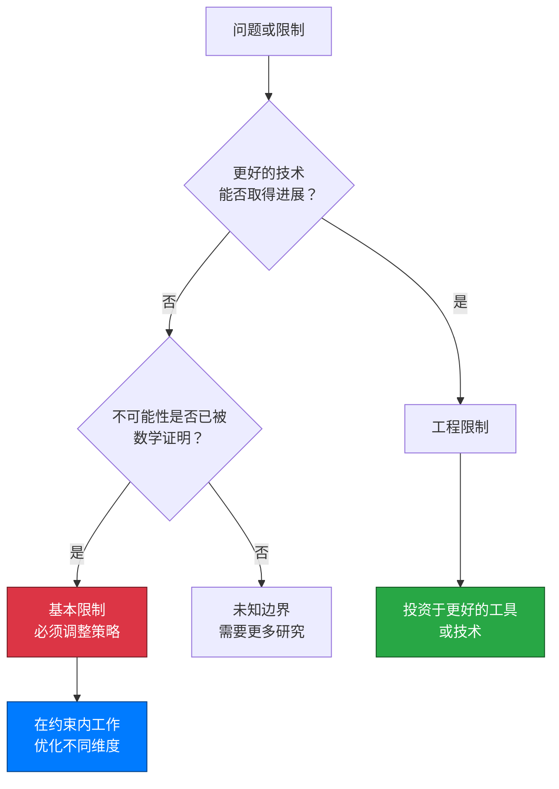
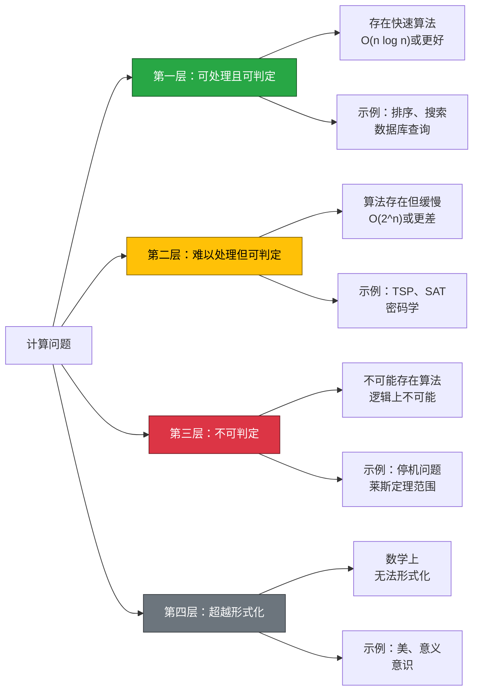
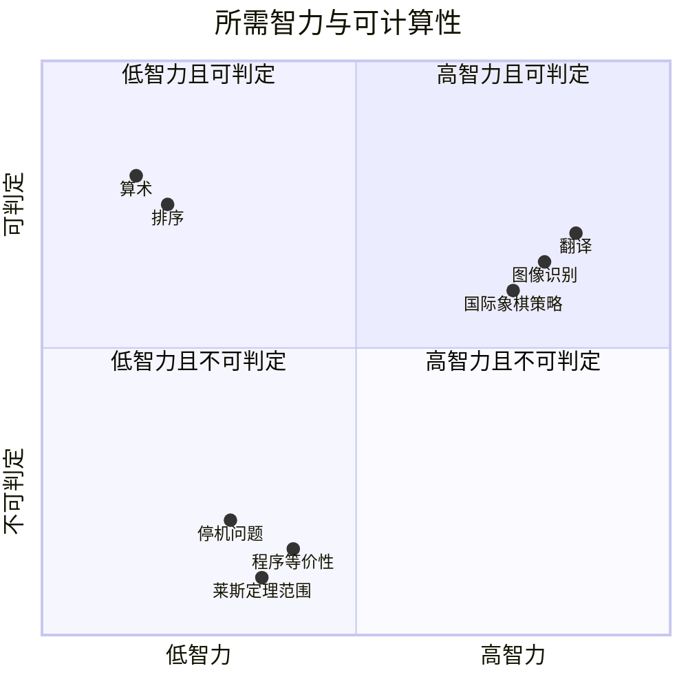

# 代码的物理学：理解计算中的基本限制（第一部分）

## 引言：代码的宇宙速度限制

1905年，[阿尔伯特·爱因斯坦（Albert Einstein）](https://en.wikipedia.org/wiki/Albert_Einstein)证明了一个革命性的结论：没有任何东西能够超越光速。这不是更好的技术可以克服的工程限制，而是时空本身的基本属性，编码在现实的结构中。三十年后的1936年，[艾伦·图灵（Alan Turing）](https://en.wikipedia.org/wiki/Alan_Turing)为计算证明了一个同样深刻的结果：没有任何算法能够确定一个任意程序是否会停机（称为[停机问题（Halting Problem）](https://en.wikipedia.org/wiki/Halting_problem)）。与爱因斯坦的光速屏障一样，这不是当前计算机或编程语言的限制。**这是一个数学确定性，无论我们的机器变得多么强大，或者我们的算法变得多么聪明，它都将永远为真。**

现代软件工程在这些基本限制的阴影下运作，尽管大多数工程师将它们体验为令人沮丧的工具限制，而不是数学确定性。你可能经历过这样的情况：静态分析工具错过了明显的错误，测试框架尽管有100%的覆盖率却无法保证正确性，AI助手生成的代码需要仔细的人工审查。当营销材料承诺"完整的自动化验证"或"有保证的错误检测"时，你可能会感觉有些不对劲——这些声明听起来太好了，不像是真的。

确实如此。**你遇到的限制不是等待更好工具的临时工程挑战，而是基本数学不可能性的表现，就像光速或绝对零度一样不可改变。** 理解这些限制从约束转变为竞争优势：知道什么是不可能的，可以让你将精力集中在可实现的事情上，就像物理学家利用相对论实现了GPS卫星和粒子物理学，而不是浪费资源试图超越光速。

如果你是一名开发人员，曾经想知道为什么尽管经过数十年的工具开发，某些问题仍然存在，或者如果你是一名技术领导者，正在评估关于革命性测试或验证技术的声明，这篇文章提供了关键的背景。**理解计算限制不是失败主义，而是工程成熟的基础。** 最好的工程师不会忽视这些边界；他们深入理解这些边界，并在其中出色地工作。

这段旅程探讨了计算限制如何反映物理定律，为什么"困难"问题与"不可能"问题有根本性的不同，以及这些知识如何赋能更好的工程决策。我们将从舒适的物理类比穿越到抽象的计算理论，然后回到你明天就可以应用的实用框架。在这个过程中，你会发现为什么了解游戏规则会让你在游戏中更有效，以及为什么计算历史上的每一次突破性创新都不是通过忽视限制，而是通过深入理解限制而出现的。

:::info 系列文章
这是探索计算基本限制的两部分系列的**第一部分**。第一部分涵盖限制的本质、计算层次结构、复杂性测量和智力-可计算性悖论。[第二部分](/blog/fundamental-limits-in-computing-part-2)探讨实际工程影响、历史教训和哲学基础。
:::

{/* truncate */}

---

## 第一节：基本限制的本质

并非所有限制都是平等的。当你的笔记本电脑运行缓慢时，这是一个工程限制——升级硬件就会改善。当排序算法需要O(n log n)时间时，这是一个复杂度界限——可能存在更好的算法，但我们已经证明了数学下界。但是当我们说"没有算法可以解决停机问题"时，我们在描述一些质的不同的东西：**基本限制（Fundamental Limit）**，一个无论多少工程努力、计算能力或算法巧妙性都永远无法跨越的边界。

理解这种区别对软件工程至关重要。**工程限制（Engineering Limitations）是由当前技术、预算或知识施加的临时约束，它们可以通过更好的工具、更多的资源或巧妙的解决方案来克服。** 相比之下，基本限制是经过数学证明的不可能性，将永远为真，嵌入计算本身的逻辑结构中，就像物理定律嵌入现实的结构中一样。

### 不可改变边界的景观

基本限制出现在多个领域，考察它们揭示了惊人的相似之处。在物理学中，光速（c ≈ 3×10⁸ m/s）不仅仅是"非常快"，它是因果关系可以通过时空传播的最大速度。阿尔伯特·爱因斯坦（Albert Einstein）的狭义相对论证明了这编织进了宇宙的几何结构中。无论你的引擎多么强大，你都无法超越c；宇宙的数学禁止它。

同样，绝对零度（Absolute Zero）（0开尔文，或-273.15°C）不仅仅是"非常冷"，它是系统达到其最小可能能量状态的温度。量子力学证明这个温度是无法达到的；你可以渐近地接近它，但永远无法达到它。科学家已经实现了高于绝对零度十亿分之一度的温度，但最后的差距仍然永远无法跨越。

| 领域 | 基本限制 | 为什么是基本的 | 实际影响 |
|--------|------------------|---------------------|------------------|
| **物理学** | 光速（c ≈ 3×10⁸ m/s） | 时空本身的结构 | GPS时间校正，粒子加速器，跨空间通信延迟 |
| **热力学** | 绝对零度（0 K） | 量子不确定性原理 | 可实现的：纳开温度，超导性，量子计算 |
| **量子力学** | 海森堡不确定性（Heisenberg Uncertainty）（ΔxΔp ≥ ℏ/2） | 波粒二象性（Wave-Particle Duality） | 限制测量精度，实现量子加密 |
| **数学** | 哥德尔不完备性（Gödel's Incompleteness） | 自指悖论（Self-Referential Paradoxes） | 任何形式系统都有不可证明的真理，限制自动推理 |
| **计算** | 停机问题（Halting Problem） | 对角论证（Diagonal Argument），自指 | 无法构建通用程序验证器，测试是采样而非证明 |
| **计算** | 莱斯定理（Rice's Theorem） | 将停机问题推广到语义属性（Semantic Properties） | 所有有趣的程序行为都是算法上不可判定的（Undecidable） |

这个表格揭示了一个模式：基本限制源于深层结构属性——时空几何、量子不确定性、逻辑自指——而不是当前的技术约束。它们是通过数学证明发现的，而不是作为实际困难观察到的。

### 为什么这些限制无法被克服

关键的洞察是，基本限制是**经过数学证明不可能的**，而不仅仅是非常困难的。艾伦·图灵（Alan Turing）对停机问题不可判定性的证明（1936年）使用了对角论证，表明任何声称的"停机检查器"都可以用来构造一个自相矛盾的程序——这是一个逻辑上的不可能性，而不是工程挑战。

考虑这个对比：
- **工程限制**："当前的测试工具错过了5%的错误" → 更好的工具减少了这个百分比
- **基本限制**："没有测试工具可以保证在任意程序中找到所有错误" → 莱斯定理（Rice's Theorem）在数学上证明了这一点

第一个邀请优化；第二个要求战略适应。试图克服基本限制就像试图建造永动机或超越光速一样——你不是因为不够聪明而失败，而是因为你正在尝试宇宙逻辑所禁止的事情。

这个图表阐明了决策树：如果某事在数学上被证明是不可能的，你就从"困难的工程问题"跨越到"必须完全改变策略"。工程成熟度在于识别你的问题属于哪个类别。

### 不可改变定律的赋能现实

这是反直觉的真理：**理解某些限制是基本的是赋能的，而不是限制性的。** 当物理学家接受c是一个硬限制时，他们停止在不可能的"超光速"引擎上浪费精力，转而开发了：
- 考虑相对论时间膨胀的GPS系统
- 接近但从未超过c的粒子加速器
- 使用光本身以最大速度的光纤通信
- 来自E=mc²的核能

这个限制并没有约束创新——它聚焦了创新。同样，理解完整的自动化验证在数学上是不可能的，不会让你成为一个更糟糕的工程师；它让你成为一个更好的工程师，明智地投资精力，而不是追逐不可能的目标。

:::note 核心概念：基本限制与工程限制
**基本限制（Fundamental Limits）** 是经过数学证明的不可能性，永远无法克服，就像光速或停机问题。**工程限制（Engineering Limitations）** 是当前技术、预算或知识的临时约束，可以随着时间的推移而改善。区分它们对于设定现实目标和做出战略决策至关重要。
:::

对软件工程师的实际含义很明确：在评估工具、框架或方法时，问"这个声明是在基本限制内工作，还是承诺克服它们？"关于"完整的自动化验证"或"保证无错误代码"的声明是危险信号——它们承诺解决不可判定的问题。现实的工具明确承认其范围限制。

**这些限制不是要克服的挑战，而是我们必须在其中玩的游戏规则。** 下一个问题变成了：计算复杂性的景观实际上是什么样子的，这些尖锐的边界在哪里？

---

## 第二节：计算复杂性的层次结构

理解基本限制存在是一回事；导航什么是可能的、什么是困难的、什么是不可能的景观是另一回事。**计算问题不仅仅简单地划分为"可解"和"不可解"，它们占据一个具有数学上尖锐边界的丰富层次结构。** 这个层次结构对软件工程有深远的影响：知道你的问题占据哪个层级，决定了你应该优化算法、接受概率方法，还是接受人类判断。

让我们通过一个四层框架探索这个景观，该框架从平凡可计算到根本无法形式化逐步推进。

### 第一层：机械可计算（可判定且可处理）

在基础层面上，存在不仅可解而且高效可解的问题。这些是**具有多项式时间复杂度的可判定问题**（通常为O(1)、O(log n)、O(n)或O(n log n)）。对于这些问题，存在总是终止并且即使对于大输入也运行快速的算法。

**示例**：
- 算术运算（2+2=4，乘法，除法）
- 布尔逻辑（Boolean Logic）评估
- 搜索排序数组（二分搜索：O(log n)）
- 排序算法（归并排序，快速排序：O(n log n)）
- 许多图算法（稀疏图中的最短路径）
- 具有适当索引的数据库查询

**特征**：
- 即使对于大输入（数百万或数十亿个元素）也很快
- 确定性的正确答案
- 完全可自动化，无需人类判断
- 可以在生产系统中实现，无需近似

**实际影响**：这一层代表可靠软件的支柱。当你查询数据库、编译代码或排序列表时，你正在利用第一层问题。可预测性和速度使这些问题适合完全自动化。

### 第二层：计算困难但可判定

向上移动层次结构，我们遇到理论上可解的问题——存在一个总是给出正确答案的算法——但算法需要指数或阶乘时间。**这些问题是可判定但对于大输入是难以处理的。**

**示例**：
- 旅行商问题（Traveling Salesman Problem，TSP）：找到通过N个城市的最优路线
- 布尔可满足性（Boolean Satisfiability，SAT）：确定逻辑公式是否可以为真
- 蛋白质折叠模拟
- 国际象棋最优策略（对于任意位置）
- 许多NP完全问题（NP-complete）（已识别超过3,000个）

**复杂度类**：NP完全（NP-complete），EXPTIME，NEXP

**特征**：
- 算法存在并总是以正确答案终止
- 时间需求呈指数增长：O(2ⁿ)、O(n!)或更差
- 解决100个元素的实例可能需要比宇宙的寿命更长的时间
- 通常允许良好的近似或启发式
- 密码学依赖于这一层的困难性（分解大素数）

**P vs NP问题**：数学中最深刻的开放问题之一是P=NP是否成立（千禧年大奖：100万美元）。如果P=NP，许多第二层问题会降到第一层。大多数计算机科学家认为P≠NP，意味着这一层是根本不同的。

**实际影响**：这些问题需要启发式、近似或约束放松。精确解决方案仅适用于小输入；生产系统使用"足够好"的方法。这些问题的困难性使现代密码学成为可能——我们依赖分解是指数困难的。

### 第三层：不可判定问题

在这里我们跨越了一个质的边界。**不可判定问题（Undecidable Problems）是那些不存在能够为所有可能输入正确回答问题的算法的问题。** 这不是关于时间复杂度的问题，而是关于逻辑不可能性的问题。

**示例**：
- 停机问题（Halting Problem）："这个程序在这个输入上会终止吗？"
- 程序等价性（Program Equivalence）："这两个程序计算相同的函数吗？"
- 莱斯定理（Rice's Theorem）范围：程序的任何非平凡语义属性（Semantic Property）
- 确定程序是否无病毒（一般情况）
- 检查代码是否总是产生正确的输出

**特征**：
- 一般情况下不存在算法——在数学上证明不可能
- 可以解决特定实例，但不能解决通用问题
- 时间复杂度：无限（算法永远不会为所有情况正确终止）
- 核心原因：自指创建逻辑矛盾

**关键区别**：你可以通过运行特定程序来验证它是否停机（如果它终止，你就知道了）。你甚至可以使用形式方法证明某些程序永不停机。但你无法构建一个为所有程序决定停机的单一算法——艾伦·图灵（Alan Turing）证明这会产生逻辑矛盾。

**实际影响**：完整的自动化程序验证是不可能的。测试采样行为而不是证明正确性。人类判断对于语义属性变得至关重要。这就是为什么没有工具可以"保证"找到所有错误。

### 第四层：超越形式化

最后，我们遇到甚至可能无法形式化为计算问题的问题。**这些是我们缺乏对"正确"意味着什么的精确数学规范的问题，使算法解决方案在原则上是不可能的。**

**示例**：
- 审美判断："这段代码美丽吗？"
- 意识和理解："这个AI真正理解吗？"
- 意义和重要性："生命的意义是什么？"
- "好的"翻译（超越语法正确性）
- 道德决策："这个算法公平吗？"

**特征**：
- 没有明确的问题数学定义
- 答案可能本质上是主观的或文化的
- 不清楚这些是否是"计算"性质的
- 多个有效的观点可能共存

**实际影响**：人类专业知识仍然不可替代。AI可以提供选项或建议，但判断需要人类。设计、道德和意义创造占据这一层。

### 层次结构可视化

### 质的边界：为什么第二层→第三层最重要

从第二层到第三层的过渡与第一层到第二层根本不同。在第一层和第二层之间，差异是定量的：更快与更慢，但都是可解的。**在第二层和第三层之间，差异是质的：可解与不可能。**

无论多少计算能力、聪明才智或时间，都无法将第三层问题移到第二层。例如，量子计算机可以更快地解决一些第二层问题（肖尔算法（Shor's Algorithm）在量子硬件上以多项式时间分解整数），但它们无法解决第三层问题——不可判定性与硬件无关。

| 比较方面 | 第一层→第二层边界 | 第二层→第三层边界 |
|------------------|--------------------------|--------------------------|
| **性质** | 定量（速度） | 质（可能性） |
| **有更多计算** | 第二层问题需要更长时间但完成 | 第三层问题仍然无法解决 |
| **更好的算法** | 可以在层之间移动问题 | 无法跨越这个边界 |
| **实际方法** | 优化、近似或接受缓慢 | 接受采样，需要人类判断 |
| **数学基础** | 复杂度理论（P、NP、EXPTIME） | 可计算性理论（Church-Turing，Gödel） |

:::note 核心概念：第二层-第三层边界
**计算困难（Tier 2）** 和 **不可判定（Tier 3）** 之间的边界是质的，而不是量的。无论多少计算能力、更好的算法或技术进步，都无法将不可判定问题移入可判定领域。这个边界是永恒的，并且在数学上得到了证明。
:::

### 层次结构的实际影响

理解你的问题占据哪个层级会指导策略：

**第一层问题**：完全自动化。优化算法。构建具有确定性行为的可靠生产系统。

**第二层问题**：使用启发式、近似或约束放松。接受"足够好"的解决方案。对于密码学，依赖困难性。考虑概率方法。

**第三层问题**：接受完全自动化是不可能的。使用采样方法（如测试）。将特定情况的自动化与语义属性的人类判断相结合。通过多种方法而不是证明来建立信心。

**第四层问题**：保留人类专业知识。使用AI作为工具来呈现选项，而不是做出最终决策。接受多个有效的观点。

**理解你的问题占据哪个层级会指导策略：为第一层-第二层优化算法，为第三层接受采样，为第四层拥抱人类判断。** 这个层次结构不是一个约束，而是一个战略地图，阐明了在哪里投资精力以及期望什么结果。

建立了这个景观之后，一个自然的问题出现了：我们能否在数学上测量复杂性，给"多难"一个精确的意义？

---

## 第三节：量化复杂性：形式化测量

我们探索的层次结构提供了对计算困难性的定性理解，但计算机科学已经开发了严格的数学框架来精确地量化复杂性。**这些形式化测量将关于"困难"和"不可能"的直觉转化为定理和证明。** 值得注意的是，这些测量本身遇到了基本限制——我们可以证明测量复杂性有时是不可能的，揭示了元计算边界。

### 计算复杂度理论：资源需求的研究

最广泛应用的框架是**[计算复杂度理论（Computational Complexity Theory）](https://en.wikipedia.org/wiki/Computational_complexity_theory)**，它根据随着输入大小增长解决问题所需的资源（主要是时间和空间）对问题进行分类。这个框架为我们提供了组织计算宇宙的著名复杂度类。

**关键复杂度类**：

- **P（多项式时间，Polynomial Time）**：可在多项式时间O(nᵏ)内解决的问题。这些通常被认为是"可处理的"。示例：排序，搜索，图中的最短路径。这些问题可以很好地扩展到大输入。

- **NP（非确定性多项式，Nondeterministic Polynomial）**：即使找到解决方案需要更长时间，解决方案也可以在多项式时间内验证的问题。包括所有P问题加上潜在的更难的问题。示例：给定数独谜题的声称解决方案，你可以快速验证它是正确的——但找到解决方案可能更难。

- **NP完全（NP-complete）**：NP中"最难"的问题。如果任何NP完全问题具有多项式解决方案，那么所有NP问题都具有（P=NP）。示例：TSP，布尔可满足性（SAT），图着色。超过3,000个问题已被证明是NP完全的。

- **PSPACE（多项式空间，Polynomial Space）**：使用多项式内存可解决的问题，无论时间如何。包括P和NP。示例：确定某些游戏的最佳策略。

- **EXPTIME（指数时间，Exponential Time）**：需要指数时间O(2ⁿ)的问题。可证明比P更难。示例：n×n棋盘上的广义国际象棋。

**P vs NP问题**，七个[千禧年大奖问题（Millennium Prize Problems）](http://www.claymath.org/millennium-problems)之一，价值100万美元，询问P=NP是否成立。大多数计算机科学家猜想P≠NP，意味着某些问题可验证地比其他问题更难——但这在50多年后仍未得到证明。

**实用价值**：复杂度类让我们严格地推理算法性能。当你认识到一个问题是NP完全时，你知道寻求一个高效的精确算法可能是徒劳的——专注于近似或启发式算法。

### 柯尔莫哥洛夫复杂度：数据的信息内容

一个根本不同的测量是**[柯尔莫哥洛夫复杂度（Kolmogorov Complexity）](https://en.wikipedia.org/wiki/Kolmogorov_complexity)**，由安德雷·柯尔莫哥洛夫（Andrey Kolmogorov）于1963年引入。它不是测量计算时间，而是测量数据的**描述复杂性**：产生给定输出的最短程序的长度。

**定义**：字符串x的柯尔莫哥洛夫复杂度K(x)是输出x然后停止的最短程序（在某个固定的通用编程语言中）的长度。

**示例**：
- 字符串"0000000000000000"具有低柯尔莫哥洛夫复杂度：像"打印'0' 16次"这样的短程序生成它。K(x) ≈ 20个字符。
- 真正的随机字符串"8f3a9b2e1c7d4f0a"具有接近其自身长度的高柯尔莫哥洛夫复杂度：不存在比"打印'8f3a9b2e1c7d4f0a'"更短的描述。K(x) ≈ length(x)。
- π的前一百万位数字尽管看起来随机，但具有相对较低的复杂度："计算π到100万位数字"是一个简短的程序。

**不可计算的悖论**：这里是元限制出现的地方。**柯尔莫哥洛夫复杂度本身是不可计算的！** 没有算法可以给定任意字符串x，确定K(x)。证明使用了贝里悖论（Berry's Paradox）的一个变体："不能用少于二十个字用来描述的最小数字"在少于二十个字中描述了这样一个数字——一个矛盾。

这意味着你无法算法地确定数据是真正随机的还是只是看起来随机。压缩算法近似柯尔莫哥洛夫复杂度，但永远无法精确计算它。

**实用价值**：柯尔莫哥洛夫复杂度为以下内容提供理论基础：
- 信息论和数据压缩（ZIP，gzip近似最小描述长度）
- 随机性测试（不可压缩的数据是随机的）
- 机器学习（适合数据的更简单模型具有更低的描述长度——奥卡姆剃刀（Occam's Razor）的形式化）

### 逻辑深度：超越描述到推导

查尔斯·贝内特（Charles Bennett）于1988年引入了**逻辑深度（Logical Depth）**，以区分"平凡"和"有意义"的复杂性。如果从最短描述推导出一个字符串需要大量计算，则该字符串可能具有低柯尔莫哥洛夫复杂度（短描述）但高逻辑深度。

**定义**：字符串x的逻辑深度是从其最短描述生成x所需的最小计算时间。

**示例**：
- 一串零：低柯尔莫哥洛夫复杂度（短程序）且低逻辑深度（程序立即运行）
- 晶体结构：低柯尔莫哥洛夫复杂度（规则晶格规则）但高逻辑深度（晶体形成需要地质时间）
- 随机字符串：高柯尔莫哥洛夫复杂度（无压缩）且低逻辑深度（需要最少的推导）
- π的一百万位数字：低柯尔莫哥洛夫复杂度（短算法）但高逻辑深度（计算需要时间）

**洞察**：逻辑深度捕获"有组织的复杂性"——既简单描述又需要时间演化的系统。这与以下概念相关：
- 意义和重要性（深层与浅层模式）
- 自然与人工（进化系统通常具有高深度）
- 计算不可约性（某些系统必须模拟才能预测）

**实用价值**：逻辑深度有助于解释为什么一些简单规则会产生复杂行为（细胞自动机，进化系统），以及为什么捷径并不总是存在——有时你必须运行模拟才能知道结果。

### 比较这些测量

| 测量 | 它捕获什么 | 可计算？ | 主要用途 |
|---------|------------------|-------------|-------------|
| **计算复杂度** | 解决问题的时间/空间 | 是（对于已知算法） | 算法设计，可行性评估 |
| **柯尔莫哥洛夫复杂度** | 最短描述长度 | 否（证明不可计算） | 信息论，随机性，压缩 |
| **逻辑深度** | 从描述的计算时间 | 部分（取决于停机） | 理解有组织的复杂性，意义 |

:::note 核心概念：元计算限制
我们可以在数学上证明问题的困难性，但**测量复杂性本身可能是不可能的**。柯尔莫哥洛夫复杂度是不可计算的——我们发现了我们分析限制能力的限制。这些元计算边界揭示了不可判定性甚至渗透到我们用来研究可判定性的工具中。
:::

这些形式化测量的存在表明"困难"不是主观的——它是数学上可量化的。然而，柯尔莫哥洛夫复杂度的不可计算性表明，即使我们的测量工具也遇到了基本限制。这揭示了一个深刻的真理：**计算的边界适用于分析计算本身。**

建立了形式化测量之后，我们现在可以解决一个令人困惑的不对称性：为什么一些似乎需要智力的问题（如翻译）最终是可判定的，而看似简单的问题（如停机）却是可证明不可能的？

---

## 第四节：智力与可计算性悖论

计算限制最反直觉的方面之一是：**看起来需要复杂智力的问题通常是可判定的，而看似简单的问题却在数学上是不可能的。** 机器翻译感觉复杂——它需要理解上下文、文化和细微差别。然而翻译是可判定的：给定输入文本，翻译算法总是产生输出并终止。相比之下，检查程序是否停机似乎很简单："它会停止吗？是或否？"然而这是不可判定的——没有算法可以为所有程序正确回答。

这个悖论揭示了**使问题对人类智力"困难"的因素与使其在计算上可判定或不可判定的因素是正交的。** 智力和可计算性测量根本不同的困难维度。

### 看似的矛盾

考虑这两个问题：

**机器翻译（Machine Translation）**（英语到中文）：
- 需要理解：语法，成语，文化背景，歧义解决
- 似乎需要：人类级别的智力，世界知识，细微的判断
- 复杂性感知："这真的很难且细微"
- **实际状态**：可判定——算法以输出终止（即使不完美）

**停机问题（Halting Problem）**（程序P在输入I上停机吗？）：
- 需要检查：这个程序会停止运行，还是永远循环？
- 似乎需要：只需运行程序并观察
- 复杂性感知："这似乎很容易检查"
- **实际状态**：不可判定——没有算法可以为所有情况正确回答

不对称性是惊人的。"智力"问题是可解的；"简单"问题是不可能的。为什么？

### 理解区别

关键在于每种问题的"正确答案"意味着什么：

| 方面 | 翻译（可判定） | 停机（不可判定） |
|--------|------------------------|---------------------|
| **正确答案** | 不存在单一的"正确"翻译 | 对于每种情况存在客观的真/假答案 |
| **挑战类型** | 捕获意义和上下文 | 来自自指的逻辑不可能性 |
| **AI方法** | 启发式有效（"足够好"的解决方案） | 在原则上无法解决——不是"足够好"的问题 |
| **改进路径** | 更好的模型→更高质量的翻译 | 更多计算/聪明才智→一般情况下没有进展 |
| **为什么可判定/不可判定** | 总是产生输出，即使不完美 | 自指矛盾使一般解决方案不可能 |

**翻译是可判定的**，因为不存在唯一的"正确"答案——存在许多有效的翻译。算法总是可以产生*某种*翻译（即使很差），而"更好"是主观的。问题是定义良好的：输入文本→输出文本，总是终止。

**停机是不可判定的**，因为存在客观正确的答案（程序要么停机，要么不停机），但确定它会产生逻辑悖论。艾伦·图灵（Alan Turing）的证明构造了一个程序，询问"停机检查器说我停机吗？"然后做相反的事情——一个自指矛盾，证明不存在通用停机检查器。

### 智力与可计算性作为正交维度

这导致了一个深刻的洞察：**智力**（模式识别，上下文理解，启发式判断）和**可计算性**（算法是否可以为所有输入提供可证明正确的答案）是正交的——问题困难性的独立维度。

**象限1**（高智力，可判定）：机器翻译，图像识别，国际象棋——需要智力但算法上可解的问题。

**象限2**（低智力，可判定）：算术，排序，搜索——计算机轻松解决的直接问题。

**象限3**（低智力，不可判定）：停机问题，程序等价性——看似简单但逻辑上不可能的问题。

**象限4**（高智力，不可判定）：哲学问题，如"这段代码有意义吗？"或"这个系统理解吗？"——既需要智力又缺乏算法解决方案。

### 为什么这对AI和工程很重要

这种区别具有深远的影响：

**对于AI开发**：AI的进步通过模式识别和机器学习解决象限1的问题（可判定但需要智力）。但AI无法跨入象限3——无论多少训练数据或模型复杂性都无法解决不可判定的问题。AI可以在翻译（可判定）方面变得超越人类，但无法解决停机问题（不可判定）。

**对于软件工程**：这解释了为什么某些工具有效而其他工具无效：
- **静态分析工具**可以找到语法模式（可判定），但无法保证找到所有语义错误（莱斯定理——不可判定）
- **AI代码生成器**可以产生"足够好"的代码（可判定，启发式），但无法为任意规范生成可证明正确的代码（不可判定）
- **测试框架**可以采样行为（对特定情况可判定），但无法证明所有输入的正确性（一般情况下不可判定）

**对于评估**：当有人声称AI或工具将"解决测试"或"保证正确性"时，问："他们是否混淆了智力和可计算性？"智力改进可以更好地处理象限1，但没有智力——人工的还是人类的——可以克服象限3的逻辑不可能性。

:::info 彭罗斯论证
哲学家罗杰·彭罗斯（Roger Penrose）认为，这种智力-可计算性区别表明人类理解可能超越计算。如果我们可以"看到"形式系统无法证明的陈述的真实性（哥德尔定理），也许意识涉及非计算过程。这仍然非常有争议，但它说明了计算限制如何引发关于心灵和机器的深刻问题。
:::

**使问题对智力"困难"的因素与使其在数学上对算法不可能的因素根本不同。** 智力导航上下文和歧义；可计算性导航逻辑一致性。这些是需要不同方法的不同挑战。

---

## 下一步：从理论到实践

在这第一部分中，我们建立了计算限制的基础概念：

- **基本限制与工程限制**：理解哪些边界是永恒的数学真理，哪些是临时的技术约束
- **四层层次结构**：从可处理的问题（第一层）到不可判定的问题（第三层）到无法形式化的问题（第四层）
- **形式化复杂性测量**：计算机科学如何通过复杂度理论、柯尔莫哥洛夫复杂度和逻辑深度来量化困难性
- **智力-可计算性悖论**：为什么机器翻译（看似困难）是可判定的，而停机问题（看似简单）却不是

这些理论基础至关重要，但真正的力量来自于将它们应用于日常工程实践。**在[本系列的第二部分](/blog/fundamental-limits-in-computing-part-2)中**，我们将探讨：

- **特定验证与通用验证**：为什么我们可以验证"2+2=4"但不能构建通用程序验证器
- **实际工程影响**：理解限制如何转变测试策略、代码审查、AI辅助开发和工具评估
- **历史教训**：接受限制如何导致突破性创新（来自相对论的GPS，来自热力学的量子计算，来自不可判定性的类型系统）
- **哲学基础**：与哥德尔不完备性定理、丘奇-图灵论题以及关于意识的问题的联系
- **实用框架**：用于现实世界工程问题的多维分类系统

:::tip 第一部分的关键要点
理解计算限制不是接受失败，而是获得清晰度，将精力集中在重要的地方。**"计算困难"和"数学不可能"之间的边界是质的，而不是量的。** 无论多少计算能力、聪明才智或技术进步，都无法从不可判定跨越到可判定。这种知识是赋能的：它防止在不可能的目标上浪费资源，并将创新引导到可实现的突破。
:::

从抽象理论到实际应用的旅程在第二部分继续，我们将看到这些限制如何在真实的工程决策中体现，以及历史如何表明理解约束释放而不是限制创新。

---

**继续阅读[第二部分：实际应用和哲学基础](/blog/fundamental-limits-in-computing-part-2)** →
