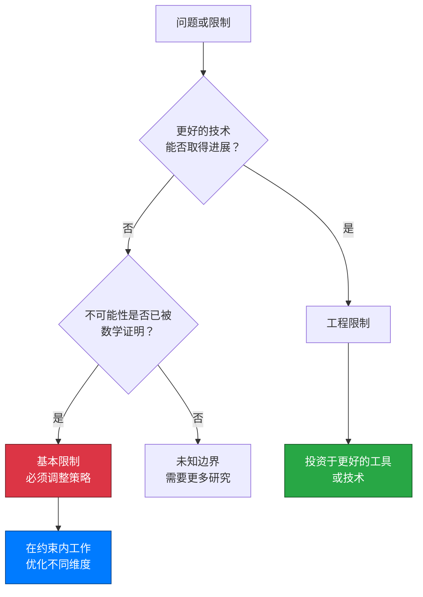

# 代码的物理学：理解计算中的基本限制

## 引言：代码的宇宙速度限制

1905年，阿尔伯特·爱因斯坦（Albert Einstein）证明了一个革命性的结论：没有任何东西能够超越光速。这不是更好的技术可以克服的工程限制，而是时空本身的基本属性，编码在现实的结构中。三十年后的1936年，艾伦·图灵（Alan Turing）为计算证明了一个同样深刻的结果：没有任何算法能够确定一个任意程序是否会停机。与爱因斯坦的光速屏障一样，这不是当前计算机或编程语言的限制。**这是一个数学确定性，无论我们的机器变得多么强大，或者我们的算法变得多么聪明，它都将永远为真。**

现代软件工程在这些基本限制的阴影下运作，尽管大多数工程师将它们体验为令人沮丧的工具限制，而不是数学确定性。你可能经历过这样的情况：静态分析工具错过了明显的错误，测试框架尽管有100%的覆盖率却无法保证正确性，AI助手生成的代码需要仔细的人工审查。当营销材料承诺"完整的自动化验证"或"有保证的错误检测"时，你可能会感觉有些不对劲——这些声明听起来太好了，不像是真的。

确实如此。**你遇到的限制不是等待更好工具的临时工程挑战，而是基本数学不可能性的表现，就像光速或绝对零度一样不可改变。** 理解这些限制从约束转变为竞争优势：知道什么是不可能的，可以让你将精力集中在可实现的事情上，就像物理学家利用相对论实现了GPS卫星和粒子物理学，而不是浪费资源试图超越光速。

如果你是一名开发人员，曾经想知道为什么尽管经过数十年的工具开发，某些问题仍然存在，或者如果你是一名技术领导者，正在评估关于革命性测试或验证技术的声明，这篇文章提供了关键的背景。**理解计算限制不是失败主义，而是工程成熟的基础。** 最好的工程师不会忽视这些边界；他们深入理解这些边界，并在其中出色地工作。

这段旅程探讨了计算限制如何反映物理定律，为什么"困难"问题与"不可能"问题有根本性的不同，以及这些知识如何赋能更好的工程决策。我们将从舒适的物理类比穿越到抽象的计算理论，然后回到你明天就可以应用的实用框架。在这个过程中，你会发现为什么了解游戏规则会让你在游戏中更有效，以及为什么计算历史上的每一次突破性创新都不是通过忽视限制，而是通过深入理解限制而出现的。

{/* truncate */}

---

## 第一节：基本限制的本质

并非所有限制都是平等的。当你的笔记本电脑运行缓慢时，这是一个工程限制——升级硬件就会改善。当排序算法需要O(n log n)时间时，这是一个复杂度界限——可能存在更好的算法，但我们已经证明了数学下界。但是当我们说"没有算法可以解决停机问题"时，我们在描述一些质的不同的东西：**基本限制（Fundamental Limit）**，一个无论多少工程努力、计算能力或算法巧妙性都永远无法跨越的边界。

理解这种区别对软件工程至关重要。**工程限制（Engineering Limitations）是由当前技术、预算或知识施加的临时约束，它们可以通过更好的工具、更多的资源或巧妙的解决方案来克服。** 相比之下，基本限制是经过数学证明的不可能性，将永远为真，嵌入计算本身的逻辑结构中，就像物理定律嵌入现实的结构中一样。

### 不可改变边界的景观

基本限制出现在多个领域，考察它们揭示了惊人的相似之处。在物理学中，光速（c ≈ 3×10⁸ m/s）不仅仅是"非常快"，它是因果关系可以通过时空传播的最大速度。阿尔伯特·爱因斯坦（Albert Einstein）的狭义相对论证明了这编织进了宇宙的几何结构中。无论你的引擎多么强大，你都无法超越c；宇宙的数学禁止它。

同样，绝对零度（Absolute Zero）（0开尔文，或-273.15°C）不仅仅是"非常冷"，它是系统达到其最小可能能量状态的温度。量子力学证明这个温度是无法达到的；你可以渐近地接近它，但永远无法达到它。科学家已经实现了高于绝对零度十亿分之一度的温度，但最后的差距仍然永远无法跨越。

| 领域 | 基本限制 | 为什么是基本的 | 实际影响 |
|--------|------------------|---------------------|------------------|
| **物理学** | 光速（c ≈ 3×10⁸ m/s） | 时空本身的结构 | GPS时间校正，粒子加速器，跨空间通信延迟 |
| **热力学** | 绝对零度（0 K） | 量子不确定性原理 | 可实现的：纳开温度，超导性，量子计算 |
| **量子力学** | 海森堡不确定性（Heisenberg Uncertainty）（ΔxΔp ≥ ℏ/2） | 波粒二象性（Wave-Particle Duality） | 限制测量精度，实现量子加密 |
| **数学** | 哥德尔不完备性（Gödel's Incompleteness） | 自指悖论（Self-Referential Paradoxes） | 任何形式系统都有不可证明的真理，限制自动推理 |
| **计算** | 停机问题（Halting Problem） | 对角论证（Diagonal Argument），自指 | 无法构建通用程序验证器，测试是采样而非证明 |
| **计算** | 莱斯定理（Rice's Theorem） | 将停机问题推广到语义属性（Semantic Properties） | 所有有趣的程序行为都是算法上不可判定的（Undecidable） |

这个表格揭示了一个模式：基本限制源于深层结构属性——时空几何、量子不确定性、逻辑自指——而不是当前的技术约束。它们是通过数学证明发现的，而不是作为实际困难观察到的。

### 为什么这些限制无法被克服

关键的洞察是，基本限制是**经过数学证明不可能的**，而不仅仅是非常困难的。艾伦·图灵（Alan Turing）对停机问题不可判定性的证明（1936年）使用了对角论证，表明任何声称的"停机检查器"都可以用来构造一个自相矛盾的程序——这是一个逻辑上的不可能性，而不是工程挑战。

考虑这个对比：
- **工程限制**："当前的测试工具错过了5%的错误" → 更好的工具减少了这个百分比
- **基本限制**："没有测试工具可以保证在任意程序中找到所有错误" → 莱斯定理（Rice's Theorem）在数学上证明了这一点

第一个邀请优化；第二个要求战略适应。试图克服基本限制就像试图建造永动机或超越光速一样——你不是因为不够聪明而失败，而是因为你正在尝试宇宙逻辑所禁止的事情。

这个图表阐明了决策树：如果某事在数学上被证明是不可能的，你就从"困难的工程问题"跨越到"必须完全改变策略"。工程成熟度在于识别你的问题属于哪个类别。

### 不可改变定律的赋能现实

这是反直觉的真理：**理解某些限制是基本的是赋能的，而不是限制性的。** 当物理学家接受c是一个硬限制时，他们停止在不可能的"超光速"引擎上浪费精力，转而开发了：
- 考虑相对论时间膨胀的GPS系统
- 接近但从未超过c的粒子加速器
- 使用光本身以最大速度的光纤通信
- 来自E=mc²的核能

这个限制并没有约束创新——它聚焦了创新。同样，理解完整的自动化验证在数学上是不可能的，不会让你成为一个更糟糕的工程师；它让你成为一个更好的工程师，明智地投资精力，而不是追逐不可能的目标。

:::note 核心概念：基本限制与工程限制
**基本限制（Fundamental Limits）** 是经过数学证明的不可能性，永远无法克服，就像光速或停机问题。**工程限制（Engineering Limitations）** 是当前技术、预算或知识的临时约束，可以随着时间的推移而改善。区分它们对于设定现实目标和做出战略决策至关重要。
:::

对软件工程师的实际含义很明确：在评估工具、框架或方法时，问"这个声明是在基本限制内工作，还是承诺克服它们？"关于"完整的自动化验证"或"保证无错误代码"的声明是危险信号——它们承诺解决不可判定的问题。现实的工具明确承认其范围限制。

**这些限制不是要克服的挑战，而是我们必须在其中玩的游戏规则。** 下一个问题变成了：计算复杂性的景观实际上是什么样子的，这些尖锐的边界在哪里？

