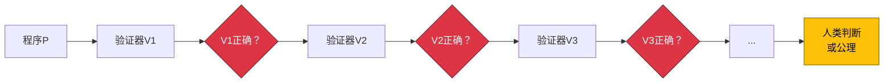

# 代码的物理学：理解计算中的基本限制（第二部分）

## 引言：从理论到实践

在[本系列的第一部分](/blog/fundamental-limits-in-computing)中，我们建立了计算限制的基础概念：基本限制与工程限制的区别、四层计算层次结构、形式化复杂性测量以及智力-可计算性悖论。我们探讨了为什么一些看似简单的问题（如停机问题）在数学上是不可能的，而看似需要复杂智力的问题（如机器翻译）却是可判定的。

**现在，在第二部分中，我们从抽象理论转向实际应用。** 本文探讨这些基本限制如何在日常工程决策中体现，考察历史模式表明理解约束释放创新，并将计算限制与关于逻辑、数学和意识的深刻哲学问题联系起来。我们将以一个实用框架结束，你可以立即使用它来分类问题并做出更好的工程决策。

:::info 系列文章
这是两部分系列的**第二部分**。[第一部分](/blog/fundamental-limits-in-computing)涵盖限制的本质、计算层次结构、复杂性测量和智力-可计算性悖论。第二部分探讨实际应用、历史教训和哲学基础。
:::

{/* truncate */}

---

## 第五节：特定实例与通用算法

工程师经常遇到这个明显的悖论："我可以验证2+2=4是正确的。我可以测试这个特定的函数是否有效。然而你声称完整的自动化验证是不可能的？"**解决方案在于理解验证特定实例和构建通用验证算法之间的关键区别。** 这个区别，经常被误解，是为什么测试采样行为而不是证明正确性的核心。

### 明显的矛盾

困惑是自然的：
1. **观察**："2+2=4绝对正确" ✓
2. **扩展**："我可以验证这个简单的程序返回4" ✓
3. **概括**："因此计算机可以验证程序正确性" ✗

错误发生在第3步——混淆了"可以验证这个程序"与"可以验证所有程序"。

### 什么是可能的：特定验证

对于任何特定的程序实例，存在验证方法：

**直接执行**：运行程序并检查输出。对于具有有限输入的终止程序，这完全有效。

**形式证明（Formal Proof）**：使用数学逻辑证明特定程序的属性。像[Coq](https://coq.inria.fr/)、[Isabelle](https://isabelle.in.tum.de/)和[TLA+](https://lamport.azurewebsites.net/tla/tla.html)这样的工具为精心指定的系统实现了这一点。

**测试**：使用样本输入执行程序，验证输出与预期匹配。适用于特定测试用例。

**类型检查（Type Checking）**：确定性地验证语法属性（程序结构）。这就是为什么[类型系统（Type Systems）](https://en.wikipedia.org/wiki/Type_system)如此有价值——它们检查可判定的属性。

所有这些方法都适用于**特定实例**——单个程序或有限的测试用例集。验证是有界和具体的。

### 什么是不可能的：通用验证

[莱斯定理（Rice's Theorem）](https://en.wikipedia.org/wiki/Rice%27s_theorem)证明没有算法可以为**所有程序**验证任意语义属性：

**通用正确性检查器**：无法存在——需要确定任意程序是否满足任意规范。

**完整的错误检测器**：无法存在——需要识别任意代码中所有可能的语义错误。

**一般停机检查器**：无法存在（图灵的原始证明）——会产生自指矛盾。

**程序等价性验证器**：无法存在——检查两个任意程序是否计算相同的函数是不可判定的。

区别是深刻的：

| 特定实例验证 | 通用算法验证 |
|-------------------------------|----------------------------------|
| 验证这个程序返回4 | 验证所有类似的程序返回正确的结果 |
| 测试这1,000个输入 | 测试所有可能的输入 |
| 检查这个循环终止 | 检查所有循环终止 |
| 证明这个函数满足规范 | 证明所有函数满足其规范 |
| **对特定情况可判定** | **一般情况下不可判定** |

:::info 与莱斯定理的联系
正如我在之前的文章中探讨的，[莱斯定理（Rice's Theorem）](/blog/rices-theorem-why-automated-testing-will-fail)证明程序的所有非平凡[语义属性（Semantic Properties）](https://en.wikipedia.org/wiki/Semantics_(computer_science))都是不可判定的。这意味着任何有趣的行为属性（正确性，终止，安全性）都无法为任意程序算法验证。
:::

### 无限回归问题

为什么我们不能只验证验证器？这导致了无限回归：

1. 编写程序P来解决你的问题
2. 编写验证器V₁来检查P是否正确
3. 你怎么知道V₁是正确的？编写验证器V₂来检查V₁
4. 你怎么知道V₂是正确的？编写验证器V₃来检查V₂
5. 这无限继续...

**莱斯定理（Rice's Theorem）说这个链条无法以算法确定性终止。** 最终，你必须将验证建立在：
- 关于规范的人类判断
- 你接受而不证明的公理
- 采样而不是证明的测试



这不是弱点——这是验证的现实。所有形式系统最终都建立在不经证明接受的公理上（[哥德尔不完备性（Gödel's Incompleteness）](https://en.wikipedia.org/wiki/G%C3%B6del%27s_incompleteness_theorems)）。

### 实际影响

理解这种区别转变了工程实践：

**测试**：拥抱测试采样行为，提供信心但不是证明。设计测试策略，最大化可能失败模式的覆盖范围，接受你无法测试"一切"。

**形式验证**：用于关键系统，但理解你正在证明"程序与规范匹配"——你无法算法验证规范本身就是你想要的。

**类型系统**：重视它们，因为它们检查可判定的语法属性。它们无法验证语义正确性，但提供关于程序结构的保证。

**代码审查**：必不可少，因为人类提供工具无法提供的语义判断。审查者检查"这是否做了我们真正想要的事情？"——一个工具无法普遍回答的问题。

**AI辅助开发**：AI可以验证特定模式并建议改进，但无法保证任意程序满足任意要求。使用AI来增强判断，而不是取代它。

**"这有效"和"所有类似的都有效"之间的区别是可能和不可能之间的区别。** 特定验证是实用和有价值的；通用验证在数学上是不可能的。成熟的工程承认这个边界并在其中有效地工作。

---

## 第六节：实际工程影响与历史教训

当应用于日常工程决策时，理解基本限制从抽象理论转变为竞争优势。**历史表明，接受限制不会约束创新——它将创新集中到突破性解决方案上。** 让我们考察现代工程的实际影响和从约束中出现创新的历史模式。

### 现代工程应用

**测试策略**：拥抱测试作为通过战略采样建立信心，而不是证明。设计测试套件，最大化可能失败模式的覆盖范围。结合单元测试（特定实例），基于属性的测试（随机采样），以及关于边缘情况的人类判断。接受100%覆盖率≠100%正确性。

**代码审查**：在自动化语法检查的同时，重视人工审查以获得语义正确性。工具擅长查找样式违规、已知模式和结构问题（所有可判定的）。人类擅长问"这解决了正确的问题吗？"和"这些要求正确吗？"——涉及不可判定语义属性的问题。

**AI辅助开发**：使用[AI编码助手（AI Coding Assistants）](https://github.com/features/copilot)来放大人类判断，而不是取代它。AI擅长模式匹配、代码补全和生成选项（所有具有"足够好"解决方案的可判定任务）。但AI无法保证正确性或验证任意规范——这些仍然是不可判定的。将AI视为需要监督的高技能助手。

**形式验证**：应用于关键系统（航天器，医疗设备，金融交易），但理解范围。你正在证明"代码匹配形式规范"——但规范本身需要人类判断以确保它捕获真实需求。这是有价值的但有界的。

**工具评估危险信号**：对"完整的自动化验证"，"保证无错误"或"100%安全保证"等声明持怀疑态度。这些承诺解决不可判定的问题。现实的工具明确说明其范围："查找常见内存错误"或"检测SQL注入漏洞"（特定，有界的问题）。

| 不成熟的工程心态 | 成熟的工程心态 |
|------------------------------|----------------------------|
| "我们需要100%正确性的工具" | "我们需要在约束内最大信心的策略" |
| "这个AI将永远解决测试" | "这个AI在其可判定范围内改进测试" |
| "自动化一切" | "自动化可判定的任务，对不可判定的应用判断" |
| "追求数学确定性" | "通过多种方法建立实际信心" |
| 对工具限制感到沮丧 | 理解哪些限制是基本的vs可改进的 |

### 历史模式：限制导致创新

这个模式在各个领域重复出现：理解基本限制催化突破性创新。

**物理学：光速屏障**

- **1905年前**：工程师追求"超光速"通信和旅行
- **爱因斯坦（Einstein）（1905年）**：证明c是基本的——时空几何的一部分
- **结果**：不是沮丧，而是革命性创新：
  - [GPS卫星（GPS Satellites）](https://en.wikipedia.org/wiki/Global_Positioning_System)（考虑相对论时间膨胀——微秒很重要！）
  - 粒子加速器（接近但从未超过c，实现粒子物理学）
  - 光纤（使用光本身以最大速度）
  - 核能（理解E=mc²）
  - 现代宇宙学（理解宇宙膨胀）

**热力学：绝对零度**

- **1900年代前**：追求达到0 K
- **量子力学**：证明0 K是渐近不可达的
- **结果**：创新应用出现：
  - 实现了纳开温度（高于0 K的十亿分之一度）
  - 发现了[超导性（Superconductivity）](https://en.wikipedia.org/wiki/Superconductivity)（零电阻）
  - 实现了[量子计算（Quantum Computing）](https://en.wikipedia.org/wiki/Quantum_computing)（需要接近绝对零度的条件）
  - 开发了玻色-爱因斯坦凝聚态（新的物质状态）

**计算：不可判定性**

- **1936年前**：假设所有明确的问题都是算法可解的
- **图灵（Turing）（1936年），莱斯（Rice）（1951年）**：证明停机问题和语义属性不可判定
- **结果**：约束内的务实创新：
  - [类型系统（Type Systems）](https://en.wikipedia.org/wiki/Type_system)（可判定的语法保证）
  - 单元测试框架（务实的采样方法）
  - [形式方法（Formal Methods）](https://en.wikipedia.org/wiki/Formal_methods)（相对于规范的证明）
  - [静态分析（Static Analysis）](https://en.wikipedia.org/wiki/Static_program_analysis)（特定属性的合理近似）
  - 规范驱动的开发（人类基础的语义）

**模式**：

| 阶段 | 行为 | 结果 |
|-------|----------|---------|
| **理解限制之前** | 浪费资源尝试不可能的事 | 沮丧，缓慢进展 |
| **否认阶段** | 声称违反限制的突破 | 失望，信誉损失 |
| **接受阶段** | 在约束内创造性地工作 | 创新爆发，真正的突破 |

:::note 核心洞察
**每次人类理解基本限制时，它都会导致该限制内的创新爆发——而不是停滞。** 约束将努力集中在可实现的目标上，矛盾地释放创造力而不是约束它。
:::

### 日常工程的决策框架

这是应用这种理解的实用框架：

```
1. 属性可以在语法上检查吗？
   是 → 完全自动化（类型检查，linters，formatters）
   
2. 它是具有有界范围的语义属性吗？
   是 → 形式方法+综合测试
   
3. 它是一般的语义属性吗？
   是 → 接受采样方法+人类判断
   
4. 它超越形式化（美学，意义）吗？
   是 → 需要人类专业知识，使用AI来呈现选项
```

**项目规划**：在确定项目范围时，按层级对任务进行分类。完全自动化第一层。对于第二层，为启发式和"足够好"编制预算。对于第三层，包括人工审查周期。对于第四层，确保专家全程参与。

**架构决策**：设计系统时承认完整验证是不可能的。为关键路径构建冗余、优雅降级、监控和人工监督。不要设计得好像可以实现完美的自动化验证。

**团队建设**：重视理解限制的工程师——他们设定现实目标，批判性地评估工具，兑现承诺而不是过度承诺。这是专业成熟的标志。

**理解什么是不可能的，可以让你将精力集中在可实现和有价值的事情上。**

---

## 第七节：哲学基础与实际赋能

我们探索的计算限制不是任意的技术约束——它们源于逻辑、数学和计算本质本身的最深层问题。**理解这些哲学基础揭示了为什么限制是永恒的，以及它们如何矛盾地赋能而不是约束工程。**

### 哲学基石

**[哥德尔不完备性定理（Gödel's Incompleteness Theorems）](https://en.wikipedia.org/wiki/G%C3%B6del%27s_incompleteness_theorems)（1931年）**：库尔特·哥德尔（Kurt Gödel）证明了任何足够强大以表达算术的一致形式系统都包含它无法证明的真陈述。他的第二个定理表明，没有一致的系统可以证明自己的一致性。这适用于所有数学系统——即使数学也有不可证明的真理。

**与计算的联系**：哥德尔的结果早于现代计算，但直接适用。正如形式系统无法证明所有真理，算法无法判定所有属性。哥德尔使用的自指技术（构造引用自身的陈述）与图灵对停机问题的对角论证平行。

**[丘奇-图灵论题（Church-Turing Thesis）](https://en.wikipedia.org/wiki/Church%E2%80%93Turing_thesis)（1936年）**：阿隆佐·丘奇（Alonzo Church）和艾伦·图灵（Alan Turing）独立地将"有效可计算性"定义为[图灵机（Turing Machines）](https://en.wikipedia.org/wiki/Turing_machine)可以计算的内容。这不是一个定理，而是一个在90年中在所有提议的计算模型中保持的定义。它定义了"算法"的含义。

**含义**：即使量子计算机也不超过图灵可计算性——它们更快地解决某些问题，但无法解决不可判定的问题。丘奇-图灵边界似乎是计算本身的基本属性。

**自指主题**：所有这些限制都涉及自指创建逻辑不可能性：
- **哥德尔**："这个陈述在这个系统中是不可证明的"
- **图灵/停机**："这个检查停机的程序说我停机吗？"
- **莱斯定理**："这个算法正确识别程序属性吗？"

自指创建了无法算法解决的悖论，揭示了形式系统的边界。

### 从理论到赋能

这是反直觉的真理：**知道什么是不可能的是解放的，而不是限制的。** 理解边界将努力集中在可实现的目标上，产生比追逐不可能的目标更大的有效性。

**赋能模式**：

1. **焦点清晰**：停止在数学上不可能的目标上浪费资源
2. **战略分配**：投资于可以在经过验证的约束内工作的方法
3. **现实期望**：设定可实现的目标，通过交付建立信任
4. **创造性解决方案**：在约束内工作推动创新
5. **竞争优势**：理解其他人不理解的限制提供战略优势

**跨领域的真实世界示例**：

- **无法超越光速** → GPS（相对论校正），光纤（使用光本身），粒子物理学（接近c）
- **无法达到绝对零度** → 实现了纳开温度，超导性，量子计算
- **无法解决停机问题** → 类型系统，测试框架，形式方法，务实验证

**专业成熟度指标**：
- **初级心态**："这个工具应该做X"（不理解X是否可能）
- **高级心态**："这个工具在范围Z内做Y；X在根本上是不可能的，因为[数学原因]"

### 实用分类框架

为了使所有这些可操作，这是一个用于分类你遇到的任何计算问题的多维框架：

**框架维度**：
1. **可形式化性（Formalizability）**（0.0-1.0）：我们能精确定义它吗？
2. **可判定性（Decidability）**（是/否/未知）：算法存在吗？
3. **时间复杂度（Time Complexity）**（O(n)，O(2ⁿ)，∞）：需要多长时间？
4. **答案客观性（Answer Objectivity）**（0.0-1.0）：是否有唯一的正确答案？
5. **自动化潜力（Automation Potential）**（0.0-1.0）：可以自动化多少？

**示例分类**：

| 问题 | 可形式化 | 可判定 | 复杂度 | 客观性 | 自动化 | 策略 |
|---------|--------------|-----------|------------|-----------|------------|----------|
| **算术（2+2）** | 1.0 | 是 | O(1) | 1.0 | 1.0 | 完全自动化 |
| **排序** | 1.0 | 是 | O(n log n) | 1.0 | 1.0 | 完全自动化 |
| **TSP（精确）** | 1.0 | 是 | O(2ⁿ) | 1.0 | 0.5 | 使用启发式 |
| **翻译** | 0.7 | 是 | O(n) | 0.4 | 0.6 | AI+人工审查 |
| **停机问题** | 1.0 | 否 | ∞ | 1.0 | 0.0 | 采样特定情况 |
| **代码美感** | 0.2 | 否 | 不适用 | 0.1 | 0.1 | 需要人类判断 |

**使用框架**：

```
步骤1：你能精确形式化它吗？
  否 → 第四层：需要人类专业知识

步骤2：它是可判定的吗？
  否 → 第三层：采样+人类判断

步骤3：时间复杂度是多少？
  多项式 → 第一层：完全自动化
  指数 → 第二层：启发式或接受限制

步骤4：答案的客观性如何？
  低客观性 → 即使可判定也需要人类判断
  高客观性 → 如果复杂度允许可以自动化
```

**实际应用**：
- **项目规划**：分类任务→设定现实时间表
- **工具评估**：将工具能力与问题层级匹配
- **团队分配**：专家处理高判断问题，自动化处理可判定问题
- **架构**：设计时承认哪些组件需要人工监督

**这个框架将抽象理论转化为实际决策指导——了解你的问题概况以选择正确的策略。**

---

## 结论：面对不可改变定律的工程成熟度

我们从一个平行开始：爱因斯坦证明你不能超越光速；图灵证明你不能解决停机问题。两者都是嵌入现实和计算结构中的永恒数学真理。**这些不是等待更好工具的临时工程挑战，而是像物理常数一样不可改变的基本定律。**

通过这两部分的旅程，我们看到计算问题占据一个从平凡可计算到根本无法形式化的丰富层次结构，在层级之间有数学上尖锐的边界。我们探索了"对智力困难"与"对算法不可能"的不同，为什么我们可以验证特定实例但不能构建通用验证器，以及理解这些限制如何转变日常工程决策。

实际影响是深远的。理解这些边界转变了工具评估、测试策略、代码审查实践和架构决策。当供应商承诺"完整的自动化验证"时，你现在认识到这是声称解决不可判定的问题——一个数学上的不可能性，而不仅仅是一个困难的工程挑战。

**但这是赋能的现实**：每次人类理解基本限制时，创新都爆发而不是停滞。物理学家接受光速屏障给了我们GPS、光纤和粒子物理学。工程师接受不可判定性给了我们类型系统、务实的测试框架和规范驱动的开发。**约束不限制创新——它们聚焦创新。**

历史教导了一个清晰的模式：那些否认限制的人在不可能的目标上浪费资源；那些理解限制的人在其中出色地工作，实现了无知永远找不到的突破。最好的工程师不是那些忽视边界的人——他们是那些深入理解边界并利用这种理解获得竞争优势的人。

### 你的前进之路

这是理解基本限制所实现的：

**审核你的假设**：审查你认为"可能"与"只是困难"的内容。质疑完全自动化或保证正确性的声明——它们通常混淆了可判定与不可判定的问题。

**现实地评估工具**：问"这个工具在基本限制内工作吗？"声称克服莱斯定理的工具正在出售不可能性。现实的工具明确说明其范围和限制。

**建立战略信心**：接受测试采样，验证相对于规范证明，人类判断对于语义属性仍然至关重要。通过多种互补方法而不是寻求单一算法证明来建立信心。

**分享理解**：教育团队关于基本限制与工程限制。这种共享知识防止过度承诺，设定现实目标，并建立机构成熟度。

**明智地集中精力**：在数学约束内投资于可实现的事情。完全自动化可判定的任务。对难以处理的问题使用启发式。对不可判定的属性接受采样。为意义和判断保留人类专业知识。

你获得的框架、模式和区别不是学术好奇心——它们是更好工程的实用工具。当你遇到一个问题时，对它进行分类：哪个层级？可判定还是不可判定？正确的策略是什么？仅此清晰度就能使你更有效。

**计算的边界不是任意的技术限制——它们是逻辑本身的基本属性，连接到关于数学、意义和心灵的最深层问题。** 理解它们不会让你成为一个受限的工程师；它让你成为一个成熟的工程师，提供结果而不是追逐不可能的梦想。

当你回到你的代码、你的架构决策、你的团队讨论时——带着这种理解：**最好的工程师不是那些忽视限制的人。他们是那些深入理解限制并在其中出色工作的人。** 在这种理解中不是约束，而是深刻的赋能。

代码的物理学与物质的物理学一样真实。光速不是要克服的挑战——它是要理解并在其中工作的定律。计算限制也是如此。在接受它们中，我们找到的不是失败，而是实现真正掌握的集中清晰度。

---

**← 阅读[第一部分：基础与理论](/blog/fundamental-limits-in-computing)** | **系列完成**
