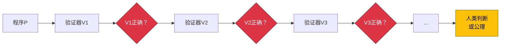

# 代码的物理学：理解计算中的基本限制（第二部分）

## 引言：从理论走向实践

在[本系列的第一部分](/blog/fundamental-limits-in-computing)中，我们打下了计算限制的概念基础：基本限制与工程限制的区别、四层计算层次结构、形式化复杂性测量，以及智力-可计算性悖论。我们探讨了为何一些看似简单的问题（如停机问题）在数学上无解，而看似需要复杂智力的问题（如机器翻译）却是可判定的。

**第二部分，我们从抽象理论走向实际应用。** 本文探讨这些基本限制如何体现在日常工程决策中，考察历史如何揭示：理解约束反而能释放创新，并将计算限制与关于逻辑、数学和意识的深刻哲学问题联系起来。最后，我们会提供一个实用框架，帮你立即分类问题并做出更好的工程决策。

:::info 系列文章
这是两部分系列的**第二部分**。[第一部分](/blog/fundamental-limits-in-computing)涵盖限制的本质、计算层次结构、复杂性测量和智力-可计算性悖论。第二部分探讨实际应用、历史教训和哲学基础。
:::

{/* truncate */}

---

## 第五节：特定实例与通用算法

工程师常常遇到这样的悖论："我能验证 2+2=4 是对的。我能测试这个特定函数是否正常工作。但你却说完整的自动化验证不可能？"**关键在于理解：验证特定实例和构建通用验证算法，这两者有本质区别。** 这个区别常被误解，却正是为什么测试只能采样行为而无法证明正确性的核心所在。

### 表面上的矛盾

困惑很自然：
1. **观察**："2+2=4，这绝对正确" ✓
2. **推广**："我能验证这个简单程序返回 4" ✓
3. **再推广**："所以计算机能验证程序正确性" ✗

错误就在第3步——混淆了"能验证这个程序"与"能验证所有程序"。

### 可行之事：特定验证

针对任何特定程序实例，都存在验证方法：

**直接执行**：运行程序并检查输出。对于有限输入且能终止的程序，这完全有效。

**形式证明（Formal Proof）**：用数学逻辑证明特定程序的属性。像[Coq](https://coq.inria.fr/)、[Isabelle](https://isabelle.in.tum.de/)和[TLA+](https://lamport.azurewebsites.net/tla/tla.html)这样的工具，能为精心指定的系统实现这一点。

**测试**：用样本输入执行程序，验证输出是否符合预期。适用于特定测试用例。

**类型检查（Type Checking）**：确定性地验证语法属性（程序结构）。这就是为什么[类型系统（Type Systems）](https://en.wikipedia.org/wiki/Type_system)如此有价值——它们检查的是可判定属性。

所有这些方法都针对**特定实例**——单个程序或有限的测试用例集。验证是有界且具体的。

### 不可能之事：通用验证

[莱斯定理（Rice's Theorem）](https://en.wikipedia.org/wiki/Rice%27s_theorem)证明：没有算法能为**所有程序**验证任意语义属性：

**通用正确性检查器**：不可能存在——因为它需要判定任意程序是否满足任意规范。

**完整的错误检测器**：不可能存在——因为它需要识别任意代码中所有可能的语义错误。

**通用停机检查器**：不可能存在（图灵的原始证明）——会导致自指矛盾。

**程序等价性验证器**：不可能存在——检查两个任意程序是否计算相同函数，这是不可判定的。

区别至关重要：

| 特定实例验证 | 通用算法验证 |
|-------------------------------|----------------------------------|
| 验证这个程序返回4 | 验证所有类似的程序返回正确的结果 |
| 测试这1,000个输入 | 测试所有可能的输入 |
| 检查这个循环终止 | 检查所有循环终止 |
| 证明这个函数满足规范 | 证明所有函数满足其规范 |
| **对特定情况可判定** | **一般情况下不可判定** |

:::info 与莱斯定理的联系
正如我在之前文章中探讨的，[莱斯定理（Rice's Theorem）](/blog/rices-theorem-why-automated-testing-will-fail)证明：程序的所有非平凡[语义属性（Semantic Properties）](https://en.wikipedia.org/wiki/Semantics_(computer_science))都不可判定。这意味着任何有意义的行为属性（正确性、终止、安全性）都无法针对任意程序进行算法验证。
:::

### 无限回归困境

为什么不能验证验证器本身？这会导致无限回归：

1. 编写程序 P 解决你的问题
2. 编写验证器 V₁ 检查 P 是否正确
3. V₁ 正确吗？那就编写验证器 V₂ 检查 V₁
4. V₂ 正确吗？那就编写验证器 V₃ 检查 V₂
5. 无限循环...

**莱斯定理（Rice's Theorem）说：这条链无法以算法方式确定性终止。** 最终，你必须将验证建立在：
- 人的判断（关于规范）
- 你接受但不证明的公理
- 采样而非证明的测试



这不是弱点——这是验证的现实。所有形式系统最终都建立在不经证明而接受的公理上（[哥德尔不完备性（Gödel's Incompleteness）](https://en.wikipedia.org/wiki/G%C3%B6del%27s_incompleteness_theorems)）。

### 实践启示

理解这一区别会改变工程实践：

**测试**：拥抱测试的采样本质，它能提供信心但无法提供证明。设计测试策略，最大化对可能失败模式的覆盖，同时接受你无法测试"一切"。

**形式验证**：用于关键系统，但要明白你在证明的是"程序与规范匹配"——你无法算法验证规范本身是否就是你想要的。

**类型系统**：重视它们，因为它们检查可判定的语法属性。虽然它们无法验证语义正确性，但能提供关于程序结构的保证。

**代码审查**：必不可少，因为人能提供工具无法提供的语义判断。审查者回答的是"这是否做了我们真正想要的事"——这个问题工具无法普遍回答。

**AI 辅助开发**：AI 能验证特定模式并建议改进，但无法保证任意程序满足任意需求。用 AI 来增强判断，而非取代判断。

**"这个有效"和"所有类似的都有效"之间的鸿沟，就是可能与不可能的分界线。** 特定验证实用且有价值；通用验证在数学上不可能。成熟的工程师承认这个边界，并在其中高效工作。

---

## 第六节：实践中的工程启示与历史教训

当理解基本限制并应用到日常工程决策时，抽象理论就转化为了竞争优势。**历史一再表明：接受限制不会束缚创新——反而能将创新聚焦到突破性解决方案上。** 让我们看看现代工程中的实际应用，以及约束如何催生创新的历史规律。

### 现代工程实践

**测试策略**：拥抱测试作为通过战略采样建立信心的手段，而非证明。设计测试套件，最大化对可能失败模式的覆盖。结合单元测试（特定实例）、基于属性的测试（随机采样）和关于边缘情况的人工判断。接受这样的现实：100% 覆盖率 ≠ 100% 正确性。

**代码审查**：在自动化语法检查的同时，重视人工审查以获得语义正确性。工具擅长发现样式违规、已知模式和结构问题（这些都可判定）。人擅长问"这解决了正确的问题吗"和"这些需求正确吗"——这些问题涉及不可判定的语义属性。

**AI 辅助开发**：用[AI 编码助手（AI Coding Assistants）](https://github.com/features/copilot)来增强人的判断，而非取代。AI 擅长模式匹配、代码补全和生成选项（这些都是有"足够好"解决方案的可判定任务）。但 AI 无法保证正确性或验证任意规范——这些仍是不可判定的。把 AI 当作需要监督的高技能助手。

**形式验证**：应用于关键系统（航天器、医疗设备、金融交易），但要理解范围。你在证明的是"代码匹配形式规范"——但规范本身需要人的判断，以确保它捕获了真实需求。这很有价值，但有界。

**工具评估危险信号**：对"完整自动化验证"、"保证无错误"或"100% 安全保证"等承诺保持怀疑。这些都在承诺解决不可判定问题。现实的工具会明确说明范围："查找常见内存错误"或"检测 SQL 注入漏洞"（特定、有界的问题）。

| 不成熟的工程心态 | 成熟的工程心态 |
|------------------------------|----------------------------|
| "我们需要能保证 100% 正确性的工具" | "我们需要在约束内最大化信心的策略" |
| "这个 AI 将永久解决测试问题" | "这个 AI 在其可判定范围内改进测试" |
| "全部自动化" | "自动化可判定任务，对不可判定任务应用判断" |
| "追求数学确定性" | "通过多种方法建立实践信心" |
| 对工具限制感到沮丧 | 理解哪些限制是基本的 vs 可改进的 |

### 历史规律：限制催生创新

这个模式在各个领域反复出现：理解基本限制反而催化了突破性创新。

**物理学：光速屏障**

- **1905年前**：工程师追求"超光速"通信和旅行
- **爱因斯坦（Einstein）（1905年）**：证明 c 是基本常数——时空几何的一部分
- **结果**：并非沮丧，而是革命性创新：
  - [GPS 卫星（GPS Satellites）](https://en.wikipedia.org/wiki/Global_Positioning_System)（要考虑相对论时间膨胀——微秒级差异很重要！）
  - 粒子加速器（接近但从不超过 c，实现粒子物理学）
  - 光纤（利用光本身达到最大速度）
  - 核能（理解 E=mc²）
  - 现代宇宙学（理解宇宙膨胀）

**热力学：绝对零度**

- **1900年代前**：追求达到 0 K
- **量子力学**：证明 0 K 是渐近不可达的
- **结果**：创新应用涌现：
  - 实现了纳开温度（比 0 K 高十亿分之一度）
  - 发现了[超导性（Superconductivity）](https://en.wikipedia.org/wiki/Superconductivity)（零电阻）
  - 实现了[量子计算（Quantum Computing）](https://en.wikipedia.org/wiki/Quantum_computing)（需要接近绝对零度的条件）
  - 开发出玻色-爱因斯坦凝聚态（新的物质状态）

**计算：不可判定性**

- **1936年前**：假设所有明确定义的问题都能算法求解
- **图灵（Turing）（1936年）、莱斯（Rice）（1951年）**：证明停机问题和语义属性不可判定
- **结果**：约束内的务实创新：
  - [类型系统（Type Systems）](https://en.wikipedia.org/wiki/Type_system)（可判定的语法保证）
  - 单元测试框架（务实的采样方法）
  - [形式方法（Formal Methods）](https://en.wikipedia.org/wiki/Formal_methods)（相对于规范的证明）
  - [静态分析（Static Analysis）](https://en.wikipedia.org/wiki/Static_program_analysis)（对特定属性的合理近似）
  - 规范驱动的开发（基于人工判断的语义）

**规律**：

| 阶段 | 行为 | 结果 |
|-------|----------|---------|
| **理解限制之前** | 浪费资源尝试不可能的事 | 沮丧、进展缓慢 |
| **否认阶段** | 声称突破违反了限制 | 失望、信誉受损 |
| **接受阶段** | 在约束内创造性工作 | 创新爆发、真正突破 |

:::note 核心洞察
**每当人类理解了基本限制，都会在该限制内引发创新爆发——而非停滞。** 约束将努力聚焦在可实现目标上，矛盾的是，这反而释放了创造力，而非束缚它。
:::

### 日常工程的决策框架

这是应用这种理解的实用框架：

```
1. 属性可以在语法上检查吗？
   是 → 完全自动化（类型检查，linters，formatters）
   
2. 它是具有有界范围的语义属性吗？
   是 → 形式方法+综合测试
   
3. 它是一般的语义属性吗？
   是 → 接受采样方法+人类判断
   
4. 它超越形式化（美学，意义）吗？
   是 → 需要人类专业知识，使用AI来呈现选项
```

**项目规划**：在确定项目范围时，按层级对任务进行分类。完全自动化第一层。对于第二层，为启发式和"足够好"编制预算。对于第三层，包括人工审查周期。对于第四层，确保专家全程参与。

**架构决策**：设计系统时承认完整验证是不可能的。为关键路径构建冗余、优雅降级、监控和人工监督。不要设计得好像可以实现完美的自动化验证。

**团队建设**：重视理解限制的工程师——他们设定现实目标，批判性地评估工具，兑现承诺而不是过度承诺。这是专业成熟的标志。

**理解什么是不可能的，可以让你将精力集中在可实现和有价值的事情上。**

---

## 第七节：哲学基础与实际赋能

我们探索的计算限制不是任意的技术约束——它们源于逻辑、数学和计算本质本身的最深层问题。**理解这些哲学基础揭示了为什么限制是永恒的，以及它们如何矛盾地赋能而不是约束工程。**

### 哲学基石

**[哥德尔不完备性定理（Gödel's Incompleteness Theorems）](https://en.wikipedia.org/wiki/G%C3%B6del%27s_incompleteness_theorems)（1931年）**：库尔特·哥德尔（Kurt Gödel）证明了任何足够强大以表达算术的一致形式系统都包含它无法证明的真陈述。他的第二个定理表明，没有一致的系统可以证明自己的一致性。这适用于所有数学系统——即使数学也有不可证明的真理。

**与计算的联系**：哥德尔的结果早于现代计算，但直接适用。正如形式系统无法证明所有真理，算法无法判定所有属性。哥德尔使用的自指技术（构造引用自身的陈述）与图灵对停机问题的对角论证平行。

**[丘奇-图灵论题（Church-Turing Thesis）](https://en.wikipedia.org/wiki/Church%E2%80%93Turing_thesis)（1936年）**：阿隆佐·丘奇（Alonzo Church）和艾伦·图灵（Alan Turing）独立地将"有效可计算性"定义为[图灵机（Turing Machines）](https://en.wikipedia.org/wiki/Turing_machine)可以计算的内容。这不是一个定理，而是一个在90年中在所有提议的计算模型中保持的定义。它定义了"算法"的含义。

**含义**：即使量子计算机也不超过图灵可计算性——它们更快地解决某些问题，但无法解决不可判定的问题。丘奇-图灵边界似乎是计算本身的基本属性。

**自指主题**：所有这些限制都涉及自指创建逻辑不可能性：
- **哥德尔**："这个陈述在这个系统中是不可证明的"
- **图灵/停机**："这个检查停机的程序说我停机吗？"
- **莱斯定理**："这个算法正确识别程序属性吗？"

自指创建了无法算法解决的悖论，揭示了形式系统的边界。

### 从理论到赋能

这是反直觉的真理：**知道什么是不可能的是解放的，而不是限制的。** 理解边界将努力集中在可实现的目标上，产生比追逐不可能的目标更大的有效性。

**赋能模式**：

1. **焦点清晰**：停止在数学上不可能的目标上浪费资源
2. **战略分配**：投资于可以在经过验证的约束内工作的方法
3. **现实期望**：设定可实现的目标，通过交付建立信任
4. **创造性解决方案**：在约束内工作推动创新
5. **竞争优势**：理解其他人不理解的限制提供战略优势

**跨领域的真实世界示例**：

- **无法超越光速** → GPS（相对论校正），光纤（使用光本身），粒子物理学（接近c）
- **无法达到绝对零度** → 实现了纳开温度，超导性，量子计算
- **无法解决停机问题** → 类型系统，测试框架，形式方法，务实验证

**专业成熟度指标**：
- **初级心态**："这个工具应该做X"（不理解X是否可能）
- **高级心态**："这个工具在范围Z内做Y；X在根本上是不可能的，因为[数学原因]"

### 实用分类框架

为了使所有这些可操作，这是一个用于分类你遇到的任何计算问题的多维框架：

**框架维度**：
1. **可形式化性（Formalizability）**（0.0-1.0）：我们能精确定义它吗？
2. **可判定性（Decidability）**（是/否/未知）：算法存在吗？
3. **时间复杂度（Time Complexity）**（O(n)，O(2ⁿ)，∞）：需要多长时间？
4. **答案客观性（Answer Objectivity）**（0.0-1.0）：是否有唯一的正确答案？
5. **自动化潜力（Automation Potential）**（0.0-1.0）：可以自动化多少？

**示例分类**：

| 问题 | 可形式化 | 可判定 | 复杂度 | 客观性 | 自动化 | 策略 |
|---------|--------------|-----------|------------|-----------|------------|----------|
| **算术（2+2）** | 1.0 | 是 | O(1) | 1.0 | 1.0 | 完全自动化 |
| **排序** | 1.0 | 是 | O(n log n) | 1.0 | 1.0 | 完全自动化 |
| **TSP（精确）** | 1.0 | 是 | O(2ⁿ) | 1.0 | 0.5 | 使用启发式 |
| **翻译** | 0.7 | 是 | O(n) | 0.4 | 0.6 | AI+人工审查 |
| **停机问题** | 1.0 | 否 | ∞ | 1.0 | 0.0 | 采样特定情况 |
| **代码美感** | 0.2 | 否 | 不适用 | 0.1 | 0.1 | 需要人类判断 |

**使用框架**：

```
步骤1：你能精确形式化它吗？
  否 → 第四层：需要人类专业知识

步骤2：它是可判定的吗？
  否 → 第三层：采样+人类判断

步骤3：时间复杂度是多少？
  多项式 → 第一层：完全自动化
  指数 → 第二层：启发式或接受限制

步骤4：答案的客观性如何？
  低客观性 → 即使可判定也需要人类判断
  高客观性 → 如果复杂度允许可以自动化
```

**实际应用**：
- **项目规划**：分类任务→设定现实时间表
- **工具评估**：将工具能力与问题层级匹配
- **团队分配**：专家处理高判断问题，自动化处理可判定问题
- **架构**：设计时承认哪些组件需要人工监督

**这个框架将抽象理论转化为实际决策指导——了解你的问题概况以选择正确的策略。**

---

## 结论：面对不可改变定律的工程成熟度

我们从一个平行开始：爱因斯坦证明你不能超越光速；图灵证明你不能解决停机问题。两者都是嵌入现实和计算结构中的永恒数学真理。**这些不是等待更好工具的临时工程挑战，而是像物理常数一样不可改变的基本定律。**

通过这两部分的旅程，我们看到计算问题占据一个从平凡可计算到根本无法形式化的丰富层次结构，在层级之间有数学上尖锐的边界。我们探索了"对智力困难"与"对算法不可能"的不同，为什么我们可以验证特定实例但不能构建通用验证器，以及理解这些限制如何转变日常工程决策。

实际影响是深远的。理解这些边界转变了工具评估、测试策略、代码审查实践和架构决策。当供应商承诺"完整的自动化验证"时，你现在认识到这是声称解决不可判定的问题——一个数学上的不可能性，而不仅仅是一个困难的工程挑战。

**但这是赋能的现实**：每次人类理解基本限制时，创新都爆发而不是停滞。物理学家接受光速屏障给了我们GPS、光纤和粒子物理学。工程师接受不可判定性给了我们类型系统、务实的测试框架和规范驱动的开发。**约束不限制创新——它们聚焦创新。**

历史教导了一个清晰的模式：那些否认限制的人在不可能的目标上浪费资源；那些理解限制的人在其中出色地工作，实现了无知永远找不到的突破。最好的工程师不是那些忽视边界的人——他们是那些深入理解边界并利用这种理解获得竞争优势的人。

### 你的前进之路

这是理解基本限制所实现的：

**审核你的假设**：审查你认为"可能"与"只是困难"的内容。质疑完全自动化或保证正确性的声明——它们通常混淆了可判定与不可判定的问题。

**现实地评估工具**：问"这个工具在基本限制内工作吗？"声称克服莱斯定理的工具正在出售不可能性。现实的工具明确说明其范围和限制。

**建立战略信心**：接受测试采样，验证相对于规范证明，人类判断对于语义属性仍然至关重要。通过多种互补方法而不是寻求单一算法证明来建立信心。

**分享理解**：教育团队关于基本限制与工程限制。这种共享知识防止过度承诺，设定现实目标，并建立机构成熟度。

**明智地集中精力**：在数学约束内投资于可实现的事情。完全自动化可判定的任务。对难以处理的问题使用启发式。对不可判定的属性接受采样。为意义和判断保留人类专业知识。

你获得的框架、模式和区别不是学术好奇心——它们是更好工程的实用工具。当你遇到一个问题时，对它进行分类：哪个层级？可判定还是不可判定？正确的策略是什么？仅此清晰度就能使你更有效。

**计算的边界不是任意的技术限制——它们是逻辑本身的基本属性，连接到关于数学、意义和心灵的最深层问题。** 理解它们不会让你成为一个受限的工程师；它让你成为一个成熟的工程师，提供结果而不是追逐不可能的梦想。

当你回到你的代码、你的架构决策、你的团队讨论时——带着这种理解：**最好的工程师不是那些忽视限制的人。他们是那些深入理解限制并在其中出色工作的人。** 在这种理解中不是约束，而是深刻的赋能。

代码的物理学与物质的物理学一样真实。光速不是要克服的挑战——它是要理解并在其中工作的定律。计算限制也是如此。在接受它们中，我们找到的不是失败，而是实现真正掌握的集中清晰度。

---

**← 阅读[第一部分：基础与理论](/blog/fundamental-limits-in-computing)** | **系列完成**
