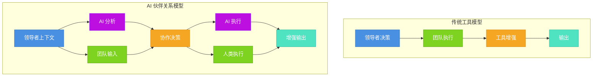
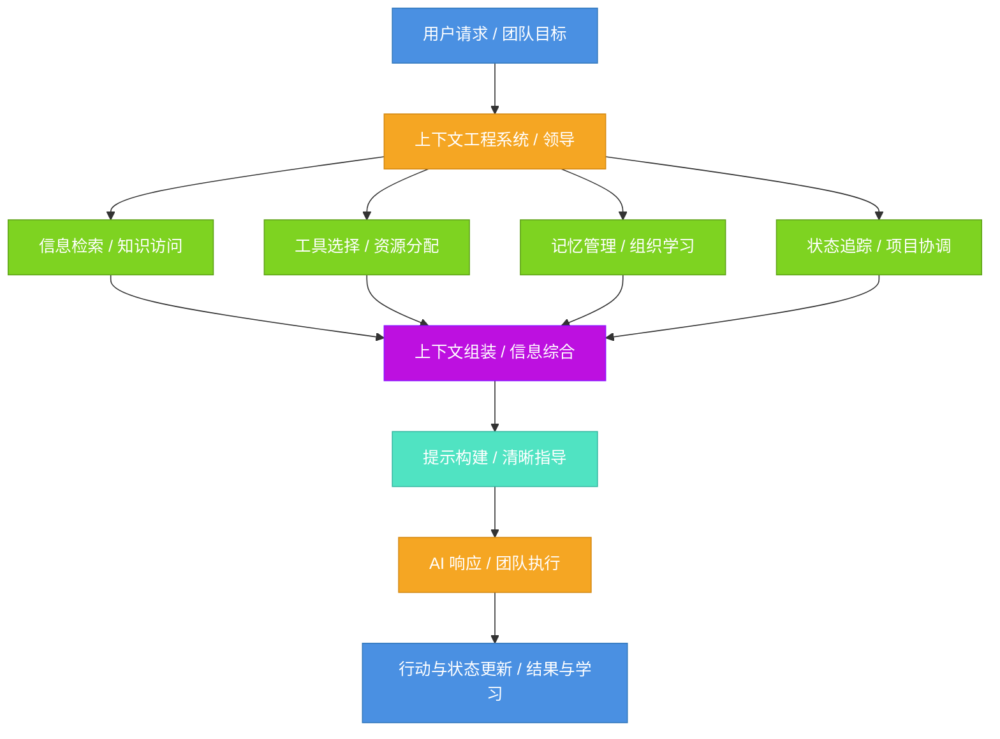
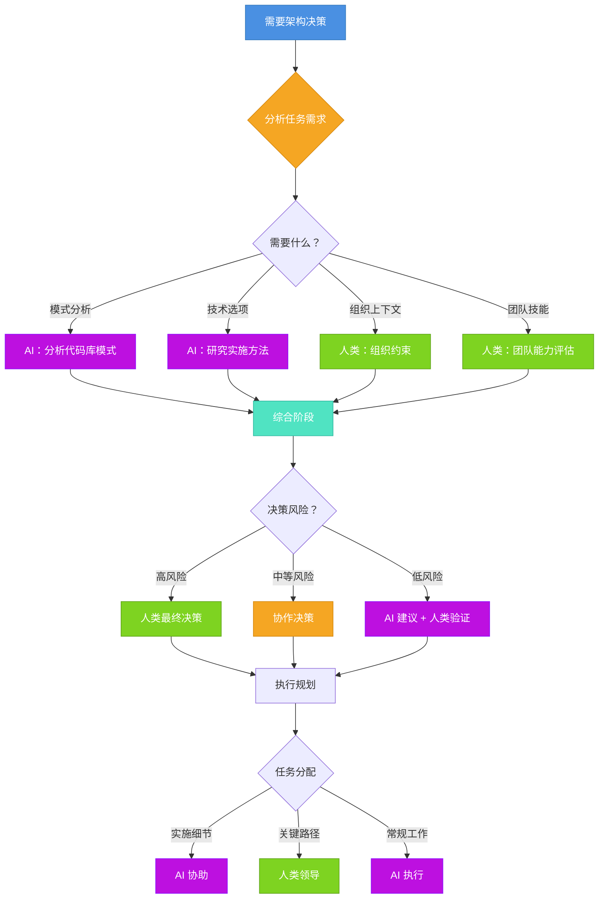

<!-- 
重要：日期一致性检查
- 文件名: 2025-10-09-ai-leadership-from-tool-to-collaborative-partner.mdx
- 前置数据日期: 2025-10-09
- 这些必须完全匹配以确保博客功能正常
- AI代理：编辑时请始终验证日期对齐
-->

第一次当 AI 系统对我的架构决策提出异议并且被证明是对的时，我意识到我不再是在管理一个工具——我是在与一个伙伴协作。这个建议来自一个分析我们代码库模式的 AI 代理，它建议采用不同的数据库架构方法，我最初拒绝了。但当我深入研究时，AI 发现了我错过的跨服务微妙一致性问题。那一刻让我明白了一些我一直感觉到但无法清楚表达的东西：**AI 已经从我们使用的工具根本性地转变为我们协作的伙伴**。

如果你今天是一位技术领导者，你可能感受到了这种紧张。AI 显然具有变革性——[GitHub Copilot](https://github.com/features/copilot) 报告显示了显著的生产力提升，[Notion AI](https://www.notion.so/product/ai) 重塑了团队的工作方式，ChatGPT 在软件开发中已无处不在。但为纯人类团队构建的现有管理框架不再完全适用。你知道应该"拥抱 AI"，但这对于你如何领导实际意味着什么？当 AI 参与对话时，你如何做决策？你如何与不断演化和学习的系统建立信任？你如何构建包含人类和 AI 能力的团队？

{/* truncate */}

挑战不仅仅是学习新的 AI 工具——而是**当 AI 成为协作伙伴时，传统的领导范式会崩溃**。适用于工具的命令与控制方法在 AI 系统拥有自己的决策逻辑时会失效。为人类团队成员设计的委派策略不能直接转化为 AI 能力。为人类理解优化的沟通模式可能不适合 AI 协作。从"学习使用 AI 工具"到"学习与 AI 系统协作"的转变需要从根本上重新思考领导方法。

这次转型与以往的技术采用不同之处在于：**AI 不仅增强我们的能力——它改变了我们思考、决策和协作的方式**。当你集成 IDE 或版本控制系统时，你的领导方法基本保持不变。但当 AI 参与架构决策、代码审查和战略规划时，领导本身发生转变。你不再只是指挥使用工具的人类；你在协调一个混合团队，其中 AI 和人类各自带来不同的优势、约束和工作方式。

关键见解是**理解 AI 系统实际如何工作不再是可选的技术知识——它是有效领导的基础**。像[上下文工程（Context Engineering）](/blog/context-engineering)、提示编排（Prompt Orchestration）、记忆管理（Memory Management）和检索增强生成（Retrieval-Augmented Generation，RAG）这样的概念不仅仅是工程师的实现细节。它们是直接指导你应该如何构建信息流、管理团队知识、校准信任和做出协作决策的操作框架。正如 [LangChain 指出的](https://blog.langchain.com/the-rise-of-context-engineering/)，上下文工程代表着构建动态系统，在正确的时间以正确的格式提供正确的信息和工具——这也正是领导的本质。

在本文中，我们将探讨技术 AI 概念如何直接指导领导实践。我们将考察从工具到伙伴的根本范式转变，将上下文工程和提示编排等核心技术概念与具体的领导应用联系起来，并为 AI 增强团队中的信任校准、沟通模式和决策提供实用框架。无论你是导航组织 AI 采用的 CTO、构建混合团队的工程经理，还是弄清楚如何有效地与 AI 合作的技术负责人，理解这些联系将改变你的领导方式。

让我们从理解是什么使 AI 伙伴关系与工具采用根本不同开始——以及为什么这对领导很重要。

## 范式转变：从工具到伙伴

要理解为什么 AI 需要根本性的领导转型，我们首先需要认识到传统工具采用是如何工作的——以及为什么 AI 完全打破了这个模型。

**传统工具采用遵循可预测的模式**：领导者评估工具，做出采购决策，团队学习操作它们，工作流程围绕工具的能力进行调整。工具增强人类能力，但不参与决策。代码编辑器让你更快地编写代码，但它不建议架构模式。版本控制管理代码历史，但它不审查你的拉取请求逻辑。CI/CD 自动化部署，但它不决定发布策略。人类始终牢牢掌控，使用工具来放大自己的判断和执行。

这个模型运行了几十年，因为工具从根本上是被动工具。正如我在[对敏捷团队实践的分析](/blog/agile-team-practices)中探讨的，传统领导专注于协调人类努力、管理信息流和基于团队输入做出决策。工具存在于后台，支持但不参与思考、决策和协作的核心工作。

**AI 从根本上打破了这个模型，因为它参与决策，而不仅仅是执行**。当 GitHub Copilot 建议代码实现时，它不仅仅是自动完成文本——它基于学习的模式提出架构选择。当 AI 系统审查你的数据库架构时，它不仅仅是检查语法——它根据从数千个项目中学到的模式评估设计一致性。当 Notion AI 帮助规划项目时，它不仅仅是组织信息——它基于上下文和学到的最佳实践积极塑造策略。

这是可视化的根本差异：

注意信息流如何转变。在传统模型中，它是线性的：领导者决策，团队执行，工具放大。在 AI 伙伴关系模型中，它是协作的：领导者提供上下文，AI 与人类输入一起分析，决策从综合中产生，AI 和人类各自执行各自的优势。

**这种范式转变需要领导方法的根本性变化**：

| 维度 | 工具思维 | 伙伴思维 |
|------|---------|---------|
| **决策制定** | 领导者决策，工具执行 | 领导者和 AI 协作决策，各自带来不同视角 |
| **信息流** | 单向：领导者 → 团队 → 工具 | 双向：领导者 ↔ AI ↔ 团队，共享上下文 |
| **信任模型** | 二元：工具有效或无效 | 分级：基于领域、风险、验证需求校准信任 |
| **沟通** | 仅为人类优化 | 为人类理解和 AI 解释而构建 |
| **失败模式** | 工具崩溃，切换到手动 | AI 做出不完美决策，需要判断何时/如何信任 |
| **技能要求** | 学习工具操作 | 理解 AI 能力、约束和协作模式 |
| **演化** | 静态：工具行为可预测 | 动态：AI 系统学习和改进，需要持续校准 |

工具思维将 AI 视为你完全指挥的东西。伙伴思维认识到 AI 是一个拥有自己决策逻辑的系统，你与之协作。这不仅仅是语义上的——它对日常领导有深远影响。

考虑一个实际场景：你的团队正在讨论微服务架构决策。在工具思维中，你可能会要求 AI "生成服务图选项"，然后你决定。在伙伴思维中，你向 AI 提供你的约束和需求，让它分析你现有的代码库模式，将其建议与团队专业知识一起考虑，协作讨论权衡，并做出综合 AI 洞察和人类对组织背景判断的明智决策。

**伙伴关系范式改变了"有效领导"的含义**。你不能只是告诉 AI 做什么并期望最佳结果——你需要理解它如何思考，它需要什么上下文，它的建议何时可靠，以及如何适当地校准信任。正如我在[对上下文工程的探索](/blog/context-engineering)中强调的，"记忆将 AI 从你使用的工具转变为与你一起演化的系统。"这不是隐喻——这是领导者必须理解并与之合作的操作现实。

在 AI 增强环境中蓬勃发展的领导者不会是那些简单地"更多使用 AI 工具"的人。他们将是那些从根本上将领导重新构想为协调混合人类-AI 能力的人，他们足够了解 AI 系统如何工作以有效协作，他们在伙伴关系背景下为信任、沟通和决策建立明确框架的人。

但这在实践中实际意味着什么？要回答这个问题，我们需要理解 AI 系统工作的技术基础——以及为什么这种理解会改变领导。

## 改变领导的技术基础

最有效的 AI 增强领导者不一定是最技术化的——但他们理解核心 AI 概念，深度足以将它们应用为领导框架。这些不仅仅是隐喻；它们是直接指导你应该如何构建信息、管理上下文、校准信任和做出决策的操作原则。

**上下文工程：信息编排的艺术**

在其核心，[上下文工程](/blog/context-engineering)是关于构建动态系统，以正确的格式提供正确的信息和工具，使 AI 能够有效地完成任务。正如 [LangChain 强调的](https://blog.langchain.com/the-rise-of-context-engineering/)，"上下文工程代表着从简单提示制作到构建动态提供 AI 模型所需一切的复杂系统的范式转变。"

这对领导为何重要：**正如 AI 系统需要精心编排的上下文才能表现良好，团队需要结构化的信息流才能有效工作**。使 AI 系统成功的原则直接对应于使团队成功的原则。

考虑这在实践中意味着什么。当 AI 系统有有限的上下文窗口（比如 128K 个令牌）时，它强制对什么信息最重要做出明确决策。作为领导者，你面临类似的约束——你的团队的认知能力、会议时间、沟通带宽。理解上下文窗口限制教会你对什么上下文对决策真正重要做到无情地明确。

:::tip 上下文感知领导
** 上下文感知领导（Context-Aware Leadership）** 的原则意味着明确管理你的团队可以访问什么信息、何时访问以及以什么格式——就像上下文工程管理到 AI 系统的信息流一样。不要假设共享理解；构建系统以确保关键上下文在正确的时间到达正确的人。
:::

**RAG：动态知识访问**

[检索增强生成（Retrieval-Augmented Generation，RAG）](/blog/context-engineering)通过使系统能够动态检索相关信息而不是仅依赖训练数据，彻底改变了 AI。RAG 系统不是试图将所有内容编码到模型中，而是在需要时检索所需内容。

领导的相似之处是深刻的。传统领导通常假设领导者必须"知道一切"或在头脑中保持所有组织知识。**RAG 模式教会我们，有效的领导是关于构建动态知识访问系统**，而不是个人知识囤积。

| AI 概念 | 领导应用 |
|---------|---------|
| ** 向量搜索（Vector Search）** | 跨组织知识的语义搜索——通过含义而不仅仅是关键词找到相关上下文 |
| ** 检索排序（Retrieval Ranking）** | 根据相关性、新近度和可靠性优先考虑什么信息浮现给决策者 |
| ** 上下文注入（Context Injection）** | 在恰好需要时向决策者提供综合的相关背景 |
| ** 来源归因（Source Attribution）** | 维护信息来源的清晰血统以进行信任校准 |
| ** 自适应检索（Adaptive Retrieval）** | 根据不断演化的项目上下文和团队需求调整浮现的知识 |

当你理解 RAG 时，你不再试图成为所有组织知识的瓶颈。相反，你构建系统——文档、知识库、沟通模式——使团队成员能够动态检索他们需要的东西。正如在[软件项目复杂性](/blog/software-project-complexity)中探讨的，信息管理是处理复杂性的核心，RAG 原则展示了如何系统地做到这一点。

**记忆和状态：短期与长期上下文**

AI 系统区分短期记忆（当前对话上下文）和长期记忆（跨会话的持久信息）。这种区分改变了领导者应该如何思考团队知识管理。

**短期记忆**在领导中意味着管理即时项目上下文：当前冲刺目标、活跃讨论、今天的决策、临时约束。这些信息是会话范围的——现在高度相关，以后不太重要。

**长期记忆**意味着捕获持久的组织知识：成功模式、学到的教训、团队偏好、应该指导未来工作的战略决策。这些信息超越单个项目，应该跨时间可访问。

许多领导者混淆了这些，要么将所有内容视为同等重要，要么因不区分什么应该持久而失去有价值的上下文。理解 AI 记忆模式教会明确的状态管理：

- 什么上下文需要积极维护 vs. 归档？
- 你如何将完成的项目上下文压缩成有用的组织知识？
- 何时应该将历史上下文"加载"到当前讨论中？
- 过去项目中的什么模式应该指导当前决策？

**提示工程：结构化沟通**

正如我在[对 POML 的分析](/blog/poml)中探讨的，提示工程已经从一门艺术演化为一个结构化学科。像微软的 POML 这样的现代方法为 AI 沟通带来了模块化、一致性和清晰的结构。

领导的教训很直接：**结构化、明确的沟通显著改善结果**。正如好的提示澄清角色、任务、约束和预期输出，好的领导沟通应该同样结构化：

| 提示工程原则 | 领导沟通应用 |
|------------|------------|
| ** 清晰的角色定义（Clear Role Definition）** | 明确说明谁在决策和执行中负责什么 |
| ** 明确的任务描述（Explicit Task Description）** | 提前定义成功标准和约束，而不是通过迭代澄清 |
| ** 上下文提供（Context Provision）** | 明确提供相关背景，而不是假设共享理解 |
| ** 输出格式规范（Output Format Specification）** | 澄清决策、更新或交付物应该采取什么形式 |
| ** 一致性（Consistency）** | 使用可预测的沟通模式，使团队知道期望什么 |
| ** 模块化（Modularity）** | 将复杂的指导分解为清晰、可组合的组件 |

糟糕的领导沟通通常假设太多共享上下文，对期望保持模糊，并缺乏一致的模式。理解提示工程原则使这些差距变得明显并提供框架来修复它们。

**工具编排：动态能力路由**

现代 AI 系统不仅处理信息——它们根据任务需求动态选择和编排工具。AI 代理可能在数学计算器、代码解释器进行分析或网络搜索获取当前信息之间选择。

这正是混合团队中有效领导所需要的：**基于优势、约束和上下文的人类和 AI 能力的动态编排**。不是"AI 做 X，人类做 Y"作为静态规则，而是将工作智能地路由到最适合每个特定任务的人（人类或 AI）。

考虑一个代码审查场景。AI 擅长检查风格一致性、识别常见错误模式和建议惯用改进。人类擅长评估业务逻辑对齐、理解组织上下文和对权衡做出判断。有效的领导将审查的不同方面路由到适当的能力，而不是强制全人类或全 AI 方法。

:::note 关键洞察
** 技术理解使更好的领导决策成为可能**。你不需要实现 RAG 系统或训练 AI 模型，但理解这些概念从根本上改变了你如何构建信息流、管理知识、传达指导以及在团队中编排能力。
:::

理解这些技术基础的领导者将它们视为操作框架，而不仅仅是有趣的概念。他们看到上下文工程与信息管理、RAG 模式与知识访问、记忆系统与组织学习、提示结构与沟通清晰度之间的相似之处。

现在我们理解了这些技术基础，问题变成：你如何在日常领导实践中实际应用它们？什么具体框架帮助导航 AI 增强的团队动态？

## AI 增强领导的实用框架

理解技术概念是有价值的，但有效的领导需要将这种理解转化为实际行动。这里是 AI 增强团队中信任校准、沟通模式、委派和决策的具体框架。

**信任校准：知道何时信任什么**

AI 增强领导中最关键的技能是** 信任校准（Trust Calibration）**——知道何时信任 AI 建议，何时信任人类判断，以及何时需要验证。这不是关于全面信任或不信任；这是关于基于上下文建立分级信任的明确框架。

考虑这个决策框架：

| 决策上下文 | 主要权威 | 需要验证 | 推理 |
|----------|---------|---------|------|
| ** 代码风格一致性（Code Style Consistency）** | AI（高信任） | 人工审查边缘情况 | AI 擅长模式匹配；人类捕获特定上下文异常 |
| ** 错误模式检测（Bug Pattern Detection）** | AI（高信任） | 行动前人工确认 | AI 很好地识别模式；人类确认严重性和修复 |
| ** 架构权衡（Architectural Trade-offs）** | 人类（高信任） | AI 分析盲点 | 需要 AI 缺乏的组织上下文、长期愿景 |
| ** 库选择（Library Selection）** | 协作 | 双方贡献分析 | AI 知道技术能力；人类知道团队约束 |
| ** API 设计（API Design）** | 协作 | 迭代细化 | AI 建议模式；人类评估可用性和可维护性 |
| ** 业务逻辑（Business Logic）** | 人类（高信任） | AI 进行一致性检查 | 需要 AI 缺少的深度领域知识和利益相关者上下文 |
| ** 性能优化（Performance Optimization）** | AI 初始分析 | 人类战略决策 | AI 识别瓶颈；人类决定优先级和方法 |
| ** 安全问题（Security Concerns）** | 人类（高信任） | AI 进行模式检测 | 高风险需要人类问责；AI 协助检测 |

关键原则：**信任应该基于风险、AI 能力匹配和验证机制的可用性进行校准**。具有组织影响的高风险决策需要人类领导；模式匹配和一致性检查利用 AI 优势；当人类和 AI 视角都增加价值时，协作方法效果最好。

将这种校准融入你的团队需要明确讨论。不要让它隐含——创建关于何时直接信任 AI 建议 vs. 何时它们是人类决策的输入 vs. 何时它们需要验证的共享理解。

**结构化沟通：从模糊指导到清晰编排**

将提示工程原则应用于领导沟通意味着从模糊的、依赖上下文的指导转向结构化的、明确的清晰度。这是在实践中的样子：

**之前（模糊指导）**：
"我们需要改进 API 性能。有人能看看吗？"

**之后（结构化沟通）**：
"**角色**：用户 API 的性能优化负责人
**任务**：分析和改进 p95 延迟（当前 450ms，目标低于 200ms）
**上下文**：客户抱怨仪表板加载缓慢；主要影响高级用户
**约束**：无破坏性更改；必须保持向后兼容性
**资源**：生产指标仪表板，用于测试的暂存环境
**输出**：周五前的优化计划，预计影响；下一个冲刺的实施计划
**成功**：p95 延迟低于 200ms，功能保持"

注意结构化沟通如何消除歧义，明确提供必要的上下文，并提前澄清期望。无论你是指导人类、与 AI 协作还是协调两者，这都同样有效。

:::tip 沟通框架
像有效提示一样构建领导指导：**角色**（谁），**任务**（什么），**上下文**（为什么和背景），**约束**（边界），**资源**（可用工具/信息），**输出**（预期结果格式），**成功**（你如何知道它有效）。
:::

**动态委派：编排混合能力**

传统委派假设相对稳定的能力分配："Alice 处理前端，Bob 处理后端。"AI 伙伴关系需要**基于任务特定能力匹配的动态编排**。

这是架构决策的实际编排流程：

这不是静态分配——它是基于每个任务需要什么的动态路由。AI 处理模式分析和研究；人类提供组织上下文和团队评估；决策根据风险路由；执行根据优势分割。

领导技能不是一劳永逸地决定"AI 做 X，人类做 Y"。它是持续评估任务需求并将工作路由到最适合处理每个特定方面的人——人类或 AI。

**决策协议：协作决策的框架**

当 AI 参与决策时，你需要明确的综合协议。这是一个适用于不同决策类型的实用框架：

**阶段 1：上下文设置**
- 清楚地定义决策范围、风险和约束
- 确定需要什么信息（利用 RAG 原则）
- 确定谁需要参与（人类和 AI 角色）

**阶段 2：分析**
- AI 提供：数据分析、模式识别、选项生成、一致性检查
- 人类提供：组织上下文、战略对齐、风险评估、利益相关者考虑
- 双方贡献：权衡分析、可行性评估

**阶段 3：综合**
- 明确讨论 AI 和人类分析的一致 vs. 不一致之处
- 调查分歧——通常揭示盲点或缺失上下文
- 基于能力匹配权衡输入（信任校准）
- 做出决策，并清楚说明为什么某些输入权重更高

**阶段 4：验证**
- 在实施前定义验证方法
- 为纠正设置检查点
- 建立清晰的所有权（即使是 AI 指导的决策，人类拥有结果）

关键要素是**使过程明确而不是隐含**。不要只是"考虑 AI 输入"——有结构化的方式来纳入它、适当权衡它，并从结果中学习。

**构建团队能力**

这些框架只有在你的团队理解并采用它们时才有效。这需要：

1. **共享心智模型**：确保团队理解 AI 能力和约束（不是实施细节，而是操作特性）
2. **明确规范**：记录何时信任 AI、如何构建沟通、如何路由决策
3. **迭代细化**：定期审查决策，识别框架有效 vs. 需要调整的地方
4. **心理安全**：创造空间质疑 AI 建议，而不担心被视为"反进步"

目标不是完美——而是团队实际可以使用的明确、可改进的框架。从一个框架（也许是信任校准）开始，一致地应用它，从结果中学习，并随着团队能力增长扩展到其他框架。

:::note 领导演化
** AI 增强领导是关于编排，而不是控制**。你在构建有效人类-AI 协作的系统，而不是试图指挥每个决策。蓬勃发展的领导者将是那些将这些框架视为活的工具，基于团队经验和不断演化的 AI 能力持续细化的人。
:::

这些实用框架从技术理解桥接到操作领导。但退一步看，这一切对技术领导的未来意味着什么？

## 领导转型已经来临

我们从一个认识时刻开始——当 AI 不再只是工具而成为协作伙伴时。通过这次探索，我们看到这种转变如何需要我们领导方式的根本转变：从指令控制到协作编排，从隐含假设到明确框架，从将 AI 视为实施细节到将其理解为操作范式。

出现的核心见解：

1. **AI 伙伴关系需要范式转变，而不仅仅是技能升级**。传统工具采用框架失败，因为 AI 参与决策、随使用演化，并需要协作而不仅仅是操作。领导必须从命令与控制转变为编排。

2. **技术概念直接指导领导实践**。上下文工程教授信息编排；RAG 模式改善知识访问；记忆系统塑造组织学习；提示结构澄清沟通。这些不是隐喻——它们是有效领导者每天应用的操作框架。

3. **明确框架变得至关重要**。信任校准、结构化沟通、动态委派和协作决策协议不是可有可无的。它们是你有效导航混合人类-AI 团队复杂性的方式。

4. **双向学习加速两者**。理解 AI 系统改善领导方法，领导原则指导更好的 AI 系统设计。综合创造了两者单独都无法实现的能力。

**未来已经浮现**。对 AI 系统的技术理解正在迅速成为基线领导能力，而不是专业知识。组织正在围绕 AI 增强工作流进行重组，而不仅仅是"添加 AI 工具"。新的领导模式正在形成——那些早期认识并采用它们的人将比那些等待既定手册的人拥有显著优势。

这种转型加速，因为 AI 能力本身在加速。今天的高级功能成为明天的基本要求。适用于当前 AI 的领导框架将需要随着能力扩展而持续细化。将此视为一次性适应的领导者将持续落后；那些为持续演化建立肌肉的人将蓬勃发展。

**从这里去哪里**：如果这与你产生共鸣，立即开始实际应用。深入探索[上下文工程概念](/blog/context-engineering)以理解信息编排原则。在你的团队互动中尝试[结构化沟通方法](/blog/poml)。为你的特定领域构建明确的信任校准框架。最重要的是，开始在实际决策中将 AI 视为协作伙伴——通过实践学习，而不仅仅是阅读。

问题不是技术领导是否会从根本上改变——它已经改变了。问题是你是否会足够快地适应，以在这个新范式中有效领导。那些早期拥抱转型、在人类-AI 协作中建立能力、足够了解 AI 如何工作以有效合作的人——他们不是在为未来做准备。他们正在塑造它。

作为技术领导者，持续学习一直是必不可少的。但现在它不仅仅是关于跟上技术——它是关于从根本上重新构想我们如何领导。蓬勃发展的领导者将是那些将 AI 视为不是要克服的挑战，而是将领导本身演化为更强大、更有效，最终在实现人类和 AI 单独都无法实现的目标方面更加人性化的机会的人。