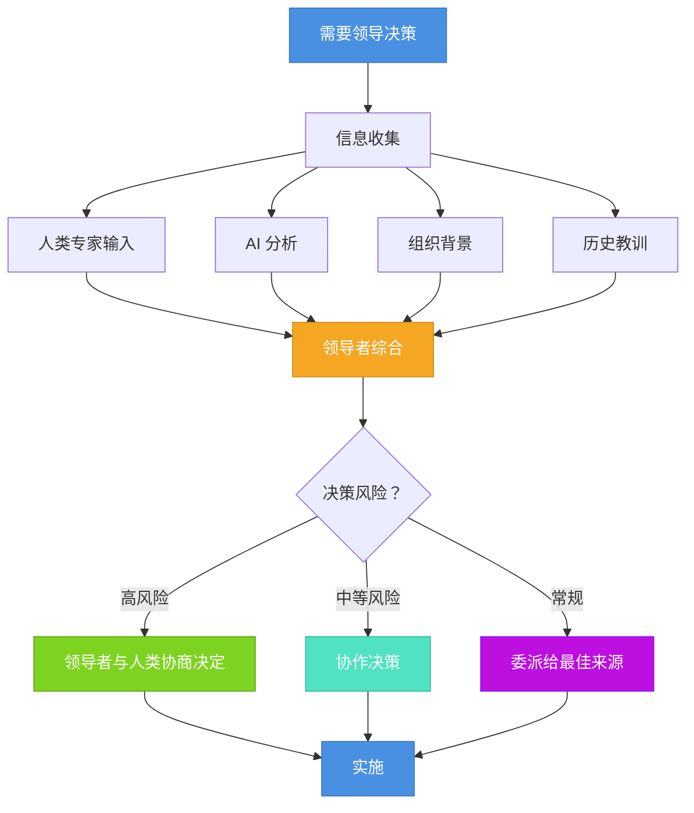

<!-- 
重要：日期一致性检查
- 文件名: 2025-10-09-ai-leadership-from-tool-to-collaborative-partner.mdx
- 前置数据日期: 2025-10-09
- 这些必须完全匹配以确保博客功能正常
- AI代理：编辑时请始终验证日期对齐
-->

第一次，AI 系统对我的架构决策提出了不同意见，结果证明它是对的——那一刻，我意识到某些根本性的东西变了。变的不是 AI 本身，而是"领导力"这个词的含义。这不是关于技术升级的故事，而是关于领导者角色如何进化的故事。那些曾让我成功领导团队的技能并没有失效，但在 AI 参与的环境中，它们需要重新调整。

也许你作为技术领导者，也感受到了这种张力。[研究表明](/blog/ai-productivity)，AI 确实能提升生产力，但效果因人而异——它绝非包治百病的灵丹妙药。你懂得那些[经典的领导技能：技术深度、业务洞察、人际沟通、组织政治](/blog/architect-essential-skills)，它们依然重要。但 **AI 带来了全新的维度，要求这些技能延展和适应**。你的角色不再只是领导团队成员或使用工具，而是要协调一个混合生态——人的判断、管理智慧与 AI 能力，三者需要和谐共生。

{/* truncate */}

真正的问题不是"怎么用 AI 工具"，而是"当团队里既有人又有 AI，我的领导方式该如何演变"？这本质上是领导力的适应，而非技术转型。虽然[理解 AI 的运作机制](/blog/context-engineering)有帮助，但核心挑战在于：如何在人机协作的新环境中，继续践行那些永恒的领导原则。

本文将探讨经典领导技能在 AI 时代的转化与进化。我们会分析哪些保持不变，哪些需要调整，以及领导者需要培养哪些新能力——始终以人为本。无论你是引领组织变革的 CTO、打造高效团队的工程经理，还是摸索日常协作的技术负责人，理解这种演变，都能让你在 AI 赋能的环境中更有效地领导团队。

让我们先看看，传统领导技能如何对应今天的挑战。

## 经典领导力，历久弥新

在谈变化之前，先看看哪些是不变的根基。无论 AI 如何发展，有些核心领导能力始终重要：

**技术深度与广度（Technical Depth and Breadth）**：扎实的技术功底仍是必需的。你需要足够深入地理解领域，才能做出明智决策、权衡利弊、赢得团队信任。AI 没有让这变得不重要——恰恰相反，当你需要同时评估人和 AI 的贡献时，技术判断力变得更加关键。

**业务洞察力（Business Domain Knowledge）**：理解组织在做什么、为何重要、技术如何服务业务目标，这一点始终不可或缺。AI 工具缺乏这种组织情境感；领导者必须提供。当 AI 系统需要合适的框架时，你在业务需求与技术方案之间搭建桥梁的能力反而更有价值。

**人际沟通力（Interpersonal Skills）**：领导的人性面——建立信任、清晰表达、化解冲突、激励团队——不受 AI 影响。实际上反而更重要了。当你把 AI 引入团队工作流程时，需要出色的人际能力来回应疑虑、建立信心、维护团队凝聚力。

**组织政治智慧（Political Navigation）**：理解组织动态、管理利益相关方、平衡竞争诉求，这些仍是核心领导技能。AI 的采用常常引发政治张力（资源分配、职位安全、权力格局），这让政治智慧变得更加关键。

这些传统技能构成你的根基。但 AI 不只是新增工具——它创造了全新的情境，要求你以不同方式运用这些技能。

## 领导力的进化之道

核心领导技能依然重要，但在 AI 赋能的环境中，运用方式已然不同。让我们看看每项传统能力需要如何适应：

### 技术领导：从专家权威到能力协调者

**过去**：技术领导靠的是在特定领域的深厚专业知识。你是解决最难问题、审核最复杂代码、做出关键技术决策的那个人。你的权威来自于你是团队中技术最强的那个人。

**现在**：技术领导变成了**多元能力的协调（Orchestrating Diverse Capabilities）**——人的专长、AI 的分析、混合的方法。你不必在模式识别上赢过 AI，也不必在系统设计上超越资深工程师。你要做的，是判断何时该用 AI 的模式识别，何时该信任人的直觉，以及如何有效整合两者。

| 方面 | 传统技术领导 | AI 时代技术领导 |
|------|------------|----------------|
| **权威来源** | 最深的技术知识 | 关于能力部署的判断 |
| **决策制定** | 专家做出最终决定 | 适当地编排输入源 |
| **问题解决** | 领导者解决最困难的问题 | 领导者将问题路由到最佳解决者（人类或 AI） |
| **增值** | 技术专业知识 | 多样化输入的整合和综合 |
| **团队动态** | 领导者作为技术权威 | 领导者作为能力协调员 |

这并非削弱技术能力的重要性——恰恰相反，它让"判断力"这项能力变得更加重要：何时用、如何用。正如我在[敏捷团队实践分析](/blog/agile-team-practices)中探讨的，优秀的领导者一直都懂得何时该亲自上阵，何时该放手授权。AI 只是拓展了你的授权选项罢了。

### 沟通：从清晰表达到多元受众适配

**过去**：优秀领导者擅长与人沟通——针对不同受众（高管 vs. 工程师、技术 vs. 非技术）调整信息、语气和细节。你掌握了向非技术人员解释复杂技术的软技能。

**现在**：沟通需要**适配多元受众（Multi-Audience Adaptation）**，有些"受众"是需要结构化输入的 AI 系统，更多的仍是需要共情和背景的人。你要向高管解释技术决策，激励团队成员，还要给 AI 系统提供清晰参数——每种都需要不同的沟通方式。

那些让你与人有效沟通的人际能力依然关键——甚至更加关键。当团队对 AI 的角色感到不确定时，你倾听、共情、解决顾虑的能力变得至关重要。当 AI 给出建议时，你的沟通技巧能帮团队恰当地理解和评估。

### 决策：从权威拍板到综合判断

**过去**：领导者收集信息，运用判断，做出决策。你对结果负责，团队指望你指明方向。决策流程相对清晰：收集信息、分析选项、决定、沟通。

**现在**：决策变成了**综合多种信息来源的过程（Synthesis）**。你依然对结果负责（这永远不变），但现在需要整合：
- 人的专业知识和直觉
- 历史经验和教训（人的记忆）
- AI 生成的分析与建议
- 只有人才理解的组织情境
- 利益相关方的顾虑和政治现实

你的领导判断力决定了在不同情境下该重视哪些输入。对于长期影响的架构决策，组织情境和人的判断可能占主导；对于代码风格一致性，AI 的模式匹配可能就是定论。关键在于，你能分辨这其中的差异。

### 信任建立：从人际互信到多源校准

**过去**：建立信任靠的是在人际关系中展现可靠、透明和能力。团队信任你，因为你言行一致、勇于认错、为他们撑腰。信任本质上是人与人之间的——你和团队成员之间。

**现在**：信任建立现在包括**对不同信息来源的信任校准（Multi-Source Calibration）**。你依然需要与团队建立深厚的人际信任（这不可妥协）。但你还需要建立并传达框架：何时该信任 AI 的建议，何时该保持怀疑，如何验证。这不是像信任人那样信任 AI——而是在不同情境下，有明确的可靠性标准。

| 决策类型 | 主要信任来源 | 验证方法 | 推理 |
|----------|------------|---------|------|
| **架构策略（Architectural Strategy）** | 人类专业知识 | AI 寻找盲点 | 需要深度组织背景 |
| **代码质量模式（Code Quality Patterns）** | AI 分析 | 人工审查边缘情况 | AI 擅长一致性检查 |
| **团队动态（Team Dynamics）** | 人类判断 | N/A | 根本上是人类领域 |
| **性能优化（Performance Optimization）** | AI 初始分析 | 人类战略决策 | AI 发现问题，人类优先考虑 |
| **需求解释（Requirements Interpretation）** | 人类理解 | AI 进行完整性检查 | 需要利益相关者同理心 |
| **安全问题（Security Concerns）** | 人类问责 | AI 进行模式检测 | 高风险需要人类所有权 |

你的人际能力帮团队理解这种信任校准。当有人质疑 AI 的建议时，你的回应将塑造开放包容的团队文化。你是打压质疑，还是把它当成一次关于"如何恰当校准信任"的教学机会？

## AI 时代的新领导能力

除了适应传统技能，AI 赋能的领导还需要培养一些全新的能力——所有这些都聚焦于在新环境中更有效地领导人：

### 能力模式识别

领导者需要培养直觉：**判断不同能力（人或 AI）何时适合不同问题（Capability Pattern Recognition）**。这不关乎 AI 技术知识——而是将领导判断力应用到更广泛的资源上。

- 识别问题何时需要人的共情、创造力或组织情境
- 判断 AI 的模式匹配或分析何时能增值
- 理解混合方法（人 + AI）何时优于单打独斗
- 了解你的团队成员相对于 AI 能力的优势

这本质上是人的领导技能——了解你的团队、深刻理解问题、做好匹配。AI 只是拓宽了你能匹配的能力范围。

### 透明的决策框架

在传统领导中，决策过程可以保持某种隐含——经验丰富的领导者形成直觉，团队学会信任。但有了 AI，**明确的决策框架（Transparent Decision Frameworks）** 变得至关重要。

你的团队需要清楚：
- 你何时以及为何依赖 AI 分析而非人的判断
- 你在不同情况下如何权衡各种输入
- 在采纳 AI 建议前你需要什么验证
- 涉及 AI 时，责任如何界定

这种透明不只关乎 AI——这是优秀领导的本质。让你的思维过程可见，能帮团队学习、建立信任、创造一致性。这和向非技术人员解释技术决策是一个道理，只是现在要向整个团队解释你的决策思路。

### 灵活的团队结构

传统团队结构假定角色和职责相对稳定。但 AI 带来了**对团队能力的动态需求（Adaptive Team Structuring）**，让僵化的结构效率低下。

优秀的领导者不会做静态分配（"Alice 负责前端，Bob 负责后端，AI 审查 PR"），而是创建灵活结构：
- 人在需要创造力、共情或深度组织情境的问题上主导
- AI 在模式密集、一致性要求高的任务上辅助人的工作
- 团队协作决定新挑战的最佳方法
- 角色根据问题特点调整，而不只看职位头衔

这需要出色的人际能力来营造心理安全感。团队成员需要能够坦然说出"这部分 AI 可能更擅长"而不觉得被贬低，或者说"我不信任这个 AI 建议，因为..."而不觉得落伍。

### 持续学习的文化

AI 能力演进的速度意味着**昨天有效的方法今天可能已不是最优（Continuous Learning Culture）**。领导者必须培养这样的文化：
- 团队尝试 AI 辅助并分享收获
- 把 AI 集成的失败当成学习机会
- 记录并传播成功模式
- 每个人（包括你自己）保持学习心态

这并非新鲜事——优秀领导者一直在培养学习文化。但 AI 让节奏和风险都更高了。正如[最近对 AI 变革潜力的分析](/blog/llms-industrial-revolution)所述，我们可能正处于拐点，AI 可能重塑整个行业。你的人际能力和营造心理安全的本领，在帮团队驾驭这种快速变化时变得更加关键。

## 实践中的领导力

让我们用一个具体场景来理解。假设你的团队正在为一个新微服务讨论数据库架构决策：

**传统领导方式**：你会召集资深工程师，讨论权衡，也许自己拍板或委托给数据库专家，然后传达决策和理由。

**AI 赋能的领导方式**：
1. **为人和 AI 都框定问题**：清晰阐述业务需求、技术约束和成功标准
2. **调动多元能力**：
   - AI 分析现有代码库模式，找出一致性问题
   - 资深工程师评估架构影响和维护顾虑
   - 即将实施的团队成员评估实用性
3. **促进综合**：帮团队理解 AI 发现了什么（和没发现什么），整合人对组织情境的专业理解，公开讨论权衡
4. **基于恰当权重做决策**：也许 AI 的一致性分析对某些方面是定论，但人对团队能力和维护负担的判断主导了最终决定
5. **记录推理过程**：明确说明你重视了哪些输入以及为何如此，为未来决策留下学习资料

注意关键之处：**你的传统领导技能贯穿始终都至关重要**。技术深度让你理解权衡。人际能力促成有效讨论。政治意识帮你考虑组织影响。业务知识为决策提供合适的框架。

AI 并未取代任何一项——它只是增加了一个待整合的输入。你的领导判断力决定如何有效整合它，同时始终以人为本。

## 人，始终是中心

尽管谈了这么多 AI，但必须明确一点：**领导力归根结底还是关于人（The Human Center Remains）**。最重要的技能依然是那些让你能有效领导团队的：

- **建立信任**：通过可靠、透明和为团队撑腰
- **有效沟通**：适应受众，积极倾听
- **明智决策**：理解情境，承担责任
- **驾驭复杂性**：技术深度与组织洞察
- **培养成长**：创造学习机会和心理安全

这些从未改变。AI 只是创造了一个新的情境，让你在其中运用它们。

你的团队指望你的，不是成为 AI 专家，而是成为帮他们在 AI 赋能的世界中成功的有效领导者。这意味着：
- 保护他们免受 AI 炒作和不切实际期望的干扰
- 明确角色和职责
- 帮他们自信地驾驭这一转型
- 证明他们的判断力、创造力和专业知识仍然宝贵
- 让他们更有效，而非被取代

最重要的领导技能往往不那么技术——建立关系、传达愿景、创造让人蓬勃发展的环境。AI 时代的领导力也是如此：最重要的适应在于如何运用你的人性领导技能，而非变得更懂 AI 技术。

## 实用的下一步

如果你正在引领这一转型，不妨关注这几个方面：

**打牢基础**：确保核心领导技能扎实——技术深度、业务洞察、人际效能、组织政治。在 AI 赋能的环境中，这些比以往任何时候都更重要。

**增强透明度**：开始让你的决策过程对团队更加可见。当你依赖 AI 分析时，解释为何如此，如何验证。当你否决 AI 建议时，分享你的推理。这能建立信任，帮团队学习。

**为坦诚对话留出空间**：运用你的人际能力，促进关于 AI 角色的讨论。让团队成员表达顾虑、兴奋或困惑。你的开放态度会塑造团队围绕这一转型的文化。

**从实践中学习**：正如[研究显示](/blog/ai-productivity)，AI 的效益高度依赖情境，取决于团队如何将其融入工作流程。把 AI 采用当作团队学习之旅，而非自上而下的指令。尝试方法，审视成果，调整优化。你愿意与团队共同学习，能强化信任和心理安全。

**始终以人为本**：时刻提醒自己和团队，这是为了让人更有效，而非取代人。你的领导应该放大人的能力，而非削弱人的信心。

在这场转型中蓬勃发展的领导者，不会是最懂 AI 技术的，也不会是最快采用每个新工具的。而是那些能将永恒的领导技能——技术判断、清晰沟通、信任建立、政治智慧——应用到新情境中，同时始终以人为中心的领导者。

当我们一起驾驭这场演变时，请记住：**领导力依然关乎人**。AI 只是构建高效团队、做出明智决策、创造价值这一复杂方程中的又一个变量。你的核心职责没变——帮你的团队成功。那些曾让你有效的技能依然是你的根基；它们只是需要顺应今天的现实，做些深思熟虑的调整。
