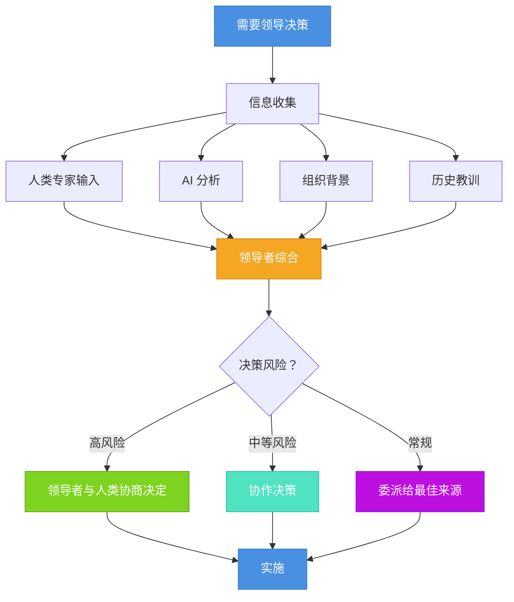

<!-- 
重要：日期一致性检查
- 文件名: 2025-10-09-ai-leadership-from-tool-to-collaborative-partner.mdx
- 前置数据日期: 2025-10-09
- 这些必须完全匹配以确保博客功能正常
- AI代理：编辑时请始终验证日期对齐
-->

第一次当 AI 系统对我的架构决策提出异议并且被证明是对的时，我意识到一些根本性的东西改变了——不是关于 AI，而是关于领导意味着什么。这不是一个关于更好技术的故事；而是关于我作为领导者的角色需要如何演化。使我在领导人类团队时有效的技能并没有突然过时，但当 AI 成为等式的一部分时，它们需要显著的适应。

如果你今天是一位技术领导者，你可能感受到了这种紧张。正如[研究显示](/blog/ai-productivity)，AI 对生产力的影响是真实的但微妙的——它不是自动解决所有问题的灵丹妙药。你知道那些重要的[传统领导技能：技术深度、业务领域知识、人际交往能力和政治导航](/blog/architect-essential-skills)。这些没有消失。但 **AI 引入了一个新维度，在这个维度中，这些技能必须扩展和适应**。你不再只是领导人或指挥工具；你在协调一个混合环境，其中人类判断、传统管理智慧和 AI 能力需要和谐工作。

{/* truncate */}

问题不是"我如何使用 AI 工具？"而是"当我的团队包括人类和 AI 系统时，我的领导技能需要如何演化？"这从根本上说是关于领导适应，而不是技术转型。虽然理解[AI 系统如何工作](/blog/context-engineering)有帮助，但核心挑战是在 AI 系统与你的人类团队成员一起参与的新背景下应用永恒的领导原则。

在本文中，我们将探讨经典领导技能如何在 AI 时代转化和演化。我们将考察什么保持不变，什么需要适应，以及领导者必须发展什么新能力——始终将人类置于中心。无论你是导航组织变革的 CTO、构建凝聚力团队的工程经理，还是弄清楚日常协作模式的技术负责人，理解这种演化将使你在 AI 增强环境中领导人更有效。

让我们从理解传统领导技能如何映射到今天的挑战开始。

## 持久的传统领导技能

在探索什么改变之前，让我们基于什么仍然是必不可少的。无论 AI 如何，几个核心领导能力都是持久的：

**技术深度和广度（Technical Depth and Breadth）**：领导者仍然需要强大的技术基础。你必须足够深入地理解你的领域，以做出明智的决策、评估权衡并赢得团队的尊重。AI 不会取代这一点——如果有的话，它使技术判断更加关键，因为你现在正在评估人类和 AI 的贡献。

**业务领域知识（Business Domain Knowledge）**：理解你的组织做什么、为什么重要以及技术如何服务于业务目标仍然是最重要的。AI 工具不具备这种组织背景；领导者必须提供它。当 AI 系统需要适当的框架时，你在业务需求和技术解决方案之间转换的能力更有价值。

**人际交往能力（Interpersonal Skills）**：领导的人性元素——建立信任、清晰沟通、解决冲突、激励团队——不受 AI 的影响。事实上，它们变得更加重要。当将 AI 引入团队工作流程时，你需要强大的人际交往能力来解决关切、建立信心并保持团队凝聚力。

**政治导航（Political Navigation）**：理解组织动态、管理利益相关者关系和导航竞争利益仍然是必不可少的领导技能。AI 采用通常会产生政治紧张（资源分配、工作安全担忧、权力动态），使这项技能更加关键。

这些传统技能构成了你的基础。但 AI 不仅仅是添加新工具——它创造了一个新的背景，在这个背景中，这些技能必须以不同的方式应用。

## 领导技能必须如何适应

核心领导技能持久存在，但它们在 AI 增强环境中的应用显著演化。让我们考察每个传统能力必须如何适应：

### 技术领导：从纯粹专业知识到能力编排

**传统方法**：技术领导者在特定领域展示深厚的专业知识。你是能够解决最困难问题、审查最复杂代码并做出明确技术决策的专家。你的权威来自于成为房间里最有知识的人。

**AI 时代演化**：技术领导变成关于**编排多样化能力（Orchestrating Diverse Capabilities）**——人类专业知识、AI 分析和混合方法。你不是试图在模式匹配上超越 AI，也不是在系统设计上超越你的高级工程师。相反，你在决定何时利用 AI 的模式识别、何时信任人类直觉以及如何有效地综合两者。

| 方面 | 传统技术领导 | AI 时代技术领导 |
|------|------------|----------------|
| **权威来源** | 最深的技术知识 | 关于能力部署的判断 |
| **决策制定** | 专家做出最终决定 | 适当地编排输入源 |
| **问题解决** | 领导者解决最困难的问题 | 领导者将问题路由到最佳解决者（人类或 AI） |
| **增值** | 技术专业知识 | 多样化输入的整合和综合 |
| **团队动态** | 领导者作为技术权威 | 领导者作为能力协调员 |

这并没有削弱对技术技能的需求——它提升了关于何时以及如何应用它们的判断的重要性。正如在[我对敏捷团队实践的分析](/blog/agile-team-practices)中探讨的，有效的领导一直是关于知道何时介入 vs. 委派。AI 只是扩展了你的委派选项。

### 沟通：从清晰到多受众适应

**传统方法**：有效的领导者与人类清晰沟通——为不同受众（高管 vs. 工程师、技术 vs. 非技术）调整信息、语气和细节。你掌握了向非技术利益相关者解释复杂技术概念的软技能。

**AI 时代演化**：沟通现在需要**多受众适应（Multi-Audience Adaptation）**，其中你的一些"受众"是需要结构化输入的 AI 系统，而大多数仍然是需要同理心和上下文的人类。你向高管解释技术决策，激励你的人类团队，并向 AI 系统提供清晰的参数——所有这些都需要不同的沟通方法。

使你对人类有效的人际交往能力仍然至关重要——也许更是如此。当你的团队对 AI 的角色感到不确定时，你倾听、同理和解决关切的能力变得至关重要。当 AI 提出建议时，你的人类沟通技能帮助团队适当地理解和评估它。

### 决策制定：从权威到综合

**传统方法**：领导者收集输入，应用判断并做出决策。你对结果负责，你的团队指望你提供方向。决策过程相对简单：收集信息、分析选项、决定、沟通。

**AI 时代演化**：决策制定成为跨不同输入类型的**综合练习（Synthesis）**。你仍然负责（这永远不会改变），但现在你在整合：
- 人类专业知识和直觉
- 历史模式和经验教训（人类记忆）
- AI 生成的分析和建议
- 只有人类理解的组织背景
- 利益相关者关切和政治现实

你的领导判断决定在不同背景下更重要地权衡哪些输入。对于具有长期影响的架构决策，组织背景和人类判断可能占主导地位。对于代码风格一致性，AI 模式匹配可能是决定性的。技能在于知道差异。

### 信任建立：从人际到多源校准

**传统方法**：建立信任意味着在人际关系中可靠、透明和有能力。你的团队信任你，因为你展示了一致性，承认错误，并支持他们。信任从根本上是人际的——在你和你的团队成员之间。

**AI 时代演化**：信任建立现在包括**跨不同来源校准信任（Multi-Source Calibration）**。你仍然需要与你的人类团队建立强大的人际信任（这是不可协商的）。但你还需要开发和传达何时信任 AI 建议、何时持怀疑态度以及如何验证的框架。这不是关于像信任一个人那样信任 AI——这是关于在不同背景下拥有明确、明确的可靠性标准。

| 决策类型 | 主要信任来源 | 验证方法 | 推理 |
|----------|------------|---------|------|
| **架构策略（Architectural Strategy）** | 人类专业知识 | AI 寻找盲点 | 需要深度组织背景 |
| **代码质量模式（Code Quality Patterns）** | AI 分析 | 人工审查边缘情况 | AI 擅长一致性检查 |
| **团队动态（Team Dynamics）** | 人类判断 | N/A | 根本上是人类领域 |
| **性能优化（Performance Optimization）** | AI 初始分析 | 人类战略决策 | AI 发现问题，人类优先考虑 |
| **需求解释（Requirements Interpretation）** | 人类理解 | AI 进行完整性检查 | 需要利益相关者同理心 |
| **安全问题（Security Concerns）** | 人类问责 | AI 进行模式检测 | 高风险需要人类所有权 |

你的人际交往能力帮助你的团队导航这种信任校准。当有人质疑 AI 建议时，你的反应塑造了团队文化。你是否压制关切，还是将其用作关于适当信任校准的教学时刻？

## AI 时代的新领导能力

除了适应传统技能外，AI 增强领导需要发展一些真正新的能力——所有这些都专注于在这种新背景下更有效地领导人类：

### 能力模式识别

领导者需要发展关于**何时不同能力（人类或 AI）适合不同问题（Capability Pattern Recognition）** 的直觉。这不是关于技术 AI 知识——这是关于应用于更广泛资源集的领导判断。

- 识别问题何时需要人类同理心、创造力或组织背景
- 确定 AI 模式匹配或分析何时增加价值
- 理解混合方法（人类 + AI）何时优于单独任一方
- 了解你的团队成员相对于 AI 能力的优势

这从根本上说是一种人类领导技能——了解你的人、深入理解问题并做出良好匹配。AI 只是扩展了你正在匹配的能力范围。

### 透明决策框架

在传统领导中，决策过程可以保持某种隐含性——经验丰富的领导者发展了团队成员学会信任的直觉。有了 AI，**明确的决策框架（Transparent Decision Frameworks）** 变得至关重要。

你的团队需要清楚：
- 你何时以及为什么依赖 AI 分析 vs. 人类判断
- 你在各种情况下如何权衡不同的输入
- 在根据 AI 建议采取行动之前你需要什么验证
- 当涉及 AI 时问责如何工作

这种透明度不仅仅是关于 AI——这是关于良好的领导。使你的思维可见有助于你的团队学习、建立信任并创造一致性。这与向非技术利益相关者解释技术决策的原则相同，但现在扩展到向整个团队解释你的决策过程。

### 适应性团队结构

传统团队结构假设相对稳定的角色和职责。AI 引入了**动态能力需求（Adaptive Team Structuring）**，使僵化的结构效果不佳。

有效的领导者不是静态分配（"Alice 拥有前端，Bob 拥有后端，AI 审查 PR"），而是创建流动结构，其中：
- 人类在需要创造力、同理心或深度组织背景的问题上领导
- AI 在模式繁重、一致性焦点的任务上增强人类工作
- 团队协作确定新挑战的最佳方法
- 角色根据问题特征而不仅仅是职位适应

这需要强大的人际交往能力来建立心理安全。团队成员需要感到舒适地说"AI 可能在这部分更好"而不感到被贬低，或"我不信任这个 AI 建议，因为..."而不感到落后。

### 持续学习文化

AI 能力演化的速度意味着**昨天有效的东西今天可能不是最优的（Continuous Learning Culture）**。领导者必须培养文化，其中：
- 团队尝试 AI 辅助并分享学习
- AI 集成的失败被视为学习机会
- 成功模式被记录和传播
- 每个人（包括你）保持学习心态

这不是新的——好的领导者一直培养学习文化。但 AI 使节奏和风险更高。正如在[对 AI 变革潜力的最近分析](/blog/llms-industrial-revolution)中探讨的，我们可能处于一个拐点，AI 可能重塑整个行业。你的人际交往能力和创造心理安全的能力在帮助你的团队导航这种快速变化方面变得更加关键。

## 综合应用：实践中的领导

让我们在一个具体场景中基于这一点。想象你的团队正在讨论新微服务的数据库架构决策：

**传统领导方法**：你会召集你的高级工程师，讨论权衡，也许自己做决定或委派给你的数据库专家，然后传达决定和理由。

**AI 增强领导方法**：
1. **为人类和 AI 构建问题框架**：清楚地阐明业务需求、技术约束和成功标准
2. **利用多样化能力**：
   - AI 分析现有代码库模式并识别一致性问题
   - 高级工程师评估架构影响和维护关切
   - 将实施它的团队成员评估实用可用性
3. **促进综合**：帮助团队理解 AI 发现了什么（以及没有发现什么），整合人类关于组织背景的专业知识，并公开讨论权衡
4. **基于适当权重做出决定**：也许 AI 的一致性分析对某些方面是决定性的，但人类关于团队能力和维护负担的判断主导最终决定
5. **记录推理**：明确说明你重视了哪些输入以及为什么，为未来决策创建学习工件

注意这里重要的是：**你的传统领导技能在整个过程中都是必不可少的**。技术深度让你理解权衡。人际交往能力使有效讨论成为可能。政治意识帮助你考虑组织影响。业务知识适当地构建决策。

AI 不会取代任何这些——它添加了另一个要综合的输入。你的领导判断决定如何有效地整合它，同时将人类置于中心。

## 人类中心保持

尽管所有关于 AI 的讨论，让我们明确：**领导从根本上仍然是关于人的（The Human Center Remains）**。最重要的技能仍然是那些使你对人类有效的技能：

- **建立信任**通过可靠性、透明度和支持你的团队
- **有效沟通**通过适应你的受众并积极倾听
- **做出明智决策**通过理解背景并接受问责
- **导航复杂性**通过技术深度和组织意识
- **培养成长**通过创造学习机会和心理安全

这些没有改变。AI 只是创造了一个新的背景，你在其中应用它们。

你的团队指望你不是成为 AI 专家，而是成为帮助他们在 AI 增强世界中成功的有效领导者。这意味着：
- 保护他们免受 AI 炒作和不切实际期望的影响
- 创造关于角色和职责的清晰度
- 建立导航这一过渡的信心
- 展示他们的人类判断、创造力和专业知识仍然有价值
- 使他们更有效，而不是被取代

最重要的领导技能通常是非技术性的——建立关系、传达愿景和创造人们蓬勃发展的环境的能力。AI 时代领导也是如此：最重要的适应是如何应用你的人类领导技能，而不是变得更技术化关于 AI。

## 实用的下一步

如果你是导航这一过渡的领导者，这里是要关注的地方：

**加强你的基础**：确保你在核心领导技能方面是扎实的——技术深度、业务知识、人际有效性和政治导航。这些在 AI 增强环境中比以往任何时候都更重要。

**建立透明度**：开始使你的决策过程对你的团队更加明确。当你依赖 AI 分析时，解释为什么以及你如何验证它。当你推翻 AI 建议时，分享你的推理。这建立信任并帮助你的团队学习。

**为诚实对话创造空间**：使用你的人际交往能力来促进关于 AI 角色的对话。让团队成员表达关切、兴奋或困惑。你的开放塑造了围绕这一过渡的团队文化。

**从经验中学习**：正如[研究显示](/blog/ai-productivity)，AI 的好处高度依赖于上下文，取决于团队如何将其整合到工作流程中。将 AI 采用构建为团队学习之旅，而不是自上而下的授权。尝试方法、审查结果、调整。你愿意与你的团队一起学习加强信任和心理安全。

**保持人类中心**：提醒自己和你的团队，这是关于使人更有效，而不是取代他们。你的领导应该放大人类能力，而不是削弱人类信心。

在这一过渡中蓬勃发展的领导者不会是关于 AI 最技术化的或最快采用每个新工具的。他们将是那些将永恒的领导技能——技术判断、清晰沟通、信任建立和政治意识——应用于新背景，同时将人类置于他们所做的一切的中心的人。

当我们一起导航这一演化时，记住：**领导仍然是关于人的**。AI 只是构建有效团队、做出明智决策和提供价值的复杂方程式中的另一个变量。你的核心责任没有改变——帮助你的人成功。使你之前有效的技能仍然是你的基础；它们只需要为今天的现实进行深思熟虑的适应。
