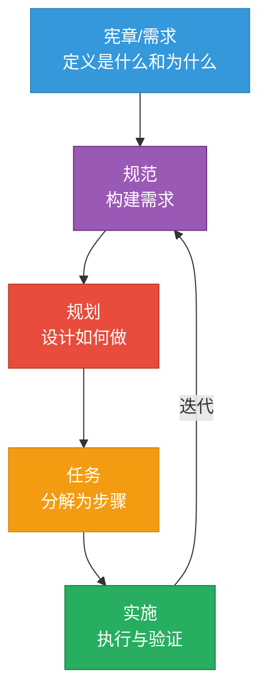
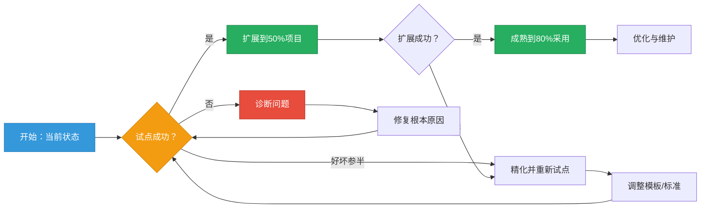

{/* 
重要提示：日期一致性检查
- 文件名：2025-10-22-implementing-spec-driven-development-tools-and-workflows-in-practice.mdx
- 前置元数据日期：2025-10-22
- 这些必须完全匹配以确保博客功能正常
- AI代理：编辑时务必验证日期对齐
*/}

## 引言：AI辅助开发的工业革命

Y Combinator 2025届创业公司中，25%的团队已在交付95%由AI生成的代码库。成功者与陷入技术债务泥潭者的区别在哪？**规范（Specifications）**。所谓"氛围编码"（vibe coding）——即临时性的、基于提示词的AI开发方式——或许能产出令人印象深刻的演示，却在生产规模上分崩离析。上下文丢失、架构漂移、可维护性噩梦，困扰着那些将AI助手当作增强版搜索引擎的团队。

2025年标志着转折点的到来。曾经的实验性工具已成熟为生产就绪的框架，背后既有开源动力，也有企业重金投入。GitHub的[Spec Kit](https://github.com/github/spec-kit)已成为开源SDD采用的事实标准。亚马逊推出[Kiro](https://kiro.dev)，一个将SDD融入核心的IDE。由Snyk创始人创立的Tessl以5亿美元估值融资1.25亿美元，力推"规范即源码"开发模式。业界信号明确：**系统化的规范驱动开发**（Specification-Driven Development，SDD）不再可有可无——它正成为AI增强工程的基本要求。

如果你是一位正在评估如何在不牺牲代码质量的前提下利用AI开发的技术负责人，这份综合指南将为你绘制整个SDD生态图景。你将理解6大工具和框架构成的生态系统，学习来自真实生产部署的行业最佳实践，获得基于团队具体情况选择和实施正确方案的可操作框架。

:::info 相关阅读
关于理论基础和SDD方法论要点，请参阅[规范驱动开发：应对复杂功能的系统化方法](/blog/spec-driven-development)。本文聚焦于工业格局和实践落地。
:::

{/* truncate */}

我们将绘制SDD工具生态图并理解四大解决方案类别，考察生产环境中涌现的最佳实践及真实ROI数据，提供基于团队具体情况选择工具的决策框架，概述实用的分阶段实施策略。读完本文，你将具备带领团队从氛围编码转向系统化、规范驱动AI开发所需的战略理解。

---

## SDD生态全景

理解现代SDD生态，需要超越简单的工具对比。这一格局已成熟为四个截然不同的类别，各自针对不同的团队需求和复杂度水平进行优化。如今已有6大生产就绪的解决方案，选择正确的方法意味着将工具架构与组织的约束和目标相匹配。

### 四大解决方案类别

SDD市场已围绕四种架构模式凝聚，各有独特的权衡：

**工具包（Toolkits）** 与你现有的开发环境集成，在不强制更换工具的前提下添加SDD工作流。[GitHub Spec Kit](https://github.com/github/spec-kit)和[OpenSpec](https://openspec.dev/)领跑这一类别。工具包提供最大的灵活性——你保留首选的IDE、AI助手和开发工具——但需要协调多个组件。最适合对现有工具有强烈偏好或工作流多样化的团队。

**IDE（集成开发环境）** 提供将SDD内置于核心的集成环境。[AWS Kiro](https://kiro.dev)代表这种方法，在统一界面内提供从规范到代码的无缝工作流。集成优势以供应商锁定和灵活性降低为代价。最适合绿地项目或优先考虑流畅体验胜过工具选择的团队。

**平台（Platforms）** 如[Tessl](https://tessl.io/)更进一步，将规范定位为人类编辑的主要（通常是唯一）产物。代码成为生成输出，而非手工实现。这种"规范即源码"模式承诺最大化的可维护性，但需要根本性的工作流变革。最适合规范质量比编码速度更重要的长期项目。

**框架（Frameworks）** 提供用于自定义多智能体工作流的编排系统。[BMAD（敏捷AI驱动开发突破方法，Breakthrough Method for Agile AI-Driven Development）](https://github.com/oimiragieo/BMAD-SPEC-KIT)和[Agent OS (AG2)](https://github.com/ag2ai/ag2)属于这一类别。框架提供终极的定制化——定义你自己的智能体角色、验证关卡和工作流阶段——但要求显著的技术复杂度。最适合需要专业质量关卡或合规要求的复杂项目。

```mermaid
flowchart TD
    subgraph toolkits["工具包（灵活性）"]
        T1["GitHub Spec Kit<br/>OpenSpec"]
        T2["CLI集成"]
        T3["适配现有工具"]
    end
    
    subgraph ides["IDE（集成性）"]
        I1["AWS Kiro"]
        I2["统一环境"]
        I3["无缝工作流"]
    end
    
    subgraph platforms["平台（规范即源码）"]
        P1["Tessl"]
        P2["规范注册中心"]
        P3["AI生成全部代码"]
    end
    
    subgraph frameworks["框架（定制化）"]
        F1["BMAD<br/>AG2"]
        F2["多智能体编排"]
        F3["自定义工作流"]
    end
    
    T1 --> T2
    T2 --> T3
    I1 --> I2
    I2 --> I3
    P1 --> P2
    P2 --> P3
    F1 --> F2
    F2 --> F3
    
    style toolkits fill:#4a90e2,stroke:#2e5c8a,color:#fff
    style ides fill:#9b59b6,stroke:#6c3483,color:#fff
    style platforms fill:#e74c3c,stroke:#c0392b,color:#fff
    style frameworks fill:#27ae60,stroke:#1e8449,color:#fff
```

### 成熟度层级：从规范先行到规范即源码

[马丁·福勒（Martin Fowler）的分析](https://martinfowler.com/articles/exploring-gen-ai/sdd-3-tools.html)识别出SDD采用的三个成熟度层级，形成团队建立信心过程中的自然进阶：

**规范先行（Spec-First）** 开发在编码前编写规范。这种入门级方法保持传统编码实践，同时增加系统化规划。规范指导AI助手和人类开发者，但代码仍是主要产物。大多数团队从这里起步——足够熟悉以便快速采用，足够结构化以改进成果。

**规范锚定（Spec-Anchored）** 开发在整个项目生命周期中将规范与代码一起维护。规范不会在初始实现后被丢弃；它们被版本控制、审查，并随需求演变而更新。这创建了双向可追溯性——规范解释代码存在的原因，代码证明规范可实现。团队通常在经历规范先行项目中规范-代码漂移的痛苦后，升级到这一层级。

**规范即源码（Spec-as-Source）** 开发将规范视为唯一由人类编辑的产物。代码成为机器生成的输出，从不手动修改。这种激进方法承诺最大的可维护性——改变行为意味着更新规范并重新生成代码——但需要对代码生成工具的完全信任。只有具备成熟SDD实践和复杂验证流水线的团队才在这一层级运作。

|类别|示例|架构|成熟度层级|最适合|成本模式|
|---------|----------|-------------|----------------|----------|----------|
|**工具包**|Spec Kit，OpenSpec|CLI + 现有工具|规范先行到规范锚定|多工具团队，灵活工作流|开源/免费|
|**IDE**|Kiro|集成环境|规范先行到规范锚定|绿地项目，统一体验|商业|
|**平台**|Tessl|规范注册中心 + AI生成|规范即源码|长期可维护性焦点|商业（新兴）|
|**框架**|BMAD，AG2|多智能体编排|规范锚定|自定义质量关卡，合规需求|开源/自定义|

### 工具全景概览

让我们简要考察各个解决方案，了解它们的独特优势：

**[GitHub Spec Kit](https://github.com/github/spec-kit)**已成为开源SDD采用的事实标准。这个CLI工具包与13+个AI编码助手（Claude、Copilot、Cursor、Gemini等）集成，生成针对特定智能体的配置文件，将结构化的`/speckit.*`命令注入你的助手词汇表。Spec Kit的供应商中立性——一份规范适用于多个AI助手——使其成为希望获得SDD好处而不被工具锁定的团队的理想选择。

**[OpenSpec](https://openspec.dev/)**提供轻量级、隐私友好的替代方案。这个规范框架使用标准格式（YAML、JSON、结构化Markdown），无需API密钥或外部服务。OpenSpec的简洁性使其成为实验SDD的团队的可及入口，尽管它缺乏更成熟解决方案的复杂智能体编排。

**[AWS Kiro](https://kiro.dev)**将SDD直接集成到IDE环境中。Kiro的四阶段工作流（需求→设计→规划→执行）完全在IDE内运行，消除了规范、AI助手和代码编辑器之间的上下文切换。紧密集成实现了实时规范验证和规范感知代码补全等功能，但使团队承诺于Kiro的环境。

**[Tessl](https://tessl.io/)**由Snyk创始人以1.25亿美元融资支持，开创"规范即源码"愿景。人类在Tessl的规范注册中心编写和维护规范；AI智能体生成、调试和维护所有代码。这种激进方法承诺完全消除手动编码，但需要信任AI拥有完全的实现权限。Tessl在2025年的更广泛发布将检验业界是否准备好迎接规范即源码开发。

**[BMAD（敏捷AI驱动开发突破方法）](https://github.com/oimiragieo/BMAD-SPEC-KIT)**展示了多智能体编排的潜力。BMAD为每个开发阶段部署专业AI智能体——分析师智能体收集需求，PM智能体构建规范，架构师智能体设计系统，开发者智能体编写代码，QA智能体验证输出。这种劳动分工，结合JSON优先的产物和跨智能体一致性检查，产生可衡量的质量改进。BMAD研究显示与临时AI编码相比，完成率快55%——证明复杂编排能带来真实ROI。

**[Agent OS (AG2)](https://github.com/ag2ai/ag2)**，前身为AutoGen，为自定义多智能体实现提供基础。这个Python框架（支持3.10-3.13）使团队能够定义自己的智能体角色、工作流阶段和质量关卡。AG2的三层上下文系统（标准→产品→规范）确保智能体基于全面的项目理解工作。最适合需要针对特定合规要求或技术约束定制SDD工作流的团队。

:::tip 核心洞察
SDD生态已从实验性工具成熟为生产就绪的解决方案。基于你的团队需求选择——而非营销炒作或融资公告。工具包提供灵活性，IDE提供集成性，平台承诺规范即源码的未来，框架实现定制化。不存在普遍的"最佳"；具体情况决定适配度。
:::

尽管工具间架构方法分化，但对相似阶段结构的趋同——宪章/需求→规范→规划→任务→实施——表明业界在SDD方法论上的共识。这种标准化惠及团队：学一次SDD原则，随需求演进应用于多个工具。

理解格局只是第一步。让我们考察团队在生产环境实际使用这些工具时涌现的行业最佳实践。

---

## SDD实施的行业最佳实践

SDD从实验性实践成熟为生产方法论的过程，揭示了区分成功采用与失败实验的模式。这些实践源自真实团队交付生产代码的AI辅助经验——不是理论框架，而是经过实战检验、能带来可衡量结果的方法。

### 核心原则：基础

**规范作为真相之源（Specification as source of truth）** 意味着像对待版本控制的代码一样对待规范。将规范与实现一起存储在Git中，通过拉取请求审查变更，并随需求演变维护它们。这不是会过时的文档——这些是驱动开发的活动产物。当代码和规范分歧时，规范定义应该是什么；实现必须跟上。

**迭代协作规划（Iterative collaborative planning）** 避免瀑布陷阱。SDD规范不是由架构师孤立编写后下发的。产品经理、设计师、工程师和QA都参与规范创建。这种跨职能输入在实施开始前捕获误解。敏捷团队将规范精化整合到冲刺规划中——规范像代码一样迭代演进。

**自动化验证（Automated validation）** 将规范从被动文档转变为主动质量关卡。现代SDD工作流将检查、安全扫描和合规检查直接集成到规范中。如果你的规范引用API端点，验证确认该端点存在。如果它指定身份验证要求，自动检查验证实现是否匹配。这种持续验证立即捕获漂移。

**标准集成（Standards integration）** 将规范建基于行业惯例。为REST API引用OpenAPI，为图端点引用GraphQL模式，为可访问性引用WCAG，为合规引用ISO安全标准。当规范使用标准化格式时，验证变得机械而非解释性。AI助手生成符合标准的代码，因为规范如此要求。

### 工作流模式：通用结构

尽管工具多样，生产SDD实施却趋同于极其相似的阶段结构：

**阶段1：宪章/需求** 在技术决策前建立项目原则和成功标准。适用什么编码标准？需要什么测试覆盖率？必须满足什么性能阈值？这些治理决策早期捕获，指导所有后续阶段。宪章变更需要审慎审查——它们是架构决策，而非实施细节。

**阶段2：规范** 将原始需求转化为AI助手能可靠解释的结构化描述。这一阶段在适当时使用正式规范语言（用于API的OpenAPI，用于数据模型的JSON Schema），其他地方使用结构化自然语言。目标：产生明确的描述，无论哪个AI助手读取都能生成一致的代码。

**阶段3：规划** 将规范转化为技术实施策略。架构决策、技术选择、数据建模、API契约——都在这里涌现。规划阶段利用AI助手的广度："给定这份规范，有哪三种架构方法？"人类判断选择；AI提供基于规范约束的选项。

**阶段4：任务** 将计划分解为离散的、可实施的单元。每个任务直接链接到特定需求和设计决策，创建可追溯性从高层目标到单个代码变更。这种细粒度分解防止范围蔓延：如果任务不能追溯到需求，为什么要构建它？

**阶段5：实施** 在完整上下文中执行任务。AI助手基于规范、计划和任务定义工作——而非孤立的提示词。这种累积的上下文显著改善代码质量。BMAD研究展示与临时提示相比，完成率快55%，正是因为上下文保留消除了因误解需求而产生的返工。

### 质量关卡：系统化验证

生产SDD实施在开发全程嵌入验证，而非仅在最后：

|验证类型|应用时机|检查内容|自动化水平|
|----------------|--------------|----------------|------------------|
|**规范检查**|规范提交时|格式一致性、完整性、内部一致性|完全自动化|
|**需求可追溯性**|规划阶段|每个需求都有实施路径|部分自动化|
|**安全分析**|设计阶段|威胁建模、漏洞模式|AI辅助|
|**合规检查**|任务创建时|监管要求覆盖|依工具而定|
|**实施验证**|代码提交时|代码匹配规范|自动化 + 审查|

这些关卡持续运作。未通过检查的规范不会进入规划。未解决安全需求的设计在创建任务前触发审查。这种快速失败方法防止规范-实施错位积累技术债务。

### 团队协作：共同理解

SDD工作流从根本上改变团队协作方式：

**规范研讨会（Spec workshops）** 用协作式规范创建会议取代冗长的需求文档。产品、设计和工程联合起草规范，通过即时对话解决模糊性。这些会议在它们成为冲突实现前暴露冲突假设。

**规范审查（Spec reviews）** 镜像代码审查。规范变更通过拉取请求工作流，配有自动验证和同行审查。这种对需求的版本控制使演变透明：什么改变了，为什么，以及产生什么实施影响。

**知识共享（Knowledge sharing）** 变得系统化而非临时。规范用作入职文档——新团队成员阅读规范了解正在构建什么以及为什么。与通常晦涩描述"如何做"的代码不同，规范明确捕获意图和约束。

:::warning 常见陷阱
过度规范（Over-specifying）与规范不足一样成问题。从捕获需求和约束的高层规范开始。基于实施反馈迭代精化。指定每个实施细节的规范成为维护噩梦——它们太脆弱，无法随需求变化演进。
:::

行业采用数据验证了这些实践。[红帽（Red Hat）的SDD质量研究](https://developers.redhat.com/articles/2025/10/22/how-spec-driven-development-improves-ai-coding-quality)发现，遵循系统化规范驱动工作流的团队将缺陷密度降低40%，同时将功能交付速度提高30%。纪律比具体工具更重要。

最佳实践建立了基础。现在让我们考察如何为你的具体情况选择正确的工具。

---

## 工具选择框架与比较

在不理解团队约束的情况下选择SDD工具，必然导致次优结果。不存在普遍的"最佳"工具——只有比替代方案更适合特定情况的工具。这个框架帮助你系统化评估选项。

### 决策维度：真正重要的因素

**团队规模和分布（Team size and distribution）** 从根本上塑造工具需求。小型、同地办公的团队可以通过轻量级工具包协调。分布式企业需要内置协作功能的平台。一个5人创业公司选择Tessl的规范即源码平台，与一个500工程师组织标准化GitHub Spec Kit，做出的权衡不同。

**现有工具承诺（Existing tool commitments）** 实际约束选择。对VS Code有重度投资的团队不会轻易转向Kiro的IDE。拥有标准化CI/CD流水线的组织需要能干净集成的工具。诚实评估迁移成本——工具切换有营销材料低估的摩擦。

**复杂度要求（Complexity requirements）** 决定复杂度需求。简单的CRUD应用不会受益于BMAD的多智能体编排。受监管行业有严格合规要求，可能需要AG2的可定制验证关卡。将工具复杂度匹配问题复杂度。

**AI智能体偏好（AI agent preferences）** 对工作流一致性很重要。如果你的团队掌握了Claude Code，Spec Kit的多智能体支持保留了这项投资。如果你在探索多个AI助手，供应商中立性变得有价值。反之，如果Kiro的集成AI足够，多智能体支持就是不必要的开销。

**预算和商业约束（Budget and commercial constraints）** 立即排除某些选项。开源工具包（Spec Kit、OpenSpec、AG2）财务成本为零，但需要设置和维护时间。商业平台（Kiro、Tessl）提供支持和集成，但需要预算批准和供应商关系。

### 类别深入：各自何时出色

**工具包（Spec Kit、OpenSpec）** 在灵活性胜过便利性时出色。多工具团队受益于Spec Kit的供应商中立性——一份规范适用于13+个AI助手。希望最小锁定的团队选择工具包：如果你超越了工具，规范仍然可移植。学习曲线适中：CLI设置、智能体配置、工作流熟悉。最适合重视控制而非便利的团队。

OpenSpec的轻量级方法适合在不承诺复杂工具的情况下实验SDD的团队。标准格式（YAML、JSON）意味着没有专有锁定。简单性伴随限制：没有多智能体编排，最小的自动化验证，基本的工作流支持。OpenSpec是SDD的辅助轮——对学习有价值，随需求成熟而超越。

**IDE（Kiro）** 在集成性比灵活性更重要时闪耀。Kiro的统一环境消除上下文切换：规范、AI辅助和代码编辑器存在于一个界面中。流畅的体验加速入职——新团队成员学一个工具，而非三个。云原生集成适合在AWS基础设施上构建的团队。

集成性伴随承诺。从Kiro切换意味着失去规范-代码链接、实时验证和IDE原生工作流。Kiro规范可导出，但它们的力量源于紧密的IDE耦合。如果你对供应商关系感到舒适，并且重视无缝体验胜过供应商中立性，可评估Kiro。

**平台（Tessl）** 代表规范即源码的未来。Tessl的愿景：规范成为唯一由人类编辑的产物，AI生成所有代码。这种极端主义方法承诺激进的可维护性改进——改变行为意味着更新规范并重新生成代码，从不手动编辑。

这一愿景需要对AI代码生成的信任，而目前很少团队拥有这种信任。Tessl的2025发布将检验生产团队是否接受他们从不手动审查的代码。早期采用者将是前沿组织，对AI对实施决策的权威感到舒适。大多数团队会观望Tessl的成熟再采用。

**框架（BMAD、AG2）** 服务需要定制化的团队。BMAD的多智能体编排配有专业角色（分析师、PM、架构师、开发者、QA），适合劳动分工改善结果的复杂项目。复杂度要求技术投入——配置智能体、定义工作流、维护基础设施。

AG2实现更深层定制：定义你自己的智能体角色、验证关卡和工作流阶段。这种灵活性服务有独特需求的团队——受监管行业有合规关卡，安全关键系统有威胁建模阶段，或拥有专有开发标准的组织。AG2的Python基础适合构建自定义工具感到舒适的团队。

|情境|推荐工具|理由|
|---------|------------------|-----------|
|**创业公司（5-20工程师）**|OpenSpec → Spec Kit|从简单开始，随需求增长升级到复杂度|
|**中型团队（20-100工程师）**|Spec Kit或Kiro|Spec Kit提供灵活性，Kiro提供集成性|
|**企业（100+工程师）**|Spec Kit + BMAD|供应商中立性 + 复杂工作流的复杂度|
|**受监管行业**|BMAD或AG2|合规要求的自定义验证关卡|
|**云原生AWS商店**|Kiro|原生AWS集成，流畅体验|
|**多工具爱好者**|Spec Kit|跨13+个AI智能体的最大供应商中立性|
|**绿地项目**|Kiro或Tessl|没有遗留约束，可采用集成解决方案|

:::tip 选择策略
不要基于融资公告或GitHub星标选择工具。基于以下评估：(1) 它是否与我们现有的工作流集成？(2) 它是否支持我们首选的AI助手？(3) 它是否匹配我们的问题复杂度？(4) 如果我们超越它，我们能否负担迁移成本？
:::

工具选择建立了基础设施。实施决定该基础设施是否交付价值。

---

## 实践实施路线图

成功采用SDD需要分阶段实施，配有可衡量的里程碑。试图一夜之间进行组织范围转型的团队，要么在压力下恢复以前的实践，要么因理解不佳的工作流积累技术债务。这份路线图指导系统化采用。

### 阶段1：基础（第1-2周）

**建立编码标准和惯例。**明确记录现有实践：代码风格、测试期望、安全要求、性能阈值。这些成为你的宪章——指导所有规范的治理层。如果标准不存在，现在创建它们。SDD放大现有实践，无论好坏。

**定义规范模板。**为常见规范类型创建可重用模板：API端点、数据模型、用户工作流、安全要求。模板确保团队成员和项目间的一致性。从简单开始——模板可能只是带示例内容的结构化标题。

**为规范设置版本控制。**将规范存储在与代码相同的仓库中，或在专门的规范仓库中配有清晰的交叉引用。配置你的审查流程：谁批准规范变更？合并前必须通过什么验证？像对待生产代码一样对待规范，因为它们驱动生产代码生成。

**培训团队SDD原则。**举办研讨会解释工作流，展示示例，在玩具问题上练习。每个人都应理解：什么是规范，为什么它们重要，如何编写它们，以及AI助手如何使用它们。目标是80%的理解，而非100%的专业水平——深度通过实践获得。

**阶段1的成功指标：**
- ✓ 标准已记录且可访问
- ✓ 为3+种常见规范类型创建了模板
- ✓ 规范已版本控制并配有审查流程
- ✓ 80%+的团队接受了SDD基础培训

### 阶段2：试点（第3-6周）

**选择1-2个中等复杂度的功能**进行试点实施。避免琐碎功能（不会展示SDD价值）和关键路径功能（实验风险太大）。理想试点：足够重要以至于重要，足够孤立以便安全失败。

**为试点功能实施完整SDD工作流**。按照你的模板编写规范。使用你选择的SDD工具（Spec Kit、Kiro、BMAD等）生成实施产物。让AI助手基于规范工作。衡量一切：规范花费的时间，实施节省的时间，规范验证捕获的缺陷，规范-代码错位需要的返工。

**基于试点反馈迭代。**团队发现他们的规范模板需要精化。验证关卡捕获的问题与预期不同。AI生成的代码质量有差异。这是宝贵的数据——基于真实经验调整模板、标准和期望。

**严格衡量：**
- 从规范完成到工作实现的时间
- 缺陷密度（每个功能的错误）
- 上下文重新解释频率（开发者重新澄清需求的频率）
- 代码质量指标（测试覆盖率、复杂度、安全问题）
- 开发者满意度（主观但重要）

**阶段2的成功指标：**
- ✓ 使用SDD完整实施了2+个功能
- ✓ 收集了与非SDD基线比较的指标
- ✓ 收集并综合了团队反馈
- ✓ 基于学习更新了模板和标准

### 阶段3：扩展（第2-3个月）

**基于试点成功推广到更多功能**。如果指标展示明显改进，积极扩展。如果结果好坏参半，保守扩展同时继续精化实践。如果试点失败，暂停并诊断——强制采用破损工作流会快速积累技术债务。

**与CI/CD流水线集成。**自动化规范验证应在每次提交时运行。规范-代码漂移检测应阻止合并。基于规范覆盖率的质量关卡应强制纪律。这种自动化防止倒退：当流水线强制执行时，团队无法在截止日期压力下绕过SDD。

**建立规范审查流程。**为有效的规范审查创建指南：审查者检查什么，审查多快发生，谁有批准权限。规范审查应感觉像代码审查：协作改进，而非把关。好的规范审查在实施前捕获模糊性和边缘情况。

**构建内部知识库。**记录常见模式、已解决的问题和有效的规范。新团队成员应访问示例库："这是一个好的API规范的样子。这是我们如何处理身份验证需求。这是我们的批处理作业模板。"知识共享复合SDD好处。

**阶段3的成功指标：**
- ✓ 50%+的新功能使用SDD工作流
- ✓ 自动化验证集成在CI/CD中
- ✓ 规范审查SLA已建立并满足
- ✓ 内部文档更新了示例

### 阶段4：成熟（第3-6个月）

**从规范先行转向规范锚定实践。**早期SDD采用聚焦在编码前编写规范。成熟实践在整个项目生命周期维护规范：规范随需求变化演进，规范与实施保持同步，归档规范记录历史决策。这种规范锚定方法提供长期可维护性好处。

**优化智能体配置。**团队积累有效提示AI助手的专业知识。智能体配置得到精化：更好的上下文提供，更清晰的约束规范，更有效的验证指令。这种优化复合：更好的配置生成更好的代码，减少手动返工。

**建立合规集成**（如相关）。受监管行业将合规检查点直接集成到SDD工作流中：规范必须引用监管要求，验证确认合规覆盖，审计轨迹追踪决策。这种集成使合规系统化而非临时。

**为合适的项目考虑规范即源码。**经过几个月的规范锚定实践后，评估规范即源码是否对特定项目有意义。长期存在的系统，有稳定需求和频繁小变更，受益最大。需求易变的实验项目受益最少。基于展示的适用性选择性采用。

**阶段4的成功指标：**
- ✓ 80%+的项目使用规范锚定实践
- ✓ 智能体配置基于数据优化
- ✓ 合规集成完成（如适用）
- ✓ 规范即源码试点启动（如合适）

### 常见陷阱和解决方案

**陷阱1：过度规范。**问题：团队编写需要数周创建并立即过时的50页规范。解决方案：从捕获需求和约束的高层规范开始。基于实施反馈迭代精化。规范应指导，而非规定每个实施细节。

**陷阱2：规范-代码漂移。**问题：随着实施演变而不更新规范，规范和代码随时间分歧。解决方案：CI/CD中的自动化漂移检测。当代码偏离规范时阻止合并。使规范更新成为每个功能完成定义的一部分。

**陷阱3：利益相关者支持不足。**问题：团队在截止日期压力下恢复临时编码，因为管理层不重视SDD。解决方案：用试点指标展示ROI。显示减少的返工、更快的实施、更低的缺陷率。可量化的改进比方法论论证更能说服怀疑者。

**陷阱4：规范质量差。**问题：模糊的规范导致AI生成的代码质量差，造成挫折和放弃。解决方案：培训、模板和审查流程。好的规范是通过实践和反馈学习的技能。投资于发展该技能。

**陷阱5：工具过度工程。**问题：为简单CRUD应用采用BMAD的多智能体复杂度，造成不必要的开销。解决方案：将工具复杂度匹配问题复杂度。从更简单的工具开始（OpenSpec、Spec Kit），只有当复杂度要求时才升级到框架（BMAD、AG2）。

实施是迭代的，而非线性的。预期挫折，收集数据，基于证据调整实践。成功的SDD采用需要3-6个月的纪律实践，然后才能成为自然工作流。

生态已就绪。实践已证明。路线图已清晰。未来会怎样？

---

## 结论：战略必然性

SDD生态已从2023年的实验性工具演进为2025年的生产就绪解决方案。有6大工具跨越4种架构类别，团队现在基于情境和约束选择——不是因为选项不存在，而是因为多种可行选项服务不同需求。

### 关键战略要点

**生态已根本成熟。**始于GitHub的Spec Kit和亚马逊的Kiro的格局，已扩展到包括轻量级框架（OpenSpec）、下一代平台（Tessl的1.25亿美元愿景）和复杂的多智能体编排器（BMAD、AG2）。这种多样性表明市场成熟：工具专注于不同情境，而非竞争成为普适解决方案。

**最佳实践已用数据证明。**BMAD的55%更快完成率不是营销声称——它们是生产部署的衡量改进。红帽的40%缺陷密度降低展示质量改进。Y Combinator 2025届25%的团队交付95% AI生成的代码库显示主流采用。系统化实施时，方法论有效。

**选择根本上依赖情境。**创业公司的选择不同于企业。受监管行业需要休闲开发者不需要的合规关卡。标准化在Claude Code上的团队对供应商中立性的重视，不同于对集成解决方案感到舒适的团队。不存在普遍的"最佳"——只有更适合特定情境的工具。

**采用必须分阶段和衡量。**强制一夜之间SDD采用的组织，要么在压力下恢复，要么积累技术债务。成功采用遵循模式：用可衡量指标试点，基于数据扩展，几个月成熟实践，持续优化。3-6个月的时间线不可协商——建立能力需要时间。

**规范成为战略资产。**在成熟的SDD组织中，规范不是会过时的文档——它们是版本控制的、持续精化的、保留组织知识的战略产物。当工程师离开时，规范留下。当需求演变时，规范适应。这种组织记忆在多年内复合价值。

### 未来展望：行业走向何方

**规范注册中心作为共享知识库涌现。**Tessl的规范注册中心模式——最佳实践规范的集中仓库——很可能成为标准。组织将共享常见模式的规范：身份验证流程、支付处理、数据同步。当经过实战检验的模板存在时，为什么从头编写规范？

**更多IDE集成原生SDD支持。**Kiro不会是唯一内置规范驱动工作流的IDE。VS Code、Cursor和其他流行编辑器将添加原生SDD功能。集成竞赛已开始——供应商认识到规范正成为主要开发产物。

**企业合规驱动采用。**受监管行业（金融、医疗、国防）面临展示开发流程严格性的增加压力。SDD提供可审计轨迹：指定了什么，何时改变，为什么实施匹配需求。这种可审计性将驱动企业采用，无论AI好处如何。

**规范即源码选择性获得牵引力。**Tessl的激进愿景——人类只编辑规范，AI生成所有代码——不会很快普遍化。但对于特定情境（长期存在的系统、稳定需求、频繁小变更），规范即源码将被证明具有吸引力。预期从合适用例开始的渐进采用，而非全面转型。

**行业在标准格式上趋同。**`/speckit.*`命令模式作为事实标准的出现展示了趋同。预期围绕规范格式、验证协议和工作流阶段的类似标准化。标准化实现工具互操作性和跨组织的知识转移。

### 你的下一步

如果你准备在组织中实施SDD：

1. **诚实评估你的情境。**使用本文的决策框架。你当前使用什么工具？你的开发者偏好什么AI助手？你的问题复杂度如何？你的新工具预算是多少？情境决定工具适配。

2. **全面审查生态。**探索2-3个匹配你约束的工具。阅读官方文档，尝试演示项目，基于你的具体工作流评估——而非通用比较。

3. **从试点开始。**选择1-2个中等复杂度的功能。使用完整SDD工作流实施。衡量一切：时间、质量、缺陷、开发者满意度。收集数据，而非意见。

4. **扩展前严格衡量。**如果试点指标展示明显改进，自信扩展。如果结果好坏参半，在扩大规模前迭代实践。如果试点失败，诊断问题而非强制采用。

5. **基于数据系统化扩展。**在证明试点成功后扩展到更多功能和团队。集成到CI/CD。建立审查流程。构建知识库。使SDD系统化，而非可选。

6. **回馈社区。**随着你建立专业知识，分享学习。贡献开源工具。写下你的经验。SDD生态受益于共享知识——你的洞察帮助其他人避免你的错误。

**根本转变：**SDD代表的不仅仅是新工具——它是对我们如何思考AI辅助开发的重新构想。规范成为人类意图和机器实现之间的接口。掌握这种转变的团队不仅会编写更好的代码；他们会更清晰地思考正在构建什么以及为什么。

随着行业从实验性AI编码转向生产级自动化，SDD提供必要的结构和纪律。工具已就绪。实践已证明。数据展示价值。问题不是是否采用SDD，而是哪种方法适合你团队向系统化、AI增强开发的旅程。

AI辅助开发的工业革命不是即将到来——它已经在这里。成功团队与挣扎团队的区别不在于他们是否使用AI助手，而在于他们是否系统化使用它们。规范就是系统。选择你的工具，实施实践，衡量结果。开发的未来是规范驱动的。
