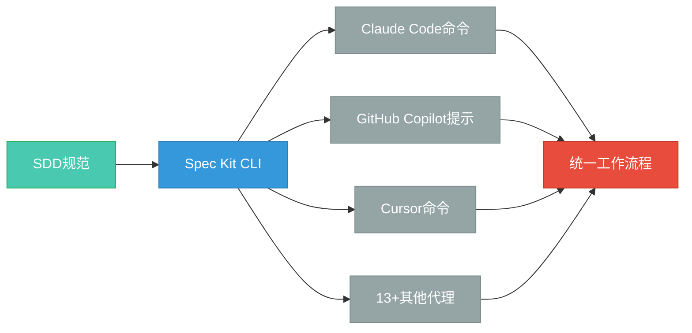
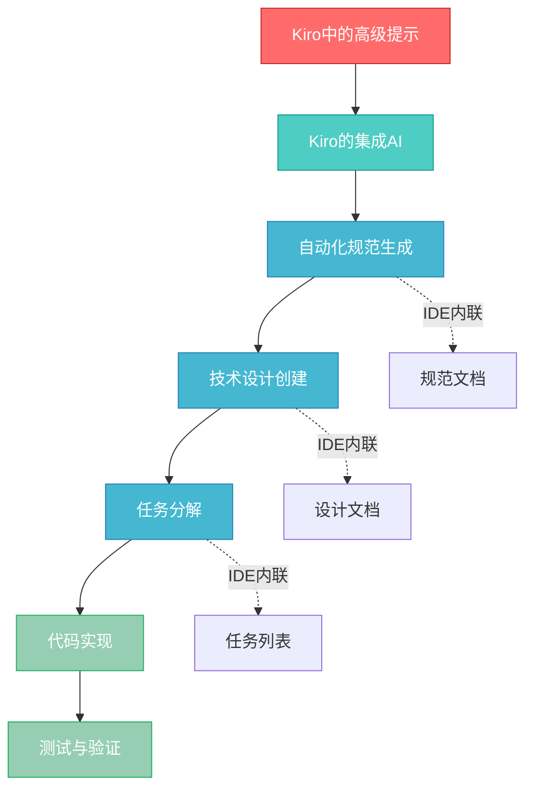

{/* 
重要：日期一致性检查
- 文件名: 2025-10-22-implementing-spec-driven-development-tools-and-workflows-in-practice.mdx
- 前置数据日期: 2025-10-22
- 这些必须完全匹配以确保博客功能正常
- AI代理：编辑时请始终验证日期对齐
*/}

## 引言：从理论到实践

本周第五次花费三个小时向AI助手解释项目架构后，你意识到必须有更好的方法。AI辅助开发的前景确实令人振奋——直到你发现自己不断重复解释上下文，澄清昨天还显而易见的需求，看着AI助手生成解决错误问题的代码，只因为它漏掉了你两次对话前提到的关键约束。

这种挫败感并非你独有。它是 ** "氛围编码（Vibe Coding）" ** 的必然结果——这种即兴的、基于提示词的方法是AI编码助手刚出现时自然形成的。我们把这些强大的工具当作增强版搜索引擎，向它们抛出越来越复杂的提示词，期待有用的输出。有时效果出奇地好，但往往事与愿违。

2025年标志着我们与AI开发工具协作方式的转折点。[GitHub发布了Spec Kit](https://github.com/github/spec-kit)，一个用于 ** 规范驱动开发（Spec-Driven Development，SDD）** 的开源工具包。亚马逊推出了[Kiro](https://kiro.dev)，一个将SDD直接构建在核心的IDE。这些不是渐进式改进——它们代表着业界共识：结构化规范能显著改善AI辅助开发的成果。

如果你已经了解了规范驱动开发，但想知道如何在项目中实际实施它，本文正适合你。你将学习如何使用真实工具建立SDD工作流程，理解GitHub Spec Kit的工具包方法与Kiro集成IDE之间的权衡，并建立一个为团队选择合适方法的框架。

:::info 相关阅读
关于理论基础和SDD方法论细节，请参阅我之前的分析：[规范驱动开发：复杂功能的系统化方法](/blog/spec-driven-development)。本文聚焦于实际实施。
:::

{/* truncate */}

我们将探索SDD工具生态并理解这些工具的实际作用，详细介绍GitHub Spec Kit从安装到首次规范创建的实践过程，审视Kiro的IDE原生方法及其差异，并提供在工具包和集成方法之间选择的决策框架。读完后，你将掌握在自己项目中实施SDD的实用知识。

---

## SDD工具全景

要理解SDD工具的实际作用，需要透过营销语言看本质。这些不仅仅是"提示词更好的AI助手"——它们是系统性框架，彻底改变了规范与实现之间的关系。

### SDD工具的真正作用

传统开发工作流程将规范视为脚手架——你编写需求文档，然后在编码时将其搁置一旁。SDD颠覆了这种关系。像[GitHub Spec Kit](https://github.com/github/spec-kit)和[Kiro](https://kiro.dev)这样的工具让规范变得 ** "可执行" **：结构化文档能直接生成实施计划、任务分解，甚至引导AI助手系统地完成开发阶段。

核心洞察在于，** "可执行规范" ** 不是代码——它们是AI工具能可靠解释和执行的结构化描述。与其用"构建任务管理系统"这样的提示词期待连贯的输出，不如按照标准化格式创建规范。然后SDD工具协调你的AI助手系统地完成工作流程：建立项目原则，定义需求，创建技术设计，生成任务列表，最终实现代码。

这种结构化方法解决了即兴AI编码的根本问题：上下文丢失。当每个提示词都从零开始时，你的AI助手缺乏对项目约束、架构决策和需求的累积理解。SDD工具通过持久的规范文档维护这些上下文，每个开发阶段都会引用这些文档。

### 两种方法：工具包 vs IDE

SDD生态系统围绕两种截然不同的实现模式聚合，各有明确的权衡：

**工具包方法（GitHub Spec Kit）**：一个外部CLI工具，与你现有的开发环境和AI编码助手协同工作。你安装Spec Kit，它为你选择的AI代理（Claude Code、GitHub Copilot、Cursor等）生成配置文件和命令，然后你在正常的IDE中工作，而AI助手遵循结构化的SDD工作流程。

**IDE方法（Kiro）**：一个专门的开发环境，将SDD直接构建在核心中。你完全在Kiro的界面内工作，它在统一的工作流程中集成了规范创建、AI辅助规划和代码实现。

根本权衡是灵活性与集成度。Spec Kit的工具包方法意味着你可以独立选择AI助手、IDE和开发工具。Kiro的集成方法意味着一切无缝协作，但你承诺使用Kiro的环境。


| 特性 | GitHub Spec Kit | Kiro | 说明 |
|------|----------------|------|------|
| **架构** | 外部CLI工具包 | 集成IDE | Spec Kit添加到现有工具；Kiro替代它们 |
| **AI代理支持** | 13+代理（Claude、Copilot、Cursor、Gemini等） | 仅内置AI | Spec Kit提供供应商中立性 |
| **IDE灵活性** | 使用任何IDE（VS Code、Cursor等） | 仅Kiro IDE | 工具包方法保留现有工作流程 |
| **设置复杂度** | 中等（CLI + AI代理 + IDE） | 低（单次安装） | 集成带来便利 |
| **最适合** | 工具偏好多样的团队 | 想要统一体验的团队 | 依赖上下文的选择 |

### 通用工作流程模式

尽管架构不同，两种工具都遵循极其相似的阶段结构——这是业界对SDD方法论达成共识的证据：

**阶段1：章程（Constitution）** - 在编写代码之前建立项目原则。这不是样板文件——你定义项目的治理原则，涵盖代码质量、测试标准、用户体验和性能要求。** "章程优先开发（Constitution-first Development）" ** 确保整个实施阶段的决策一致性。

**阶段2：规范（Specify）** - 描述你想构建什么，关注"是什么"和"为什么"，而非技术实现。这会生成结构化的需求和用户故事。

**阶段3：计划（Plan）** - 定义"如何实现"：技术选择、系统架构、数据模型和集成模式。规范上下文确保架构决策与需求保持一致。

**阶段4：任务（Tasks）** - 将计划分解为离散的、可实施的任务。每个任务引用具体的需求和设计决策，创建可追溯性。

**阶段5：实施（Implement）** - 系统地执行任务。AI助手基于结构化上下文工作，而非临时提示词，显著提高输出质量。

这种标准化至关重要。Spec Kit推广的`/speckit.*`命令模式正在成为行业标准，多个AI编码助手采用类似惯例。当SDD工具使用一致的工作流程时，开发者能更轻松地在工具和项目之间转移知识。

:::tip 核心洞察
SDD工具不是要取代开发者的判断——它们是在开发阶段之间保存上下文。结构化方法确保你的AI助手拥有生成相关、符合上下文的代码所需的累积理解。
:::

Spec Kit和Kiro之间的选择取决于你团队的上下文：现有工具承诺、工作流程偏好和集成需求。没有普遍"更好"的选择——它们针对不同场景进行了优化。让我们从GitHub Spec Kit开始，这是与你现有开发环境协同工作的开源工具包方法。

---

## GitHub Spec Kit：工具包方法

GitHub Spec Kit将SDD引入你现有的开发工作流程，无需放弃熟悉的工具。它是一个CLI工具包，为你选择的AI编码助手生成配置文件和命令，然后通过标准化阶段协调结构化工作流程。

### 安装和设置

Spec Kit需要[uv](https://docs.astral.sh/uv/)，一个现代Python包管理器，用于处理安装和更新。安装过程很直接：

```bash
# 全局安装Spec Kit
uv tool install specify-cli --from git+https://github.com/github/spec-kit.git

# 初始化新项目
specify init my-project --ai claude

# 或在当前目录初始化
specify init . --ai copilot
```

`--ai`参数选择你的AI编码助手。Spec Kit生成代理特定的配置文件，将SDD命令集成到助手的工作流程中。这个设计选择——生成代理特定文件而不是运行持久服务——意味着Spec Kit对你的开发环境零运行时开销。

初始化后，你的项目包含一个`.specify`目录，其中有模板、脚本和代理配置。具体结构取决于你选择的AI代理，但核心概念保持一致：Spec Kit已将结构化的SDD工作流程注入到你助手的能力中。

### 多代理架构

Spec Kit的一个显著优势是 ** 多代理兼容性（Multi-agent Compatibility）**。相同的规范可以与不同的AI助手配合使用，因为Spec Kit生成映射到通用底层工作流程的代理特定命令文件。



这种供应商中立性对使用多个AI助手或希望避免锁定的团队很重要。你的规范保持可移植——从Claude切换到Copilot只需重新生成配置文件，而不是重写规范。

| AI代理 | 支持级别 | 需要安装 | 说明 |
|--------|---------|---------|------|
| [Claude Code](https://www.anthropic.com/claude-code) | ✅ 完全 | 是（CLI） | 原始开发目标 |
| [GitHub Copilot](https://code.visualstudio.com/) | ✅ 完全 | 否（基于IDE） | 在VS Code中工作 |
| Cursor | ✅ 完全 | 是（CLI） | 需要`cursor-agent` CLI |
| Gemini CLI | ✅ 完全 | 是（CLI） | Google的AI助手 |
| Windsurf | ✅ 完全 | 否（基于IDE） | IDE集成代理 |
| Qwen Code | ✅ 完全 | 是（CLI） | 阿里巴巴的产品 |
| Amazon Q Developer | ⚠️ 部分 | 是（CLI） | 参数支持有限 |
| 6+其他代理 | ✅ 完全 | 不等 | 完整列表请参见官方文档 |

### 命令集

Spec Kit将`/speckit.*`命令注入你的AI助手词汇表。这些不是魔法——它们是引导助手完成特定SDD阶段的结构化提示词：

| 命令 | 目的 | 输出 | 使用时机 |
|------|------|------|---------|
| `/speckit.constitution` | 定义项目原则和治理 | 包含项目指南的`constitution.md` | 任何新项目的第一步 |
| `/speckit.specify` | 创建功能规范 | 包含需求和用户故事的`spec.md` | 章程建立后 |
| `/speckit.clarify` | 识别规范不足的领域 | 添加到`spec.md` | 创建技术计划之前 |
| `/speckit.plan` | 生成技术实施计划 | `plan.md`、`data-model.md`、API规范 | 规范清晰后 |
| `/speckit.tasks` | 将计划分解为可操作任务 | 有序任务列表`tasks.md` | 计划验证后 |
| `/speckit.implement` | 系统地执行任务列表 | 工作代码实现 | 最终实施阶段 |

** 阶段分离（Phase Separation）** 设计是有意为之。每个命令建立在前面的阶段之上，在防止范围蔓延的同时保持上下文。你不能意外跳过规范阶段直接实施——命令强制执行工作流程规范。

### 简单演练

让我们演练为一个简单功能创建规范。在安装Spec Kit并初始化项目后，你会这样与AI助手互动：

```text
/speckit.constitution 创建关注代码质量、测试标准和可维护性的原则。
强调简单胜过聪明的解决方案。
```

你的AI助手生成一个结构化原则的`constitution.md`文件：

```markdown
# 项目章程

## 代码质量
- 优先考虑可读性而非简洁性
- 每个函数有单一、明确的目的
- 复杂逻辑需要解释性注释

## 测试标准
- 所有业务逻辑都有单元测试
- API端点有集成测试
- 最低80%代码覆盖率

[... 其他原则 ...]
```

接下来，你创建规范：

```text
/speckit.specify 构建一个支持电子邮件和应用内通知的用户通知系统。
用户可以设置通知类型和频率的偏好。
```

AI助手生成结构化的规范，包含需求、用户故事和验收标准。这个规范成为你正在构建内容的权威描述——后续阶段引用它，而不是要求你重新解释需求。

技术计划阶段引入你的技术选择：

```text
/speckit.plan 后端使用Node.js和Express，持久化使用PostgreSQL，
电子邮件传递使用SendGrid。
```

这会生成详细的技术文档：数据模型、API契约和实施策略。AI助手现在可以在需求（来自specify）和原则（来自constitution）的上下文中推理架构决策。

:::note 关键洞察
Spec Kit的力量来自累积的上下文。每个阶段添加的结构都被后续阶段利用。你的AI助手不是基于孤立的提示词工作——而是基于规范文档中保存的对项目的全面理解。
:::

Spec Kit是一个协调你选择的AI助手的CLI，生成指导实施的结构化工件。工具包方法在添加系统化规范管理的同时，保留了你现有的开发工作流程。当Spec Kit将SDD引入现有工具时，Kiro采取了不同的方法，将SDD直接集成到IDE中。

---

## Kiro：集成IDE方法

由亚马逊开发的[Kiro](https://kiro.dev)代表了根本不同的SDD实现：一个将规范驱动开发构建在核心而非叠加在上层的IDE。Spec Kit问"如何将SDD添加到现有工具？"，Kiro问"从头设计的SDD IDE应该是什么样？"

### Kiro的集成工作流程

集成优势立即显现。在Spec Kit中，你在多个上下文中工作：编码用IDE，Spec Kit命令用终端，结构化提示用AI助手界面。Kiro将这些整合到统一环境中，规范、AI辅助和代码实现在同一界面中进行。

当你打开Kiro时，你不只是启动编辑器——你进入的是 ** IDE原生SDD（IDE-native SDD）** 环境。创建规范不需要外部CLI工具或配置AI助手集成。工作流程嵌入在IDE本身中，这意味着Kiro可以提供外部工具无法提供的上下文辅助：内联规范引用、实时验证和SDD阶段之间的无缝过渡。



这种紧密集成实现了工具包方法难以做到的功能。Kiro可以跟踪哪些规范关联哪些代码文件，根据需求突出显示不完整的实现，并提供规范感知的代码补全。IDE不仅理解你的代码，还理解代码实现的规范。

### 自然语言规范

Kiro的规范创建深度依赖自然语言。你以对话方式描述想构建什么，Kiro的集成AI将描述转换为结构化需求。IDE界面提供即时反馈——你看到规范在描述时成形，AI建议澄清或识别实时的模糊之处。

这种交互式细化过程在集成环境中更流畅。Spec Kit需要你在单独文件中查看生成的规范，而Kiro以交互式元素内联呈现它们。你可以点击展开需求、添加澄清或标记部分供AI审查——所有这些都无需离开规范视图。

AI助手不是用命令调用的独立工具——它是IDE中理解整个项目上下文的持久存在。当你请求设计建议或实施方法时，AI会自动引用你的规范。没有上下文切换成本。

### 自动化设计生成

Kiro的技术设计阶段展示了深度IDE集成的好处。基于你的规范，Kiro生成全面的技术设计：数据流图、API定义、数据库模式和架构决策。这些不是静态文档——它们是交互式IDE工件。

点击设计视图中的数据库表，Kiro会显示需要该表的规范。选择API端点，Kiro会突出显示它满足的用户故事。当一切都存在于统一环境中时，这种从需求到设计再到实现的双向可追溯性要容易得多。

IDE还可以自动验证设计与规范的对应。如果你的技术设计没有解决某个需求，Kiro会标记它。如果规范变更会影响现有设计，Kiro会识别受影响的区域。这种持续验证有助于防止困扰许多项目的规范-实现偏差。

### 何时选择Kiro

Kiro的集成方法在特定场景中提供明显优势：

**绿地项目（Greenfield Projects）**：从头开始且没有现有工具承诺时，Kiro的统一环境消除了集成复杂性。你不需要管理Spec Kit配置、AI助手设置和IDE扩展——安装Kiro即可开始。

**团队标准化**：希望跨团队保持一致开发环境的组织受益于Kiro的一体化方法。每个人使用相同的IDE和相同的SDD工作流程，消除了跨工具配置的"在我机器上能用"问题。

**规范密集型领域**：需求复杂的项目——带合规需求的企业软件、带文档要求的受监管行业——受益于Kiro规范与代码之间的紧密耦合。随着规范复杂性增长，可追溯性和验证功能变得越来越有价值。

然而，集成方法有权衡：

:::warning 关键权衡
**供应商锁定（Vendor Lock-in）**：Kiro的规范虽可导出，但在Kiro内效果最好。迁移到另一个IDE意味着失去规范-代码集成功能。

**工具承诺（Tool Commitment）**：使用Kiro的团队必须采用整个IDE。你不能让某些开发者使用VS Code，某些使用Kiro，而不失去工作流程一致性。

**牺牲灵活性（Flexibility Sacrifice）**：流畅体验来自Kiro关于工作流程和AI集成的固执己见。想要不同AI助手或自定义SDD阶段的团队选择有限。
:::

| 因素 | 倾向Spec Kit | 倾向Kiro |
|------|-------------|----------|
| **现有工具投入** | 强IDE/AI偏好 | 开放尝试新工具 |
| **团队工具多样性** | 多样偏好 | 期望标准化 |
| **AI助手选择** | 供应商中立性重要 | 集成AI足够 |
| **SDD定制** | 需要自定义工作流程 | 标准工作流程可接受 |
| **项目复杂度** | 简单到中等 | 高规范复杂度 |

Kiro为适应集成工具的团队提供流畅体验，而Spec Kit为多工具工作流程提供灵活性。** "单一供应商vs多代理" ** 权衡是根本性的：Kiro优化凝聚力，Spec Kit优化选择。

两种工具都遵循相似的SDD阶段结构，表明即使实现方法分化，业界对方法论已达成共识。你的选择更多取决于哪种权衡与团队上下文、现有投入和工作流程偏好相符，而不是哪个工具"更好"。

---

## 选择你的SDD方法

在项目中实施规范驱动开发不需要完美的工具选择——需要理解哪些权衡对你的特定上下文重要。GitHub Spec Kit和Kiro都支持系统化的规范驱动工作流程，但它们针对不同场景进行了优化。

### 核心要点

**规范在适当结构化时变得可执行**。SDD工具将需求文档从被动工件转变为开发工作流程的主动驱动器。你的AI助手基于累积的项目上下文工作，而非孤立的提示词，显著提高输出相关性并减少上下文重复解释的开销。

**存在两种有效的SDD实施方法**。工具包方法（Spec Kit）将结构化工作流程添加到现有开发环境中，保留工具灵活性和供应商中立性。IDE方法（Kiro）将SDD深度集成到统一环境中，以工具锁定为代价提供流畅体验。

**多代理兼容性的重要性因上下文而异**。承诺使用特定AI助手或想要供应商中立性的团队受益于Spec Kit对13+代理的支持。优先考虑集成流畅性而非助手选择的团队发现Kiro的统一方法足够。

**从小处开始，系统性扩展**。不要试图立即在整个组织实施SDD。从单个容易出现范围蔓延或上下文丢失的中等复杂功能开始。评估结构化规范是否改善了开发体验，然后随着好处变得明显扩展到更多项目。

### 未来展望

`/speckit.*`命令模式正在成为行业标准，多个AI编码助手采用类似惯例。这种趋同表明SDD方法论已达到成熟点，实施模式正在稳定而非分化。期待更多IDE采用Kiro模型的原生SDD支持，而Spec Kit等工具包方法继续服务具有多样化工具生态系统的团队。

企业采用将推动工具持续成熟。组织需要可审计的开发过程、规范可追溯性和跨分布式团队的一致工作流程——SDD自然解决的需求。随着企业用例扩展，工具可能会添加围绕合规文档、需求验证和团队协作的功能。

### 后续步骤

如果你准备实施SDD：

1. **复习方法论**：如果尚未阅读，请阅读[SDD基础文章](/blog/spec-driven-development)以理解结构化规范的理论基础。

2. **评估你的上下文**：考虑团队现有的工具承诺、AI助手偏好和工作流程灵活性需求。使用本文中的对比表评估工具包或IDE方法是否更适合你的情况。

3. **从试点项目开始**：选择一个中等复杂度的功能——足够重要能从结构化规范中受益，但又不至于复杂到工具学习曲线超过好处。

4. **测量和迭代**：跟踪诸如上下文重复解释频率、AI生成代码相关性、从规范到工作实现的时间等指标。这些具体测量有助于评估SDD是否为你的特定开发模式带来价值。

5. **系统性扩展**：随着对SDD工作流程的信心增强，扩展到更多项目和团队成员。随着更多开发遵循结构化规范模式，好处会复合。

像任何方法论一样，SDD的价值随时间复合。创建结构化规范的前期投入通过减少上下文丢失、提高AI辅助质量和更清晰的需求可追溯性，在项目生命周期中带来回报。本文涵盖的工具——GitHub Spec Kit和Kiro——提供了使规范驱动开发在现代AI辅助开发工作流程中实用且可持续的基础设施。