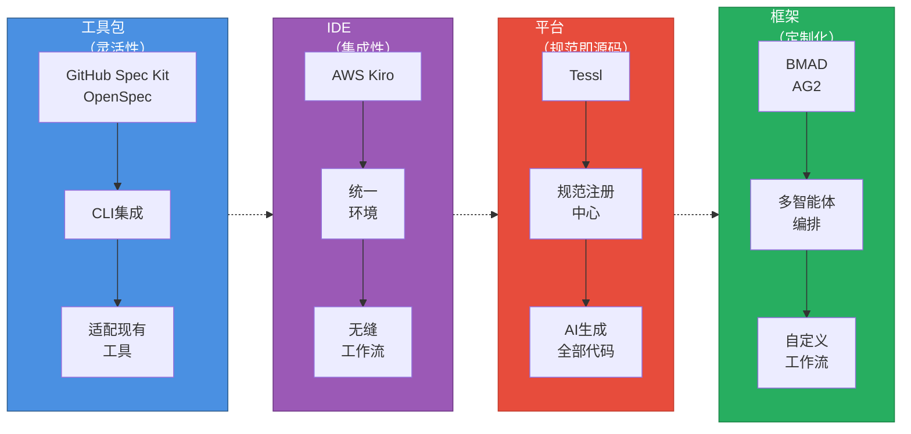
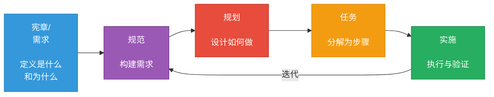
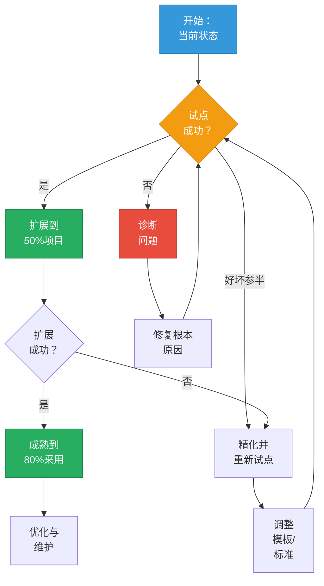

{/* 
重要提示：日期一致性检查
- 文件名：2025-10-22-implementing-spec-driven-development-tools-and-workflows-in-practice.mdx
- 前置元数据日期：2025-10-22
- 这些必须完全匹配以确保博客功能正常
- AI代理：编辑时务必验证日期对齐
*/}

## 引言：AI辅助开发的工业革命

Y Combinator 2025届创业公司中，25%的团队已在交付95%由AI生成的代码库。成功者与陷入技术债务泥潭者的区别在哪？**规范（Specifications）**。所谓"氛围编码"（vibe coding）——即临时性的、基于提示词的AI开发方式——或许能产出令人印象深刻的演示，却在生产规模上分崩离析。上下文丢失、架构漂移、可维护性噩梦，困扰着那些将AI助手当作增强版搜索引擎的团队。

2025年标志着转折点的到来。曾经的实验性工具已成熟为生产就绪的框架，背后既有开源动力，也有企业重金投入。GitHub的[Spec Kit](https://github.com/github/spec-kit)已成为开源SDD采用的事实标准。亚马逊推出[Kiro](https://kiro.dev)，一个将SDD融入核心的IDE。由Snyk创始人创立的Tessl以5亿美元估值融资1.25亿美元，力推"规范即源码"开发模式。业界信号明确：**系统化的规范驱动开发**（Specification-Driven Development，SDD）不再可有可无——它正成为AI增强工程的基本要求。

如果你是一位正在评估如何在不牺牲代码质量的前提下利用AI开发的技术负责人，这份综合指南将为你绘制整个SDD生态图景。你将理解6大工具和框架构成的生态系统，学习来自真实生产部署的行业最佳实践，获得基于团队具体情况选择和实施正确方案的可操作框架。

:::info 相关阅读
关于理论基础和SDD方法论要点，请参阅[规范驱动开发：应对复杂功能的系统化方法](/blog/spec-driven-development)。本文聚焦于工业格局和实践落地。
:::

{/* truncate */}

我们将绘制SDD工具生态图并理解四大解决方案类别，考察生产环境中涌现的最佳实践及真实ROI数据，提供基于团队具体情况选择工具的决策框架，概述实用的分阶段实施策略。读完本文，你将具备带领团队从氛围编码转向系统化、规范驱动AI开发所需的战略理解。

---

## SDD生态全景

理解现代SDD生态，需要超越简单的工具对比。这一格局已成熟为四个截然不同的类别，各自针对不同的团队需求和复杂度水平进行优化。如今已有6大生产就绪的解决方案，选择正确的方法意味着将工具架构与组织的约束和目标相匹配。

### 四大解决方案类别

SDD市场已围绕四种架构模式凝聚，各有独特的权衡：

**工具包（Toolkits）** 与你现有的开发环境集成，在不强制更换工具的前提下添加SDD工作流。[GitHub Spec Kit](https://github.com/github/spec-kit)和[OpenSpec](https://openspec.dev/)领跑这一类别。工具包提供最大的灵活性——你保留首选的IDE、AI助手和开发工具——但需要协调多个组件。最适合对现有工具有强烈偏好或工作流多样化的团队。

**IDE（集成开发环境）** 提供将SDD内置于核心的集成环境。[AWS Kiro](https://kiro.dev)代表这种方法，在统一界面内提供从规范到代码的无缝工作流。集成优势以供应商锁定和灵活性降低为代价。最适合绿地项目或优先考虑流畅体验胜过工具选择的团队。

**平台（Platforms）** 如[Tessl](https://tessl.io/)更进一步，将规范定位为人类编辑的主要（通常是唯一）产物。代码成为生成输出，而非手工实现。这种"规范即源码"模式承诺最大化的可维护性，但需要根本性的工作流变革。最适合规范质量比编码速度更重要的长期项目。

**框架（Frameworks）** 提供用于自定义多智能体工作流的编排系统。[BMAD（敏捷AI驱动开发突破方法，Breakthrough Method for Agile AI-Driven Development）](https://github.com/oimiragieo/BMAD-SPEC-KIT)和[Agent OS (AG2)](https://github.com/ag2ai/ag2)属于这一类别。框架提供终极的定制化——定义你自己的智能体角色、验证关卡和工作流阶段——但要求显著的技术复杂度。最适合需要专业质量关卡或合规要求的复杂项目。

### 成熟度层级：从规范先行到规范即源码

[马丁·福勒（Martin Fowler）的分析](https://martinfowler.com/articles/exploring-gen-ai/sdd-3-tools.html)识别出SDD采用的三个成熟度层级，形成团队建立信心过程中的自然进阶：

**规范先行（Spec-First）** 开发在编码前编写规范。这种入门级方法保持传统编码实践，同时增加系统化规划。规范指导AI助手和人类开发者，但代码仍是主要产物。大多数团队从这里起步——足够熟悉以便快速采用，足够结构化以改进成果。

**规范锚定（Spec-Anchored）** 开发在整个项目生命周期中将规范与代码一起维护。规范不会在初始实现后被丢弃；它们被版本控制、审查，并随需求演变而更新。这创建了双向可追溯性——规范解释代码存在的原因，代码证明规范可实现。团队通常在经历规范先行项目中规范-代码漂移的痛苦后，升级到这一层级。

**规范即源码（Spec-as-Source）** 开发将规范视为唯一由人类编辑的产物。代码成为机器生成的输出，从不手动修改。这种激进方法承诺最大的可维护性——改变行为意味着更新规范并重新生成代码——但需要对代码生成工具的完全信任。只有具备成熟SDD实践和复杂验证流水线的团队才在这一层级运作。

|类别|示例|架构|成熟度层级|最适合|成本模式|
|---------|----------|-------------|----------------|----------|----------|
|**工具包**|Spec Kit，OpenSpec|CLI + 现有工具|规范先行到规范锚定|多工具团队，灵活工作流|开源/免费|
|**IDE**|Kiro|集成环境|规范先行到规范锚定|绿地项目，统一体验|商业|
|**平台**|Tessl|规范注册中心 + AI生成|规范即源码|长期可维护性焦点|商业（新兴）|
|**框架**|BMAD，AG2|多智能体编排|规范锚定|自定义质量关卡，合规需求|开源/自定义|

### 工具全景概览

让我们简要考察各个解决方案，了解它们的独特优势：

**[GitHub Spec Kit](https://github.com/github/spec-kit)**已成为开源SDD采用的事实标准。这个CLI工具包与13+个AI编码助手（Claude、Copilot、Cursor、Gemini等）集成，生成针对特定智能体的配置文件，将结构化的`/speckit.*`命令注入你的助手词汇表。Spec Kit的供应商中立性——一份规范适用于多个AI助手——使其成为希望获得SDD好处而不被工具锁定的团队的理想选择。

**[OpenSpec](https://openspec.dev/)**提供轻量级、隐私友好的替代方案。这个规范框架使用标准格式（YAML、JSON、结构化Markdown），无需API密钥或外部服务。OpenSpec的简洁性使其成为实验SDD的团队的可及入口，尽管它缺乏更成熟解决方案的复杂智能体编排。

**[AWS Kiro](https://kiro.dev)**将SDD直接集成到IDE环境中。Kiro的四阶段工作流（需求→设计→规划→执行）完全在IDE内运行，消除了规范、AI助手和代码编辑器之间的上下文切换。紧密集成实现了实时规范验证和规范感知代码补全等功能，但使团队承诺于Kiro的环境。

**[Tessl](https://tessl.io/)**由Snyk创始人以1.25亿美元融资支持，开创"规范即源码"愿景。人类在Tessl的规范注册中心编写和维护规范；AI智能体生成、调试和维护所有代码。这种激进方法承诺完全消除手动编码，但需要信任AI拥有完全的实现权限。Tessl在2025年的更广泛发布将检验业界是否准备好迎接规范即源码开发。

**[BMAD（敏捷AI驱动开发突破方法）](https://github.com/oimiragieo/BMAD-SPEC-KIT)**展示了多智能体编排的潜力。BMAD为每个开发阶段部署专业AI智能体——分析师智能体收集需求，PM智能体构建规范，架构师智能体设计系统，开发者智能体编写代码，QA智能体验证输出。这种劳动分工，结合JSON优先的产物和跨智能体一致性检查，产生可衡量的质量改进。BMAD研究显示与临时AI编码相比，完成率快55%——证明复杂编排能带来真实ROI。

**[Agent OS (AG2)](https://github.com/ag2ai/ag2)**，前身为AutoGen，为自定义多智能体实现提供基础。这个Python框架（支持3.10-3.13）使团队能够定义自己的智能体角色、工作流阶段和质量关卡。AG2的三层上下文系统（标准→产品→规范）确保智能体基于全面的项目理解工作。最适合需要针对特定合规要求或技术约束定制SDD工作流的团队。

:::tip 核心洞察
SDD生态已从实验性工具成熟为生产就绪的解决方案。基于你的团队需求选择——而非营销炒作或融资公告。工具包提供灵活性，IDE提供集成性，平台承诺规范即源码的未来，框架实现定制化。不存在普遍的"最佳"；具体情况决定适配度。
:::

尽管工具间架构方法分化，但对相似阶段结构的趋同——宪章/需求→规范→规划→任务→实施——表明业界在SDD方法论上的共识。这种标准化惠及团队：学一次SDD原则，随需求演进应用于多个工具。

理解格局只是第一步。让我们考察团队在生产环境实际使用这些工具时涌现的行业最佳实践。

---

## SDD实施的行业最佳实践

SDD从实验性实践成熟为生产方法论的过程，揭示了区分成功采用与失败实验的模式。这些实践源自真实团队交付生产代码的AI辅助经验——不是理论框架，而是经过实战检验、能带来可衡量结果的方法。

### 核心原则：基础

**规范作为真相之源（Specification as source of truth）** 意味着像对待版本控制的代码一样对待规范。将规范与实现一起存储在Git中，通过拉取请求审查变更，并随需求演变维护它们。这不是会过时的文档——这些是驱动开发的活动产物。当代码和规范分歧时，规范定义应该是什么；实现必须跟上。

**迭代协作规划（Iterative collaborative planning）** 避免瀑布陷阱。SDD规范不是由架构师孤立编写后下发的。产品经理、设计师、工程师和QA都参与规范创建。这种跨职能输入在实施开始前捕获误解。敏捷团队将规范精化整合到冲刺规划中——规范像代码一样迭代演进。

**自动化验证（Automated validation）** 将规范从被动文档转变为主动质量关卡。现代SDD工作流将检查、安全扫描和合规检查直接集成到规范中。如果你的规范引用API端点，验证确认该端点存在。如果它指定身份验证要求，自动检查验证实现是否匹配。这种持续验证立即捕获漂移。

**标准集成（Standards integration）** 将规范建基于行业惯例。为REST API引用OpenAPI，为图端点引用GraphQL模式，为可访问性引用WCAG，为合规引用ISO安全标准。当规范使用标准化格式时，验证变得机械而非解释性。AI助手生成符合标准的代码，因为规范如此要求。

### 工作流模式：通用结构

尽管工具多样，生产SDD实施却趋同于极其相似的阶段结构：

**阶段1：宪章/需求** 在技术决策前建立项目原则和成功标准。适用什么编码标准？需要什么测试覆盖率？必须满足什么性能阈值？这些治理决策早期捕获，指导所有后续阶段。宪章变更需要审慎审查——它们是架构决策，而非实施细节。

**阶段2：规范** 将原始需求转化为AI助手能可靠解释的结构化描述。这一阶段在适当时使用正式规范语言（用于API的OpenAPI，用于数据模型的JSON Schema），其他地方使用结构化自然语言。目标：产生明确的描述，无论哪个AI助手读取都能生成一致的代码。

**阶段3：规划** 将规范转化为技术实施策略。架构决策、技术选择、数据建模、API契约——都在这里涌现。规划阶段利用AI助手的广度："给定这份规范，有哪三种架构方法？"人类判断选择；AI提供基于规范约束的选项。

**阶段4：任务** 将计划分解为离散的、可实施的单元。每个任务直接链接到特定需求和设计决策，创建可追溯性从高层目标到单个代码变更。这种细粒度分解防止范围蔓延：如果任务不能追溯到需求，为什么要构建它？

**阶段5：实施** 在完整上下文中执行任务。AI助手基于规范、计划和任务定义工作——而非孤立的提示词。这种累积的上下文显著改善代码质量。BMAD研究展示与临时提示相比，完成率快55%，正是因为上下文保留消除了因误解需求而产生的返工。

### 质量关卡：系统化验证

生产SDD实施在开发全程嵌入验证，而非仅在最后：

|验证类型|应用时机|检查内容|自动化水平|
|----------------|--------------|----------------|------------------|
|**规范检查**|规范提交时|格式一致性、完整性、内部一致性|完全自动化|
|**需求可追溯性**|规划阶段|每个需求都有实施路径|部分自动化|
|**安全分析**|设计阶段|威胁建模、漏洞模式|AI辅助|
|**合规检查**|任务创建时|监管要求覆盖|依工具而定|
|**实施验证**|代码提交时|代码匹配规范|自动化 + 审查|

这些关卡持续运作。未通过检查的规范不会进入规划。未解决安全需求的设计在创建任务前触发审查。这种快速失败方法防止规范-实施错位积累技术债务。

### 团队协作：共同理解

SDD工作流从根本上改变团队协作方式：

**规范研讨会（Spec workshops）** 用协作式规范创建会议取代冗长的需求文档。产品、设计和工程联合起草规范，通过即时对话解决模糊性。这些会议在它们成为冲突实现前暴露冲突假设。

**规范审查（Spec reviews）** 镜像代码审查。规范变更通过拉取请求工作流，配有自动验证和同行审查。这种对需求的版本控制使演变透明：什么改变了，为什么，以及产生什么实施影响。

**知识共享（Knowledge sharing）** 变得系统化而非临时。规范用作入职文档——新团队成员阅读规范了解正在构建什么以及为什么。与通常晦涩描述"如何做"的代码不同，规范明确捕获意图和约束。

:::warning 常见陷阱
过度规范（Over-specifying）与规范不足一样成问题。从捕获需求和约束的高层规范开始。基于实施反馈迭代精化。指定每个实施细节的规范成为维护噩梦——它们太脆弱，无法随需求变化演进。
:::

行业采用数据验证了这些实践。[红帽（Red Hat）的SDD质量研究](https://developers.redhat.com/articles/2025/10/22/how-spec-driven-development-improves-ai-coding-quality)发现，遵循系统化规范驱动工作流的团队将缺陷密度降低40%，同时将功能交付速度提高30%。纪律比具体工具更重要。

最佳实践建立了基础。现在让我们考察如何为你的具体情况选择正确的工具。

---

## 工具评估的考虑因素

由于SDD仍在快速演进，选择工具需要仔细评估团队的具体需求。不存在普遍的"最佳"工具——只有可能更适合特定情况的工具。这些考虑因素可以帮助指导你的探索和评估过程。

### 需要考虑的关键因素

**团队规模和分布（Team size and distribution）** 影响工具需求。小型、同地办公的团队可能通过轻量级工具包协调，而分布式企业可能需要内置协作功能的平台。

**现有工具承诺（Existing tool commitments）** 实际约束选择。对VS Code有重度投资的团队可能在转向不同IDE时面临摩擦。拥有标准化CI/CD流水线的组织需要能干净集成的工具。工具切换往往有超出预期的摩擦。

**复杂度要求（Complexity requirements）** 帮助确定复杂度需求。简单应用可能无法从复杂的多智能体编排中受益，而受监管行业有合规要求可能需要可定制的验证关卡。将工具复杂度匹配问题复杂度往往产生更好结果。

**AI智能体偏好（AI agent preferences）** 对工作流一致性很重要。对特定AI助手有经验的团队可能更倾向支持这些偏好的工具。

**预算和商业约束（Budget and commercial constraints）** 立即排除某些选项。开源工具包财务成本为零，但需要设置和维护时间。商业平台提供支持和集成，但需要预算批准和供应商关系。

### 探索不同工具类别

鉴于SDD实践和工具仍在快速涌现和演进，团队应以实验和谨慎的态度对待工具选择，而非固定的规定。

**工具包（Spec Kit、OpenSpec）** 在重视灵活性时可能运作良好。多工具团队可能欣赏供应商中立性。学习曲线适中：CLI设置、智能体配置、工作流熟悉。

OpenSpec的轻量级方法可能适合想在不承诺复杂工具的情况下实验SDD的团队。标准格式（YAML、JSON）避免专有锁定。

**IDE（Kiro）** 在统一环境中提供集成。这可以消除规范、AI辅助和代码编辑之间的上下文切换，尽管这确实涉及供应商承诺。

**平台（Tessl）** 探索"规范即源码"的未来，规范成为主要产物。这一愿景需要对AI代码生成的显著信任，而目前很少团队拥有，其更广泛的采用时间表仍不确定。

**框架（BMAD、AG2）** 为有特定需求的团队实现定制化。BMAD的多智能体编排配有专业角色，可能适合复杂项目。AG2允许为有独特需求的团队进行更深层定制。

:::warning 演进中的格局
SDD生态正在快速演进。今天有效的做法明天可能被取代，新方法也在不断涌现。团队应保持对发展的了解，谨慎地进行试点实验，并准备随着领域成熟调整方法。
:::

工具选择建立了基础设施。实施决定该基础设施是否交付价值。

---

## SDD采用中的常见陷阱

虽然具体实施路径因团队而异，但早期SDD采用者已经涌现出几个常见陷阱：

**陷阱1：过度规范。**团队有时编写过于详细的规范，需要数周创建并很快过时。从捕获需求和约束的高层规范开始，然后基于反馈迭代精化，通常比尝试全面的前期规范效果更好。

**陷阱2：规范-代码漂移。**随着实施演变而不更新规范，规范和代码可能随时间分歧。使规范更新成为功能完成定义的一部分有助于保持一致性。

**陷阱3：利益相关者支持不足。**在没有组织对SDD实践承诺的情况下，团队可能在截止日期压力下恢复临时编码。通过有可衡量指标的小试点展示价值可以帮助建立支持。

**陷阱4：规范质量差。**模糊的规范往往产生较差的结果。好的规范是通过实践、模板和反馈学习的技能。

**陷阱5：工具过度工程。**为简单应用采用复杂的多智能体编排可能造成不必要的开销。从更简单开始，基于展示的需求演进，通常产生更好的结果。

:::info 人类判断的重要性
虽然AI可以从规范生成代码，[莱斯定理（Rice's Theorem）展示了自动化系统对程序行为验证的基本限制](/blog/rices-theorem-why-automated-testing-will-fail)。**人类参与仍然至关重要**——规范捕获人类对需求、约束和质量标准的意图和判断，这些AI系统无法独立推导或验证。SDD不会消除对人类专业知识的需求；它提供了一个系统化地表达和保存该专业知识的结构。
:::

### 采用SDD：谨慎的方法

鉴于SDD实践和AI编码能力都在快速演进，团队应以实验的方式对待采用：

**从小试点开始**：选择1-2个非关键功能来实验SDD工作流。在扩展前仔细衡量结果。

**基于学习迭代**：早期采用者报告称，模板、工作流和实践往往需要基于真实世界经验进行精化。

**保持灵活性**：随着SDD实践和AI能力快速演进，今天有效的做法明天可能需要调整。建立定期审查和适应机制。

**平衡自动化与判断**：虽然规范可以指导AI生成的代码，但人类审查和判断对质量、安全和正确性仍然至关重要。

采用通常是迭代而非线性的。预期挫折，收集数据，基于证据调整实践。该领域仍在成熟，AI能力和SDD工具的突破性改进可能涌现，从而转变当前方法。

---

## 结论：演进中的格局

SDD生态已从2023年的实验性工具成长为2025年日益成熟的解决方案。有多个工具跨越不同架构类别，团队现在有选项可以探索——尽管该领域仍在积极发展，未来还有重大演进。

### 关键观察

**生态正在成熟**。始于GitHub的Spec Kit和亚马逊的Kiro的格局，已扩展到包括轻量级框架（OpenSpec）、雄心勃勃的平台（Tessl）和复杂的编排器（BMAD、AG2）。这种多样性表明该领域正在找到立足点，尽管哪些方法将在长期证明最有价值仍有待观察。

**早期结果显示希望**。BMAD在研究中报告55%更快的完成率，红帽发现40%的缺陷密度降低。这些早期指标令人鼓舞，尽管需要跨不同情境进行更广泛的真实世界验证。

**情境非常重要**。不同的团队规模、监管要求和技术复杂度水平需要不同的方法。没有出现普遍解决方案，"最佳"选择在很大程度上取决于具体情况。

**采用需要实验**。实验SDD的组织报告称，实践往往需要基于经验精化。从小试点开始、仔细衡量并基于学习迭代，似乎比尝试快速的组织范围变革更成功。

**规范提供结构**。在早期SDD实施中，规范帮助系统化地捕获和沟通需求，尽管它们不会消除对人类判断和专业知识的需求——[像莱斯定理这样的基本限制](/blog/rices-theorem-why-automated-testing-will-fail)提醒我们，人类监督仍然至关重要。

### 展望未来：不确定性与机遇

SDD的未来仍然不确定而令人兴奋。几种可能性值得关注，尽管它们的时间表和最终形式是推测性的：

**规范注册中心的潜力**。Tessl的规范注册中心模式——可重用规范的共享仓库——如果采用增长，可能变得有价值。组织是否会广泛共享规范仍是一个悬而未决的问题。

**IDE集成可能扩展**。更多IDE可能添加SDD功能，尽管这种集成的确切形式和价值仍在探索中。

**企业合规应用**。寻求可审计开发轨迹的受监管行业可能发现SDD特别有价值，可能推动这些部门的采用。

**选择性的规范即源码采用**。Tessl的AI从规范生成所有代码的愿景是雄心勃勃的。如果在特定情境中成功，它可能逐步扩展，尽管关于信任和验证的基本问题仍然存在。

**标准可能涌现**。随着领域成熟，通用格式和协议可能标准化，实现更好的工具互操作性。然而，过早标准化也可能阻碍创新。

**突破性改进可能**。AI能力和SDD工具都在继续快速推进。任一方面的重大突破都可能完全重塑当前方法，使今天的实践过时或开启全新可能性。

### 探索者的下一步

如果你有兴趣探索SDD：

1. **评估你的情境**。考虑你当前使用什么工具，你的团队偏好什么AI助手，你的问题复杂度，以及你的工具实验能力。

2. **研究选项**。探索2-3个似乎匹配你约束的工具。阅读文档，尝试小演示，基于你的具体需求评估。

3. **从小实验开始**。选择1-2个非关键功能，用SDD工作流尝试。仔细衡量：时间、质量、缺陷、团队反馈。

4. **扩展前学习**。如果实验显示希望，基于学习精化你的方法。如果结果好坏参半或负面，在进一步投资前诊断问题。

5. **保持信息灵通和灵活**。随着SDD和AI能力快速演进，你今天学到的可能明天需要更新。建立工具和实践的定期重新评估。

6. **分享你的经验**。SDD社区受益于共享学习。记录在你的情境中什么有效、什么无效，以帮助其他人应对类似挑战。

**更广阔的视角**：SDD代表结构化AI辅助开发的新兴方法。规范提供系统化捕获意图和指导AI代码生成的方法。然而，随着领域演进和AI能力推进，具体工具、实践甚至基本方法可能显著转变。

关键不是今天找到"完美"的SDD解决方案，而是在保持对什么有效的批判性判断的同时，对AI辅助开发的系统化方法进行深思熟虑的实验。承诺和限制仍在被发现，使这成为探索这些实践的令人兴奋——如果不确定——的时刻。
