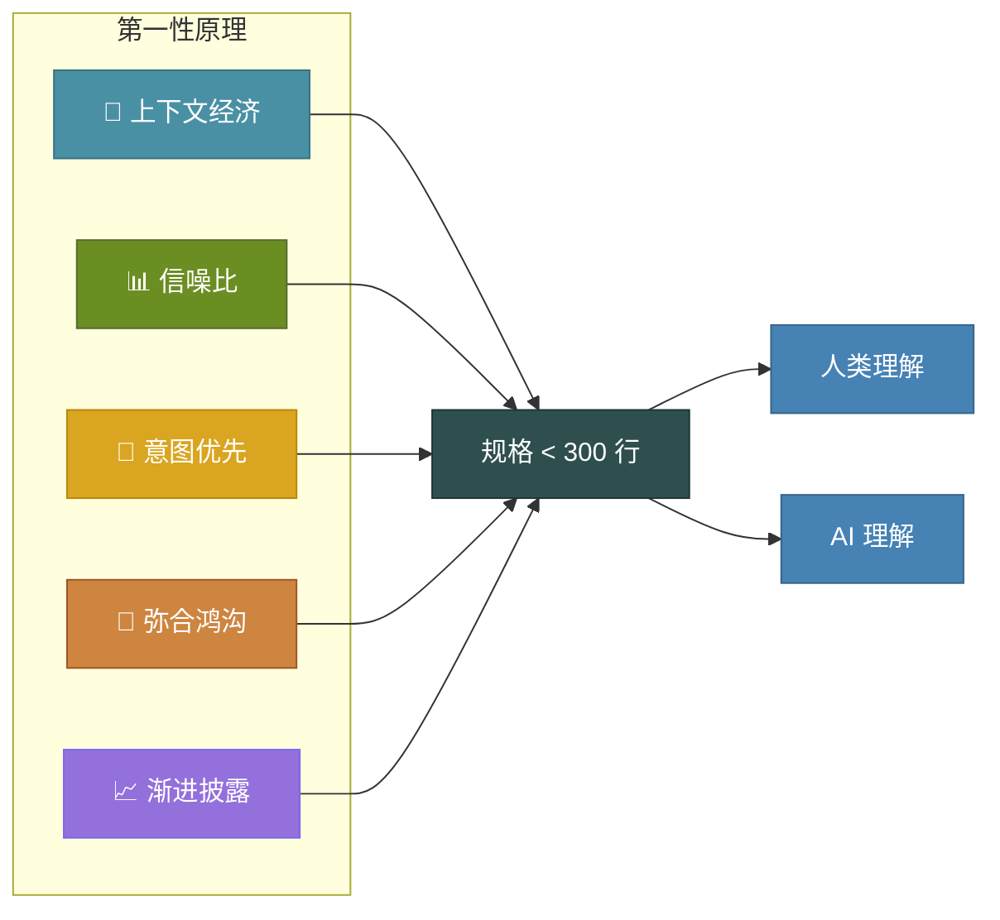

今年年初，我被 Claude Sonnet 3.7 的 AI 编程能力深深震撼。那时 "Vibe Coding" 这个词还没流行起来，但我做的正是这件事——让 AI 生成代码，我只负责引导对话。感觉像魔法一样神奇。直到问题开始浮现。

几周后，我注意到一些规律：代码冗余越来越多，实现方向偏离了最初的设想，AI 在不同会话之间丢失上下文导致返工不断增加。蜜月期结束了。我需要一套结构化的方法，但又不想引入那些拖慢开发速度的重型流程。

{/* truncate */}

这段探索之旅让我先后尝试了 Kiro、Spec Kit、OpenSpec 等工具，最终促使我开发了 [LeanSpec](https://github.com/codervisor/lean-spec)——一个轻量级的规格驱动开发（Spec-Driven Development，SDD）框架。今天发布的 v0.2.7 版本，是三周内的第十个版本。这篇文章分享我为什么要做 LeanSpec、它有什么不同，以及如何快速上手。

## Vibe Coding 的隐性成本

:::note Vibe Coding 的陷阱
AI 编程助手的生产力惊人——直到它们开始出问题。缺乏结构化的上下文，AI 会生成看似合理但前后矛盾的代码，导致技术债务在每个会话中不断累积。
:::

如果你深度使用过 AI 编程工具，大概率遇到过这些问题：

| 症状 | 根本原因 | 影响 |
|------|---------|------|
| **代码冗余** | AI 不记得之前的实现 | 重复逻辑散落在各处 |
| **意图偏移** | 上下文在会话间丢失 | 功能与你的设想渐行渐远 |
| **返工增多** | 缺少持久的单一信息源 | 反复解释相同的背景 |
| **架构不一致** | 缺乏结构化指导 | 组件之间无法顺畅协作 |

业界的解决方案是 **规格驱动开发（Spec-Driven Development，SDD）**——先写规格文档，再写代码，为 AI（和人类）提供持久的上下文。但当我考察现有工具时，发现了一个空白地带。

:::info 延伸阅读
刚接触 SDD？可以先阅读我的基础文章 [规格驱动开发：复杂功能的系统化方法](/blog/spec-driven-development) 了解方法论基础，或者看 [2025 年 SDD 工具全景](/blog/sdd-tools-practices) 了解业界工具的全面对比。想不安装任何工具就体验方法论？试试 [不用工具实践 SDD](https://www.lean-spec.dev/docs/tutorials/sdd-without-toolkit) 教程。
:::

## 为什么要做 LeanSpec

我在 SDD 领域的探索揭示了三类工具，每类都有不适合我的地方：

**厂商锁定**：Kiro（亚马逊的 SDD IDE）集成度很高，但要求放弃现有工作流。我喜欢自己的工具组合，换 IDE 不在考虑范围内。

**认知负担过重**：Spec Kit 提供了完整的结构，但其繁复的格式带来了很大的认知负担。即使有 AI 辅助撰写，理解和维护这些规格文档仍然耗费大量心智资源，对于独立开发者和小团队来说过于沉重。

**缺少项目管理**：OpenSpec 最接近我理想中的样子——轻量且灵活——但缺乏跨项目管理几十个规格的能力。

我想要的是：**一套方法论，而不只是一个工具**。就像敏捷开发一样——一组人人可以采纳的原则，配合不碍事的轻量工具。


于是我做了 LeanSpec。然后用 LeanSpec 来开发 LeanSpec。

## 第一性原理：设计基石

LeanSpec 不只是工具链，它建立在五条第一性原理（First Principles）之上，指导每一个设计决策：



**上下文经济（Context Economy）**：规格必须装进工作记忆——无论人还是 AI。目标 300 行以内。如果 10 分钟读不完，就太长了。

**信噪比最大化（Signal-to-Noise）**：每一行都要服务于决策。没有样板文件，没有填充内容，没有为了形式的形式。

**意图优先于实现（Intent Over Implementation）**：记录 *为什么*，而不只是 *怎么做*。实现细节会变，意图不会。

**弥合鸿沟（Bridge the Gap）**：规格同时服务于人和 AI。任何一方看不懂，这份规格就是失败的。

**渐进披露（Progressive Disclosure）**：从简单开始，只在感到痛点时才增加结构。不做预设的复杂。

这些原则不只是文档——LeanSpec 的 `validate` 命令会自动检查规格是否符合它们。

## 核心功能

### Web UI 可视化管理

我最兴奋的功能：`lean-spec ui` 启动完整的 Web 界面，让你可视化地管理规格。

```bash
# 启动 Web UI
npx lean-spec ui
```

UI 提供看板视图、规格详情页（支持 Mermaid 图表渲染）和依赖关系可视化——全在浏览器里完成。适合规划会议或审查项目状态。


### 第一性原理校验

LeanSpec 不只存储规格，还会对照第一性原理进行校验：

```bash
# 校验规格是否符合第一性原理
lean-spec validate

# 输出示例：
# specs/045-user-auth/README.md
#   ⚠️  warning  Spec exceeds 300 lines (342)  context-economy
#   ⚠️  warning  Missing overview section      structure
# 
# ✖ 2 warnings in 1 spec
```

这能保持规格精简有意义，防止重型 SDD 工具常见的规格膨胀问题。

### 智能搜索与项目管理

查找相关规格不应该需要记住精确名称：

```bash
# 跨所有规格的语义搜索
lean-spec search "authentication flow"

# 高级查询
lean-spec search "status:in-progress tag:api"
lean-spec search "created:>2025-11-01"
```

看板视图让项目状态一目了然：

```bash
lean-spec board

# 📋 LeanSpec Board
# ─────────────────────────────────────
# 📅 Planned (12)     🚧 In Progress (3)     ✅ Complete (47)
# ─────────────────────────────────────
```

### MCP Server：AI 集成

LeanSpec 内置 MCP（Model Context Protocol）服务器，让 AI 助手可以直接与你的规格交互：

```json
{
  "mcpServers": {
    "leanspec": {
      "command": "npx",
      "args": ["@leanspec/mcp"]
    }
  }
}
```

支持 Claude Code、Cursor、GitHub Copilot 等 MCP 兼容工具。AI 代理可以搜索规格、读取上下文、更新状态——全部通过编程接口完成。

### 示例项目快速上手

刚接触 SDD？从一个完整的示例开始：

```bash
# 生成一个完整的教程项目
npx lean-spec init --example dark-theme
```

提供三个示例：`dark-theme`、`dashboard-widgets` 和 `api-refactor`——分别演示不同的 SDD 模式。

## 开发历程：用 LeanSpec 开发 LeanSpec

这个项目最有意思的地方在于：初版发布后，**LeanSpec 完全使用 LeanSpec 自身来开发**。

| 里程碑 | 日期 | 说明 |
|--------|------|------|
| 第一行代码 | 2025 年 10 月 23 日 | 从基础的规格增删改查开始 |
| v0.1.0（首次发布） | 2025 年 11 月 2 日 | 从零到发布仅用 10 天 |
| v0.2.0（生产就绪） | 2025 年 11 月 10 日 | 第一性原理校验，完整 CLI |
| v0.2.7（当前版本） | 2025 年 11 月 26 日 | 24 天内发布 10 个版本 |

在 LeanSpec 项目内部，已经创建了超过 120 个规格——涵盖功能实现、架构决策、复盘反思，甚至营销策略。反馈循环非常紧凑：发现痛点 → 写规格 → 实现 → 用真实场景验证。

我还把 LeanSpec 应用到了其他项目：
- [Crawlab](https://github.com/crawlab-team/crawlab)（12k+ stars）—— 网络爬虫管理平台
- 这个博客（marvinzhang.dev）
- [codervisor](https://github.com/codervisor) 组织下即将发布的新项目

在所有项目中，规律都是一致的：规格提供了跨会话存续的上下文，AI 能持续对齐我的意图，我花在反复解释上的时间大幅减少。

## LeanSpec 的独特之处

如果你读过我的 [SDD 工具分析](/blog/sdd-tools-practices)，就知道我评估过这个领域的六个主要工具。LeanSpec 的定位是这样的：

| 维度 | 重型工具 | LeanSpec |
|------|---------|----------|
| **学习曲线** | 数天到数周 | 几分钟 |
| **规格开销** | 大量前期工作 | 边写边补 |
| **Token 成本** | 通常 >2,000 | 目标 &lt;300 行 |
| **灵活性** | 结构刚性 | 适应你的工作流 |
| **厂商锁定** | 常见 | 不存在 |
| **理念** | 工具优先 | 方法论优先 |

LeanSpec 的 "Lean" 有多重含义：
- **方法论**：像敏捷一样，是无论工具如何都能采纳的原则
- **认知负担**：低开销，快速上手
- **Token 经济**：规格保持精简，能装进 AI 的上下文窗口
- **灵活性**：适应你的工作流，而不是反过来

## 快速上手

5 分钟内试用 LeanSpec：

```bash
# 全局安装
npm install -g lean-spec

# 在项目中初始化
lean-spec init

# 创建第一个规格
lean-spec create user-authentication

# 启动 Web UI
lean-spec ui
```

或者试试示例项目：

```bash
npx lean-spec init --example dark-theme
```

**已经在用 Spec Kit 或 OpenSpec？** 参考 [迁移指南](https://www.lean-spec.dev/docs/guide/migration)——迁移过程很顺畅。

## 未来规划

LeanSpec 仍在活跃迭代中。当前开发重点包括：
- VS Code 插件，实现内联规格管理（[规格 17](https://web.lean-spec.dev/specs/17)）
- AI 聊天界面，实现交互式规格辅助（[规格 94](https://web.lean-spec.dev/specs/94)）
- 全面的国际化支持（[规格 91](https://web.lean-spec.dev/specs/91)）
- GitHub 多项目集成（[规格 98](https://web.lean-spec.dev/specs/98)）

我做 LeanSpec 是为了解决自己的问题——Vibe Coding 带来的代码质量下降、AI 会话间的上下文丢失、重型 SDD 工具的认知负担。如果你也面临类似的挑战，希望它对你同样有帮助。

---

**链接：**
- 📦 [GitHub](https://github.com/codervisor/lean-spec)
- 📚 [文档](https://www.lean-spec.dev/)
- 📊 [npm 包](https://www.npmjs.com/package/lean-spec)

有问题、反馈或功能建议？欢迎提 issue 或发起 [讨论](https://github.com/codervisor/lean-spec/discussions)。每一条我都会看。
