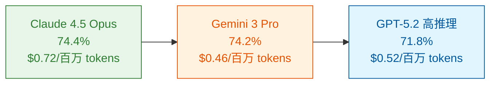
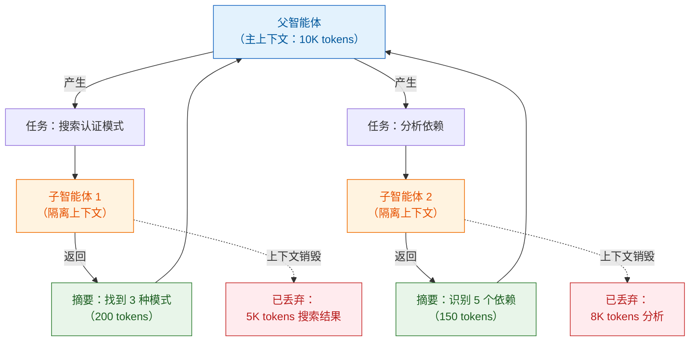
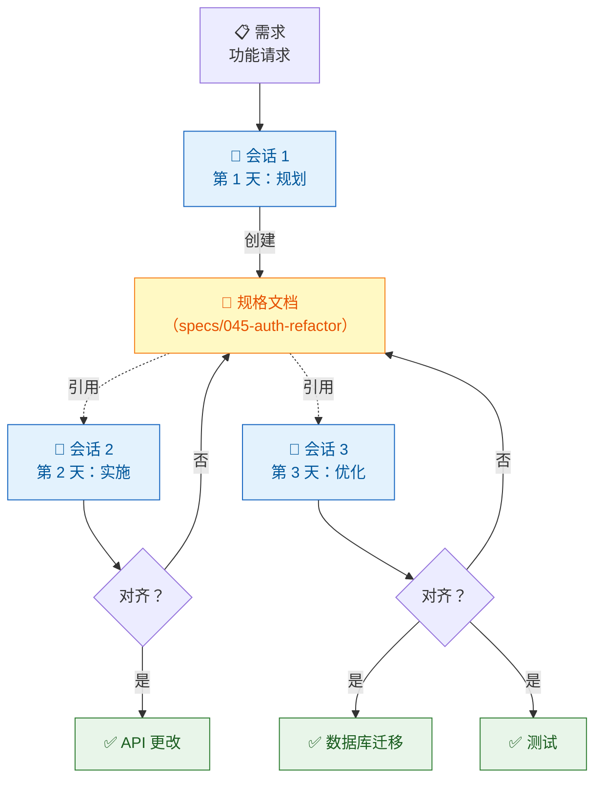
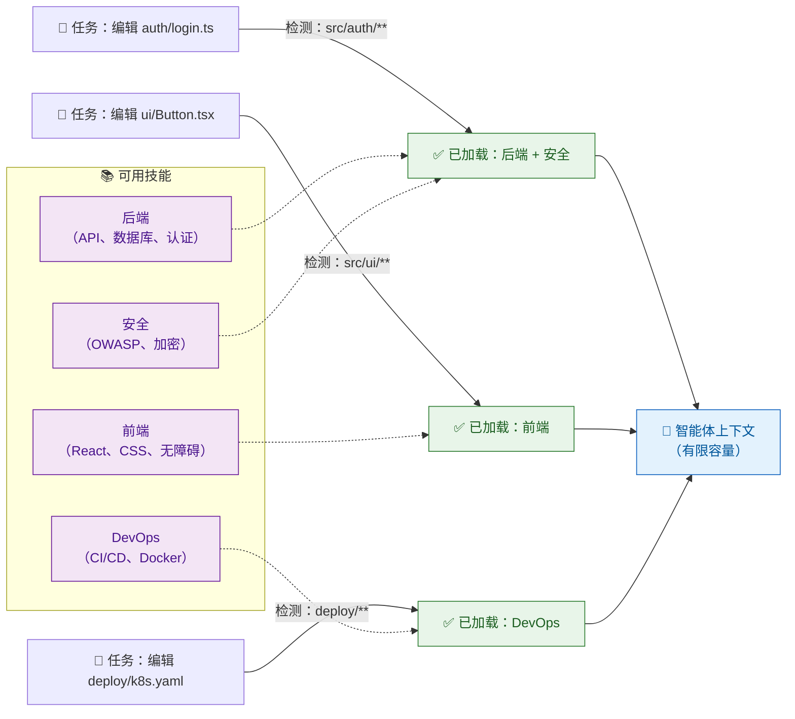
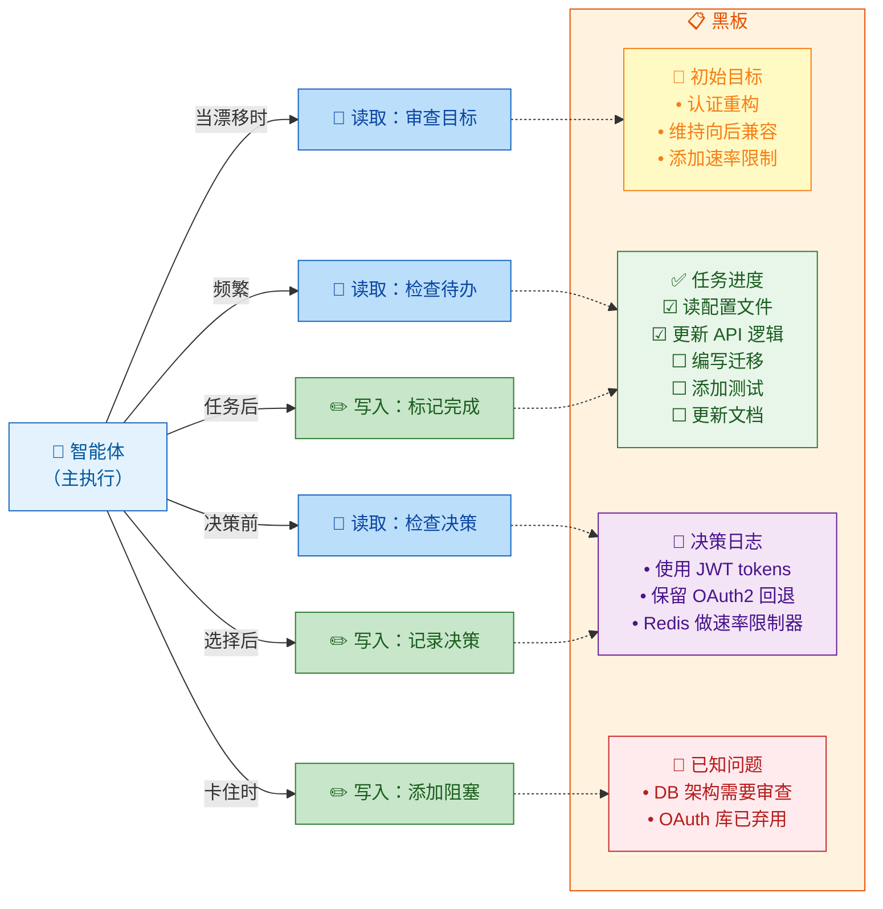

import Tabs from '@theme/Tabs';
import TabItem from '@theme/TabItem';

[SWE-bench](https://www.swebench.com/) 评分在短短 14 个月内提升了 50%——从 2024 年 10 月 Claude 3.5 Sonnet 的 49% 跃升至 2026 年 1 月 [Claude 4.5 Opus 的 74.4%](https://www.swebench.com/)——你可能会认为 AI 智能体（AI Agents）已经征服了软件工程领域。然而，大规模部署这些智能体的企业却讲述着不同的故事。Triple Whale 的 CEO 描述了他们的生产环境实践："GPT-5.2 为我们解锁了一次彻底的架构转型。我们将一个脆弱的多智能体系统简化为单个配备 20 多种工具的超级智能体……这个超级智能体更快、更智能， **维护难度降低了 100 倍** 。"

{/* truncate */}

基准测试表现与生产环境就绪程度之间的差距，揭示了关于 AI 智能体的一个根本真相： **智能还不够** 。尽管 [GPT-5.2](https://openai.com/index/introducing-gpt-5-2/)、Claude 4.5 和 Gemini 3 Pro 等突破性模型在代码基准上达到了 70% 以上的成绩，企业部署仍然持续面临幻觉（Hallucination）、上下文腐化（Context Rot）以及长期任务中的性能衰减问题。2025 年的 AI 智能体采用浪潮暴露了学术基准掩盖的事实——缺乏稳健的架构模式，即使最强大的模型在生产环境中也会失败。

本文探讨 2025-2026 年的拐点时期，AI 智能体开发从追求原始模型能力（速度、规模、自主性）转向重视架构可靠性（质量、稳健性、协调性）。借鉴真实部署案例——JetBrains 的多智能体 IDE、Remote 的 LangGraph 入职系统、Intercom 的 86% 问题解决率——我们将探讨四种应对 LLM 根本局限的新兴架构模式：

- **子智能体系统（Sub-Agent Systems）** 隔离上下文，防止膨胀
- **规格驱动开发（Spec-Driven Development）** 跨会话维持目标对齐
- **智能体技能（Agent Skills）** 实现渐进式知识披露
- **智能体黑板（Agent Blackboards）** 通过共享记忆协调进度

:::info 相关阅读
关于如何有效管理 LLM 上下文的基础概念，请参阅[上下文工程：AI 系统中的信息选择艺术](/blog/context-engineering)。关于企业数据基础设施如何影响 AI 智能体可靠性，可探索[从聊天机器人到智能体：构建企业级 LLM 应用](/blog/enterprise-ai-application-architecture)。
:::

证据表明，成功部署企业级 AI 智能体需要从"模型优越性"转向"架构可靠性"。生产环境成功案例始终如一地证明，工程纪律——理解约束、应用模式、构建稳健架构——比原始模型能力更重要。

## AI 智能体的质量危机

2025 年的 AI 采用浪潮带来了一个意想不到的悖论。尽管模型能力飙升——Claude 4.5 Opus 在 SWE-bench 上达到 74.4%，Gemini 3 Pro 达到 74.2%，GPT-5.2 在高推理模式下达到 71.8%——企业部署却暴露了基准测试无法捕捉的系统性质量问题。问题的根源不在于模型智能，而在于架构韧性。

### 采用与质量的差距

回顾短短 14 个月的发展轨迹：Claude 3.5 Sonnet 于 2024 年 10 月发布时在 SWE-bench Verified 上的成绩为 49%。到 2026 年 1 月，顶级模型已聚集在 70-75% 区间。 **50% 的提升** 本应使 AI 智能体达到生产就绪状态。然而，构建实际系统的企业始终需要超越基础模型能力的定制架构模式。

Triple Whale 的经验说明了这一挑战。尽管能够使用最先进的模型，他们最初的多智能体系统在生产环境中被证明"脆弱"。突破来自架构转型，而非更好的模型——他们将复杂性简化为配备 20 多种专用工具的单个超级智能体。[JetBrains](https://claude.com/customers) 构建了多智能体 IDE 编排系统，[Remote](https://blog.langchain.com/customers-remote/) 开发了基于 LangGraph 的客户入职流程，[Intercom](https://claude.com/customers) 达到 86% 的问题解决率——所有这些都需要模型本身无法提供的架构模式。

最近的研究确认了根本原因。2026 年 1 月发表的论文["智能体不确定性量化"（Agentic Uncertainty Quantification）](https://arxiv.org/abs/2601.15703)描述了一种 **"幻觉螺旋"（Spiral of Hallucination）**，早期认知错误在多步推理链中不可逆转地传播。配套论文["智能体置信度校准"（Agentic Confidence Calibration）](https://arxiv.org/abs/2601.15778)发现 **"失败时的过度自信仍然是高风险场景部署的根本障碍"** 。模型不仅会犯错——它们还会自信地给出错误答案，阻碍生产部署。

### 根本原因：上下文限制

质量危机源于 LLM 架构的根本性约束。随着对话延续数小时甚至数天，会浮现几种失败模式：

| 失败模式 | 表现 | 生产环境影响 |
|---------|------|-------------|
| **上下文膨胀（Context Bloat）** | 冗长的工具调用、对话历史积累 | 长编码会话性能退化，忘记初始目标 |
| **幻觉螺旋（Hallucination Spirals）** | 早期错误在推理链中复合传播 | 多步骤工作流产生自信的错误结果 |
| **目标偏移（Goal Divergence）** | 设计决策偏离原始需求 | 实施不对齐导致技术债务 |
| **边缘情况脆弱性（Edge Case Brittleness）** | 异常场景触发不可预测行为 | 尽管平均性能高仍存在可靠性问题 |

长时间运行的智能体——多小时代码会话、复杂研究任务、迭代设计工作流——会触及上下文限制，而短期基准测试永远不会遇到这些问题。在孤立问题上得分良好的模型，在上下文充满无效尝试和中间状态后，在延长会话中会显示出性能退化。

### 性能高原

成本-性能分析揭示了为何架构模式比原始模型能力更重要。SWE-bench Verified 上排名前三的模型聚集在 5 个百分点以内：

Claude 4.5 Opus 的成本比 GPT-5.2 高推理模式 **高 1.4 倍**（每百万 tokens 0.72 美元 vs 0.52 美元），但仅获得 **2.6 个百分点的增益**（74.4% vs 71.8%）。这种递减收益曲线表明，我们遇到了架构瓶颈——而非模型限制。OpenAI 的营销策略认可了这一现实：GPT-5.2 被明确定位为"面向专业工作和 **长期运行智能体** 的先进前沿模型"，承认架构支持对于生产部署至关重要。

类似地，[OSWorld](https://os-world.github.io/) 计算机使用基准显示了 14 个月的巨大进步——Claude 3.5 Sonnet 于 2024 年 10 月发布时成绩为 14.9%，而 Claude Sonnet 4.5 目前以 62.9% 领先——但仍落后于人类 72.36% 的表现。尽管提升了 4 倍，持续存在的差距凸显了智能体可靠性需要的不仅仅是原始模型智能。

### 多样的失败模式

生产部署暴露了基准测试遗漏的失败模式：

**代码智能体**：设计-目标偏移在多文件重构中累积。智能体可能成功实现各个组件，同时偏离原始架构要求，创造出技术上正确但系统性不对齐的代码。

**研究智能体**：随着上下文填充，信息检索发生漂移。早期研究方向偏倚后续综合，矛盾发现通过幻觉而非承认不确定性得到调和。

**UI 自动化**：导航在上下文相关条件下变得脆弱。[Anthropic 对 Claude 3.5 计算机使用的初步评估](https://www.anthropic.com/news/developing-computer-use)指出："尽管它是当前最先进的，Claude 的计算机使用仍然 **缓慢且经常出错** 。"

**多智能体系统**：随着智能体维护独立上下文，协调开销复合增加。共享目标碎片化，智能体重复已完成的工作，从对项目状态的不同理解中浮现冲突目标。

行业响应承认了这些系统性问题。Anthropic 将计算机使用能力定义为教授["通用计算机技能——允许它使用各种标准工具"](https://www.anthropic.com/news/3-5-models-and-computer-use)，而非任务特定优化。但即使这种范式转变也需要架构模式来处理基准性能与生产需求之间的可靠性差距。

## 提升智能体质量的架构模式

四种架构模式从生产部署中浮现，成为关键的质量缓解措施。每种都针对特定的 LLM 局限，成功的系统通常结合多种模式，而非依赖单一方法。

### 模式 1：子智能体系统（上下文隔离）

**问题**：主智能体上下文在多步骤工作流中膨胀。跨大型代码库的语义搜索返回数千个代码片段。多文件研究积累冗长文档。复杂调试会话产生无用的探索。每个操作都用仅对该特定子任务有意义的信息填充宝贵的上下文。

**解决方案**：在具有有界上下文的独立智能体会话中隔离冗长操作。父智能体产生子智能体，提供聚焦的任务描述，并接收回总结结果。子智能体的上下文——包括所有工具调用冗余和中间推理——在返回发现后被丢弃。

[VS Code 的 `runSubagent` 工具](https://code.visualstudio.com/docs/copilot/chat/chat-tools)展示了这一模式。每次子智能体调用都在隔离上下文中运行，执行无状态。父智能体可能要求子智能体"在代码库中搜索身份验证实现"，而不污染自己的上下文。子智能体探索、综合发现并返回简洁摘要，如"找到 3 种身份验证模式：`auth/oauth.ts` 中的 OAuth2、`auth/jwt.ts` 中的 JWT、`auth/session.ts` 中的基于会话的"。父智能体的上下文保持清洁。

[LangChain DeepAgents](https://docs.langchain.com/oss/python/deepagents/overview) 提供了用于产生专门子智能体的 `task` 工具。[Amazon Bedrock](https://aws.amazon.com/bedrock/agents/) 使用监督者模式，协调智能体将任务委托给编码、研究和规划的专门智能体——各自维护独立上下文。[SWE-agent](https://github.com/SWE-agent/SWE-agent) 通过迷你智能体分解在 SWE-bench Verified 上达到 65%，将复杂编码任务分解为聚焦的子任务。

**用例**：无上下文污染的代码库探索，维护独立调查线索的并行研究分支，不膨胀主开发会话的隔离测试工作流。

**好处**：上下文在长会话中保持新鲜。记忆使用保持有界。并行执行成为可能——为独立研究线索产生多个子智能体而无交叉污染。

### 模式 2：规格驱动开发（上下文持久化）

**问题**：长期任务失去初始目标。多天功能开发从明确需求开始，但积累设计决策、变通方案和妥协，却未记录原因。当智能体在中断后恢复——或当上下文轮换以容纳新信息时——初始意图丢失。设计-目标偏移创建了技术上正确但错过实际需求的实现。

**解决方案**：在实施前创建持久的规格文档。智能体在整个执行过程中引用规格以验证对齐。规格存在于文件系统中——在智能体上下文之外——提供经得起会话重启和上下文轮换的稳定参考点。

[Claude Code 的计划模式（Plan Mode）](https://code.claude.com/docs/en/common-workflows#use-plan-mode-for-safe-code-analysis)体现了这一模式。智能体以只读模式运行，在提出任何实施计划之前使用 `AskUserQuestion` 工具收集需求并澄清目标。考虑一个复杂的身份验证重构：计划模式分析当前代码库，询问有关向后兼容性和数据库迁移需求的澄清问题，然后生成全面的执行计划。该计划在任何代码更改开始之前通过迭代问题进行审查和优化。这在规划阶段捕获不对齐——当修复花费几分钟，而非数小时调试时。

[Amazon Kiro](https://aws.amazon.com/bedrock/agents/) 提供带依赖跟踪的项目级规划。[LeanSpec](https://leanspec.dev/) 为技术团队提供与 git 集成的轻量级规格管理（[参见介绍](/blog/introducing-leanspec)）。所有这些都共享核心模式：比任何单次对话上下文都持久的文档。

:::info 深入了解 SDD
关于全面的方法论基础，请参阅[规格驱动开发：复杂功能的系统化方法](/blog/spec-driven-development)。关于工业工具和实施实践，可探索[2025 年的规格驱动开发：工业工具、框架和最佳实践](/blog/sdd-tools-practices)。
:::

**用例**：跨多个会话维持连贯设计的功能开发，前后端团队之间协调的 API 设计，保持架构需求的系统重构，具有共享规格的跨团队协调。

**好处**：目标对齐在会话和重启中持续。早期偏移检测在规划阶段（修复花费几分钟，而非数小时）捕获不对齐。人工审查检查点在关键决策点注入领域专业知识。规格成为项目文档——不仅捕获构建了什么，还捕获为什么。

### 模式 3：智能体技能（渐进式披露）

**问题**：预先加载所有文档、能力和指南会浪费上下文。一个多语言代码库可能有 Python、TypeScript、Rust 和 Go 的风格指南，总计数千 tokens。身份验证代码的安全指南在编写 CSS 时没有帮助。框架特定模式在处理纯 JavaScript 时会杂乱上下文。不相关的信息制造噪音，挤占与任务相关的细节。

**解决方案**：基于检测到的任务需求动态加载知识。系统监视智能体正在处理什么，并即时注入上下文。编辑身份验证代码？加载安全指南。处理 React 组件？注入 React 19 最佳实践。打开 Rust 文件？提供 Rust 惯用法。

[agentskills.io 格式](https://agentskills.io/)标准化了这一模式。兼容 Claude、Cursor、GitHub Copilot 和 VS Code，它定义了条件加载的技能包。一个仓库可能有前端、后端、安全、部署的独立技能——每个只在与当前任务相关时激活。

条件指令加载基于上下文触发特定领域规则。文件路径模式确定适用哪些指南：`src/auth/**` 加载安全策略，`src/ui/**` 加载无障碍标准。工具发现渐进式暴露能力——编辑迁移文件时出现数据库工具，编写 UI 组件时则不出现。

**用例**：按需加载特定语言 linting 规则的多语言代码库，仅为敏感代码路径应用安全指南的合规要求，避免在编写 Vue 组件时受 React 上下文污染的框架特定模式。

**好处**：高效的上下文使用——每个 token 都服务于当前任务。减少认知负荷——智能体专注于相关信息，无需过滤全局噪音。更好的特异性——领域指南在需要的地方精确应用，而非在所有工作中稀释。

### 模式 4：智能体黑板（共享记忆）

**问题**：长时间运行的会话失去初始目标。智能体开始实施功能时有明确目标，但在数十次工具调用后——读取文件、调试错误、探索替代方案——初始需求淡化。智能体重复已完成的工作。上下文充满实施细节，挤压高层次目标。即使在单个对话中，目标漂移也会累积。

**解决方案**：维护整个对话中可见的共享任务列表。待办事项列表跟踪待处理工作。进度跟踪器记录已完成步骤。决策日志捕获为何选择某些方法。智能体在每个主要步骤后更新这个共享状态，防止延长会话中的目标漂移。

**黑板是内置的、单会话规格**：虽然模式 2 专注于通过灵活文档实现跨会话持久化，黑板为会话内协调提供标准化结构。两者都使用智能体上下文外的基于文件的持久化，但黑板优化即时任务跟踪而非长期设计对齐。这使它们通过工具集成立即可用，但会话范围而非项目范围。

[LangChain DeepAgents](https://docs.langchain.com/oss/python/deepagents/overview) 包括用于规划和进度跟踪的内置 `write_todos` 工具。智能体编写其计划，检查已完成项目，随着需求演变添加新任务。VS Code、Cursor 和 Claude Code 都实现了 `Todos` 工具——对话中的持久任务列表。[Amazon Bedrock](https://aws.amazon.com/bedrock/agents/) 使用共享状态，监督者智能体通过集中式记忆协调子智能体。LangGraph Store 为处理相关任务的智能体提供跨对话记忆持久化。

**用例**：在延长对话期间维持对初始目标关注的多步骤实施，防止重复探索失败方法的迭代调试，在会话内共享发现的阻塞的协调子智能体。

**好处**：初始目标在长对话中保持可见。无冗余工作——已完成的任务被标记和跳过。清晰的进度可见性——人类可以检查黑板以了解当前状态。共享记忆防止在数十次工具调用中累积的目标漂移。

### 集成至关重要

成功的部署结合多种模式。[LangChain DeepAgents](https://docs.langchain.com/oss/python/deepagents/overview) 集成了所有四种：`write_todos` 用于黑板协调，文件系统工具用于规格驱动持久化，`task` 工具用于子智能体产生，以及 LangGraph Store 用于跨会话记忆。这种架构——受 Claude Code、Deep Research 和 Manus 启发——证明生产韧性需要分层技术。
这些模式创造了涌现的稳健性。子智能体在研究期间防止上下文膨胀。规格（包括内置黑板）在子智能体返回时维持目标对齐。技能确保每个子智能体仅加载相关知识。整体超过部分之和。

学术研究验证了这种多模式方法。2026 年 1 月关于["智能体置信度校准"](https://arxiv.org/abs/2601.15778)和["智能体不确定性量化"](https://arxiv.org/abs/2601.15703)的论文认识到，系统性质量需要架构保障，而非仅仅模型改进。研究界越来越关注补充模型能力的可靠性模式。

| 模式 | 解决的问题 | 关键工具 | 成熟度 | 最适合 |
|------|-----------|---------|--------|--------|
| **子智能体** | 冗长操作导致的上下文膨胀 | VS Code runSubagent、LangChain task、Bedrock supervisor | 生产级 | 研究、代码库探索、并行任务 |
| **规格驱动** | 长期工作中的目标偏移 | Claude 计划模式、LeanSpec、Amazon Kiro、OpenSpec | 生产级 | 功能开发、API 设计、重构 |
| **技能** | 不相关信息杂乱上下文 | agentskills.io、条件指令 | 生产级 | 多语言代码库、特定领域规则 |
| **黑板** | 长对话中的目标丢失 | LangChain write_todos、VS Code Todos、LangGraph Store | 生产级 | 延长单会话任务、多步骤工作流 |

## 工程高于智能

### 架构思维

架构为中心的思维始终是软件工程的基础——AI 时代延续了这一纪律，而非取代它。前 AI 时代的工程师为韧性设计微服务，实施熔断器以容错，构建消息队列以解耦。最好的系统结合了高效算法与稳健架构。如果系统无法优雅地处理故障，排序速度意义不大。

**AI 时代模式与传统架构关注点并行**：管理上下文窗口类似于管理记忆约束。防止幻觉级联类似于防止错误传播。跨会话维持目标对齐类似于在分布式系统中维持状态一致性。具体模式改变了——子智能体而非微服务，规格而非 API 契约——但基本原则保持不变： **生产可靠性需要解决系统级失败模式的架构纪律**。

### 行业信号

最近的生产部署证明架构模式带来可衡量的业务影响。[DoorDash](https://aws.amazon.com/solutions/case-studies/doordash-bedrock-case-study/) **每天处理 100,000+ 个支持电话**，响应延迟为 2.5 秒，每天减少数千次智能体升级。[BlueOceanAI](https://aws.amazon.com/solutions/case-studies/blueoceanai-bedrock/) 的 Spark 系统为客户实现了 **97% 的运营改进**，将分析工作流从 5 天缩短至 2 小时，同时在第一个月处理了 12 亿 tokens。

医疗保健部署在高风险领域显示了可靠性。[Carta Healthcare](https://claude.com/customers/carta-healthcare) 将临床数据抽象时间减少了 **66%**，同时维持 98-99% 的评分者间可靠性（Inter-rater Reliability）。[Intercom](https://claude.com/customers/intercom) 的 Fin AI 智能体达到 **86% 的解决率**，开箱即用性能为 51%，将 45 种以上语言的响应时间从 30 分钟降至几秒。这些指标验证了架构模式——而非仅仅模型能力——决定生产成功。

### 对工程师的启示

架构要务为 AI 工程师创造了新要求：

**学习质量增强技术**：不要将 AI 开发视为简单的 RAG 演示。理解子智能体模式、规格驱动工作流、渐进式披露、黑板协调。这些模式正在成为与传统软件工程中了解 REST API 或数据库事务同等基础的技能。

**通过可靠性减少人工监督**：目标不是能做任何事的智能体，而是无需持续监督就能可靠地做特定事情的智能体。架构模式通过防止常见失败模式来实现这一点，而非要求人类捕获和纠正错误。

**持续学习仍然至关重要**：该领域快速演变。2026 年 1 月带来了关于置信度校准和不确定性量化的新研究。生产框架每月迭代。成功的工程师跟踪新兴模式，并随着最佳实践演变调整架构。

从"构建 RAG 演示"到"工程化可靠智能体系统"的转变反映了历史性转型。Web 开发从静态 HTML 成熟到 React 和 Next.js 等框架。移动开发从基础应用演变为复杂 SDK。AI 工程正在从概念验证实验成熟为具有既定模式和经验证实践的生产级系统。

## 结论

2025-2026 年期间标志着 AI 智能体开发的拐点——行业从追求模型能力转向重视架构可靠性。14 个月内 50% 的基准改进令人兴奋，但企业部署揭示了单靠智能不能确保生产可靠性。顶级模型在 SWE-bench 上聚集在 70-75%，收益递减，而 Triple Whale、JetBrains、Remote 和 Intercom 的成功部署始终需要超越基础模型能力的定制架构模式。

上下文限制是当前 LLM 架构的基本物理约束。随着对话延续数小时或数天，上下文膨胀，推理链传播早期错误，设计目标偏离原始需求。这些失败模式无论模型能力如何都会表现出来，需要架构缓解措施：子智能体系统隔离冗长操作，规格驱动开发维持目标对齐，智能体技能实现即时知识交付，黑板通过共享记忆协调进度。生产韧性需要结合多种模式——LangChain DeepAgents 集成所有四种，证明分层方法能够产生结果。

工程师应该转变思维方式，从"构建 RAG 演示"转向"工程化可靠智能体系统"。学习新兴模式，理解何时应用子智能体、规格驱动开发、技能或黑板。尝试像 LangChain DeepAgents 这样的集成方法。架构素养将变得与 2023 年的提示工程或 2024 年的 RAG 一样关键。

AI 智能体正在从令人印象深刻的演示成熟为生产系统。这一转型需要纪律——理解约束、应用模式、构建稳健架构。限制 AI 智能体采用的约束不是模型能力。GPT-5.2、Claude 4.5 和 Gemini 3 Pro 提供了足够的智能。约束是架构可靠性。 **智能丰富；可靠性稀缺** 。掌握智能体质量架构模式的工程师将定义下一代 AI 驱动系统。
