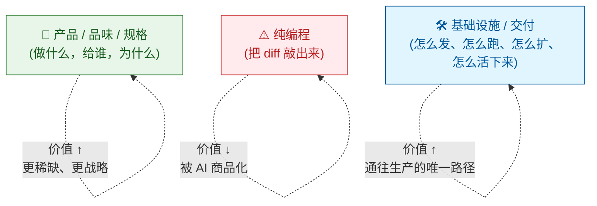
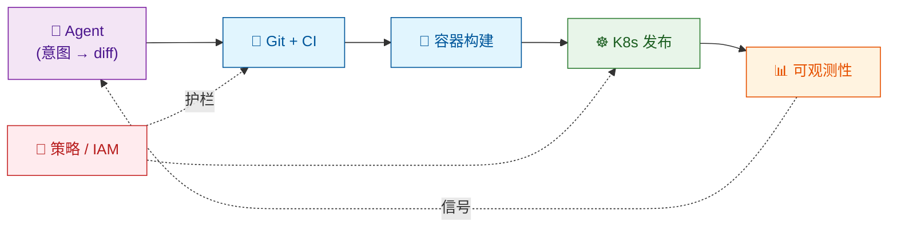

2026 年的每一场 AI 发布会都是同样三张幻灯片开场：更大的模型、更快的芯片、更聪明的 Agent。真正缺失的是第四张——这些东西到底怎么送到用户面前。而这张缺失的幻灯片，恰好就是接下来十年价值最集中的地方。它不会靠又一轮模型微调产生，而会靠我们这个技术栈里最不性感的那一层：**基础设施（Infrastructure，俗称 Infra）**。

数据也支持这个判断。[麻省理工学院（MIT）2025 年《State of AI in Business》报告显示，95% 的生成式 AI 试点无法进入生产](https://thenewstack.io/in-2026-ai-is-merging-with-platform-engineering-are-you-ready/)。[Gartner 的调研表明，只有 15% 的 IT 应用负责人在试点完全自主的 Agent](https://www.gartner.com/en/newsroom/press-releases/2025-09-30-gartner-survey-finds-just-15-percent-of-it-application-leaders-are-considering-piloting-or-deploying-fully-autonomous-ai-agents)，而整个 Agent 市场预计从 2025 年的 78 亿美元扩张到 2030 年的 526 亿美元。瓶颈不在智能。前沿模型 [在 SWE-bench Verified 上已经聚集在 70–75% 区间](/blog/ai-agents-engineering)。真正的瓶颈是从"一个能写代码的模型"到"一个能交付产品的组织"之间的所有环节——而这些环节，说到底都是 Infra。

把"暴论"说得直白一点：**编程变得廉价，Infra 却在变得稀缺**。AI 叙事习惯把 DevOps、CI/CD、容器、Kubernetes、云架构这些东西当作"已经解决的水管问题"，但它们即将成为把 AI 能力变成可交付产品的头号杠杆。理由很朴素：Agent 现在能写代码，但它自己跑不起一次构建，也扛不下一次部署，更没法独自决定一次回滚、开通一个区域。它需要一个底座替它做这些事——而这个底座，正是过去二十年 DevOps 攒下来的、经过无数次故障检验的、几乎零成本的遗产。

{/* truncate */}

本文要论证的核心观点是：**AI 的最后一公里不是智能，而是基础设施**——谁在 Infra 知识上不断复利，谁就会在交付上甩开那些只会堆 Prompt 的对手。接下来会看四件事：编程一旦商品化，价值往哪里迁移；为什么 DevOps 恰好是 AI Agent 的零成本自动化底座；"AI 也会吞掉 Infra"这个反方观点哪里对、哪里错；以及，你现在到底应该学什么。

## 编程变便宜了，什么会变贵？

前提已经不需要再辩论了。[斯坦福大学（Stanford University）对近 10 万名开发者的 2025 年生产力研究](/blog/ai-productivity)显示，扣除返工后 AI 带来的净收益大约是 15–20%——不算差，但离"10 倍工程师"的营销话术还差得远。[METR 针对资深开源开发者做的随机对照试验更犀利](https://metr.org/blog/2025-07-10-early-2025-ai-experienced-os-dev-study/)：使用 AI 的开发者完成任务反而多花了 19% 时间，但他们自己估计快了 20%，感知与事实之间有 39 个百分点的落差。[2026 年更大样本的复现把结果收敛到 −4% 左右](https://metr.org/blog/2026-02-24-uplift-update/)，但核心结论没变：**打字快，不等于交付快**。

这些数据不是要证明"编程完蛋了"。它们证明的是另一件事：**一段正确代码的边际生产成本正在趋近于零**，但从"一段正确代码"到"一个已上线功能"之间的差距，比 AI 叙事愿意承认的要大得多、也贵得多。价值就藏在这个差距里。

经济学对"某个要素变便宜"这件事有条老规律：**互补品会变贵**。廉价钢铁没让钢铁工人升值，却让电梯、空调、结构工程师都更值钱了。廉价算力没让软件本身升值，却让数据库、网络——以及 DevOps——都更值钱了。这场重新定价现在轮到软件工程内部：两层受益，一层被挤压。

**顶层**——产品感、规格、架构判断——之所以升值，是因为总得有人决定让这位廉价的"打工码农"去建什么。这也是[规格驱动开发（Spec-Driven Development，SDD）](/blog/spec-driven-development)和 [LeanSpec](/blog/introducing-leanspec) 兴起的根本逻辑：代码变成衍生产物，规格反而成了唯一的权威。这也解释了为什么[AI 时代的技术领导越来越像在挑选协作者，而不是挥更大的锤子](/blog/ai-leadership-from-tool-to-collaborative-partner)。

**底层**——Infra——升值的理由完全不同。一份 diff 不是产品，一个已合并的 PR 也不是产品。产品是一段代码在真实用户面前安全地跑着、可被观测、出问题了还能退回去。"Agent 写完代码"和"用户看到功能"之间的一切都是 Infra。编程便宜了 10 倍，但**把代码从笔记本送到用户屏幕上的成本并没有便宜**。价值就在这两条成本曲线之间的缝里集中。

被挤压的中间层，就是纯编程，也就是"打字"那部分。这部分工作不会消失，只会变成最低门槛。2026 年一个擅长写函数、却对这些函数怎么被构建、部署、监控、回滚无动于衷的资深工程师，和"Agent 加一个初级 reviewer"的组合越来越难区分；反过来，一个掌控从 idea 到生产这整条链路的资深工程师，仍然是独一份的。[关于这种"资深"的形状，我们从 2022 年就一直在写](/blog/architect-essential-skills)——AI 只是把这条轨迹踩得更快了而已。

## Infra：AI 的零成本自动化底座

这里有个很少被说破的论点：AI Agent 并不需要新的基础设施，它需要的是我们已经建好的那套。过去十五年 DevOps 堆出了一件很神奇的东西——**一张全球部署、API 驱动、以声明式方式配置的自动化织物**——它就在那儿，几乎免费，等着一个合适的调用方。这个调用方，最后是 Agent。

调研数据已经把这件事摆上了桌面。[2025 年 DORA《AI-Assisted Software Development》报告](https://cloud.google.com/resources/content/2025-dora-ai-assisted-software-development-report)基于近 5000 名从业者的样本，发现 **90% 的组织至少采用了一个内部平台**，并指出"高质量的内部平台与组织释放 AI 价值的能力之间存在直接正相关"。[The New Stack 在 2026 年 1 月的分析更加直白](https://thenewstack.io/in-2026-ai-is-merging-with-platform-engineering-are-you-ready/)："平台工程与 AI 正在合二为一，前者正成为安全、高效部署后者的黄金标准。"与此同时，[CNCF 2025 年度调研显示 82% 的容器用户已在生产环境运行 Kubernetes](https://www.cncf.io/announcements/2026/01/20/kubernetes-established-as-the-de-facto-operating-system-for-ai-as-production-use-hits-82-in-2025-cncf-annual-cloud-native-survey/)——相比 2023 年的 66% 大幅提升——并直接宣布 Kubernetes 是"AI 的事实操作系统"。

把 DevOps 这些年攒下来的东西，剥掉术语看一眼：

| 传统 Infra 组件 | 本质 | 为什么 Agent 特别喜欢 |
| --- | --- | --- |
| **Git + CI/CD** | 把一份 diff 确定性地变成一次部署 | Agent 天生产出 diff，流水线天生处理 diff |
| **容器 / OCI** | 可移植、可复现的执行单元 | Agent 随便一台机器都能构建和运行，不存在环境漂移 |
| **Kubernetes** | 声明式的工作负载控制回路 | Agent 声明期望状态，K8s 负责收敛 |
| **基础设施即代码（IaC，Terraform / Pulumi）** | 用 diff 表达基础设施 | Agent 本来就说"diff"这门语言，云变成了一次函数调用 |
| **可观测性（OpenTelemetry / Prometheus / 日志）** | 运行中系统的反馈信号 | Agent 需要证据来闭环，这就是证据 |
| **密钥 / IAM / 策略** | 类型化、可审计的权限边界 | 让自主进程动起来唯一安全的方式 |

表里每一行都是**声明式、幂等、可通过 API 调用**的。这不是巧合。DevOps 花了十五年，把运维知识转成 YAML、HCL 和 HTTP 接口——正好是一个 LLM 驱动的 Agent 真正用得上的接口形态。我们当初把这层底座搭起来，不是为了给 AI 用，而是为了不在凌晨三点被叫醒。它恰好成了自主 Agent 的理想工具面，算是云计算时代一份意外的礼物——[你也可以把它理解成在第一次工业革命之上的第二次工业革命](/blog/llms-industrial-revolution)。

结论很具体。**"AI 原生"（AI Native）不是把你的技术栈围绕向量数据库重写**，而是把 Agent 接入你已经有的那套自动化底座——也就是我们在 [2026 年 Agent 全景图](/blog/agent-landscape) 第 5 层（执行底座）勾勒过的那一层。

来看一个具体例子。旧循环里，开发者 debug、提交、开 PR、等 CI、等 review、合并、盯着部署、看仪表盘、出事就回滚。这条循环横跨几小时到几天，而且全程消耗人类注意力。[我们 2022 年给大型项目搭 GitHub Actions 时已经描写过这套机器的规模](/blog/github-actions-large-projects)——它没有一丝是为 AI 发明的。到了新循环里，人类只描述意图，Agent 产出 diff，**CI/CD 就是运行时**，容器是可移植层，Kubernetes 是调度器，可观测性是反馈通道，策略是护栏。人类的时间被压缩到"意图进、审批出"两端，中间全是 Infra。

注意画面里**什么不是新的**。MCP、A2A、Agent Harness 这些当然重要，但它们是坐在既有底座之上的薄薄一层。真正昂贵、真正难的是下面那层"无聊"的东西。没有那层"无聊"的底座，Prompt 写得再漂亮的团队也没法把 Agent 推到生产——这其实就是 [MIT 说的"95% 失败率"在度量的东西](https://thenewstack.io/in-2026-ai-is-merging-with-platform-engineering-are-you-ready/)。

:::note 核心论断
Agent 不是靠智能扩展，而是靠**你能把它指向多少确定性的、声明式的、可通过 API 调用的系统**来扩展。这片可调用面的总和，恰恰就是 DevOps 二十年攒下来的东西。
:::

## 为什么 Infra 知识在 AI 时代不但没贬值，反而复利？

最自然的反方观点是：AI 最后也会吃掉 Infra。Operator 会自愈，Agent 会自己写 Terraform，Kubernetes 会变成没人需要看见的实现细节。这些说法都部分成立，但都不足以动摇前面的结论。理由有三个。

**第一，Infra 是有状态的，而有状态恰好是 LLM 最弱的地方。** 写一个函数是无状态问题：输入进去，输出出来，可以在隔离环境里测。运行一个系统是有状态问题：某个操作是否正确，取决于当前集群的状态、当前负载、当前版本、当前的事故、当前账单周期的第几天。LLM 在有状态问题上特别容易"一本正经地胡说八道"，因为它的训练分布是代码，不是正在运行的系统——这正是我们 [在《AI Agents 工程》一文里详细分析过的失败模式](/blog/ai-agents-engineering)。[DORA 2025 报告用数字说了同一句话](https://www.infoq.com/news/2026/03/ai-dora-report/)：AI 的采用与吞吐量正相关，却同时与"更高的不稳定性，表现为更多变更失败、返工增加、事故解决周期拉长"正相关。加快打字很容易，保持稳定却很难。懂"状态"的人会比懂"语法"的人在回路里停留得更久。

**第二，Infra 失败有爆炸半径。** PR 里一个写错的函数，大概率会被测试拦住——虽然 [这件事我们早就写过，靠谱程度并不像大家以为的那么高](/blog/rices-theorem-why-automated-testing-will-fail)。但一个写错的 Helm chart 打到生产，意味着一次报警、一次对客户的道歉，有时候还要惊动董事会。爆炸半径大的系统天然需要人类监督，不是出于情怀，而是出于结构。[Gartner 2025 年对 360 位 IT 应用负责人的调研](https://www.gartner.com/en/newsroom/press-releases/2025-09-30-gartner-survey-finds-just-15-percent-of-it-application-leaders-are-considering-piloting-or-deploying-fully-autonomous-ai-agents) 发现，只有 15% 在考虑完全自主 Agent，最被点名的拦路虎是"治理、成熟度和 Agent 泛滥"。Agent 接管越多"打字"环节，留给人类的价值就越往"最不能出错的决策"集中——而这些决策几乎永远是 Infra 决策：部署什么、在哪儿部署、带什么样的保证、万一出事怎么回滚。这种工作不会被自动化掉，只会 **更集中地落在更少、更有杠杆的人身上**。

**第三，Infra 是"胶水层"，而胶水层是上下文的归宿。** 一个能跑的生产系统，是网络、身份、数据、密钥、合规、成本、延迟这些东西的交集。没有哪一层能独立成立——这正是 [我们 2022 年写《软件项目复杂性》时描述的那种不可化约的复杂性](/blog/software-project-complexity)。能把这些东西一次性全装在脑子里的能力，[我们当时就叫它"架构师的底层功夫"](/blog/architect-essential-skills)——这种能力是 Agent 无法从训练集里借来的，因为你这家公司特有的那个交集，根本不在任何训练集里。Agent 能生成像模像样的 Terraform，但它不知道你们合规团队上个季度刚刚拒绝过一模一样的那种 VPC peering 结构。这也是为什么[做企业级 AI 应用，靠模型是不够的，还需要架构判断](/blog/enterprise-ai-application-architecture)。

真正改变的，是 Infra 技能的 **表达方式** 。衡量标准不再是"你能不能熟练打 `kubectl`"，而是"你能不能设计一张让 Agent 安全作用其上的操作面"。2026 年的 SRE 写更少的 runbook，写更多的 **策略、契约、护栏 **；更少 `kubectl rollout`，更多准入控制器和 OPA 规则；更少人工分诊，更多带人类审批闸的自动修复。技能沿着技术栈往上走——从运维走向架构——但并没有消失，反而 **杠杆更大了**。

历史在这里有个回声。云没有消灭系统管理员，只是把他们重塑成了 SRE，而 SRE 比系统管理员值钱得多。AI 也不会消灭 SRE，只会把他们重塑成**Agent 平台工程师**，这批人会更值钱。市场其实已经在为此定价：[2025 年 DevOps 岗位报告显示，DevOps 的中位薪资是 17.75 万美元](https://devopsprojectshq.com/role/devops-market-h2-2025/)，平台工程方向更是随着组织规模扩大而攒出专业化溢价。每一次技术跃迁都压缩了上一代人的手工劳动，同时把"一个装备齐全的工程师能交付的上限"抬高了一截。

## 那你现在到底应该学什么？

如果上面的论证成立，那给个人的职业建议就相当具体，而且不那么讨喜。"学 Prompt"不是答案，"用 AI 写代码写得更快"也不是答案。答案是：**刻意投资那些让你成为"从 Agent 的 diff 到用户屏幕"这条路径所有者的技能**。

[Gartner 预测 2026 年底将有 40% 的企业应用集成任务型 AI Agent，而这个数字 2025 年还不到 5%](https://www.gartner.com/en/newsroom/press-releases/2025-08-26-gartner-predicts-40-percent-of-enterprise-apps-will-feature-task-specific-ai-agents-by-2026-up-from-less-than-5-percent-in-2025)——12 个月里 Agent 操作面扩大了 8 倍。与此同时，[77% 的工程负责人认为"在应用里集成 AI"已经是个重大挑战](https://www.gartner.com/en/newsroom/press-releases/2025-05-22-gartner-survey-finds-77-percent-of-engineering-leaders-identify-ai-integration-in-apps-as-a-major-challenge)。能承接这条曲线的人，基本都是会说 Infra 这门语言的人。

按"复利"排序，短名单如下：

1. **CI/CD 熟练度。** 不是"我会写一个 GitHub Action"，而是"我能设计一条 Agent 一天推 40 次、带策略闸门、缓存构建、预览环境、自动回滚的流水线"。2026 年每一个认真做 Agent 部署的项目都卡在这一环。[2022 年的 GitHub Actions 系列](/blog/github-actions) 和 [大型项目的续篇](/blog/github-actions-large-projects) 大致能给你这块技能的起点形状。
2. **基础设施即代码（IaC）。** Terraform、Pulumi、Crossplane。不是因为你要手写更多，而是 Agent 会替你写海量 IaC，而有人得负责 **设计**——模块边界、状态布局、漂移策略、爆炸半径预算。
3. **Kubernetes 与控制回路思维。** 重点不是背资源清单，而是把"声明式收敛"这套心智模型内化。既然 [82% 的容器负载已经跑在 Kubernetes 上](https://www.cncf.io/announcements/2026/01/20/kubernetes-established-as-the-de-facto-operating-system-for-ai-as-production-use-hits-82-in-2025-cncf-annual-cloud-native-survey/)，控制回路就是 Agent 未来要栖居的思维结构。你理解它，就能设计与之合作的 Agent 工作流，而不是跟它对着干。
4. **可观测性。** 日志、指标、Trace、OpenTelemetry。Agent 需要反馈，反馈由你设计。跳过这一步的团队最后会得到一堆"自信错误"的 Agent，因为 Agent 根本看不见自己上一次改完之后延迟变得更糟。
5. **策略、身份、密钥。** 让自主 Agent 变安全的唯一办法是类型化权限。IAM、OPA、Kyverno，以及那些让"Agent 对生产有写权限"这句话能说出口的密钥管理模式，都得学。
6. **成本与性能。** 总得有人算清楚一百万次 Agent 调用到底花多少钱，也总得有人明白"最便宜的部署"并不等于"最快的部署"。这在过去是 FinOps 的活儿；在 Agent 世界里，这是所有人的活儿。

你可以注意到这份清单里**没有**什么：没有"再学一个框架"、"再学一门语言"、"再学一个 IDE"。不是它们不重要，而是它们的半衰期在缩短，而上面这六条还在复利。一条 2020 年的 Kubernetes 心得，2026 年依然能用；一条 2024 年的 Prompt 小技巧，现在基本已经过期。

:::tip 给团队
如果你正在问"我们怎么做到 AI 原生？"——错误的第一步是买模型或招 Prompt 工程师。正确的第一步是**审计你的交付底座**。Agent 能不能开 PR？能不能触发 CI？能不能拿到预览环境？能不能在限定某个服务范围内安全地读生产指标？能不能在不惊动人类的情况下回滚？以上任何一项答"不行"，你的 Agent 战略天花板就止步于此。先修底座。[DORA 2025 报告的核心结论](https://cloud.google.com/blog/products/ai-machine-learning/announcing-the-2025-dora-report)——"AI 是放大器：让强团队更强，让弱团队更乱"——本质上就是一句关于"底座质量"的判断。
:::

## 无聊的那一层，赢了

2026 年的保守预测是：模型更大，芯片更快，Agent 更聪明。这些预测都对，但钱不在这里。钱在技术栈里最不性感的那一层——流水线、集群、策略、仪表盘——因为正是这一层把模型的能力转换成交付出去的产品。没有 Infra 的智能是 Demo，智能加上 Infra 才是生意。

再把"暴论"复述一遍：**编程在商品化，Infra 没有**。AI 学会写 Python 没有让 DevOps 变得无关，反而把 DevOps 抬成了自主软件交付的底座。过去为避免凌晨三点被叫醒而搭的流水线，如今让一个工程师能交付过去一个团队的量；过去为"讨厌点云控制台"的人类准备的声明式 API，如今是点不了鼠标的 Agent 唯一能作用的操作面；过去为解释昨天故障而建的可观测性栈，如今是让明天的 Agent 诚实起来的反馈回路。

2025 年所有重要的数字，都落到同一个结论上。[95% 的生成式 AI 试点无法上生产](https://thenewstack.io/in-2026-ai-is-merging-with-platform-engineering-are-you-ready/)。[90% 的高绩效团队跑着内部平台](https://cloud.google.com/resources/content/2025-dora-ai-assisted-software-development-report)。[82% 的容器负载跑在 Kubernetes 上](https://www.cncf.io/announcements/2026/01/20/kubernetes-established-as-the-de-facto-operating-system-for-ai-as-production-use-hits-82-in-2025-cncf-annual-cloud-native-survey/)。[只有 15% 的企业觉得自己准备好迎接自主 Agent](https://www.gartner.com/en/newsroom/press-releases/2025-09-30-gartner-survey-finds-just-15-percent-of-it-application-leaders-are-considering-piloting-or-deploying-fully-autonomous-ai-agents)。这些数字描述的根本不是"智能不够"，而是"管道不通"——而管道，就是 Infra。

这些内容做不成漂亮的开场幻灯片，也不会在 X 上刷屏。但它会安静地决定：谁把 2026 年的模型能力变成 2027 年已上线的产品，谁还在对着聊天框打 Prompt，困惑为什么东西永远跑不到生产。

AI 的最后一公里，不是更聪明的模型，而是更好的那条流水线。
