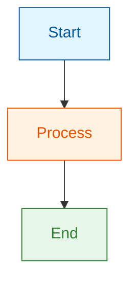

# Formatting Standards

Universal formatting rules for all blog articles on marvinzhang.dev.

## MDX Syntax Requirements

### Frontmatter
```yaml
---
slug: article-slug
title: "Article Title"
authors: ["marvin"]
tags: ["tag1", "tag2"]
date: YYYY-MM-DD
unlisted: true  # Remove when ready to publish
---
```

### Comments
Use JSX-style comments, not HTML:
```markdown
{/* This is correct */}
<!-- This is WRONG in MDX -->
```

### Truncate Marker
Add after introduction to control blog list previews:
```markdown
{/* truncate */}
```

### Admonitions
```markdown
:::note Title
Content here
:::

:::tip
Helpful tip content
:::

:::warning
Warning content
:::

:::info Related Reading
For more on this topic, see [Previous Article](/blog/slug)
:::
```

## Bold Formatting (Critical for Chinese)

### Multiple Bold Sections
When using multiple bold sections on the same line in Chinese, add a space before the second `**`:

```markdown
✅ Correct: 这与 **语法属性（Syntactic Properties）** 形成对比
❌ Wrong: 这与**语法属性（Syntactic Properties）**形成对比
```

### Bold with Quotes
Add spaces inside bold markers when text contains quotes:

```markdown
✅ Correct: ** "所有程序行为" ** 是一个语义属性
❌ Wrong: **"所有程序行为"** 是一个语义属性
```

### Validation
Run before committing Chinese articles:
```bash
pnpm run validate:zh-bold-source       # Check for issues
pnpm run validate:zh-bold-source:fix   # Auto-fix issues
```

## Mermaid Diagrams

### Theme-Aware Styling
Always style nodes with explicit colors for light/dark mode compatibility:

```markdown

```

### Semantic Colors
| Purpose | Fill | Stroke | Use For |
|---------|------|--------|---------|
| Info/Neutral | `#e1f5fe` | `#01579b` | Starting points, inputs |
| Warning | `#fff3e0` | `#e65100` | Caution, processing |
| Success | `#e8f5e9` | `#2e7d32` | Completion, positive outcomes |
| Error | `#ffebee` | `#c62828` | Failures, negative states |
| Highlight | `#f3e5f5` | `#7b1fa2` | Key concepts, emphasis |

### Diagram Guidelines
- Keep diagrams focused (≤12 nodes)
- Label edges clearly
- Use flowchart for processes, sequence for interactions, state for lifecycles

## Tables

### When to Use Tables
- Feature comparisons
- Pros/cons lists
- Configuration options
- Parameter explanations
- Decision matrices

### Table Format
```markdown
| Feature | Option A | Option B |
|---------|----------|----------|
| Speed   | Fast     | Slow     |
| Cost    | High     | Low      |
```

## Code Blocks

### Minimal Code Policy
- Use code sparingly—prefer diagrams and conceptual explanations
- Maximum 10 lines per code block (unless absolutely necessary)
- Always include syntax highlighting language

### Code Block Format
```markdown
```typescript
// Brief, focused example
const result = await fetchData(id);
```
```

### When Code is Appropriate
- Syntax is the learning point itself
- Configuration examples (5-10 lines)
- API usage patterns
- Cannot be explained better with a diagram

## Section Structure

### Word Count Targets
| Section Type | Words | Purpose |
|--------------|-------|---------|
| Introduction | 300-500 | Hook + context + roadmap |
| Main Section | 600-1000 | One concept with depth |
| Conclusion | 250-400 | Summary + takeaways |

### Section Components
Each main section should include:
- Clear H2 heading
- Opening hook or context
- Core concept (bolded at first mention)
- Visual element (diagram/table when helpful)
- Transition to next section

## Links and References

### Inline Links
- Add at first mention of external concepts
- Prefer official documentation
- Use descriptive anchor text (not "click here")

```markdown
✅ [React's concurrent rendering](https://react.dev/...) improves...
❌ Click [here](https://react.dev/...) for more.
```

### Internal References
Link to previous blog posts when relevant:
```markdown
As explored in [my previous analysis](/blog/software-complexity)...

:::info Related Reading
For deeper coverage, see [Understanding Complexity](/blog/software-complexity)
:::
```

### Link Density
- 1-2 links per paragraph maximum
- Avoid overlinking common terms
