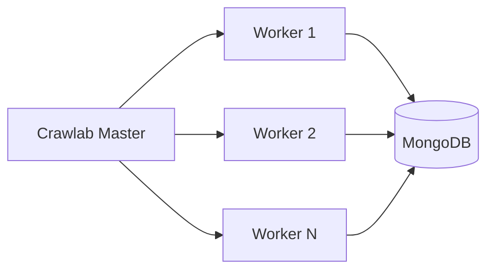

# Announcement Writing Style

Concise updates for project releases, new features, and significant milestones.

## When to Use

- Project/product releases
- Major feature announcements  
- Version updates with breaking changes
- Milestone celebrations
- Open source project updates

**Example topics**: "Crawlab 2.0 Released", "Introducing Dark Mode", "10,000 GitHub Stars: Thank You"

## Workflow: 2-Stage Process

```
Writing → Refine
```

1. **Writing** (1 session): Draft directly from feature knowledge
2. **Refine** (1 session): Polish messaging, verify links, optimize CTA

*No research or extensive outlining—you know what you're announcing.*

## Core Characteristics

### Lead with the News
Don't bury the headline:

```markdown
❌ Build-up: "For the past six months, our team has been working hard on..."

✅ Direct: "Crawlab 2.0 is here. Distributed crawling, 3x faster scheduling, 
and a completely redesigned UI."
```

### Feature Highlights, Not Exhaustive Lists
Focus on what matters most to users:

```markdown
## What's New

### Distributed Crawling
Deploy spiders across multiple nodes with automatic load balancing. 
No more bottlenecks on single machines.

### Real-Time Monitoring  
Watch your crawlers in action with live logs, request rates, and error tracking.

### One-Click Deployment
Ship to production with `crawlab deploy`. No Docker expertise required.
```

### Clear Call-to-Action
Tell readers exactly what to do next:

```markdown
## Get Started

```bash
npm install -g crawlab-cli@2.0
crawlab init my-project
```

[Read the Migration Guide →](/docs/migration-v2)  
[View Full Changelog →](https://github.com/crawlab-team/crawlab/releases/tag/v2.0.0)
```

### Acknowledge the Community
For open source projects, thank contributors:

```markdown
## Thank You

This release includes contributions from 47 community members. Special thanks to 
@contributor1, @contributor2, and @contributor3 for their substantial work on 
the new scheduling system.
```

## Structure Template

### Headline + Hook (50-100 words)
- What's being announced
- Why it matters (one sentence)
- Version/date if relevant

```markdown
# Crawlab 2.0: Distributed Crawling for Everyone

After a year of development and feedback from 500+ beta testers, Crawlab 2.0 
is ready. This release brings distributed architecture, real-time monitoring, 
and a complete UI overhaul.
```

### Key Features (200-400 words)
- 3-5 headline features
- Brief description + benefit for each
- Screenshot or diagram for visual features

### Getting Started (100-200 words)
- Installation/upgrade commands
- Link to docs
- Migration notes if breaking changes

### Additional Info (100-200 words)
- Full changelog link
- Community acknowledgment
- What's next / roadmap preview

## Visual Strategy

### Screenshots for UI Changes
Show, don't tell:

```markdown
## New Dashboard


The redesigned dashboard shows all your spiders at a glance—status, last run, 
success rate, and next scheduled execution.
```

### Feature Comparison Tables
For upgrades with significant changes:

| Feature | v1.x | v2.0 |
|---------|------|------|
| Max concurrent spiders | 10 | Unlimited |
| Distributed deployment | ❌ | ✅ |
| Real-time logs | Polling | WebSocket |
| Setup time | ~30 min | ~5 min |

### Architecture Diagrams
For technical audiences:



## Tone Guidelines

### Excited but Not Hyperbolic
```markdown
❌ "Revolutionary breakthrough that will transform web scraping forever!"
✅ "A major release that makes distributed crawling accessible to small teams."
```

### Grateful and Humble
```markdown
"This release wouldn't exist without our community. Your bug reports, feature 
requests, and patience during the beta shaped every aspect of 2.0."
```

### Forward-Looking
```markdown
"2.0 is a foundation. Next quarter, we're tackling browser automation and 
headless Chrome integration. Follow our roadmap for updates."
```

## For Breaking Changes

### Be Direct About Impact
```markdown
## ⚠️ Breaking Changes

**Configuration format changed.** The `spider.config.json` schema is incompatible 
with v1.x. Run `crawlab migrate` to update automatically.

**Minimum Node version bumped to 18.** If you're on Node 16, upgrade before 
installing Crawlab 2.0.
```

### Provide Migration Path
```markdown
## Upgrading from v1.x

1. Back up your data: `crawlab backup`
2. Run migration: `crawlab migrate`
3. Review changes: `crawlab diff`
4. Deploy: `crawlab deploy`

[Full Migration Guide →](/docs/migration-v2)
```

## Quality Gates (Announcement-Specific)

- [ ] Headline clearly states what's new
- [ ] Key features (3-5) highlighted prominently
- [ ] Clear call-to-action with commands/links
- [ ] Breaking changes clearly marked
- [ ] Links verified (docs, changelog, repo)
- [ ] Visuals for UI changes
- [ ] Community acknowledgment (for OSS)
- [ ] Concise—can be read in 2-3 minutes

## Example

### Before (Buried Lead)
> "Over the past several months, our team has been working diligently on improving 
> Crawlab. We've listened to your feedback and made many enhancements. Today, we're 
> pleased to announce that version 2.0 is now available for download. This version 
> includes distributed architecture support, a new monitoring dashboard, and various 
> performance improvements."

### After (Direct Announcement)
> # Crawlab 2.0: Distributed Crawling Is Here
>
> Deploy crawlers across unlimited nodes. Watch them run in real-time. Ship to 
> production in one command.
>
> ```bash
> npm install -g crawlab-cli@2.0
> ```
>
> **What's new:**
> - 🌐 **Distributed architecture** — Scale horizontally with automatic load balancing
> - 📊 **Real-time monitoring** — Live logs, request rates, and error tracking  
> - 🚀 **One-click deployment** — `crawlab deploy` handles everything
>
> [Get Started →](/docs/quickstart) · [Migration Guide →](/docs/migration) · [Full Changelog →](https://github.com/...)
