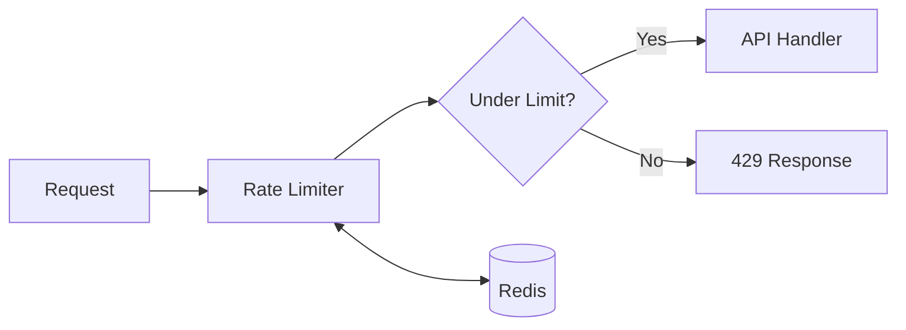

# Tutorial Writing Style

Step-by-step practical guides that help readers build something real.

## When to Use

- How-to guides with concrete outcomes
- Implementation walkthroughs
- Tool/framework getting started guides
- Problem-solving recipes
- Best practices demonstrations

**Example topics**: "Building a Custom React Hook", "Setting Up GitHub Actions CI/CD", "Implementing Rate Limiting with Redis"

## Workflow: 3-Stage Process

```
Outline → Writing → Refine
```

1. **Outline** (1 session): Steps, prerequisites, expected outcome
2. **Writing** (2-4 sessions): Step-by-step with code and validation
3. **Refine** (1 session): Test all steps, improve clarity

*No deep research phase needed—you already know the implementation.*

## Core Characteristics

### Action-Oriented Structure
Every section drives toward a tangible outcome:

```markdown
## Step 3: Configure the Database Connection

By the end of this step, your app will connect to PostgreSQL and run migrations.
```

### Clear Prerequisites
State what readers need upfront:

```markdown
## Prerequisites

- Node.js 18+ installed
- Basic familiarity with TypeScript
- A PostgreSQL database (local or cloud)
- 30 minutes of focused time
```

### Testable Checkpoints
Include verification after each major step:

```markdown
## Verify It Works

Run the following command:
```bash
npm run test:db
```

You should see:
```
✓ Database connection successful
✓ Migrations applied (3 tables)
```

If you see errors, check [Troubleshooting](#troubleshooting).
```

### Error Handling
Anticipate common problems:

```markdown
:::warning Common Issue
If you see `ECONNREFUSED`, your database isn't running. 
Start it with `docker compose up -d postgres`.
:::
```

## Structure Template

### Introduction (200-400 words)
- **What we're building**: Concrete outcome in one sentence
- **Why it matters**: Problem this solves
- **Time estimate**: How long it takes
- **Prerequisites**: What readers need

```markdown
In this tutorial, you'll build a rate limiter that protects your API from abuse.
By the end, you'll have a working Redis-based solution handling 10,000 requests/second.

**Time**: 25 minutes
**You'll need**: Node.js 18+, Redis running locally, basic Express knowledge
```

### Steps (400-800 words each)
Each step:
- Clear action heading ("Set Up the Project", not "Project Setup")
- Brief context (why this step matters)
- Code or commands
- Explanation of key parts
- Verification checkpoint

### Conclusion (200-300 words)
- What we built (recap)
- Where to go next (extensions, advanced topics)
- Links to full code/repo

## Code Strategy

### More Code, Well-Explained
Unlike analytical articles, tutorials can be code-heavy—but every block needs context:

```markdown
Create the rate limiter middleware:

```typescript
// middleware/rateLimiter.ts
import Redis from 'ioredis';

const redis = new Redis(process.env.REDIS_URL);

export async function rateLimiter(req, res, next) {
  const key = `rate:${req.ip}`;
  const current = await redis.incr(key);
  
  // First request sets the expiry window
  if (current === 1) {
    await redis.expire(key, 60); // 60-second window
  }
  
  if (current > 100) {
    return res.status(429).json({ error: 'Too many requests' });
  }
  
  next();
}
```

**Key points:**
- We use the client IP as the rate limit key
- `incr` atomically increments and returns the new count
- The 60-second window resets after the key expires
- 100 requests per minute is a reasonable starting point
```

### Complete, Runnable Examples
Prefer full working code over snippets:

```markdown
❌ Snippet (hard to use):
```js
const result = await cache.get(key);
```

✅ Complete (copy-paste ready):
```js
// cache.js
import Redis from 'ioredis';

const redis = new Redis(process.env.REDIS_URL);

export async function getFromCache(key) {
  const cached = await redis.get(key);
  return cached ? JSON.parse(cached) : null;
}

export async function setInCache(key, value, ttlSeconds = 3600) {
  await redis.setex(key, ttlSeconds, JSON.stringify(value));
}
```
```

### Progressive Building
Build on previous steps:

```markdown
Step 1: Create the base middleware → working but basic
Step 2: Add Redis storage → persistent across restarts  
Step 3: Add sliding window → more accurate limiting
Step 4: Add per-route limits → fine-grained control
```

## Visual Strategy

### Diagrams for Architecture
Show how components connect:



### Tables for Options/Config
Explain configuration clearly:

| Option | Default | Description |
|--------|---------|-------------|
| `windowMs` | 60000 | Time window in milliseconds |
| `max` | 100 | Max requests per window |
| `keyGenerator` | `req.ip` | Function to generate rate limit key |

## Tone Guidelines

### Encouraging and Clear
- Assume readers are capable but unfamiliar with this specific topic
- Celebrate progress ("Great! Your database is now connected.")
- Normalize confusion ("This part trips up many developers at first.")

### Direct Instructions
Use imperative mood:

```markdown
❌ "You might want to create a new file..."
✅ "Create a new file called `rateLimiter.ts`:"
```

### Avoid
- Assuming too much prior knowledge
- Skipping "obvious" steps (they're not obvious to beginners)
- Long theoretical explanations before hands-on work
- Untested code examples

## Quality Gates (Tutorial-Specific)

- [ ] All code examples tested and working
- [ ] Prerequisites clearly listed
- [ ] Time estimate provided
- [ ] Each step has verification checkpoint
- [ ] Common errors addressed
- [ ] Complete working code available (repo link)
- [ ] Screenshots for UI steps (if applicable)

## Example Opening

### Before (Generic)
> "In this tutorial, we'll learn about rate limiting. Rate limiting is important 
> because it prevents abuse of your API."

### After (Tutorial)
> "Your API is getting hammered. One user sent 50,000 requests in a minute, and 
> now everyone's experience is degraded. Let's fix that.
>
> In 25 minutes, you'll build a Redis-backed rate limiter that handles 10,000 
> requests/second and gracefully rejects abuse. We'll start with a basic 
> implementation and progressively add sliding windows and per-route limits."
